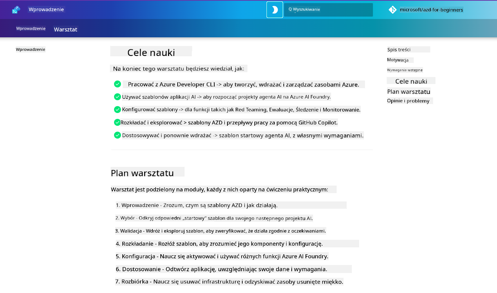

<!--
CO_OP_TRANSLATOR_METADATA:
{
  "original_hash": "9cc966416ab431c38b2ab863884b196c",
  "translation_date": "2025-09-24T10:43:09+00:00",
  "source_file": "workshop/README.md",
  "language_code": "pl"
}
-->
# AZD dla Warsztatu Twórców AI

Witamy w praktycznym warsztacie poświęconym nauce Azure Developer CLI (AZD) z naciskiem na wdrażanie aplikacji AI. Ten warsztat pomoże Ci zdobyć praktyczną wiedzę na temat szablonów AZD w 3 krokach:

1. **Odkrywanie** - znajdź szablon odpowiedni dla siebie.
1. **Wdrażanie** - wdrożenie i weryfikacja działania.
1. **Dostosowywanie** - modyfikacja i iteracja, aby uczynić go swoim!

Podczas warsztatu zostaniesz również wprowadzony w podstawowe narzędzia i przepływy pracy dla programistów, które pomogą Ci usprawnić proces rozwoju od początku do końca.

<br/>

## Przewodnik w przeglądarce

Lekcje warsztatowe są zapisane w formacie Markdown. Możesz je przeglądać bezpośrednio na GitHubie lub uruchomić podgląd w przeglądarce, jak pokazano na poniższym zrzucie ekranu.



Aby skorzystać z tej opcji, zrób fork repozytorium na swoim profilu i uruchom GitHub Codespaces. Gdy terminal VS Code będzie aktywny, wpisz następujące polecenie:

```bash title="" linenums="0"
mkdocs serve > /dev/null 2>&1 &
```

Po kilku sekundach pojawi się okno dialogowe. Wybierz opcję `Open in browser`. Przewodnik w przeglądarce otworzy się teraz w nowej karcie. Korzyści z tego podglądu:

1. **Wbudowane wyszukiwanie** - szybko znajdź słowa kluczowe lub lekcje.
1. **Ikona kopiowania** - najedź na bloki kodu, aby zobaczyć tę opcję.
1. **Przełączanie motywu** - zmieniaj między motywami ciemnym i jasnym.
1. **Uzyskaj pomoc** - kliknij ikonę Discord w stopce, aby dołączyć!

<br/>

## Przegląd warsztatu

**Czas trwania:** 3-4 godziny  
**Poziom:** Początkujący do średniozaawansowany  
**Wymagania wstępne:** Znajomość Azure, koncepcji AI, VS Code i narzędzi wiersza poleceń.

To praktyczny warsztat, w którym uczysz się poprzez działanie. Po ukończeniu ćwiczeń zalecamy zapoznanie się z programem AZD dla początkujących, aby kontynuować naukę w zakresie najlepszych praktyk dotyczących bezpieczeństwa i produktywności.

| Czas | Moduł  | Cel |
|:---|:---|:---|
| 15 min | [Wprowadzenie](docs/instructions/0-Introduction.md) | Ustaw scenę, zrozum cele |
| 30 min | [Wybór szablonu AI](docs/instructions/1-Select-AI-Template.md) | Przegląd opcji i wybór szablonu startowego | 
| 30 min | [Weryfikacja szablonu AI](docs/instructions/2-Validate-AI-Template.md) | Wdrożenie domyślnego rozwiązania na Azure |
| 30 min | [Rozbiórka szablonu AI](docs/instructions/3-Deconstruct-AI-Template.md) | Przegląd struktury i konfiguracji |
| 30 min | [Konfiguracja szablonu AI](docs/instructions/4-Configure-AI-Template.md) | Aktywacja i testowanie dostępnych funkcji |
| 30 min | [Dostosowanie szablonu AI](docs/instructions/5-Customize-AI-Template.md) | Adaptacja szablonu do własnych potrzeb |
| 30 min | [Usunięcie infrastruktury](docs/instructions/6-Teardown-Infrastructure.md) | Sprzątanie i zwolnienie zasobów |
| 15 min | [Podsumowanie i kolejne kroki](docs/instructions/7-Wrap-up.md) | Zasoby edukacyjne, wyzwanie warsztatowe |

<br/>

## Czego się nauczysz

Traktuj szablon AZD jako piaskownicę edukacyjną do eksploracji różnych możliwości i narzędzi dla kompleksowego rozwoju na Azure AI Foundry. Po zakończeniu warsztatu powinieneś mieć intuicyjne zrozumienie różnych narzędzi i koncepcji w tym kontekście.

| Koncepcja  | Cel |
|:---|:---|
| **Azure Developer CLI** | Zrozumienie poleceń narzędzia i przepływów pracy |
| **Szablony AZD**| Zrozumienie struktury projektu i konfiguracji |
| **Agent Azure AI**| Tworzenie i wdrażanie projektu Azure AI Foundry |
| **Azure AI Search**| Włącz inżynierię kontekstową z agentami |
| **Obserwowalność**| Eksploracja śledzenia, monitorowania i ewaluacji |
| **Testy Red Teaming**| Eksploracja testów przeciwdziałania i ich ograniczeń |

<br/>

## Struktura warsztatu

Warsztat jest zaprojektowany jako podróż od odkrywania szablonów, przez wdrażanie, rozbiórkę i dostosowywanie - z wykorzystaniem oficjalnego szablonu startowego [Getting Started with AI Agents](https://github.com/Azure-Samples/get-started-with-ai-agents).

### [Moduł 1: Wybór szablonu AI](docs/instructions/1-Select-AI-Template.md) (30 min)

- Czym są szablony AI?
- Gdzie mogę znaleźć szablony AI?
- Jak mogę zacząć budować agentów AI?
- **Lab**: Szybki start z GitHub Codespaces

### [Moduł 2: Weryfikacja szablonu AI](docs/instructions/2-Validate-AI-Template.md) (30 min)

- Jaka jest architektura szablonu AI?
- Jaki jest przepływ pracy rozwoju AZD?
- Jak mogę uzyskać pomoc w rozwoju AZD?
- **Lab**: Wdrożenie i weryfikacja szablonu agentów AI

### [Moduł 3: Rozbiórka szablonu AI](docs/instructions/3-Deconstruct-AI-Template.md) (30 min)

- Eksploracja środowiska w `.azure/` 
- Eksploracja konfiguracji zasobów w `infra/` 
- Eksploracja konfiguracji AZD w `azure.yaml`
- **Lab**: Modyfikacja zmiennych środowiskowych i ponowne wdrożenie

### [Moduł 4: Konfiguracja szablonu AI](docs/instructions/4-Configure-AI-Template.md) (30 min)
- Eksploracja: Retrieval Augmented Generation
- Eksploracja: Ocena agentów i testy Red Teaming
- Eksploracja: Śledzenie i monitorowanie
- **Lab**: Eksploracja agenta AI + obserwowalność 

### [Moduł 5: Dostosowanie szablonu AI](docs/instructions/5-Customize-AI-Template.md) (30 min)
- Definicja: PRD z wymaganiami scenariusza
- Konfiguracja: Zmienne środowiskowe dla AZD
- Implementacja: Lifecycle Hooks dla dodatkowych zadań
- **Lab**: Dostosowanie szablonu do mojego scenariusza

### [Moduł 6: Usunięcie infrastruktury](docs/instructions/6-Teardown-Infrastructure.md) (30 min)
- Podsumowanie: Czym są szablony AZD?
- Podsumowanie: Dlaczego warto używać Azure Developer CLI?
- Kolejne kroki: Wypróbuj inny szablon!
- **Lab**: Usunięcie infrastruktury i sprzątanie

<br/>

## Wyzwanie warsztatowe

Chcesz się sprawdzić i zrobić więcej? Oto kilka propozycji projektów - lub podziel się swoimi pomysłami z nami!

| Projekt | Opis |
|:---|:---|
|1. **Rozbiórka złożonego szablonu AI** | Użyj przepływu pracy i narzędzi, które omówiliśmy, i sprawdź, czy możesz wdrożyć, zweryfikować i dostosować inny szablon rozwiązania AI. _Czego się nauczyłeś?_|
|2. **Dostosowanie do swojego scenariusza**  | Spróbuj napisać PRD (Product Requirements Document) dla innego scenariusza. Następnie użyj GitHub Copilot w repozytorium szablonu w trybie Agent Model - i poproś go o wygenerowanie przepływu pracy dostosowania dla Ciebie. _Czego się nauczyłeś? Jak możesz poprawić te sugestie?_|
| | |

## Masz uwagi?

1. Zgłoś problem w tym repozytorium - oznacz go `Workshop` dla wygody.
1. Dołącz do Discorda Azure AI Foundry - połącz się z innymi uczestnikami!

| | | 
|:---|:---|
| **📚 Strona główna kursu**| [AZD dla początkujących](../README.md)|
| **📖 Dokumentacja** | [Rozpocznij pracę z szablonami AI](https://learn.microsoft.com/en-us/azure/ai-foundry/how-to/develop/ai-template-get-started)|
| **🛠️ Szablony AI** | [Szablony Azure AI Foundry](https://ai.azure.com/templates) |
|**🚀 Kolejne kroki** | [Podejmij wyzwanie](../../../workshop) |
| | |

<br/>

---

**Poprzednie:** [Przewodnik rozwiązywania problemów AI](../docs/troubleshooting/ai-troubleshooting.md) | **Następne:** Rozpocznij od [Lab 1: Podstawy AZD](../../../workshop/lab-1-azd-basics)

**Gotowy do rozpoczęcia budowy aplikacji AI z AZD?**

[Rozpocznij Lab 1: Podstawy AZD →](./lab-1-azd-basics/README.md)

---

