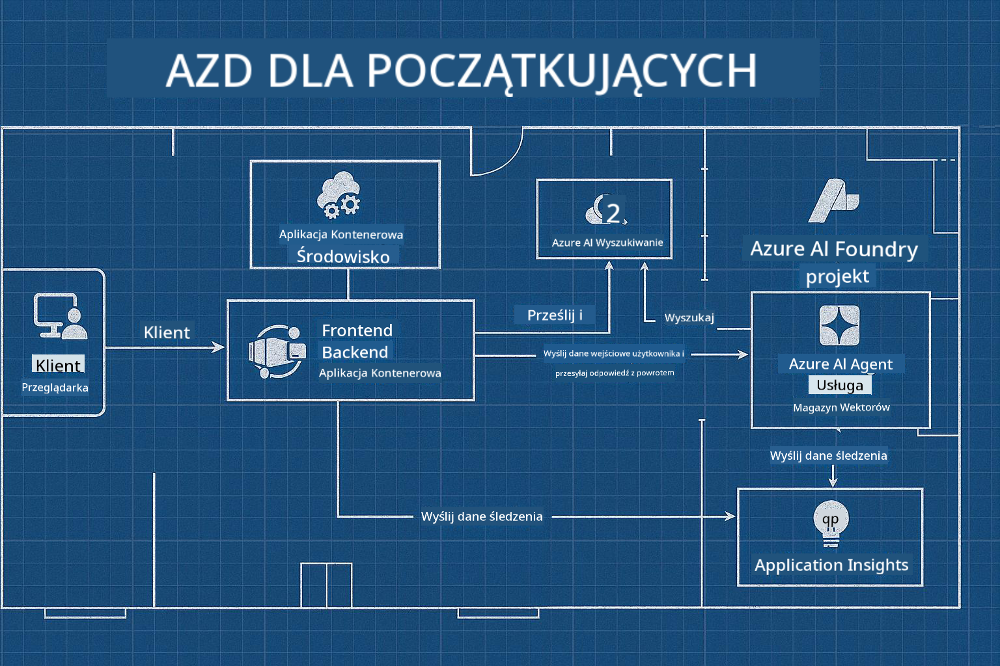

<!--
CO_OP_TRANSLATOR_METADATA:
{
  "original_hash": "245d24997bbcf2bae93bb2a503845d37",
  "translation_date": "2025-09-23T11:53:23+00:00",
  "source_file": "workshop/README.md",
  "language_code": "pl"
}
-->
# Warsztaty AZD dla Twórców AI

## Szablony AZD

Tworzenie rozwiązania AI klasy korporacyjnej dla konkretnego scenariusza przypomina budowę własnego domu. Możesz zaprojektować go samodzielnie, budować cegła po cegle i wziąć odpowiedzialność za to, aby spełniał wszystkie wytyczne dotyczące zarządzania i rozwoju.

**ALBO ....**

Możesz współpracować z architektem, który dostarczy Ci _plan_ domu startowego, a następnie pomoże go _dostosować_ do Twoich potrzeb. Dzięki temu możesz skupić się na tym, co czyni **Twój dom** wyjątkowym, a eksperci zajmą się instalacjami, hydrauliką i innymi zależnościami.

**To właśnie podejście stojące za [Szablonami Aplikacji AI](https://ai.azure.com/templates)** - serią planów do budowy różnych rodzajów "domów" aplikacji AI, w zależności od Twoich kluczowych potrzeb i zależności.

## Dostosowanie Szablonów

Szablony zostały zaprojektowane do współpracy z [Azure AI Foundry](https://ai.azure.com). Możesz myśleć o tej platformie jak o swoim "wykonawcy budowlanym", który ma dostęp do wszystkich zasobów, narzędzi i wiedzy potrzebnej do realizacji projektu!

Wystarczy, że wybierzesz [swój szablon startowy](https://learn.microsoft.com/en-us/azure/ai-foundry/how-to/develop/ai-template-get-started). Na przykład skupimy się na szablonie _Get Started with AI Agents_, aby zbudować "Agentowy Dom AI", który będzie wyposażony w funkcje takie jak AI Search, Red Teaming, Ewaluacje, Śledzenie, Monitorowanie i wiele więcej!



Wystarczy zarezerwować czas z architektem, który poprowadzi Cię przez proces dostosowywania. [GitHub Copilot for Azure](https://learn.microsoft.com/en-us/azure/developer/github-copilot-azure/get-started) może być Twoim przewodnikiem. Wystarczy "porozmawiać z nim", aby:

- Dowiedzieć się więcej o funkcjach Azure w Twoim szablonie
- Wdrażać zasoby Azure
- Uzyskać informacje o wdrożeniu
- Diagnozować i rozwiązywać problemy!

Podczas tych warsztatów nauczymy się _rozbierać_ istniejący szablon (aby dowiedzieć się, co oferuje), a następnie _dostosowywać_ go (aby spełniał nasze wymagania) - krok po kroku.

Szablony AI **sprawiają, że to działa** - kończąc warsztaty, nauczysz się, jak sprawić, by były **Twoje własne**.

----

**Nawigacja po warsztatach**
- **📚 Strona główna kursu**: [AZD dla początkujących](../README.md)
- **📖 Powiązane rozdziały**: Obejmuje [Rozdział 1](../README.md#-chapter-1-foundation--quick-start), [Rozdział 2](../README.md#-chapter-2-ai-first-development-recommended-for-ai-developers) i [Rozdział 5](../README.md#-chapter-5-multi-agent-ai-solutions-advanced)
- **🛠️ Laboratorium praktyczne**: [Laboratorium warsztatowe AI](../docs/ai-foundry/ai-workshop-lab.md)
- **🚀 Kolejne kroki**: [Moduły warsztatowe](../../../workshop)

Witamy na warsztatach praktycznych dotyczących nauki Azure Developer CLI (AZD) z naciskiem na wdrażanie aplikacji AI. Warsztaty te mają na celu przeprowadzenie Cię od podstaw AZD do wdrażania gotowych do produkcji rozwiązań AI.

## Przegląd warsztatów

**Czas trwania:** 2-3 godziny  
**Poziom:** Początkujący do średniozaawansowanego  
**Wymagania wstępne:** Podstawowa znajomość Azure, narzędzi wiersza poleceń i koncepcji AI

### Czego się nauczysz

- **Podstawy AZD**: Zrozumienie infrastruktury jako kodu z AZD
- 🤖 **Integracja usług AI**: Wdrażanie Azure OpenAI, AI Search i innych usług AI
- **Wdrażanie kontenerów**: Korzystanie z Azure Container Apps dla aplikacji AI
- **Najlepsze praktyki bezpieczeństwa**: Wdrażanie Managed Identity i bezpiecznych konfiguracji
- **Monitorowanie i obserwowalność**: Konfigurowanie Application Insights dla obciążeń AI
- **Wzorce produkcyjne**: Strategie wdrażania gotowe dla przedsiębiorstw

## Struktura warsztatów

### Moduł 1: Podstawy AZD (30 minut)
- Instalacja i konfiguracja AZD
- Zrozumienie struktury projektu AZD
- Twoje pierwsze wdrożenie AZD
- **Laboratorium**: Wdrażanie prostej aplikacji internetowej

### Moduł 2: Integracja Azure OpenAI (45 minut)
- Konfigurowanie zasobów Azure OpenAI
- Strategie wdrażania modeli
- Konfigurowanie dostępu do API i uwierzytelniania
- **Laboratorium**: Wdrażanie aplikacji czatu z GPT-4

### Moduł 3: Aplikacje RAG (45 minut)
- Integracja Azure AI Search
- Przetwarzanie dokumentów z Azure Document Intelligence
- Wektoryzacja i wyszukiwanie semantyczne
- **Laboratorium**: Budowa systemu Q&A dla dokumentów

### Moduł 4: Wdrożenie produkcyjne (30 minut)
- Konfiguracja aplikacji kontenerowych
- Optymalizacja wydajności i skalowanie
- Monitorowanie i logowanie
- **Laboratorium**: Wdrażanie do produkcji z obserwowalnością

### Moduł 5: Zaawansowane wzorce (15 minut)
- Wdrożenia w wielu środowiskach
- Integracja CI/CD
- Strategie optymalizacji kosztów
- **Podsumowanie**: Lista kontrolna gotowości produkcyjnej

## Wymagania wstępne

### Wymagane narzędzia

Zainstaluj te narzędzia przed warsztatami:

```bash
# Azure Developer CLI
curl -fsSL https://aka.ms/install-azd.sh | bash

# Azure CLI
curl -sL https://aka.ms/InstallAzureCLIDeb | sudo bash

# Git
sudo apt-get install git

# Docker
curl -fsSL https://get.docker.com -o get-docker.sh
sudo sh get-docker.sh

# Python 3.10+
sudo apt-get install python3.10 python3.10-venv python3-pip
```

### Konfiguracja konta Azure

1. **Subskrypcja Azure**: [Zarejestruj się za darmo](https://azure.microsoft.com/free/)
2. **Dostęp do Azure OpenAI**: [Poproś o dostęp](https://aka.ms/oai/access)
3. **Wymagane uprawnienia**:
   - Rola Contributor na subskrypcji lub grupie zasobów
   - User Access Administrator (dla przypisań RBAC)

### Weryfikacja wymagań wstępnych

Uruchom ten skrypt, aby zweryfikować konfigurację:

```bash
#!/bin/bash
echo "Verifying workshop prerequisites..."

# Check AZD installation
if command -v azd &> /dev/null; then
    echo "✅ Azure Developer CLI: $(azd --version)"
else
    echo "❌ Azure Developer CLI not found"
fi

# Check Azure CLI
if command -v az &> /dev/null; then
    echo "✅ Azure CLI: $(az --version | head -n1)"
else
    echo "❌ Azure CLI not found"
fi

# Check Docker
if command -v docker &> /dev/null; then
    echo "✅ Docker: $(docker --version)"
else
    echo "❌ Docker not found"
fi

# Check Python
if command -v python3 &> /dev/null; then
    echo "✅ Python: $(python3 --version)"
else
    echo "❌ Python 3 not found"
fi

# Check Azure login
if az account show &> /dev/null; then
    echo "✅ Azure: Logged in as $(az account show --query user.name -o tsv)"
else
    echo "❌ Azure: Not logged in (run 'az login')"
fi

echo "Setup verification complete!"
```

## Materiały warsztatowe

### Ćwiczenia laboratoryjne

Każdy moduł zawiera praktyczne laboratoria z kodem startowym i instrukcjami krok po kroku:

- **[lab-1-azd-basics/](../../../workshop/lab-1-azd-basics)** - Twoje pierwsze wdrożenie AZD
- **[lab-2-openai-chat/](../../../workshop/lab-2-openai-chat)** - Aplikacja czatu z Azure OpenAI
- **[lab-3-rag-search/](../../../workshop/lab-3-rag-search)** - Aplikacja RAG z AI Search
- **[lab-4-production/](../../../workshop/lab-4-production)** - Wzorce wdrażania produkcyjnego
- **[lab-5-advanced/](../../../workshop/lab-5-advanced)** - Zaawansowane scenariusze wdrażania

### Materiały referencyjne

- **[Przewodnik integracji AI Foundry](../docs/ai-foundry/azure-ai-foundry-integration.md)** - Kompleksowe wzorce integracji
- **[Przewodnik wdrażania modeli AI](../docs/ai-foundry/ai-model-deployment.md)** - Najlepsze praktyki wdrażania modeli
- **[Praktyki produkcyjne AI](../docs/ai-foundry/production-ai-practices.md)** - Wzorce wdrażania dla przedsiębiorstw
- **[Przewodnik rozwiązywania problemów AI](../docs/troubleshooting/ai-troubleshooting.md)** - Typowe problemy i rozwiązania

### Przykładowe szablony

Szablony startowe dla typowych scenariuszy AI:

```
workshop/templates/
├── minimal-chat/          # Basic OpenAI chat app
├── rag-application/       # RAG with AI Search
├── multi-model/          # Multiple AI services
└── production-ready/     # Enterprise template
```

## Rozpoczęcie pracy

### Opcja 1: GitHub Codespaces (zalecane)

Najszybszy sposób na rozpoczęcie warsztatów:

[](https://github.com/codespaces/new?hide_repo_select=true&ref=main&repo=YOUR_REPO_ID)

### Opcja 2: Rozwój lokalny

1. **Sklonuj repozytorium warsztatowe:**
```bash
git clone https://github.com/YOUR_ORG/AZD-for-beginners.git
cd AZD-for-beginners/workshop
```

2. **Zaloguj się do Azure:**
```bash
az login
azd auth login
```

3. **Rozpocznij od Laboratorium 1:**
```bash
cd lab-1-azd-basics
cat README.md  # Follow the instructions
```

### Opcja 3: Warsztaty prowadzone przez instruktora

Jeśli uczestniczysz w sesji prowadzonej przez instruktora:

- 🎥 **Nagranie warsztatów**: [Dostępne na żądanie](https://aka.ms/azd-ai-workshop)
- 💬 **Społeczność Discord**: [Dołącz, aby uzyskać wsparcie na żywo](https://aka.ms/foundry/discord)
- **Opinie o warsztatach**: [Podziel się swoimi wrażeniami](https://aka.ms/azd-workshop-feedback)

## Harmonogram warsztatów

### Nauka we własnym tempie (3 godziny)

```
⏰ 00:00 - 00:30  Module 1: AZD Foundations
⏰ 00:30 - 01:15  Module 2: Azure OpenAI Integration
⏰ 01:15 - 02:00  Module 3: RAG Applications
⏰ 02:00 - 02:30  Module 4: Production Deployment
⏰ 02:30 - 02:45  Module 5: Advanced Patterns
⏰ 02:45 - 03:00  Q&A and Next Steps
```

### Sesja prowadzona przez instruktora (2,5 godziny)

```
⏰ 00:00 - 00:15  Welcome & Prerequisites Check
⏰ 00:15 - 00:40  Module 1: Live Demo + Lab
⏰ 00:40 - 01:20  Module 2: OpenAI Integration
⏰ 01:20 - 01:30  Break
⏰ 01:30 - 02:10  Module 3: RAG Applications
⏰ 02:10 - 02:30  Module 4: Production Patterns
⏰ 02:30 - 02:45  Module 5: Advanced Topics
⏰ 02:45 - 03:00  Q&A and Resources
```

## Kryteria sukcesu

Pod koniec tych warsztatów będziesz w stanie:

✅ **Wdrażać aplikacje AI** za pomocą szablonów AZD  
✅ **Konfigurować usługi Azure OpenAI** z odpowiednim zabezpieczeniem  
✅ **Budować aplikacje RAG** z integracją Azure AI Search  
✅ **Wdrażać wzorce produkcyjne** dla obciążeń AI w przedsiębiorstwach  
✅ **Monitorować i rozwiązywać problemy** z wdrożeniami aplikacji AI  
✅ **Stosować strategie optymalizacji kosztów** dla obciążeń AI  

## Społeczność i wsparcie

### Podczas warsztatów

- 🙋 **Pytania**: Użyj czatu warsztatowego lub podnieś rękę
- 🐛 **Problemy**: Sprawdź [przewodnik rozwiązywania problemów](../docs/troubleshooting/ai-troubleshooting.md)
- **Wskazówki**: Podziel się odkryciami z innymi uczestnikami

### Po warsztatach

- 💬 **Discord**: [Społeczność Azure AI Foundry](https://aka.ms/foundry/discord)
- **Problemy GitHub**: [Zgłoś problemy z szablonami](https://github.com/YOUR_ORG/AZD-for-beginners/issues)
- 📧 **Opinie**: [Formularz oceny warsztatów](https://aka.ms/azd-workshop-feedback)

## Kolejne kroki

### Kontynuuj naukę

1. **Zaawansowane scenariusze**: Odkryj [wdrożenia wieloregionowe](../docs/ai-foundry/production-ai-practices.md#multi-region-deployment)
2. **Integracja CI/CD**: Skonfiguruj [przepływy pracy GitHub Actions](../docs/deployment/github-actions.md)
3. **Własne szablony**: Utwórz własne [szablony AZD](../docs/getting-started/custom-templates.md)

### Zastosuj w swoich projektach

1. **Ocena**: Skorzystaj z naszej [listy kontrolnej gotowości](./production-readiness-checklist.md)
2. **Szablony**: Zacznij od naszych [szablonów specyficznych dla AI](../../../workshop/templates)
3. **Wsparcie**: Dołącz do [Discord Azure AI Foundry](https://aka.ms/foundry/discord)

### Podziel się sukcesem

- ⭐ **Oznacz repozytorium gwiazdką**, jeśli warsztaty Ci pomogły
- 🐦 **Podziel się w mediach społecznościowych** z #AzureDeveloperCLI #AzureAI
- 📝 **Napisz post na blogu** o swojej podróży wdrażania AI

---

## Opinie o warsztatach

Twoja opinia pomaga nam ulepszać doświadczenie warsztatowe:

| Aspekt | Ocena (1-5) | Komentarze |
|--------|--------------|----------|
| Jakość treści | ⭐⭐⭐⭐⭐ | |
| Laboratoria praktyczne | ⭐⭐⭐⭐⭐ | |
| Dokumentacja | ⭐⭐⭐⭐⭐ | |
| Poziom trudności | ⭐⭐⭐⭐⭐ | |
| Ogólne wrażenia | ⭐⭐⭐⭐⭐ | |

**Prześlij opinię**: [Formularz oceny warsztatów](https://aka.ms/azd-workshop-feedback)

---

**Poprzednie:** [Przewodnik rozwiązywania problemów AI](../docs/troubleshooting/ai-troubleshooting.md) | **Następne:** Rozpocznij od [Laboratorium 1: Podstawy AZD](../../../workshop/lab-1-azd-basics)

**Gotowy, aby zacząć budować aplikacje AI z AZD?**

[Rozpocznij Laboratorium 1: Podstawy AZD →](./lab-1-azd-basics/README.md)

---

