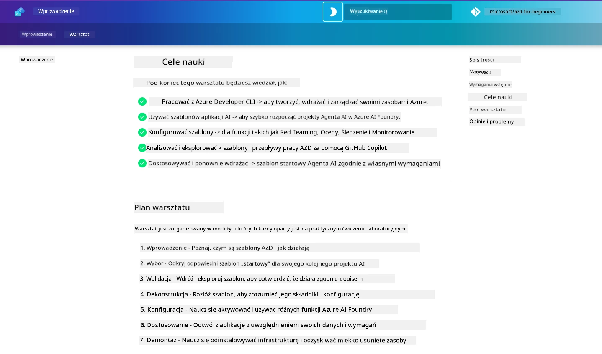

<div align="center">
  <div style="background: linear-gradient(135deg, #0078d4, #106ebe); border-radius: 10px; padding: 20px; margin: 20px 0; box-shadow: 0 4px 15px rgba(0, 120, 212, 0.3); border: 2px solid #005a9e;">
    <h2 style="color: white; margin: 0; font-size: 24px; text-shadow: 1px 1px 2px rgba(0,0,0,0.3);">
      🎯 Warsztaty AZD dla deweloperów AI
    </h2>
    <p style="color: white; margin: 10px 0 0 0; font-size: 16px; text-shadow: 1px 1px 2px rgba(0,0,0,0.3);">
      <strong>Praktyczne warsztaty dotyczące tworzenia aplikacji AI z wykorzystaniem Azure Developer CLI.</strong><br>
      Ukończ 7 modułów, aby opanować szablony AZD i przepływy pracy wdrażania AI.
    </p>
    <div style="margin-top: 15px;">
      <span style="background: rgba(255,255,255,0.2); padding: 5px 10px; border-radius: 15px; color: white; font-size: 14px;">
        📅 Ostatnia aktualizacja: marzec 2026
      </span>
    </div>
  </div>
</div>

# Warsztaty AZD dla deweloperów AI

Witamy na warsztatach praktycznych dotyczących nauki Azure Developer CLI (AZD) ze szczególnym naciskiem na wdrażanie aplikacji AI. Warsztaty te pomogą Ci zdobyć praktyczną wiedzę na temat szablonów AZD w 3 krokach:

1. **Odkrywanie** - znajdź szablon odpowiedni dla siebie.
1. **Wdrażanie** - wdroż i sprawdź, czy działa
1. **Dostosowanie** - modyfikuj i iteruj, aby dopasować do siebie!

W trakcie tych warsztatów zostaniesz również zapoznany z podstawowymi narzędziami i przepływami pracy dla deweloperów, które pomogą Ci usprawnić cały proces tworzenia oprogramowania.

<br/>

## Przewodnik w przeglądarce

Lekcje warsztatowe są w formacie Markdown. Możesz nawigować po nich bezpośrednio na GitHub lub uruchomić podgląd w przeglądarce, jak pokazano na zrzucie ekranu poniżej.



Aby skorzystać z tej opcji - forkuj repozytorium na swój profil i uruchom GitHub Codespaces. Gdy terminal VS Code się aktywuje, wpisz następujące polecenie:

Ten podgląd w przeglądarce działa w GitHub Codespaces, kontenerach deweloperskich lub lokalnym klonie z zainstalowanym Pythonem i MkDocs.

```bash title="" linenums="0"
mkdocs serve > /dev/null 2>&1 &
```

W ciągu kilku sekund pojawi się okno dialogowe. Wybierz opcję `Open in browser`. Przewodnik w przeglądarce otworzy się teraz w nowej karcie. Oto kilka zalet tego podglądu:

1. **Wbudowana wyszukiwarka** - szybko znajdź słowa kluczowe lub lekcje.
1. **Ikona kopiowania** - najedź kursorem na bloki kodu, aby zobaczyć tę opcję
1. **Przełącznik motywu** - zmieniaj między ciemnym i jasnym motywem
1. **Uzyskaj pomoc** - kliknij ikonę Discord w stopce, aby dołączyć!

<br/>

## Przegląd warsztatów

**Czas trwania:** 3-4 godziny  
**Poziom:** Początkujący do średnio zaawansowanego  
**Wymagania wstępne:** Znajomość Azure, koncepcji AI, VS Code i narzędzi wiersza poleceń.

Są to warsztaty praktyczne, na których uczysz się poprzez działanie. Po ukończeniu ćwiczeń zalecamy zapoznanie się z programem AZD For Beginners, aby kontynuować naukę najlepszych praktyk w zakresie bezpieczeństwa i produktywności.

| Czas| Moduł  | Cel |
|:---|:---|:---|
| 15 min | [Wprowadzenie](docs/instructions/0-Introduction.md) | Wprowadzenie, zrozumienie celów |
| 30 min | [Wybierz szablon AI](docs/instructions/1-Select-AI-Template.md) | Poznaj opcje i wybierz startowy | 
| 30 min | [Zweryfikuj szablon AI](docs/instructions/2-Validate-AI-Template.md) | Wdróż domyślne rozwiązanie do Azure |
| 30 min | [Zanalizuj szablon AI](docs/instructions/3-Deconstruct-AI-Template.md) | Poznaj strukturę i konfigurację |
| 30 min | [Skonfiguruj szablon AI](docs/instructions/4-Configure-AI-Template.md) | Włącz i przetestuj dostępne funkcje |
| 30 min | [Dostosuj szablon AI](docs/instructions/5-Customize-AI-Template.md) | Dostosuj szablon do swoich potrzeb |
| 30 min | [Rozbierz infrastrukturę](docs/instructions/6-Teardown-Infrastructure.md) | Sprzątanie i zwalnianie zasobów |
| 15 min | [Podsumowanie i dalsze kroki](docs/instructions/7-Wrap-up.md) | Materiały do nauki, wyzwanie warsztatowe |

<br/>

## Czego się nauczysz

Myśl o szablonie AZD jako placu zabaw do nauki, na którym możesz eksplorować różne możliwości i narzędzia do pełnego procesu tworzenia w Microsoft Foundry. Po ukończeniu tych warsztatów powinieneś mieć intuicyjne pojęcie o różnych narzędziach i koncepcjach w tym kontekście.

| Koncepcja  | Cel |
|:---|:---|
| **Azure Developer CLI** | Zrozumienie poleceń i przepływów pracy narzędzia|
| **Szablony AZD**| Zrozumienie struktury projektu i konfiguracji|
| **Azure AI Agent**| Tworzenie i wdrażanie projektu Microsoft Foundry  |
| **Azure AI Search**| Włącz inżynierię kontekstu z agentami |
| **Obserwowalność**| Poznaj śledzenie, monitorowanie i oceny |
| **Red Teaming**| Poznaj testy przeciwstawne i środki zaradcze |

<br/>

## Struktura warsztatów

Warsztaty są tak zaprojektowane, aby przeprowadzić Cię przez proces od odkrywania szablonu, przez wdrażanie, analizę, aż po dostosowywanie - bazując na oficjalnym szablonie startowym [Getting Started with AI Agents](https://github.com/Azure-Samples/get-started-with-ai-agents).

### [Moduł 1: Wybierz szablon AI](docs/instructions/1-Select-AI-Template.md) (30 min)

- Czym są szablony AI?
- Gdzie znaleźć szablony AI?
- Jak zacząć budować agentów AI?
- **Ćwiczenie:** Szybki start w Codespaces lub kontenerze deweloperskim

### [Moduł 2: Zweryfikuj szablon AI](docs/instructions/2-Validate-AI-Template.md) (30 min)

- Jaka jest architektura szablonu AI?
- Jaki jest przepływ pracy w rozwoju z AZD?
- Gdzie szukać pomocy w rozwoju z AZD?
- **Ćwiczenie:** Wdrażanie i weryfikacja szablonu agentów AI

### [Moduł 3: Zanalizuj szablon AI](docs/instructions/3-Deconstruct-AI-Template.md) (30 min)

- Przegląd środowiska w `.azure/` 
- Przegląd zasobów w `infra/` 
- Przegląd konfiguracji AZD w `azure.yaml`s
- **Ćwiczenie:** Modyfikacja zmiennych środowiskowych i ponowne wdrożenie

### [Moduł 4: Skonfiguruj szablon AI](docs/instructions/4-Configure-AI-Template.md) (30 min)
- Poznaj: Retrieval Augmented Generation
- Poznaj: Ocena agenta i Red Teaming
- Poznaj: Śledzenie i monitorowanie
- **Ćwiczenie:** Poznaj agenta AI + obserwowalność 

### [Moduł 5: Dostosuj szablon AI](docs/instructions/5-Customize-AI-Template.md) (30 min)
- Zdefiniuj: PRD ze scenariuszem wymagań
- Skonfiguruj: Zmienne środowiskowe dla AZD
- Zaimplementuj: Haki cyklu życia dla dodatkowych zadań
- **Ćwiczenie:** Dostosowanie szablonu do mojego scenariusza

### [Moduł 6: Rozbierz infrastrukturę](docs/instructions/6-Teardown-Infrastructure.md) (30 min)
- Podsumowanie: Czym są szablony AZD?
- Podsumowanie: Dlaczego używać Azure Developer CLI?
- Dalsze kroki: Wypróbuj inny szablon!
- **Ćwiczenie:** Usuwanie infrastruktury i sprzątanie

<br/>

## Wyzwanie warsztatowe

Chcesz wyzwać siebie i zrobić więcej? Oto kilka propozycji projektów - albo podziel się z nami swoimi pomysłami!

| Projekt | Opis |
|:---|:---|
|1. **Zanalizuj złożony szablon AI** | Skorzystaj z opisanego workflow i narzędzi, aby wdrożyć, zweryfikować i dostosować inny szablon rozwiązania AI. _Czego się nauczyłeś?_|
|2. **Dostosuj do swojego scenariusza**  | Spróbuj napisać PRD (Specyfikację wymagań produktu) dla innego scenariusza. Następnie użyj GitHub Copilot w repozytorium szablonu w modelu Agent i poproś o wygenerowanie workflow dostosowania. _Czego się nauczyłeś? Jak możesz poprawić te sugestie?_|
| | |

## Masz uwagi?

1. Zamieść zgłoszenie w tym repozytorium - oznacz je tagiem `Workshop` dla wygody.
1. Dołącz do Discord Microsoft Foundry - nawiąż kontakt z innymi uczestnikami!

| | | 
|:---|:---|
| **📚 Strona kursu**| [AZD For Beginners](../README.md)|
| **📖 Dokumentacja** | [Rozpocznij pracę z szablonami AI](https://learn.microsoft.com/en-us/azure/ai-foundry/how-to/develop/ai-template-get-started)|
| **🛠️ Szablony AI** | [Szablony Microsoft Foundry](https://ai.azure.com/templates) |
|**🚀 Kolejne kroki** | [Rozpocznij warsztaty](#przegląd-warsztatów) |
| | |

<br/>

---

**Nawigacja:** [Główny kurs](../README.md) | [Wprowadzenie](docs/instructions/0-Introduction.md) | [Moduł 1: Wybierz szablon](docs/instructions/1-Select-AI-Template.md)

**Gotowy, aby zacząć tworzyć aplikacje AI z AZD?**

[Rozpocznij warsztaty: Wprowadzenie →](docs/instructions/0-Introduction.md)

---

<!-- CO-OP TRANSLATOR DISCLAIMER START -->
**Zastrzeżenie**:
Niniejszy dokument został przetłumaczony za pomocą usługi tłumaczenia AI [Co-op Translator](https://github.com/Azure/co-op-translator). Chociaż dążymy do dokładności, prosimy pamiętać, że automatyczne tłumaczenia mogą zawierać błędy lub nieścisłości. Oryginalny dokument w jego języku źródłowym należy traktować jako źródło wiarygodne. W przypadku informacji krytycznych zaleca się profesjonalne tłumaczenie wykonane przez człowieka. Nie ponosimy odpowiedzialności za jakiekolwiek nieporozumienia lub błędne interpretacje wynikające z korzystania z tego tłumaczenia.
<!-- CO-OP TRANSLATOR DISCLAIMER END -->