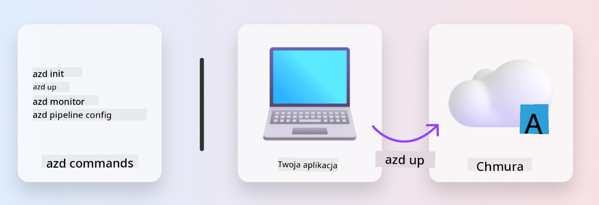

<!--
CO_OP_TRANSLATOR_METADATA:
{
  "original_hash": "06d6207eff634aefcaa41739490a5324",
  "translation_date": "2025-09-24T10:54:23+00:00",
  "source_file": "workshop/docs/instructions/1-Select-AI-Template.md",
  "language_code": "pl"
}
-->
# 1. Wybierz szablon

!!! tip "PO UKOŃCZENIU TEGO MODUŁU BĘDZIESZ W STANIE"

    - [ ] Opisać, czym są szablony AZD
    - [ ] Odkrywać i korzystać z szablonów AZD dla AI
    - [ ] Rozpocząć pracę z szablonem AI Agents
    - [ ] **Laboratorium 1:** Szybki start z AZD w GitHub Codespaces

---

## 1. Analogia do budowy

Budowanie nowoczesnej aplikacji AI gotowej do zastosowań w przedsiębiorstwie _od podstaw_ może być przytłaczające. To trochę jak budowanie nowego domu samodzielnie, cegła po cegle. Tak, da się to zrobić! Ale nie jest to najskuteczniejszy sposób na osiągnięcie pożądanego rezultatu!

Zamiast tego często zaczynamy od istniejącego _projektu architektonicznego_ i współpracujemy z architektem, aby dostosować go do naszych indywidualnych potrzeb. Dokładnie takie podejście warto zastosować przy budowie inteligentnych aplikacji. Najpierw znajdź odpowiednią architekturę projektową, która pasuje do Twojego problemu. Następnie współpracuj z architektem rozwiązania, aby dostosować i opracować rozwiązanie dla swojego konkretnego scenariusza.

Ale gdzie znaleźć takie projekty architektoniczne? I jak znaleźć architekta, który będzie gotów nauczyć nas, jak dostosować i wdrożyć te projekty samodzielnie? W tym warsztacie odpowiemy na te pytania, wprowadzając trzy technologie:

1. [Azure Developer CLI](https://aka.ms/azd) - narzędzie open-source, które przyspiesza przejście od lokalnego tworzenia aplikacji (build) do wdrożenia w chmurze (ship).
1. [Azure AI Foundry Templates](https://ai.azure.com/templates) - standaryzowane repozytoria open-source zawierające przykładowy kod, pliki infrastruktury i konfiguracji do wdrażania architektury rozwiązań AI.
1. [GitHub Copilot Agent Mode](https://code.visualstudio.com/docs/copilot/chat/chat-agent-mode) - agent kodowania oparty na wiedzy o Azure, który może pomóc w nawigacji po bazie kodu i wprowadzaniu zmian za pomocą języka naturalnego.

Dzięki tym narzędziom możemy teraz _odkrywać_ odpowiedni szablon, _wdrażać_ go, aby sprawdzić, czy działa, i _dostosowywać_ go do naszych specyficznych scenariuszy. Zanurzmy się w szczegóły i zobaczmy, jak to działa.

---

## 2. Azure Developer CLI

[Azure Developer CLI](https://learn.microsoft.com/en-us/azure/developer/azure-developer-cli/) (lub `azd`) to narzędzie wiersza poleceń open-source, które może przyspieszyć Twoją podróż od kodu do chmury, oferując zestaw przyjaznych dla programistów poleceń, które działają spójnie w środowiskach IDE (development) i CI/CD (devops).

Dzięki `azd` proces wdrażania może być tak prosty, jak:

- `azd init` - Inicjalizuje nowy projekt AI na podstawie istniejącego szablonu AZD.
- `azd up` - Tworzy infrastrukturę i wdraża aplikację w jednym kroku.
- `azd monitor` - Umożliwia monitorowanie w czasie rzeczywistym i diagnostykę wdrożonej aplikacji.
- `azd pipeline config` - Konfiguruje potoki CI/CD do automatyzacji wdrożeń w Azure.

**🎯 | ĆWICZENIE**: <br/> Eksploruj narzędzie wiersza poleceń `azd` w swoim środowisku GitHub Codespaces. Zacznij od wpisania tego polecenia, aby zobaczyć, co narzędzie potrafi:

```bash title="" linenums="0"
azd help
```



---

## 3. Szablon AZD

Aby `azd` mogło to osiągnąć, musi wiedzieć, jaką infrastrukturę utworzyć, jakie ustawienia konfiguracji wymusić i jaką aplikację wdrożyć. Tutaj wchodzą w grę [szablony AZD](https://learn.microsoft.com/en-us/azure/developer/azure-developer-cli/azd-templates?tabs=csharp).

Szablony AZD to repozytoria open-source, które łączą przykładowy kod z plikami infrastruktury i konfiguracji wymaganymi do wdrożenia architektury rozwiązania. Dzięki podejściu _Infrastructure-as-Code_ (IaC) umożliwiają one wersjonowanie definicji zasobów szablonu i ustawień konfiguracji (podobnie jak kod źródłowy aplikacji), tworząc powtarzalne i spójne przepływy pracy dla użytkowników tego projektu.

Podczas tworzenia lub ponownego używania szablonu AZD dla _Twojego_ scenariusza, rozważ następujące pytania:

1. Co budujesz? → Czy istnieje szablon z kodem początkowym dla tego scenariusza?
1. Jak jest zaprojektowane Twoje rozwiązanie? → Czy istnieje szablon z wymaganymi zasobami?
1. Jak wdrażasz swoje rozwiązanie? → Pomyśl o `azd deploy` z hakami przed/po przetwarzaniu!
1. Jak możesz je dalej zoptymalizować? → Pomyśl o wbudowanym monitorowaniu i potokach automatyzacji!

**🎯 | ĆWICZENIE**: <br/> 
Odwiedź galerię [Awesome AZD](https://azure.github.io/awesome-azd/) i użyj filtrów, aby przeszukać ponad 250 dostępnych szablonów. Sprawdź, czy znajdziesz taki, który odpowiada wymaganiom Twojego scenariusza.


---

## 4. Szablony aplikacji AI

---

