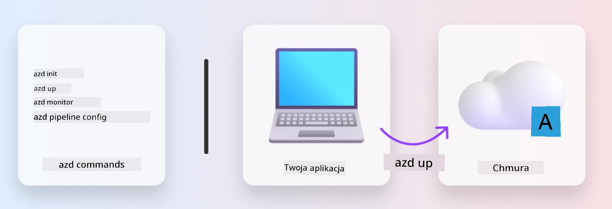
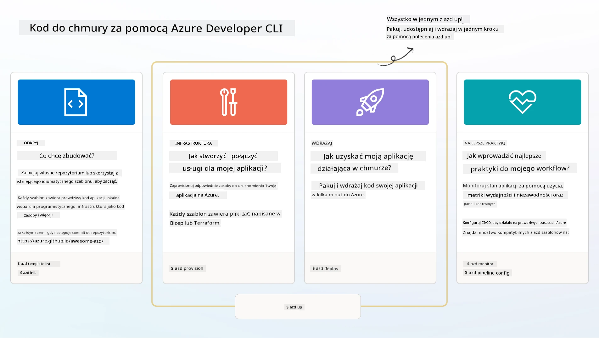

# 1. Wybierz szablon

!!! tip "NA KONIEC TEGO MODUŁU BĘDZIESZ POTRAFIŁ"

    - [ ] Opisać czym są szablony AZD
    - [ ] Odkrywać i używać szablonów AZD dla AI
    - [ ] Zacząć pracę z szablonem AI Agents
    - [ ] **Laboratorium 1:** Szybki start AZD w Codespaces lub kontenerze deweloperskim

---

## 1. Analogią jest budowniczy

Budowa nowoczesnej, gotowej do użycia w przedsiębiorstwie aplikacji AI _od podstaw_ może być przytłaczająca. To trochę jak samodzielne budowanie nowego domu, cegła po cegle. Tak, da się to zrobić! Ale to nie jest najskuteczniejszy sposób, by osiągnąć pożądany efekt końcowy!

Zamiast tego często zaczynamy od istniejącego _planu architektonicznego_ i współpracujemy z architektem, aby dostosować go do naszych osobistych wymagań. I dokładnie takie podejście należy przyjąć przy budowaniu inteligentnych aplikacji. Najpierw znajdź dobrą architekturę pasującą do twojego obszaru problemowego. Następnie współpracuj z architektem rozwiązania, aby dostosować i rozwinąć rozwiązanie dla twojego konkretnego scenariusza.

Ale gdzie możemy znaleźć te plany architektoniczne? I jak znaleźć architekta, który chętnie nauczy nas jak je dostosować i wdrożyć samodzielnie? W tym warsztacie odpowiadamy na te pytania, przedstawiając trzy technologie:

1. [Azure Developer CLI](https://aka.ms/azd) - narzędzie open-source, które przyspiesza ścieżkę deweloperską od lokalnego developmentu (budowy) do wdrożenia w chmurze (wysyłki).
1. [Microsoft Foundry Templates](https://ai.azure.com/templates) - znormalizowane repozytoria open-source zawierające przykładowy kod, pliki infrastruktury i konfiguracji do wdrożenia architektury rozwiązania AI.
1. [GitHub Copilot Agent Mode](https://code.visualstudio.com/docs/copilot/chat/chat-agent-mode) - agent do kodowania oparty na wiedzy Azure, który może prowadzić nas po bazie kodu i pomagać w zmianach - używając języka naturalnego.

Mając te narzędzia, możemy teraz _odkryć_ odpowiedni szablon, _wdrożyć_ go, aby zweryfikować działanie, oraz _dostosować_ do naszych specyficznych scenariuszy. Zanurzmy się i dowiedzmy się, jak to działa.

---

## 2. Azure Developer CLI

[Azure Developer CLI](https://learn.microsoft.com/en-us/azure/developer/azure-developer-cli/) (lub `azd`) to narzędzie wiersza poleceń open-source, które może przyspieszyć twoją drogę od kodu do chmury za pomocą zestawu przyjaznych deweloperowi poleceń działających spójnie w twoim IDE (development) oraz środowiskach CI/CD (devops).

Dzięki `azd` twoja droga wdrożenia może być prosta jak:

- `azd init` - Inicjalizuje nowy projekt AI na podstawie istniejącego szablonu AZD.
- `azd up` - Tworzy infrastrukturę i wdraża aplikację w jednym kroku.
- `azd monitor` - Uzyskaj monitorowanie i diagnostykę w czasie rzeczywistym dla wdrożonej aplikacji.
- `azd pipeline config` - Konfiguracja pipeline'ów CI/CD do automatyzacji wdrożenia na Azure.

**🎯 | ĆWICZENIE**: <br/> 
Przetestuj narzędzie `azd` w swoim środowisku warsztatowym. Może to być GitHub Codespaces, kontener deweloperski lub lokalna kopia z zainstalowanymi wymogami. Zacznij od wpisania poniższego polecenia, aby zobaczyć, co to narzędzie potrafi:

```bash title="" linenums="0"
azd help
```



---

## 3. Szablon AZD

Aby `azd` mógł to osiągnąć, musi wiedzieć, jaką infrastrukturę utworzyć, jakie ustawienia konfiguracyjne wymusić i jaką aplikację wdrożyć. Tu wchodzą w grę [szablony AZD](https://learn.microsoft.com/en-us/azure/developer/azure-developer-cli/azd-templates?tabs=csharp).

Szablony AZD to repozytoria open-source łączące przykładowy kod z plikami infrastruktury i konfiguracji wymaganymi do wdrożenia architektury rozwiązania.
Poprzez podejście _Infrastructure-as-Code_ (IaC) pozwalają na wersjonowanie definicji zasobów i ustawień konfiguracyjnych (tak jak kod źródłowy aplikacji) - tworząc powtarzalne i spójne procesy pracy wśród użytkowników projektu.

Przy tworzeniu lub ponownym używaniu szablonu AZD dla _twojego_ scenariusza, rozważ następujące pytania:

1. Co budujesz? → Czy jest szablon, który zawiera kod startowy dla tego scenariusza?
1. Jak zaprojektowano twoje rozwiązanie? → Czy jest szablon zawierający potrzebne zasoby?
1. Jak wdrażasz swoje rozwiązanie? → Pomyśl o `azd deploy` ze wstępnymi/powiązanymi krokami!
1. Jak możesz to jeszcze zoptymalizować? → Pomyśl o wbudowanym monitoringu i automatycznych pipeline'ach!

**🎯 | ĆWICZENIE**: <br/> 
Odwiedź galerię [Awesome AZD](https://azure.github.io/awesome-azd/) i użyj filtrów, aby przeglądać ponad 250 dostępnych szablonów. Sprawdź, czy znajdziesz coś odpowiadającego _twoim_ wymaganiom.



---

## 4. Szablony aplikacji AI

Dla aplikacji zasilanych AI, Microsoft oferuje specjalistyczne szablony zawierające **Microsoft Foundry** i **Foundry Agents**. Te szablony przyspieszają drogę do budowy inteligentnych, produkcyjnych aplikacji.

### Szablony Microsoft Foundry & Foundry Agents

Wybierz szablon z poniższej listy, aby wdrożyć. Każdy szablon jest dostępny na [Awesome AZD](https://azure.github.io/awesome-azd/) i można go zainicjalizować za pomocą jednego polecenia.

| Szablon | Opis | Polecenie wdrożenia |
|----------|-------------|----------------|
| **[AI Chat with RAG](https://azure.github.io/awesome-azd/?tags=ai&tags=rag)** | Aplikacja czatu z Retrieval Augmented Generation wykorzystująca Microsoft Foundry | `azd init -t azure-samples/azure-search-openai-demo` |
| **[Foundry Agent Service Starter](https://azure.github.io/awesome-azd/?tags=ai&tags=agents)** | Buduj agentów AI z Foundry Agents dla autonomicznego wykonywania zadań | `azd init -t azure-samples/foundry-agent-service-starter` |
| **[Multi-Agent Orchestration](https://azure.github.io/awesome-azd/?tags=ai&tags=agents)** | Koordynuj wielu agentów Foundry dla złożonych przepływów pracy | `azd init -t azure-samples/multi-agent-orchestration` |
| **[AI Document Intelligence](https://azure.github.io/awesome-azd/?tags=ai&tags=document)** | Wyodrębniaj i analizuj dokumenty za pomocą modeli Microsoft Foundry | `azd init -t azure-samples/ai-document-processing` |
| **[Conversational AI Bot](https://azure.github.io/awesome-azd/?tags=ai&tags=bot)** | Buduj inteligentne chatboty z integracją Microsoft Foundry | `azd init -t azure-samples/ai-chat-protocol` |
| **[AI Image Generation](https://azure.github.io/awesome-azd/?tags=ai&tags=dalle)** | Twórz obrazy z DALL-E przez Microsoft Foundry | `azd init -t azure-samples/ai-image-generation` |
| **[Semantic Kernel Agent](https://azure.github.io/awesome-azd/?tags=ai&tags=semantic-kernel)** | Agenci AI używający Semantic Kernel z Foundry Agents | `azd init -t azure-samples/semantic-kernel-agent` |
| **[AutoGen Multi-Agent](https://azure.github.io/awesome-azd/?tags=ai&tags=autogen)** | Systemy wieloagentowe bazujące na frameworku AutoGen | `azd init -t azure-samples/autogen-multi-agent` |

### Szybki start

1. **Przeglądaj szablony**: Odwiedź [https://azure.github.io/awesome-azd/](https://azure.github.io/awesome-azd/) i filtruj po `AI`, `Agents` lub `Microsoft Foundry`
2. **Wybierz szablon**: Znajdź ten, który odpowiada twojemu przypadkowi użycia
3. **Zainicjalizuj**: Uruchom polecenie `azd init` dla wybranego szablonu
4. **Wdróż**: Uruchom `azd up`, aby utworzyć infrastrukturę i wdrożyć aplikację

**🎯 | ĆWICZENIE**: <br/> 
Wybierz jeden z powyższych szablonów na podstawie twojego scenariusza:

- **Budujesz chatbota?** → Zacznij od **AI Chat with RAG** lub **Conversational AI Bot**
- **Potrzebujesz autonomicznych agentów?** → Spróbuj **Foundry Agent Service Starter** lub **Multi-Agent Orchestration**
- **Przetwarzasz dokumenty?** → Wybierz **AI Document Intelligence**
- **Chcesz pomocy w kodowaniu AI?** → Wypróbuj **Semantic Kernel Agent** lub **AutoGen Multi-Agent**

```bash title="Example: Deploy the AI Chat with RAG template" linenums="0"
azd init -t azure-samples/azure-search-openai-demo
azd up
```

!!! info "Odkryj więcej szablonów"
    Galeria [Awesome AZD](https://azure.github.io/awesome-azd/) zawiera ponad 250 szablonów. Użyj filtrów, aby znaleźć szablony odpowiadające twoim konkretnym wymaganiom co do języka, frameworka i usług Azure.

---

<!-- CO-OP TRANSLATOR DISCLAIMER START -->
**Zastrzeżenie**:  
Ten dokument został przetłumaczony za pomocą usługi tłumaczenia AI [Co-op Translator](https://github.com/Azure/co-op-translator). Chociaż dążymy do dokładności, prosimy pamiętać, że tłumaczenia automatyczne mogą zawierać błędy lub niedokładności. Oryginalny dokument w języku źródłowym należy uznać za autorytatywne źródło. W przypadku informacji krytycznych zaleca się skorzystanie z profesjonalnego tłumaczenia wykonane przez człowieka. Nie ponosimy odpowiedzialności za jakiekolwiek nieporozumienia lub błędne interpretacje wynikające z korzystania z tego tłumaczenia.
<!-- CO-OP TRANSLATOR DISCLAIMER END -->