# 2. Walidacja szablonu

!!! tip "NA KOŃCU TEGO MODUŁU BĘDZIESZ POTRAFIŁ"

    - [ ] Analizować architekturę rozwiązania AI
    - [ ] Zrozumieć przepływ pracy wdrażania AZD
    - [ ] Korzystać z GitHub Copilot, aby uzyskać pomoc w używaniu AZD
    - [ ] **Laboratorium 2:** Wdrażać i walidować szablon AI Agents

---

## 1. Wprowadzenie

[Azure Developer CLI](https://learn.microsoft.com/en-us/azure/developer/azure-developer-cli/) lub `azd` to narzędzie wiersza poleceń typu open-source, które usprawnia pracę programisty podczas tworzenia i wdrażania aplikacji w Azure.

[Szablony AZD](https://learn.microsoft.com/azure/developer/azure-developer-cli/azd-templates) to standaryzowane repozytoria zawierające przykładowy kod aplikacji, zasoby _infrastruktura jako kod_ oraz pliki konfiguracyjne `azd` dla spójnej architektury rozwiązania. Provisión infrastruktury staje się tak proste, jak polecenie `azd provision` – natomiast użycie `azd up` pozwala na jednoczesne provisionowanie infrastruktury **i** wdrażanie aplikacji!

W efekcie rozpoczęcie pracy nad aplikacją może być tak proste, jak znalezienie odpowiedniego _szablonu startowego AZD_, który najlepiej odpowiada Twoim potrzebom aplikacji i infrastruktury – a następnie dostosowanie repozytorium do wymagań scenariusza.

Zanim zaczniemy, upewnijmy się, że masz zainstalowany Azure Developer CLI.

1. Otwórz terminal VS Code i wpisz to polecenie:

      ```bash title="" linenums="0"
      azd version
      ```

1. Powinieneś zobaczyć coś podobnego!

      ```bash title="" linenums="0"
      azd version 1.19.0 (commit b3d68cea969b2bfbaa7b7fa289424428edb93e97)
      ```

**Teraz jesteś gotowy, aby wybrać i wdrożyć szablon za pomocą azd**

---

## 2. Wybór szablonu

Platforma Microsoft Foundry dostarcza [zestaw rekomendowanych szablonów AZD](https://learn.microsoft.com/en-us/azure/ai-foundry/how-to/develop/ai-template-get-started), które obejmują popularne scenariusze rozwiązania takie jak _automatyzacja wieloagentowego przepływu pracy_ i _wielomodalne przetwarzanie treści_. Możesz także odkryć te szablony, odwiedzając portal Microsoft Foundry.

1. Odwiedź [https://ai.azure.com/templates](https://ai.azure.com/templates)
1. Zaloguj się do portalu Microsoft Foundry, gdy zostaniesz o to poproszony – zobaczysz coś takiego.

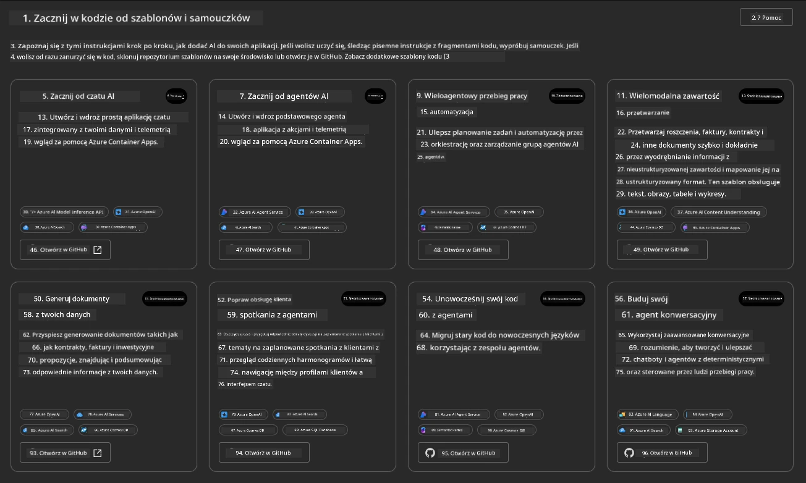

Opcje **Basic** to Twoje szablony startowe:

1. [ ] [Rozpocznij pracę z AI Chat](https://github.com/Azure-Samples/get-started-with-ai-chat), który wdraża podstawową aplikację czatu _z twoimi danymi_ do Azure Container Apps. Użyj tego, aby poznać podstawowy scenariusz chatbota AI.
1. [X] [Rozpocznij pracę z AI Agents](https://github.com/Azure-Samples/get-started-with-ai-agents), który również wdraża standardowego Agenta AI (z agentami Foundry). Użyj tego, aby zapoznać się z agentowymi rozwiązaniami AI obejmującymi narzędzia i modele.

Otwórz drugi link w nowej karcie przeglądarki (lub kliknij `Open in GitHub` na powiązanej karcie). Powinieneś zobaczyć repozytorium dla tego szablonu AZD. Poświęć chwilę na zapoznanie się z README. Architektura aplikacji wygląda tak:

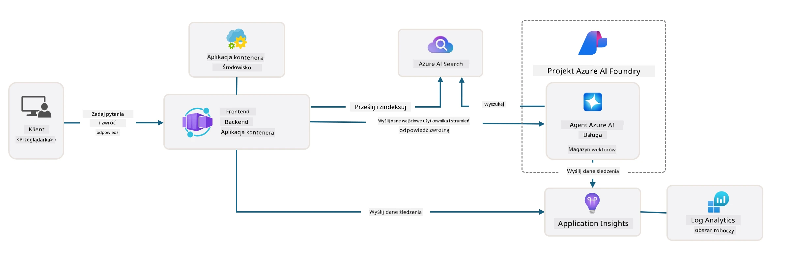

---

## 3. Aktywacja szablonu

Spróbujmy wdrożyć ten szablon i upewnić się, że jest ważny. Postępujemy zgodnie z wytycznymi z sekcji [Rozpoczęcie pracy](https://github.com/Azure-Samples/get-started-with-ai-agents?tab=readme-ov-file#getting-started).

1. Kliknij [ten link](https://github.com/codespaces/new/Azure-Samples/get-started-with-ai-agents) – potwierdź domyślną akcję `Create codespace`
1. Otworzy się nowa karta przeglądarki – poczekaj na załadowanie sesji GitHub Codespaces
1. Otwórz terminal VS Code w Codespaces – wpisz następujące polecenie:

   ```bash title="" linenums="0"
   azd up
   ```

Wykonaj kroki przepływu pracy, które to wywoła:

1. Zostaniesz poproszony o zalogowanie się do Azure – postępuj zgodnie z instrukcjami, aby się uwierzytelnić
1. Wprowadź unikalną nazwę środowiska dla siebie – np. ja użyłem `nitya-mshack-azd`
1. To utworzy folder `.azure/` – zobaczysz podfolder z nazwą środowiska
1. Zostaniesz poproszony o wybór subskrypcji – wybierz domyślną
1. Zostaniesz poproszony o lokalizację – użyj `East US 2`

Teraz poczekaj na zakończenie provisionowania. **To zajmuje 10-15 minut**

1. Po zakończeniu konsola pokaże komunikat SUCCESS podobny do tego:
      ```bash title="" linenums="0"
      SUCCESS: Your up workflow to provision and deploy to Azure completed in 10 minutes 17 seconds.
      ```
1. Twój portal Azure teraz będzie zawierał utworzoną grupę zasobów z tą nazwą środowiska:

      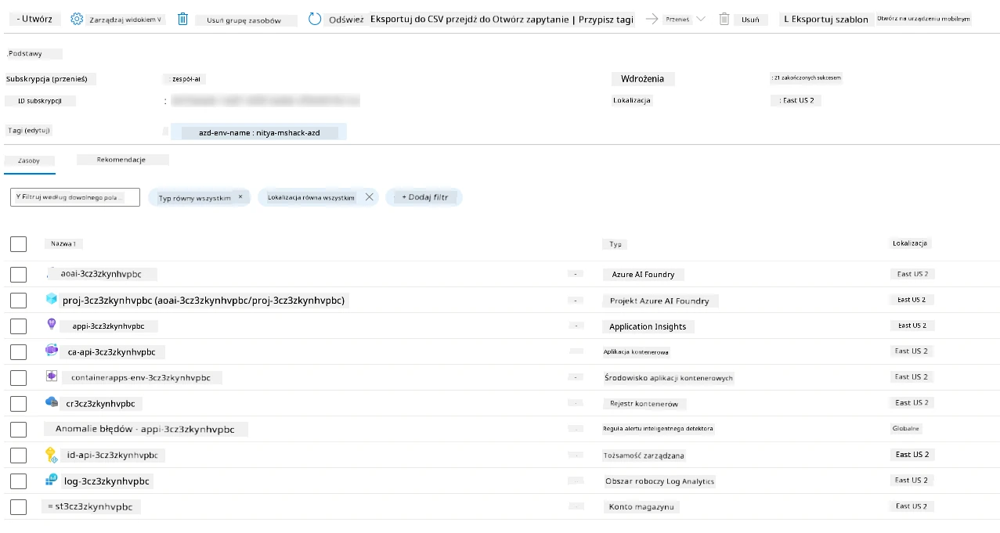

1. **Jesteś teraz gotowy do walidacji wdrożonej infrastruktury i aplikacji**.

---

## 4. Walidacja szablonu

1. Odwiedź stronę Azure Portal [Grupy zasobów](https://portal.azure.com/#browse/resourcegroups) – zaloguj się, gdy zostaniesz o to poproszony
1. Kliknij RG dla swojego środowiska – zobaczysz powyższą stronę

      - kliknij zasób Azure Container Apps
      - kliknij adres URL aplikacji w sekcji _Essentials_ (prawy górny róg)

1. Powinieneś zobaczyć interfejs front-end hostowanej aplikacji jak poniżej:

   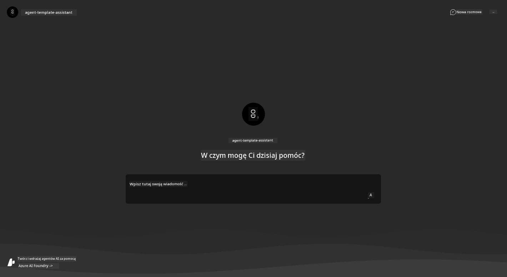

1. Spróbuj zadać kilka [przykładowych pytań](https://github.com/Azure-Samples/get-started-with-ai-agents/blob/main/docs/sample_questions.md)

      1. Zapytaj: ```Jaka jest stolica Francji?```
      1. Zapytaj: ```Jaki jest najlepszy namiot do 200 dolarów dla dwóch osób i jakie ma funkcje?```

1. Powinieneś otrzymać odpowiedzi podobne do tych pokazanych poniżej. _Ale jak to działa?_

      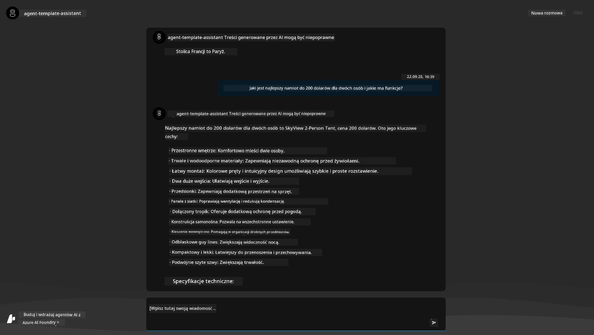

---

## 5. Walidacja agenta

Azure Container App wdraża punkt końcowy, który łączy się z agentem AI provisionowanym w projekcie Microsoft Foundry dla tego szablonu. Spójrzmy, co to oznacza.

1. Wróć do strony _Przegląd_ w Azure Portal dla swojej grupy zasobów

1. Kliknij zasób `Microsoft Foundry` na tej liście

1. Powinieneś zobaczyć to. Kliknij przycisk `Go to Microsoft Foundry Portal`.
   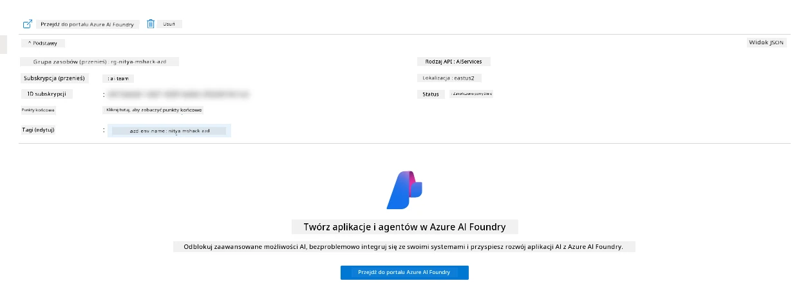

1. Powinieneś zobaczyć stronę projektu Foundry dla swojej aplikacji AI
   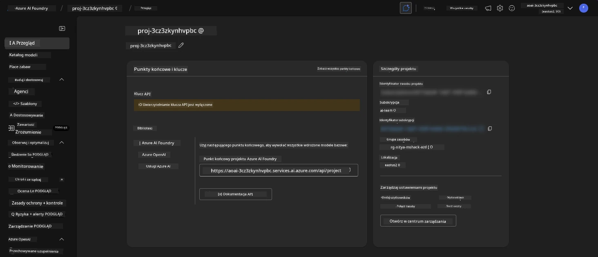

1. Kliknij na `Agents` – zobaczysz domyślnego agenta provisionowanego w projekcie
   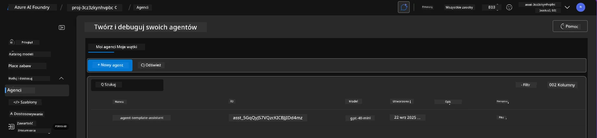

1. Wybierz go – zobaczysz szczegóły agenta. Zwróć uwagę na następujące:

      - Agent domyślnie korzysta z wyszukiwania plików (zawsze)
      - Pole `Knowledge` agenta wskazuje, że przesłano 32 pliki (do wyszukiwania plików)
      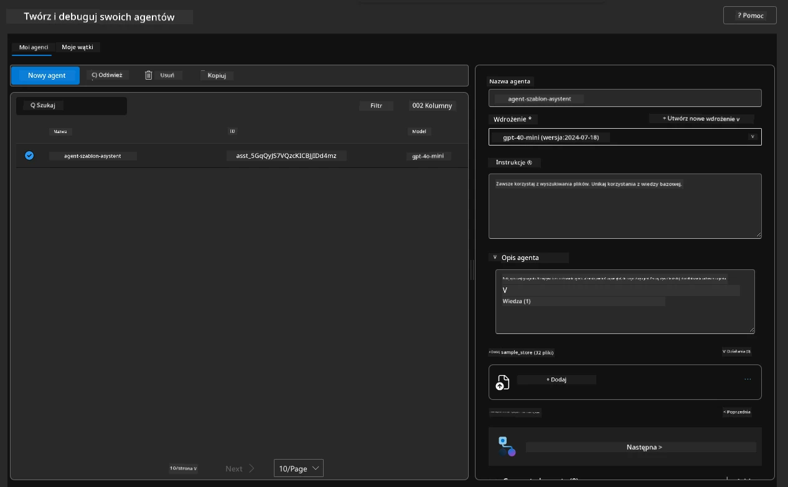

1. Znajdź opcję `Data+indexes` w lewym menu i kliknij, aby zobaczyć szczegóły.

      - Powinieneś zobaczyć 32 pliki danych przesłane dla wiedzy.
      - Odpowiadają one 12 plikom klientów i 20 plikom produktów w `src/files`
      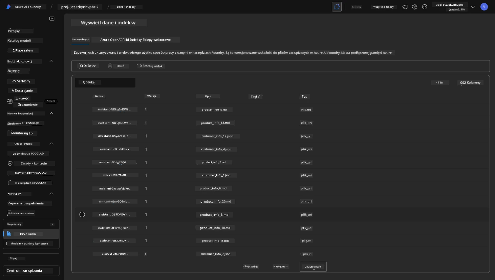

**Zweryfikowałeś działanie agenta!**

1. Odpowiedzi agenta opierają się na wiedzy zawartej w tych plikach.
1. Możesz teraz zadawać pytania związane z tymi danymi i otrzymywać oparte na nich odpowiedzi.
1. Przykład: `customer_info_10.json` opisuje 3 zakupy dokonane przez "Amandę Perez"

Wróć do karty przeglądarki z punktem końcowym Container App i zapytaj: `Jakie produkty posiada Amanda Perez?`. Powinieneś zobaczyć coś takiego:

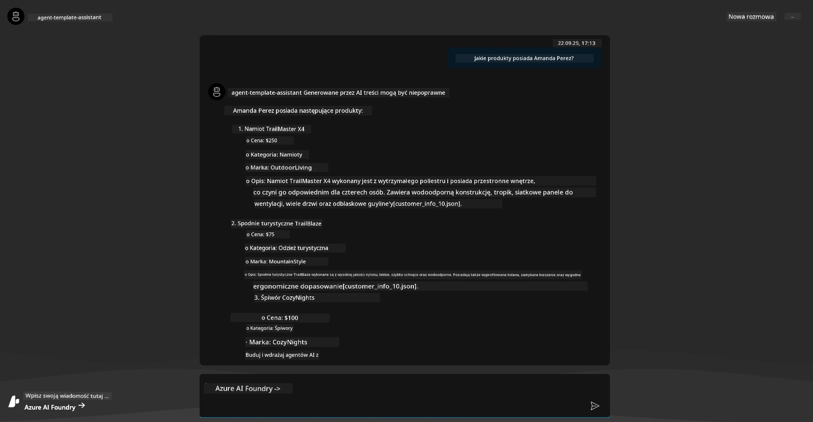

---

## 6. Playground agenta

Poznajmy trochę lepiej możliwości Microsoft Foundry, testując Agenta w Agents Playground.

1. Wróć do strony `Agents` w Microsoft Foundry – wybierz domyślnego agenta
1. Kliknij opcję `Try in Playground` – powinieneś zobaczyć interfejs Playground taki jak ten
1. Zadaj to samo pytanie: `Jakie produkty posiada Amanda Perez?`

    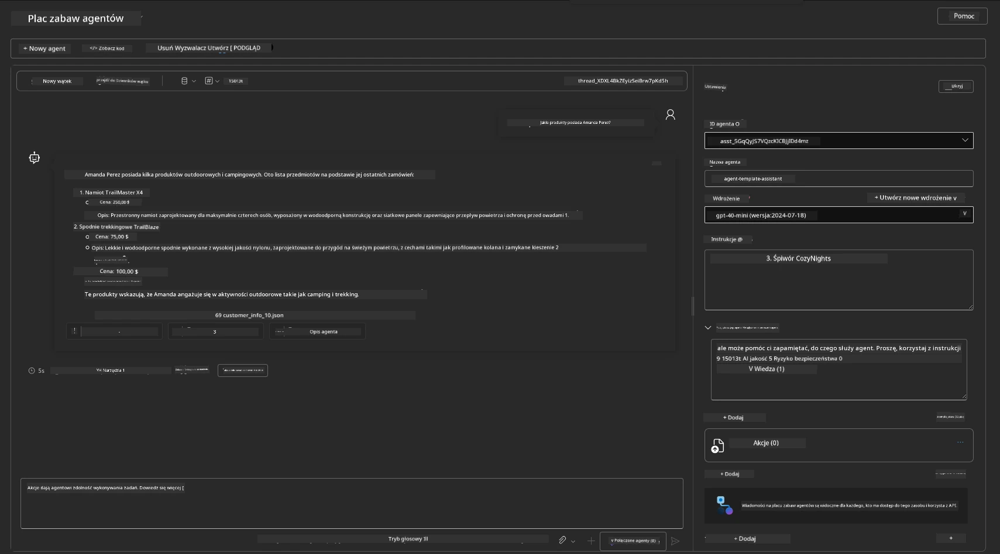

Otrzymujesz tę samą (lub podobną) odpowiedź – ale także dodatkowe informacje, które możesz wykorzystać, aby ocenić jakość, koszty i wydajność swojej agentowej aplikacji. Na przykład:

1. Zauważ, że odpowiedź cytuje pliki danych użyte do "podstawienia" odpowiedzi
1. Najedź kursorem na dowolną etykietę pliku – czy dane zgadzają się z twoim zapytaniem i wyświetloną odpowiedzią?

Poniżej odpowiedzi zobaczysz też wiersz _statystyk_.

1. Najedź kursorem na dowolną metrykę – np. Safety (Bezpieczeństwo). Zobaczysz coś takiego
1. Czy oceniony poziom bezpieczeństwa odpowiada twojej intuicji co do bezpieczeństwa tej odpowiedzi?

      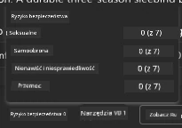

---

## 7. Wbudowana obserwowalność

Obserwowalność to instrumentacja aplikacji, która generuje dane, które mogą być wykorzystane do zrozumienia, debugowania i optymalizacji jej działania. Aby to zobaczyć:

1. Kliknij przycisk `View Run Info` – zobaczysz ten widok. To przykład [śledzenia agenta](https://learn.microsoft.com/en-us/azure/ai-foundry/how-to/develop/trace-agents-sdk#view-trace-results-in-the-azure-ai-foundry-agents-playground) w praktyce. _Widok ten można również uzyskać, klikając Thread Logs w głównym menu_.

   - Zapoznaj się z krokami wykonania i narzędziami użytymi przez agenta
   - Zrozum całkowitą liczbę tokenów (w porównaniu z użyciem tokenów wyjściowych) dla odpowiedzi
   - Zrozum opóźnienia i miejsca, gdzie czas jest spędzany podczas wykonania

      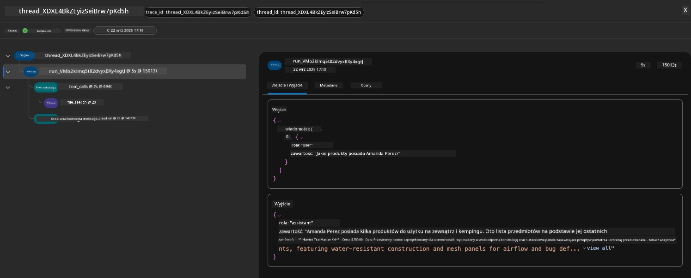

1. Kliknij kartę `Metadata`, aby zobaczyć dodatkowe atrybuty dotyczące wykonania, które mogą dostarczyć przydatnego kontekstu podczas debugowania problemów.

      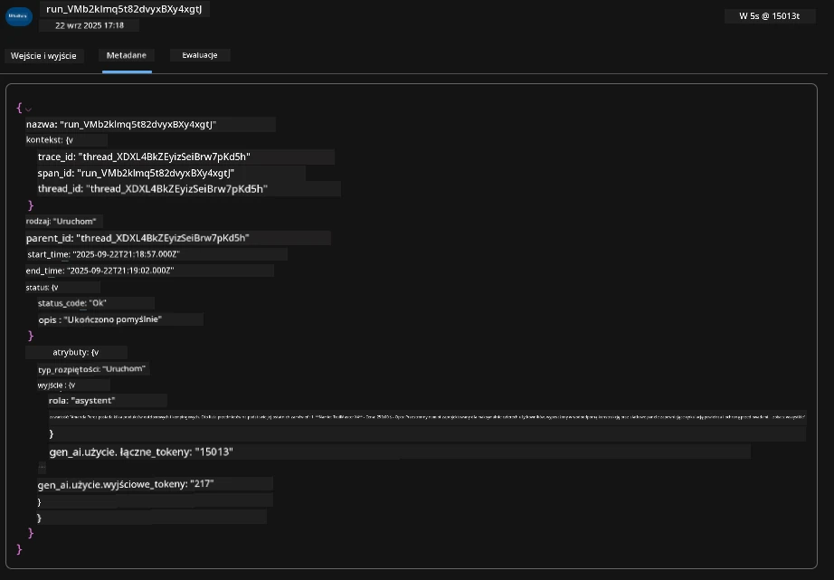

1. Kliknij kartę `Evaluations`, aby zobaczyć automatyczne oceny odpowiedzi agenta. Obejmują one oceny bezpieczeństwa (np. samo-szkodliwość) oraz specyficzne oceny agenta (np. rozpoznanie intencji, zgodność z zadaniem).

      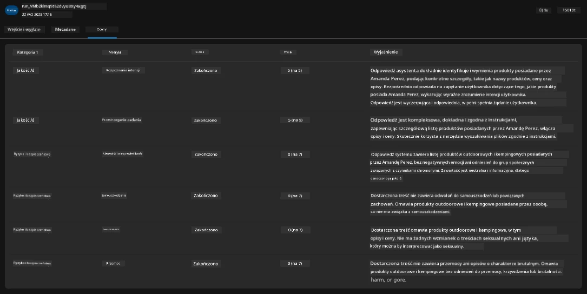

1. Na koniec kliknij kartę `Monitoring` w menu bocznym.

      - Wybierz kartę `Resource usage` na wyświetlanej stronie i zobacz metryki.
      - Śledź użycie aplikacji pod względem kosztów (tokeny) i obciążenia (żądania).
      - Śledź opóźnienia aplikacji do pierwszego bajtu (przetwarzanie wejścia) i ostatniego bajtu (wyjścia).

      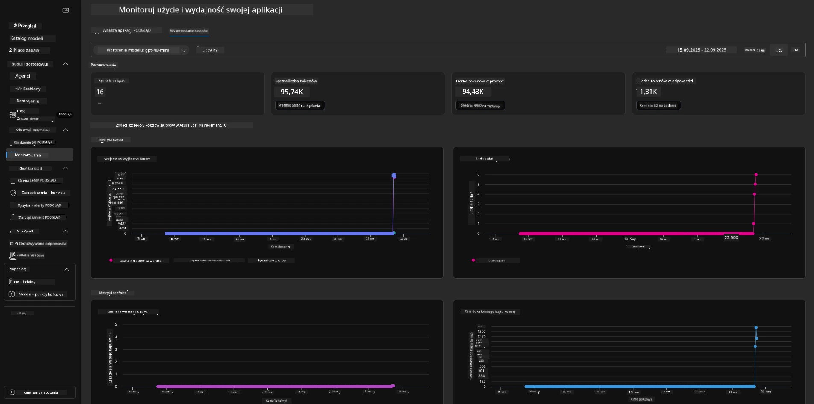

---

## 8. Zmienne środowiskowe

Do tej pory przeprowadziliśmy wdrożenie w przeglądarce – i zweryfikowaliśmy, że nasza infrastruktura jest provisionowana, a aplikacja działa. Aby jednak pracować z kodem aplikacji _w pierwszej kolejności_, musimy skonfigurować lokalne środowisko programistyczne z odpowiednimi zmiennymi wymaganymi do pracy z tymi zasobami. Korzystanie z `azd` ułatwia to zadanie.

1. Azure Developer CLI [używa zmiennych środowiskowych](https://learn.microsoft.com/en-us/azure/developer/azure-developer-cli/manage-environment-variables?tabs=bash) do przechowywania i zarządzania ustawieniami konfiguracyjnymi dla wdrożeń aplikacji.

1. Zmienne środowiskowe są przechowywane w `.azure/<env-name>/.env` – są one przypisane do środowiska `env-name` używanego podczas wdrożenia i pomagają izolować środowiska między różnymi celami wdrożeniowymi w tym samym repozytorium.

1. Zmienne środowiskowe są automatycznie ładowane przez polecenie `azd` za każdym razem, gdy wykonuje ono konkretne polecenie (np. `azd up`). Należy zauważyć, że `azd` nie odczytuje automatycznie zmiennych środowiskowych na poziomie systemu operacyjnego (np. ustawionych w powłoce) – zamiast tego używaj `azd set env` i `azd get env` do przenoszenia informacji w ramach skryptów.

Wypróbujmy kilka poleceń:

1. Pobierz wszystkie zmienne środowiskowe ustawione dla `azd` w tym środowisku:

      ```bash title="" linenums="0"
      azd env get-values
      ```
      
      Zobaczysz coś takiego:

      ```bash title="" linenums="0"
      AZURE_AI_AGENT_DEPLOYMENT_NAME="gpt-4o-mini"
      AZURE_AI_AGENT_NAME="agent-template-assistant"
      AZURE_AI_EMBED_DEPLOYMENT_NAME="text-embedding-3-small"
      AZURE_AI_EMBED_DIMENSIONS=100
      ...
      ```

1. Pobierz konkretną wartość – np. chcę wiedzieć, czy ustawiliśmy wartość `AZURE_AI_AGENT_MODEL_NAME`

      ```bash title="" linenums="0"
      azd env get-value AZURE_AI_AGENT_MODEL_NAME 
      ```
      
      Zobaczysz coś takiego – nie została ustawiona domyślnie!

      ```bash title="" linenums="0"
      ERROR: key 'AZURE_AI_AGENT_MODEL_NAME' not found in the environment values
      ```

1. Ustaw nową zmienną środowiskową dla `azd`. Tutaj aktualizujemy nazwę modelu agenta. _Uwaga: wszelkie zmiany zostaną od razu odzwierciedlone w pliku `.azure/<env-name>/.env`._

      ```bash title="" linenums="0"
      azd env set AZURE_AI_AGENT_MODEL_NAME gpt-4.1
      azd env set AZURE_AI_AGENT_MODEL_VERSION 2025-04-14
      azd env set AZURE_AI_AGENT_DEPLOYMENT_CAPACITY 150
      ```

      Teraz powinniśmy zobaczyć, że wartość jest ustawiona:

      ```bash title="" linenums="0"
      azd env get-value AZURE_AI_AGENT_MODEL_NAME 
      ```

1. Zwróć uwagę, że niektóre zasoby są trwałe (np. wdrożenia modeli) i wymagają więcej niż tylko `azd up`, aby wymusić ponowne wdrożenie. Spróbujmy usunąć oryginalne wdrożenie i ponownie wdrożyć z zmienionymi zmiennymi środowiskowymi.

1. **Odświeżenie** Jeśli wcześniej wdrożyłeś infrastrukturę za pomocą szablonu azd – możesz _odświeżyć_ stan lokalnych zmiennych środowiskowych na podstawie aktualnego stanu wdrożenia Azure za pomocą tego polecenia:

      ```bash title="" linenums="0"
      azd env refresh
      ```

      To potężny sposób na _synchronizację_ zmiennych środowiskowych między dwoma lub więcej lokalnymi środowiskami programistycznymi (np. zespół z wieloma programistami) - pozwalając, aby wdrożona infrastruktura służyła jako źródło prawdy dla stanu zmiennych środowiskowych. Członkowie zespołu po prostu _odświeżają_ zmienne, aby ponownie się zsynchronizować.

---

## 9. Gratulacje 🏆

Właśnie zakończyłeś kompleksowy proces, w którym:

- [X] Wybrałeś szablon AZD, którego chcesz użyć
- [X] Uruchomiłeś szablon z GitHub Codespaces
- [X] Wdrożyłeś szablon i potwierdziłeś, że działa

---

<!-- CO-OP TRANSLATOR DISCLAIMER START -->
**Zastrzeżenie**:  
Ten dokument został przetłumaczony za pomocą usługi tłumaczeniowej AI [Co-op Translator](https://github.com/Azure/co-op-translator). Mimo że dokładamy starań, aby tłumaczenie było jak najbardziej precyzyjne, prosimy pamiętać, że automatyczne tłumaczenia mogą zawierać błędy lub nieścisłości. Oryginalny dokument w języku źródłowym powinien być uznawany za źródło nadrzędne. W przypadku informacji krytycznych zalecane jest skorzystanie z profesjonalnego tłumaczenia wykonanego przez człowieka. Nie ponosimy odpowiedzialności za jakiekolwiek nieporozumienia lub błędne interpretacje wynikające z korzystania z tego tłumaczenia.
<!-- CO-OP TRANSLATOR DISCLAIMER END -->