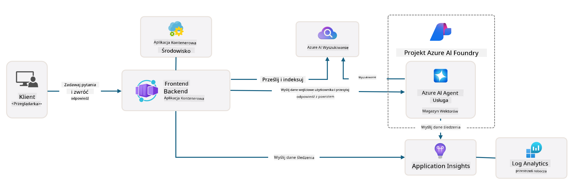

<!--
CO_OP_TRANSLATOR_METADATA:
{
  "original_hash": "4e403f041411361140d6beb88ab2a181",
  "translation_date": "2025-09-24T10:56:34+00:00",
  "source_file": "workshop/docs/instructions/3-Deconstruct-AI-Template.md",
  "language_code": "pl"
}
-->
# 3. Rozłożenie szablonu na części

!!! tip "PO ZAKOŃCZENIU TEGO MODUŁU BĘDZIESZ W STANIE"

    - [ ] Element
    - [ ] Element
    - [ ] Element
    - [ ] **Lab 3:** 

---

Dzięki szablonom AZD i Azure Developer CLI (`azd`) możemy szybko rozpocząć naszą podróż w rozwój AI, korzystając ze standaryzowanych repozytoriów, które zawierają przykładowy kod, infrastrukturę i pliki konfiguracyjne - w formie gotowego do wdrożenia projektu _startowego_.

**Teraz jednak musimy zrozumieć strukturę projektu i kodu - oraz być w stanie dostosować szablon AZD - bez wcześniejszego doświadczenia czy znajomości AZD!**

---

## 1. Aktywacja GitHub Copilot

### 1.1 Zainstaluj GitHub Copilot Chat

Czas na eksplorację [GitHub Copilot w trybie Agent Mode](https://code.visualstudio.com/docs/copilot/chat/chat-agent-mode). Teraz możemy używać języka naturalnego do opisania naszego zadania na wysokim poziomie i uzyskać pomoc w jego realizacji. W tym laboratorium skorzystamy z [Copilot Free plan](https://github.com/github-copilot/signup), który ma miesięczny limit na ukończenia i interakcje w czacie.

Rozszerzenie można zainstalować z marketplace, ale powinno być już dostępne w Twoim środowisku Codespaces. _Kliknij `Open Chat` z rozwijanego menu ikony Copilot - i wpisz polecenie, takie jak `What can you do?`_ - może pojawić się prośba o zalogowanie. **GitHub Copilot Chat jest gotowy**.

### 1.2. Zainstaluj serwery MCP

Aby tryb Agent był skuteczny, potrzebuje dostępu do odpowiednich narzędzi, które pomogą mu w pozyskiwaniu wiedzy lub podejmowaniu działań. Tutaj z pomocą przychodzą serwery MCP. Skonfigurujemy następujące serwery:

1. [Azure MCP Server](../../../../../workshop/docs/instructions)
1. [Microsoft Docs MCP Server](../../../../../workshop/docs/instructions)

Aby je aktywować:

1. Utwórz plik `.vscode/mcp.json`, jeśli jeszcze nie istnieje
1. Skopiuj poniższe do tego pliku - i uruchom serwery!
   ```json title=".vscode/mcp.json"
   {
      "servers": {
         "Azure MCP Server": {
            "command": "npx",
            "args": [
            "-y",
            "@azure/mcp@latest",
            "server",
            "start"
            ]
         },
         "microsoft.docs.mcp": {
            "type": "http",
            "url": "https://learn.microsoft.com/api/mcp"
         }
      }
   }
   ```

??? warning "Możesz otrzymać błąd, że `npx` nie jest zainstalowany (kliknij, aby rozwinąć i zobaczyć rozwiązanie)"

      Aby to naprawić, otwórz plik `.devcontainer/devcontainer.json` i dodaj tę linię do sekcji funkcji. Następnie odbuduj kontener. Powinieneś teraz mieć zainstalowany `npx`.

      ```title="" linenums="0"
         "features": {
            "ghcr.io/devcontainers/features/node:1": {},
            ...
         },
      ```

---

### 1.3. Przetestuj GitHub Copilot Chat

**Najpierw użyj `az login`, aby uwierzytelnić się w Azure z poziomu wiersza poleceń VS Code.**

Teraz powinieneś być w stanie zapytać o status swojej subskrypcji Azure i zadawać pytania dotyczące wdrożonych zasobów lub konfiguracji. Wypróbuj te polecenia:

1. `List my Azure resource groups`
1. `#foundry list my current deployments`

Możesz również zadawać pytania dotyczące dokumentacji Azure i otrzymywać odpowiedzi oparte na serwerze Microsoft Docs MCP. Wypróbuj te polecenia:

1. `#microsoft_docs_search What is Azure Developer CLI?`
1. `#microsoft_docs_search Show me a Python tutorial to chat with deployed model`

Możesz także poprosić o fragmenty kodu do wykonania zadania. Wypróbuj to polecenie:

1. `Give me a Python code example that uses AAD for an interactive chat client`

W trybie `Ask` otrzymasz kod, który możesz skopiować i wypróbować. W trybie `Agent` może to pójść o krok dalej i stworzyć odpowiednie zasoby dla Ciebie - w tym skrypty konfiguracji i dokumentację - aby pomóc Ci wykonać to zadanie.

**Teraz jesteś gotowy do eksploracji repozytorium szablonu**

---

## 2. Rozłożenie architektury na części

??? prompt "ASK: Wyjaśnij architekturę aplikacji w docs/images/architecture.png w jednym akapicie"

      Ta aplikacja to aplikacja czatu oparta na AI, zbudowana na Azure, która demonstruje nowoczesną architekturę opartą na agentach. Rozwiązanie koncentruje się wokół Azure Container App, który hostuje główny kod aplikacji, przetwarzając dane wejściowe użytkownika i generując inteligentne odpowiedzi za pomocą agenta AI. 
      
      Architektura wykorzystuje Azure AI Foundry Project jako podstawę dla możliwości AI, łącząc się z usługami Azure AI, które dostarczają podstawowe modele językowe (takie jak GPT-4o-mini) i funkcjonalność agenta. Interakcje użytkownika przepływają przez frontend oparty na React do backendu FastAPI, który komunikuje się z usługą agenta AI w celu generowania kontekstowych odpowiedzi. 
      
      System zawiera możliwości pozyskiwania wiedzy poprzez wyszukiwanie plików lub usługę Azure AI Search, umożliwiając agentowi dostęp do informacji z przesłanych dokumentów i ich cytowanie. W celu zapewnienia doskonałości operacyjnej architektura obejmuje kompleksowe monitorowanie za pomocą Application Insights i Log Analytics Workspace w celu śledzenia, logowania i optymalizacji wydajności. 
      
      Azure Storage zapewnia przechowywanie blobów dla danych aplikacji i przesłanych plików, podczas gdy Managed Identity zapewnia bezpieczny dostęp między zasobami Azure bez przechowywania poświadczeń. Całe rozwiązanie zostało zaprojektowane z myślą o skalowalności i łatwości utrzymania, z konteneryzowaną aplikacją automatycznie skalującą się w zależności od zapotrzebowania, zapewniając jednocześnie wbudowane funkcje bezpieczeństwa, monitorowania i CI/CD dzięki ekosystemowi zarządzanych usług Azure.



---

## 3. Struktura repozytorium

!!! prompt "ASK: Wyjaśnij strukturę folderów szablonu. Zacznij od wizualnego diagramu hierarchicznego."

??? info "ANSWER: Wizualny diagram hierarchiczny"

      ```bash title="" 
      get-started-with-ai-agents/
      ├── 📋 Konfiguracja i ustawienia
      │   ├── azure.yaml                    # Konfiguracja Azure Developer CLI
      │   ├── docker-compose.yaml           # Kontenery do lokalnego rozwoju
      │   ├── pyproject.toml                # Konfiguracja projektu Python
      │   ├── requirements-dev.txt          # Zależności dla rozwoju
      │   └── .devcontainer/                # Ustawienia kontenera dev dla VS Code
      │
      ├── 🏗️ Infrastruktura (infra/)
      │   ├── main.bicep                    # Główny szablon infrastruktury
      │   ├── api.bicep                     # Zasoby specyficzne dla API
      │   ├── main.parameters.json          # Parametry infrastruktury
      │   └── core/                         # Modularne komponenty infrastruktury
      │       ├── ai/                       # Konfiguracje usług AI
      │       ├── host/                     # Infrastruktura hostingu
      │       ├── monitor/                  # Monitorowanie i logowanie
      │       ├── search/                   # Konfiguracja Azure AI Search
      │       ├── security/                 # Bezpieczeństwo i tożsamość
      │       └── storage/                  # Konfiguracje konta magazynowego
      │
      ├── 💻 Źródła aplikacji (src/)
      │   ├── api/                          # Backend API
      │   │   ├── main.py                   # Wejście aplikacji FastAPI
      │   │   ├── routes.py                 # Definicje tras API
      │   │   ├── search_index_manager.py   # Funkcjonalność wyszukiwania
      │   │   ├── data/                     # Obsługa danych API
      │   │   ├── static/                   # Statyczne zasoby webowe
      │   │   └── templates/                # Szablony HTML
      │   ├── frontend/                     # Frontend React/TypeScript
      │   │   ├── package.json              # Zależności Node.js
      │   │   ├── vite.config.ts            # Konfiguracja budowy Vite
      │   │   └── src/                      # Kod źródłowy frontendu
      │   ├── data/                         # Przykładowe pliki danych
      │   │   └── embeddings.csv            # Wstępnie obliczone osadzenia
      │   ├── files/                        # Pliki bazy wiedzy
      │   │   ├── customer_info_*.json      # Przykładowe dane klientów
      │   │   └── product_info_*.md         # Dokumentacja produktów
      │   ├── Dockerfile                    # Konfiguracja kontenera
      │   └── requirements.txt              # Zależności Python
      │
      ├── 🔧 Automatyzacja i skrypty (scripts/)
      │   ├── postdeploy.sh/.ps1           # Konfiguracja po wdrożeniu
      │   ├── setup_credential.sh/.ps1     # Konfiguracja poświadczeń
      │   ├── validate_env_vars.sh/.ps1    # Walidacja zmiennych środowiskowych
      │   └── resolve_model_quota.sh/.ps1  # Zarządzanie limitami modelu
      │
      ├── 🧪 Testowanie i ocena
      │   ├── tests/                        # Testy jednostkowe i integracyjne
      │   │   └── test_search_index_manager.py
      │   ├── evals/                        # Framework oceny agenta
      │   │   ├── evaluate.py               # Uruchamianie oceny
      │   │   ├── eval-queries.json         # Zapytania testowe
      │   │   └── eval-action-data-path.json
      │   ├── sandbox/                      # Plac zabaw dla rozwoju
      │   │   ├── 1-quickstart.py           # Przykłady na start
      │   │   └── aad-interactive-chat.py   # Przykłady uwierzytelniania
      │   └── airedteaming/                 # Ocena bezpieczeństwa AI
      │       └── ai_redteaming.py          # Testy red team
      │
      ├── 📚 Dokumentacja (docs/)
      │   ├── deployment.md                 # Przewodnik wdrożenia
      │   ├── local_development.md          # Instrukcje lokalnego ustawienia
      │   ├── troubleshooting.md            # Typowe problemy i rozwiązania
      │   ├── azure_account_setup.md        # Wymagania wstępne Azure
      │   └── images/                       # Zasoby dokumentacji
      │
      └── 📄 Metadane projektu
         ├── README.md                     # Przegląd projektu
         ├── CODE_OF_CONDUCT.md           # Wytyczne społeczności
         ├── CONTRIBUTING.md              # Przewodnik dla współtwórców
         ├── LICENSE                      # Warunki licencji
         └── next-steps.md                # Wskazówki po wdrożeniu
      ```

### 3.1. Główna architektura aplikacji

Ten szablon podąża za wzorcem **pełnostackowej aplikacji webowej** z:

- **Backend**: Python FastAPI z integracją Azure AI
- **Frontend**: TypeScript/React z systemem budowy Vite
- **Infrastruktura**: Szablony Azure Bicep dla zasobów w chmurze
- **Konteneryzacja**: Docker dla spójnego wdrożenia

### 3.2 Infrastruktura jako kod (bicep)

Warstwa infrastruktury wykorzystuje **szablony Azure Bicep** zorganizowane modułowo:

   - **`main.bicep`**: Orkiestruje wszystkie zasoby Azure
   - **Moduły `core/`**: Wielokrotnego użytku komponenty dla różnych usług
      - Usługi AI (Azure OpenAI, AI Search)
      - Hosting kontenerów (Azure Container Apps)
      - Monitorowanie (Application Insights, Log Analytics)
      - Bezpieczeństwo (Key Vault, Managed Identity)

### 3.3 Źródła aplikacji (`src/`)

**Backend API (`src/api/`)**:

- REST API oparte na FastAPI
- Integracja z usługą agenta Azure AI
- Zarządzanie indeksami wyszukiwania dla pozyskiwania wiedzy
- Możliwości przesyłania i przetwarzania plików

**Frontend (`src/frontend/`)**:

- Nowoczesny SPA React/TypeScript
- Vite dla szybkiego rozwoju i zoptymalizowanych budów
- Interfejs czatu dla interakcji z agentem

**Baza wiedzy (`src/files/`)**:

- Przykładowe dane klientów i produktów
- Demonstruje pozyskiwanie wiedzy oparte na plikach
- Przykłady w formacie JSON i Markdown

### 3.4 DevOps i automatyzacja

**Skrypty (`scripts/`)**:

- Skrypty PowerShell i Bash dla różnych platform
- Walidacja i konfiguracja środowiska
- Konfiguracja po wdrożeniu
- Zarządzanie limitami modelu

**Integracja Azure Developer CLI**:

- Konfiguracja `azure.yaml` dla przepływów `azd`
- Automatyczne tworzenie i wdrażanie
- Zarządzanie zmiennymi środowiskowymi

### 3.5 Testowanie i zapewnienie jakości

**Framework oceny (`evals/`)**:

- Ocena wydajności agenta
- Testowanie jakości odpowiedzi na zapytania
- Zautomatyzowany pipeline oceny

**Bezpieczeństwo AI (`airedteaming/`)**:

- Testy red team dla bezpieczeństwa AI
- Skanowanie podatności
- Praktyki odpowiedzialnego AI

---

## 4. Gratulacje 🏆

Z powodzeniem użyłeś GitHub Copilot Chat z serwerami MCP, aby eksplorować repozytorium.

- [X] Aktywowałeś GitHub Copilot dla Azure
- [X] Zrozumiałeś architekturę aplikacji
- [X] Eksplorowałeś strukturę szablonu AZD

To daje Ci wyobrażenie o _infrastrukturze jako kodzie_ dla tego szablonu. Następnie przyjrzymy się plikowi konfiguracyjnemu dla AZD.

---

