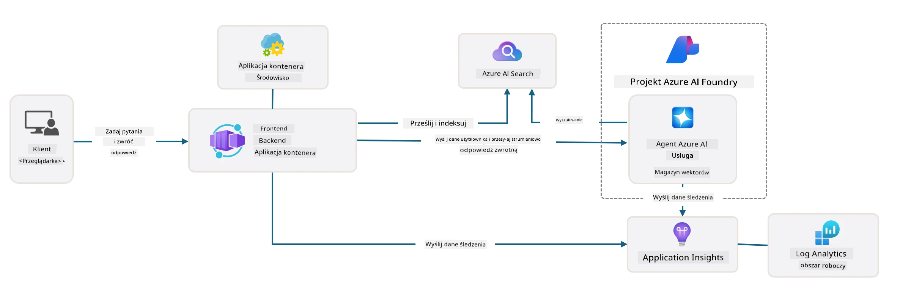

# 3. Rozkładanie szablonu na części

!!! tip "NA KONIEC TEGO MODUŁU BĘDZIESZ POTRAFIŁ"

    - [ ] Aktywować GitHub Copilot z serwerami MCP do wsparcia Azure
    - [ ] Zrozumieć strukturę folderów i komponenty szablonu AZD
    - [ ] Poznać wzorce organizacji infrastruktury jako kodu (Bicep)
    - [ ] **Lab 3:** Użyć GitHub Copilot, aby zbadać i zrozumieć architekturę repozytorium

---


Dzięki szablonom AZD i Azure Developer CLI (`azd`) możemy szybko rozpocząć naszą przygodę z AI za pomocą ustandaryzowanych repozytoriów, które dostarczają przykładowy kod, pliki infrastruktury i konfiguracji – w formie gotowego do wdrożenia _projektu startowego_.

**Teraz jednak musimy zrozumieć strukturę projektu i bazę kodu – oraz móc dostosować szablon AZD – bez żadnego wcześniejszego doświadczenia czy znajomości AZD!**

---

## 1. Aktywuj GitHub Copilot

### 1.1 Zainstaluj GitHub Copilot Chat

Czas zwiedzić [GitHub Copilot z trybem Agenta](https://code.visualstudio.com/docs/copilot/chat/chat-agent-mode). Teraz możemy opisywać nasze zadania językiem naturalnym na wysokim poziomie i otrzymywać pomoc w ich wykonaniu. Do tego laboratorium użyjemy [planu Copilot Free](https://github.com/github-copilot/signup), który ma miesięczny limit na wykonania i interakcje czatu.

Rozszerzenie można zainstalować z marketplace, ale powinno być już dostępne w Twoim środowisku Codespaces. _Kliknij `Open Chat` z rozwijanego menu ikony Copilot – i wpisz pytanie takie jak `What can you do?`_ – może pojawić się monit o zalogowanie. **GitHub Copilot Chat jest gotowy do użycia**.

### 1.2. Zainstaluj serwery MCP

Aby tryb Agenta był skuteczny, potrzebuje dostępu do odpowiednich narzędzi, które pomogą mu pozyskiwać wiedzę lub podejmować działania. Tutaj mogą pomóc serwery MCP. Skonfigurujemy następujące serwery:

1. [Azure MCP Server](../../../../../workshop/docs/instructions)
1. [Microsoft Docs MCP Server](../../../../../workshop/docs/instructions)

Aby je aktywować:

1. Utwórz plik o nazwie `.vscode/mcp.json`, jeśli nie istnieje
1. Skopiuj do tego pliku następującą zawartość – i uruchom serwery!
   ```json title=".vscode/mcp.json"
   {
      "servers": {
         "Azure MCP Server": {
            "command": "npx",
            "args": [
            "-y",
            "@azure/mcp@latest",
            "server",
            "start"
            ]
         },
         "microsoft.docs.mcp": {
            "type": "http",
            "url": "https://learn.microsoft.com/api/mcp"
         }
      }
   }
   ```

??? warning "Możesz otrzymać błąd, że `npx` nie jest zainstalowane (kliknij, aby rozwinąć rozwiązanie)"

      Aby to naprawić, otwórz plik `.devcontainer/devcontainer.json` i dodaj tę linię do sekcji features. Następnie przebuduj kontener. Teraz powinieneś mieć zainstalowane `npx`.

      ```title="" linenums="0"
         "features": {
            "ghcr.io/devcontainers/features/node:1": {},
            ...
         },
      ```

---

### 1.3. Przetestuj GitHub Copilot Chat

**Najpierw użyj `az login`, aby uwierzytelnić się w Azure z poziomu konsoli VS Code.**

Teraz powinieneś móc zapytać o status swojej subskrypcji Azure i zadawać pytania o wdrożone zasoby czy konfigurację. Wypróbuj następujące polecenia:

1. `List my Azure resource groups`
1. `#foundry list my current deployments`

Możesz też pytać o dokumentację Azure i otrzymwać odpowiedzi oparte na serwerze Microsoft Docs MCP. Wypróbuj:

1. `#microsoft_docs_search What is Azure Developer CLI?`
1. `#microsoft_docs_search Show me a Python tutorial to chat with deployed model`

Lub możesz poprosić o fragmenty kodu wykonujące dane zadanie. Spróbuj to polecenie.

1. `Give me a Python code example that uses AAD for an interactive chat client`

W trybie `Ask` otrzymasz kod, który możesz skopiować i wypróbować. W trybie `Agent` może to pójść krok dalej i utworzyć odpowiednie zasoby – w tym skrypty konfiguracji i dokumentację – aby pomóc Ci wykonać to zadanie.

**Jesteś teraz wyposażony, by zacząć eksplorować repozytorium szablonu**

---

## 2. Rozkładanie Architektury

??? prompt "ZAPYTANIE: Wyjaśnij architekturę aplikacji w docs/images/architecture.png w 1 akapicie"

      Ta aplikacja to oparta na AI aplikacja do czatu działająca na Azure, prezentująca nowoczesną architekturę opartą na agentach. Rozwiązanie koncentruje się wokół Azure Container App, który hostuje główny kod aplikacji, przetwarzający dane wejściowe od użytkownika i generujący inteligentne odpowiedzi za pomocą agenta AI.
      
      Architektura wykorzystuje Microsoft Foundry Project jako fundament możliwości AI, łącząc się z usługami Azure AI, które dostarczają bazowe modele językowe (takie jak GPT-4o-mini) i funkcjonalność agentów. Interakcje użytkownika przechodzą przez frontend oparty na React do backendu FastAPI, który komunikuje się z usługą agenta AI w celu generowania kontekstowych odpowiedzi.
      
      System zawiera funkcje pozyskiwania wiedzy przez wyszukiwanie w plikach lub usługę Azure AI Search, co pozwala agentowi na dostęp i cytowanie informacji z przesłanych dokumentów.
      
      Dla doskonałości operacyjnej architektura obejmuje kompleksowy monitoring za pomocą Application Insights i Log Analytics Workspace do śledzenia, logowania i optymalizacji wydajności.
      
      Azure Storage zapewnia przechowywanie blobów dla danych aplikacji i przesyłanych plików, a Managed Identity gwarantuje bezpieczny dostęp pomiędzy zasobami Azure bez przechowywania poświadczeń. Całe rozwiązanie jest zaprojektowane pod kątem skalowalności i utrzymania, a konteneryzowana aplikacja automatycznie się skaluje w oparciu o zapotrzebowanie, oferując wbudowane funkcje bezpieczeństwa, monitoringu i CI/CD poprzez ekosystem zarządzanych usług Azure.



---

## 3. Struktura Repozytorium

!!! prompt "ZAPYTANIE: Wyjaśnij strukturę folderów szablonu. Zacznij od wizualnego diagramu hierarchicznego."

??? info "ODPOWIEDŹ: Wizualny diagram hierarchiczny"

      ```bash title="" 
      get-started-with-ai-agents/
      ├── 📋 Konfiguracja i ustawienia
      │   ├── azure.yaml                    # Konfiguracja Azure Developer CLI
      │   ├── docker-compose.yaml           # Kontenery do lokalnego rozwoju
      │   ├── pyproject.toml                # Konfiguracja projektu Python
      │   ├── requirements-dev.txt          # Zależności developerskie
      │   └── .devcontainer/                # Ustawienia dev contanera VS Code
      │
      ├── 🏗️ Infrastruktura (infra/)
      │   ├── main.bicep                    # Główny szablon infrastruktury
      │   ├── api.bicep                     # Zasoby specyficzne dla API
      │   ├── main.parameters.json          # Parametry infrastruktury
      │   └── core/                         # Modularne komponenty infrastruktury
      │       ├── ai/                       # Konfiguracje usług AI
      │       ├── host/                     # Infrastruktura hostingu
      │       ├── monitor/                  # Monitorowanie i logowanie
      │       ├── search/                   # Konfiguracja Azure AI Search
      │       ├── security/                 # Bezpieczeństwo i tożsamość
      │       └── storage/                  # Konfiguracje kont magazynowych
      │
      ├── 💻 Kod źródłowy aplikacji (src/)
      │   ├── api/                          # Backend API
      │   │   ├── main.py                   # Punkt startowy aplikacji FastAPI
      │   │   ├── routes.py                 # Definicje tras API
      │   │   ├── search_index_manager.py   # Funkcjonalność wyszukiwania
      │   │   ├── data/                     # Przetwarzanie danych API
      │   │   ├── static/                   # Statyczne zasoby webowe
      │   │   └── templates/                # Szablony HTML
      │   ├── frontend/                     # Frontend React/TypeScript
      │   │   ├── package.json              # Zależności Node.js
      │   │   ├── vite.config.ts            # Konfiguracja budowy Vite
      │   │   └── src/                      # Kod źródłowy frontendu
      │   ├── data/                         # Przykładowe pliki danych
      │   │   └── embeddings.csv            # Przedobliczone osadzenia (embeddings)
      │   ├── files/                        # Pliki bazy wiedzy
      │   │   ├── customer_info_*.json      # Przykłady danych klientów
      │   │   └── product_info_*.md         # Dokumentacja produktów
      │   ├── Dockerfile                    # Konfiguracja kontenera
      │   └── requirements.txt              # Zależności Pythona
      │
      ├── 🔧 Automatyzacja i skrypty (scripts/)
      │   ├── postdeploy.sh/.ps1           # Konfiguracja po wdrożeniu
      │   ├── setup_credential.sh/.ps1     # Konfiguracja poświadczeń
      │   ├── validate_env_vars.sh/.ps1    # Walidacja zmiennych środowiskowych
      │   └── resolve_model_quota.sh/.ps1  # Zarządzanie limitem modeli
      │
      ├── 🧪 Testowanie i ocena
      │   ├── tests/                        # Testy jednostkowe i integracyjne
      │   │   └── test_search_index_manager.py
      │   ├── evals/                        # Framework oceny agentów
      │   │   ├── evaluate.py               # Uruchamianie testów
      │   │   ├── eval-queries.json         # Zapytania testowe
      │   │   └── eval-action-data-path.json
      │   ├── sandbox/                      # Plac zabaw developmentu
      │   │   ├── 1-quickstart.py           # Przykłady startowe
      │   │   └── aad-interactive-chat.py   # Przykłady uwierzytelniania
      │   └── airedteaming/                 # Ocena bezpieczeństwa AI
      │       └── ai_redteaming.py          # Testy Red teamu
      │
      ├── 📚 Dokumentacja (docs/)
      │   ├── deployment.md                 # Przewodnik wdrożeniowy
      │   ├── local_development.md          # Instrukcje lokalnej konfiguracji
      │   ├── troubleshooting.md            # Częste problemy i ich rozwiązania
      │   ├── azure_account_setup.md        # Wymagania wstępne Azure
      │   └── images/                       # Zasoby do dokumentacji
      │
      └── 📄 Metadane projektu
         ├── README.md                     # Przegląd projektu
         ├── CODE_OF_CONDUCT.md           # Zasady społeczności
         ├── CONTRIBUTING.md              # Przewodnik współpracy
         ├── LICENSE                      # Warunki licencji
         └── next-steps.md                # Wskazówki po wdrożeniu
      ```

### 3.1. Architektura głównej aplikacji

Ten szablon stosuje wzorzec **pełnostackowej aplikacji webowej** z:

- **Backend**: Python FastAPI z integracją Azure AI
- **Frontend**: TypeScript/React z systemem budowania Vite
- **Infrastruktura**: szablony Azure Bicep dla zasobów chmurowych
- **Konteneryzacja**: Docker do spójnego wdrażania

### 3.2 Infrastruktura jako kod (bicep)

Warstwa infrastruktury korzysta z modularnych szablonów **Azure Bicep**:

   - **`main.bicep`**: Koordynuje wszystkie zasoby Azure
   - **Moduły `core/`**: Wielokrotnego użytku komponenty dla różnych usług
      - Usługi AI (Azure OpenAI, AI Search)
      - Hosting kontenerów (Azure Container Apps)
      - Monitorowanie (Application Insights, Log Analytics)
      - Bezpieczeństwo (Key Vault, Managed Identity)

### 3.3 Kod źródłowy aplikacji (`src/`)

**Backend API (`src/api/`)**:

- REST API oparte na FastAPI
- Integracja z agentami Foundry
- Zarządzanie indeksami wyszukiwania dla pozyskiwania wiedzy
- Obsługa przesyłania i przetwarzania plików

**Frontend (`src/frontend/`)**:

- Nowoczesna SPA w React/TypeScript
- Vite dla szybkiego rozwoju i zoptymalizowanych buildów
- Interfejs czatu do interakcji z agentem

**Baza Wiedzy (`src/files/`)**:

- Przykładowe dane klientów i produktów
- Prezentuje pozyskiwanie wiedzy na podstawie plików
- Przykłady w formacie JSON i Markdown

### 3.4 DevOps i automatyzacja

**Skrypty (`scripts/`)**:

- Skrypty PowerShell i Bash działające na wielu platformach
- Walidacja i konfiguracja środowiska
- Konfiguracja po wdrożeniu
- Zarządzanie limitami modeli

**Integracja Azure Developer CLI**:

- Konfiguracja `azure.yaml` dla workflow `azd`
- Automatyczne provisionowanie i wdrażanie
- Zarządzanie zmiennymi środowiskowymi

### 3.5 Testowanie i zapewnienie jakości

**Framework oceny (`evals/`)**:

- Ocena wydajności agentów
- Testowanie jakości zapytań i odpowiedzi
- Zautomatyzowany pipeline oceny

**Bezpieczeństwo AI (`airedteaming/`)**:

- Testy red team dla bezpieczeństwa AI
- Skanowanie podatności bezpieczeństwa
- Praktyki odpowiedzialnej sztucznej inteligencji

---

## 4. Gratulacje 🏆

Pomyślnie użyłeś GitHub Copilot Chat z serwerami MCP, aby zbadać repozytorium.

- [X] Aktywowano GitHub Copilot dla Azure
- [X] Zrozumiano architekturę aplikacji
- [X] Zbadano strukturę szablonu AZD

Daje to ogólne rozeznanie w zasobach _infrastruktury jako kod_ dla tego szablonu. Następnie przyjrzymy się plikowi konfiguracyjnemu dla AZD.

---

<!-- CO-OP TRANSLATOR DISCLAIMER START -->
**Zastrzeżenie**:  
Dokument ten został przetłumaczony za pomocą usługi tłumaczeń AI [Co-op Translator](https://github.com/Azure/co-op-translator). Pomimo naszych starań o dokładność, prosimy mieć na uwadze, że automatyczne tłumaczenia mogą zawierać błędy lub niedokładności. Za źródło autorytatywne należy uznać oryginalny dokument w języku źródłowym. W przypadku informacji krytycznych zaleca się skorzystanie z profesjonalnego tłumaczenia wykonanego przez człowieka. Nie ponosimy odpowiedzialności za jakiekolwiek nieporozumienia lub błędne interpretacje wynikające z korzystania z tego tłumaczenia.
<!-- CO-OP TRANSLATOR DISCLAIMER END -->