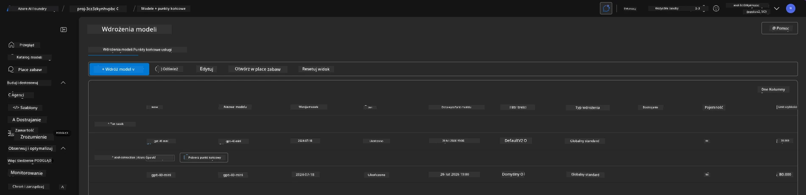
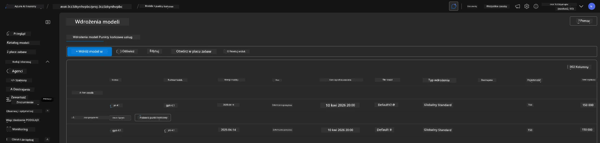

# 6. Usuwanie infrastruktury

!!! tip "NA KONIEC TEGO MODUŁU BĘDZIESZ MÓGŁ"

    - [ ] Zrozumieć znaczenie czyszczenia zasobów i zarządzania kosztami
    - [ ] Użyć `azd down` do bezpiecznego usunięcia infrastruktury
    - [ ] Odzyskać miękko usunięte usługi kognitywne w razie potrzeby
    - [ ] **Laboratorium 6:** Posprzątać zasoby Azure i zweryfikować ich usunięcie

---

## Ćwiczenia bonusowe

Zanim usuniemy projekt, poświęć kilka minut na swobodne eksperymentowanie.

!!! info "Wypróbuj te pytania eksploracyjne"

    **Eksperymentuj z GitHub Copilot:**
    
    1. Zapytaj: `Jakie inne szablony AZD mógłbym wypróbować dla scenariuszy wieloagentowych?`
    2. Zapytaj: `Jak mogę dostosować instrukcje dla agenta w zastosowaniu medycznym?`
    3. Zapytaj: `Jakie zmienne środowiskowe kontrolują optymalizację kosztów?`
    
    **Zwiedź portal Azure:**
    
    1. Przejrzyj metryki Application Insights dla swojego wdrożenia
    2. Sprawdź analizę kosztów zasobów, które zostały udostępnione
    3. Jeszcze raz zbadaj portal Microsoft Foundry agent playground

---

## Usuwanie infrastruktury

1. Usunięcie infrastruktury jest tak proste jak:
      
      ```bash title="" linenums="0"
      azd down --purge
      ```
1. Flaga `--purge` zapewnia także usunięcie miękko usuniętych zasobów Cognitive Service, zwalniając tym samym przydział zasobów zajmowany przez te zasoby. Po zakończeniu zobaczysz coś takiego:
      
      ```bash title="" linenums="0"
      ? Total resources to delete: 11, are you sure you want to continue? Yes
      Deleting your resources can take some time.
      (✓) Done: Deleted resource group rg-nitya-mshack-azd
      (✓) Done: Purging Cognitive Account: aoai-3cz3zkynhvpbc

      SUCCESS: Your application was removed from Azure in 11 minutes 4 seconds.
      ```

1. (Opcjonalnie) Jeśli teraz ponownie uruchomisz `azd up`, zauważysz, że model gpt-4.1 zostanie wdrożony, ponieważ zmienna środowiskowa została zmieniona (i zapisana) w lokalnym folderze `.azure`.

      Oto wdrożenia modelu **przed**:

      

      A oto **po**:
      

---

<!-- CO-OP TRANSLATOR DISCLAIMER START -->
**Zastrzeżenie**:  
Niniejszy dokument został przetłumaczony za pomocą usługi tłumaczenia AI [Co-op Translator](https://github.com/Azure/co-op-translator). Mimo że dążymy do jak największej dokładności, prosimy mieć na uwadze, że automatyczne tłumaczenia mogą zawierać błędy lub nieścisłości. Oryginalny dokument w jego rodzimym języku powinien być uważany za źródło autorytatywne. W przypadku informacji krytycznych zalecane jest skorzystanie z profesjonalnego tłumaczenia wykonanego przez człowieka. Nie ponosimy odpowiedzialności za jakiekolwiek nieporozumienia lub błędne interpretacje wynikające z korzystania z tego tłumaczenia.
<!-- CO-OP TRANSLATOR DISCLAIMER END -->