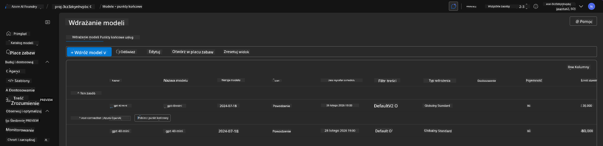
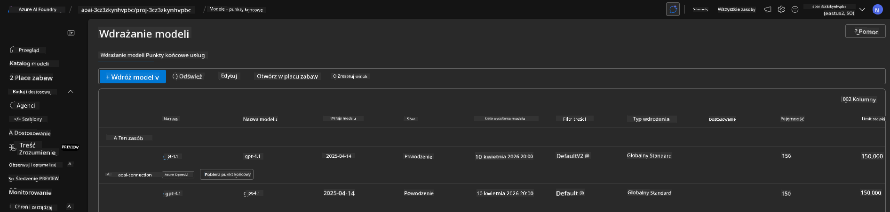

<!--
CO_OP_TRANSLATOR_METADATA:
{
  "original_hash": "6539a34c770f3ceff282370d72ee74dc",
  "translation_date": "2025-09-24T10:55:09+00:00",
  "source_file": "workshop/docs/instructions/6-Teardown-Infrastructure.md",
  "language_code": "pl"
}
-->
# 6. Rozbiórka infrastruktury

!!! tip "PO ZAKOŃCZENIU TEGO MODUŁU BĘDZIESZ W STANIE"

    - [ ] Element
    - [ ] Element
    - [ ] Element

---

## Dodatkowe ćwiczenia

Zanim rozbierzemy projekt, poświęć kilka minut na otwartą eksplorację.

!!! danger "NITYA-TODO: Zarysuj kilka sugestii do wypróbowania"

---

## Usuwanie infrastruktury

1. Rozbiórka infrastruktury jest tak prosta jak:
      
      ```bash title="" linenums="0"
      azd down --purge
      ```
1. Flaga `--purge` zapewnia, że usuwane są również zasoby Cognitive Service, które zostały miękko usunięte, zwalniając tym samym limit przypisany do tych zasobów. Po zakończeniu zobaczysz coś takiego:
      
      ```bash title="" linenums="0"
      ? Total resources to delete: 11, are you sure you want to continue? Yes
      Deleting your resources can take some time.
      (✓) Done: Deleted resource group rg-nitya-mshack-azd
      (✓) Done: Purging Cognitive Account: aoai-3cz3zkynhvpbc

      SUCCESS: Your application was removed from Azure in 11 minutes 4 seconds.
      ```

1. (Opcjonalnie) Jeśli teraz uruchomisz ponownie `azd up`, zauważysz, że model gpt-4.1 zostanie wdrożony, ponieważ zmieniono (i zapisano) zmienną środowiskową w lokalnym folderze `.azure`.

      Oto wdrożenia modelu **przed**:

      

      A oto **po**:
      

---

