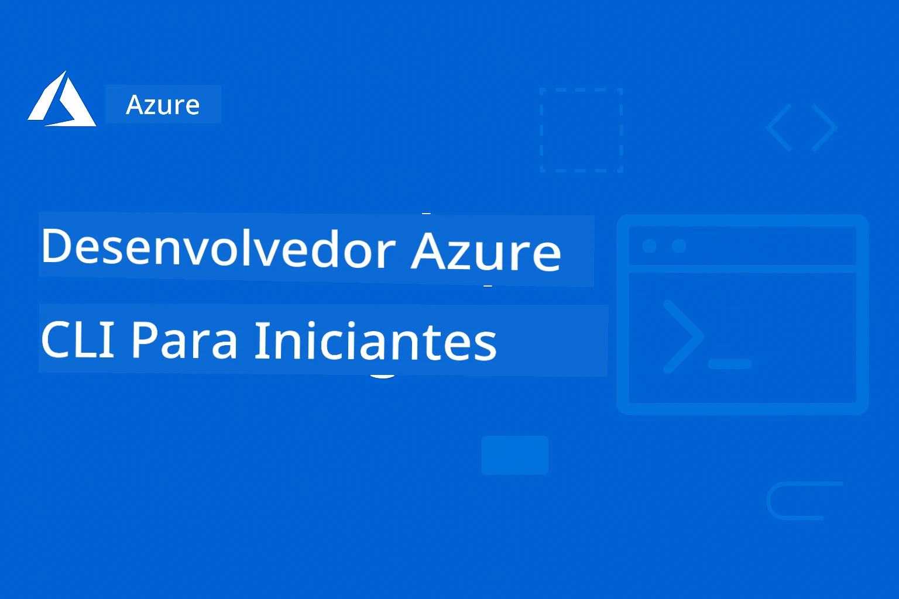

# AZD para Iniciantes: Uma Jornada de Aprendizado Estruturada

 

[](https://GitHub.com/microsoft/azd-for-beginners/watchers/)
[](https://GitHub.com/microsoft/azd-for-beginners/network/)
[](https://GitHub.com/microsoft/azd-for-beginners/stargazers/)

[](https://discord.gg/microsoft-azure)
[](https://discord.gg/nTYy5BXMWG)

---

### Traduções Automatizadas (Sempre Atualizadas)

<!-- CO-OP TRANSLATOR LANGUAGES TABLE START -->
[Árabe](../ar/README.md) | [Bengalês](../bn/README.md) | [Búlgaro](../bg/README.md) | [Birmanês (Myanmar)](../my/README.md) | [Chinês (Simplificado)](../zh-CN/README.md) | [Chinês (Tradicional, Hong Kong)](../zh-HK/README.md) | [Chinês (Tradicional, Macau)](../zh-MO/README.md) | [Chinês (Tradicional, Taiwan)](../zh-TW/README.md) | [Croata](../hr/README.md) | [Tcheco](../cs/README.md) | [Dinamarquês](../da/README.md) | [Holandês](../nl/README.md) | [Estoniano](../et/README.md) | [Finlandês](../fi/README.md) | [Francês](../fr/README.md) | [Alemão](../de/README.md) | [Grego](../el/README.md) | [Hebraico](../he/README.md) | [Hindi](../hi/README.md) | [Húngaro](../hu/README.md) | [Indonésio](../id/README.md) | [Italiano](../it/README.md) | [Japonês](../ja/README.md) | [Kannada](../kn/README.md) | [Coreano](../ko/README.md) | [Lituano](../lt/README.md) | [Malaio](../ms/README.md) | [Malaialam](../ml/README.md) | [Marathi](../mr/README.md) | [Nepali](../ne/README.md) | [Pidgin Nigeriano](../pcm/README.md) | [Norueguês](../no/README.md) | [Persa (Farsi)](../fa/README.md) | [Polonês](../pl/README.md) | [Português (Brasil)](./README.md) | [Português (Portugal)](../pt-PT/README.md) | [Punjabi (Gurmukhi)](../pa/README.md) | [Romeno](../ro/README.md) | [Russo](../ru/README.md) | [Sérvio (Cirílico)](../sr/README.md) | [Eslovaco](../sk/README.md) | [Esloveno](../sl/README.md) | [Espanhol](../es/README.md) | [Suaíli](../sw/README.md) | [Sueco](../sv/README.md) | [Tagalog (Filipino)](../tl/README.md) | [Tâmil](../ta/README.md) | [Telugu](../te/README.md) | [Tailandês](../th/README.md) | [Turco](../tr/README.md) | [Ucraniano](../uk/README.md) | [Urdu](../ur/README.md) | [Vietnamita](../vi/README.md)

> **Prefere clonar localmente?**
>
> Este repositório inclui mais de 50 traduções, o que aumenta significativamente o tamanho do download. Para clonar sem traduções, use sparse checkout:
>
> **Bash / macOS / Linux:**
> ```bash
> git clone --filter=blob:none --sparse https://github.com/microsoft/AZD-for-beginners.git
> cd AZD-for-beginners
> git sparse-checkout set --no-cone '/*' '!translations' '!translated_images'
> ```
>
> **CMD (Windows):**
> ```cmd
> git clone --filter=blob:none --sparse https://github.com/microsoft/AZD-for-beginners.git
> cd AZD-for-beginners
> git sparse-checkout set --no-cone "/*" "!translations" "!translated_images"
> ```
>
> Isso fornece tudo o que você precisa para concluir o curso com um download muito mais rápido.
<!-- CO-OP TRANSLATOR LANGUAGES TABLE END -->

## 🚀 O que é o Azure Developer CLI (azd)?

**Azure Developer CLI (azd)** é uma ferramenta de linha de comando amigável para desenvolvedores que simplifica o deploy de aplicações para o Azure. Em vez de criar e conectar manualmente dezenas de recursos do Azure, você pode implantar aplicações inteiras com um único comando.

### A Mágica do `azd up`

```bash
# Este único comando faz tudo:
# ✅ Cria todos os recursos do Azure
# ✅ Configura rede e segurança
# ✅ Constrói o código da sua aplicação
# ✅ Implanta no Azure
# ✅ Fornece uma URL funcionando
azd up
```

**Isso é tudo!** Sem cliques no Portal do Azure, sem precisar aprender templates ARM complexos primeiro, sem configuração manual - apenas aplicações funcionando no Azure.

---

## ❓ Azure Developer CLI vs Azure CLI: Qual é a Diferença?

Esta é a pergunta mais comum entre iniciantes. Aqui está a resposta simples:

| Recurso | **Azure CLI (`az`)** | **Azure Developer CLI (`azd`)** |
|---------|---------------------|--------------------------------|
| **Objetivo** | Gerenciar recursos individuais do Azure | Implantar aplicações completas |
| **Mentalidade** | Focado na infraestrutura | Focado na aplicação |
| **Exemplo** | `az webapp create --name myapp...` | `azd up` |
| **Curva de Aprendizado** | É preciso conhecer serviços do Azure | Basta conhecer sua aplicação |
| **Indicado Para** | DevOps, Infraestrutura | Desenvolvedores, Prototipagem |

### Analogia Simples

- **Azure CLI** é como ter todas as ferramentas para construir uma casa - martelos, serras, pregos. Você pode construir qualquer coisa, mas precisa conhecer construção.
- **Azure Developer CLI** é como contratar um empreiteiro - você descreve o que quer, e ele cuida da construção.

### Quando Usar Cada Um

| Cenário | Use Isso |
|----------|----------|
| "Quero implantar meu aplicativo web rapidamente" | `azd up` |
| "Preciso criar apenas uma conta de armazenamento" | `az storage account create` |
| "Estou construindo um aplicativo de IA completo" | `azd init --template azure-search-openai-demo` |
| "Preciso depurar um recurso específico do Azure" | `az resource show` |
| "Quero uma implantação pronta para produção em minutos" | `azd up --environment production` |

### Eles Funcionam Juntos!

O AZD usa o Azure CLI por baixo dos panos. Você pode usar ambos:
```bash
# Faça o deploy do seu app com AZD
azd up

# Em seguida, ajuste recursos específicos com Azure CLI
az webapp config set --name myapp --always-on true
```

---

## 🌟 Encontre Templates no Awesome AZD

Não comece do zero! **Awesome AZD** é a coleção da comunidade de templates prontos para implantar:

| Recurso | Descrição |
|----------|-------------|
| 🔗 [**Galeria Awesome AZD**](https://azure.github.io/awesome-azd/) | Navegue por mais de 200 templates com implantação com um clique |
| 🔗 [**Enviar um Template**](https://github.com/Azure/awesome-azd/issues) | Contribua com seu próprio template para a comunidade |
| 🔗 [**Repositório no GitHub**](https://github.com/Azure/awesome-azd) | Dê uma estrela e explore o código-fonte |

### Templates Populares de IA do Awesome AZD

```bash
# Chat RAG com Azure OpenAI + Pesquisa de IA
azd init --template azure-search-openai-demo

# Aplicativo Rápido de Chat de IA
azd init --template openai-chat-app-quickstart

# Agentes de IA com Agentes Foundry
azd init --template get-started-with-ai-agents
```

---

## 🎯 Começando em 3 Passos

### Passo 1: Instalar o AZD (2 minutos)

**Windows:**
```powershell
winget install microsoft.azd
```

**macOS:**
```bash
brew tap azure/azd && brew install azd
```

**Linux:**
```bash
curl -fsSL https://aka.ms/install-azd.sh | bash
```

### Passo 2: Fazer login no Azure

```bash
azd auth login
```

### Passo 3: Implante Seu Primeiro App

```bash
# Inicializar a partir de um modelo
azd init --template todo-nodejs-mongo

# Implantar no Azure (cria tudo!)
azd up
```

**🎉 Pronto!** Seu app agora está ativo no Azure.

### Limpeza (Não Esqueça!)

```bash
# Remove all resources when done experimenting
azd down --force --purge
```

---

## 📚 Como Usar Este Curso

Este curso foi projetado para um **aprendizado progressivo** - comece de onde se sentir confortável e avance gradualmente:

| Sua Experiência | Comece Aqui |
|-----------------|------------|
| **Novo no Azure** | [Capítulo 1: Fundamentos](../..) |
| **Conhece o Azure, novo no AZD** | [Capítulo 1: Fundamentos](../..) |
| **Quer implantar apps de IA** | [Capítulo 2: Desenvolvimento com Foco em IA](../..) |
| **Quer prática prática** | [🎓 Workshop Interativo](workshop/README.md) - laboratório guiado de 3-4 horas |
| **Precisa de padrões de produção** | [Capítulo 8: Produção & Padrões Corporativos](../..) |

### Configuração Rápida

1. **Faça um Fork Deste Repositório**: [](https://GitHub.com/microsoft/azd-for-beginners/fork)
2. **Clone este repositório**: `git clone https://github.com/YOUR-USERNAME/azd-for-beginners.git`
3. **Obtenha Ajuda**: [Comunidade Discord do Azure](https://discord.com/invite/ByRwuEEgH4)

> **Prefere clonar localmente?**
>
> Este repositório inclui mais de 50 traduções, o que aumenta significativamente o tamanho do download. Para clonar sem traduções, use sparse checkout:
> ```bash
> git clone --filter=blob:none --sparse https://github.com/microsoft/AZD-for-beginners.git
> cd AZD-for-beginners
> git sparse-checkout set --no-cone '/*' '!translations' '!translated_images'
> ```
> Isso fornece tudo o que você precisa para concluir o curso com um download muito mais rápido.


## Visão Geral do Curso

Domine o Azure Developer CLI (azd) através de capítulos estruturados projetados para aprendizado progressivo. **Foco especial no deploy de aplicações de IA com integração ao Microsoft Foundry.**

### Por que Este Curso é Essencial para Desenvolvedores Modernos

Com base em insights da comunidade Microsoft Foundry no Discord, **45% dos desenvolvedores querem usar AZD para cargas de trabalho de IA** mas encontram desafios com:
- Arquiteturas de IA complexas com múltiplos serviços
- Melhores práticas para implantação de IA em produção  
- Integração e configuração de serviços de IA do Azure
- Otimização de custos para cargas de trabalho de IA
- Solução de problemas específicos de implantação de IA

### Objetivos de Aprendizagem

Ao concluir este curso estruturado, você irá:
- **Dominar os Fundamentos do AZD**: Conceitos básicos, instalação e configuração
- **Implantar Aplicações de IA**: Use o AZD com serviços Microsoft Foundry
- **Implementar Infraestrutura como Código**: Gerenciar recursos do Azure com templates Bicep
- **Solução de Problemas em Implantações**: Resolver problemas comuns e depurar falhas
- **Otimizar para Produção**: Segurança, escalonamento, monitoramento e gerenciamento de custos
- **Construir Soluções Multiagente**: Implantar arquiteturas de IA complexas

## 🗺️ Mapa do Curso: Navegação Rápida por Capítulo

Cada capítulo possui um README dedicado com objetivos de aprendizagem, guias rápidos e exercícios:

| Capítulo | Tópico | Aulas | Duração | Complexidade |
|---------|-------|---------|----------|------------|
| **[Ch 1: Foundation](docs/chapter-01-foundation/README.md)** | Introdução | [Noções Básicas do AZD](docs/chapter-01-foundation/azd-basics.md) &#124; [Instalação](docs/chapter-01-foundation/installation.md) &#124; [Primeiro Projeto](docs/chapter-01-foundation/first-project.md) | 30-45 min | ⭐ |
| **[Ch 2: AI Development](docs/chapter-02-ai-development/README.md)** | Aplicações com Foco em IA | [Integração com Foundry](docs/chapter-02-ai-development/microsoft-foundry-integration.md) &#124; [Agentes de IA](docs/chapter-02-ai-development/agents.md) &#124; [Implantação de Modelos](docs/chapter-02-ai-development/ai-model-deployment.md) &#124; [Workshop](docs/chapter-02-ai-development/ai-workshop-lab.md) | 1-2 horas | ⭐⭐ |
| **[Ch 3: Configuration](docs/chapter-03-configuration/README.md)** | Auth & Security | [Configuração](docs/chapter-03-configuration/configuration.md) &#124; [Autenticação & Segurança](docs/chapter-03-configuration/authsecurity.md) | 45-60 min | ⭐⭐ |
| **[Capítulo 4: Infraestrutura](docs/chapter-04-infrastructure/README.md)** | IaC & Implantação | [Guia de Implantação](docs/chapter-04-infrastructure/deployment-guide.md) &#124; [Provisionamento](docs/chapter-04-infrastructure/provisioning.md) | 1-1.5 hrs | ⭐⭐⭐ |
| **[Capítulo 5: Multi-Agente](docs/chapter-05-multi-agent/README.md)** | Soluções de Agentes de IA | [Cenário de Varejo](examples/retail-scenario.md) &#124; [Padrões de Coordenação](docs/chapter-06-pre-deployment/coordination-patterns.md) | 2-3 hrs | ⭐⭐⭐⭐ |
| **[Capítulo 6: Pré-implantação](docs/chapter-06-pre-deployment/README.md)** | Planejamento & Validação | [Verificações Pré-implantação](docs/chapter-06-pre-deployment/preflight-checks.md) &#124; [Planejamento de Capacidade](docs/chapter-06-pre-deployment/capacity-planning.md) &#124; [Seleção de SKU](docs/chapter-06-pre-deployment/sku-selection.md) &#124; [Application Insights](docs/chapter-06-pre-deployment/application-insights.md) | 1 hr | ⭐⭐ |
| **[Capítulo 7: Solução de Problemas](docs/chapter-07-troubleshooting/README.md)** | Depuração & Correção | [Problemas Comuns](docs/chapter-07-troubleshooting/common-issues.md) &#124; [Depuração](docs/chapter-07-troubleshooting/debugging.md) &#124; [Problemas de IA](docs/chapter-07-troubleshooting/ai-troubleshooting.md) | 1-1.5 hrs | ⭐⭐ |
| **[Capítulo 8: Produção](docs/chapter-08-production/README.md)** | Padrões Empresariais | [Práticas de Produção](docs/chapter-08-production/production-ai-practices.md) | 2-3 hrs | ⭐⭐⭐⭐ |
| **[🎓 Workshop](workshop/README.md)** | Laboratório Prático | [Introdução](workshop/docs/instructions/0-Introduction.md) &#124; [Seleção](workshop/docs/instructions/1-Select-AI-Template.md) &#124; [Validação](workshop/docs/instructions/2-Validate-AI-Template.md) &#124; [Desconstrução](workshop/docs/instructions/3-Deconstruct-AI-Template.md) &#124; [Configuração](workshop/docs/instructions/4-Configure-AI-Template.md) &#124; [Personalização](workshop/docs/instructions/5-Customize-AI-Template.md) &#124; [Desmontagem](workshop/docs/instructions/6-Teardown-Infrastructure.md) &#124; [Conclusão](workshop/docs/instructions/7-Wrap-up.md) | 3-4 hrs | ⭐⭐ |

**Total Course Duration:** ~10-14 hours | **Skill Progression:** Beginner → Production-Ready

---

## 📚 Capítulos de Aprendizagem

*Selecione seu caminho de aprendizado com base no nível de experiência e objetivos*

### 🚀 Capítulo 1: Fundação & Início Rápido
**Pré-requisitos**: Assinatura do Azure, conhecimento básico de linha de comando  
**Duração**: 30-45 minutos  
**Complexidade**: ⭐

#### O que você aprenderá
- Entender os fundamentos do Azure Developer CLI
- Instalar o AZD na sua plataforma
- Sua primeira implantação bem-sucedida

#### Recursos de Aprendizagem
- **🎯 Comece Aqui**: [O que é o Azure Developer CLI?](../..)
- **📖 Teoria**: [Noções Básicas do AZD](docs/chapter-01-foundation/azd-basics.md) - Conceitos e terminologia principais
- **⚙️ Configuração**: [Instalação & Configuração](docs/chapter-01-foundation/installation.md) - Guias específicos por plataforma
- **🛠️ Prática**: [Seu Primeiro Projeto](docs/chapter-01-foundation/first-project.md) - Tutorial passo a passo
- **📋 Referência Rápida**: [Resumo de Comandos](resources/cheat-sheet.md)

#### Exercícios Práticos
```bash
# Verificação rápida da instalação
azd version

# Implante sua primeira aplicação
azd init --template todo-nodejs-mongo
azd up
```

**💡 Resultado do Capítulo**: Implantar com sucesso uma aplicação web simples no Azure usando AZD

**✅ Validação de Sucesso:**
```bash
# Após concluir o Capítulo 1, você deverá ser capaz de:
azd version              # Mostra a versão instalada
azd init --template todo-nodejs-mongo  # Inicializa o projeto
azd up                  # Implanta no Azure
azd show                # Exibe a URL do aplicativo em execução
# Aplicação abre no navegador e funciona
azd down --force --purge  # Limpa os recursos
```

**📊 Tempo Estimado:** 30-45 minutos  
**📈 Nível de Habilidade Após:** Pode implantar aplicações básicas de forma independente

**✅ Validação de Sucesso:**
```bash
# Após concluir o Capítulo 1, você deverá ser capaz de:
azd version              # Exibe a versão instalada
azd init --template todo-nodejs-mongo  # Inicializa o projeto
azd up                  # Implanta no Azure
azd show                # Exibe a URL do aplicativo em execução
# O aplicativo abre no navegador e funciona
azd down --force --purge  # Limpa os recursos
```

**📊 Tempo Estimado:** 30-45 minutos  
**📈 Nível de Habilidade Após:** Pode implantar aplicações básicas de forma independente

---

### 🤖 Capítulo 2: Desenvolvimento com Foco em IA (Recomendado para Desenvolvedores de IA)
**Pré-requisitos**: Capítulo 1 concluído  
**Duração**: 1-2 horas  
**Complexidade**: ⭐⭐

#### O que você aprenderá
- Integração do Microsoft Foundry com AZD
- Implantação de aplicações com IA
- Compreender as configurações de serviços de IA

#### Recursos de Aprendizagem
- **🎯 Comece Aqui**: [Integração Microsoft Foundry](docs/chapter-02-ai-development/microsoft-foundry-integration.md)
- **🤖 Agentes de IA**: [Guia de Agentes de IA](docs/chapter-02-ai-development/agents.md) - Implantar agentes inteligentes com AZD
- **📖 Padrões**: [Implantação de Modelos de IA](docs/chapter-02-ai-development/ai-model-deployment.md) - Implantar e gerenciar modelos de IA
- **🛠️ Workshop**: [Laboratório do Workshop de IA](docs/chapter-02-ai-development/ai-workshop-lab.md) - Prepare suas soluções de IA para AZD
- **🎥 Guia Interativo**: [Materiais do Workshop](workshop/README.md) - Aprendizado baseado no navegador com MkDocs * DevContainer Environment
- **📋 Modelos**: [Modelos Microsoft Foundry](../..)
- **📝 Exemplos**: [Exemplos de Implantação AZD](examples/README.md)

#### Exercícios Práticos
```bash
# Implante seu primeiro aplicativo de IA
azd init --template azure-search-openai-demo
azd up

# Experimente modelos de IA adicionais
azd init --template openai-chat-app-quickstart
azd init --template agent-openai-python-prompty
```

**💡 Resultado do Capítulo**: Implantar e configurar uma aplicação de chat com IA com capacidades RAG

**✅ Validação de Sucesso:**
```bash
# Após o Capítulo 2, você deverá ser capaz de:
azd init --template azure-search-openai-demo
azd up
# Testar a interface de chat de IA
# Fazer perguntas e obter respostas geradas por IA com fontes
# Verificar se a integração de pesquisa funciona
azd monitor  # Verificar se o Application Insights exibe telemetria
azd down --force --purge
```

**📊 Tempo Estimado:** 1-2 horas  
**📈 Nível de Habilidade Após:** Pode implantar e configurar aplicações de IA prontas para produção  
**💰 Consciência de Custos:** Entender custos de desenvolvimento de $80-150/mês, custos de produção de $300-3500/mês

#### 💰 Considerações de Custo para Implantações de IA

**Ambiente de Desenvolvimento (Estimado $80-150/mês):**
- Azure OpenAI (Pay-as-you-go): $0-50/mês (com base no uso de tokens)
- AI Search (nível Básico): $75/mês
- Container Apps (Consumo): $0-20/mês
- Armazenamento (Padrão): $1-5/mês

**Ambiente de Produção (Estimado $300-3,500+/mês):**
- Azure OpenAI (PTU para desempenho consistente): $3,000+/mês OU Pay-as-go com alto volume
- AI Search (nível Standard): $250/mês
- Container Apps (Dedicado): $50-100/mês
- Application Insights: $5-50/mês
- Armazenamento (Premium): $10-50/mês

**💡 Dicas de Otimização de Custos:**
- Use **Free Tier** do Azure OpenAI para aprendizado (50,000 tokens/mês incluídos)
- Execute `azd down` para desalocar recursos quando não estiver desenvolvendo ativamente
- Comece com cobrança baseada em consumo, faça upgrade para PTU apenas em produção
- Use `azd provision --preview` para estimar custos antes da implantação
- Ative o autoescalonamento: pague apenas pelo uso real

**Monitoramento de Custos:**
```bash
# Verificar custos mensais estimados
azd provision --preview

# Monitorar custos reais no Portal do Azure
az consumption budget list --resource-group <your-rg>
```

---

### ⚙️ Capítulo 3: Configuração & Autenticação
**Pré-requisitos**: Capítulo 1 concluído  
**Duração**: 45-60 minutos  
**Complexidade**: ⭐⭐

#### O que você aprenderá
- Configuração e gerenciamento de ambientes
- Autenticação e melhores práticas de segurança
- Nomeação e organização de recursos

#### Recursos de Aprendizagem
- **📖 Configuração**: [Guia de Configuração](docs/chapter-03-configuration/configuration.md) - Configuração de ambiente
- **🔐 Segurança**: [Padrões de autenticação e identidade gerenciada](docs/chapter-03-configuration/authsecurity.md) - Padrões de autenticação
- **📝 Exemplos**: [Exemplo de Aplicativo de Banco de Dados](examples/database-app/README.md) - Exemplos de Banco de Dados AZD

#### Exercícios Práticos
- Configurar múltiplos ambientes (dev, staging, prod)
- Configurar autenticação com identidade gerenciada
- Implementar configurações específicas por ambiente

**💡 Resultado do Capítulo**: Gerenciar múltiplos ambientes com autenticação e segurança adequadas

---

### 🏗️ Capítulo 4: Infraestrutura como Código & Implantação
**Pré-requisitos**: Capítulos 1-3 concluídos  
**Duração**: 1-1.5 horas  
**Complexidade**: ⭐⭐⭐

#### O que você aprenderá
- Padrões avançados de implantação
- Infraestrutura como Código com Bicep
- Estratégias de provisionamento de recursos

#### Recursos de Aprendizagem
- **📖 Implantação**: [Guia de Implantação](docs/chapter-04-infrastructure/deployment-guide.md) - Workflows completos
- **🏗️ Provisionamento**: [Provisionamento de Recursos](docs/chapter-04-infrastructure/provisioning.md) - Gerenciamento de recursos do Azure
- **📝 Exemplos**: [Exemplo de Container App](../../examples/container-app) - Implantações conteinerizadas

#### Exercícios Práticos
- Criar templates Bicep personalizados
- Implantar aplicações multi-serviço
- Implementar estratégias de implantação blue-green

**💡 Resultado do Capítulo**: Implantar aplicações multi-serviço complexas usando templates de infraestrutura personalizados

---

### 🎯 Capítulo 5: Soluções IA Multi-Agente (Avançado)
**Pré-requisitos**: Capítulos 1-2 concluídos  
**Duração**: 2-3 horas  
**Complexidade**: ⭐⭐⭐⭐

#### O que você aprenderá
- Padrões de arquitetura multi-agente
- Orquestração e coordenação de agentes
- Implantações de IA prontas para produção

#### Recursos de Aprendizagem
- **🤖 Projeto em Destaque**: [Solução Multi-Agente para Varejo](examples/retail-scenario.md) - Implementação completa
- **🛠️ Templates ARM**: [Pacote de Templates ARM](../../examples/retail-multiagent-arm-template) - Implantação com um clique
- **📖 Arquitetura**: [Padrões de coordenação multi-agente](docs/chapter-06-pre-deployment/coordination-patterns.md) - Padrões

#### Exercícios Práticos
```bash
# Implantar a solução multagente completa para varejo
cd examples/retail-multiagent-arm-template
./deploy.sh

# Explorar configurações de agentes
az deployment group show --resource-group <rg-name> --name <deployment-name>
```

**💡 Resultado do Capítulo**: Implantar e gerenciar uma solução de IA multi-agente pronta para produção com agentes de Cliente e Inventário

---

### 🔍 Capítulo 6: Validação & Planejamento Pré-implantação
**Pré-requisitos**: Capítulo 4 concluído  
**Duração**: 1 hora  
**Complexidade**: ⭐⭐

#### O que você aprenderá
- Planejamento de capacidade e validação de recursos
- Estratégias de seleção de SKU
- Verificações pré-implantação e automação

#### Recursos de Aprendizagem
- **📊 Planejamento**: [Planejamento de Capacidade](docs/chapter-06-pre-deployment/capacity-planning.md) - Validação de recursos
- **💰 Seleção**: [Seleção de SKU](docs/chapter-06-pre-deployment/sku-selection.md) - Escolhas custo-efetivas
- **✅ Validação**: [Verificações Pré-implantação](docs/chapter-06-pre-deployment/preflight-checks.md) - Scripts automatizados

#### Exercícios Práticos
- Executar scripts de validação de capacidade
- Otimizar seleções de SKU para custo
- Implementar verificações automatizadas pré-implantação

**💡 Resultado do Capítulo**: Validar e otimizar implantações antes da execução

---

### 🚨 Capítulo 7: Solução de Problemas & Depuração
**Pré-requisitos**: Qualquer capítulo de implantação concluído  
**Duração**: 1-1.5 horas  
**Complexidade**: ⭐⭐

#### O que você aprenderá
- Abordagens sistemáticas de depuração
- Problemas comuns e soluções
- Solução de problemas específica para IA

#### Recursos de Aprendizagem
- **🔧 Problemas Comuns**: [Problemas Comuns](docs/chapter-07-troubleshooting/common-issues.md) - FAQ e soluções
- **🕵️ Depuração**: [Guia de Depuração](docs/chapter-07-troubleshooting/debugging.md) - Estratégias passo a passo
- **🤖 Problemas de IA**: [Solução de Problemas Específica para IA](docs/chapter-07-troubleshooting/ai-troubleshooting.md) - Problemas de serviços de IA

#### Exercícios Práticos
- Diagnosticar falhas de implantação
- Resolver problemas de autenticação
- Depurar conectividade de serviços de IA

**💡 Resultado do Capítulo**: Diagnosticar e resolver de forma independente problemas comuns de implantação

---

### 🏢 Capítulo 8: Produção & Padrões Empresariais
**Pré-requisitos**: Capítulos 1-4 concluídos  
**Duração**: 2-3 horas  
**Complexidade**: ⭐⭐⭐⭐

#### O que você aprenderá
- Estratégias de implantação para produção
- Padrões de segurança corporativa
- Monitoramento e otimização de custos

#### Recursos de Aprendizagem
- **🏭 Produção**: [Melhores Práticas de IA para Produção](docs/chapter-08-production/production-ai-practices.md) - Padrões empresariais
- **📝 Exemplos**: [Exemplo de Microsserviços](../../examples/microservices) - Arquiteturas complexas
- **📊 Monitoramento**: [Integração com Application Insights](docs/chapter-06-pre-deployment/application-insights.md) - Monitoramento

#### Exercícios Práticos
- Implementar padrões de segurança empresariais
- Configurar monitoramento abrangente
- Implantar em produção com governança adequada

**💡 Resultado do Capítulo**: Implantar aplicações prontas para empresa com capacidades completas de produção

---

## 🎓 Visão Geral do Workshop: Experiência de Aprendizagem Prática

> **⚠️ STATUS DO WORKSHOP: Em Desenvolvimento Ativo**
> Os materiais do workshop estão atualmente sendo desenvolvidos e refinados. Os módulos principais estão funcionais, mas algumas seções avançadas estão incompletas. Estamos trabalhando ativamente para concluir todo o conteúdo. [Acompanhar progresso →](workshop/README.md)

### Materiais Interativos do Workshop
**Aprendizado prático e abrangente com ferramentas baseadas em navegador e exercícios guiados**

Nossos materiais do workshop oferecem uma experiência de aprendizado estruturada e interativa que complementa o currículo por capítulos acima. O workshop foi projetado tanto para aprendizado em ritmo próprio quanto para sessões conduzidas por instrutores.

#### 🛠️ Recursos do Workshop
- **Interface Baseada no Navegador**: Workshop completo com MkDocs, com recursos de pesquisa, cópia e tema
- **Integração com GitHub Codespaces**: Configuração do ambiente de desenvolvimento com um clique
- **Caminho de Aprendizado Estruturado**: Exercícios guiados em 8 módulos (3-4 horas no total)
- **Metodologia Progressiva**: Introdução → Seleção → Validação → Desconstrução → Configuração → Customização → Limpeza → Conclusão
- **Ambiente DevContainer Interativo**: Ferramentas e dependências pré-configuradas

#### 📚 Estrutura do Módulo do Workshop
O workshop segue uma **metodologia progressiva de 8 módulos** que o leva da descoberta ao domínio de implantação:

| Module | Topic | What You'll Do | Duration |
|--------|-------|----------------|----------|
| **0. Introduction** | Workshop Overview | Understand learning objectives, prerequisites, and workshop structure | 15 min |
| **1. Selection** | Template Discovery | Explore AZD templates and select the right AI template for your scenario | 20 min |
| **2. Validation** | Deploy & Verify | Deploy the template with `azd up` and validate infrastructure works | 30 min |
| **3. Deconstruction** | Understand Structure | Use GitHub Copilot to explore template architecture, Bicep files, and code organization | 30 min |
| **4. Configuration** | azure.yaml Deep Dive | Master `azure.yaml` configuration, lifecycle hooks, and environment variables | 30 min |
| **5. Customization** | Make It Yours | Enable AI Search, tracing, evaluation, and customize for your scenario | 45 min |
| **6. Teardown** | Clean Up | Safely deprovision resources with `azd down --purge` | 15 min |
| **7. Wrap-up** | Next Steps | Review accomplishments, key concepts, and continue your learning journey | 15 min |

**Fluxo do Workshop:**
```
Introduction → Selection → Validation → Deconstruction → Configuration → Customization → Teardown → Wrap-up
     ↓            ↓           ↓              ↓               ↓              ↓            ↓           ↓
  Overview    Find the     Deploy &      Explore        Master         Customize     Clean up    Review &
             right        verify        code &        azure.yaml      for your      resources   next steps
             template                   structure                     scenario
```

#### 🚀 Começando com o Workshop
```bash
# Opção 1: GitHub Codespaces (Recomendada)
# Clique em "Code" → "Create codespace on main" no repositório

# Opção 2: Desenvolvimento local
git clone https://github.com/microsoft/azd-for-beginners.git
cd azd-for-beginners/workshop
# Siga as instruções de configuração em workshop/README.md
```

#### 🎯 Resultados de Aprendizagem do Workshop
Ao completar o workshop, os participantes irão:
- **Implantar Aplicações de IA em Produção**: Usar AZD com os serviços Microsoft Foundry
- **Dominar Arquiteturas Multiagente**: Implementar soluções coordenadas com agentes de IA
- **Implementar Melhores Práticas de Segurança**: Configurar autenticação e controle de acesso
- **Otimizar para Escala**: Projetar implantações econômicas e com bom desempenho
- **Solucionar Problemas de Implantações**: Resolver problemas comuns de forma independente

#### 📖 Recursos do Workshop
- **🎥 Guia Interativo**: [Materiais do Workshop](workshop/README.md) - Ambiente de aprendizado baseado em navegador
- **📋 Instruções Módulo a Módulo**:
  - [0. Introdução](workshop/docs/instructions/0-Introduction.md) - Visão geral e objetivos do workshop
  - [1. Seleção](workshop/docs/instructions/1-Select-AI-Template.md) - Encontrar e selecionar templates de IA
  - [2. Validação](workshop/docs/instructions/2-Validate-AI-Template.md) - Implantar e verificar templates
  - [3. Desconstrução](workshop/docs/instructions/3-Deconstruct-AI-Template.md) - Explorar a arquitetura do template
  - [4. Configuração](workshop/docs/instructions/4-Configure-AI-Template.md) - Dominar o azure.yaml
  - [5. Customização](workshop/docs/instructions/5-Customize-AI-Template.md) - Customizar para seu cenário
  - [6. Limpeza](workshop/docs/instructions/6-Teardown-Infrastructure.md) - Limpar recursos
  - [7. Conclusão](workshop/docs/instructions/7-Wrap-up.md) - Revisão e próximos passos
- **🛠️ Laboratório do Workshop de IA**: [AI Workshop Lab](docs/chapter-02-ai-development/ai-workshop-lab.md) - Exercícios focados em IA
- **💡 Início Rápido**: [Guia de Configuração do Workshop](workshop/README.md#quick-start) - Configuração do ambiente

**Perfeito para**: Treinamento corporativo, cursos universitários, aprendizado autônomo e bootcamps de desenvolvedores.

---

## 📖 Mergulho Profundo: Capacidades do AZD

Além do básico, o AZD oferece recursos poderosos para implantações em produção:

- **Implantações baseadas em templates** - Use templates pré-construídos para padrões comuns de aplicações
- **Infraestrutura como Código** - Gerencie recursos do Azure usando Bicep ou Terraform  
- **Fluxos de trabalho integrados** - Provisionar, implantar e monitorar aplicações de forma contínua
- **Focado em desenvolvedores** - Otimizado para produtividade e experiência do desenvolvedor

### **AZD + Microsoft Foundry: Perfeito para Implantações de IA**

**Por que o AZD para Soluções de IA?** O AZD resolve os principais desafios que desenvolvedores de IA enfrentam:

- **Templates prontos para IA** - Templates pré-configurados para Azure OpenAI, Cognitive Services e cargas de trabalho de ML
- **Implantações de IA seguras** - Padrões de segurança integrados para serviços de IA, chaves de API e endpoints de modelos  
- **Padrões de IA para Produção** - Melhores práticas para implantações de aplicações de IA escaláveis e econômicas
- **Fluxos de Trabalho de IA de Ponta a Ponta** - Do desenvolvimento do modelo à implantação em produção com monitoramento adequado
- **Otimização de Custos** - Alocação inteligente de recursos e estratégias de escalonamento para cargas de trabalho de IA
- **Integração com Microsoft Foundry** - Conexão integrada ao catálogo de modelos e endpoints do Microsoft Foundry

---

## 🎯 Biblioteca de Templates & Exemplos

### Em destaque: Templates do Microsoft Foundry
**Comece aqui se você estiver implantando aplicações de IA!**

> **Nota:** Estes templates demonstram vários padrões de IA. Alguns são Azure Samples externos, outros são implementações locais.

| Template | Capítulo | Complexidade | Services | Tipo |
|----------|---------|------------|----------|------|
| [**Get started with AI chat**](https://github.com/Azure-Samples/get-started-with-ai-chat) | Capítulo 2 | ⭐⭐ | AzureOpenAI + Azure AI Model Inference API + Azure AI Search + Azure Container Apps + Application Insights | Externo |
| [**Get started with AI agents**](https://github.com/Azure-Samples/get-started-with-ai-agents) | Capítulo 2 | ⭐⭐ | Foundry Agents + AzureOpenAI + Azure AI Search + Azure Container Apps + Application Insights| Externo |
| [**Azure Search + OpenAI Demo**](https://github.com/Azure-Samples/azure-search-openai-demo) | Capítulo 2 | ⭐⭐ | AzureOpenAI + Azure AI Search + App Service + Storage | Externo |
| [**OpenAI Chat App Quickstart**](https://github.com/Azure-Samples/openai-chat-app-quickstart) | Capítulo 2 | ⭐ | AzureOpenAI + Container Apps + Application Insights | Externo |
| [**Agent OpenAI Python Prompty**](https://github.com/Azure-Samples/agent-openai-python-prompty) | Capítulo 5 | ⭐⭐⭐ | AzureOpenAI + Azure Functions + Prompty | Externo |
| [**Contoso Chat RAG**](https://github.com/Azure-Samples/contoso-chat) | Capítulo 8 | ⭐⭐⭐⭐ | AzureOpenAI + AI Search + Cosmos DB + Container Apps | Externo |
| [**Retail Multi-Agent Solution**](examples/retail-scenario.md) | Capítulo 5 | ⭐⭐⭐⭐ | AzureOpenAI + AI Search + Storage + Container Apps + Cosmos DB | **Local** |

### Em destaque: Cenários de Aprendizagem Completos
**Templates de aplicações prontos para produção mapeados para capítulos de aprendizado**

| Template | Capítulo de Aprendizagem | Complexidade | Aprendizado-chave |
|----------|------------------|------------|--------------|
| [**openai-chat-app-quickstart**](https://github.com/Azure-Samples/openai-chat-app-quickstart) | Capítulo 2 | ⭐ | Padrões básicos de implantação de IA |
| [**azure-search-openai-demo**](https://github.com/Azure-Samples/azure-search-openai-demo) | Capítulo 2 | ⭐⭐ | Implementação RAG com Azure AI Search |
| [**ai-document-processing**](https://github.com/Azure-Samples/ai-document-processing) | Capítulo 4 | ⭐⭐ | Integração com Document Intelligence |
| [**agent-openai-python-prompty**](https://github.com/Azure-Samples/agent-openai-python-prompty) | Capítulo 5 | ⭐⭐⭐ | Framework de agentes e function calling |
| [**contoso-chat**](https://github.com/Azure-Samples/contoso-chat) | Capítulo 8 | ⭐⭐⭐ | Orquestração de IA empresarial |
| [**retail-multi-agent-solution**](examples/retail-scenario.md) | Capítulo 5 | ⭐⭐⭐⭐ | Arquitetura multiagente com agentes de Cliente e Inventário |

### Aprendendo por Tipo de Exemplo

> **📌 Exemplos Locais vs. Externos:**  
> **Exemplos Locais** (neste repositório) = Prontos para uso imediato  
> **Exemplos Externos** (Azure Samples) = Clone dos repositórios vinculados

#### Exemplos Locais (Prontos para Uso)
- [**Retail Multi-Agent Solution**](examples/retail-scenario.md) - Implementação completa pronta para produção com templates ARM
  - Arquitetura multiagente (agentes Cliente + Inventário)
  - Monitoramento e avaliação abrangentes
  - Implantação com um clique via template ARM

#### Exemplos Locais - Aplicações em Container (Capítulos 2-5)
**Exemplos abrangentes de implantação de containers neste repositório:**
- [**Container App Examples**](examples/container-app/README.md) - Guia completo para implantações conteinerizadas
  - [Simple Flask API](../../examples/container-app/simple-flask-api) - API REST básica com scale-to-zero
  - [Microservices Architecture](../../examples/container-app/microservices) - Implantação multi-serviço pronta para produção
  - Padrões de implantação Quick Start, Production e Advanced
  - Orientações sobre monitoramento, segurança e otimização de custos

#### Exemplos Externos - Aplicações Simples (Capítulos 1-2)
**Clone esses repositórios Azure Samples para começar:**
- [Simple Web App - Node.js + MongoDB](https://github.com/Azure-Samples/todo-nodejs-mongo) - Padrões básicos de implantação
- [Static Website - React SPA](https://github.com/Azure-Samples/todo-csharp-sql-swa-func) - Implantação de conteúdo estático
- [Container App - Python Flask](https://github.com/Azure-Samples/container-apps-store-api-microservice) - Implantação de API REST

#### Exemplos Externos - Integração com Banco de Dados (Capítulos 3-4)  
- [Database App - C# + SQL](https://github.com/Azure-Samples/todo-csharp-sql) - Padrões de conectividade com banco de dados
- [Functions + Cosmos DB](https://github.com/Azure-Samples/todo-python-mongo-swa-func) - Fluxo de dados serverless

#### Exemplos Externos - Padrões Avançados (Capítulos 4-8)
- [Java Microservices](https://github.com/Azure-Samples/java-microservices-aca-lab) - Arquiteturas multi-serviço
- [Container Apps Jobs](https://github.com/Azure-Samples/container-apps-jobs) - Processamento em segundo plano  
- [Enterprise ML Pipeline](https://github.com/Azure-Samples/mlops-v2) - Padrões ML prontos para produção

### Coleções Externas de Templates
- [**Official AZD Template Gallery**](https://azure.github.io/awesome-azd/) - Coleção selecionada de templates oficiais e da comunidade
- [**Azure Developer CLI Templates**](https://learn.microsoft.com/en-us/azure/developer/azure-developer-cli/azd-templates) - Documentação de templates no Microsoft Learn
- [**Examples Directory**](examples/README.md) - Exemplos locais de aprendizado com explicações detalhadas

---

## 📚 Recursos de Aprendizagem & Referências

### Referências Rápidas
- [**Resumo de Comandos**](resources/cheat-sheet.md) - Comandos essenciais do azd organizados por capítulo
- [**Glossário**](resources/glossary.md) - Terminologia do Azure e azd  
- [**Perguntas Frequentes**](resources/faq.md) - Perguntas comuns organizadas por capítulo de aprendizado
- [**Guia de Estudos**](resources/study-guide.md) - Exercícios práticos abrangentes

### Workshops Práticos
- [**AI Workshop Lab**](docs/chapter-02-ai-development/ai-workshop-lab.md) - Torne suas soluções de IA implantáveis com AZD (2-3 horas)
- [**Interactive Workshop**](workshop/README.md) - Exercícios guiados em 8 módulos com MkDocs e GitHub Codespaces
  - Segue: Introdução → Seleção → Validação → Desconstrução → Configuração → Customização → Limpeza → Conclusão

### Recursos Externos de Aprendizagem
- [Azure Developer CLI Documentation](https://learn.microsoft.com/en-us/azure/developer/azure-developer-cli/)
- [Azure Architecture Center](https://learn.microsoft.com/en-us/azure/architecture/)
- [Azure Pricing Calculator](https://azure.microsoft.com/pricing/calculator/)
- [Azure Status](https://status.azure.com/)

---

## 🔧 Guia Rápido de Solução de Problemas

**Problemas comuns enfrentados por iniciantes e soluções imediatas:**

<details>
<summary><strong>❌ "azd: command not found"</strong></summary>

```bash
# Instale o AZD primeiro
# Windows (PowerShell):
winget install microsoft.azd

# macOS:
brew tap azure/azd && brew install azd

# Linux:
curl -fsSL https://aka.ms/install-azd.sh | bash

# Verifique a instalação
azd version
```
</details>

<details>
<summary><strong>❌ "No subscription found" or "Subscription not set"</strong></summary>

```bash
# Listar assinaturas disponíveis
az account list --output table

# Definir assinatura padrão
az account set --subscription "<subscription-id-or-name>"

# Definir para o ambiente AZD
azd env set AZURE_SUBSCRIPTION_ID "<subscription-id>"

# Verificar
az account show
```
</details>
<details>
<summary><strong>❌ "InsufficientQuota" ou "Quota exceeded"</strong></summary>

```bash
# Experimente outra região do Azure
azd env set AZURE_LOCATION "westus2"
azd up

# Ou use SKUs menores no desenvolvimento
# Edite infra/main.parameters.json:
{
  "sku": "B1"  // Instead of "P1V2"
}
```
</details>

<details>
<summary><strong>❌ "azd up" falha no meio do processo</strong></summary>

```bash
# Opção 1: Limpar e tentar novamente
azd down --force --purge
azd up

# Opção 2: Apenas corrigir a infraestrutura
azd provision

# Opção 3: Verificar o status detalhado
azd show

# Opção 4: Verificar logs no Azure Monitor
azd monitor --logs
```
</details>

<details>
<summary><strong>❌ "Authentication failed" ou "Token expired"</strong></summary>

```bash
# Reautenticar
az logout
az login

azd auth logout
azd auth login

# Verificar autenticação
az account show
```
</details>

<details>
<summary><strong>❌ "Resource already exists" ou conflitos de nome</strong></summary>

```bash
# AZD gera nomes únicos, mas se houver conflito:
azd down --force --purge

# Então tente novamente com um ambiente novo
azd env new dev-v2
azd up
```
</details>

<details>
<summary><strong>❌ Implantação do template levando muito tempo</strong></summary>

**Tempos de espera normais:**
- Aplicativo web simples: 5-10 minutos
- Aplicativo com banco de dados: 10-15 minutos
- Aplicações de IA: 15-25 minutos (o provisionamento do OpenAI é lento)

```bash
# Verificar o progresso
azd show

# Se estiver travado por mais de 30 minutos, verifique o Portal do Azure:
azd monitor
# Procure por implantações com falha
```
</details>

<details>
<summary><strong>❌ "Permission denied" ou "Forbidden"</strong></summary>

```bash
# Verifique sua função no Azure
az role assignment list --assignee $(az account show --query user.name -o tsv)

# Você precisa, no mínimo, da função "Contributor"
# Peça ao administrador do Azure para conceder:
# - Contributor (para recursos)
# - User Access Administrator (para atribuições de função)
```
</details>

<details>
<summary><strong>❌ Não é possível encontrar a URL do aplicativo implantado</strong></summary>

```bash
# Mostrar todos os endpoints de serviço
azd show

# Ou abra o Portal do Azure
azd monitor

# Verificar serviço específico
azd env get-values
# Procure por variáveis *_URL
```
</details>

### 📚 Recursos completos de solução de problemas

- **Guia de Problemas Comuns:** [Soluções detalhadas](docs/chapter-07-troubleshooting/common-issues.md)
- **Problemas específicos de IA:** [Solução de problemas de IA](docs/chapter-07-troubleshooting/ai-troubleshooting.md)
- **Guia de depuração:** [Depuração passo a passo](docs/chapter-07-troubleshooting/debugging.md)
- **Obter ajuda:** [Azure Discord](https://discord.gg/microsoft-azure) #azure-developer-cli

---

## 🎓 Conclusão do Curso e Certificação

### Acompanhamento do progresso
Acompanhe seu progresso de aprendizado em cada capítulo:

- [ ] **Capítulo 1**: Fundamentos e Início Rápido ✅
- [ ] **Capítulo 2**: Desenvolvimento com foco em IA ✅  
- [ ] **Capítulo 3**: Configuração e Autenticação ✅
- [ ] **Capítulo 4**: Infraestrutura como Código e Implantação ✅
- [ ] **Capítulo 5**: Soluções de IA Multiagente ✅
- [ ] **Capítulo 6**: Validação e Planejamento Pré-Implantação ✅
- [ ] **Capítulo 7**: Solução de Problemas e Depuração ✅
- [ ] **Capítulo 8**: Padrões de Produção e Empresariais ✅

### Verificação de Aprendizado
Após completar cada capítulo, verifique seu conhecimento por meio de:
1. **Exercício Prático**: Conclua a implantação prática do capítulo
2. **Verificação de Conhecimento**: Reveja a seção de FAQ do seu capítulo
3. **Discussão na Comunidade**: Compartilhe sua experiência no Discord da Azure
4. **Próximo Capítulo**: Passe para o próximo nível de complexidade

### Benefícios ao Concluir o Curso
Ao concluir todos os capítulos, você terá:
- **Experiência em Produção**: Implantou aplicações reais de IA no Azure
- **Habilidades Profissionais**: Capacidades de implantação prontas para empresas  
- **Reconhecimento na Comunidade**: Membro ativo da comunidade de desenvolvedores do Azure
- **Avanço na Carreira**: Expertise em implantação de AZD e IA em alta demanda

---

## 🤝 Comunidade e Suporte

### Obtenha Ajuda e Suporte
- **Problemas Técnicos**: [Relatar bugs e solicitar funcionalidades](https://github.com/microsoft/azd-for-beginners/issues)
- **Dúvidas de Aprendizado**: [Comunidade Microsoft Azure no Discord](https://discord.gg/microsoft-azure) and [](https://discord.gg/nTYy5BXMWG)
- **Ajuda Específica de IA**: Participe do [](https://discord.gg/nTYy5BXMWG)
- **Documentação**: [Documentação oficial do Azure Developer CLI](https://learn.microsoft.com/en-us/azure/developer/azure-developer-cli/)

### Insights da comunidade do Microsoft Foundry Discord

**Resultados recentes da enquete do canal #Azure:**
- **45%** dos desenvolvedores querem usar AZD para cargas de trabalho de IA
- **Principais desafios**: Implantações multi-serviço, gerenciamento de credenciais, prontidão para produção  
- **Mais requisitados**: Templates específicos de IA, guias de solução de problemas, melhores práticas

**Junte-se à nossa comunidade para:**
- Compartilhe suas experiências com AZD + IA e obtenha ajuda
- Acesse pré-visualizações antecipadas de novos templates de IA
- Contribua para melhores práticas de implantação de IA
- Influencie o desenvolvimento futuro de recursos de IA + AZD

### Contribuindo para o Curso
Aceitamos contribuições! Por favor, leia nosso [Guia de Contribuição](CONTRIBUTING.md) para detalhes sobre:
- **Melhorias de Conteúdo**: Aprimore capítulos e exemplos existentes
- **Novos Exemplos**: Adicione cenários do mundo real e templates  
- **Tradução**: Ajude a manter o suporte multilíngue
- **Relatórios de Bugs**: Melhore a precisão e clareza
- **Padrões da Comunidade**: Siga nossas diretrizes de comunidade inclusivas

---

## 📄 Informações do Curso

### Licença
Este projeto está licenciado sob a Licença MIT - veja o arquivo [LICENSE](../../LICENSE) para detalhes.

### Recursos de Aprendizado Relacionados da Microsoft

Nossa equipe produz outros cursos de aprendizagem abrangentes:

<!-- CO-OP TRANSLATOR OTHER COURSES START -->
### LangChain
[](https://aka.ms/langchain4j-for-beginners)
[](https://aka.ms/langchainjs-for-beginners?WT.mc_id=m365-94501-dwahlin)
[](https://github.com/microsoft/langchain-for-beginners?WT.mc_id=m365-94501-dwahlin)
---

### Azure / Edge / MCP / Agentes
[](https://github.com/microsoft/AZD-for-beginners?WT.mc_id=academic-105485-koreyst)
[](https://github.com/microsoft/edgeai-for-beginners?WT.mc_id=academic-105485-koreyst)
[](https://github.com/microsoft/mcp-for-beginners?WT.mc_id=academic-105485-koreyst)
[](https://github.com/microsoft/ai-agents-for-beginners?WT.mc_id=academic-105485-koreyst)

---
 
### Série de IA Generativa
[](https://github.com/microsoft/generative-ai-for-beginners?WT.mc_id=academic-105485-koreyst)
[-9333EA?style=for-the-badge&labelColor=E5E7EB&color=9333EA)](https://github.com/microsoft/Generative-AI-for-beginners-dotnet?WT.mc_id=academic-105485-koreyst)
[-C084FC?style=for-the-badge&labelColor=E5E7EB&color=C084FC)](https://github.com/microsoft/generative-ai-for-beginners-java?WT.mc_id=academic-105485-koreyst)
[-E879F9?style=for-the-badge&labelColor=E5E7EB&color=E879F9)](https://github.com/microsoft/generative-ai-with-javascript?WT.mc_id=academic-105485-koreyst)

---
 
### Aprendizado Básico
[](https://aka.ms/ml-beginners?WT.mc_id=academic-105485-koreyst)
[](https://aka.ms/datascience-beginners?WT.mc_id=academic-105485-koreyst)
[](https://aka.ms/ai-beginners?WT.mc_id=academic-105485-koreyst)
[](https://github.com/microsoft/Security-101?WT.mc_id=academic-96948-sayoung)
[](https://aka.ms/webdev-beginners?WT.mc_id=academic-105485-koreyst)
[](https://aka.ms/iot-beginners?WT.mc_id=academic-105485-koreyst)
[](https://github.com/microsoft/xr-development-for-beginners?WT.mc_id=academic-105485-koreyst)

---
 
### Série Copilot
[](https://aka.ms/GitHubCopilotAI?WT.mc_id=academic-105485-koreyst)
[](https://github.com/microsoft/mastering-github-copilot-for-dotnet-csharp-developers?WT.mc_id=academic-105485-koreyst)
[](https://github.com/microsoft/CopilotAdventures?WT.mc_id=academic-105485-koreyst)
<!-- CO-OP TRANSLATOR OTHER COURSES END -->

---

## 🗺️ Navegação do Curso

**🚀 Pronto para Começar a Aprender?**

**Iniciantes**: Comece com [Capítulo 1: Fundação & Início Rápido](../..)  
**Desenvolvedores de IA**: Vá para [Capítulo 2: Desenvolvimento com foco em IA](../..)  
**Desenvolvedores Experientes**: Comece com [Capítulo 3: Configuração & Autenticação](../..)

**Próximos Passos**: [Iniciar Capítulo 1 - Noções Básicas do AZD](docs/chapter-01-foundation/azd-basics.md) →

---

<!-- CO-OP TRANSLATOR DISCLAIMER START -->
Isenção de responsabilidade:
Este documento foi traduzido usando o serviço de tradução por IA [Co-op Translator](https://github.com/Azure/co-op-translator). Embora nos esforcemos para garantir a precisão, esteja ciente de que traduções automatizadas podem conter erros ou imprecisões. O documento original em seu idioma nativo deve ser considerado a fonte autoritativa. Para informações críticas, recomenda-se a tradução profissional por um tradutor humano. Não nos responsabilizamos por quaisquer mal-entendidos ou interpretações incorretas decorrentes do uso desta tradução.
<!-- CO-OP TRANSLATOR DISCLAIMER END -->