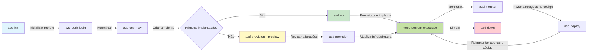
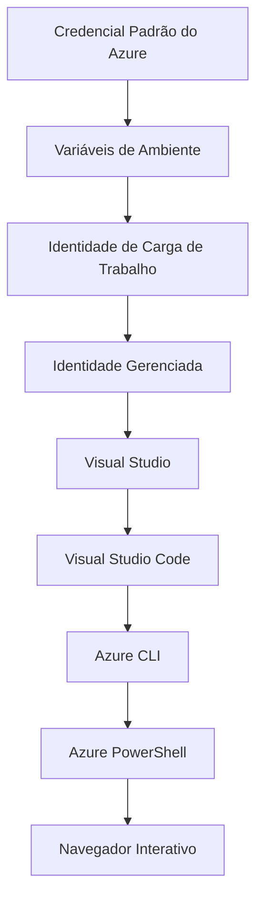

# AZD Basics - Entendendo o Azure Developer CLI

# AZD Basics - Conceitos Centrais e Fundamentos

**Chapter Navigation:**
- **📚 Course Home**: [AZD Para Iniciantes](../../README.md)
- **📖 Current Chapter**: Capítulo 1 - Fundação & Início Rápido
- **⬅️ Previous**: [Course Overview](../../README.md#-chapter-1-foundation--quick-start)
- **➡️ Next**: [Installation & Setup](installation.md)
- **🚀 Next Chapter**: [Capítulo 2: Desenvolvimento Orientado por IA](../chapter-02-ai-development/microsoft-foundry-integration.md)

## Introdução

Esta lição apresenta o Azure Developer CLI (azd), uma poderosa ferramenta de linha de comando que acelera sua jornada do desenvolvimento local até a implantação no Azure. Você aprenderá os conceitos fundamentais, os recursos principais e entenderá como o azd simplifica a implantação de aplicações nativas na nuvem.

## Objetivos de Aprendizagem

Ao final desta lição, você irá:
- Entender o que é o Azure Developer CLI e seu propósito principal
- Aprender os conceitos centrais de templates, ambientes e serviços
- Explorar recursos chave incluindo desenvolvimento orientado por templates e Infraestrutura como Código
- Entender a estrutura do projeto azd e o fluxo de trabalho
- Estar preparado para instalar e configurar o azd para seu ambiente de desenvolvimento

## Resultados de Aprendizagem

Após completar esta lição, você será capaz de:
- Explicar o papel do azd em fluxos de trabalho modernos de desenvolvimento em nuvem
- Identificar os componentes da estrutura de um projeto azd
- Descrever como templates, ambientes e serviços funcionam juntos
- Entender os benefícios da Infraestrutura como Código com azd
- Reconhecer diferentes comandos azd e seus propósitos

## O que é o Azure Developer CLI (azd)?

Azure Developer CLI (azd) é uma ferramenta de linha de comando projetada para acelerar sua jornada do desenvolvimento local até a implantação no Azure. Ela simplifica o processo de construir, implantar e gerenciar aplicações nativas na nuvem no Azure.

### O que você pode implantar com azd?

azd suporta uma ampla gama de cargas de trabalho — e a lista continua crescendo. Hoje, você pode usar o azd para implantar:

| Workload Type | Examples | Same Workflow? |
|---------------|----------|----------------|
| **Aplicações tradicionais** | Aplicativos web, APIs REST, sites estáticos | ✅ `azd up` |
| **Serviços e microsserviços** | Container Apps, Function Apps, backends multi-serviço | ✅ `azd up` |
| **Aplicações com IA** | Aplicativos de chat com Microsoft Foundry Models, soluções RAG com AI Search | ✅ `azd up` |
| **Agentes inteligentes** | Agentes hospedados no Foundry, orquestrações multi-agente | ✅ `azd up` |

A ideia principal é que **o ciclo de vida do azd permanece o mesmo independentemente do que você esteja implantando**. Você inicializa um projeto, provisiona infraestrutura, implanta seu código, monitora sua aplicação e limpa — seja um site simples ou um agente de IA sofisticado.

Essa continuidade é por design. o azd trata capacidades de IA como outro tipo de serviço que sua aplicação pode usar, não como algo fundamentalmente diferente. Um endpoint de chat suportado por Microsoft Foundry Models é, do ponto de vista do azd, apenas mais um serviço para configurar e implantar.

### 🎯 Por que usar o AZD? Uma comparação do mundo real

Vamos comparar implantar um aplicativo web simples com banco de dados:

#### ❌ SEM AZD: Implantação Manual no Azure (30+ minutos)

```bash
# Etapa 1: Criar grupo de recursos
az group create --name myapp-rg --location eastus

# Etapa 2: Criar plano do App Service
az appservice plan create --name myapp-plan \
  --resource-group myapp-rg \
  --sku B1 --is-linux

# Etapa 3: Criar Web App
az webapp create --name myapp-web-unique123 \
  --resource-group myapp-rg \
  --plan myapp-plan \
  --runtime "NODE:18-lts"

# Etapa 4: Criar conta do Cosmos DB (10-15 minutos)
az cosmosdb create --name myapp-cosmos-unique123 \
  --resource-group myapp-rg \
  --kind MongoDB

# Etapa 5: Criar banco de dados
az cosmosdb mongodb database create \
  --account-name myapp-cosmos-unique123 \
  --resource-group myapp-rg \
  --name tododb

# Etapa 6: Criar coleção
az cosmosdb mongodb collection create \
  --account-name myapp-cosmos-unique123 \
  --resource-group myapp-rg \
  --database-name tododb \
  --name todos

# Etapa 7: Obter string de conexão
CONN_STR=$(az cosmosdb keys list \
  --name myapp-cosmos-unique123 \
  --resource-group myapp-rg \
  --type connection-strings \
  --query "connectionStrings[0].connectionString" -o tsv)

# Etapa 8: Configurar as configurações do aplicativo
az webapp config appsettings set \
  --name myapp-web-unique123 \
  --resource-group myapp-rg \
  --settings MONGODB_URI="$CONN_STR"

# Etapa 9: Habilitar logs
az webapp log config --name myapp-web-unique123 \
  --resource-group myapp-rg \
  --application-logging filesystem \
  --detailed-error-messages true

# Etapa 10: Configurar o Application Insights
az monitor app-insights component create \
  --app myapp-insights \
  --location eastus \
  --resource-group myapp-rg

# Etapa 11: Vincular o App Insights ao Web App
INSTRUMENTATION_KEY=$(az monitor app-insights component show \
  --app myapp-insights \
  --resource-group myapp-rg \
  --query "instrumentationKey" -o tsv)

az webapp config appsettings set \
  --name myapp-web-unique123 \
  --resource-group myapp-rg \
  --settings APPINSIGHTS_INSTRUMENTATIONKEY="$INSTRUMENTATION_KEY"

# Etapa 12: Compilar o aplicativo localmente
npm install
npm run build

# Etapa 13: Criar pacote de implantação
zip -r app.zip . -x "*.git*" "node_modules/*"

# Etapa 14: Implantar a aplicação
az webapp deployment source config-zip \
  --resource-group myapp-rg \
  --name myapp-web-unique123 \
  --src app.zip

# Etapa 15: Espere e reze para que funcione 🙏
# (Sem validação automatizada, testes manuais necessários)
```

**Problemas:**
- ❌ 15+ comandos para lembrar e executar em ordem
- ❌ 30-45 minutos de trabalho manual
- ❌ Fácil cometer erros (typos, parâmetros errados)
- ❌ Strings de conexão expostas no histórico do terminal
- ❌ Sem rollback automático se algo falhar
- ❌ Difícil de reproduzir para membros da equipe
- ❌ Diferente a cada vez (não reprodutível)

#### ✅ COM AZD: Implantação Automatizada (5 comandos, 10-15 minutos)

```bash
# Etapa 1: Inicializar a partir do modelo
azd init --template todo-nodejs-mongo

# Etapa 2: Autenticar
azd auth login

# Etapa 3: Criar ambiente
azd env new dev

# Etapa 4: Visualizar alterações (opcional, mas recomendado)
azd provision --preview

# Etapa 5: Implantar tudo
azd up

# ✨ Concluído! Tudo está implantado, configurado e monitorado
```

**Benefícios:**
- ✅ **5 comandos** vs. 15+ passos manuais
- ✅ **10-15 minutos** tempo total (principalmente aguardando o Azure)
- ✅ **Menos erros manuais** - fluxo consistente orientado por templates
- ✅ **Tratamento seguro de segredos** - muitos templates usam armazenamento de segredos gerenciado pelo Azure
- ✅ **Implantações repetíveis** - mesmo fluxo toda vez
- ✅ **Totalmente reprodutível** - mesmo resultado sempre
- ✅ **Pronto para equipe** - qualquer pessoa pode implantar com os mesmos comandos
- ✅ **Infraestrutura como Código** - templates Bicep versionados
- ✅ **Monitoramento integrado** - Application Insights configurado automaticamente

### 📊 Redução de Tempo e Erros

| Metric | Manual Deployment | AZD Deployment | Improvement |
|:-------|:------------------|:---------------|:------------|
| **Comandos** | 15+ | 5 | 67% menos |
| **Tempo** | 30-45 min | 10-15 min | 60% mais rápido |
| **Taxa de Erro** | ~40% | <5% | 88% de redução |
| **Consistência** | Baixa (manual) | 100% (automatizado) | Perfeita |
| **Onboarding de Equipe** | 2-4 horas | 30 minutos | 75% mais rápido |
| **Tempo de Rollback** | 30+ min (manual) | 2 min (automatizado) | 93% mais rápido |

## Conceitos Centrais

### Templates
Templates são a base do azd. Eles contêm:
- **Código da aplicação** - Seu código-fonte e dependências
- **Definições de infraestrutura** - Recursos do Azure definidos em Bicep ou Terraform
- **Arquivos de configuração** - Configurações e variáveis de ambiente
- **Scripts de implantação** - Fluxos de trabalho de implantação automatizados

### Ambientes
Ambientes representam diferentes alvos de implantação:
- **Development** - Para testes e desenvolvimento
- **Staging** - Ambiente de pré-produção
- **Production** - Ambiente de produção ao vivo

Cada ambiente mantém seu próprio:
- grupo de recursos do Azure
- configurações de configuração
- estado de implantação

### Serviços
Serviços são os blocos de construção da sua aplicação:
- **Frontend** - Aplicações web, SPAs
- **Backend** - APIs, microsserviços
- **Database** - Soluções de armazenamento de dados
- **Storage** - Armazenamento de arquivos e blobs

## Recursos Principais

### 1. Desenvolvimento Orientado por Templates
```bash
# Procurar modelos disponíveis
azd template list

# Inicializar a partir de um modelo
azd init --template <template-name>
```

### 2. Infraestrutura como Código
- **Bicep** - Linguagem específica de domínio do Azure
- **Terraform** - Ferramenta de infraestrutura multi-cloud
- **ARM Templates** - Modelos do Azure Resource Manager

### 3. Fluxos de Trabalho Integrados
```bash
# Fluxo completo de implantação
azd up            # Provisionamento + Implantação — isso é automático para a configuração inicial

# 🧪 NOVO: Visualizar alterações na infraestrutura antes da implantação (SEGURO)
azd provision --preview    # Simular implantação da infraestrutura sem fazer alterações

azd provision     # Criar recursos do Azure — se você atualizar a infraestrutura, use isto
azd deploy        # Implantar o código da aplicação ou reimplantar o código da aplicação após a atualização
azd down          # Limpar recursos
```

#### 🛡️ Planejamento Seguro de Infraestrutura com Preview
O comando `azd provision --preview` é um divisor de águas para implantações seguras:
- **Análise de simulação** - Mostra o que será criado, modificado ou excluído
- **Risco zero** - Nenhuma alteração real é feita no seu ambiente Azure
- **Colaboração de equipe** - Compartilhe resultados do preview antes da implantação
- **Estimativa de custos** - Entenda os custos dos recursos antes do compromisso

```bash
# Exemplo de fluxo de trabalho de pré-visualização
azd provision --preview           # Veja o que vai mudar
# Revise a saída, discuta com a equipe
azd provision                     # Aplique as alterações com confiança
```

### 📊 Visual: Fluxo de Desenvolvimento AZD



**Explicação do Fluxo de Trabalho:**
1. **Init** - Comece com um template ou projeto novo
2. **Auth** - Autentique-se com o Azure
3. **Environment** - Crie um ambiente de implantação isolado
4. **Preview** - 🆕 Sempre visualize as mudanças de infraestrutura primeiro (prática segura)
5. **Provision** - Crie/atualize recursos do Azure
6. **Deploy** - Envie o código da sua aplicação
7. **Monitor** - Observe o desempenho da aplicação
8. **Iterate** - Faça alterações e reimplante o código
9. **Cleanup** - Remova recursos quando terminar

### 4. Gerenciamento de Ambientes
```bash
# Criar e gerenciar ambientes
azd env new <environment-name>
azd env select <environment-name>
azd env list
```

### 5. Extensões e Comandos de IA

azd usa um sistema de extensões para adicionar capacidades além do CLI principal. Isso é especialmente útil para cargas de trabalho de IA:

```bash
# Listar extensões disponíveis
azd extension list

# Instalar a extensão Foundry agents
azd extension install azure.ai.agents

# Inicializar um projeto de agente de IA a partir de um manifesto
azd ai agent init -m agent-manifest.yaml

# Testar um agente implantado (mostra latência e tempo até o primeiro byte)
azd ai agent invoke

# Iniciar o servidor MCP para desenvolvimento assistido por IA (Alpha)
azd mcp start
```

**O ciclo de vida do agente, de ponta a ponta.** Depois que você instalar `azure.ai.agents`, um único fluxo de trabalho te leva da ideia a um agente em execução e monitorado. Você não precisa de tudo isso no primeiro dia — apenas saiba que existe:

| Stage | Command | What it does |
|-------|---------|--------------|
| **Scaffold** | `azd ai agent init -m <manifest>` | Gera um projeto de agente a partir de um manifesto |
| **Test** | `azd ai agent invoke` | Chama o agente e visualiza o tempo de resposta |
| **Measure** | `azd ai agent eval generate` | Cria um conjunto de dados de avaliação para o agente |
| **Improve** | `azd ai agent optimize` | Otimiza instruções do agente com base nos seus dados |
| **Inspect** | `azd ai agent endpoint show` | Exibe a configuração do endpoint ao vivo |
| **Clean up** | `azd ai agent delete` | Exclui um agente hospedado e todas as suas versões |

> Extensões são tratadas em detalhe em [Capítulo 2: Desenvolvimento Orientado por IA](../chapter-02-ai-development/agents.md) e na referência [Comandos AZD AI CLI](../chapter-08-production/production-ai-practices.md#azd-ai-cli-commands-and-extensions).

## 📁 Estrutura do Projeto

Uma estrutura típica de projeto azd:
```
my-app/
├── .azd/                    # azd configuration
│   └── config.json
├── .azure/                  # Azure deployment artifacts
├── .devcontainer/          # Development container config
├── .github/workflows/      # GitHub Actions
├── .vscode/               # VS Code settings
├── infra/                 # Infrastructure code
│   ├── main.bicep        # Main infrastructure template
│   ├── main.parameters.json
│   └── modules/          # Reusable modules
├── src/                  # Application source code
│   ├── api/             # Backend services
│   └── web/             # Frontend application
├── azure.yaml           # azd project configuration
└── README.md
```

## 🔧 Arquivos de Configuração

### azure.yaml
O arquivo principal de configuração do projeto:
```yaml
name: my-awesome-app
metadata:
  template: my-template@1.0.0

services:
  web:
    project: ./src/web
    language: js
    host: appservice
  api:
    project: ./src/api
    language: js
    host: appservice

hooks:
  preprovision:
    shell: pwsh
    run: echo "Preparing to provision..."
```

### .azure/config.json
Configuração específica do ambiente:
```json
{
  "version": 1,
  "defaultEnvironment": "dev",
  "environments": {
    "dev": {
      "subscriptionId": "your-subscription-id",
      "location": "eastus"
    }
  }
}
```

## 🎪 Fluxos de Trabalho Comuns com Exercícios Práticos

> **💡 Dica de Aprendizado:** Siga estes exercícios em ordem para construir suas habilidades com AZD progressivamente.

### 🎯 Exercício 1: Inicialize Seu Primeiro Projeto

**Objetivo:** Criar um projeto AZD e explorar sua estrutura

**Passos:**
```bash
# Use um modelo comprovado
azd init --template todo-nodejs-mongo

# Explore os arquivos gerados
ls -la  # Veja todos os arquivos, incluindo os ocultos

# Arquivos principais criados:
# - azure.yaml (configuração principal)
# - infra/ (código de infraestrutura)
# - src/ (código da aplicação)
```

**✅ Sucesso:** Você tem o arquivo azure.yaml e os diretórios infra/ e src/

---

### 🎯 Exercício 2: Implantar no Azure

**Objetivo:** Completar implantação ponta a ponta

**Passos:**
```bash
# 1. Autenticar
az login && azd auth login

# 2. Criar ambiente
azd env new dev
azd env set AZURE_LOCATION eastus

# 3. Visualizar alterações (RECOMENDADO)
azd provision --preview

# 4. Implantar tudo
azd up

# 5. Verificar implantação
azd show    # Veja a URL do seu aplicativo
```

**Tempo estimado:** 10-15 minutos  
**✅ Sucesso:** A URL da aplicação abre no navegador

---

### 🎯 Exercício 3: Múltiplos Ambientes

**Objetivo:** Implantar em dev e staging

**Passos:**
```bash
# Já temos dev, crie staging
azd env new staging
azd env set AZURE_LOCATION westus2
azd up

# Altere entre eles
azd env list
azd env select dev
```

**✅ Sucesso:** Dois grupos de recursos separados no Portal do Azure

---

### 🛡️ Reinício Completo: `azd down --force --purge`

Quando você precisa redefinir completamente:

```bash
azd down --force --purge
```

**O que faz:**
- `--force`: Sem prompts de confirmação
- `--purge`: Exclui todo o estado local e recursos do Azure

**Use quando:**
- A implantação falhou no meio do processo
- Mudando de projeto
- Precisa de um novo começo

---

## 🎪 Referência do Fluxo de Trabalho Original

### Iniciando um Novo Projeto
```bash
# Método 1: Usar modelo existente
azd init --template todo-nodejs-mongo

# Método 2: Começar do zero
azd init

# Método 3: Usar diretório atual
azd init .
```

### Ciclo de Desenvolvimento
```bash
# Configurar o ambiente de desenvolvimento
azd auth login
azd env new dev
azd env select dev

# Implantar tudo
azd up

# Fazer alterações e reimplantar
azd deploy

# Limpar quando terminar
azd down --force --purge # O comando no Azure Developer CLI é uma redefinição completa para o seu ambiente—especialmente útil quando você está solucionando implantações com falha, limpando recursos órfãos ou se preparando para uma nova reimplantação.
```

## Entendendo `azd down --force --purge`
O comando `azd down --force --purge` é uma forma poderosa de desmontar completamente seu ambiente azd e todos os recursos associados. Aqui está uma divisão do que cada flag faz:
```
--force
```

- Ignora prompts de confirmação.
- Útil para automação ou scripts onde a entrada manual não é viável.
- Garante que a remoção prossiga sem interrupção, mesmo que o CLI detecte inconsistências.

```
--purge
```

Exclui **todos os metadados associados**, incluindo:
Estado do ambiente
Pasta local `.azure`
Informações de implantação em cache
Evita que o azd "lembre" implantações anteriores, o que pode causar problemas como grupos de recursos incompatíveis ou referências de registro obsoletas.

### Por que usar ambos?
Quando você bate o bloqueio com `azd up` devido a estado persistente ou implantações parciais, essa combinação garante um **recomeço limpo**.

É especialmente útil após exclusões manuais de recursos no portal do Azure ou ao mudar templates, ambientes ou convenções de nomenclatura de grupos de recursos.

### Gerenciando Múltiplos Ambientes
```bash
# Criar ambiente de homologação
azd env new staging
azd env select staging
azd up

# Voltar para dev
azd env select dev

# Comparar ambientes
azd env list
```

## 🔐 Autenticação e Credenciais

Entender a autenticação é crucial para implantações bem-sucedidas com azd. O Azure usa múltiplos métodos de autenticação, e o azd aproveita a mesma cadeia de credenciais usada por outras ferramentas do Azure.

### Autenticação via Azure CLI (`az login`)

Antes de usar o azd, você precisa se autenticar no Azure. O método mais comum é usar o Azure CLI:

```bash
# Login interativo (abre o navegador)
az login

# Login com locatário específico
az login --tenant <tenant-id>

# Login com principal de serviço
az login --service-principal -u <app-id> -p <password> --tenant <tenant-id>

# Verificar o status de login atual
az account show

# Listar assinaturas disponíveis
az account list --output table

# Definir assinatura padrão
az account set --subscription <subscription-id>
```

### Fluxo de Autenticação
1. **Login Interativo**: Abre seu navegador padrão para autenticação
2. **Fluxo de Código do Dispositivo**: Para ambientes sem acesso a navegador
3. **Service Principal**: Para automação e cenários de CI/CD
4. **Identidade Gerenciada**: Para aplicações hospedadas no Azure

### Cadeia DefaultAzureCredential

`DefaultAzureCredential` é um tipo de credencial que fornece uma experiência de autenticação simplificada ao tentar automaticamente múltiplas fontes de credenciais em uma ordem específica:

#### Ordem da Cadeia de Credenciais


#### 1. Variáveis de Ambiente
```bash
# Defina variáveis de ambiente para o principal de serviço
export AZURE_CLIENT_ID="<app-id>"
export AZURE_CLIENT_SECRET="<password>"
export AZURE_TENANT_ID="<tenant-id>"
```

#### 2. Workload Identity (Kubernetes/GitHub Actions)
Usado automaticamente em:
- Azure Kubernetes Service (AKS) com Workload Identity
- GitHub Actions com federação OIDC
- Outros cenários de identidade federada

#### 3. Identidade Gerenciada
Para recursos do Azure como:
- Virtual Machines
- App Service
- Azure Functions
- Container Instances

```bash
# Verifica se está sendo executado em um recurso do Azure com identidade gerenciada
az account show --query "user.type" --output tsv
# Retorna: "servicePrincipal" se estiver usando identidade gerenciada
```

#### 4. Integração com Ferramentas de Desenvolvimento
- **Visual Studio**: Usa automaticamente a conta logada
- **VS Code**: Usa credenciais da extensão Azure Account
- **Azure CLI**: Usa credenciais do `az login` (mais comum para desenvolvimento local)

### Configuração de Autenticação do AZD

```bash
# Método 1: Use o Azure CLI (Recomendado para desenvolvimento)
az login
azd auth login  # Usa as credenciais existentes do Azure CLI

# Método 2: Autenticação direta com azd
azd auth login --use-device-code  # Para ambientes sem interface gráfica

# Método 3: Verificar o status de autenticação
azd auth login --check-status

# Método 4: Fazer logout e reautenticar
azd auth logout
azd auth login
```

### Melhores Práticas de Autenticação

#### Para Desenvolvimento Local
```bash
# 1. Faça login com o Azure CLI
az login

# 2. Verifique a assinatura correta
az account show
az account set --subscription "Your Subscription Name"

# 3. Use o azd com as credenciais existentes
azd auth login
```

#### Para pipelines de CI/CD
```yaml
# GitHub Actions example
- name: Azure Login
  uses: azure/login@v1
  with:
    creds: ${{ secrets.AZURE_CREDENTIALS }}

- name: Deploy with azd
  run: |
    azd auth login --client-id ${{ secrets.AZURE_CLIENT_ID }} \
                    --client-secret ${{ secrets.AZURE_CLIENT_SECRET }} \
                    --tenant-id ${{ secrets.AZURE_TENANT_ID }}
    azd up --no-prompt
```

#### Para Ambientes de Produção
- Use **Managed Identity** ao executar em recursos do Azure
- Use **Service Principal** para cenários de automação
- Evite armazenar credenciais no código ou em arquivos de configuração
- Use **Azure Key Vault** para configurações sensíveis

### Problemas Comuns de Autenticação e Soluções

#### Problema: "No subscription found"
```bash
# Solução: Definir assinatura padrão
az account list --output table
az account set --subscription "<subscription-id>"
azd env set AZURE_SUBSCRIPTION_ID "<subscription-id>"
```

#### Problema: "Insufficient permissions"
```bash
# Solução: Verifique e atribua as funções necessárias
az role assignment list --assignee $(az account show --query user.name --output tsv)

# Funções necessárias comuns:
# - Contributor (para gerenciamento de recursos)
# - User Access Administrator (para atribuição de funções)
```

#### Problema: "Token expired"
```bash
# Solução: Reautenticar
az logout
az login
azd auth logout
azd auth login
```

### Autenticação em Diferentes Cenários

#### Desenvolvimento Local
```bash
# Conta de desenvolvimento pessoal
az login
azd auth login
```

#### Desenvolvimento em Equipe
```bash
# Use um locatário específico para a organização
az login --tenant contoso.onmicrosoft.com
azd auth login
```

#### Cenários multi-inquilino
```bash
# Alternar entre locatários
az login --tenant tenant1.onmicrosoft.com
# Implantar no locatário 1
azd up

az login --tenant tenant2.onmicrosoft.com  
# Implantar no locatário 2
azd up
```

### Considerações de Segurança

1. **Armazenamento de Credenciais**: Nunca armazene credenciais no código-fonte
2. **Limitação de Escopo**: Use o princípio do menor privilégio para service principals
3. **Rotação de Token**: Gire regularmente os segredos de service principals
4. **Trilha de Auditoria**: Monitore atividades de autenticação e implantação
5. **Segurança de Rede**: Use endpoints privados quando possível

### Solução de Problemas de Autenticação

```bash
# Depurar problemas de autenticação
azd auth login --check-status
az account show
az account get-access-token

# Comandos de diagnóstico comuns
whoami                          # Contexto do usuário atual
az ad signed-in-user show      # Detalhes do usuário do Microsoft Entra ID
az group list                  # Testar acesso ao recurso
```

## Entendendo `azd down --force --purge`

### Descoberta
```bash
azd template list              # Navegar por modelos
azd template show <template>   # Detalhes do modelo
azd init --help               # Opções de inicialização
```

### Gerenciamento de Projeto
```bash
azd show                     # Visão geral do projeto
azd env list                # Ambientes disponíveis e o padrão selecionado
azd config show            # Configurações
```

### Monitoramento
```bash
azd monitor                  # Abrir monitoramento no portal do Azure
azd monitor --logs           # Visualizar logs do aplicativo
azd monitor --live           # Visualizar métricas em tempo real
azd pipeline config          # Configurar CI/CD
```

## Melhores Práticas

### 1. Use Nomes Significativos
```bash
# Bom
azd env new production-east
azd init --template web-app-secure

# Evitar
azd env new env1
azd init --template template1
```

### 2. Aproveite Modelos
- Comece com modelos existentes
- Personalize para suas necessidades
- Crie modelos reutilizáveis para sua organização

### 3. Isolamento de Ambiente
- Use ambientes separados para dev/staging/prod
- Nunca implante diretamente em produção a partir da máquina local
- Use pipelines CI/CD para implantações de produção

### 4. Gerenciamento de Configuração
- Use variáveis de ambiente para dados sensíveis
- Mantenha a configuração no controle de versão
- Documente configurações específicas do ambiente

## Progressão de Aprendizado

### Iniciante (Semana 1-2)
1. Instale o azd e autentique-se
2. Implante um template simples
3. Entenda a estrutura do projeto
4. Aprenda comandos básicos (up, down, deploy)

### Intermediário (Semana 3-4)
1. Personalize templates
2. Gerencie múltiplos ambientes
3. Entenda o código de infraestrutura
4. Configure pipelines CI/CD

### Avançado (Semana 5+)
1. Crie templates personalizados
2. Padrões avançados de infraestrutura
3. Implantações multi-região
4. Configurações em nível empresarial

## Próximos Passos

**📖 Continue o aprendizado do Capítulo 1:**
- [Instalação & Configuração](installation.md) - Instale e configure o azd
- [Seu Primeiro Projeto](first-project.md) - Complete o tutorial prático
- [Guia de Configuração](configuration.md) - Opções avançadas de configuração

**🎯 Pronto para o próximo capítulo?**
- [Capítulo 2: Desenvolvimento com foco em IA](../chapter-02-ai-development/microsoft-foundry-integration.md) - Comece a construir aplicações de IA

## Recursos Adicionais

- [Visão Geral do Azure Developer CLI](https://learn.microsoft.com/en-us/azure/developer/azure-developer-cli/)
- [Galeria de Templates](https://azure.github.io/awesome-azd/)
- [Exemplos da Comunidade](https://github.com/Azure-Samples)

---

## 🙋 Perguntas Frequentes

### Perguntas Gerais

**P: Qual a diferença entre AZD e Azure CLI?**

R: Azure CLI (`az`) é para gerenciar recursos individuais do Azure. AZD (`azd`) é para gerenciar aplicações inteiras:

```bash
# Azure CLI - Gerenciamento de recursos de baixo nível
az webapp create --name myapp --resource-group rg
az sql server create --name myserver --resource-group rg
# ...são necessários muitos mais comandos

# AZD - Gerenciamento em nível de aplicação
azd up  # Implanta o aplicativo inteiro com todos os recursos
```

**Pense desta forma:**
- `az` = Operando em peças de Lego individuais
- `azd` = Trabalhando com conjuntos completos de Lego

---

**P: Preciso conhecer Bicep ou Terraform para usar AZD?**

R: Não! Comece com templates:
```bash
# Use o modelo existente - não é necessário conhecimento de IaC
azd init --template todo-nodejs-mongo
azd up
```

Você pode aprender Bicep depois para personalizar a infraestrutura. Os templates fornecem exemplos funcionais para aprender.

---

**P: Quanto custa executar templates do AZD?**

R: Os custos variam por template. A maioria dos templates de desenvolvimento custa $50-150/mês:

```bash
# Visualizar custos antes de implantar
azd provision --preview

# Sempre limpe quando não estiver usando
azd down --force --purge  # Remove todos os recursos
```

**Dica profissional:** Use camadas gratuitas quando disponíveis:
- App Service: camada F1 (Free)
- Microsoft Foundry Models: Azure OpenAI 50.000 tokens/mês gratuitos
- Cosmos DB: camada gratuita de 1000 RU/s

---

**P: Posso usar AZD com recursos Azure já existentes?**

R: Sim, mas é mais fácil começar do zero. O AZD funciona melhor quando gerencia todo o ciclo de vida. Para recursos existentes:
```bash
# Opção 1: Importar recursos existentes (avançado)
azd init
# Em seguida, modifique infra/ para referenciar recursos existentes

# Opção 2: Começar do zero (recomendado)
azd init --template matching-your-stack
azd up  # Cria um novo ambiente
```

---

**P: Como compartilho meu projeto com colegas?**

R: Faça commit do projeto AZD no Git (mas NÃO a pasta .azure):
```bash
# Já está no .gitignore por padrão
.azure/        # Contém segredos e dados de ambiente
*.env          # Variáveis de ambiente

# Membros da equipe então:
git clone <your-repo>
azd auth login
azd env new <their-name>-dev
azd up
```

Todos recebem infraestrutura idêntica a partir dos mesmos templates.

---

### Perguntas de Solução de Problemas

**P: "azd up" falhou pela metade. O que faço?**

R: Verifique o erro, corrija e tente novamente:
```bash
# Ver logs detalhados
azd show

# Correções comuns:

# 1. Se a cota for excedida:
azd env set AZURE_LOCATION "westus2"  # Tente uma região diferente

# 2. Se houver conflito de nome do recurso:
azd down --force --purge  # Começar do zero
azd up  # Tentar novamente

# 3. Se a autenticação expirou:
az login
azd auth login
azd up
```

**Problema mais comum:** Assinatura do Azure selecionada incorreta
```bash
az account list --output table
az account set --subscription "<correct-subscription>"
```

---

**P: Como eu implanto apenas mudanças de código sem reprovisionar?**

R: Use `azd deploy` em vez de `azd up`:
```bash
azd up          # Primeira vez: provisionar + implantar (lento)

# Faça alterações no código...

azd deploy      # Nas próximas vezes: apenas implantar (rápido)
```

Comparação de velocidade:
- `azd up`: 10–15 minutos (provisiona infraestrutura)
- `azd deploy`: 2–5 minutos (apenas código)

---

**P: Posso personalizar os templates de infraestrutura?**

R: Sim! Edite os arquivos Bicep em `infra/`:
```bash
# Após azd init
cd infra/
code main.bicep  # Editar no VS Code

# Visualizar alterações
azd provision --preview

# Aplicar alterações
azd provision
```

**Dica:** Comece pequeno – altere os SKUs primeiro:
```bicep
// infra/main.bicep
sku: {
  name: 'B1'  // Change to 'P1V2' for production
}
```

---

**P: Como excluo tudo que o AZD criou?**

R: Um comando remove todos os recursos:
```bash
azd down --force --purge

# Isso exclui:
# - Todos os recursos do Azure
# - Grupo de recursos
# - Estado do ambiente local
# - Dados de implantação em cache
```

**Execute sempre isto quando:**
- Finalizou os testes de um template
- Mudando para um projeto diferente
- Quer começar do zero

**Economia de custos:** Excluir recursos não utilizados = $0 em cobranças

---

**P: E se eu acidentalmente excluir recursos no Azure Portal?**

R: O estado do AZD pode ficar fora de sincronia. Abordagem de reinício limpo:
```bash
# 1. Remover o estado local
azd down --force --purge

# 2. Começar do zero
azd up

# Alternativa: Deixe o AZD detectar e corrigir
azd provision  # Criará recursos ausentes
```

---

### Perguntas Avançadas

**P: Posso usar AZD em pipelines CI/CD?**

R: Sim! Exemplo com GitHub Actions:
```yaml
# .github/workflows/deploy.yml
name: Deploy with AZD

on:
  push:
    branches: [main]

jobs:
  deploy:
    runs-on: ubuntu-latest
    steps:
      - uses: actions/checkout@v2
      
      - name: Install azd
        run: curl -fsSL https://aka.ms/install-azd.sh | bash
      
      - name: Azure Login
        run: |
          azd auth login \
            --client-id ${{ secrets.AZURE_CLIENT_ID }} \
            --client-secret ${{ secrets.AZURE_CLIENT_SECRET }} \
            --tenant-id ${{ secrets.AZURE_TENANT_ID }}
      
      - name: Deploy
        run: azd up --no-prompt
```

---

**P: Como lido com segredos e dados sensíveis?**

R: O AZD integra-se automaticamente com o Azure Key Vault:
```bash
# Segredos são armazenados no Key Vault, não no código
azd env set DATABASE_PASSWORD "$(openssl rand -base64 32)"

# AZD automaticamente:
# 1. Cria o Key Vault
# 2. Armazena o segredo
# 3. Concede acesso ao aplicativo via Identidade Gerenciada
# 4. Injeta em tempo de execução
```

**Nunca faça commit:**
- pasta `.azure/` (contém dados do ambiente)
- arquivos `.env` (segredos locais)
- strings de conexão

---

**P: Posso implantar em múltiplas regiões?**

R: Sim, crie um ambiente por região:
```bash
# Ambiente Leste dos EUA
azd env new prod-eastus
azd env set AZURE_LOCATION eastus
azd up

# Ambiente Europa Ocidental
azd env new prod-westeurope
azd env set AZURE_LOCATION westeurope
azd up

# Cada ambiente é independente
azd env list
```

Para aplicativos verdadeiramente multi-região, personalize os templates Bicep para implantar em múltiplas regiões simultaneamente.

---

**P: Onde posso obter ajuda se eu ficar preso?**

1. **Documentação do AZD:** https://learn.microsoft.com/azure/developer/azure-developer-cli/
2. **Issues no GitHub:** https://github.com/Azure/azure-dev/issues
3. **Discord:** [Azure Discord](https://discord.gg/microsoft-azure) - canal #azure-developer-cli
4. **Stack Overflow:** Tag `azure-developer-cli`
5. **Este Curso:** [Guia de Solução de Problemas](../chapter-07-troubleshooting/common-issues.md)

**Dica profissional:** Antes de perguntar, execute:
```bash
azd show       # Mostra o estado atual
azd version    # Mostra sua versão
```
Inclua estas informações em sua pergunta para obter ajuda mais rápida.

---

## 🎓 E agora?

Agora você entende os fundamentos do AZD. Escolha seu caminho:

### 🎯 Para Iniciantes:
1. **Próximo:** [Instalação & Configuração](installation.md) - Instale o AZD na sua máquina
2. **Depois:** [Seu Primeiro Projeto](first-project.md) - Implante seu primeiro app
3. **Pratique:** Complete os 3 exercícios desta lição

### 🚀 Para Desenvolvedores de IA:
1. **Vá para:** [Capítulo 2: Desenvolvimento com foco em IA](../chapter-02-ai-development/microsoft-foundry-integration.md)
2. **Implante:** Comece com `azd init --template get-started-with-ai-chat`
3. **Aprenda:** Construa enquanto implanta

### 🏗️ Para Desenvolvedores Experientes:
1. **Revise:** [Guia de Configuração](configuration.md) - Configurações avançadas
2. **Explore:** [Infrastructure as Code](../chapter-04-infrastructure/provisioning.md) - Mergulho profundo em Bicep
3. **Construa:** Crie templates personalizados para sua stack

---

**Navegação do Capítulo:**
- **📚 Início do Curso**: [AZD Para Iniciantes](../../README.md)
- **📖 Capítulo Atual**: Capítulo 1 - Fundamentos & Início Rápido  
- **⬅️ Anterior**: [Visão Geral do Curso](../../README.md#-chapter-1-foundation--quick-start)
- **➡️ Próximo**: [Instalação & Configuração](installation.md)
- **🚀 Próximo Capítulo**: [Capítulo 2: Desenvolvimento com foco em IA](../chapter-02-ai-development/microsoft-foundry-integration.md)

---

<!-- CO-OP TRANSLATOR DISCLAIMER START -->
**Aviso Legal**:
Este documento foi traduzido usando o serviço de tradução por IA [Co-op Translator](https://github.com/Azure/co-op-translator). Embora nos esforcemos pela precisão, por favor, esteja ciente de que traduções automatizadas podem conter erros ou imprecisões. O documento original em seu idioma nativo deve ser considerado a fonte autorizada. Para informações críticas, recomenda-se tradução profissional humana. Não nos responsabilizamos por quaisquer mal-entendidos ou interpretações incorretas decorrentes do uso desta tradução.
<!-- CO-OP TRANSLATOR DISCLAIMER END -->