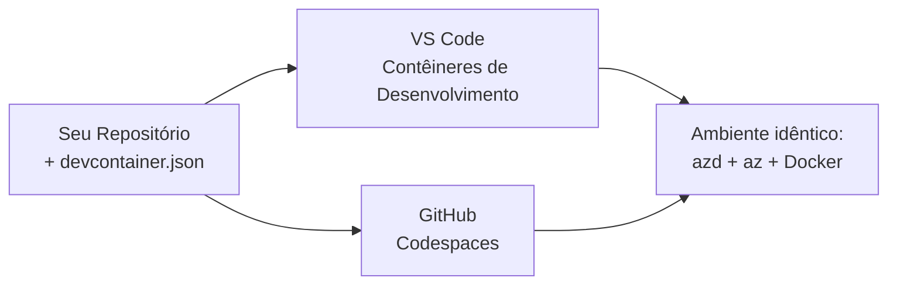

# Dev Containers & GitHub Codespaces for azd

**Chapter Navigation:**
- **📚 Início do Curso**: [AZD Para Iniciantes](../../README.md)
- **📖 Capítulo Atual**: Capítulo 1 - Fundamentos & Início Rápido
- **⬅️ Anterior**: [Traga Seu Próprio App](bring-your-own-app.md)
- **🚀 Próximo Capítulo**: [Capítulo 2: Desenvolvimento com Foco em IA](../chapter-02-ai-development/README.md)

> Validado contra `azd 1.25.6` em junho de 2026.

## Introdução

Instalar o azd, o runtime da linguagem correto, o Docker e o Azure CLI em cada máquina é uma tarefa — e é a razão número um para um tutorial que "funciona na minha máquina" falhar para outra pessoa. Um **dev container** resolve isso descrevendo toda a sua cadeia de ferramentas em um arquivo. Qualquer pessoa que abra o projeto no VS Code ou no GitHub Codespaces recebe exatamente o mesmo ambiente, com o azd já instalado. Esta lição mostra como adicionar um.

## Objetivos de Aprendizagem

Ao final desta lição, você irá:
- Entender o que é um dev container e por que ele ajuda com o azd
- Adicionar um `.devcontainer/devcontainer.json` mínimo a um projeto
- Incluir azd, o Azure CLI e o Docker via Dev Container *features*
- Abrir o projeto no GitHub Codespaces ou no VS Code

## Resultados de Aprendizagem

Após completar esta lição, você será capaz de:
- Criar um `devcontainer.json` para um projeto azd
- Adicionar azd e ferramentas do Azure sem instalações manuais
- Executar `azd up` de dentro de um container ou Codespace

---

## O que é um Dev Container?

Um dev container é um ambiente de desenvolvimento baseado em Docker definido por um arquivo `.devcontainer/devcontainer.json` no seu repositório. Quando você abre o projeto:

- **VS Code** (com a extensão Dev Containers) constrói o container e se conecta a ele.
- **GitHub Codespaces** constrói o mesmo container na nuvem e fornece um editor baseado no navegador.

De qualquer forma, todo contribuidor recebe ferramentas idênticas—sem o problema de "você instalou o azd?".



---

## Passo 1: Criar o arquivo devcontainer

Crie `.devcontainer/devcontainer.json` na raiz do seu projeto:

```json
{
  "name": "azd-project",
  "image": "mcr.microsoft.com/devcontainers/base:bookworm",
  "features": {
    "ghcr.io/devcontainers/features/azure-cli:1": {},
    "ghcr.io/azure/azure-dev/azd:latest": {},
    "ghcr.io/devcontainers/features/docker-in-docker:2": {},
    "ghcr.io/devcontainers/features/node:1": {}
  },
  "customizations": {
    "vscode": {
      "extensions": [
        "ms-azuretools.azure-dev",
        "ms-azuretools.vscode-bicep"
      ]
    }
  },
  "forwardPorts": [3000],
  "postCreateCommand": "azd version"
}
```

What each part does:

| Chave | Propósito |
|-----|---------|
| `image` | O sistema operacional base para o container |
| `features` | Instaladores pré-configurados — aqui: Azure CLI, **azd**, Docker e Node.js |
| `customizations.vscode.extensions` | Instala automaticamente as extensões azd e Bicep do VS Code |
| `forwardPorts` | Expõe a porta do seu app para o navegador |
| `postCreateCommand` | Executa uma vez após o container ser construído (aqui, uma verificação de sanidade) |

> O recurso `ghcr.io/azure/azure-dev/azd:latest` é a maneira oficial de obter o azd em um container. Fixe uma versão específica (por exemplo `azd:1.25.6`) se você precisar de reprodutibilidade.

---

## Passo 2: Combine a Feature à linguagem do seu app

Substitua a feature `node` pelo que seu app usar:

```jsonc
// Python project
"ghcr.io/devcontainers/features/python:1": {},

// .NET project
"ghcr.io/devcontainers/features/dotnet:2": {},

// Java project
"ghcr.io/devcontainers/features/java:1": {},

// Go project
"ghcr.io/devcontainers/features/go:1": {}
```

Mantenha `docker-in-docker` se seu `host` for `containerapp`, `aks`, ou qualquer coisa que construa uma imagem de container—o azd precisa do Docker para construir e enviar imagens.

---

## Passo 3: Abra o projeto

**In VS Code:**
1. Instale a extensão **Dev Containers**.
2. Abra a pasta do projeto.
3. Clique **Reopen in Container** quando solicitado (ou execute *Dev Containers: Reopen in Container*).

**In GitHub Codespaces:**
1. Faça push do repositório para o GitHub.
2. Clique **Code → Codespaces → Create codespace on main**.
3. Aguarde a construção do container—o azd estará pronto no terminal.

---

## Passo 4: Fazer deploy de dentro do container

O container já vem com azd pré-instalado, então o fluxo de trabalho normal funciona sem alterações:

```bash
azd auth login --use-device-code   # o código do dispositivo é útil no Codespaces
azd up
```

> **Por que `--use-device-code`?** Em um container remoto ou Codespace não há um navegador local para redirecionar, então o login por device-code é o caminho confiável. Você irá colar um código em uma aba do navegador para completar o login.

---

## Problemas Comuns

| Problema | Solução |
|---------|-----|
| `azd up` can't build an image | Adicione a feature `docker-in-docker` |
| Browser login hangs in Codespaces | Use `azd auth login --use-device-code` |
| Tools differ between teammates | Fixe versões das features (ex.: `azd:1.25.6`) |
| App not reachable in browser | Adicione a porta a `forwardPorts` |

---

## Resumo

- Um dev container torna sua cadeia de ferramentas do azd reprodutível para todos.
- Adicione azd, o Azure CLI e o Docker através de *features* do Dev Container.
- Combine a feature de linguagem ao seu app e mantenha `docker-in-docker` para hosts de container.
- Use o login por device-code ao executar dentro do Codespaces.

---

## 🔗 Navegação

| Direção | Recurso |
|-----------|----------|
| **Anterior** | [Traga Seu Próprio App](bring-your-own-app.md) |
| **Início do Capítulo** | [Capítulo 1: Fundamentos & Início Rápido](README.md) |
| **Próximo Capítulo** | [Capítulo 2: Desenvolvimento com Foco em IA](../chapter-02-ai-development/README.md) |

## 📖 Recursos Relacionados

- [Instalação e Configuração](installation.md)
- [Resumo de Comandos](../../resources/cheat-sheet.md)
- [Especificação oficial do Dev Containers](https://containers.dev/)
- [Recurso Dev Container do azd](https://github.com/Azure/azure-dev/tree/main/ext/devcontainer)

---

<!-- CO-OP TRANSLATOR DISCLAIMER START -->
**Aviso Legal**:
Este documento foi traduzido usando o serviço de tradução por IA [Co-op Translator](https://github.com/Azure/co-op-translator). Embora nos esforcemos pela precisão, por favor, esteja ciente de que traduções automatizadas podem conter erros ou imprecisões. O documento original em seu idioma nativo deve ser considerado a fonte autorizada. Para informações críticas, recomenda-se tradução profissional humana. Não nos responsabilizamos por quaisquer mal-entendidos ou interpretações incorretas decorrentes do uso desta tradução.
<!-- CO-OP TRANSLATOR DISCLAIMER END -->