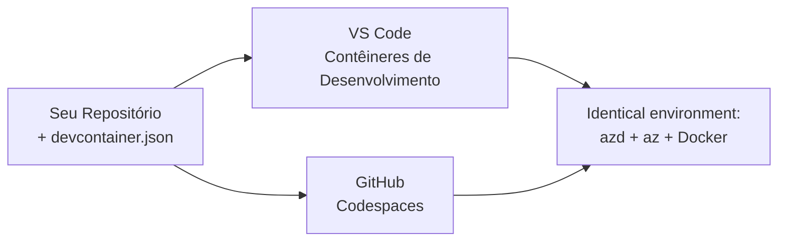

# Dev Containers & GitHub Codespaces para azd

**Navegação do Capítulo:**
- **📚 Página Principal do Curso**: [AZD Para Iniciantes](../../README.md)
- **📖 Capítulo Atual**: Capítulo 1 - Fundamentos & Início Rápido
- **⬅️ Anterior**: [Traga Seu Próprio App](bring-your-own-app.md)
- **🚀 Próximo Capítulo**: [Capítulo 2: Desenvolvimento AI-First](../chapter-02-ai-development/README.md)

> Validado contra `azd 1.27.1` em julho de 2026.

## Introdução

Instalar o azd, o ambiente de execução da linguagem certa, Docker e a CLI do Azure em toda máquina é uma tarefa chata — e é a principal razão pela qual um tutorial que "funciona na minha máquina" falha para outra pessoa. Um **dev container** resolve isso descrevendo toda sua cadeia de ferramentas em um arquivo. Qualquer pessoa que abrir o projeto no VS Code ou GitHub Codespaces recebe exatamente o mesmo ambiente, com azd já instalado. Esta lição mostra como adicionar um.

## Objetivos de Aprendizagem

Ao final desta lição, você irá:
- Entender o que é um dev container e por que ele ajuda com azd
- Adicionar um `.devcontainer/devcontainer.json` minimalista a um projeto
- Incluir azd, a CLI do Azure e Docker via *features* do Dev Container
- Abrir o projeto no GitHub Codespaces ou VS Code

## Resultados Esperados

Após completar esta lição, você será capaz de:
- Criar um `devcontainer.json` para um projeto azd
- Adicionar azd e ferramentas do Azure sem instalações manuais
- Executar `azd up` de dentro do container ou Codespace

---

## O que é um Dev Container?

Um dev container é um ambiente de desenvolvimento baseado em Docker definido por um arquivo `.devcontainer/devcontainer.json` em seu repositório. Quando você abre o projeto:

- **VS Code** (com a extensão Dev Containers) constrói o container e se conecta a ele.
- **GitHub Codespaces** constrói o mesmo container na nuvem e te oferece um editor baseado no navegador.

De qualquer forma, todo colaborador tem ferramentas idênticas — sem precisar perguntar "você instalou o azd?" para resolver problemas.



---

## Passo 1: Crie o arquivo devcontainer

Crie `.devcontainer/devcontainer.json` na raiz do seu projeto:

```json
{
  "name": "azd-project",
  "image": "mcr.microsoft.com/devcontainers/base:bookworm",
  "features": {
    "ghcr.io/devcontainers/features/azure-cli:1": {},
    "ghcr.io/azure/azure-dev/azd:latest": {},
    "ghcr.io/devcontainers/features/docker-in-docker:2": {},
    "ghcr.io/devcontainers/features/node:1": {}
  },
  "customizations": {
    "vscode": {
      "extensions": [
        "ms-azuretools.azure-dev",
        "ms-azuretools.vscode-bicep"
      ]
    }
  },
  "forwardPorts": [3000],
  "postCreateCommand": "azd version"
}
```

O que cada parte faz:

| Chave | Propósito |
|-----|---------|
| `image` | O SO base para o container |
| `features` | Instaladores pré-construídos — aqui: Azure CLI, **azd**, Docker e Node.js |
| `customizations.vscode.extensions` | Instala automaticamente as extensões azd e Bicep para VS Code |
| `forwardPorts` | Expõe a porta do seu app no navegador |
| `postCreateCommand` | Roda uma vez após o container ser construído (aqui, um teste rápido) |

> A *feature* `ghcr.io/azure/azure-dev/azd:latest` é a maneira oficial de obter o azd em um container. Fixe uma versão específica (por exemplo, `azd:1.27.1`) se precisar de reprodutibilidade.

---

## Passo 2: Combine a Feature ao Idioma do Seu App

Troque a *feature* `node` pelo que seu app usar:

```jsonc
// Python project
"ghcr.io/devcontainers/features/python:1": {},

// .NET project
"ghcr.io/devcontainers/features/dotnet:2": {},

// Java project
"ghcr.io/devcontainers/features/java:1": {},

// Go project
"ghcr.io/devcontainers/features/go:1": {}
```

Mantenha `docker-in-docker` se seu `host` for `containerapp`, `aks` ou qualquer coisa que construa uma imagem de container — o azd precisa do Docker para construir e enviar imagens.

---

## Passo 3: Abra-o

**No VS Code:**
1. Instale a extensão **Dev Containers**.
2. Abra a pasta do projeto.
3. Clique em **Reabrir no Container** quando solicitado (ou execute *Dev Containers: Reopen in Container*).

**No GitHub Codespaces:**
1. Faça push do repositório para o GitHub.
2. Clique em **Code → Codespaces → Create codespace on main**.
3. Espere o container construir — azd estará pronto no terminal.

---

## Passo 4: Faça Deploy de Dentro do Container

O container já tem azd pré-instalado, então o fluxo normal funciona:

```bash
azd auth login --use-device-code   # o código do dispositivo é útil dentro dos Codespaces
azd up
```

> **Por que `--use-device-code`?** Num container remoto ou Codespace não há navegador local para redirecionar, então o login por código de dispositivo é o caminho confiável. Você vai colar um código numa aba do navegador para completar o login.

---

## Armadilhas Comuns

| Armadilha | Solução |
|---------|-----|
| `azd up` não consegue construir uma imagem | Adicione a *feature* `docker-in-docker` |
| Login no navegador trava em Codespaces | Use `azd auth login --use-device-code` |
| Ferramentas diferentes entre colegas | Fixe versões nas *features* (ex. `azd:1.27.1`) |
| App inacessível no navegador | Adicione a porta em `forwardPorts` |

---

## Resumo

- Um dev container torna sua cadeia de ferramentas azd reprodutível para todos.
- Adicione azd, a CLI do Azure e Docker via *features* do Dev Container.
- Combine a feature de linguagem ao seu app e mantenha `docker-in-docker` para hosts de container.
- Use login por código de dispositivo quando rodar dentro do Codespaces.

---

## 🔗 Navegação

| Direção | Recurso |
|-----------|----------|
| **Anterior** | [Traga Seu Próprio App](bring-your-own-app.md) |
| **Página do Capítulo** | [Capítulo 1: Fundamentos & Início Rápido](README.md) |
| **Próximo Capítulo** | [Capítulo 2: Desenvolvimento AI-First](../chapter-02-ai-development/README.md) |

## 📖 Recursos Relacionados

- [Instalação & Configuração](installation.md)
- [Resumo de Comandos](../../resources/cheat-sheet.md)
- [Especificação oficial de Dev Containers](https://containers.dev/)
- [Feature azd Dev Container](https://github.com/Azure/azure-dev/tree/main/ext/devcontainer)

---

<!-- CO-OP TRANSLATOR DISCLAIMER START -->
**Aviso Legal**:
Este documento foi traduzido usando o serviço de tradução por IA [Co-op Translator](https://github.com/Azure/co-op-translator). Embora nos esforcemos pela precisão, por favor, esteja ciente de que traduções automatizadas podem conter erros ou imprecisões. O documento original em seu idioma nativo deve ser considerado a fonte autorizada. Para informações críticas, recomenda-se tradução profissional humana. Não nos responsabilizamos por quaisquer mal-entendidos ou interpretações incorretas decorrentes do uso desta tradução.
<!-- CO-OP TRANSLATOR DISCLAIMER END -->