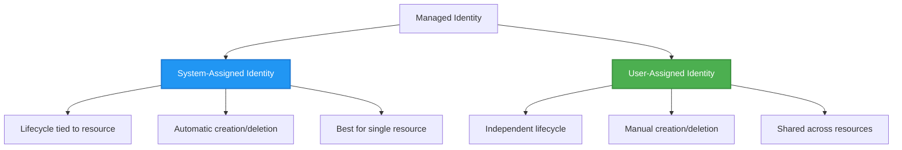

# Padrões de Autenticação e Identidade Gerenciada

⏱️ **Tempo estimado**: 45-60 minutos de leitura; permita tempo extra para integrar os exercícios | 💰 **Impacto no custo**: Identidade/RBAC são gratuitos; computação implantada, armazenamento e Key Vault são faturáveis | ⭐ **Complexidade**: Intermediário

> Revisado contra `azd 1.37.2` (Novembro de 2026). Esta lição contém **fragmentos ilustrativos de integração, não um template completo para download `secure-app`**. Crie os arquivos referenciados, forneça a infraestrutura correspondente e substitua os espaços reservados antes da implantação. Nenhum recurso do Azure foi provisionado durante a revisão.

**📚 Caminho de Aprendizagem:**
- ← Anterior: [Gerenciamento de Configuração](configuration.md) - Gerenciando variáveis de ambiente e segredos
- 🎯 **Você está aqui**: Autenticação & Segurança (Identidade Gerenciada, Key Vault, padrões seguros)
- → Próximo: [Infraestrutura como Código](../chapter-04-infrastructure/README.md) - Provisionar e implantar recursos
- 🏠 [Início do Curso](../../README.md)

---

## O que você aprenderá

Ao concluir esta lição, você irá:
- Compreender os padrões de autenticação do Azure (chaves, strings de conexão, identidade gerenciada)
- Implementar **Identidade Gerenciada** para autenticação sem senha
- Proteger segredos com integração de **Azure Key Vault**
- Configurar **controle de acesso baseado em função (RBAC)** para implantações AZD
- Aplicar melhores práticas de segurança em Container Apps e serviços Azure
- Migrar de autenticação baseada em chaves para baseada em identidade

## Por que a Identidade Gerenciada é Importante

### O Problema: Autenticação Tradicional

**Antes da Identidade Gerenciada:**
```javascript
// ❌ SECURITY RISK: Hardcoded secrets in code
const connectionString = "Server=mydb.database.windows.net;User=admin;Password=P@ssw0rd123";
const storageKey = "xK7mN9pQ2wR5tY8uI0oP3aS6dF1gH4jK...";
const cosmosKey = "C2x7B9n4M1p8Q5w3E6r0T2y5U8i1O4p7...";
```

**Problemas:**
- 🔴 **Segredos expostos** no código, arquivos de configuração, variáveis de ambiente
- 🔴 **Rotação de credenciais** requer alterações no código e reimplantação
- 🔴 **Pesadelos de auditoria** - quem acessou o quê, quando?
- 🔴 **Dispersão** - segredos espalhados por múltiplos sistemas
- 🔴 **Riscos de conformidade** - falha em auditorias de segurança

### A Solução: Identidade Gerenciada

**Depois da Identidade Gerenciada:**
```javascript
// ✅ SECURE: No secrets in code
const credential = new DefaultAzureCredential();
const client = new BlobServiceClient(
  "https://mystorageaccount.blob.core.windows.net",
  credential  // Azure automatically handles authentication
);
```

**Benefícios:**
- ✅ **Zero segredos** no código ou configuração
- ✅ **Rotação automática** - gerenciada pelo Azure
- ✅ **Trilha completa de auditoria** nos logs do Microsoft Entra ID
- ✅ **Segurança centralizada** - gerencie no Portal Azure
- ✅ **Compatível com conformidade** - atende aos padrões de segurança

**Analogia**: A autenticação tradicional é como carregar várias chaves físicas para diferentes portas. A Identidade Gerenciada é como ter um crachá de segurança que automaticamente concede acesso com base em quem você é—sem chaves para perder, copiar ou rotacionar.

---

## Visão Geral da Arquitetura

### Fluxo de Autenticação com Identidade Gerenciada

```mermaid
sequenceDiagram
    participant App as Your Application<br/>(Container App)
    participant MI as Managed Identity<br/>(Microsoft Entra ID)
    participant KV as Key Vault
    participant Storage as Azure Storage
    participant DB as Azure SQL
    
    App->>MI: Request access token<br/>(automatic)
    MI->>MI: Verify identity<br/>(no password needed)
    MI-->>App: Return token for requested audience<br/>(lifetime varies)
    
    App->>KV: Get secret<br/>(using token)
    KV->>KV: Check RBAC permissions
    KV-->>App: Return secret value
    
    App->>Storage: Upload blob<br/>(using token)
    Storage->>Storage: Check RBAC permissions
    Storage-->>App: Success
    
    App->>DB: Query data<br/>(using token)
    DB->>DB: Check SQL permissions
    DB-->>App: Return results
    
    Note over App,DB: Request a separate token for each service audience;<br/>SDK credentials handle caching and renewal
```

### Tipos de Identidades Gerenciadas


```mermaid
graph TB
    MI[Managed Identity]
    SystemAssigned[System-Assigned Identity]
    UserAssigned[User-Assigned Identity]
    
    MI --> SystemAssigned
    MI --> UserAssigned
    
    SystemAssigned --> SA1[Lifecycle tied to resource]
    SystemAssigned --> SA2[Automatic creation/deletion]
    SystemAssigned --> SA3[Best for single resource]
    
    UserAssigned --> UA1[Independent lifecycle]
    UserAssigned --> UA2[Manual creation/deletion]
    UserAssigned --> UA3[Shared across resources]
    
    style SystemAssigned fill:#2196F3,stroke:#1976D2,stroke-width:2px,color:#fff
    style UserAssigned fill:#4CAF50,stroke:#388E3C,stroke-width:2px,color:#fff
```

| Recurso | Atribuída pelo Sistema | Atribuída pelo Usuário |
|---------|----------------|---------------|
| **Ciclo de vida** | Vinculada ao recurso | Independente |
| **Criação** | Automática com o recurso | Criação manual |
| **Exclusão** | Excluída com o recurso | Persiste após exclusão do recurso |
| **Compartilhamento** | Apenas um recurso | Vários recursos |
| **Caso de uso** | Cenários simples | Cenários complexos multi-recurso |
| **Escolha no template** | Definida na infraestrutura | Definida na infraestrutura |

---

## Pré-requisitos

### Ferramentas Necessárias

Você deve já ter essas instaladas das lições anteriores:

```bash
# Verify Azure Developer CLI
azd version
# ✅ Expected: azd version 1.0.0 or higher

# Verify Azure CLI
az --version
# ✅ Expected: azure-cli 2.50.0 or higher
```

### Requisitos do Azure

- Assinatura ativa do Azure
- Permissões para:
  - Criar identidades gerenciadas
  - Atribuir funções RBAC
  - Criar recursos no Key Vault
  - Implantar Container Apps

### Conhecimentos necessários

Você deve ter concluído:
- [Guia de Instalação](../chapter-01-foundation/installation.md) - Configuração do AZD
- [Noções Básicas do AZD](../chapter-01-foundation/azd-basics.md) - Conceitos centrais
- [Gerenciamento de Configuração](configuration.md) - Variáveis de ambiente

---

## Lição 1: Compreendendo os Padrões de Autenticação

### Padrão 1: Strings de Conexão (Legado - Evitar)

**Como funciona:**
```bash
# Connection string contains credentials
STORAGE_CONNECTION_STRING="DefaultEndpointsProtocol=https;AccountName=myaccount;AccountKey=xK7mN9pQ2wR5..."
COSMOS_CONNECTION_STRING="AccountEndpoint=https://myaccount.documents.azure.com:443/;AccountKey=C2x7..."
SQL_CONNECTION_STRING="Server=myserver.database.windows.net;User=admin;Password=P@ssw0rd..."
```

**Problemas:**
- ❌ Segredos visíveis em variáveis de ambiente
- ❌ Registrados em sistemas de implantação
- ❌ Difícil de rotacionar
- ❌ Sem trilha de auditoria de acesso

**Quando usar:** Quando o serviço destino exige autenticação baseada em chave. Prefira identidade onde suportado; caso contrário armazene as chaves com segurança e as rotacione, inclusive em produção.

---

### Padrão 2: Referências ao Key Vault (Melhor)

**Como funciona:**
**Fragmentos parciais Bicep:** campos obrigatórios do vault, identidade do Container App e sua entrada `configuration.secrets` são omitidos. `secretRef` nomeia um segredo do Container App; ele **não é** uma URI do Key Vault. Para usar o Key Vault, defina esse segredo nomeado com `keyVaultUrl` e um `identity` autorizado.

```bicep
// Store secret in Key Vault
resource keyVault 'Microsoft.KeyVault/vaults@2023-02-01' = {
  name: 'mykv'
  properties: {
    enableRbacAuthorization: true
  }
}

// Reference in Container App
env: [
  {
    name: 'STORAGE_KEY'
    secretRef: 'storage-key'  // References Key Vault
  }
]
```

**Benefícios:**
- ✅ Segredos armazenados com segurança no Key Vault
- ✅ Gerenciamento centralizado de segredos
- ✅ Rotação sem alterações de código

**Limitações:**
- ⚠️ Ainda usa chaves/senhas
- ⚠️ Necessidade de gerenciar acesso ao Key Vault

**Quando usar:** Etapa de transição de strings de conexão para identidade gerenciada.

---

### Padrão 3: Identidade Gerenciada (Melhor Prática)

**Como funciona:**
**Bicep parcial:** mescle o bloco de identidade em um Container App completo e forneça `storageAccount` e a definição da função. Uma atribuição de função também requer `name` determinístico.

```bicep
// Enable managed identity
resource containerApp 'Microsoft.App/containerApps@2023-05-01' = {
  name: 'myapp'
  identity: {
    type: 'SystemAssigned'  // Automatically creates identity
  }
}

// Grant permissions
resource roleAssignment 'Microsoft.Authorization/roleAssignments@2022-04-01' = {
  name: guid(storageAccount.id, containerApp.id, storageBlobDataContributorRole)
  scope: storageAccount
  properties: {
    roleDefinitionId: storageBlobDataContributorRole
    principalId: containerApp.identity.principalId
    principalType: 'ServicePrincipal'
  }
}
```

**Código da aplicação:**
```javascript
// No secrets needed!
const { DefaultAzureCredential } = require('@azure/identity');
const { BlobServiceClient } = require('@azure/storage-blob');

const credential = new DefaultAzureCredential();
const blobServiceClient = new BlobServiceClient(
  'https://mystorageaccount.blob.core.windows.net',
  credential
);
```

**Benefícios:**
- ✅ Zero segredos no código/configuração
- ✅ Rotação automática de credenciais
- ✅ Trilha completa de auditoria
- ✅ Permissões baseadas em RBAC
- ✅ Pronto para conformidade

**Quando usar:** Prefira para aplicações hospedadas no Azure que acessam serviços que suportem autenticação Microsoft Entra.

---

### Padrão 4: Principais de Serviço (CI/CD & Automação)

Identidade gerenciada é o padrão ouro *para recursos rodando dentro do Azure*. Mas e para coisas rodando **fora** do Azure—como um pipeline de CI/CD num agente de build, ou um script no seu laptop que não pode usar o login interativo? É aí que entra o **principal de serviço**: uma identidade não humana com suas próprias credenciais que um processo automatizado pode usar para autenticar.

**Como funciona:**

Crie um principal de serviço com escopo em um grupo de recursos (mínimo privilégio):

```bash
az ad sp create-for-rbac \
  --name "myapp-cicd" \
  --role contributor \
  --scopes "/subscriptions/<sub-id>/resourceGroups/<rg-name>"
```

Isso imprime um client ID, secret do client e tenant ID. azd pode autenticar com eles sem interação:

```bash
azd auth login \
  --client-id "<appId>" \
  --client-secret "<password>" \
  --tenant-id "<tenant>"
```

**Prefira credenciais federadas (OIDC) em vez de segredos.** Em vez de um secret client de longa duração, configure uma credencial federada para que o pipeline troque um token de curta duração—sem segredo para vazar ou rotacionar:

```bash
azd auth login \
  --client-id "<appId>" \
  --federated-credential-provider "github" \
  --tenant-id "<tenant>"
```

> `azd pipeline config` configura isso para você automaticamente. Veja os tutoriais de CI/CD no [Capítulo 8](../chapter-08-production/production-ai-practices.md).

**Benefícios:**
- ✅ Funciona fora do Azure (agentes de build, on-premises, outras nuvens)
- ✅ Pode ser com escopo a um único grupo de recursos com uma função
- ✅ Variante federada (OIDC) sem segredo armazenado

**Compromissos:**
- ⚠️ Variante baseada em segredo requer armazenamento e rotação cuidadosos
- ⚠️ Um segredo vazado concede tudo que o SP pode fazer—mantenha escopos restritos

**Quando usar:** Pipelines CI/CD e automações que não podem usar identidade gerenciada. Sempre prefira a variante **federada/OIDC** em relação a um segredo client, e prefira identidade gerenciada sempre que a carga rodar dentro do Azure.

**Armazenando credenciais com segurança:**
- Nunca comite segredos—use o cofre de segredos do seu pipeline (GitHub Actions secrets, grupos de variáveis Azure DevOps / Key Vault).
- Dê escopo ao SP para a menor função e grupo de recursos necessários.
- Defina um prazo de validade e rotacione, ou elimine o segredo totalmente com OIDC.

---

## Lição 2: Implementando Identidade Gerenciada com AZD

### Implementação Passo a Passo

Os fragmentos a seguir mostram como integrar identidade gerenciada em um projeto Container App. Eles **não são um ponto de partida para copiar e rodar**: o módulo Storage, a infraestrutura completa do ambiente gerenciado/registro, Dockerfile e arquivo de parâmetros não são todos fornecidos aqui. Comece com um template funcional de Container Apps e mescle esses padrões, mantendo sua configuração de registro e tags de serviço.

### Estrutura do Projeto

```
secure-app/
├── azure.yaml                 # AZD configuration
├── infra/
│   ├── main.bicep            # Main infrastructure
│   ├── core/
│   │   ├── identity.bicep    # Managed identity setup
│   │   ├── keyvault.bicep    # Key Vault configuration
│   │   └── storage.bicep     # Storage with RBAC
│   └── app/
│       └── container-app.bicep
└── src/
    ├── app.js                # Application code
    ├── package.json
    └── Dockerfile
```

### 1. Configure AZD (azure.yaml)

```yaml
name: secure-app
metadata:
  template: secure-app@1.0.0

services:
  api:
    project: ./src
    language: js
    host: containerapp

# Managed identity must be enabled in the infrastructure, not by this YAML.
```

### 2. Infraestrutura: Habilite Identidade Gerenciada

**Arquivo: `infra/main.bicep`**

```bicep
targetScope = 'subscription'

param environmentName string
param location string = 'eastus'
param containerAppsEnvironmentId string
param containerImage string

var tags = { 'azd-env-name': environmentName }

// Resource group
resource rg 'Microsoft.Resources/resourceGroups@2021-04-01' = {
  name: 'rg-${environmentName}'
  location: location
  tags: tags
}

// Storage Account
module storage './core/storage.bicep' = {
  name: 'storage'
  scope: rg
  params: {
    name: 'st${uniqueString(rg.id)}'
    location: location
    tags: tags
  }
}

// Key Vault
module keyVault './core/keyvault.bicep' = {
  name: 'keyvault'
  scope: rg
  params: {
    name: 'kv-${uniqueString(rg.id)}'
    location: location
    tags: tags
  }
}

// Container App with Managed Identity
module containerApp './app/container-app.bicep' = {
  name: 'container-app'
  scope: rg
  params: {
    name: 'ca-${environmentName}'
    location: location
    tags: tags
    storageAccountName: storage.outputs.name
    keyVaultName: keyVault.outputs.name
    containerAppsEnvironmentId: containerAppsEnvironmentId
    containerImage: containerImage
  }
}

// Grant Container App access to Storage
module storageRoleAssignment './core/role-assignment.bicep' = {
  name: 'storage-role'
  scope: rg
  params: {
    principalId: containerApp.outputs.identityPrincipalId
    roleDefinitionId: 'ba92f5b4-2d11-453d-a403-e96b0029c9fe'  // Storage Blob Data Contributor
    targetResourceType: 'storage'
    targetResourceName: storage.outputs.name
  }
}

// Grant Container App access to Key Vault
module kvRoleAssignment './core/role-assignment.bicep' = {
  name: 'kv-role'
  scope: rg
  params: {
    principalId: containerApp.outputs.identityPrincipalId
    roleDefinitionId: '4633458b-17de-408a-b874-0445c86b69e6'  // Key Vault Secrets User
    targetResourceType: 'keyvault'
    targetResourceName: keyVault.outputs.name
  }
}

// Outputs
output AZURE_STORAGE_ACCOUNT_NAME string = storage.outputs.name
output AZURE_KEY_VAULT_NAME string = keyVault.outputs.name
output APP_URL string = containerApp.outputs.url
```

### 3. Container App com Identidade Atribuída pelo Sistema

**Arquivo: `infra/app/container-app.bicep`**

```bicep
param name string
param location string
param tags object = {}
param storageAccountName string
param keyVaultName string
param containerAppsEnvironmentId string
param containerImage string

resource containerApp 'Microsoft.App/containerApps@2023-05-01' = {
  name: name
  location: location
  tags: union(tags, { 'azd-service-name': 'api' })
  identity: {
    type: 'SystemAssigned'  // 🔑 Enable managed identity
  }
  properties: {
    managedEnvironmentId: containerAppsEnvironmentId
    configuration: {
      ingress: {
        external: true
        targetPort: 3000
      }
    }
    template: {
      containers: [
        {
          name: 'api'
          image: containerImage // Must exist; configure registry credentials for private images
          resources: {
            cpu: json('0.5')
            memory: '1Gi'
          }
          env: [
            {
              name: 'AZURE_STORAGE_ACCOUNT_NAME'
              value: storageAccountName
            }
            {
              name: 'AZURE_KEY_VAULT_NAME'
              value: keyVaultName
            }
            // 🔑 No secrets - managed identity handles authentication!
          ]
        }
      ]
    }
  }
}

// Output the identity for RBAC assignments
output identityPrincipalId string = containerApp.identity.principalId
output id string = containerApp.id
output url string = 'https://${containerApp.properties.configuration.ingress.fqdn}'
```

### 4. Módulo de Atribuição de Função RBAC

**Arquivo: `infra/core/role-assignment.bicep`**

```bicep
param principalId string
param roleDefinitionId string  // Azure built-in role ID
@allowed(['storage', 'keyvault'])
param targetResourceType string
param targetResourceName string

// Typed existing resources give Bicep a valid resource scope, not a string ID.
resource storageTarget 'Microsoft.Storage/storageAccounts@2023-01-01' existing = {
  name: targetResourceName
}
resource vaultTarget 'Microsoft.KeyVault/vaults@2023-02-01' existing = {
  name: targetResourceName
}

resource storageAssignment 'Microsoft.Authorization/roleAssignments@2022-04-01' = if (targetResourceType == 'storage') {
  name: guid(storageTarget.id, principalId, roleDefinitionId)
  scope: storageTarget
  properties: {
    roleDefinitionId: subscriptionResourceId('Microsoft.Authorization/roleDefinitions', roleDefinitionId)
    principalId: principalId
    principalType: 'ServicePrincipal'
  }
}

resource vaultAssignment 'Microsoft.Authorization/roleAssignments@2022-04-01' = if (targetResourceType == 'keyvault') {
  name: guid(vaultTarget.id, principalId, roleDefinitionId)
  scope: vaultTarget
  properties: {
    roleDefinitionId: subscriptionResourceId('Microsoft.Authorization/roleDefinitions', roleDefinitionId)
    principalId: principalId
    principalType: 'ServicePrincipal'
  }
}

// This module assigns at the target resource scope, not the whole resource group.
```

### 5. Código da Aplicação com Identidade Gerenciada

**Arquivo: `src/app.js`**

```javascript
const express = require('express');
const { DefaultAzureCredential } = require('@azure/identity');
const { BlobServiceClient } = require('@azure/storage-blob');
const { SecretClient } = require('@azure/keyvault-secrets');

const app = express();
const PORT = process.env.PORT || 3000;

// 🔑 Initialize credential (works automatically with managed identity)
const credential = new DefaultAzureCredential();

// Azure Storage setup
const storageAccountName = process.env.AZURE_STORAGE_ACCOUNT_NAME;
const blobServiceClient = new BlobServiceClient(
  `https://${storageAccountName}.blob.core.windows.net`,
  credential  // No keys needed!
);

// Key Vault setup
const keyVaultName = process.env.AZURE_KEY_VAULT_NAME;
const secretClient = new SecretClient(
  `https://${keyVaultName}.vault.azure.net`,
  credential  // No keys needed!
);

// Health check
app.get('/health', (req, res) => {
  res.json({ status: 'healthy', authentication: 'managed-identity' });
});

// Upload file to blob storage
app.post('/upload', async (req, res) => {
  try {
    const containerClient = blobServiceClient.getContainerClient('uploads');
    await containerClient.createIfNotExists();
    
    const blobName = `file-${Date.now()}.txt`;
    const blockBlobClient = containerClient.getBlockBlobClient(blobName);
    
    const content = 'Hello from managed identity!';
    await blockBlobClient.upload(content, Buffer.byteLength(content));
    
    res.json({
      success: true,
      blobName: blobName,
      message: 'File uploaded using managed identity!'
    });
  } catch (error) {
    console.error('Upload error:', error);
    res.status(500).json({ error: error.message });
  }
});

// Get secret from Key Vault
app.get('/secret/:name', async (req, res) => {
  try {
    const secretName = req.params.name;
    const secret = await secretClient.getSecret(secretName);
    
    res.json({
      name: secretName,
      retrieved: secret.value !== undefined, // Never return the secret value to callers
      message: 'Secret retrieved using managed identity!'
    });
  } catch (error) {
    console.error('Secret error:', error);
    res.status(500).json({ error: error.message });
  }
});

// List blob containers (demonstrates read access)
app.get('/containers', async (req, res) => {
  try {
    const containers = [];
    for await (const container of blobServiceClient.listContainers()) {
      containers.push(container.name);
    }
    
    res.json({
      containers: containers,
      count: containers.length,
      message: 'Containers listed using managed identity!'
    });
  } catch (error) {
    console.error('List error:', error);
    res.status(500).json({ error: error.message });
  }
});

app.listen(PORT, () => {
  console.log(`Secure API listening on port ${PORT}`);
  console.log('Authentication: Managed Identity (passwordless)');
});
```

**Arquivo: `src/package.json`**

```json
{
  "name": "secure-app",
  "version": "1.0.0",
  "dependencies": {
    "express": "^4.18.2",
    "@azure/identity": "^4.0.0",
    "@azure/storage-blob": "^12.17.0",
    "@azure/keyvault-secrets": "^4.7.0"
  },
  "scripts": {
    "start": "node app.js"
  }
}
```

### 6. Implantar e Testar

Execute esses comandos **apenas depois** de completar a infraestrutura faltante, Dockerfile, e `main.parameters.json` correspondente no seu próprio projeto. Autentique o azd com `azd auth login`; faça login separadamente com `az login` para as verificações do Azure CLI depois. Os endpoints mostrados são demonstrações e requerem controles de acesso adequados antes do uso público.

```bash
# Initialize AZD environment
azd init

# Deploy infrastructure and application
azd up

# Get the app URL
APP_URL=$(azd env get-value APP_URL)

# Test health check
curl $APP_URL/health
```

**✅ Saída esperada:**
```json
{
  "status": "healthy",
  "authentication": "managed-identity"
}
```

**Teste de upload de blob:**
```bash
curl -X POST $APP_URL/upload
```

**✅ Saída esperada:**
```json
{
  "success": true,
  "blobName": "file-1700404800000.txt",
  "message": "File uploaded using managed identity!"
}
```

**Teste de listagem de container:**
```bash
curl $APP_URL/containers
```

**✅ Saída esperada:**
```json
{
  "containers": ["uploads"],
  "count": 1,
  "message": "Containers listed using managed identity!"
}
```

---

## Funções RBAC Comuns do Azure

### IDs de Funções Integradas para Identidade Gerenciada

| Serviço | Nome da Função | ID da Função | Permissões |
|---------|-----------|---------|-------------|
| **Storage** | Storage Blob Data Reader | `2a2b9908-6ea1-4ae2-8e65-a410df84e7d1` | Ler blobs e containers |
| **Storage** | Storage Blob Data Contributor | `ba92f5b4-2d11-453d-a403-e96b0029c9fe` | Ler, escrever, deletar blobs |
| **Storage** | Storage Queue Data Contributor | `974c5e8b-45b9-4653-ba55-5f855dd0fb88` | Ler, escrever, deletar filas/mensagens |
| **Key Vault** | Key Vault Secrets User | `4633458b-17de-408a-b874-0445c86b69e6` | Ler segredos |
| **Key Vault** | Key Vault Secrets Officer | `b86a8fe4-44ce-4948-aee5-eccb2c155cd7` | Ler, escrever, deletar segredos |
| **Cosmos DB** | Cosmos DB Built-in Data Reader | `00000000-0000-0000-0000-000000000001` | Ler dados do Cosmos DB |
| **Cosmos DB** | Cosmos DB Built-in Data Contributor | `00000000-0000-0000-0000-000000000002` | Ler, escrever dados do Cosmos DB |
| **SQL Database** | SQL DB Contributor | `9b7fa17d-e63e-47b0-bb0a-15c516ac86ec` | Gerenciar recursos de banco de dados; não concede acesso a dados SQL |
| **Service Bus** | Azure Service Bus Data Owner | `090c5cfd-751d-490a-894a-3ce6f1109419` | Enviar, receber, gerenciar mensagens |

### Como Encontrar IDs de Funções

Os dois IDs acima do Cosmos DB para NoSQL são **definições de função nativas do plano de dados Cosmos**, não IDs de função RBAC da assinatura Azure. Atribua-os com `az cosmosdb sql role assignment create` (ou `Microsoft.DocumentDB/databaseAccounts/sqlRoleAssignments`), não `az role assignment create`. O acesso aos dados SQL requer um usuário de banco de dados Entra e permissões SQL.

```bash
# List all built-in roles
az role definition list --query "[].{Name:roleName, ID:name}" --output table

# Search for specific role
az role definition list --query "[?contains(roleName, 'Storage Blob')].{Name:roleName, ID:name}" --output table

# Get role details
az role definition list --name "Storage Blob Data Contributor"
```

---

## Exercícios Práticos

**Pré-requisitos de integração para os três exercícios:** um template Container App funcional no seu próprio projeto, recursos Bicep correspondentes, login Azure CLI/azd, e autoridade para atribuir as funções necessárias. Estes são ajustes guiados, não pontos de partida locais independentes; substitua os nomes dos recursos exemplos pelos seus nomes implantados.

### Exercício 1: Ativar Identidade Gerenciada para Aplicativo Existente ⭐⭐ (Médio)

**Objetivo**: Adicionar identidade gerenciada a uma implantação existente de Container App

**Cenário**: Você tem um Container App usando strings de conexão. Converta-o para identidade gerenciada.

**Ponto de partida**: Container App com esta configuração:

```bicep
// ❌ Current: Using connection string
env: [
  {
    name: 'STORAGE_CONNECTION_STRING'
    secretRef: 'storage-connection'
  }
]
```

**Passos**:

1. **Habilite a identidade gerenciada no Bicep:**

```bicep
resource containerApp 'Microsoft.App/containerApps@2023-05-01' = {
  name: 'myapp'
  identity: {
    type: 'SystemAssigned'  // Add this
  }
  // ... rest of configuration
}
```

2. **Conceda acesso ao Storage:**

```bicep
// Get storage account reference
resource storageAccount 'Microsoft.Storage/storageAccounts@2023-01-01' existing = {
  name: storageAccountName
}

// Assign role
resource roleAssignment 'Microsoft.Authorization/roleAssignments@2022-04-01' = {
  name: guid(containerApp.id, 'ba92f5b4-2d11-453d-a403-e96b0029c9fe', storageAccount.id)
  scope: storageAccount
  properties: {
    roleDefinitionId: subscriptionResourceId('Microsoft.Authorization/roleDefinitions', 'ba92f5b4-2d11-453d-a403-e96b0029c9fe')
    principalId: containerApp.identity.principalId
    principalType: 'ServicePrincipal'
  }
}
```

3. **Atualize o código da aplicação:**

**Antes (string de conexão):**
```javascript
const { BlobServiceClient } = require('@azure/storage-blob');

const blobServiceClient = BlobServiceClient.fromConnectionString(
  process.env.STORAGE_CONNECTION_STRING
);
```

**Depois (identidade gerenciada):**
```javascript
const { DefaultAzureCredential } = require('@azure/identity');
const { BlobServiceClient } = require('@azure/storage-blob');

const credential = new DefaultAzureCredential();
const blobServiceClient = new BlobServiceClient(
  `https://${process.env.STORAGE_ACCOUNT_NAME}.blob.core.windows.net`,
  credential
);
```

4. **Atualize variáveis de ambiente:**

```bicep
env: [
  {
    name: 'STORAGE_ACCOUNT_NAME'
    value: storageAccountName  // Just the name, no secrets!
  }
  // Remove STORAGE_CONNECTION_STRING
]
```

5. **Implante e teste:**

```bash
# Redeploy
azd up

# Test that it still works
APP_URL=$(azd show --output json | jq -er '.services.api.ingressUrl')
curl --fail -X POST "$APP_URL/upload"
```

**✅ Critérios de Sucesso:**
- ✅ Aplicação implanta sem erros
- ✅ Operações de Storage funcionam (upload, listagem, download)
- ✅ Sem strings de conexão nas variáveis de ambiente
- ✅ Identidade visível no Portal Azure na lâmina "Identidade"

**Verificação:**

```bash
# Check managed identity is enabled
az containerapp show \
  --name myapp \
  --resource-group rg-myapp \
  --query "identity.type"
# ✅ Expected: "SystemAssigned"

# Check role assignment
az role assignment list \
  --assignee $(az containerapp show --name myapp --resource-group rg-myapp --query "identity.principalId" -o tsv) \
  --scope /subscriptions/{sub-id}/resourceGroups/rg-myapp/providers/Microsoft.Storage/storageAccounts/mystorageaccount
# ✅ Expected: Shows "Storage Blob Data Contributor" role
```

**Tempo**: 20-30 minutos

---

### Exercício 2: Acesso Multi-Serviço com Identidade Atribuída pelo Usuário ⭐⭐⭐ (Avançado)

**Objetivo**: Criar uma identidade atribuída pelo usuário compartilhada por múltiplos Container Apps

**Cenário**: Você tem 3 microsserviços que precisam todos acessar a mesma conta Storage e Key Vault.

**Passos**:

1. **Crie a identidade atribuída pelo usuário:**

**Arquivo: `infra/core/identity.bicep`**

```bicep
param name string
param location string
param tags object = {}

resource userAssignedIdentity 'Microsoft.ManagedIdentity/userAssignedIdentities@2023-01-31' = {
  name: name
  location: location
  tags: tags
}

output id string = userAssignedIdentity.id
output principalId string = userAssignedIdentity.properties.principalId
output clientId string = userAssignedIdentity.properties.clientId
```

2. **Atribua funções para a identidade atribuída pelo usuário:**

```bicep
// In main.bicep
module userIdentity './core/identity.bicep' = {
  name: 'user-identity'
  scope: rg
  params: {
    name: 'id-${environmentName}'
    location: location
    tags: tags
  }
}

// Grant Storage access
resource storageRoleAssignment 'Microsoft.Authorization/roleAssignments@2022-04-01' = {
  name: guid(storageAccount.id, environmentName, 'storage-contributor')
  scope: storageAccount
  properties: {
    roleDefinitionId: subscriptionResourceId('Microsoft.Authorization/roleDefinitions', 'ba92f5b4-2d11-453d-a403-e96b0029c9fe')
    principalId: userIdentity.outputs.principalId
    principalType: 'ServicePrincipal'
  }
}

// Grant Key Vault access
resource kvRoleAssignment 'Microsoft.Authorization/roleAssignments@2022-04-01' = {
  name: guid(keyVault.id, environmentName, 'kv-secrets-user')
  scope: keyVault
  properties: {
    roleDefinitionId: subscriptionResourceId('Microsoft.Authorization/roleDefinitions', '4633458b-17de-408a-b874-0445c86b69e6')
    principalId: userIdentity.outputs.principalId
    principalType: 'ServicePrincipal'
  }
}
```

3. **Atribuir identidade a múltiplos Container Apps:**

```bicep
resource apiGateway 'Microsoft.App/containerApps@2023-05-01' = {
  name: 'api-gateway'
  identity: {
    type: 'UserAssigned'
    userAssignedIdentities: {
      '${userIdentity.outputs.id}': {}
    }
  }
  // ... rest of config
}

resource productService 'Microsoft.App/containerApps@2023-05-01' = {
  name: 'product-service'
  identity: {
    type: 'UserAssigned'
    userAssignedIdentities: {
      '${userIdentity.outputs.id}': {}
    }
  }
  // ... rest of config
}

resource orderService 'Microsoft.App/containerApps@2023-05-01' = {
  name: 'order-service'
  identity: {
    type: 'UserAssigned'
    userAssignedIdentities: {
      '${userIdentity.outputs.id}': {}
    }
  }
  // ... rest of config
}
```

4. **Código da aplicação (todos os serviços usam o mesmo padrão):**

```javascript
const { ManagedIdentityCredential } = require('@azure/identity');
const { BlobServiceClient } = require('@azure/storage-blob');

// For user-assigned identity, specify the client ID
const credential = new ManagedIdentityCredential(
  process.env.AZURE_CLIENT_ID  // User-assigned identity client ID
);

// Alternative (choose ONE credential declaration):
// const { DefaultAzureCredential } = require('@azure/identity');
// const credential = new DefaultAzureCredential({
//   managedIdentityClientId: process.env.AZURE_CLIENT_ID
// });

const blobServiceClient = new BlobServiceClient(
  `https://${process.env.STORAGE_ACCOUNT_NAME}.blob.core.windows.net`,
  credential
);
```

Defina o `AZURE_CLIENT_ID` de tempo de execução de cada Container App para `userIdentity.outputs.clientId` e `STORAGE_ACCOUNT_NAME` para o nome do seu armazenamento no Bicep. Apenas atribuir a identidade ou executar `azd env set` não configura esses valores de tempo de execução.

5. **Implantar e verificar:**

```bash
azd up

# Test all services can access storage
# Replace with the actual ingress URLs reported for your three services
curl --fail -X POST "$API_GATEWAY_URL/upload"
curl --fail -X POST "$PRODUCT_SERVICE_URL/upload"
curl --fail -X POST "$ORDER_SERVICE_URL/upload"
```

**✅ Critérios de Sucesso:**
- ✅ Uma identidade compartilhada entre 3 serviços
- ✅ Todos os serviços podem acessar o Storage e o Key Vault
- ✅ A identidade persiste se você deletar um serviço
- ✅ Gerenciamento de permissão centralizado

**Benefícios da Identidade Atribuída pelo Usuário:**
- Uma única identidade para gerenciar
- Permissões consistentes entre os serviços
- Sobrevive à exclusão do serviço
- Melhor para arquiteturas complexas

**Tempo**: 30-40 minutos

---

### Exercício 3: Implementar Rotação de Segredo no Key Vault ⭐⭐⭐ (Avançado)

**Objetivo**: Armazenar chaves de API de terceiros no Key Vault e acessá-las usando identidade gerenciada

**Cenário**: Seu aplicativo precisa chamar uma API externa (OpenAI, Stripe, SendGrid) que requer chaves de API.

**Passos**:

1. **Criar Key Vault com RBAC:**

**Arquivo: `infra/core/keyvault.bicep`**

```bicep
param name string
param location string
param tags object = {}

resource keyVault 'Microsoft.KeyVault/vaults@2023-02-01' = {
  name: name
  location: location
  tags: tags
  properties: {
    enableRbacAuthorization: true  // Use RBAC instead of access policies
    sku: {
      family: 'A'
      name: 'standard'
    }
    tenantId: subscription().tenantId
    enableSoftDelete: true
    softDeleteRetentionInDays: 90
  }
}

// Allow Container App to read secrets
output id string = keyVault.id
output name string = keyVault.name
output uri string = keyVault.properties.vaultUri
```

2. **Armazenar segredos no Key Vault:**

```bash
# Get Key Vault name
KV_NAME=$(azd env get-value AZURE_KEY_VAULT_NAME)

# Store third-party API keys
az keyvault secret set \
  --vault-name $KV_NAME \
  --name "OpenAI-ApiKey" \
  --value "sk-proj-xxxxxxxxxxxxx"

az keyvault secret set \
  --vault-name $KV_NAME \
  --name "Stripe-ApiKey" \
  --value "sk_live_xxxxxxxxxxxxx"

az keyvault secret set \
  --vault-name $KV_NAME \
  --name "SendGrid-ApiKey" \
  --value "SG.xxxxxxxxxxxxx"
```

3. **Código da aplicação para recuperar segredos:**

**Arquivo: `src/config.js`**

```javascript
const { DefaultAzureCredential } = require('@azure/identity');
const { SecretClient } = require('@azure/keyvault-secrets');

class Config {
  constructor() {
    this.credential = new DefaultAzureCredential();
    this.secretClient = new SecretClient(
      `https://${process.env.AZURE_KEY_VAULT_NAME}.vault.azure.net`,
      this.credential
    );
    this.cache = {};
  }

  async getSecret(secretName) {
    // Check cache first
    if (this.cache[secretName]) {
      return this.cache[secretName];
    }

    try {
      const secret = await this.secretClient.getSecret(secretName);
      this.cache[secretName] = secret.value;
      console.log(`✅ Retrieved secret: ${secretName}`);
      return secret.value;
    } catch (error) {
      console.error(`❌ Failed to get secret ${secretName}:`, error.message);
      throw error;
    }
  }

  async getOpenAIKey() {
    return this.getSecret('OpenAI-ApiKey');
  }

  async getStripeKey() {
    return this.getSecret('Stripe-ApiKey');
  }

  async getSendGridKey() {
    return this.getSecret('SendGrid-ApiKey');
  }
}

module.exports = new Config();
```

4. **Usar segredos na aplicação:**

**Arquivo: `src/app.js`**

Este **fragmento de aplicação substituto** requer `npm install openai`, uma chave real de terceiro, um modelo acessível e a infraestrutura do seu projeto funcional. Ele chama o OpenAI diretamente, não uma implantação do Azure OpenAI. As chaves de espaço reservado abaixo não autorizam uma solicitação.

```javascript
const express = require('express');
const config = require('./config');
const { OpenAI } = require('openai');

const app = express();

// Initialize OpenAI with key from Key Vault
let openaiClient;

async function initializeServices() {
  const openaiKey = await config.getOpenAIKey();
  openaiClient = new OpenAI({ apiKey: openaiKey });
  console.log('✅ Services initialized with secrets from Key Vault');
}

app.post('/chat', async (req, res) => {
  try {
    const completion = await openaiClient.chat.completions.create({
      model: 'gpt-4.1',
      messages: [{ role: 'user', content: 'Hello!' }]
    });
    
    res.json({
      response: completion.choices[0].message.content,
      authentication: 'Key from Key Vault via Managed Identity'
    });
  } catch (error) {
    res.status(500).json({ error: error.message });
  }
});

// Start listening only after initialization succeeds.
initializeServices().then(() => {
  app.listen(3000, () => console.log('Key Vault demo running'));
}).catch(error => {
  console.error('Initialization failed:', error.message);
  process.exitCode = 1;
});
```

5. **Implantar e testar:**

```bash
azd up

# Test that API keys work
curl -X POST https://myapp.azurecontainerapps.io/chat \
  -H "Content-Type: application/json" \
  -d '{"message":"Hello AI"}'
```

**✅ Critérios de Sucesso:**
- ✅ Nenhuma chave de API no código ou nas variáveis de ambiente
- ✅ A aplicação recupera chaves do Key Vault
- ✅ APIs de terceiros funcionam corretamente
- ✅ Pode rotacionar chaves sem mudanças no código

**Rotacionar um segredo:**

```bash
# Update secret in Key Vault
az keyvault secret set \
  --vault-name $KV_NAME \
  --name "OpenAI-ApiKey" \
  --value "sk-proj-NEW_KEY_HERE"

# Find the active revision name, then restart it to clear the in-process cache
az containerapp revision list --name myapp --resource-group rg-myapp --output table
az containerapp revision restart \
  --name myapp \
  --resource-group rg-myapp \
  --revision "<active-revision-name>"
```

**Tempo**: 25-35 minutos

---

## Verificação de Conhecimento

### 1. Padrões de Autenticação ✓

Teste sua compreensão:

- [ ] **Q1**: Quais são os três principais padrões de autenticação? 
  - **A**: Connection strings (legado), referências do Key Vault (transição), Identidade Gerenciada (melhor)

- [ ] **Q2**: Por que a identidade gerenciada é melhor que connection strings?
  - **A**: Sem segredos no código, rotação automática, trilha completa de auditoria, permissões RBAC

- [ ] **Q3**: Quando usar identidade atribuída pelo usuário em vez da sistema-atribuída?
  - **A**: Quando compartilhar identidade entre múltiplos recursos ou quando o ciclo de vida da identidade é independente do recurso

**Verificação Prática:**
```bash
# Check what type of identity your app uses
az containerapp show \
  --name myapp \
  --resource-group rg-myapp \
  --query "identity.type"

# List all role assignments for the identity
az role assignment list \
  --assignee $(az containerapp show --name myapp --resource-group rg-myapp --query "identity.principalId" -o tsv)
```

---

### 2. RBAC e Permissões ✓

Teste sua compreensão:

- [ ] **Q1**: Qual é o ID do papel "Storage Blob Data Contributor"?
  - **A**: `ba92f5b4-2d11-453d-a403-e96b0029c9fe`

- [ ] **Q2**: Quais permissões o "Key Vault Secrets User" fornece?
  - **A**: Acesso somente leitura a segredos (não pode criar, atualizar ou deletar)

- [ ] **Q3**: Como conceder acesso de um Container App ao Azure SQL?
  - **A**: Configure a autenticação Microsoft Entra, crie a identidade como um usuário do banco de dados e conceda as permissões SQL necessárias. "SQL DB Contributor" apenas gerencia recursos Azure; não autoriza consultas.

**Verificação Prática:**
```bash
# Find specific role
az role definition list --name "Storage Blob Data Contributor"

# Check what roles are assigned to your identity
PRINCIPAL_ID=$(az containerapp show --name myapp --resource-group rg-myapp --query "identity.principalId" -o tsv)
az role assignment list --assignee $PRINCIPAL_ID --output table
```

---

### 3. Integração com Key Vault ✓

Teste sua compreensão:

- [ ] **Q1**: Como habilitar RBAC para o Key Vault em vez de políticas de acesso?
  - **A**: Defina `enableRbacAuthorization: true` no Bicep

- [ ] **Q2**: Qual biblioteca do SDK Azure lida com autenticação de identidade gerenciada?
  - **A**: `@azure/identity` com a classe `DefaultAzureCredential`

- [ ] **Q3**: Quanto tempo os segredos do Key Vault permanecem no cache?
  - **A**: Depende da aplicação; implemente sua própria estratégia de cache

**Verificação Prática:**
```bash
# Test Key Vault access
az keyvault secret show \
  --vault-name $KV_NAME \
  --name "OpenAI-ApiKey" \
  --query "{name:name,enabled:attributes.enabled}"

# Check RBAC is enabled
az keyvault show \
  --name $KV_NAME \
  --query "properties.enableRbacAuthorization"
# ✅ Expected: true
```

---

## Melhores Práticas de Segurança

### ✅ FAÇA:

1. **Sempre use identidade gerenciada em produção**
   ```bicep
   identity: {
     type: 'SystemAssigned'
   }
   ```

2. **Use papéis RBAC de menor privilégio**
   - Use papéis "Reader" sempre que possível
   - Evite "Owner" ou "Contributor" a menos que necessário

3. **Armazene chaves de terceiros no Key Vault**
   ```javascript
   const apiKey = await secretClient.getSecret('ThirdPartyApiKey');
   ```

4. **Habilite registro de auditoria** (fragmento parcial de recurso; mescle com suas declarações de cofre e workspace)
   ```bicep
   resource vaultDiagnostics 'Microsoft.Insights/diagnosticSettings@2021-05-01-preview' = {
     name: 'vault-audit'
     scope: keyVault
     properties: {
       workspaceId: logAnalytics.id
       logs: [{ category: 'AuditEvent', enabled: true }]
     }
   }
   ```

5. **Use identidades diferentes para dev/homolog/prod**
   ```bash
   azd env new dev
   azd env new staging
   azd env new prod
   ```

6. **Rotacione segredos regularmente**
   - Defina datas de expiração nos segredos do Key Vault
   - Automatize rotação com Azure Functions

### ❌ NÃO FAÇA:

1. **Nunca codifique segredos no código**
   ```javascript
   // ❌ BAD
   const apiKey = "sk-proj-xxxxxxxxxxxxx";
   ```

2. **Não use connection strings em produção**
   ```javascript
   // ❌ BAD
   BlobServiceClient.fromConnectionString(process.env.STORAGE_CONNECTION_STRING)
   ```

3. **Não conceda permissões excessivas**
   ```bicep
   // ❌ BAD - too much access
   roleDefinitionId: subscriptionResourceId('Microsoft.Authorization/roleDefinitions', '8e3af657-a8ff-443c-a75c-2fe8c4bcb635')
   
   // ✅ GOOD - least privilege
   roleDefinitionId: subscriptionResourceId('Microsoft.Authorization/roleDefinitions', '2a2b9908-6ea1-4ae2-8e65-a410df84e7d1')
   ```

4. **Não faça log de segredos**
   ```javascript
   // ❌ BAD
   console.log('API Key:', apiKey);
   
   // ✅ GOOD
   console.log('API Key retrieved successfully');
   ```

5. **Não compartilhe identidades de produção entre ambientes**
   ```bicep
   // ❌ BAD - same identity for dev and prod
   // ✅ GOOD - separate identities per environment
   ```

---

## Guia de Solução de Problemas

### Problema: "Unauthorized" ao acessar Azure Storage

**Sintomas:**
```
Error: Unauthorized (403)
AuthorizationPermissionMismatch: This request is not authorized to perform this operation
```

**Diagnóstico:**

```bash
# Check if managed identity is enabled
az containerapp show \
  --name myapp \
  --resource-group rg-myapp \
  --query "identity.type"
# ✅ Expected: "SystemAssigned" or "UserAssigned"

# Check role assignments
PRINCIPAL_ID=$(az containerapp show --name myapp --resource-group rg-myapp --query "identity.principalId" -o tsv)
az role assignment list --assignee $PRINCIPAL_ID

# Expected: Should see "Storage Blob Data Contributor" or similar role
```

**Soluções:**

1. **Conceda o papel RBAC correto:**
```bash
STORAGE_ID=$(az storage account show --name mystorageaccount --resource-group rg-myapp --query "id" -o tsv)
az role assignment create \
  --assignee $PRINCIPAL_ID \
  --role "Storage Blob Data Contributor" \
  --scope $STORAGE_ID
```

2. **Aguarde a propagação (pode levar 5-10 minutos):**
```bash
# Check role assignment status
az role assignment list --assignee $PRINCIPAL_ID --scope $STORAGE_ID
```

3. **Verifique se o código da aplicação usa a credencial correta:**
```javascript
// Make sure you're using DefaultAzureCredential
const credential = new DefaultAzureCredential();
```

---

### Problema: Acesso ao Key Vault negado

**Sintomas:**
```
Error: Forbidden (403)
The user, group or application does not have secrets get permission
```

**Diagnóstico:**

```bash
# Check Key Vault RBAC is enabled
az keyvault show \
  --name $KV_NAME \
  --query "properties.enableRbacAuthorization"
# ✅ Expected: true

# Check role assignments
az role assignment list \
  --assignee $PRINCIPAL_ID \
  --scope /subscriptions/{sub-id}/resourceGroups/rg-myapp/providers/Microsoft.KeyVault/vaults/$KV_NAME
```

**Soluções:**

1. **Habilite RBAC no Key Vault:**
```bash
az keyvault update \
  --name $KV_NAME \
  --enable-rbac-authorization true
```

2. **Conceda o papel Key Vault Secrets User:**
```bash
KV_ID=$(az keyvault show --name $KV_NAME --query "id" -o tsv)
az role assignment create \
  --assignee $PRINCIPAL_ID \
  --role "Key Vault Secrets User" \
  --scope $KV_ID
```

---

### Problema: DefaultAzureCredential falha localmente

**Sintomas:**
```
Error: DefaultAzureCredential failed to retrieve a token
CredentialUnavailableError: No credential available
```

**Diagnóstico:**

```bash
# Check if you're logged in
az account show

# Check Azure CLI authentication
az ad signed-in-user show
```

**Soluções:**

1. **Faça login no Azure CLI:**
```bash
az login
```

2. **Defina a assinatura Azure:**
```bash
az account set --subscription "Your Subscription Name"
```

3. **Para desenvolvimento local, use variáveis de ambiente:**
```bash
export AZURE_TENANT_ID="your-tenant-id"
export AZURE_CLIENT_ID="your-client-id"
export AZURE_CLIENT_SECRET="your-client-secret"
```

4. **Ou use uma credencial diferente localmente:**
```javascript
const { DefaultAzureCredential, AzureCliCredential } = require('@azure/identity');

// Use AzureCliCredential for local dev
const credential = process.env.NODE_ENV === 'production' 
  ? new DefaultAzureCredential()
  : new AzureCliCredential();
```

---

### Problema: Atribuição de papel demora para propagar

**Sintomas:**
- Papel atribuído com sucesso
- Ainda recebe erros 403
- Acesso intermitente (às vezes funciona, às vezes não)

**Explicação:**
Mudanças em RBAC do Azure podem levar 5-10 minutos para propagação global.

**Solução:**

```bash
# Wait and retry
echo "Waiting for RBAC propagation..."
sleep 300  # Wait 5 minutes

# Test access
curl --fail -X POST "$APP_URL/upload"

# If still failing, restart the app
az containerapp revision restart \
  --name myapp \
  --resource-group rg-myapp \
  --revision "<active-revision-name>"
```

---

## Considerações de Custo

### Custos da Identidade Gerenciada

| Recurso | Custo |
|----------|------|
| **Identidade Gerenciada** | 🆓 **GRÁTIS** - Sem cobrança |
| **Atribuições de Papéis RBAC** | 🆓 **GRÁTIS** - Sem cobrança |
| **Solicitações de Token Microsoft Entra ID** | 🆓 **GRÁTIS** - Incluído |
| **Operações Key Vault** | $0.03 por 10.000 operações |
| **Armazenamento de segredos no Key Vault** | Verifique preços atuais; não assuma uma taxa mensal por segredo |

**Identidade gerenciada economiza dinheiro ao:**
- ✅ Eliminar operações no Key Vault para autenticação serviço a serviço
- ✅ Reduzir incidentes de segurança (sem credenciais vazadas)
- ✅ Diminuir a sobrecarga operacional (sem rotação manual)

A contagem de requisições da aplicação não equivale à contagem de operações do Key Vault: padrões de cache e rotação determinam custos de leitura de segredo. Identidade não elimina cobranças de computação/armazenamento. Verifique [preços do Key Vault](https://azure.microsoft.com/pricing/details/key-vault/) e a Calculadora de Preços do Azure para sua região ao invés de inferir economia mensal apenas pela contagem de requisições.

---

## Saiba Mais

### Documentação Oficial
- [Azure Managed Identity](https://learn.microsoft.com/entra/identity/managed-identities-azure-resources/overview)
- [Azure RBAC](https://learn.microsoft.com/azure/role-based-access-control/overview)
- [Azure Key Vault](https://learn.microsoft.com/azure/key-vault/general/overview)
- [DefaultAzureCredential](https://learn.microsoft.com/dotnet/api/azure.identity.defaultazurecredential)

### Documentação do SDK
- [@azure/identity (Node.js)](https://www.npmjs.com/package/@azure/identity)
- [Azure.Identity (C#)](https://www.nuget.org/packages/Azure.Identity/)
- [azure-identity (Python)](https://pypi.org/project/azure-identity/)

### Próximos Passos Neste Curso
- ← Anterior: [Gerenciamento de Configuração](configuration.md)
- → Próximo: [Infraestrutura como Código](../chapter-04-infrastructure/README.md)
- 🏠 [Página Inicial do Curso](../../README.md)

### Exemplos Relacionados
- [Exemplo de Chat com Modelos Microsoft Foundry](../../../../examples/azure-openai-chat) - Usa identidade gerenciada para Microsoft Foundry Models
- [Exemplo de Microsserviços](../../../../examples/microservices) - Padrões de autenticação multi-serviço

---

## Resumo

**Você aprendeu:**
- ✅ Três padrões de autenticação (connection strings, Key Vault, identidade gerenciada)
- ✅ Como habilitar e configurar identidade gerenciada no AZD
- ✅ Atribuições de papéis RBAC para serviços Azure
- ✅ Integração com Key Vault para segredos de terceiros
- ✅ Identidades atribuídas pelo usuário vs sistema-atribuídas
- ✅ Melhores práticas de segurança e solução de problemas

**Principais Conclusões:**
1. **Sempre use identidade gerenciada em produção** - Sem segredos, rotação automática
2. **Use papéis RBAC de menor privilégio** - Conceda apenas permissões necessárias
3. **Armazene chaves de terceiros no Key Vault** - Gerenciamento centralizado de segredos
4. **Separe identidades por ambiente** - Isolamento dev, staging, prod
5. **Habilite registro de auditoria** - Rastreie quem acessou o quê

**Próximos Passos:**
1. Complete os exercícios práticos acima
2. Migre um aplicativo existente de connection strings para identidade gerenciada
3. Revisit o fluxo de implantação para iniciantes: [Primeiro Projeto](../chapter-01-foundation/first-project.md)

---

<!-- CO-OP TRANSLATOR DISCLAIMER START -->
**Aviso Legal**:
Este documento foi traduzido usando o serviço de tradução por IA [Co-op Translator](https://github.com/Azure/co-op-translator). Embora nos esforcemos pela precisão, por favor, esteja ciente de que traduções automatizadas podem conter erros ou imprecisões. O documento original em seu idioma nativo deve ser considerado a fonte autorizada. Para informações críticas, recomenda-se tradução profissional humana. Não nos responsabilizamos por quaisquer mal-entendidos ou interpretações incorretas decorrentes do uso desta tradução.
<!-- CO-OP TRANSLATOR DISCLAIMER END -->