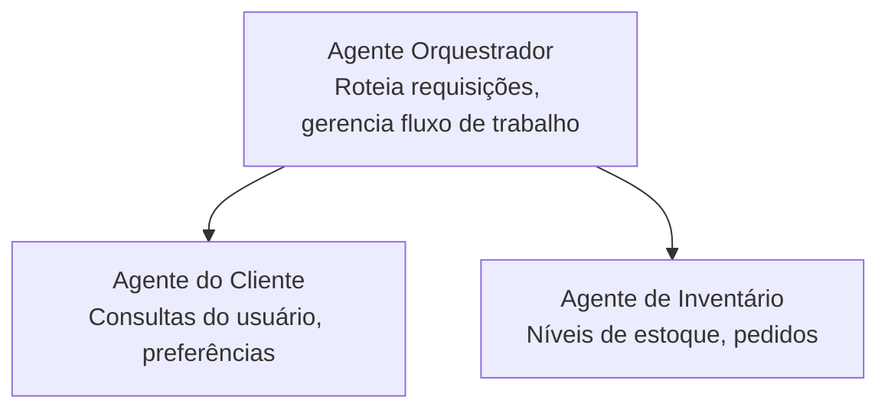

# Capítulo 5: Soluções de IA Multiagentes

**📚 Curso**: [AZD Para Iniciantes](../../README.md) | **⏱️ Duração**: 2-3 horas | **⭐ Complexidade**: Avançado

---

## Visão Geral

Este capítulo aborda padrões avançados de arquitetura multiagentes, orquestração de agentes e implantações de IA prontas para produção em cenários complexos.

> Validado contra `azd 1.27.1` em julho de 2026.

## Objetivos de Aprendizagem

Ao concluir este capítulo, você irá:
- Entender padrões de arquitetura multiagentes
- Implantar sistemas coordenados de agentes de IA
- Implementar comunicação entre agentes
- Construir soluções multiagentes prontas para produção

---

## 📚 Lições

| # | Lição | Descrição | Tempo |
|---|--------|-------------|------|
| 1 | [Noções Básicas Sobre Multiagentes](multi-agent-basics.md) | Prático: implante um app multiagente funcional com `azd up` | 45 min |
| 2 | [Padrões de Coordenação](../chapter-06-pre-deployment/coordination-patterns.md) | Estratégias de orquestração de agentes (continua no Capítulo 6) | 30 min |
| 3 | [Implantação com Template ARM](../../examples/retail-multiagent-arm-template/README.md) | Exemplo de implantação com um clique | 30 min |

> **Comece pela Lição 1.** É a única lição totalmente prática e implantável deste capítulo. A Lição 2 está no Capítulo 6 (é compartilhada com o planejamento pré-implantação), e a [Solução Multiagente para Varejo](../../examples/retail-scenario.md) é um modelo de arquitetura — uma referência de design, não um template de um só comando.

---

## 🚀 Início Rápido

```bash
# Opção 1: Implantar a partir de um modelo
azd init --template agent-openai-python-prompty
azd up

# Opção 2: Implantar a partir de um manifesto do agente (requer a extensão azure.ai.agents)
azd extension install azure.ai.agents
azd ai agent init -m agent-manifest.yaml
azd up
```

> **Qual abordagem?** Use `azd init --template` para iniciar a partir de um exemplo funcional. Use `azd ai agent init` quando você tiver o manifesto do seu próprio agente. Veja a [referência da CLI AZD AI](../chapter-08-production/production-ai-practices.md#azd-ai-cli-commands-and-extensions) para detalhes completos.

---

## 🤖 Arquitetura Multiagentes



---

## 🎯 Solução em Destaque: Multiagente para Varejo

A [Solução Multiagente para Varejo](../../examples/retail-scenario.md) demonstra:

- **Agente do Cliente**: Gerencia interações e preferências do usuário
- **Agente de Estoque**: Gerencia estoque e processamento de pedidos
- **Orquestrador**: Coordena entre os agentes
- **Memória Compartilhada**: Gerenciamento de contexto entre agentes

### Serviços Utilizados

| Serviço | Propósito |
|---------|---------|
| Microsoft Foundry Models | Compreensão de linguagem |
| Azure AI Search | Catálogo de produtos |
| Cosmos DB | Estado e memória dos agentes |
| Container Apps | Hospedagem dos agentes |
| Application Insights | Monitoramento |

---

## 🔗 Navegação

| Direção | Capítulo |
|-----------|---------|
| **Anterior** | [Capítulo 4: Infraestrutura](../chapter-04-infrastructure/README.md) |
| **Próximo** | [Capítulo 6: Pré-Implantação](../chapter-06-pre-deployment/README.md) |

---

## 📖 Recursos Relacionados

- [Guia de Agentes de IA](../chapter-02-ai-development/agents.md)
- [Práticas de IA para Produção](../chapter-08-production/production-ai-practices.md)
- [Solução de Problemas em IA](../chapter-07-troubleshooting/ai-troubleshooting.md)

---

<!-- CO-OP TRANSLATOR DISCLAIMER START -->
**Aviso Legal**:
Este documento foi traduzido usando o serviço de tradução por IA [Co-op Translator](https://github.com/Azure/co-op-translator). Embora nos esforcemos pela precisão, por favor, esteja ciente de que traduções automatizadas podem conter erros ou imprecisões. O documento original em seu idioma nativo deve ser considerado a fonte autorizada. Para informações críticas, recomenda-se tradução profissional humana. Não nos responsabilizamos por quaisquer mal-entendidos ou interpretações incorretas decorrentes do uso desta tradução.
<!-- CO-OP TRANSLATOR DISCLAIMER END -->