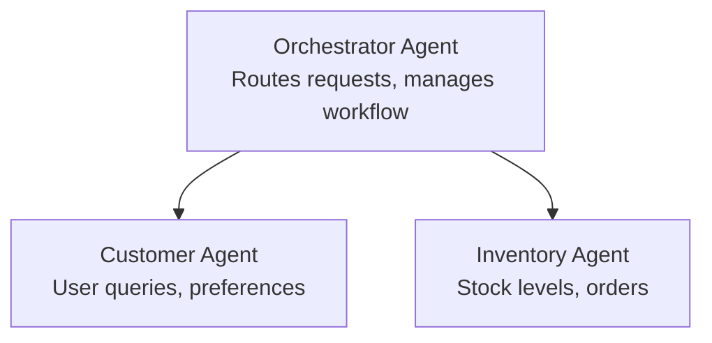

# Capítulo 5: Soluções de IA Multiagente

**📚 Curso**: [AZD Para Iniciantes](../../README.md) | **⏱️ Duração**: 2-3 horas | **⭐ Complexidade**: Avançado

---

## Visão Geral

Este capítulo aborda padrões avançados de arquitetura multiagente, orquestração de agentes e implantações de IA prontas para produção em cenários complexos.

> Orientação de comando revisada com base na referência `azd 1.37.2` lançada. Implantações em nuvem não foram executadas.

## Objetivos de Aprendizagem

Ao concluir este capítulo, você irá:
- Entender padrões de arquitetura multiagente
- Implantar sistemas coordenados de agentes de IA
- Implementar comunicação entre agentes
- Construir soluções multiagentes prontas para produção

---

## 📚 Lições

| # | Lição | Descrição | Tempo |
|---|--------|-------------|------|
| 1 | [Noções Básicas de Multiagente](multi-agent-basics.md) | Prática: implante um app multiagente funcional com `azd up` | 45 min |
| 2 | [Padrões de Coordenação](../chapter-06-pre-deployment/coordination-patterns.md) | Estratégias de orquestração de agentes (continua no Capítulo 6) | 30 min |
| 3 | [Implantação de Template ARM](../../examples/retail-multiagent-arm-template/README.md) | Exemplo de implantação com um clique | 30 min |

> **Comece pela Lição 1.** É a única lição totalmente prática e implantável neste capítulo. A Lição 2 está no Capítulo 6 (compartilhada com o planejamento pré-implantação), e a [Solução Multiagente de Varejo](../../examples/retail-scenario.md) é um blueprint de arquitetura — uma referência de design, não um template de um comando só.

---

## 🚀 Início Rápido

```bash
# Option 1: Deploy the multi-agent template used in Lesson 1
azd init --template Azure-Samples/contoso-creative-writer .
azd up

# Option 2: Initialize a Foundry agent interactively (requires azure.ai.agents)
azd extension install azure.ai.agents
azd ai agent init
azd up
```

> **Qual abordagem?** Use `azd init --template` para começar a partir de um exemplo funcional. Use `azd ai agent init` interativamente, ou `azd ai agent init --template <path-to-azure.yaml>` para adotar um projeto de agente atual. Veja a [referência AZD AI CLI](../chapter-08-production/production-ai-practices.md#azd-ai-cli-commands-and-extensions) para requisitos de versão e migração de avaliação.

Execute essas alternativas em pastas vazias e separadas. A extensão de agentes `1.0.0-beta.23` requer `azd >= 1.37.0`; seu fluxo interativo não gera o pipeline personalizado do Service Bus na lição de coordenação.

---

## 🤖 Arquitetura Multiagente


```mermaid
graph TD
    Orchestrator[Orchestrator Agent<br/>Routes requests, manages workflow] --> Customer[Customer Agent<br/>User queries, preferences]
    Orchestrator --> Inventory[Inventory Agent<br/>Stock levels, orders]
```

---

## 🎯 Solução em Destaque: Multiagente de Varejo

A [Solução Multiagente de Varejo](../../examples/retail-scenario.md) demonstra:

- **Agente Cliente**: Gerencia interações e preferências do usuário
- **Agente de Estoque**: Administra o estoque e o processamento de pedidos
- **Orquestrador**: Coordena entre os agentes
- **Memória Compartilhada**: Gestão do contexto entre agentes

### Serviços Utilizados

| Serviço | Propósito |
|---------|---------|
| Modelos Microsoft Foundry | Compreensão de linguagem |
| Azure AI Search | Catálogo de produtos |
| Cosmos DB | Estado e memória dos agentes |
| Container Apps | Hospedagem dos agentes |
| Application Insights | Monitoramento |

---

## 🔗 Navegação

| Direção | Capítulo |
|-----------|---------|
| **Anterior** | [Capítulo 4: Infraestrutura](../chapter-04-infrastructure/README.md) |
| **Próximo** | [Capítulo 6: Pré-Implantação](../chapter-06-pre-deployment/README.md) |

---

## 📖 Recursos Relacionados

- [Guia de Agentes de IA](../chapter-02-ai-development/agents.md)
- [Práticas de IA para Produção](../chapter-08-production/production-ai-practices.md)
- [Solução de Problemas de IA](../chapter-07-troubleshooting/ai-troubleshooting.md)

---

<!-- CO-OP TRANSLATOR DISCLAIMER START -->
**Aviso Legal**:
Este documento foi traduzido usando o serviço de tradução por IA [Co-op Translator](https://github.com/Azure/co-op-translator). Embora nos esforcemos pela precisão, por favor, esteja ciente de que traduções automatizadas podem conter erros ou imprecisões. O documento original em seu idioma nativo deve ser considerado a fonte autorizada. Para informações críticas, recomenda-se tradução profissional humana. Não nos responsabilizamos por quaisquer mal-entendidos ou interpretações incorretas decorrentes do uso desta tradução.
<!-- CO-OP TRANSLATOR DISCLAIMER END -->