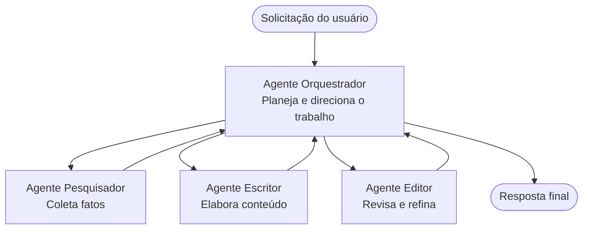

# Conceitos Básicos de Multi-Agentes - Implemente Seu Primeiro Sistema de IA Coordenado

**Navegação do Capítulo:**
- **📚 Início do Curso**: [AZD For Beginners](../../README.md)
- **📖 Capítulo Atual**: Capítulo 5 - Soluções de IA Multi-Agentes
- **⬅️ Anterior**: [Chapter 4: Infrastructure](../chapter-04-infrastructure/README.md)
- **➡️ Próximo**: [Coordination Patterns](../chapter-06-pre-deployment/coordination-patterns.md)

> Validado com `azd 1.25.6` em junho de 2026.

## Introdução

Nos capítulos anteriores você implantou uma única aplicação—e no Capítulo 2 você implantou um único agente de IA. Esta lição dá o próximo passo: implantar um **sistema multi-agente**, onde vários agentes especializados trabalham juntos para resolver um problema que nenhum agente sozinho poderia resolver bem.

A boa notícia para iniciantes: **você não precisa de comandos novos.** Uma solução multi-agente ainda é um projeto azd. Você vai `azd init`, `azd up`, testar e `azd down`—exatamente o fluxo de trabalho que você já conhece. O que muda é a *forma* do app internamente.

## Objetivos de Aprendizagem

Ao final desta lição, você irá:
- Entender o que "multi-agente" significa e quando vale a pena a complexidade extra
- Reconhecer os papéis comuns em um sistema multi-agente (orquestrador + especialistas)
- Implantar um template multi-agente real e funcional com `azd up`
- Entender os recursos do Azure que suportam um app multi-agente
- Saber como verificar, personalizar e desmontar a solução com segurança

## Resultados de Aprendizagem

Após completar esta lição, você será capaz de:
- Explicar a diferença entre um agente único e um sistema multi-agente
- Escolher entre um agente único com ferramentas e um verdadeiro design multi-agente
- Implantar e testar um template multi-agente de ponta a ponta com azd
- Identificar onde cada agente executa e como eles se comunicam
- Limpar todos os recursos para evitar cobranças contínuas

---

## O que é um Sistema Multi-Agente?

Um agente de IA único é um modelo com um conjunto de instruções e (opcionalmente) algumas ferramentas. Isso funciona bem para tarefas focadas. Mas conforme a tarefa cresce—pesquisa, depois escrita, depois edição, depois checagem de fatos—colocar tudo em um único prompt deixa o agente mais lento, menos confiável e mais difícil de depurar.

Um **sistema multi-agente** divide o trabalho em especialistas que cada um faz bem uma tarefa, coordenados por um orquestrador:



### Os dois papéis que você sempre verá

| Papel | Trabalho | Exemplo |
|------|-----|---------|
| **Orquestrador** | Decide *o que acontece a seguir* e direciona o trabalho entre agentes | "Primeiro pesquise, depois escreva, depois edite" |
| **Especialista** | Realiza uma tarefa focada e retorna um resultado | Um "pesquisador" que apenas coleta fatos |

### Você realmente precisa de vários agentes?

Comece simples. Use multi-agente **apenas** quando uma destas condições for verdadeira:

- ✅ A tarefa tem **estágios distintos** que se beneficiam de instruções diferentes (pesquisar vs. escrever vs. revisar)
- ✅ Você quer que especialistas executem **em paralelo** para economizar tempo
- ✅ Passos diferentes precisam de **ferramentas ou fontes de dados diferentes**
- ✅ Você precisa que cada passo seja **testável e depurável de forma independente**

Se sua tarefa é uma única pergunta e resposta ou uma simples chamada de ferramenta, um **agente único com ferramentas** (Capítulo 2) é mais simples, barato e fácil de operar.

> **Dica para iniciantes:** "Mais agentes" não é "melhor." Cada agente adiciona latência, custo e um novo item para monitorar. Adicione agentes somente quando o problema claramente se divide em partes.

---

## Duas formas de construir Multi-Agente no Azure

| Abordagem | O que é | Melhor para |
|----------|-----------|----------|
| **Agente único + ferramentas** | Um agente Foundry que chama funções/ferramentas | Fluxos simples, para começar |
| **Múltiplos agentes coordenados** | Vários agentes com um orquestrador | Etapas distintas, trabalho em paralelo, especialização |

Esta lição foca na segunda abordagem usando um **template pronto**, para que você possa ver um sistema multi-agente real em execução antes de construir o seu próprio.

---

## Prático: Implemente um Aplicativo Multi-Agente Funcional

Vamos implantar o **Contoso Creative Writer**, um sample oficial do Azure que usa múltiplos agentes (pesquisador, escritor, editor) coordenados para produzir um artigo. É um ótimo primeiro app multi-agente porque os papéis são fáceis de entender.

### Passo 1: Inicialize o template

```bash
# Crie uma pasta de trabalho
mkdir creative-writer && cd creative-writer

# Inicialize a partir do modelo oficial multiagente
azd init --template contoso-creative-writer
```

> Explore mais templates multi-agente a qualquer momento na [Awesome AZD AI gallery](https://azure.github.io/awesome-azd/?tags=ai). Outras opções amigáveis para iniciantes incluem `get-started-with-ai-agents` e `azure-ai-travel-agents`.

### Passo 2: Autentique-se

```bash
# Obrigatório para fluxos de trabalho azd
azd auth login
```

### Passo 3: Crie um ambiente

```bash
azd env new dev
```

### Passo 4: Pré-visualize e então implante

```bash
# Veja o que será criado antes de gastar qualquer coisa (recomendado)
azd provision --preview

# Provisionar a infraestrutura e implantar todos os agentes em uma única etapa
azd up
```

`azd up` solicitará uma assinatura e região, então provisionará os recursos do Azure e implatará a aplicação. Implantações de IA podem levar mais tempo do que um app web simples—se você estiver implantando modelos maiores, pode estender o timeout de implantação:

```bash
azd deploy --timeout 1800
```

> **Aviso sobre custo e capacidade:** Aplicativos multi-agente implantam modelos de IA que consomem cota e geram custo. Se `azd up` falhar por cota de modelo, veja [AI Troubleshooting](../chapter-07-troubleshooting/ai-troubleshooting.md) para correções de região e cota, e o Capítulo 6 [Capacity Planning](../chapter-06-pre-deployment/capacity-planning.md).

---

## Entendendo o que você implantou

Um app multi-agente típico como este provisiona um conjunto de recursos do Azure que mapeiam diretamente para as responsabilidades no diagrama acima:

| Recurso | Por que ele existe |
|----------|----------------|
| **Microsoft Foundry / Models** | Hospeda os modelos de linguagem que cada agente usa |
| **Azure AI Search** | Dá ao agente pesquisador dados fundamentados para buscar |
| **Container Apps** (ou App Service) | Hospeda o orquestrador e o código dos agentes |
| **Cosmos DB** (em alguns exemplos) | Armazena estado/memória compartilhada passada entre agentes |
| **Application Insights** | Rastreia requisições *entre* agentes para que você possa depurar o fluxo |

### Como os agentes se comunicam entre si

Na maioria dos samples azd multi-agente, o **orquestrador roda no código da sua aplicação** (por exemplo, usando um framework como Semantic Kernel ou o Microsoft Agent Framework). O orquestrador chama cada agente especialista em sequência, passa os resultados adiante e monta a resposta final. Os agentes compartilham contexto através de:

- **Chamadas de função/ferramenta** — o orquestrador invoca um especialista e recebe um resultado de volta
- **Memória compartilhada** — um banco de dados (frequentemente Cosmos DB) mantém estado que ambos os agentes podem ler
- **Mensagens/eventos** — para acoplamento mais solto, agentes se comunicam via fila ou Service Bus

> **Por que isso importa para depuração:** como cada passo é separado, o Application Insights mostra *qual* agente foi lento ou falhou. Essa é uma razão principal para dividir o trabalho entre agentes.

---

## Verifique a Implantação

Confirme que o sistema está realmente funcionando antes de prosseguir:

```bash
# Mostrar os endpoints implantados
azd show

# Abrir o painel de monitoramento do aplicativo
azd monitor

# Acompanhar os logs se algo parecer errado
azd monitor --logs
```

Em seguida, abra a URL do app a partir de `azd show` e tente uma requisição que exercite todos os agentes (para o Creative Writer, peça para escrever um artigo curto sobre um tópico). Na **pesquisa de transações** do Application Insights, você deverá ver a requisição se desdobrar pelos passos de pesquisador, escritor e editor.

**Critérios de sucesso:**
- ✅ `azd show` lista um endpoint acessível
- ✅ Uma requisição produz um resultado que claramente passou por múltiplos estágios
- ✅ O Application Insights mostra traces de mais de um passo de agente

---

## Personalizar: Adicione ou Ajuste um Agente

Porque cada agente é apenas instruções mais ferramentas, personalizar é acessível:

1. **Encontre as definições do agente** no template (frequentemente um conjunto de arquivos `prompts/`, `agents/`, ou `*.prompty`).
2. **Ajuste as instruções de um agente** — por exemplo, diga ao agente editor para aplicar um tom específico ou uma contagem de palavras.
3. **Reimplemente apenas o código** (a infraestrutura permanece inalterada):

   ```bash
   azd deploy
   ```

Para ir além e construir agentes a partir do seu *próprio* manifesto, use a extensão de agentes e seu ciclo de vida completo:

```bash
azd extension install azure.ai.agents
azd ai agent init -m agent-manifest.yaml
azd up
azd ai agent invoke      # teste, com tempo de resposta
```

Veja [Chapter 2: Agents](../chapter-02-ai-development/agents.md) e a [AZD AI CLI reference](../chapter-08-production/production-ai-practices.md#azd-ai-cli-commands-and-extensions) para o ciclo de vida completo do agente (`invoke`, `eval generate`, `optimize`, `delete`).

---

## Limpeza

Aplicativos multi-agente executam vários serviços faturáveis. Destrua tudo quando terminar:

```bash
azd down --force --purge
```

A flag `--purge` também remove recursos de IA excluídos de forma suave (como contas do Foundry/Azure AI Services) para que eles não impeçam um redeploy futuro ou continuem gerando custo.

---

## Uma nota sobre Sistemas Multi-Agente em Produção

O [Retail Multi-Agent Solution](../../examples/retail-scenario.md) neste repositório é um **blueprint de arquitetura**, não um template de um comando—ele documenta como um sistema de varejo em produção *seria* construído (e deixa explícito que uma construção completa é um esforço substancial). Use-o como referência de design *depois* de ter implantado um sample funcional aqui. Para preocupações de produção (resiliência, custo, monitoramento, governança), continue para o [Capítulo 8: Production AI Practices](../chapter-08-production/production-ai-practices.md).

---

## Resumo

- Um sistema multi-agente divide o trabalho entre especialistas coordenados por um orquestrador.
- Use-o somente quando a tarefa tiver estágios distintos, paralelismo ou diferentes ferramentas por etapa—caso contrário, prefira um agente único.
- O fluxo de trabalho azd é inalterado: `azd init` → `azd up` → test → `azd down`.
- Um template real como `contoso-creative-writer` permite ver e customizar um app multi-agente funcional hoje.
- O rastreamento do Application Insights entre agentes é um dos maiores benefícios práticos do design multi-agente.

---

## 🔗 Navegação

| Direção | Lição |
|-----------|--------|
| **Anterior** | [Chapter 4: Infrastructure](../chapter-04-infrastructure/README.md) |
| **Próximo** | [Coordination Patterns](../chapter-06-pre-deployment/coordination-patterns.md) |

## 📖 Recursos Relacionados

- [AI Agents Guide](../chapter-02-ai-development/agents.md)
- [Coordination Patterns](../chapter-06-pre-deployment/coordination-patterns.md)
- [Production AI Practices](../chapter-08-production/production-ai-practices.md)
- [AI Troubleshooting](../chapter-07-troubleshooting/ai-troubleshooting.md)

---

<!-- CO-OP TRANSLATOR DISCLAIMER START -->
**Aviso Legal**:
Este documento foi traduzido usando o serviço de tradução por IA [Co-op Translator](https://github.com/Azure/co-op-translator). Embora nos esforcemos pela precisão, por favor, esteja ciente de que traduções automatizadas podem conter erros ou imprecisões. O documento original em seu idioma nativo deve ser considerado a fonte autorizada. Para informações críticas, recomenda-se tradução profissional humana. Não nos responsabilizamos por quaisquer mal-entendidos ou interpretações incorretas decorrentes do uso desta tradução.
<!-- CO-OP TRANSLATOR DISCLAIMER END -->