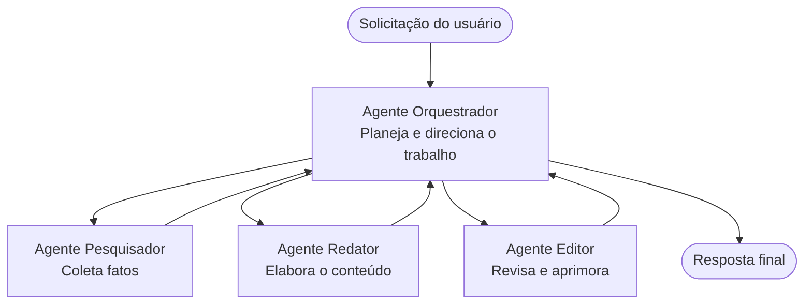

# Noções Básicas de Multi-Agentes - Implante Seu Primeiro Sistema de IA Coordenado

**Navegação pelo Capítulo:**
- **📚 Página Inicial do Curso**: [AZD Para Iniciantes](../../README.md)
- **📖 Capítulo Atual**: Capítulo 5 - Soluções de IA Multi-Agente
- **⬅️ Anterior**: [Capítulo 4: Infraestrutura](../chapter-04-infrastructure/README.md)
- **➡️ Próximo**: [Padrões de Coordenação](../chapter-06-pre-deployment/coordination-patterns.md)

> Validado com `azd 1.27.1` em julho de 2026.

## Introdução

Nos capítulos anteriores, você implantou uma única aplicação—e no Capítulo 2 você implantou um único agente de IA. Esta lição dá o próximo passo: implantar um **sistema multi-agente**, onde vários agentes especializados trabalham juntos para resolver um problema que um único agente não conseguiria manejar bem sozinho.

A boa notícia para iniciantes: **você não precisa de comandos novos.** Uma solução multi-agente ainda é um projeto azd. Você fará `azd init`, `azd up`, testará e depois `azd down`—exatamente o fluxo de trabalho que já conhece. O que muda é o *formato* do app internamente.

## Objetivos de Aprendizado

Ao final desta lição, você irá:
- Entender o que significa "multi-agente" e quando vale a pena a complexidade extra
- Reconhecer os papéis comuns em um sistema multi-agente (orquestrador + especialistas)
- Implantar um modelo real e funcional multi-agente com `azd up`
- Compreender os recursos do Azure que suportam um app multi-agente
- Saber como verificar, personalizar e desmontar a solução com segurança

## Resultados de Aprendizagem

Após completar esta lição, você será capaz de:
- Explicar a diferença entre um único agente e um sistema multi-agente
- Escolher entre um agente único com ferramentas e um design multi-agente real
- Implantar e testar um modelo multi-agente de ponta a ponta com azd
- Identificar onde cada agente é executado e como eles se comunicam
- Limpar todos os recursos para evitar cobranças contínuas

---

## O Que É um Sistema Multi-Agente?

Um único agente de IA é um modelo com um conjunto de instruções e (opcionalmente) algumas ferramentas. Isso funciona bem para tarefas focadas. Mas, conforme a tarefa cresce—pesquisa, depois escrita, depois edição, depois verificação de fatos—colocar tudo em um único prompt torna o agente mais lento, menos confiável e mais difícil de depurar.

Um **sistema multi-agente** divide o trabalho entre especialistas que fazem cada um uma função bem feita, coordenados por um orquestrador:



### Os dois papéis que você sempre verá

| Papel | Função | Exemplo |
|------|--------|---------|
| **Orquestrador** | Decide *o que acontece em seguida* e distribui o trabalho entre os agentes | "Primeiro pesquisa, depois escreve, depois edita" |
| **Especialista** | Faz um trabalho focado e entrega um resultado | Um "pesquisador" que só coleta fatos |

### Você realmente precisa de múltiplos agentes?

Comece simples. Use multi-agente **apenas** quando uma destas condições for verdadeira:

- ✅ A tarefa tem **etapas distintas** que se beneficiam de instruções diferentes (pesquisa vs. escrita vs. revisão)
- ✅ Você quer que especialistas rodem **em paralelo** para economizar tempo
- ✅ Etapas diferentes precisam de **ferramentas ou fontes de dados diferentes**
- ✅ Você precisa que cada etapa seja **testável e depurável independentemente**

Se sua tarefa for uma única pergunta e resposta ou uma simples chamada de ferramenta, um **agente único com ferramentas** (Capítulo 2) é mais simples, barato e fácil de operar.

> **Dica para iniciantes:** "Mais agentes" não significa "melhor." Cada agente adiciona latência, custo e um novo item para monitorar. Adicione agentes somente quando o problema dividir claramente em partes.

---

## Duas Formas de Construir Multi-Agente no Azure

| Abordagem | O que é | Melhor para |
|----------|---------|------------|
| **Agente único + ferramentas** | Um agente Foundry que chama funções/ferramentas | Fluxos simples, primeiros passos |
| **Múltiplos agentes coordenados** | Vários agentes com um orquestrador | Etapas distintas, trabalho paralelo, especialização |

Esta lição foca na segunda abordagem usando um **modelo pronto**, para que você veja um sistema multi-agente real funcionando antes de construir o seu próprio.

---

## Prática: Implante um App Multi-Agente Funcional

Vamos implantar o **Contoso Creative Writer**, um exemplo oficial do Azure que usa múltiplos agentes (pesquisador, escritor, editor) coordenados para produzir um artigo. É um ótimo primeiro app multi-agente porque os papéis são fáceis de entender.

### Passo 1: Inicialize o modelo

```bash
# Criar uma pasta de trabalho
mkdir creative-writer && cd creative-writer

# Inicializar a partir do modelo oficial multiagente
azd init --template contoso-creative-writer
```

> Explore mais modelos multi-agente a qualquer momento na [galeria Awesome AZD AI](https://azure.github.io/awesome-azd/?tags=ai). Outras opções amigáveis para iniciantes incluem `get-started-with-ai-agents` e `azure-ai-travel-agents`.

### Passo 2: Autentique-se

```bash
# Necessário para fluxos de trabalho azd
azd auth login
```

### Passo 3: Crie um ambiente

```bash
azd env new dev
```

### Passo 4: Visualize e depois implante

```bash
# Veja o que será criado antes de gastar qualquer coisa (recomendado)
azd provision --preview

# Provisionar a infraestrutura e implantar todos os agentes em um único passo
azd up
```

`azd up` vai pedir uma assinatura e região, depois provisionar os recursos Azure e implantar a aplicação. Implantações de IA podem levar mais tempo que um app web simples—se estiver implantando modelos maiores, você pode estender o tempo limite de implantação:

```bash
azd deploy --timeout 1800
```

> **Aviso sobre custo e capacidade:** Apps multi-agente implantam modelos de IA que consomem cota e geram custo. Se `azd up` falhar por cota de modelo, veja [Resolução de Problemas de IA](../chapter-07-troubleshooting/ai-troubleshooting.md) para correções de região e cota, e o Capítulo 6 [Planejamento de Capacidade](../chapter-06-pre-deployment/capacity-planning.md).

---

## Entendendo o Que Você Implantou

Um app típico multi-agente como este provisiona um conjunto de recursos Azure que correspondem diretamente às responsabilidades do diagrama acima:

| Recurso | Por que está lá |
|---------|-----------------|
| **Microsoft Foundry / Modelos** | Hospeda os modelos de linguagem usados por cada agente |
| **Azure AI Search** | Dá ao agente pesquisador dados fundamentados para pesquisar |
| **Container Apps** (ou App Service) | Hospeda o orquestrador e o código dos agentes |
| **Cosmos DB** (em alguns exemplos) | Armazena o estado/memória compartilhada passada entre os agentes |
| **Application Insights** | Rastreia requisições *entre* agentes para facilitar a depuração do fluxo |

### Como os agentes se comunicam

Na maioria dos exemplos azd multi-agente, o **orquestrador roda no código da aplicação** (por exemplo, usando um framework como Semantic Kernel ou o Microsoft Agent Framework). O orquestrador chama cada agente especialista por vez, passa os resultados adiante e monta a resposta final. Os agentes compartilham contexto via:

- **Chamadas de função/ferramenta** — o orquestrador invoca um especialista e recebe um resultado de volta
- **Memória compartilhada** — um banco de dados (geralmente Cosmos DB) mantém estado que ambos os agentes podem ler
- **Mensagens/eventos** — para menor acoplamento, agentes se comunicam via fila ou Service Bus

> **Por que isso importa para depuração:** como cada etapa é separada, o Application Insights mostra *qual* agente foi lento ou falhou. Essa é uma das maiores razões para dividir o trabalho em agentes.

---

## Verifique a Implantação

Confirme que o sistema realmente está funcionando antes de prosseguir:

```bash
# Mostrar os endpoints implantados
azd show

# Abrir o painel de monitoramento do aplicativo
azd monitor

# Visualizar logs em tempo real se algo parecer errado
azd monitor --logs
```

Depois abra a URL do app de `azd show` e tente uma requisição que envolva todos os agentes (para o Creative Writer, peça para escrever um artigo curto sobre um tema). Na busca de transações do Application Insights, você deve ver a requisição se ramificando pelas etapas pesquisador, escritor e editor.

**Critérios de sucesso:**
- ✅ `azd show` lista um endpoint acessível
- ✅ Uma requisição produz um resultado que claramente passou por múltiplas etapas
- ✅ Application Insights mostra rastreamentos para mais de uma etapa de agente

---

## Personalize: Adicione ou Ajuste um Agente

Como cada agente é só instruções mais ferramentas, personalizar é acessível:

1. **Encontre as definições dos agentes** no modelo (frequentemente numa pasta `prompts/`, `agents/` ou arquivos `*.prompty`).
2. **Ajuste as instruções de um agente** — por exemplo, diga ao agente editor para usar um tom ou número específico de palavras.
3. **Reimplante apenas o código** (a infraestrutura fica inalterada):

   ```bash
   azd deploy
   ```

Para avançar e construir agentes a partir do *seu* manifesto, use a extensão de agentes e seu ciclo de vida completo:

```bash
azd extension install azure.ai.agents
azd ai agent init -m agent-manifest.yaml
azd up
azd ai agent invoke      # teste, com tempo de resposta
```

Veja o [Capítulo 2: Agentes](../chapter-02-ai-development/agents.md) e a [referência do AZD AI CLI](../chapter-08-production/production-ai-practices.md#azd-ai-cli-commands-and-extensions) para o ciclo de vida completo dos agentes (`invoke`, `eval generate`, `optimize`, `delete`).

---

## Limpeza

Apps multi-agente executam múltiplos serviços faturáveis. Desmonte tudo quando terminar:

```bash
azd down --force --purge
```

A flag `--purge` também remove recursos de IA excluídos soft (como Foundry/contas do Azure AI Services) para que não bloqueiem uma futura reimplantação nem continuem gerando custo.

---

## Uma Nota sobre Sistemas Multi-Agente em Produção

A [Solução Multi-Agente para Varejo](../../examples/retail-scenario.md) neste repositório é um **modelo arquitetural**, não um modelo de um comando só—documenta como um sistema de varejo em produção *seria* construído (e deixa claro que uma construção completa é um esforço substancial). Use-o como referência de design *após* implantar um exemplo funcional aqui. Para preocupações de produção (resiliência, custo, monitoramento, governança), continue para o [Capítulo 8: Práticas de IA em Produção](../chapter-08-production/production-ai-practices.md).

---

## Resumo

- Um sistema multi-agente divide o trabalho entre especialistas coordenados por um orquestrador.
- Use o sistema apenas quando a tarefa tiver etapas distintas, paralelismo ou ferramentas diferentes por etapa—caso contrário, prefira um agente único.
- O fluxo de trabalho azd não muda: `azd init` → `azd up` → teste → `azd down`.
- Um modelo real como o `contoso-creative-writer` permite que você visualize e personalize um app multi-agente funcional hoje.
- O rastreamento do Application Insights entre agentes é um dos maiores benefícios práticos do design multi-agente.

---

## 🔗 Navegação

| Direção | Lição |
|--------|-------|
| **Anterior** | [Capítulo 4: Infraestrutura](../chapter-04-infrastructure/README.md) |
| **Próximo** | [Padrões de Coordenação](../chapter-06-pre-deployment/coordination-patterns.md) |

## 📖 Recursos Relacionados

- [Guia de Agentes de IA](../chapter-02-ai-development/agents.md)
- [Padrões de Coordenação](../chapter-06-pre-deployment/coordination-patterns.md)
- [Práticas de IA em Produção](../chapter-08-production/production-ai-practices.md)
- [Resolução de Problemas de IA](../chapter-07-troubleshooting/ai-troubleshooting.md)

---

<!-- CO-OP TRANSLATOR DISCLAIMER START -->
**Aviso Legal**:
Este documento foi traduzido usando o serviço de tradução por IA [Co-op Translator](https://github.com/Azure/co-op-translator). Embora nos esforcemos pela precisão, por favor, esteja ciente de que traduções automatizadas podem conter erros ou imprecisões. O documento original em seu idioma nativo deve ser considerado a fonte autorizada. Para informações críticas, recomenda-se tradução profissional humana. Não nos responsabilizamos por quaisquer mal-entendidos ou interpretações incorretas decorrentes do uso desta tradução.
<!-- CO-OP TRANSLATOR DISCLAIMER END -->