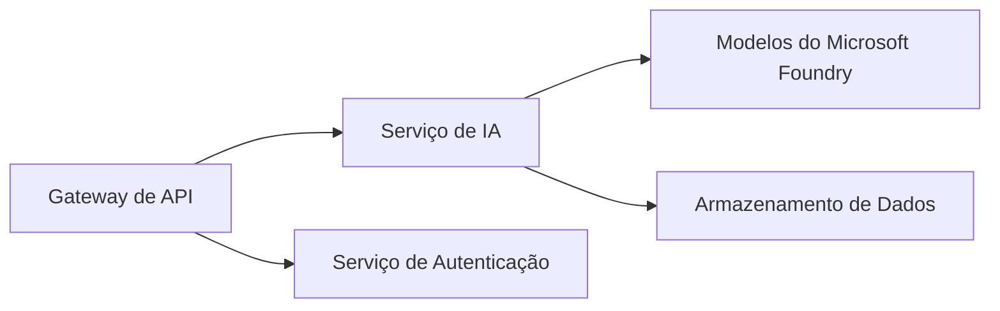
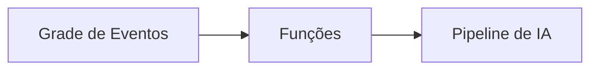

# Capítulo 8: Padrões de Produção e Empresariais

**📚 Curso**: [AZD For Beginners](../../README.md) | **⏱️ Duração**: 2-3 horas | **⭐ Complexidade**: Avançado

---

## Visão Geral

Este capítulo aborda padrões de implantação prontos para empresas, fortalecimento de segurança, monitoramento e otimização de custos para cargas de trabalho de IA em produção.

## Objetivos de Aprendizagem

Ao concluir este capítulo, você:
- Implantar aplicações resilientes em múltiplas regiões
- Implementar padrões de segurança empresariais
- Configurar monitoramento abrangente
- Otimizar custos em larga escala
- Configurar pipelines CI/CD com AZD

---

## 📚 Lessons

| # | Lesson | Description | Time |
|---|--------|-------------|------|
| 1 | [Production AI Practices](production-ai-practices.md) | Enterprise deployment patterns | 90 min |

---

## 🚀 Checklist de Produção

- [ ] Implantação multi-região para resiliência
- [ ] Identidade gerenciada para autenticação (sem chaves)
- [ ] Application Insights para monitoramento
- [ ] Orçamentos de custos e alertas configurados
- [ ] Escaneamento de segurança ativado
- [ ] Integração com pipeline CI/CD
- [ ] Plano de recuperação de desastres

---

## 🏗️ Padrões de Arquitetura

### Padrão 1: Microsserviços de IA


### Padrão 2: IA Orientada a Eventos


---

## 🔐 Melhores Práticas de Segurança

```bicep
// Use managed identity
identity: {
  type: 'SystemAssigned'
}

// Private endpoints for AI services
properties: {
  publicNetworkAccess: 'Disabled'
  networkAcls: {
    defaultAction: 'Deny'
  }
}
```

---

## 💰 Otimização de Custos

| Strategy | Savings |
|----------|---------|
| Escalonar para zero (Container Apps) | 60-80% |
| Usar níveis de consumo para dev | 50-70% |
| Escalonamento agendado | 30-50% |
| Capacidade reservada | 20-40% |

```bash
# Definir alertas de orçamento
az consumption budget create \
  --budget-name "AI-Budget" \
  --amount 500 \
  --category Cost \
  --time-grain Monthly
```

---

## 📊 Configuração de Monitoramento

```bash
# Transmitir logs
azd monitor --logs

# Verificar o Application Insights
azd monitor

# Visualizar métricas
az monitor metrics list --resource <resource-id>
```

---

## 🔗 Navegação

| Direction | Chapter |
|-----------|---------|
| **Anterior** | [Chapter 7: Troubleshooting](../chapter-07-troubleshooting/README.md) |
| **Curso Concluído** | [Início do Curso](../../README.md) |

---

## 📖 Recursos Relacionados

- [Guia de Agentes de IA](../chapter-02-ai-development/agents.md)
- [Application Insights](../chapter-06-pre-deployment/application-insights.md)
- [Soluções Multi-Agente](../chapter-05-multi-agent/README.md)
- [Exemplo de Microsserviços](../../examples/microservices/README.md)

---

<!-- CO-OP TRANSLATOR DISCLAIMER START -->
**Isenção de responsabilidade**:
Este documento foi traduzido usando o serviço de tradução por IA [Co-op Translator](https://github.com/Azure/co-op-translator). Embora nos esforcemos pela precisão, esteja ciente de que traduções automatizadas podem conter erros ou imprecisões. O documento original em seu idioma nativo deve ser considerado a fonte autorizada. Para informações críticas, recomenda-se tradução profissional humana. Não nos responsabilizamos por quaisquer mal-entendidos ou interpretações equivocadas decorrentes do uso desta tradução.
<!-- CO-OP TRANSLATOR DISCLAIMER END -->