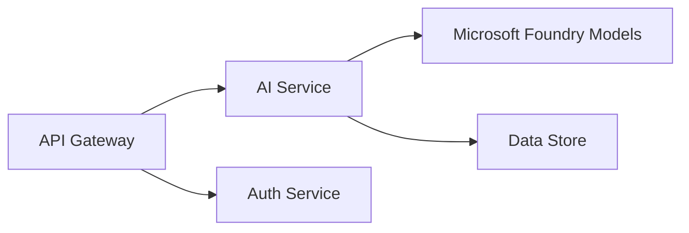
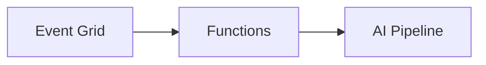

# Capítulo 8: Padrões de Produção e Empresariais

**📚 Curso**: [AZD Para Iniciantes](../../README.md) | **⏱️ Duração**: 2-3 horas | **⭐ Complexidade**: Avançado

---

## Visão Geral

Este capítulo cobre padrões de implantação prontos para empresas, fortalecimento de segurança, monitoramento e otimização de custos para cargas de trabalho de IA em produção.

Este é um referencial arquitetônico, não um modelo completo implantável em produção. Os exemplos omitem detalhes de integração que devem ser fornecidos e testados em sua própria aplicação; a leitura da lista de verificação não certifica prontidão para produção.

> **Atualização Foundry GA (2026-11-09):** Use `azd >= 1.37.0` e o pacote geral disponível `microsoft.foundry` 1.0 para o fluxo de trabalho Foundry; avaliações são instaladas separadamente. Veja [escopo de lançamento e migração](production-ai-practices.md#recent-release-changes-and-fixes) e o [exemplo de pipeline autenticado](production-ai-practices.md#cicd-pipeline-configuration). Esta é uma revisão de documentação, não uma validação de implantação ao vivo ou status geral GA para recursos opcionais em pré-visualização.

## Objetivos de Aprendizagem

Ao concluir este capítulo, você irá:
- Implantar aplicações resilientes em múltiplas regiões
- Implementar padrões de segurança empresarial
- Configurar monitoramento abrangente
- Otimizar custos em escala
- Configurar pipelines CI/CD com AZD

---

## 📚 Lições

| # | Lição | Descrição | Tempo |
|---|--------|-------------|------|
| 1 | [Práticas de IA em Produção](production-ai-practices.md) | Padrões de implantação empresarial | 90 min |

---

## 🚀 Checklist de Produção

- [ ] Implantação multi-região para resiliência
- [ ] Identidade gerenciada para autenticação (sem chaves)
- [ ] Application Insights para monitoramento
- [ ] Orçamentos de custo e alertas configurados
- [ ] Varredura de segurança ativada
- [ ] Integração de pipeline CI/CD
- [ ] Plano de recuperação de desastre

---

## 🏗️ Padrões Arquiteturais

### Padrão 1: IA com Microserviços


```mermaid
graph LR
    Gateway[API Gateway] --> AI[AI Service] --> Models[Microsoft Foundry Models]
    Gateway --> Auth[Auth Service]
    AI --> Data[Data Store]
```

### Padrão 2: IA Orientada a Eventos


```mermaid
graph LR
    EventGrid[Event Grid] --> Functions[Functions] --> Pipeline[AI Pipeline]
```

---

## 🔐 Melhores Práticas de Segurança

```bicep
// Illustrative properties from different resources, NOT a standalone Bicep file.
// Attach identity to the application host:
identity: {
  type: 'SystemAssigned'
}

// AI account properties (also require private endpoints, DNS and app connectivity):
properties: {
  publicNetworkAccess: 'Disabled'
  networkAcls: {
    defaultAction: 'Deny'
  }
}
```

---

## 💰 Otimização de Custos

| Estratégia | Principal Restrição |
|----------|---------|
| Escalonar para zero (Container Apps) | Requer um gatilho adequado; outros serviços ainda geram custos |
| Usar níveis de consumo para dev | Compare preços do serviço selecionado e carga de trabalho |
| Escalonamento programado | Escale por infraestrutura/automação suportada |
| Reservas/capacidade provisionada | Apenas quando suportado; compromissos podem aumentar custos ociosos |

Use o [padrão completo de recurso de orçamento](production-ai-practices.md#2-cost-monitoring-and-budgets) com data de início válida, escopo de cobrança, destinatários e permissões. Um orçamento envia alertas; não limita gastos. Economia depende da utilização medida e não é garantia percentual.

---

## 📊 Configuração de Monitoramento

```bash
# Open the Application Insights logs view (requires configured monitoring)
azd monitor --logs

# Check Application Insights
azd monitor --overview

# View metrics
az monitor metrics list --resource <resource-id>
```

---

## 🔗 Navegação

| Direção | Capítulo |
|-----------|---------|
| **Anterior** | [Capítulo 7: Solução de Problemas](../chapter-07-troubleshooting/README.md) |
| **Curso Completo** | [Página Inicial do Curso](../../README.md) |

---

## 📖 Recursos Relacionados

- [Guia de Agentes de IA](../chapter-02-ai-development/agents.md)
- [Application Insights](../chapter-06-pre-deployment/application-insights.md)
- [Soluções Multi-Agentes](../chapter-05-multi-agent/README.md)
- [Exemplo de Microserviços](../../examples/microservices/README.md)

---

<!-- CO-OP TRANSLATOR DISCLAIMER START -->
**Aviso Legal**:
Este documento foi traduzido usando o serviço de tradução por IA [Co-op Translator](https://github.com/Azure/co-op-translator). Embora nos esforcemos pela precisão, por favor, esteja ciente de que traduções automatizadas podem conter erros ou imprecisões. O documento original em seu idioma nativo deve ser considerado a fonte autorizada. Para informações críticas, recomenda-se tradução profissional humana. Não nos responsabilizamos por quaisquer mal-entendidos ou interpretações incorretas decorrentes do uso desta tradução.
<!-- CO-OP TRANSLATOR DISCLAIMER END -->