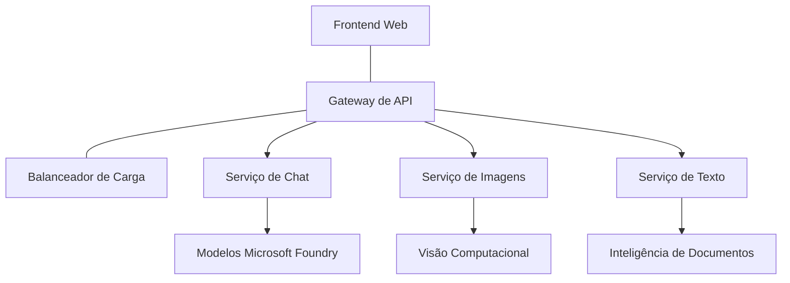

# Práticas recomendadas para cargas de trabalho de IA em Produção com AZD

**Navegação do Capítulo:**
- **📚 Início do Curso**: [AZD For Beginners](../../README.md)
- **📖 Capítulo Atual**: Capítulo 8 - Padrões de Produção & Empresa
- **⬅️ Capítulo Anterior**: [Capítulo 7: Solução de Problemas](../chapter-07-troubleshooting/debugging.md)
- **⬅️ Também Relacionado**: [AI Workshop Lab](ai-workshop-lab.md)
- **🎯 Curso Completo**: [AZD For Beginners](../../README.md)

## Visão Geral

Este guia fornece práticas recomendadas abrangentes para implantar cargas de trabalho de IA prontas para produção usando o Azure Developer CLI (AZD). Com base no feedback da comunidade Microsoft Foundry Discord e em implantações de clientes do mundo real, essas práticas abordam os desafios mais comuns em sistemas de IA em produção.

## Principais Desafios Abordados

Com base nos resultados da nossa pesquisa comunitária, estes são os principais desafios que os desenvolvedores enfrentam:

- **45%** têm dificuldades com implantações de IA multi-serviço
- **38%** enfrentam problemas com gerenciamento de credenciais e segredos  
- **35%** acham difícil a prontidão para produção e escalabilidade
- **32%** precisam de melhores estratégias de otimização de custos
- **29%** requerem monitoramento e solução de problemas aprimorados

## Padrões de Arquitetura para IA em Produção

### Padrão 1: Arquitetura de IA em Microserviços

**Quando usar**: Aplicações de IA complexas com múltiplas capacidades



**Implementação com AZD**:

```yaml
# azure.yaml
name: enterprise-ai-platform
services:
  web:
    project: ./web
    host: staticwebapp
  api-gateway:
    project: ./api-gateway
    host: containerapp
  chat-service:
    project: ./services/chat
    host: containerapp
  vision-service:
    project: ./services/vision
    host: containerapp
  text-service:
    project: ./services/text
    host: containerapp
```

### Padrão 2: Processamento de IA Orientado a Eventos

**Quando usar**: Processamento em lote, análise de documentos, fluxos de trabalho assíncronos

```bicep
// Event Hub for AI processing pipeline
resource eventHub 'Microsoft.EventHub/namespaces@2023-01-01-preview' = {
  name: eventHubNamespaceName
  location: location
  sku: {
    name: 'Standard'
    tier: 'Standard'
    capacity: 1
  }
}

// Service Bus for reliable message processing
resource serviceBus 'Microsoft.ServiceBus/namespaces@2022-10-01-preview' = {
  name: serviceBusNamespaceName
  location: location
  sku: {
    name: 'Premium'
    tier: 'Premium'
    capacity: 1
  }
}

// Function App for processing
resource functionApp 'Microsoft.Web/sites@2023-01-01' = {
  name: functionAppName
  location: location
  kind: 'functionapp,linux'
  properties: {
    siteConfig: {
      appSettings: [
        {
          name: 'FUNCTIONS_EXTENSION_VERSION'
          value: '~4'
        }
        {
          name: 'AZURE_OPENAI_ENDPOINT'
          value: '@Microsoft.KeyVault(VaultName=${keyVault.name};SecretName=openai-endpoint)'
        }
      ]
    }
  }
}
```

## Pensando sobre a Saúde do Agente de IA

Quando um aplicativo web tradicional quebra, os sintomas são familiares: uma página não carrega, uma API retorna um erro ou uma implantação falha. Aplicações com IA podem quebrar de todas essas mesmas maneiras — mas também podem se comportar de forma inadequada de maneiras mais sutis que não produzem mensagens de erro óbvias.

Esta seção ajuda você a construir um modelo mental para monitorar cargas de trabalho de IA para que saiba onde procurar quando as coisas não parecem certas.

### Como a Saúde do Agente Difere da Saúde de um App Tradicional

Um aplicativo tradicional ou funciona ou não. Um agente de IA pode parecer funcionar, mas produzir resultados ruins. Pense na saúde do agente em duas camadas:

| Layer | What to Watch | Where to Look |
|-------|--------------|---------------|
| **Infrastructure health** | Is the service running? Are resources provisioned? Are endpoints reachable? | `azd monitor`, Azure Portal resource health, container/app logs |
| **Behavior health** | Is the agent responding accurately? Are responses timely? Is the model being called correctly? | Application Insights traces, model call latency metrics, response quality logs |

A saúde da infraestrutura é familiar — é a mesma para qualquer app azd. A saúde do comportamento é a nova camada que cargas de trabalho de IA introduzem.

### Onde Olhar Quando Apps de IA Não se Comportam como Esperado

Se sua aplicação de IA não está produzindo os resultados que você espera, aqui está uma lista de verificação conceitual:

1. **Comece pelo básico.** O app está em execução? Consegue alcançar suas dependências? Verifique `azd monitor` e a integridade dos recursos, assim como faria para qualquer app.
2. **Verifique a conexão com o modelo.** Sua aplicação está chamando o modelo de IA com sucesso? Chamadas ao modelo falhadas ou com timeout são a causa mais comum de problemas em apps de IA e aparecerão nos logs da sua aplicação.
3. **Veja o que o modelo recebeu.** Respostas de IA dependem da entrada (o prompt e qualquer contexto recuperado). Se a saída estiver errada, a entrada geralmente está errada. Verifique se sua aplicação está enviando os dados corretos ao modelo.
4. **Revise a latência de resposta.** Chamadas a modelos de IA são mais lentas do que chamadas de API típicas. Se seu app estiver lento, verifique se os tempos de resposta do modelo aumentaram — isso pode indicar limitação de taxa, limites de capacidade ou congestionamento a nível de região.
5. **Fique atento a sinais de custo.** Picos inesperados no uso de tokens ou nas chamadas de API podem indicar um loop, um prompt mal configurado ou retries excessivos.

Você não precisa dominar ferramentas de observabilidade imediatamente. A principal lição é que aplicações de IA têm uma camada extra de comportamento para monitorar, e o monitoramento integrado do azd (`azd monitor`) oferece um ponto de partida para investigar ambas as camadas.

---

## Práticas de Segurança

### 1. Modelo de Segurança Zero-Trust

**Estratégia de Implementação**:
- Nenhuma comunicação serviço-a-serviço sem autenticação
- Todas as chamadas de API usam identidades gerenciadas
- Isolamento de rede com endpoints privados
- Controles de acesso com privilégio mínimo

```bicep
// Managed Identity for each service
resource chatServiceIdentity 'Microsoft.ManagedIdentity/userAssignedIdentities@2023-01-31' = {
  name: 'chat-service-identity'
  location: location
}

// Role assignments with minimal permissions
resource openAIUserRole 'Microsoft.Authorization/roleAssignments@2022-04-01' = {
  scope: openAIAccount
  name: guid(openAIAccount.id, chatServiceIdentity.id, openAIUserRoleDefinitionId)
  properties: {
    roleDefinitionId: subscriptionResourceId('Microsoft.Authorization/roleDefinitions', '5e0bd9bd-7b93-4f28-af87-19fc36ad61bd')
    principalId: chatServiceIdentity.properties.principalId
    principalType: 'ServicePrincipal'
  }
}
```

### 2. Gerenciamento Seguro de Segredos

**Padrão de Integração com Key Vault**:

```bicep
// Key Vault with proper access policies
resource keyVault 'Microsoft.KeyVault/vaults@2023-02-01' = {
  name: keyVaultName
  location: location
  properties: {
    tenantId: tenant().tenantId
    sku: {
      family: 'A'
      name: 'premium'  // Use premium for production
    }
    enableRbacAuthorization: true  // Use RBAC instead of access policies
    enablePurgeProtection: true    // Prevent accidental deletion
    enableSoftDelete: true
    softDeleteRetentionInDays: 90
  }
}

// Store all AI service credentials
resource openAIKeySecret 'Microsoft.KeyVault/vaults/secrets@2023-02-01' = {
  parent: keyVault
  name: 'openai-api-key'
  properties: {
    value: openAIAccount.listKeys().key1
    attributes: {
      enabled: true
    }
  }
}
```

### 3. Segurança de Rede

**Configuração de Endpoint Privado**:

```bicep
// Virtual Network for AI services
resource virtualNetwork 'Microsoft.Network/virtualNetworks@2023-04-01' = {
  name: vnetName
  location: location
  properties: {
    addressSpace: {
      addressPrefixes: ['10.0.0.0/16']
    }
    subnets: [
      {
        name: 'ai-services-subnet'
        properties: {
          addressPrefix: '10.0.1.0/24'
          privateEndpointNetworkPolicies: 'Disabled'
        }
      }
      {
        name: 'app-services-subnet'
        properties: {
          addressPrefix: '10.0.2.0/24'
          delegations: [
            {
              name: 'Microsoft.Web/serverFarms'
              properties: {
                serviceName: 'Microsoft.Web/serverFarms'
              }
            }
          ]
        }
      }
    ]
  }
}

// Private endpoints for all AI services
resource openAIPrivateEndpoint 'Microsoft.Network/privateEndpoints@2023-04-01' = {
  name: '${openAIAccountName}-pe'
  location: location
  properties: {
    subnet: {
      id: virtualNetwork.properties.subnets[0].id
    }
    privateLinkServiceConnections: [
      {
        name: 'openai-connection'
        properties: {
          privateLinkServiceId: openAIAccount.id
          groupIds: ['account']
        }
      }
    ]
  }
}
```

## Desempenho e Escalabilidade

### 1. Estratégias de Auto-Scaling

**Auto-scaling para Container Apps**:

```bicep
resource containerApp 'Microsoft.App/containerApps@2023-05-01' = {
  name: containerAppName
  location: location
  properties: {
    configuration: {
      ingress: {
        external: true
        targetPort: 8000
        transport: 'http'
      }
    }
    template: {
      scale: {
        minReplicas: 2  // Always have 2 instances minimum
        maxReplicas: 50 // Scale up to 50 for high load
        rules: [
          {
            name: 'http-scaling'
            http: {
              metadata: {
                concurrentRequests: '20'  // Scale when >20 concurrent requests
              }
            }
          }
          {
            name: 'cpu-scaling'
            custom: {
              type: 'cpu'
              metadata: {
                type: 'Utilization'
                value: '70'  // Scale when CPU >70%
              }
            }
          }
        ]
      }
    }
  }
}
```

### 2. Estratégias de Cache

**Redis Cache para Respostas de IA**:

```bicep
// Redis Premium for production workloads
resource redisCache 'Microsoft.Cache/redis@2023-04-01' = {
  name: redisCacheName
  location: location
  properties: {
    sku: {
      name: 'Premium'
      family: 'P'
      capacity: 1
    }
    enableNonSslPort: false
    minimumTlsVersion: '1.2'
    redisConfiguration: {
      'maxmemory-policy': 'allkeys-lru'
    }
    // Enable clustering for high availability
    redisVersion: '6.0'
    shardCount: 2
  }
}

// Cache configuration in application
var cacheConnectionString = '${redisCache.properties.hostName}:6380,password=${redisCache.listKeys().primaryKey},ssl=True,abortConnect=False'
```

### 3. Balanceamento de Carga e Gerenciamento de Tráfego

**Application Gateway com WAF**:

```bicep
// Application Gateway with Web Application Firewall
resource applicationGateway 'Microsoft.Network/applicationGateways@2023-04-01' = {
  name: appGatewayName
  location: location
  properties: {
    sku: {
      name: 'WAF_v2'
      tier: 'WAF_v2'
      capacity: 2
    }
    webApplicationFirewallConfiguration: {
      enabled: true
      firewallMode: 'Prevention'
      ruleSetType: 'OWASP'
      ruleSetVersion: '3.2'
    }
    // Backend pools for AI services
    backendAddressPools: [
      {
        name: 'ai-services-pool'
        properties: {
          backendAddresses: [
            {
              fqdn: '${containerApp.properties.configuration.ingress.fqdn}'
            }
          ]
        }
      }
    ]
  }
}
```

## 💰 Otimização de Custos

### 1. Dimensionamento Adequado de Recursos

**Configurações Específicas por Ambiente**:

```bash
# Ambiente de desenvolvimento
azd env new development
azd env set AZURE_OPENAI_SKU "S0"
azd env set AZURE_OPENAI_CAPACITY 10
azd env set AZURE_SEARCH_SKU "basic"
azd env set CONTAINER_CPU 0.5
azd env set CONTAINER_MEMORY 1.0

# Ambiente de produção
azd env new production
azd env set AZURE_OPENAI_SKU "S0"
azd env set AZURE_OPENAI_CAPACITY 100
azd env set AZURE_SEARCH_SKU "standard"
azd env set CONTAINER_CPU 2.0
azd env set CONTAINER_MEMORY 4.0
```

### 2. Monitoramento de Custos e Orçamentos

```bicep
// Cost management and budgets
resource budget 'Microsoft.Consumption/budgets@2023-05-01' = {
  name: 'ai-workload-budget'
  properties: {
    timePeriod: {
      startDate: '2024-01-01'
      endDate: '2024-12-31'
    }
    timeGrain: 'Monthly'
    amount: 2000  // $2000 monthly budget
    category: 'Cost'
    notifications: {
      warning: {
        enabled: true
        operator: 'GreaterThan'
        threshold: 80
        contactEmails: [
          'finance@company.com'
          'engineering@company.com'
        ]
        contactRoles: [
          'Owner'
          'Contributor'
        ]
      }
      critical: {
        enabled: true
        operator: 'GreaterThan'
        threshold: 95
        contactEmails: [
          'cto@company.com'
        ]
      }
    }
  }
}
```

### 3. Otimização do Uso de Tokens

**Gerenciamento de Custos do OpenAI**:

```typescript
// Otimização de tokens em nível de aplicação
class TokenOptimizer {
  private readonly maxTokens = 4000;
  private readonly reserveTokens = 500;
  
  optimizePrompt(userInput: string, context: string): string {
    const availableTokens = this.maxTokens - this.reserveTokens;
    const estimatedTokens = this.estimateTokens(userInput + context);
    
    if (estimatedTokens > availableTokens) {
      // Trunque o contexto, não a entrada do usuário
      context = this.truncateContext(context, availableTokens - this.estimateTokens(userInput));
    }
    
    return `${context}\n\nUser: ${userInput}`;
  }
  
  private estimateTokens(text: string): number {
    // Estimativa aproximada: 1 token ≈ 4 caracteres
    return Math.ceil(text.length / 4);
  }
}
```

## Monitoramento e Observabilidade

### 1. Application Insights Abrangente

```bicep
// Application Insights with advanced features
resource applicationInsights 'Microsoft.Insights/components@2020-02-02' = {
  name: applicationInsightsName
  location: location
  kind: 'web'
  properties: {
    Application_Type: 'web'
    WorkspaceResourceId: logAnalyticsWorkspace.id
    SamplingPercentage: 100  // Full sampling for AI apps
    DisableIpMasking: false  // Enable for security
  }
}

// Custom metrics for AI operations
resource aiMetricAlerts 'Microsoft.Insights/metricAlerts@2018-03-01' = {
  name: 'ai-high-error-rate'
  location: 'global'
  properties: {
    description: 'Alert when AI service error rate is high'
    severity: 2
    enabled: true
    scopes: [
      applicationInsights.id
    ]
    evaluationFrequency: 'PT1M'
    windowSize: 'PT5M'
    criteria: {
      'odata.type': 'Microsoft.Azure.Monitor.SingleResourceMultipleMetricCriteria'
      allOf: [
        {
          name: 'high-error-rate'
          metricName: 'requests/failed'
          operator: 'GreaterThan'
          threshold: 10
          timeAggregation: 'Count'
        }
      ]
    }
  }
}
```

### 2. Monitoramento Específico para IA

**Dashboards Personalizados para Métricas de IA**:

```json
// Dashboard configuration for AI workloads
{
  "dashboard": {
    "name": "AI Application Monitoring",
    "tiles": [
      {
        "name": "OpenAI Request Volume",
        "query": "requests | where name contains 'openai' | summarize count() by bin(timestamp, 5m)"
      },
      {
        "name": "AI Response Latency",
        "query": "requests | where name contains 'openai' | summarize avg(duration) by bin(timestamp, 5m)"
      },
      {
        "name": "Token Usage",
        "query": "customMetrics | where name == 'openai_tokens_used' | summarize sum(value) by bin(timestamp, 1h)"
      },
      {
        "name": "Cost per Hour",
        "query": "customMetrics | where name == 'openai_cost' | summarize sum(value) by bin(timestamp, 1h)"
      }
    ]
  }
}
```

### 3. Health Checks e Monitoramento de Uptime

```bicep
// Application Insights availability tests
resource availabilityTest 'Microsoft.Insights/webtests@2022-06-15' = {
  name: 'ai-app-availability-test'
  location: location
  tags: {
    'hidden-link:${applicationInsights.id}': 'Resource'
  }
  properties: {
    SyntheticMonitorId: 'ai-app-availability-test'
    Name: 'AI Application Availability Test'
    Description: 'Tests AI application endpoints'
    Enabled: true
    Frequency: 300  // 5 minutes
    Timeout: 120    // 2 minutes
    Kind: 'ping'
    Locations: [
      {
        Id: 'us-east-2-azr'
      }
      {
        Id: 'us-west-2-azr'
      }
    ]
    Configuration: {
      WebTest: '''
        <WebTest Name="AI Health Check" 
                 Id="8d2de8d2-a2b0-4c2e-9a0d-8f9c9a0b8c8d" 
                 Enabled="True" 
                 CssProjectStructure="" 
                 CssIteration="" 
                 Timeout="120" 
                 WorkItemIds="" 
                 xmlns="http://microsoft.com/schemas/VisualStudio/TeamTest/2010" 
                 Description="" 
                 CredentialUserName="" 
                 CredentialPassword="" 
                 PreAuthenticate="True" 
                 Proxy="default" 
                 StopOnError="False" 
                 RecordedResultFile="" 
                 ResultsLocale="">
          <Items>
            <Request Method="GET" 
                     Guid="a5f10126-e4cd-570d-961c-cea43999a200" 
                     Version="1.1" 
                     Url="${webApp.properties.defaultHostName}/health" 
                     ThinkTime="0" 
                     Timeout="120" 
                     ParseDependentRequests="True" 
                     FollowRedirects="True" 
                     RecordResult="True" 
                     Cache="False" 
                     ResponseTimeGoal="0" 
                     Encoding="utf-8" 
                     ExpectedHttpStatusCode="200" 
                     ExpectedResponseUrl="" 
                     ReportingName="" 
                     IgnoreHttpStatusCode="False" />
          </Items>
        </WebTest>
      '''
    }
  }
}
```

## Recuperação de Desastres e Alta Disponibilidade

### 1. Implantação Multi-Região

```yaml
# azure.yaml - Multi-region configuration
name: ai-app-multiregion
services:
  api-primary:
    project: ./api
    host: containerapp
    env:
      - AZURE_REGION=eastus
  api-secondary:
    project: ./api
    host: containerapp
    env:
      - AZURE_REGION=westus2
```

```bicep
// Traffic Manager for global load balancing
resource trafficManager 'Microsoft.Network/trafficManagerProfiles@2022-04-01' = {
  name: trafficManagerProfileName
  location: 'global'
  properties: {
    profileStatus: 'Enabled'
    trafficRoutingMethod: 'Priority'
    dnsConfig: {
      relativeName: trafficManagerProfileName
      ttl: 30
    }
    monitorConfig: {
      protocol: 'HTTPS'
      port: 443
      path: '/health'
      intervalInSeconds: 30
      toleratedNumberOfFailures: 3
      timeoutInSeconds: 10
    }
    endpoints: [
      {
        name: 'primary-endpoint'
        type: 'Microsoft.Network/trafficManagerProfiles/azureEndpoints'
        properties: {
          targetResourceId: primaryAppService.id
          endpointStatus: 'Enabled'
          priority: 1
        }
      }
      {
        name: 'secondary-endpoint'
        type: 'Microsoft.Network/trafficManagerProfiles/azureEndpoints'
        properties: {
          targetResourceId: secondaryAppService.id
          endpointStatus: 'Enabled'
          priority: 2
        }
      }
    ]
  }
}
```

### 2. Backup e Recuperação de Dados

```bicep
// Backup configuration for critical data
resource backupVault 'Microsoft.DataProtection/backupVaults@2023-05-01' = {
  name: backupVaultName
  location: location
  identity: {
    type: 'SystemAssigned'
  }
  properties: {
    storageSettings: [
      {
        datastoreType: 'VaultStore'
        type: 'LocallyRedundant'
      }
    ]
  }
}

// Backup policy for AI models and data
resource backupPolicy 'Microsoft.DataProtection/backupVaults/backupPolicies@2023-05-01' = {
  parent: backupVault
  name: 'ai-data-backup-policy'
  properties: {
    policyRules: [
      {
        backupParameters: {
          backupType: 'Full'
          objectType: 'AzureBackupParams'
        }
        trigger: {
          schedule: {
            repeatingTimeIntervals: [
              'R/2024-01-01T02:00:00+00:00/P1D'  // Daily at 2 AM
            ]
          }
          objectType: 'ScheduleBasedTriggerContext'
        }
        dataStore: {
          datastoreType: 'VaultStore'
          objectType: 'DataStoreInfoBase'
        }
        name: 'BackupDaily'
        objectType: 'AzureBackupRule'
      }
    ]
  }
}
```

## DevOps e Integração CI/CD

### 1. Workflow do GitHub Actions

```yaml
# .github/workflows/deploy-ai-app.yml
name: Deploy AI Application

on:
  push:
    branches: [main]
  pull_request:
    branches: [main]

jobs:
  test:
    runs-on: ubuntu-latest
    steps:
      - uses: actions/checkout@v4
      
      - name: Setup Python
        uses: actions/setup-python@v4
        with:
          python-version: '3.11'
          
      - name: Install dependencies
        run: |
          pip install -r requirements.txt
          pip install pytest
          
      - name: Run tests
        run: pytest tests/
        
      - name: AI Safety Tests
        run: |
          python scripts/test_ai_safety.py
          python scripts/validate_prompts.py

  deploy-staging:
    needs: test
    if: github.event_name == 'pull_request'
    runs-on: ubuntu-latest
    steps:
      - uses: actions/checkout@v4
      
      - name: Setup AZD
        uses: Azure/setup-azd@v2
        
      - name: Login to Azure
        uses: azure/login@v1
        with:
          creds: ${{ secrets.AZURE_CREDENTIALS }}
          
      - name: Deploy to Staging
        run: |
          azd env select staging
          azd deploy

  deploy-production:
    needs: test
    if: github.ref == 'refs/heads/main'
    runs-on: ubuntu-latest
    steps:
      - uses: actions/checkout@v4
      
      - name: Setup AZD
        uses: Azure/setup-azd@v2
        
      - name: Login to Azure
        uses: azure/login@v1
        with:
          creds: ${{ secrets.AZURE_CREDENTIALS }}
          
      - name: Deploy to Production
        run: |
          azd env select production
          azd deploy
          
      - name: Run Production Health Checks
        run: |
          python scripts/health_check.py --env production
```

### 2. Validação de Infraestrutura

```bash
# scripts/validate_infrastructure.sh
#!/bin/bash

echo "Validating AI infrastructure deployment..."

# Verifique se todos os serviços necessários estão em execução
services=("openai" "search" "storage" "keyvault")
for service in "${services[@]}"; do
    echo "Checking $service..."
    if ! az resource list --resource-type "Microsoft.CognitiveServices/accounts" --query "[?contains(name, '$service')]" -o tsv; then
        echo "ERROR: $service not found"
        exit 1
    fi
done

# Validar implantações de modelos da OpenAI
echo "Validating OpenAI model deployments..."
models=$(az cognitiveservices account deployment list --name $AZURE_OPENAI_NAME --resource-group $AZURE_RESOURCE_GROUP --query "[].name" -o tsv)
if [[ ! $models == *"gpt-4.1-mini"* ]]; then
  echo "ERROR: Required model gpt-4.1-mini not deployed"
    exit 1
fi

# Testar a conectividade do serviço de IA
echo "Testing AI service connectivity..."
python scripts/test_connectivity.py

echo "Infrastructure validation completed successfully!"
```

## Lista de Verificação de Prontidão para Produção

### Segurança ✅
- [ ] Todos os serviços usam identidades gerenciadas
- [ ] Segredos armazenados no Key Vault
- [ ] Endpoints privados configurados
- [ ] Grupos de segurança de rede implementados
- [ ] RBAC com privilégio mínimo
- [ ] WAF habilitado em endpoints públicos

### Desempenho ✅
- [ ] Auto-scaling configurado
- [ ] Cache implementado
- [ ] Balanceamento de carga configurado
- [ ] CDN para conteúdo estático
- [ ] Pooling de conexões com o banco de dados
- [ ] Otimização do uso de tokens

### Monitoramento ✅
- [ ] Application Insights configurado
- [ ] Métricas personalizadas definidas
- [ ] Regras de alerta configuradas
- [ ] Dashboard criado
- [ ] Health checks implementados
- [ ] Políticas de retenção de logs

### Confiabilidade ✅
- [ ] Implantação multi-região
- [ ] Plano de backup e recuperação
- [ ] Circuit breakers implementados
- [ ] Políticas de retry configuradas
- [ ] Degradação graciosa
- [ ] Endpoints de health check

### Gerenciamento de Custos ✅
- [ ] Alertas de orçamento configurados
- [ ] Dimensionamento adequado de recursos
- [ ] Descontos para dev/test aplicados
- [ ] Instâncias reservadas adquiridas
- [ ] Dashboard de monitoramento de custos
- [ ] Revisões regulares de custos

### Conformidade ✅
- [ ] Requisitos de residência de dados atendidos
- [ ] Log de auditoria habilitado
- [ ] Políticas de conformidade aplicadas
- [ ] Baselines de segurança implementados
- [ ] Avaliações regulares de segurança
- [ ] Plano de resposta a incidentes

## Benchmark de Desempenho

### Métricas Típicas de Produção

| Metric | Target | Monitoring |
|--------|--------|------------|
| **Response Time** | < 2 seconds | Application Insights |
| **Availability** | 99.9% | Uptime monitoring |
| **Error Rate** | < 0.1% | Application logs |
| **Token Usage** | < $500/month | Cost management |
| **Concurrent Users** | 1000+ | Load testing |
| **Recovery Time** | < 1 hour | Disaster recovery tests |

### Teste de Carga

```bash
# Script de teste de carga para aplicações de IA
python scripts/load_test.py \
  --endpoint https://your-ai-app.azurewebsites.net \
  --concurrent-users 100 \
  --duration 300 \
  --ramp-up 60
```

## 🤝 Práticas Recomendas pela Comunidade

Com base no feedback da comunidade Microsoft Foundry Discord:

### Principais Recomendações da Comunidade:

1. **Comece Pequeno, Escale Gradualmente**: Comece com SKUs básicos e aumente conforme o uso real
2. **Monitore Tudo**: Configure monitoramento abrangente desde o primeiro dia
3. **Automatize a Segurança**: Use infraestrutura como código para segurança consistente
4. **Teste Cuidadosamente**: Inclua testes específicos de IA em sua pipeline
5. **Planeje os Custos**: Monitore o uso de tokens e configure alertas de orçamento cedo

### Armadilhas Comuns a Evitar:

- ❌ Hardcoding de chaves de API no código
- ❌ Não configurar monitoramento adequado
- ❌ Ignorar otimização de custos
- ❌ Não testar cenários de falha
- ❌ Implantar sem health checks

## Comandos e Extensões AZD AI

O AZD inclui um conjunto crescente de comandos e extensões específicos para IA que simplificam fluxos de trabalho de IA em produção. Essas ferramentas fazem a ponte entre o desenvolvimento local e a implantação em produção para cargas de trabalho de IA.

### Extensões AZD para IA

O AZD usa um sistema de extensões para adicionar capacidades específicas de IA. Instale e gerencie extensões com:

```bash
# Listar todas as extensões disponíveis (incluindo IA)
azd extension list

# Inspecionar detalhes das extensões instaladas
azd extension show azure.ai.agents

# Instalar a extensão Foundry agents
azd extension install azure.ai.agents

# Instalar a extensão de ajuste fino
azd extension install azure.ai.finetune

# Instalar a extensão de modelos personalizados
azd extension install azure.ai.models

# Atualizar todas as extensões instaladas
azd extension upgrade --all
```

**Extensões de IA disponíveis:**

| Extension | Purpose | Status |
|-----------|---------|--------|
| `azure.ai.agents` | Foundry Agent Service management | Preview |
| `azure.ai.skills` | Reusable agent skills | Preview |
| `azure.ai.connections` | Foundry connections (data sources, tools) | Preview |
| `azure.ai.finetune` | Foundry model fine-tuning | Preview |
| `azure.ai.models` | Foundry custom models | Preview |
| `azure.coding-agent` | Coding agent configuration | Available |

> A extensão `azure.ai.agents` evolui rapidamente. Este curso foi validado contra `0.1.40-preview`. Execute `azd extension upgrade --all` para obter o conjunto de comandos mais recente e `azd extension show azure.ai.agents` para confirmar a versão instalada.

**O que são as novas extensões `skills` e `connections`?**

Duas extensões preview apareceram junto com as ferramentas de agente e valem a pena serem entendidas mesmo para iniciantes:

- **`azure.ai.skills`** — Uma **skill** é uma capacidade reutilizável (uma ferramenta ou comportamento empacotado) que você pode anexar a um ou mais agentes ao invés de reimplementá-la cada vez. Pense nisso como um bloco de construção compartilhado: defina uma skill "buscar na documentação" ou "consultar um pedido" uma vez e reutilize entre agentes. Isso mantém sistemas multi-agente (Capítulo 5) consistentes e evita copiar/colar.
- **`azure.ai.connections`** — Uma **connection** é um link gerenciado do seu projeto Foundry para um recurso externo que seus agentes precisam — uma fonte de dados (como Azure AI Search), um endpoint de ferramenta ou outro serviço. Connections centralizam onde e como os agentes acessam dados, então credenciais e endpoints vivem em um único lugar governado em vez de espalhados pelo código.

Você não precisa delas para implantar seus primeiros agentes — mantenha-se com `azure.ai.agents` enquanto aprende. Use `skills` quando ouvir que está duplicando a mesma ferramenta entre agentes, e `connections` quando vários agentes compartilharem a mesma fonte de dados.

### Inicializando Projetos de Agente com `azd ai agent init`

O comando `azd ai agent init` gera um projeto de agente de IA pronto para produção integrado com o Microsoft Foundry Agent Service:

```bash
# Inicializar um novo projeto de agente a partir de um manifesto de agente
azd ai agent init -m <manifest-path-or-uri>

# Inicializar e apontar para um projeto Foundry específico
azd ai agent init -m agent-manifest.yaml --project-id <foundry-project-id>

# Inicializar com um diretório de origem personalizado
azd ai agent init -m agent-manifest.yaml --src ./agents/my-agent

# Apontar o Container Apps como o host
azd ai agent init -m agent-manifest.yaml --host containerapp
```

**Bandeiras principais:**

| Flag | Description |
|------|-------------|
| `-m, --manifest` | Path or URI to an agent manifest to add to your project |
| `-p, --project-id` | Existing Microsoft Foundry Project ID for your azd environment |
| `-s, --src` | Directory to download the agent definition (defaults to `src/<agent-id>`) |
| `--host` | Override the default host (e.g., `containerapp`) |
| `-e, --environment` | The azd environment to use |

**Dica para produção**: Use `--project-id` para conectar-se diretamente a um projeto Foundry existente, mantendo seu código de agente e recursos em nuvem vinculados desde o início.

### Gerenciando o Ciclo de Vida do Agente

Além do `init`, a extensão `azure.ai.agents` fornece comandos para todo o ciclo de vida de um agente hospedado — testar, inspecionar, otimizar e aposentar:

```bash
# Invocar um agente implantado e visualizar o tempo de resposta do servidor
# (latência total e tempo até o primeiro byte)
azd ai agent invoke

# Mostrar a configuração do endpoint ao vivo antes de alterá-la
azd ai agent endpoint show

# Gerar um conjunto de dados de avaliação para o agente
azd ai agent eval generate --dataset ./eval/dataset.jsonl

# Otimizar as instruções do agente com base nos seus dados de avaliação
# (requer um optimization_model no projeto do agente)
azd ai agent optimize

# Baixar o código-fonte implantado de um agente hospedado baseado em código
# (com verificação SHA-256)
azd ai agent code download

# Excluir um agente hospedado e todas as suas versões
# (--force encerra sessões ativas)
azd ai agent delete --force
```

**Ciclo de vida em resumo:**

| Stage | Command | Production use |
|-------|---------|----------------|
| Test | `azd ai agent invoke` | Validate responses and measure latency before release |
| Inspect | `azd ai agent endpoint show` | Review endpoint auth/config; spot breaking changes early |
| Measure | `azd ai agent eval generate` | Build a repeatable evaluation set from real traces |
| Improve | `azd ai agent optimize` | Tune instructions against measured quality |
| Recover | `azd ai agent code download` | Retrieve the exact deployed source for audit/rollback |
| Retire | `azd ai agent delete --force` | Tear down an agent and its versions cleanly |

> Esses são comandos em preview e podem mudar entre releases da extensão. Execute `azd ai agent --help` para ver os subcomandos exatos disponíveis na sua versão instalada.

### Protocolo de Contexto de Modelo (MCP) com `azd mcp`
AZD inclui suporte integrado ao servidor MCP (Alpha), permitindo que agentes e ferramentas de IA interajam com seus recursos do Azure por meio de um protocolo padronizado:

```bash
# Inicie o servidor MCP para o seu projeto
azd mcp start

# Revise as regras de consentimento atuais do Copilot para a execução de ferramentas
azd copilot consent list
```

O servidor MCP expõe o contexto do seu projeto azd — ambientes, serviços e recursos do Azure — para ferramentas de desenvolvimento com IA. Isso possibilita:

- **Implantação assistida por IA**: Permita que agentes de codificação consultem o estado do seu projeto e acionem implantações
- **Descoberta de recursos**: Ferramentas de IA podem descobrir quais recursos do Azure seu projeto utiliza
- **Gerenciamento de ambientes**: Agentes podem alternar entre ambientes dev/staging/production

### Infraestrutura gerada com `azd infra generate`

Para cargas de trabalho de IA em produção, você pode gerar e customizar Infrastructure as Code em vez de depender do provisionamento automático:

```bash
# Gerar arquivos Bicep/Terraform a partir da definição do seu projeto
azd infra generate
```

Isso grava IaC no disco para que você possa:
- Revisar e auditar a infraestrutura antes de implantar
- Adicionar políticas de segurança personalizadas (regras de rede, endpoints privados)
- Integrar com processos de revisão de IaC existentes
- Versionar mudanças de infraestrutura separadamente do código da aplicação

### Ganchos do ciclo de vida para produção

Os hooks do AZD permitem injetar lógica personalizada em cada estágio do ciclo de vida de implantação — crítico para fluxos de trabalho de IA em produção:

```yaml
# azure.yaml - Production hooks example
name: ai-production-app
hooks:
  preprovision:
    shell: sh
    run: scripts/validate-quotas.sh    # Check AI model quota before provisioning
  postprovision:
    shell: sh
    run: scripts/configure-networking.sh  # Set up private endpoints
  predeploy:
    shell: sh
    run: scripts/run-ai-safety-tests.sh  # Run prompt safety checks
  postdeploy:
    shell: sh
    run: scripts/smoke-test.sh           # Verify agent responses post-deploy
services:
  agent-api:
    project: ./src/agent
    host: containerapp
    hooks:
      predeploy:
        shell: sh
        run: scripts/validate-model-access.sh  # Per-service hook
```

```bash
# Execute um hook específico manualmente durante o desenvolvimento
azd hooks run predeploy
```

**Ganchos de produção recomendados para cargas de trabalho de IA:**

| Hook | Caso de uso |
|------|-------------|
| `preprovision` | Validar cotas da assinatura para capacidade de modelos de IA |
| `postprovision` | Configurar endpoints privados, implantar pesos de modelos |
| `predeploy` | Executar testes de segurança de IA, validar templates de prompt |
| `postdeploy` | Teste rápido das respostas dos agentes, verificar conectividade do modelo |

### Configuração de Pipeline CI/CD

Use `azd pipeline config` para conectar seu projeto ao GitHub Actions ou Azure Pipelines com autenticação segura do Azure:

```bash
# Configurar pipeline de CI/CD (interativo)
azd pipeline config

# Configurar com um provedor específico
azd pipeline config --provider github
```

Este comando:
- Cria um service principal com acesso de privilégio mínimo
- Configura credenciais federadas (sem segredos armazenados)
- Gera ou atualiza seu arquivo de definição do pipeline
- Define variáveis necessárias no seu sistema de CI/CD

#### Passo a passo: seu primeiro pipeline do GitHub Actions

Aqui está o walkthrough completo de um projeto azd funcional até implantações automatizadas a cada push.

**1. Certifique-se de que seu projeto está no GitHub**

```bash
git init
git add .
git commit -m "Initial azd project"
gh repo create my-ai-app --private --source=. --push
```

**2. Execute pipeline config**

```bash
azd pipeline config --provider github
```

O azd, interativamente:
- Perguntará qual assinatura do Azure e qual ambiente deve ser alvo
- Criará um Entra **app registration + service principal** para o pipeline
- Configurará **federated credentials (OIDC)** — para que o GitHub autentique no Azure com tokens de curta duração e **nenhum segredo seja armazenado**
- Enviará as **variáveis** necessárias para o seu repositório GitHub (`AZURE_CLIENT_ID`, `AZURE_TENANT_ID`, `AZURE_SUBSCRIPTION_ID`, `AZURE_ENV_NAME`, `AZURE_LOCATION`)

**3. Entenda o workflow gerado**

O azd adiciona `.github/workflows/azure-dev.yml`. As partes principais se parecem com isto:

```yaml
# .github/workflows/azure-dev.yml
on:
  push:
    branches: [ main ]
  workflow_dispatch:        # lets you run it manually too

permissions:
  id-token: write           # required for OIDC federated login
  contents: read

jobs:
  build:
    runs-on: ubuntu-latest
    env:
      AZURE_CLIENT_ID: ${{ vars.AZURE_CLIENT_ID }}
      AZURE_TENANT_ID: ${{ vars.AZURE_TENANT_ID }}
      AZURE_SUBSCRIPTION_ID: ${{ vars.AZURE_SUBSCRIPTION_ID }}
      AZURE_ENV_NAME: ${{ vars.AZURE_ENV_NAME }}
      AZURE_LOCATION: ${{ vars.AZURE_LOCATION }}
    steps:
      - uses: actions/checkout@v4
      - name: Install azd
        uses: Azure/setup-azd@v2
      - name: Log in with OIDC
        run: azd auth login --client-id "$AZURE_CLIENT_ID" --federated-credential-provider "github" --tenant-id "$AZURE_TENANT_ID"
      - name: Provision infrastructure
        run: azd provision --no-prompt
      - name: Deploy application
        run: azd deploy --no-prompt
```

**4. Verifique se funciona**

```bash
# Envie uma alteração para acionar o pipeline
git commit -am "Trigger pipeline" --allow-empty
git push
```

Abra a aba **Actions** no seu repositório do GitHub e observe o workflow executar `azd provision` e `azd deploy` automaticamente.

> **Por que credenciais federadas importam:** pipelines antigos armazenavam um client secret no GitHub. Credenciais federadas OIDC removem esse segredo completamente — o GitHub solicita um token de curta duração em tempo de execução, que é mais seguro e não precisa ser rotacionado ou protegido. Esta é a configuração padrão que `azd pipeline config` aplica.

> **Segredos vs. variáveis:** identificadores não sensíveis (`AZURE_CLIENT_ID`, etc.) ficam em **variáveis** do repositório. Se sua aplicação realmente precisa de um segredo em tempo de build, adicione-o como um **secret** do GitHub e referencie com `${{ secrets.NAME }}` — mas prefira Key Vault + identidade gerenciada em tempo de execução (veja [Capítulo 3](../chapter-03-configuration/authsecurity.md)).

**Workflow de produção com pipeline config:**

```bash
# 1. Configure o ambiente de produção
azd env new production
azd env set AZURE_OPENAI_CAPACITY 100

# 2. Configure o pipeline
azd pipeline config --provider github

# 3. O pipeline executa azd deploy a cada push para a branch main
```

#### Passo a passo: Azure DevOps Pipelines

Prefere Azure DevOps em vez de GitHub Actions? o azd oferece suporte nativo com o provedor `azdo`. O fluxo é quase idêntico — o azd gera o arquivo do pipeline, cria uma conexão de serviço e configura a autenticação.

**1. Certifique-se de que você tem um projeto no Azure DevOps**

Você precisa de uma organização e um projeto em `https://dev.azure.com/<your-org>`. Gere um Personal Access Token (PAT) com escopos **Build (Read & execute)**, **Code (Read & write)** e **Service Connections (Read, query & manage)** — o azd solicitará esse token.

**2. Configure o pipeline**

```bash
azd pipeline config --provider azdo
```

O azd irá:
- Perguntar pela sua organização e projeto do Azure DevOps
- Criar (ou reutilizar) uma **service connection** com o Azure usando um service principal
- Configurar **workload identity federation (OIDC)** para que nenhum client secret seja armazenado
- Comitar uma definição de pipeline `azure-dev.yml` no seu repositório

**3. Revise o `azure-dev.yml` gerado**

O azd escreve um pipeline que provisiona e implanta a cada push para `main`:

```yaml
# azure-dev.yml
trigger:
  - main

pool:
  vmImage: ubuntu-latest

steps:
  - task: setup-azd@1
    displayName: Install azd

  - script: azd provision --no-prompt
    displayName: Provision Infrastructure
    env:
      AZURE_SUBSCRIPTION_ID: $(AZURE_SUBSCRIPTION_ID)
      AZURE_ENV_NAME: $(AZURE_ENV_NAME)
      AZURE_LOCATION: $(AZURE_LOCATION)

  - script: azd deploy --no-prompt
    displayName: Deploy Application
    env:
      AZURE_SUBSCRIPTION_ID: $(AZURE_SUBSCRIPTION_ID)
      AZURE_ENV_NAME: $(AZURE_ENV_NAME)
      AZURE_LOCATION: $(AZURE_LOCATION)
```

**4. De onde vêm as variáveis**

O azd armazena os valores do ambiente (`AZURE_ENV_NAME`, `AZURE_LOCATION`, `AZURE_SUBSCRIPTION_ID`) como um **variable group** no Azure DevOps para que o pipeline possa lê-los. Você pode visualizá-los e editá-los em **Pipelines → Library**.

> **Mesmo benefício OIDC que o GitHub:** o provedor `azdo` também configura workload identity federation por padrão, então nenhum client secret é armazenado na conexão de serviço — o Azure DevOps troca um token de curta duração em tempo de execução. Passe `--auth-type client-credentials` apenas se sua organização ainda não puder usar OIDC.

**5. Execute**

```bash
git commit -am "Add Azure DevOps pipeline" --allow-empty
git push
```

Abra **Pipelines** no Azure DevOps para ver `azd provision` e `azd deploy` sendo executados.

### Adicionando Componentes com `azd add`

Adicione incrementos de serviços do Azure a um projeto existente:

```bash
# Adicionar um novo componente de serviço interativamente
azd add
```

Isso é particularmente útil para expandir aplicações de IA em produção — por exemplo, adicionar um serviço de busca vetorial, um novo endpoint de agente ou um componente de monitoramento a uma implantação existente.

## Recursos Adicionais

- **Azure Well-Architected Framework**: [Orientações para cargas de trabalho de IA](https://learn.microsoft.com/azure/well-architected/ai/)
- **Documentação do Microsoft Foundry**: [Documentação oficial](https://learn.microsoft.com/azure/ai-studio/)
- **Modelos da comunidade**: [Azure Samples](https://github.com/Azure-Samples)
- **Comunidade no Discord**: [#Azure channel](https://discord.gg/microsoft-azure)
- **Agent Skills for Azure**: [microsoft/github-copilot-for-azure on skills.sh](https://skills.sh/microsoft/github-copilot-for-azure) - 37 agent skills abertos para Azure AI, Foundry, deployment, otimização de custos e diagnóstico. Instale no seu editor:
  ```bash
  npx skills add microsoft/github-copilot-for-azure
  ```

---

**Chapter Navigation:**
- **📚 Início do Curso**: [AZD For Beginners](../../README.md)
- **📖 Capítulo Atual**: Capítulo 8 - Padrões de Produção e Corporativos
- **⬅️ Capítulo Anterior**: [Capítulo 7: Solução de problemas](../chapter-07-troubleshooting/debugging.md)
- **⬅️ Também Relacionado**: [AI Workshop Lab](ai-workshop-lab.md)
- **� Curso Completo**: [AZD For Beginners](../../README.md)

**Lembre-se**: cargas de trabalho de IA em produção exigem planejamento cuidadoso, monitoramento e otimização contínua. Comece com esses padrões e adapte-os aos seus requisitos específicos.

---

<!-- CO-OP TRANSLATOR DISCLAIMER START -->
**Aviso Legal**:
Este documento foi traduzido usando o serviço de tradução por IA [Co-op Translator](https://github.com/Azure/co-op-translator). Embora nos esforcemos pela precisão, por favor, esteja ciente de que traduções automatizadas podem conter erros ou imprecisões. O documento original em seu idioma nativo deve ser considerado a fonte autorizada. Para informações críticas, recomenda-se tradução profissional humana. Não nos responsabilizamos por quaisquer mal-entendidos ou interpretações incorretas decorrentes do uso desta tradução.
<!-- CO-OP TRANSLATOR DISCLAIMER END -->