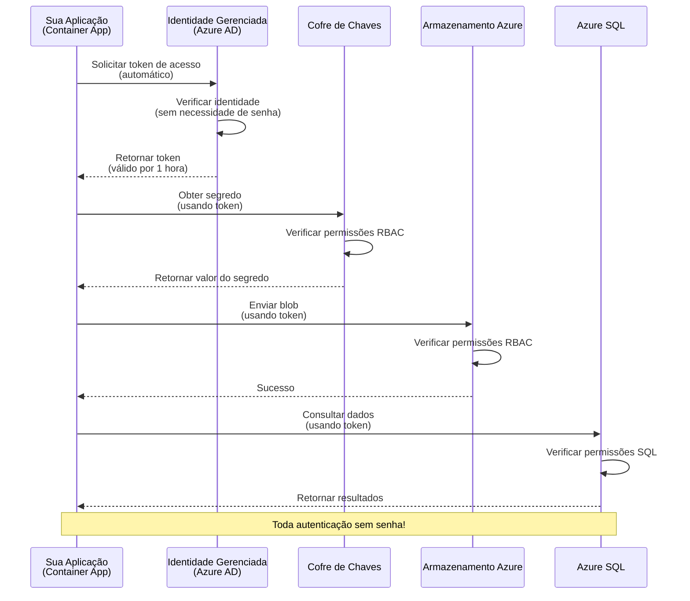
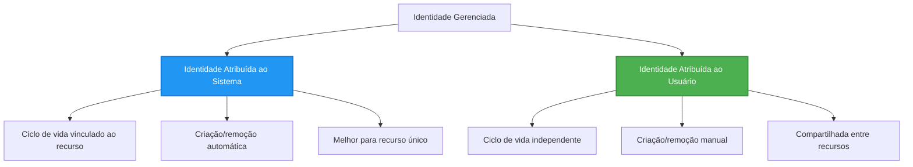

# Padrões de Autenticação e Identidade Gerenciada

⏱️ **Tempo Estimado**: 45-60 minutos | 💰 **Impacto de Custo**: Gratuito (sem custos adicionais) | ⭐ **Complexidade**: Intermediário

**📚 Caminho de Aprendizado:**
- ← Anterior: [Gerenciamento de Configuração](configuration.md) - Gerenciando variáveis de ambiente e segredos
- 🎯 **Você Está Aqui**: Autenticação & Segurança (Identidade Gerenciada, Key Vault, padrões seguros)
- → Próximo: [Primeiro Projeto](first-project.md) - Construa sua primeira aplicação AZD
- 🏠 [Página Inicial do Curso](../../README.md)

---

## O que Você Vai Aprender

Ao concluir esta lição, você:
- Compreenderá os padrões de autenticação do Azure (chaves, strings de conexão, identidade gerenciada)
- Implementará **Identidade Gerenciada** para autenticação sem senha
- Protegerá segredos com integração ao **Azure Key Vault**
- Configurará **controle de acesso baseado em função (RBAC)** para implantações AZD
- Aplicará melhores práticas de segurança em Container Apps e serviços Azure
- Migrará de autenticação baseada em chaves para baseada em identidade

## Por Que a Identidade Gerenciada é Importante

### O Problema: Autenticação Tradicional

**Antes da Identidade Gerenciada:**
```javascript
// ❌ RISCO DE SEGURANÇA: Segredos codificados no código
const connectionString = "Server=mydb.database.windows.net;User=admin;Password=P@ssw0rd123";
const storageKey = "xK7mN9pQ2wR5tY8uI0oP3aS6dF1gH4jK...";
const cosmosKey = "C2x7B9n4M1p8Q5w3E6r0T2y5U8i1O4p7...";
```

**Problemas:**
- 🔴 **Segredos expostos** no código, arquivos de configuração, variáveis de ambiente
- 🔴 **Rotação de credenciais** exige alterações no código e reimplantação
- 🔴 **Pesadelos de auditoria** - quem acessou o quê, quando?
- 🔴 **Dispersão** - segredos espalhados por vários sistemas
- 🔴 **Riscos de conformidade** - falhas em auditorias de segurança

### A Solução: Identidade Gerenciada

**Depois da Identidade Gerenciada:**
```javascript
// ✅ SEGURO: Nenhum segredo no código
const credential = new DefaultAzureCredential();
const client = new BlobServiceClient(
  "https://mystorageaccount.blob.core.windows.net",
  credential  // O Azure lida automaticamente com a autenticação
);
```

**Benefícios:**
- ✅ **Zero segredos** no código ou configuração
- ✅ **Rotação automática** - o Azure cuida disso
- ✅ **Trilha de auditoria completa** nos logs do Azure AD
- ✅ **Segurança centralizada** - gerencie no Portal do Azure
- ✅ **Pronto para conformidade** - atende aos padrões de segurança

**Analogia**: A autenticação tradicional é como carregar várias chaves físicas para diferentes portas. A Identidade Gerenciada é como ter um crachá de segurança que automaticamente concede acesso com base em quem você é—sem chaves para perder, copiar ou rotacionar.

---

## Visão Geral da Arquitetura

### Fluxo de Autenticação com Identidade Gerenciada


### Tipos de Identidades Gerenciadas


| Recurso | Atribuído ao Sistema | Atribuído ao Usuário |
|---------|----------------------|----------------------|
| **Ciclo de Vida** | Vinculado ao recurso | Independente |
| **Criação** | Automática com o recurso | Criação manual |
| **Exclusão** | Excluído com o recurso | Persiste após exclusão do recurso |
| **Compartilhamento** | Apenas um recurso | Vários recursos |
| **Caso de Uso** | Cenários simples | Cenários complexos com múltiplos recursos |
| **Padrão AZD** | ✅ Recomendado | Opcional |

---

## Pré-requisitos

### Ferramentas Necessárias

Você já deve ter estas ferramentas instaladas das lições anteriores:

```bash
# Verificar CLI do Desenvolvedor Azure
azd version
# ✅ Esperado: versão azd 1.0.0 ou superior

# Verificar CLI do Azure
az --version
# ✅ Esperado: azure-cli 2.50.0 ou superior
```

### Requisitos do Azure

- Assinatura ativa do Azure
- Permissões para:
  - Criar identidades gerenciadas
  - Atribuir funções RBAC
  - Criar recursos Key Vault
  - Implantar Container Apps

### Pré-requisitos de Conhecimento

Você deve ter concluído:
- [Guia de Instalação](installation.md) - Configuração do AZD
- [Noções Básicas do AZD](azd-basics.md) - Conceitos principais
- [Gerenciamento de Configuração](configuration.md) - Variáveis de ambiente

---

## Lição 1: Compreendendo Padrões de Autenticação

### Padrão 1: Strings de Conexão (Legado - Evitar)

**Como funciona:**
```bash
# A string de conexão contém credenciais
STORAGE_CONNECTION_STRING="DefaultEndpointsProtocol=https;AccountName=myaccount;AccountKey=xK7mN9pQ2wR5..."
COSMOS_CONNECTION_STRING="AccountEndpoint=https://myaccount.documents.azure.com:443/;AccountKey=C2x7..."
SQL_CONNECTION_STRING="Server=myserver.database.windows.net;User=admin;Password=P@ssw0rd..."
```

**Problemas:**
- ❌ Segredos visíveis em variáveis de ambiente
- ❌ Registrados em sistemas de implantação
- ❌ Difícil de rotacionar
- ❌ Sem trilha de auditoria de acesso

**Quando usar:** Apenas para desenvolvimento local, nunca em produção.

---

### Padrão 2: Referências ao Key Vault (Melhor)

**Como funciona:**
```bicep
// Store secret in Key Vault
resource keyVault 'Microsoft.KeyVault/vaults@2023-02-01' = {
  name: 'mykv'
  properties: {
    enableRbacAuthorization: true
  }
}

// Reference in Container App
env: [
  {
    name: 'STORAGE_KEY'
    secretRef: 'storage-key'  // References Key Vault
  }
]
```

**Benefícios:**
- ✅ Segredos armazenados com segurança no Key Vault
- ✅ Gerenciamento centralizado de segredos
- ✅ Rotação sem alterações no código

**Limitações:**
- ⚠️ Ainda usando chaves/senhas
- ⚠️ Necessidade de gerenciar acesso ao Key Vault

**Quando usar:** Etapa de transição de strings de conexão para identidade gerenciada.

---

### Padrão 3: Identidade Gerenciada (Melhor Prática)

**Como funciona:**
```bicep
// Enable managed identity
resource containerApp 'Microsoft.App/containerApps@2023-05-01' = {
  name: 'myapp'
  identity: {
    type: 'SystemAssigned'  // Automatically creates identity
  }
}

// Grant permissions
resource roleAssignment 'Microsoft.Authorization/roleAssignments@2022-04-01' = {
  scope: storageAccount
  properties: {
    roleDefinitionId: storageBlobDataContributorRole
    principalId: containerApp.identity.principalId
  }
}
```

**Código da aplicação:**
```javascript
// Nenhum segredo necessário!
const { DefaultAzureCredential } = require('@azure/identity');
const { BlobServiceClient } = require('@azure/storage-blob');

const credential = new DefaultAzureCredential();
const blobServiceClient = new BlobServiceClient(
  'https://mystorageaccount.blob.core.windows.net',
  credential
);
```

**Benefícios:**
- ✅ Zero segredos no código/configuração
- ✅ Rotação automática de credenciais
- ✅ Trilha de auditoria completa
- ✅ Permissões baseadas em RBAC
- ✅ Pronto para conformidade

**Quando usar:** Sempre, para aplicações em produção.

---

## Lição 2: Implementando Identidade Gerenciada com AZD

### Implementação Passo a Passo

Vamos construir um Container App seguro que usa identidade gerenciada para acessar o Azure Storage e o Key Vault.

### Estrutura do Projeto

```
secure-app/
├── azure.yaml                 # AZD configuration
├── infra/
│   ├── main.bicep            # Main infrastructure
│   ├── core/
│   │   ├── identity.bicep    # Managed identity setup
│   │   ├── keyvault.bicep    # Key Vault configuration
│   │   └── storage.bicep     # Storage with RBAC
│   └── app/
│       └── container-app.bicep
└── src/
    ├── app.js                # Application code
    ├── package.json
    └── Dockerfile
```

### 1. Configurar AZD (azure.yaml)

```yaml
name: secure-app
metadata:
  template: secure-app@1.0.0

services:
  api:
    project: ./src
    language: js
    host: containerapp

# Enable managed identity (AZD handles this automatically)
```

### 2. Infraestrutura: Habilitar Identidade Gerenciada

**Arquivo: `infra/main.bicep`**

```bicep
targetScope = 'subscription'

param environmentName string
param location string = 'eastus'

var tags = { 'azd-env-name': environmentName }

// Resource group
resource rg 'Microsoft.Resources/resourceGroups@2021-04-01' = {
  name: 'rg-${environmentName}'
  location: location
  tags: tags
}

// Storage Account
module storage './core/storage.bicep' = {
  name: 'storage'
  scope: rg
  params: {
    name: 'st${uniqueString(rg.id)}'
    location: location
    tags: tags
  }
}

// Key Vault
module keyVault './core/keyvault.bicep' = {
  name: 'keyvault'
  scope: rg
  params: {
    name: 'kv-${uniqueString(rg.id)}'
    location: location
    tags: tags
  }
}

// Container App with Managed Identity
module containerApp './app/container-app.bicep' = {
  name: 'container-app'
  scope: rg
  params: {
    name: 'ca-${environmentName}'
    location: location
    tags: tags
    storageAccountName: storage.outputs.name
    keyVaultName: keyVault.outputs.name
  }
}

// Grant Container App access to Storage
module storageRoleAssignment './core/role-assignment.bicep' = {
  name: 'storage-role'
  scope: rg
  params: {
    principalId: containerApp.outputs.identityPrincipalId
    roleDefinitionId: 'ba92f5b4-2d11-453d-a403-e96b0029c9fe'  // Storage Blob Data Contributor
    targetResourceId: storage.outputs.id
  }
}

// Grant Container App access to Key Vault
module kvRoleAssignment './core/role-assignment.bicep' = {
  name: 'kv-role'
  scope: rg
  params: {
    principalId: containerApp.outputs.identityPrincipalId
    roleDefinitionId: '4633458b-17de-408a-b874-0445c86b69e6'  // Key Vault Secrets User
    targetResourceId: keyVault.outputs.id
  }
}

// Outputs
output AZURE_STORAGE_ACCOUNT_NAME string = storage.outputs.name
output AZURE_KEY_VAULT_NAME string = keyVault.outputs.name
output APP_URL string = containerApp.outputs.url
```

### 3. Container App com Identidade Atribuída ao Sistema

**Arquivo: `infra/app/container-app.bicep`**

```bicep
param name string
param location string
param tags object = {}
param storageAccountName string
param keyVaultName string

resource containerApp 'Microsoft.App/containerApps@2023-05-01' = {
  name: name
  location: location
  tags: tags
  identity: {
    type: 'SystemAssigned'  // 🔑 Enable managed identity
  }
  properties: {
    configuration: {
      ingress: {
        external: true
        targetPort: 3000
      }
    }
    template: {
      containers: [
        {
          name: 'api'
          image: 'myregistry.azurecr.io/api:latest'
          resources: {
            cpu: json('0.5')
            memory: '1Gi'
          }
          env: [
            {
              name: 'AZURE_STORAGE_ACCOUNT_NAME'
              value: storageAccountName
            }
            {
              name: 'AZURE_KEY_VAULT_NAME'
              value: keyVaultName
            }
            // 🔑 No secrets - managed identity handles authentication!
          ]
        }
      ]
    }
  }
}

// Output the identity for RBAC assignments
output identityPrincipalId string = containerApp.identity.principalId
output id string = containerApp.id
output url string = 'https://${containerApp.properties.configuration.ingress.fqdn}'
```

### 4. Módulo de Atribuição de Funções RBAC

**Arquivo: `infra/core/role-assignment.bicep`**

```bicep
param principalId string
param roleDefinitionId string  // Azure built-in role ID
param targetResourceId string

resource roleAssignment 'Microsoft.Authorization/roleAssignments@2022-04-01' = {
  name: guid(principalId, roleDefinitionId, targetResourceId)
  scope: resourceId('Microsoft.Resources/resourceGroups', resourceGroup().name)
  properties: {
    roleDefinitionId: subscriptionResourceId('Microsoft.Authorization/roleDefinitions', roleDefinitionId)
    principalId: principalId
    principalType: 'ServicePrincipal'
  }
}

output id string = roleAssignment.id
```

### 5. Código da Aplicação com Identidade Gerenciada

**Arquivo: `src/app.js`**

```javascript
const express = require('express');
const { DefaultAzureCredential } = require('@azure/identity');
const { BlobServiceClient } = require('@azure/storage-blob');
const { SecretClient } = require('@azure/keyvault-secrets');

const app = express();
const PORT = process.env.PORT || 3000;

// 🔑 Inicializar credencial (funciona automaticamente com identidade gerenciada)
const credential = new DefaultAzureCredential();

// Configuração do Azure Storage
const storageAccountName = process.env.AZURE_STORAGE_ACCOUNT_NAME;
const blobServiceClient = new BlobServiceClient(
  `https://${storageAccountName}.blob.core.windows.net`,
  credential  // Nenhuma chave necessária!
);

// Configuração do Key Vault
const keyVaultName = process.env.AZURE_KEY_VAULT_NAME;
const secretClient = new SecretClient(
  `https://${keyVaultName}.vault.azure.net`,
  credential  // Nenhuma chave necessária!
);

// Verificação de saúde
app.get('/health', (req, res) => {
  res.json({ status: 'healthy', authentication: 'managed-identity' });
});

// Fazer upload de arquivo para o blob storage
app.post('/upload', async (req, res) => {
  try {
    const containerClient = blobServiceClient.getContainerClient('uploads');
    await containerClient.createIfNotExists();
    
    const blobName = `file-${Date.now()}.txt`;
    const blockBlobClient = containerClient.getBlockBlobClient(blobName);
    
    await blockBlobClient.upload('Hello from managed identity!', 30);
    
    res.json({
      success: true,
      blobName: blobName,
      message: 'File uploaded using managed identity!'
    });
  } catch (error) {
    console.error('Upload error:', error);
    res.status(500).json({ error: error.message });
  }
});

// Obter segredo do Key Vault
app.get('/secret/:name', async (req, res) => {
  try {
    const secretName = req.params.name;
    const secret = await secretClient.getSecret(secretName);
    
    res.json({
      name: secretName,
      value: secret.value,
      message: 'Secret retrieved using managed identity!'
    });
  } catch (error) {
    console.error('Secret error:', error);
    res.status(500).json({ error: error.message });
  }
});

// Listar contêineres de blob (demonstra acesso de leitura)
app.get('/containers', async (req, res) => {
  try {
    const containers = [];
    for await (const container of blobServiceClient.listContainers()) {
      containers.push(container.name);
    }
    
    res.json({
      containers: containers,
      count: containers.length,
      message: 'Containers listed using managed identity!'
    });
  } catch (error) {
    console.error('List error:', error);
    res.status(500).json({ error: error.message });
  }
});

app.listen(PORT, () => {
  console.log(`Secure API listening on port ${PORT}`);
  console.log('Authentication: Managed Identity (passwordless)');
});
```

**Arquivo: `src/package.json`**

```json
{
  "name": "secure-app",
  "version": "1.0.0",
  "dependencies": {
    "express": "^4.18.2",
    "@azure/identity": "^4.0.0",
    "@azure/storage-blob": "^12.17.0",
    "@azure/keyvault-secrets": "^4.7.0"
  },
  "scripts": {
    "start": "node app.js"
  }
}
```

### 6. Implantar e Testar

```bash
# Inicializar ambiente AZD
azd init

# Implantar infraestrutura e aplicação
azd up

# Obter a URL do aplicativo
APP_URL=$(azd env get-values | grep APP_URL | cut -d '=' -f2 | tr -d '"')

# Testar verificação de integridade
curl $APP_URL/health
```

**✅ Resultado esperado:**
```json
{
  "status": "healthy",
  "authentication": "managed-identity"
}
```

**Teste de upload de blob:**
```bash
curl -X POST $APP_URL/upload
```

**✅ Resultado esperado:**
```json
{
  "success": true,
  "blobName": "file-1700404800000.txt",
  "message": "File uploaded using managed identity!"
}
```

**Teste de listagem de container:**
```bash
curl $APP_URL/containers
```

**✅ Resultado esperado:**
```json
{
  "containers": ["uploads"],
  "count": 1,
  "message": "Containers listed using managed identity!"
}
```

---

## Funções RBAC Comuns do Azure

### IDs de Funções Integradas para Identidade Gerenciada

| Serviço | Nome da Função | ID da Função | Permissões |
|---------|----------------|--------------|------------|
| **Storage** | Storage Blob Data Reader | `2a2b9908-6b94-4a3d-8e5a-a7d8f8cc8a12` | Ler blobs e containers |
| **Storage** | Storage Blob Data Contributor | `ba92f5b4-2d11-453d-a403-e96b0029c9fe` | Ler, escrever, excluir blobs |
| **Storage** | Storage Queue Data Contributor | `974c5e8b-45b9-4653-ba55-5f855dd0fb88` | Ler, escrever, excluir mensagens de fila |
| **Key Vault** | Key Vault Secrets User | `4633458b-17de-408a-b874-0445c86b69e6` | Ler segredos |
| **Key Vault** | Key Vault Secrets Officer | `b86a8fe4-44ce-4948-aee5-eccb2c155cd7` | Ler, escrever, excluir segredos |
| **Cosmos DB** | Cosmos DB Built-in Data Reader | `00000000-0000-0000-0000-000000000001` | Ler dados do Cosmos DB |
| **Cosmos DB** | Cosmos DB Built-in Data Contributor | `00000000-0000-0000-0000-000000000002` | Ler, escrever dados do Cosmos DB |
| **SQL Database** | SQL DB Contributor | `9b7fa17d-e63e-47b0-bb0a-15c516ac86ec` | Gerenciar bancos de dados SQL |
| **Service Bus** | Azure Service Bus Data Owner | `090c5cfd-751d-490a-894a-3ce6f1109419` | Enviar, receber, gerenciar mensagens |

### Como Encontrar IDs de Funções

```bash
# Liste todos os papéis integrados
az role definition list --query "[].{Name:roleName, ID:name}" --output table

# Pesquise por papel específico
az role definition list --query "[?contains(roleName, 'Storage Blob')].{Name:roleName, ID:name}" --output table

# Obtenha detalhes do papel
az role definition list --name "Storage Blob Data Contributor"
```

---

## Exercícios Práticos

### Exercício 1: Habilitar Identidade Gerenciada para Aplicação Existente ⭐⭐ (Médio)

**Objetivo**: Adicionar identidade gerenciada a uma implantação existente de Container App

**Cenário**: Você tem um Container App usando strings de conexão. Converta-o para identidade gerenciada.

**Ponto de Partida**: Container App com esta configuração:

```bicep
// ❌ Current: Using connection string
env: [
  {
    name: 'STORAGE_CONNECTION_STRING'
    secretRef: 'storage-connection'
  }
]
```

**Passos**:

1. **Habilitar identidade gerenciada no Bicep:**

```bicep
resource containerApp 'Microsoft.App/containerApps@2023-05-01' = {
  name: 'myapp'
  identity: {
    type: 'SystemAssigned'  // Add this
  }
  // ... rest of configuration
}
```

2. **Conceder acesso ao Storage:**

```bicep
// Get storage account reference
resource storageAccount 'Microsoft.Storage/storageAccounts@2023-01-01' existing = {
  name: storageAccountName
}

// Assign role
resource roleAssignment 'Microsoft.Authorization/roleAssignments@2022-04-01' = {
  name: guid(containerApp.id, 'ba92f5b4-2d11-453d-a403-e96b0029c9fe', storageAccount.id)
  scope: storageAccount
  properties: {
    roleDefinitionId: subscriptionResourceId('Microsoft.Authorization/roleDefinitions', 'ba92f5b4-2d11-453d-a403-e96b0029c9fe')
    principalId: containerApp.identity.principalId
    principalType: 'ServicePrincipal'
  }
}
```

3. **Atualizar código da aplicação:**

**Antes (string de conexão):**
```javascript
const { BlobServiceClient } = require('@azure/storage-blob');

const blobServiceClient = BlobServiceClient.fromConnectionString(
  process.env.STORAGE_CONNECTION_STRING
);
```

**Depois (identidade gerenciada):**
```javascript
const { DefaultAzureCredential } = require('@azure/identity');
const { BlobServiceClient } = require('@azure/storage-blob');

const credential = new DefaultAzureCredential();
const blobServiceClient = new BlobServiceClient(
  `https://${process.env.STORAGE_ACCOUNT_NAME}.blob.core.windows.net`,
  credential
);
```

4. **Atualizar variáveis de ambiente:**

```bicep
env: [
  {
    name: 'STORAGE_ACCOUNT_NAME'
    value: storageAccountName  // Just the name, no secrets!
  }
  // Remove STORAGE_CONNECTION_STRING
]
```

5. **Implantar e testar:**

```bash
# Reimplantar
azd up

# Teste se ainda funciona
curl https://myapp.azurecontainerapps.io/upload
```

**✅ Critérios de Sucesso:**
- ✅ Aplicação implantada sem erros
- ✅ Operações de Storage funcionando (upload, listagem, download)
- ✅ Sem strings de conexão em variáveis de ambiente
- ✅ Identidade visível no Portal do Azure na aba "Identidade"

**Verificação:**

```bash
# Verifique se a identidade gerenciada está habilitada
az containerapp show \
  --name myapp \
  --resource-group rg-myapp \
  --query "identity.type"
# ✅ Esperado: "SystemAssigned"

# Verifique a atribuição de função
az role assignment list \
  --assignee $(az containerapp show --name myapp --resource-group rg-myapp --query "identity.principalId" -o tsv) \
  --scope /subscriptions/{sub-id}/resourceGroups/rg-myapp/providers/Microsoft.Storage/storageAccounts/mystorageaccount
# ✅ Esperado: Mostra a função "Storage Blob Data Contributor"
```

**Tempo**: 20-30 minutos

---

### Exercício 2: Acesso Multi-Serviço com Identidade Atribuída ao Usuário ⭐⭐⭐ (Avançado)

**Objetivo**: Criar uma identidade atribuída ao usuário compartilhada entre vários Container Apps

**Cenário**: Você tem 3 microsserviços que precisam acessar a mesma conta de Storage e Key Vault.

**Passos**:

1. **Criar identidade atribuída ao usuário:**

**Arquivo: `infra/core/identity.bicep`**

```bicep
param name string
param location string
param tags object = {}

resource userAssignedIdentity 'Microsoft.ManagedIdentity/userAssignedIdentities@2023-01-31' = {
  name: name
  location: location
  tags: tags
}

output id string = userAssignedIdentity.id
output principalId string = userAssignedIdentity.properties.principalId
output clientId string = userAssignedIdentity.properties.clientId
```

2. **Atribuir funções à identidade atribuída ao usuário:**

```bicep
// In main.bicep
module userIdentity './core/identity.bicep' = {
  name: 'user-identity'
  scope: rg
  params: {
    name: 'id-${environmentName}'
    location: location
    tags: tags
  }
}

// Grant Storage access
resource storageRoleAssignment 'Microsoft.Authorization/roleAssignments@2022-04-01' = {
  name: guid(userIdentity.outputs.principalId, 'storage-contributor')
  scope: storageAccount
  properties: {
    roleDefinitionId: subscriptionResourceId('Microsoft.Authorization/roleDefinitions', 'ba92f5b4-2d11-453d-a403-e96b0029c9fe')
    principalId: userIdentity.outputs.principalId
    principalType: 'ServicePrincipal'
  }
}

// Grant Key Vault access
resource kvRoleAssignment 'Microsoft.Authorization/roleAssignments@2022-04-01' = {
  name: guid(userIdentity.outputs.principalId, 'kv-secrets-user')
  scope: keyVault
  properties: {
    roleDefinitionId: subscriptionResourceId('Microsoft.Authorization/roleDefinitions', '4633458b-17de-408a-b874-0445c86b69e6')
    principalId: userIdentity.outputs.principalId
    principalType: 'ServicePrincipal'
  }
}
```

3. **Atribuir identidade a vários Container Apps:**

```bicep
resource apiGateway 'Microsoft.App/containerApps@2023-05-01' = {
  name: 'api-gateway'
  identity: {
    type: 'UserAssigned'
    userAssignedIdentities: {
      '${userIdentity.outputs.id}': {}
    }
  }
  // ... rest of config
}

resource productService 'Microsoft.App/containerApps@2023-05-01' = {
  name: 'product-service'
  identity: {
    type: 'UserAssigned'
    userAssignedIdentities: {
      '${userIdentity.outputs.id}': {}
    }
  }
  // ... rest of config
}

resource orderService 'Microsoft.App/containerApps@2023-05-01' = {
  name: 'order-service'
  identity: {
    type: 'UserAssigned'
    userAssignedIdentities: {
      '${userIdentity.outputs.id}': {}
    }
  }
  // ... rest of config
}
```

4. **Código da aplicação (todos os serviços usam o mesmo padrão):**

```javascript
const { DefaultAzureCredential, ManagedIdentityCredential } = require('@azure/identity');

// Para identidade atribuída pelo usuário, especifique o ID do cliente
const credential = new ManagedIdentityCredential(
  process.env.AZURE_CLIENT_ID  // ID do cliente da identidade atribuída pelo usuário
);

// Ou use DefaultAzureCredential (detecta automaticamente)
const credential = new DefaultAzureCredential();

const blobServiceClient = new BlobServiceClient(
  `https://${process.env.STORAGE_ACCOUNT_NAME}.blob.core.windows.net`,
  credential
);
```

5. **Implantar e verificar:**

```bash
azd up

# Testar se todos os serviços podem acessar o armazenamento
curl https://api-gateway.azurecontainerapps.io/upload
curl https://product-service.azurecontainerapps.io/upload
curl https://order-service.azurecontainerapps.io/upload
```

**✅ Critérios de Sucesso:**
- ✅ Uma identidade compartilhada entre 3 serviços
- ✅ Todos os serviços podem acessar Storage e Key Vault
- ✅ Identidade persiste se você excluir um serviço
- ✅ Gerenciamento centralizado de permissões

**Benefícios da Identidade Atribuída ao Usuário:**
- Uma única identidade para gerenciar
- Permissões consistentes entre serviços
- Sobrevive à exclusão de serviços
- Melhor para arquiteturas complexas

**Tempo**: 30-40 minutos

---

### Exercício 3: Implementar Rotação de Segredos no Key Vault ⭐⭐⭐ (Avançado)

**Objetivo**: Armazenar chaves de API de terceiros no Key Vault e acessá-las usando identidade gerenciada

**Cenário**: Sua aplicação precisa chamar uma API externa (OpenAI, Stripe, SendGrid) que exige chaves de API.

**Passos**:

1. **Criar Key Vault com RBAC:**

**Arquivo: `infra/core/keyvault.bicep`**

```bicep
param name string
param location string
param tags object = {}

resource keyVault 'Microsoft.KeyVault/vaults@2023-02-01' = {
  name: name
  location: location
  tags: tags
  properties: {
    enableRbacAuthorization: true  // Use RBAC instead of access policies
    sku: {
      family: 'A'
      name: 'standard'
    }
    tenantId: subscription().tenantId
    enableSoftDelete: true
    softDeleteRetentionInDays: 90
  }
}

// Allow Container App to read secrets
output id string = keyVault.id
output name string = keyVault.name
output uri string = keyVault.properties.vaultUri
```

2. **Armazenar segredos no Key Vault:**

```bash
# Obter nome do Key Vault
KV_NAME=$(azd env get-values | grep AZURE_KEY_VAULT_NAME | cut -d '=' -f2 | tr -d '"')

# Armazenar chaves de API de terceiros
az keyvault secret set \
  --vault-name $KV_NAME \
  --name "OpenAI-ApiKey" \
  --value "sk-proj-xxxxxxxxxxxxx"

az keyvault secret set \
  --vault-name $KV_NAME \
  --name "Stripe-ApiKey" \
  --value "sk_live_xxxxxxxxxxxxx"

az keyvault secret set \
  --vault-name $KV_NAME \
  --name "SendGrid-ApiKey" \
  --value "SG.xxxxxxxxxxxxx"
```

3. **Código da aplicação para recuperar segredos:**

**Arquivo: `src/config.js`**

```javascript
const { DefaultAzureCredential } = require('@azure/identity');
const { SecretClient } = require('@azure/keyvault-secrets');

class Config {
  constructor() {
    this.credential = new DefaultAzureCredential();
    this.secretClient = new SecretClient(
      `https://${process.env.AZURE_KEY_VAULT_NAME}.vault.azure.net`,
      this.credential
    );
    this.cache = {};
  }

  async getSecret(secretName) {
    // Verificar o cache primeiro
    if (this.cache[secretName]) {
      return this.cache[secretName];
    }

    try {
      const secret = await this.secretClient.getSecret(secretName);
      this.cache[secretName] = secret.value;
      console.log(`✅ Retrieved secret: ${secretName}`);
      return secret.value;
    } catch (error) {
      console.error(`❌ Failed to get secret ${secretName}:`, error.message);
      throw error;
    }
  }

  async getOpenAIKey() {
    return this.getSecret('OpenAI-ApiKey');
  }

  async getStripeKey() {
    return this.getSecret('Stripe-ApiKey');
  }

  async getSendGridKey() {
    return this.getSecret('SendGrid-ApiKey');
  }
}

module.exports = new Config();
```

4. **Usar segredos na aplicação:**

**Arquivo: `src/app.js`**

```javascript
const express = require('express');
const config = require('./config');
const { OpenAI } = require('openai');

const app = express();

// Inicializar OpenAI com chave do Key Vault
let openaiClient;

async function initializeServices() {
  const openaiKey = await config.getOpenAIKey();
  openaiClient = new OpenAI({ apiKey: openaiKey });
  console.log('✅ Services initialized with secrets from Key Vault');
}

// Chamar na inicialização
initializeServices().catch(console.error);

app.post('/chat', async (req, res) => {
  try {
    const completion = await openaiClient.chat.completions.create({
      model: 'gpt-4',
      messages: [{ role: 'user', content: 'Hello!' }]
    });
    
    res.json({
      response: completion.choices[0].message.content,
      authentication: 'Key from Key Vault via Managed Identity'
    });
  } catch (error) {
    res.status(500).json({ error: error.message });
  }
});

app.listen(3000, () => {
  console.log('Secure API with Key Vault integration running');
});
```

5. **Implantar e testar:**

```bash
azd up

# Testar se as chaves da API funcionam
curl -X POST https://myapp.azurecontainerapps.io/chat \
  -H "Content-Type: application/json" \
  -d '{"message":"Hello AI"}'
```

**✅ Critérios de Sucesso:**
- ✅ Sem chaves de API no código ou variáveis de ambiente
- ✅ Aplicação recupera chaves do Key Vault
- ✅ APIs de terceiros funcionam corretamente
- ✅ Capacidade de rotacionar chaves sem alterações no código

**Rotacionar um segredo:**

```bash
# Atualizar segredo no Key Vault
az keyvault secret set \
  --vault-name $KV_NAME \
  --name "OpenAI-ApiKey" \
  --value "sk-proj-NEW_KEY_HERE"

# Reiniciar aplicativo para captar nova chave
az containerapp revision restart \
  --name myapp \
  --resource-group rg-myapp
```

**Tempo**: 25-35 minutos

---

## Ponto de Verificação de Conhecimento

### 1. Padrões de Autenticação ✓

Teste seu entendimento:

- [ ] **Q1**: Quais são os três principais padrões de autenticação? 
  - **A**: Strings de conexão (legado), referências ao Key Vault (transição), Identidade Gerenciada (melhor)

- [ ] **Q2**: Por que a identidade gerenciada é melhor que strings de conexão?
  - **A**: Sem segredos no código, rotação automática, trilha de auditoria completa, permissões RBAC

- [ ] **Q3**: Quando você usaria identidade atribuída ao usuário em vez de atribuída ao sistema?
  - **A**: Quando compartilhando identidade entre vários recursos ou quando o ciclo de vida da identidade é independente do ciclo de vida do recurso

**Verificação Prática:**
```bash
# Verifique qual tipo de identidade seu aplicativo usa
az containerapp show \
  --name myapp \
  --resource-group rg-myapp \
  --query "identity.type"

# Liste todas as atribuições de função para a identidade
az role assignment list \
  --assignee $(az containerapp show --name myapp --resource-group rg-myapp --query "identity.principalId" -o tsv)
```

---

### 2. RBAC e Permissões ✓

Teste seu entendimento:

- [ ] **Q1**: Qual é o ID da função para "Storage Blob Data Contributor"?
  - **A**: `ba92f5b4-2d11-453d-a403-e96b0029c9fe`

- [ ] **Q2**: Quais permissões "Key Vault Secrets User" fornece?
  - **A**: Acesso somente leitura a segredos (não pode criar, atualizar ou excluir)

- [ ] **Q3**: Como você concede acesso a um Container App ao Azure SQL?
  - **A**: Atribuir a função "SQL DB Contributor" ou configurar autenticação Azure AD para SQL

**Verificação Prática:**
```bash
# Encontrar função específica
az role definition list --name "Storage Blob Data Contributor"

# Verificar quais funções estão atribuídas à sua identidade
PRINCIPAL_ID=$(az containerapp show --name myapp --resource-group rg-myapp --query "identity.principalId" -o tsv)
az role assignment list --assignee $PRINCIPAL_ID --output table
```

---

### 3. Integração com Key Vault ✓

Teste seu entendimento:
- [ ] **Q1**: Como habilitar RBAC para Key Vault em vez de políticas de acesso?
  - **A**: Defina `enableRbacAuthorization: true` no Bicep

- [ ] **Q2**: Qual biblioteca do Azure SDK lida com autenticação de identidade gerenciada?
  - **A**: `@azure/identity` com a classe `DefaultAzureCredential`

- [ ] **Q3**: Quanto tempo os segredos do Key Vault permanecem em cache?
  - **A**: Depende da aplicação; implemente sua própria estratégia de cache

**Verificação Prática:**
```bash
# Testar acesso ao Key Vault
az keyvault secret show \
  --vault-name $KV_NAME \
  --name "OpenAI-ApiKey" \
  --query "value"

# Verificar se o RBAC está habilitado
az keyvault show \
  --name $KV_NAME \
  --query "properties.enableRbacAuthorization"
# ✅ Esperado: verdadeiro
```

---

## Melhores Práticas de Segurança

### ✅ FAÇA:

1. **Sempre use identidade gerenciada em produção**
   ```bicep
   identity: {
     type: 'SystemAssigned'
   }
   ```

2. **Use funções RBAC com privilégios mínimos**
   - Use funções "Reader" sempre que possível
   - Evite "Owner" ou "Contributor", a menos que seja necessário

3. **Armazene chaves de terceiros no Key Vault**
   ```javascript
   const apiKey = await secretClient.getSecret('ThirdPartyApiKey');
   ```

4. **Habilite o registro de auditoria**
   ```bicep
   diagnosticSettings: {
     logs: [{ category: 'AuditEvent', enabled: true }]
   }
   ```

5. **Use identidades diferentes para dev/staging/prod**
   ```bash
   azd env new dev
   azd env new staging
   azd env new prod
   ```

6. **Gire segredos regularmente**
   - Defina datas de expiração nos segredos do Key Vault
   - Automatize a rotação com Azure Functions

### ❌ NÃO FAÇA:

1. **Nunca codifique segredos diretamente**
   ```javascript
   // ❌ RUIM
   const apiKey = "sk-proj-xxxxxxxxxxxxx";
   ```

2. **Não use strings de conexão em produção**
   ```javascript
   // ❌ RUIM
   BlobServiceClient.fromConnectionString(process.env.STORAGE_CONNECTION_STRING)
   ```

3. **Não conceda permissões excessivas**
   ```bicep
   // ❌ BAD - too much access
   roleDefinitionId: 'Owner'
   
   // ✅ GOOD - least privilege
   roleDefinitionId: 'Storage Blob Data Reader'
   ```

4. **Não registre segredos**
   ```javascript
   // ❌ RUIM
   console.log('API Key:', apiKey);
   
   // ✅ BOM
   console.log('API Key retrieved successfully');
   ```

5. **Não compartilhe identidades de produção entre ambientes**
   ```bicep
   // ❌ BAD - same identity for dev and prod
   // ✅ GOOD - separate identities per environment
   ```

---

## Guia de Solução de Problemas

### Problema: "Unauthorized" ao acessar o Azure Storage

**Sintomas:**
```
Error: Unauthorized (403)
AuthorizationPermissionMismatch: This request is not authorized to perform this operation
```

**Diagnóstico:**

```bash
# Verifique se a identidade gerenciada está habilitada
az containerapp show \
  --name myapp \
  --resource-group rg-myapp \
  --query "identity.type"
# ✅ Esperado: "SystemAssigned" ou "UserAssigned"

# Verifique as atribuições de função
PRINCIPAL_ID=$(az containerapp show --name myapp --resource-group rg-myapp --query "identity.principalId" -o tsv)
az role assignment list --assignee $PRINCIPAL_ID

# Esperado: Deve ver "Storage Blob Data Contributor" ou função semelhante
```

**Soluções:**

1. **Conceda a função RBAC correta:**
```bash
STORAGE_ID=$(az storage account show --name mystorageaccount --resource-group rg-myapp --query "id" -o tsv)
az role assignment create \
  --assignee $PRINCIPAL_ID \
  --role "Storage Blob Data Contributor" \
  --scope $STORAGE_ID
```

2. **Aguarde a propagação (pode levar de 5 a 10 minutos):**
```bash
# Verificar status de atribuição de função
az role assignment list --assignee $PRINCIPAL_ID --scope $STORAGE_ID
```

3. **Verifique se o código da aplicação usa a credencial correta:**
```javascript
// Certifique-se de que está usando DefaultAzureCredential
const credential = new DefaultAzureCredential();
```

---

### Problema: Acesso negado ao Key Vault

**Sintomas:**
```
Error: Forbidden (403)
The user, group or application does not have secrets get permission
```

**Diagnóstico:**

```bash
# Verificar se o RBAC do Key Vault está habilitado
az keyvault show \
  --name $KV_NAME \
  --query "properties.enableRbacAuthorization"
# ✅ Esperado: verdadeiro

# Verificar atribuições de função
az role assignment list \
  --assignee $PRINCIPAL_ID \
  --scope /subscriptions/{sub-id}/resourceGroups/rg-myapp/providers/Microsoft.KeyVault/vaults/$KV_NAME
```

**Soluções:**

1. **Habilite RBAC no Key Vault:**
```bash
az keyvault update \
  --name $KV_NAME \
  --enable-rbac-authorization true
```

2. **Conceda a função Key Vault Secrets User:**
```bash
KV_ID=$(az keyvault show --name $KV_NAME --query "id" -o tsv)
az role assignment create \
  --assignee $PRINCIPAL_ID \
  --role "Key Vault Secrets User" \
  --scope $KV_ID
```

---

### Problema: DefaultAzureCredential falha localmente

**Sintomas:**
```
Error: DefaultAzureCredential failed to retrieve a token
CredentialUnavailableError: No credential available
```

**Diagnóstico:**

```bash
# Verifique se você está logado
az account show

# Verifique a autenticação do Azure CLI
az ad signed-in-user show
```

**Soluções:**

1. **Faça login no Azure CLI:**
```bash
az login
```

2. **Defina a assinatura do Azure:**
```bash
az account set --subscription "Your Subscription Name"
```

3. **Para desenvolvimento local, use variáveis de ambiente:**
```bash
export AZURE_TENANT_ID="your-tenant-id"
export AZURE_CLIENT_ID="your-client-id"
export AZURE_CLIENT_SECRET="your-client-secret"
```

4. **Ou use uma credencial diferente localmente:**
```javascript
const { DefaultAzureCredential, AzureCliCredential } = require('@azure/identity');

// Use AzureCliCredential para desenvolvimento local
const credential = process.env.NODE_ENV === 'production' 
  ? new DefaultAzureCredential()
  : new AzureCliCredential();
```

---

### Problema: A atribuição de função demora muito para propagar

**Sintomas:**
- Função atribuída com sucesso
- Ainda recebendo erros 403
- Acesso intermitente (às vezes funciona, às vezes não)

**Explicação:**
Alterações no RBAC do Azure podem levar de 5 a 10 minutos para propagar globalmente.

**Solução:**

```bash
# Aguarde e tente novamente
echo "Waiting for RBAC propagation..."
sleep 300  # Aguarde 5 minutos

# Teste o acesso
curl https://myapp.azurecontainerapps.io/upload

# Se ainda falhar, reinicie o aplicativo
az containerapp revision restart \
  --name myapp \
  --resource-group rg-myapp
```

---

## Considerações de Custo

### Custos de Identidade Gerenciada

| Recurso | Custo |
|---------|-------|
| **Identidade Gerenciada** | 🆓 **GRÁTIS** - Sem custo |
| **Atribuições de Função RBAC** | 🆓 **GRÁTIS** - Sem custo |
| **Solicitações de Token do Azure AD** | 🆓 **GRÁTIS** - Incluído |
| **Operações do Key Vault** | $0.03 por 10.000 operações |
| **Armazenamento do Key Vault** | $0.024 por segredo por mês |

**A identidade gerenciada economiza dinheiro ao:**
- ✅ Eliminar operações do Key Vault para autenticação entre serviços
- ✅ Reduzir incidentes de segurança (sem credenciais vazadas)
- ✅ Diminuir a sobrecarga operacional (sem rotação manual)

**Comparação de Custos (mensal):**

| Cenário | Strings de Conexão | Identidade Gerenciada | Economia |
|---------|--------------------|-----------------------|----------|
| Aplicativo pequeno (1M requisições) | ~$50 (Key Vault + ops) | ~$0 | $50/mês |
| Aplicativo médio (10M requisições) | ~$200 | ~$0 | $200/mês |
| Aplicativo grande (100M requisições) | ~$1.500 | ~$0 | $1.500/mês |

---

## Saiba Mais

### Documentação Oficial
- [Azure Managed Identity](https://learn.microsoft.com/entra/identity/managed-identities-azure-resources/overview)
- [Azure RBAC](https://learn.microsoft.com/azure/role-based-access-control/overview)
- [Azure Key Vault](https://learn.microsoft.com/azure/key-vault/general/overview)
- [DefaultAzureCredential](https://learn.microsoft.com/dotnet/api/azure.identity.defaultazurecredential)

### Documentação do SDK
- [@azure/identity (Node.js)](https://www.npmjs.com/package/@azure/identity)
- [Azure.Identity (C#)](https://www.nuget.org/packages/Azure.Identity/)
- [azure-identity (Python)](https://pypi.org/project/azure-identity/)

### Próximos Passos neste Curso
- ← Anterior: [Gerenciamento de Configuração](configuration.md)
- → Próximo: [Primeiro Projeto](first-project.md)
- 🏠 [Página Inicial do Curso](../../README.md)

### Exemplos Relacionados
- [Exemplo de Chat Azure OpenAI](../../../../examples/azure-openai-chat) - Usa identidade gerenciada para Azure OpenAI
- [Exemplo de Microsserviços](../../../../examples/microservices) - Padrões de autenticação multi-serviço

---

## Resumo

**Você aprendeu:**
- ✅ Três padrões de autenticação (strings de conexão, Key Vault, identidade gerenciada)
- ✅ Como habilitar e configurar identidade gerenciada no AZD
- ✅ Atribuições de função RBAC para serviços do Azure
- ✅ Integração do Key Vault para segredos de terceiros
- ✅ Identidades atribuídas pelo usuário vs atribuídas pelo sistema
- ✅ Melhores práticas de segurança e solução de problemas

**Principais Pontos:**
1. **Sempre use identidade gerenciada em produção** - Sem segredos, rotação automática
2. **Use funções RBAC com privilégios mínimos** - Conceda apenas permissões necessárias
3. **Armazene chaves de terceiros no Key Vault** - Gerenciamento centralizado de segredos
4. **Separe identidades por ambiente** - Isolamento de dev, staging e produção
5. **Habilite o registro de auditoria** - Acompanhe quem acessou o quê

**Próximos Passos:**
1. Complete os exercícios práticos acima
2. Migre um aplicativo existente de strings de conexão para identidade gerenciada
3. Construa seu primeiro projeto AZD com segurança desde o início: [Primeiro Projeto](first-project.md)

---

<!-- CO-OP TRANSLATOR DISCLAIMER START -->
**Aviso Legal**:  
Este documento foi traduzido utilizando o serviço de tradução por IA [Co-op Translator](https://github.com/Azure/co-op-translator). Embora nos esforcemos para garantir a precisão, esteja ciente de que traduções automáticas podem conter erros ou imprecisões. O documento original em seu idioma nativo deve ser considerado a fonte autoritativa. Para informações críticas, recomenda-se a tradução profissional humana. Não nos responsabilizamos por quaisquer mal-entendidos ou interpretações incorretas decorrentes do uso desta tradução.
<!-- CO-OP TRANSLATOR DISCLAIMER END -->