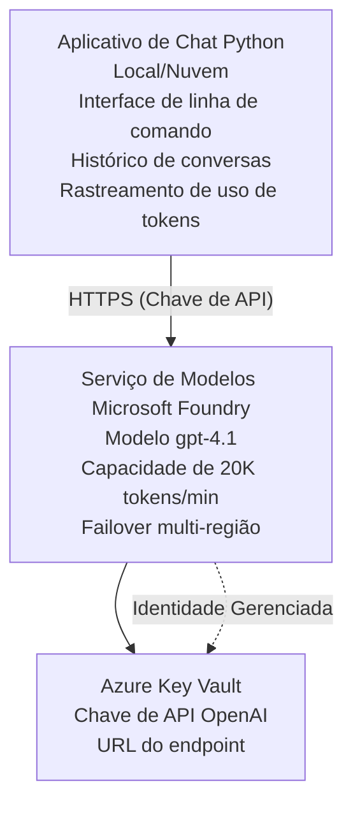

# Microsoft Foundry Models Chat Application

**Caminho de Aprendizado:** Intermediário ⭐⭐ | **Tempo:** 35-45 minutos | **Custo:** $50-200/mês

Uma aplicação de chat completa do Microsoft Foundry Models implantada usando o Azure Developer CLI (azd). Este exemplo demonstra a implantação do gpt-4.1, acesso seguro à API e uma interface de chat simples.

## 🎯 O que você vai aprender

- Implantar o Microsoft Foundry Models Service com o modelo gpt-4.1
- Proteger chaves da API OpenAI com o Key Vault
- Construir uma interface de chat simples com Python
- Monitorar uso de tokens e custos
- Implementar limitação de taxa e tratamento de erros

## 📦 O que está incluído

✅ **Microsoft Foundry Models Service** - implantação do modelo gpt-4.1  
✅ **Python Chat App** - Interface de chat simples em linha de comando  
✅ **Integração com Key Vault** - Armazenamento seguro de chaves da API  
✅ **ARM Templates** - Infraestrutura completa como código  
✅ **Monitoramento de Custos** - Rastreamento de uso de tokens  
✅ **Limitação de Taxa** - Prevenir esgotamento de cota  

## Arquitetura


## Pré-requisitos

### Obrigatório

- **Azure Developer CLI (azd)** - [Guia de instalação](https://learn.microsoft.com/azure/developer/azure-developer-cli/install-azd)
- **Assinatura do Azure** com acesso ao OpenAI - [Solicitar acesso](https://aka.ms/oai/access)
- **Python 3.9+** - [Instalar Python](https://www.python.org/downloads/)

### Verificar pré-requisitos

```bash
# Verifique a versão do azd (é necessário 1.5.0 ou superior)
azd version

# Verifique o login no Azure
azd auth login

# Verifique a versão do Python
python --version  # ou python3 --version

# Verifique o acesso ao OpenAI (verifique no Portal do Azure)
az cognitiveservices account list-skus \
  --kind OpenAI \
  --location eastus
```

> **⚠️ Importante:** Microsoft Foundry Models requer aprovação da aplicação. Se você ainda não se candidatou, visite [aka.ms/oai/access](https://aka.ms/oai/access). A aprovação normalmente leva 1-2 dias úteis.

## ⏱️ Cronograma de implantação

| Phase | Duration | What Happens |
|-------|----------|--------------|
| Prerequisites check | 2-3 minutes | Verify OpenAI quota availability |
| Deploy infrastructure | 8-12 minutes | Create OpenAI, Key Vault, model deployment |
| Configure application | 2-3 minutes | Set up environment and dependencies |
| **Total** | **12-18 minutes** | Ready to chat with gpt-4.1 |

**Nota:** A primeira implantação do OpenAI pode demorar mais devido ao provisionamento do modelo.

## Início rápido

```bash
# Navegue até o exemplo
cd examples/azure-openai-chat

# Inicialize o ambiente
azd env new myopenai

# Implante tudo (infraestrutura + configuração)
azd up
# Você será solicitado a:
# 1. Selecione a assinatura do Azure
# 2. Escolha uma região com disponibilidade do OpenAI (por exemplo, eastus, eastus2, westus)
# 3. Aguarde de 12 a 18 minutos para a implantação

# Instale as dependências do Python
pip install -r requirements.txt

# Comece a conversar!
python chat.py
```

**Saída esperada:**
```
🤖 Microsoft Foundry Models Chat Application
Connected to: gpt-4.1 (eastus)
Type your message (or 'quit' to exit)

You: Hello! Tell me about Microsoft Foundry Models.
Assistant: Microsoft Foundry Models Service provides REST API access to OpenAI's powerful language models including gpt-4.1, GPT-3.5-Turbo, and Embeddings...

[Tokens used: 145 | Estimated cost: $0.0044]
```

## ✅ Verificar implantação

### Passo 1: Verificar recursos do Azure

```bash
# Visualizar recursos implantados
azd show

# A saída esperada mostra:
# - Serviço OpenAI: (nome do recurso)
# - Cofre de Chaves: (nome do recurso)
# - Implantação: gpt-4.1
# - Localização: eastus (ou sua região selecionada)
```

### Passo 2: Testar API do OpenAI

```bash
# Obter o endpoint e a chave da OpenAI
OPENAI_ENDPOINT=$(azd env get-value AZURE_OPENAI_ENDPOINT)
OPENAI_KEY=$(azd env get-value AZURE_OPENAI_API_KEY)

# Testar chamada de API
curl "$OPENAI_ENDPOINT/openai/deployments/gpt-4.1/chat/completions?api-version=2024-08-01-preview" \
  -H "Content-Type: application/json" \
  -H "api-key: $OPENAI_KEY" \
  -d '{
    "messages": [{"role": "user", "content": "Say hello!"}],
    "max_tokens": 50
  }'
```

**Resposta esperada:**
```json
{
  "choices": [
    {
      "message": {
        "role": "assistant",
        "content": "Hello! How can I assist you today?"
      }
    }
  ],
  "usage": {
    "prompt_tokens": 8,
    "completion_tokens": 9,
    "total_tokens": 17
  }
}
```

### Passo 3: Verificar acesso ao Key Vault

```bash
# Listar segredos no Key Vault
KV_NAME=$(azd env get-value AZURE_KEY_VAULT_NAME)

az keyvault secret list \
  --vault-name $KV_NAME \
  --query "[].name" \
  --output table
```

**Segredos esperados:**
- `openai-api-key`
- `openai-endpoint`

**Critérios de sucesso:**
- ✅ Serviço OpenAI implantado com gpt-4.1
- ✅ Chamada de API retorna uma completion válida
- ✅ Segredos armazenados no Key Vault
- ✅ Rastreamento de uso de tokens funcionando

## Estrutura do projeto

```
azure-openai-chat/
├── README.md                   ✅ This guide
├── azure.yaml                  ✅ AZD configuration
├── infra/                      ✅ Infrastructure as Code
│   ├── main.bicep             ✅ Main Bicep template
│   ├── main.parameters.json   ✅ Parameters
│   └── openai.bicep           ✅ OpenAI resource definition
├── src/                        ✅ Application code
│   ├── chat.py                ✅ Chat interface
│   ├── config.py              ✅ Configuration loader
│   └── requirements.txt       ✅ Python dependencies
└── .gitignore                  ✅ Git ignore rules
```

## Recursos da aplicação

### Interface de chat (`chat.py`)

A aplicação de chat inclui:

- **Histórico de Conversa** - Mantém o contexto entre mensagens
- **Contagem de Tokens** - Rastreia uso e estima custos
- **Tratamento de Erros** - Tratamento elegante de limites de taxa e erros de API
- **Estimativa de Custos** - Cálculo de custo em tempo real por mensagem
- **Suporte a Streaming** - Respostas em streaming opcionais

### Comandos

Enquanto conversa, você pode usar:
- `quit` or `exit` - Encerrar a sessão
- `clear` - Limpar o histórico de conversa
- `tokens` - Mostrar uso total de tokens
- `cost` - Mostrar custo total estimado

### Configuração (`config.py`)

Carrega a configuração a partir de variáveis de ambiente:
```python
AZURE_OPENAI_ENDPOINT  # Do Cofre de Chaves
AZURE_OPENAI_API_KEY   # Do Cofre de Chaves
AZURE_OPENAI_MODEL     # Padrão: gpt-4.1
AZURE_OPENAI_MAX_TOKENS # Padrão: 800
```

## Exemplos de uso

### Chat básico

```bash
python chat.py
```

### Chat com modelo personalizado

```bash
export AZURE_OPENAI_MODEL=gpt-35-turbo
python chat.py
```

### Chat com Streaming

```bash
python chat.py --stream
```

### Exemplo de conversa

```
You: Explain Microsoft Foundry Models Service in 3 sentences.
Assistant: Microsoft Foundry Models Service is Microsoft Azure's cloud platform offering 
that provides access to OpenAI's powerful language models. It enables developers 
to integrate capabilities like gpt-4.1 into their applications with enterprise-grade 
security and compliance. The service includes features for content filtering, 
abuse monitoring, and responsible AI practices.

[Tokens used: 89 | Estimated cost: $0.0027]

You: What models are available?
Assistant: Microsoft Foundry Models Service offers several model families including gpt-4.1 
(most capable), GPT-3.5-Turbo (faster and cost-effective), and Embeddings models 
for vector search. Each model has different capabilities, pricing, and token limits.

[Tokens used: 67 | Estimated cost: $0.0020]

Total session: 156 tokens | $0.0047
```

## Gerenciamento de custos

### Preço por token (gpt-4.1)

| Model | Input (per 1K tokens) | Output (per 1K tokens) |
|-------|----------------------|------------------------|
| gpt-4.1 | $0.03 | $0.06 |
| GPT-3.5-Turbo | $0.0015 | $0.002 |

### Custos mensais estimados

Baseado em padrões de uso:

| Usage Level | Messages/Day | Tokens/Day | Monthly Cost |
|-------------|--------------|------------|--------------|
| **Light** | 20 messages | 3,000 tokens | $3-5 |
| **Moderate** | 100 messages | 15,000 tokens | $15-25 |
| **Heavy** | 500 messages | 75,000 tokens | $75-125 |

**Custo básico da infraestrutura:** $1-2/mês (Key Vault + compute mínimo)

### Dicas para otimização de custos

```bash
# 1. Use o GPT-3.5-Turbo para tarefas mais simples (20x mais barato)
export AZURE_OPENAI_MODEL=gpt-35-turbo

# 2. Reduza o número máximo de tokens para respostas mais curtas
export AZURE_OPENAI_MAX_TOKENS=400

# 3. Monitore o uso de tokens
python chat.py --show-tokens

# 4. Configure alertas de orçamento
az consumption budget create \
  --budget-name "openai-budget" \
  --amount 50 \
  --time-grain Monthly
```

## Monitoramento

### Ver uso de tokens

```bash
# No Portal do Azure:
# Recurso OpenAI → Métricas → Selecione "Token Transaction"

# Ou via Azure CLI:
az monitor metrics list \
  --resource $(azd env get-value AZURE_OPENAI_RESOURCE_ID) \
  --metric "TokenTransaction" \
  --start-time $(date -u -d '1 hour ago' '+%Y-%m-%dT%H:%M:%S') \
  --interval PT1M
```

### Ver logs da API

```bash
# Transmitir logs de diagnóstico
az monitor diagnostic-settings create \
  --resource $(azd env get-value AZURE_OPENAI_RESOURCE_ID) \
  --name openai-logs \
  --logs '[{"category": "Audit", "enabled": true}]' \
  --workspace $(azd env get-value LOG_ANALYTICS_WORKSPACE_ID)

# Consultar logs
az monitor log-analytics query \
  --workspace $(azd env get-value LOG_ANALYTICS_WORKSPACE_ID) \
  --analytics-query "AzureDiagnostics | where Category == 'Audit' | top 10 by TimeGenerated"
```

## Solução de problemas

### Problema: erro "Access Denied"

**Sintomas:** 403 Forbidden ao chamar a API

**Soluções:**
```bash
# 1. Verifique se o acesso à OpenAI foi aprovado
az cognitiveservices account show \
  --name $(azd env get-value AZURE_OPENAI_NAME) \
  --resource-group $(azd env get-value AZURE_RESOURCE_GROUP)

# 2. Verifique se a chave da API está correta
azd env get-value AZURE_OPENAI_API_KEY

# 3. Verifique o formato da URL do endpoint
azd env get-value AZURE_OPENAI_ENDPOINT
# Deve ser: https://[nome].openai.azure.com/
```

### Problema: "Rate Limit Exceeded"

**Sintomas:** 429 Too Many Requests

**Soluções:**
```bash
# 1. Verifique a cota atual
az cognitiveservices account deployment show \
  --name $(azd env get-value AZURE_OPENAI_NAME) \
  --resource-group $(azd env get-value AZURE_RESOURCE_GROUP) \
  --deployment-name gpt-4.1

# 2. Solicite aumento de cota (se necessário)
# Vá para o Portal do Azure → Recurso OpenAI → Cotas → Solicitar aumento

# 3. Implemente a lógica de retentativa (já em chat.py)
# A aplicação tenta novamente automaticamente com retrocesso exponencial
```

### Problema: "Model Not Found"

**Sintomas:** erro 404 para a implantação

**Soluções:**
```bash
# 1. Liste as implantações disponíveis
az cognitiveservices account deployment list \
  --name $(azd env get-value AZURE_OPENAI_NAME) \
  --resource-group $(azd env get-value AZURE_RESOURCE_GROUP)

# 2. Verifique o nome do modelo no ambiente
echo $AZURE_OPENAI_MODEL

# 3. Atualize para o nome de implantação correto
export AZURE_OPENAI_MODEL=gpt-4.1  # ou gpt-35-turbo
```

### Problema: alta latência

**Sintomas:** Tempos de resposta lentos (>5 segundos)

**Soluções:**
```bash
# 1. Verificar a latência regional
# Implantar na região mais próxima dos usuários

# 2. Reduzir max_tokens para respostas mais rápidas
export AZURE_OPENAI_MAX_TOKENS=400

# 3. Usar streaming para melhor experiência do usuário
python chat.py --stream
```

## Boas práticas de segurança

### 1. Proteja as chaves da API

```bash
# Nunca envie chaves para o controle de versão
# Use o Key Vault (já configurado)

# Rotacione as chaves regularmente
az cognitiveservices account keys regenerate \
  --name $(azd env get-value AZURE_OPENAI_NAME) \
  --resource-group $(azd env get-value AZURE_RESOURCE_GROUP) \
  --key-name key1
```

### 2. Implemente filtragem de conteúdo

```python
# O Microsoft Foundry Models inclui filtragem de conteúdo integrada
# Configure no Portal do Azure:
# Recurso OpenAI → Filtros de Conteúdo → Criar Filtro Personalizado

# Categorias: Ódio, Sexual, Violência, Autolesão
# Níveis: Filtragem baixa, média e alta
```

### 3. Use Identidade Gerenciada (Produção)

```bash
# Para implantações de produção, use identidade gerenciada
# em vez de chaves de API (exige hospedagem do aplicativo no Azure)

# Atualize infra/openai.bicep para incluir:
# identity: { type: 'SystemAssigned' }
```

## Desenvolvimento

### Executar localmente

```bash
# Instalar dependências
pip install -r src/requirements.txt

# Definir variáveis de ambiente
export AZURE_OPENAI_ENDPOINT="https://[name].openai.azure.com/"
export AZURE_OPENAI_API_KEY="your-api-key"
export AZURE_OPENAI_MODEL="gpt-4.1"

# Executar aplicação
python src/chat.py
```

### Executar testes

```bash
# Instalar dependências de teste
pip install pytest pytest-cov

# Executar testes
pytest tests/ -v

# Com cobertura
pytest tests/ --cov=src --cov-report=html
```

### Atualizar implantação do modelo

```bash
# Implantar versão diferente do modelo
az cognitiveservices account deployment create \
  --name $(azd env get-value AZURE_OPENAI_NAME) \
  --resource-group $(azd env get-value AZURE_RESOURCE_GROUP) \
  --deployment-name gpt-35-turbo \
  --model-name gpt-35-turbo \
  --model-version "0613" \
  --model-format OpenAI \
  --sku-capacity 20 \
  --sku-name "Standard"
```

## Limpeza

```bash
# Excluir todos os recursos do Azure
azd down --force --purge

# Isso remove:
# - Serviço OpenAI
# - Cofre de Chaves (com exclusão suave de 90 dias)
# - Grupo de Recursos
# - Todas as implantações e configurações
```

## Próximos passos

### Expanda este exemplo

1. **Adicionar interface web** - Construir frontend React/Vue
   ```bash
   # Adicionar o serviço frontend ao arquivo azure.yaml
   # Implantar no Azure Static Web Apps
   ```

2. **Implementar RAG** - Adicionar busca de documentos com Azure AI Search
   ```python
   # Integrar o Azure Cognitive Search
   # Fazer upload de documentos e criar índice vetorial
   ```

3. **Adicionar chamada de funções** - Habilitar uso de ferramentas
   ```python
   # Defina funções em chat.py
   # Permitir que o gpt-4.1 chame APIs externas
   ```

4. **Suporte a múltiplos modelos** - Implantar vários modelos
   ```bash
   # Adicionar gpt-35-turbo e modelos de embeddings
   # Implementar lógica de roteamento de modelos
   ```

### Exemplos relacionados

- **[Retail Multi-Agent](../retail-scenario.md)** - Arquitetura avançada multi-agente
- **[Database App](../../../../examples/database-app)** - Adicionar armazenamento persistente
- **[Container Apps](../../../../examples/container-app)** - Implantar como serviço conteinerizado

### Recursos de aprendizagem

- 📚 [Curso AZD para iniciantes](../../README.md) - Página principal do curso
- 📚 [Documentação do Microsoft Foundry Models](https://learn.microsoft.com/azure/ai-services/openai/) - Documentação oficial
- 📚 [OpenAI API Reference](https://platform.openai.com/docs/api-reference) - Detalhes da API
- 📚 [Responsible AI](https://www.microsoft.com/ai/responsible-ai) - Melhores práticas

## Recursos adicionais

### Documentação
- **[Microsoft Foundry Models Service](https://learn.microsoft.com/azure/ai-services/openai/)** - Guia completo
- **[gpt-4.1 Models](https://learn.microsoft.com/azure/ai-services/openai/concepts/models)** - Capacidades dos modelos
- **[Content Filtering](https://learn.microsoft.com/azure/ai-services/openai/concepts/content-filter)** - Recursos de segurança
- **[Azure Developer CLI](https://learn.microsoft.com/azure/developer/azure-developer-cli/)** - Referência do azd

### Tutoriais
- **[OpenAI Quickstart](https://learn.microsoft.com/azure/ai-services/openai/quickstart)** - Primeira implantação
- **[Chat Completions](https://learn.microsoft.com/azure/ai-services/openai/how-to/chatgpt)** - Construindo aplicativos de chat
- **[Function Calling](https://learn.microsoft.com/azure/ai-services/openai/how-to/function-calling)** - Recursos avançados

### Ferramentas
- **[Microsoft Foundry Models Studio](https://oai.azure.com/)** - Playground baseado na web
- **[Prompt Engineering Guide](https://platform.openai.com/docs/guides/prompt-engineering)** - Escrevendo prompts melhores
- **[Token Calculator](https://platform.openai.com/tokenizer)** - Estime o uso de tokens

### Comunidade
- **[Azure AI Discord](https://discord.gg/azure)** - Obtenha ajuda da comunidade
- **[GitHub Discussions](https://github.com/Azure-Samples/openai/discussions)** - Fórum de perguntas e respostas
- **[Azure Blog](https://azure.microsoft.com/blog/tag/azure-openai-service/)** - Últimas atualizações

---

**🎉 Sucesso!** Você implantou o Microsoft Foundry Models e construiu uma aplicação de chat funcional. Comece a explorar as capacidades do gpt-4.1 e experimente diferentes prompts e casos de uso.

**Dúvidas?** [Abra uma issue](https://github.com/microsoft/AZD-for-beginners/issues) ou consulte as [FAQ](../../resources/faq.md)

**Alerta de custo:** Lembre-se de executar `azd down` quando terminar os testes para evitar cobranças contínuas (~$50-100/mês para uso ativo).

---

<!-- CO-OP TRANSLATOR DISCLAIMER START -->
**Isenção de responsabilidade**:
Este documento foi traduzido usando o serviço de tradução por IA [Co-op Translator](https://github.com/Azure/co-op-translator). Embora nos esforcemos pela precisão, esteja ciente de que traduções automatizadas podem conter erros ou imprecisões. O documento original em seu idioma nativo deve ser considerado a fonte autoritativa. Para informações críticas, recomenda-se tradução profissional realizada por um tradutor humano. Não nos responsabilizamos por quaisquer mal-entendidos ou interpretações equivocadas decorrentes do uso desta tradução.
<!-- CO-OP TRANSLATOR DISCLAIMER END -->