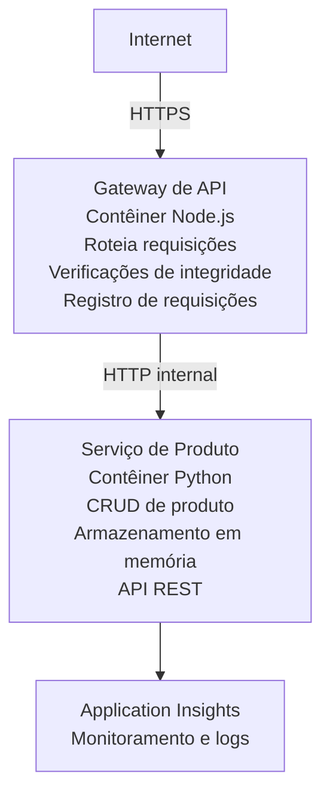

# Microservices Architecture - Container App Example

⏱️ **Estimated Time**: 25-35 minutes | 💰 **Estimated Cost**: ~$50-100/month | ⭐ **Complexity**: Advanced

Uma arquitetura de microsserviços **simplificada mas funcional** implantada no Azure Container Apps usando AZD CLI. Este exemplo demonstra comunicação entre serviços, orquestração de contêineres e monitoramento com uma configuração prática de 2 serviços.

> **📚 Abordagem de Aprendizado**: Este exemplo começa com uma arquitetura mínima de 2 serviços (API Gateway + Serviço Backend) que você pode realmente implantar e aprender. Depois de dominar essa base, fornecemos orientações para expandir para um ecossistema completo de microsserviços.

## O que você vai aprender

Ao completar este exemplo, você vai:
- Implantar múltiplos contêineres no Azure Container Apps
- Implementar comunicação entre serviços com rede interna
- Configurar escalonamento baseado em ambiente e verificações de integridade
- Monitorar aplicações distribuídas com Application Insights
- Entender padrões de implantação de microsserviços e melhores práticas
- Aprender expansão progressiva de arquiteturas simples para complexas

## Arquitetura

### Fase 1: O que estamos construindo (Incluído neste exemplo)


**Por que começar simples?**
- ✅ Implantar e entender rapidamente (25-35 minutos)
- ✅ Aprender padrões centrais de microsserviços sem complexidade
- ✅ Código funcional que você pode modificar e experimentar
- ✅ Custo menor para aprendizado (~$50-100/mês vs $300-1400/mês)
- ✅ Construir confiança antes de adicionar bancos de dados e filas de mensagens

**Analogia**: Pense nisso como aprender a dirigir. Você começa com um estacionamento vazio (2 serviços), domina o básico e depois progride para o trânsito da cidade (5+ serviços com bancos de dados).

### Fase 2: Expansão futura (Arquitetura de referência)

Uma vez que você dominar a arquitetura de 2 serviços, você pode expandir para:

```
Full Architecture (Not Included - For Reference)
├── API Gateway (✅ Included)
├── Product Service (✅ Included)
├── Order Service (🔜 Add next)
├── User Service (🔜 Add next)
├── Notification Service (🔜 Add last)
├── Azure Service Bus (🔜 For async communication)
├── Cosmos DB (🔜 For product persistence)
├── Azure SQL (🔜 For order management)
└── Azure Storage (🔜 For file storage)
```

Veja a seção "Expansion Guide" no final para instruções passo a passo.

## Recursos incluídos

✅ **Descoberta de Serviço**: Descoberta automática baseada em DNS entre contêineres  
✅ **Balanceamento de Carga**: Balanceamento de carga embutido entre réplicas  
✅ **Auto-escalonamento**: Escalonamento independente por serviço baseado em requisições HTTP  
✅ **Monitoramento de Integridade**: Probes de liveness e readiness para ambos os serviços  
✅ **Logging Distribuído**: Logging centralizado com Application Insights  
✅ **Rede Interna**: Comunicação segura serviço-a-serviço  
✅ **Orquestração de Contêineres**: Implantação e escalonamento automáticos  
✅ **Atualizações sem Downtime**: Atualizações rolling com gerenciamento de revisões  

## Pré-requisitos

### Ferramentas necessárias

Antes de começar, verifique se você tem estas ferramentas instaladas:

1. **[Azure Developer CLI (azd)](https://learn.microsoft.com/azure/developer/azure-developer-cli/install-azd)** (versão 1.0.0 ou superior)
   ```bash
   azd version
   # Saída esperada: azd versão 1.0.0 ou superior
   ```

2. **[Azure CLI](https://learn.microsoft.com/cli/azure/install-azure-cli)** (versão 2.50.0 ou superior)
   ```bash
   az --version
   # Saída esperada: azure-cli 2.50.0 ou superior
   ```

3. **[Docker](https://www.docker.com/get-started)** (para desenvolvimento/testes locais - opcional)
   ```bash
   docker --version
   # Saída esperada: Docker versão 20.10 ou superior
   ```

### Requisitos do Azure

- Uma **assinatura ativa do Azure** ([crie uma conta gratuita](https://azure.microsoft.com/free/))
- Permissões para criar recursos na sua assinatura
- Papel de **Contributor** na assinatura ou no grupo de recursos

### Conhecimentos necessários

Este é um exemplo de **nível avançado**. Você deve ter:
- Concluído o [Simple Flask API example](../../../../../examples/container-app/simple-flask-api) 
- Entendimento básico de arquitetura de microsserviços
- Familiaridade com APIs REST e HTTP
- Compreensão de conceitos de contêineres

**Novo no Container Apps?** Comece com o [Simple Flask API example](../../../../../examples/container-app/simple-flask-api) primeiro para aprender o básico.

## Início Rápido (Passo a Passo)

### Passo 1: Clone e navegue

```bash
git clone https://github.com/microsoft/AZD-for-beginners.git
cd AZD-for-beginners/examples/container-app/microservices
```

**✓ Verificação de sucesso**: Verifique se você vê `azure.yaml`:
```bash
ls
# Esperado: README.md, azure.yaml, infra/, src/
```

### Passo 2: Autenticar no Azure

```bash
azd auth login
```

Isso abre seu navegador para autenticação no Azure. Faça login com suas credenciais do Azure.

**✓ Verificação de sucesso**: Você deve ver:
```
Logged in to Azure.
```

### Passo 3: Inicializar o ambiente

```bash
azd init
```

**Prompts que você verá**:
- **Environment name**: Insira um nome curto (por exemplo, `microservices-dev`)
- **Azure subscription**: Selecione sua assinatura
- **Azure location**: Escolha uma região (por exemplo, `eastus`, `westeurope`)

**✓ Verificação de sucesso**: Você deve ver:
```
SUCCESS: New project initialized!
```

### Passo 4: Implantar infraestrutura e serviços

```bash
azd up
```

**O que acontece** (leva 8-12 minutos):
1. Cria o Container Apps environment
2. Cria o Application Insights para monitoramento
3. Constrói o container do API Gateway (Node.js)
4. Constrói o container do Product Service (Python)
5. Implanta ambos os contêineres no Azure
6. Configura networking e health checks
7. Configura monitoramento e logging

**✓ Verificação de sucesso**: Você deve ver:
```
SUCCESS: Your application was deployed to Azure in X minutes Y seconds.
Endpoint: https://api-gateway-<unique-id>.azurecontainerapps.io
```

**⏱️ Tempo**: 8-12 minutos

### Passo 5: Testar a implantação

```bash
# Obter o endpoint do gateway
GATEWAY_URL=$(azd env get-values | grep API_GATEWAY_URL | cut -d '=' -f2 | tr -d '"')

# Testar a saúde do API Gateway
curl $GATEWAY_URL/health

# Saída esperada:
# {"status":"saudável","service":"api-gateway","timestamp":"2025-11-19T10:30:00Z"}
```

**Teste o serviço de produtos através do gateway**:
```bash
# Listar produtos
curl $GATEWAY_URL/api/products

# Saída esperada:
# [
#   {"id":1,"name":"Notebook","price":999.99,"stock":50},
#   {"id":2,"name":"Mouse","price":29.99,"stock":200},
#   {"id":3,"name":"Teclado","price":79.99,"stock":150}
# ]
```

**✓ Verificação de sucesso**: Ambos os endpoints retornam dados JSON sem erros.

---

**🎉 Parabéns!** Você implantou uma arquitetura de microsserviços no Azure!

## Estrutura do projeto

Todos os arquivos de implementação estão incluídos—este é um exemplo completo e funcional:

```
microservices/
│
├── README.md                         # This file
├── azure.yaml                        # AZD configuration
├── .gitignore                        # Git ignore patterns
│
├── infra/                           # Infrastructure as Code (Bicep)
│   ├── main.bicep                   # Main orchestration
│   ├── abbreviations.json           # Naming conventions
│   ├── core/                        # Shared infrastructure
│   │   ├── container-apps-environment.bicep  # Container environment + registry
│   │   └── monitor.bicep            # Application Insights + Log Analytics
│   └── app/                         # Service definitions
│       ├── api-gateway.bicep        # API Gateway container app
│       └── product-service.bicep    # Product Service container app
│
└── src/                             # Application source code
    ├── api-gateway/                 # Node.js API Gateway
    │   ├── app.js                   # Express server with routing
    │   ├── package.json             # Node dependencies
    │   └── Dockerfile               # Container definition
    └── product-service/             # Python Product Service
        ├── main.py                  # Flask API with product data
        ├── requirements.txt         # Python dependencies
        └── Dockerfile               # Container definition
```

**O que cada componente faz:**

**Infrastructure (infra/)**:
- `main.bicep`: Orquestra todos os recursos do Azure e suas dependências
- `core/container-apps-environment.bicep`: Cria o Container Apps environment e o Azure Container Registry
- `core/monitor.bicep`: Configura o Application Insights para logging distribuído
- `app/*.bicep`: Definições individuais de container app com escalonamento e health checks

**API Gateway (src/api-gateway/)**:
- Serviço público que roteia requisições para serviços backend
- Implementa logging, tratamento de erros e encaminhamento de requisições
- Demonstra comunicação HTTP serviço-a-serviço

**Product Service (src/product-service/)**:
- Serviço interno com catálogo de produtos (in-memory para simplicidade)
- API REST com health checks
- Exemplo de padrão de microsserviço backend

## Visão Geral dos Serviços

### API Gateway (Node.js/Express)

**Porta**: 8080  
**Acesso**: Público (ingress externo)  
**Objetivo**: Roteia requisições recebidas para serviços backend apropriados  

**Endpoints**:
- `GET /` - Informações do serviço
- `GET /health` - Endpoint de verificação de integridade
- `GET /api/products` - Encaminha para o product service (lista todos)
- `GET /api/products/:id` - Encaminha para o product service (buscar por ID)

**Principais recursos**:
- Roteamento de requisições com axios
- Logging centralizado
- Tratamento de erros e gerenciamento de timeout
- Descoberta de serviço via variáveis de ambiente
- Integração com Application Insights

**Destaque do código** (`src/api-gateway/app.js`):
```javascript
// Comunicação interna do serviço
app.get('/api/products', async (req, res) => {
  const response = await axios.get(`${PRODUCT_SERVICE_URL}/products`);
  res.json(response.data);
});
```

### Product Service (Python/Flask)

**Porta**: 8000  
**Acesso**: Somente interno (sem ingress externo)  
**Objetivo**: Gera o catálogo de produtos com dados em memória  

**Endpoints**:
- `GET /` - Informações do serviço
- `GET /health` - Endpoint de verificação de integridade
- `GET /products` - Lista todos os produtos
- `GET /products/<id>` - Obtém produto por ID

**Principais recursos**:
- API RESTful com Flask
- Armazenamento de produtos em memória (simples, sem banco de dados)
- Monitoramento de integridade com probes
- Logging estruturado
- Integração com Application Insights

**Modelo de dados**:
```python
{
  "id": 1,
  "name": "Laptop",
  "description": "High-performance laptop",
  "price": 999.99,
  "stock": 50
}
```

**Por que apenas interno?**
O product service não é exposto publicamente. Todas as requisições devem passar pelo API Gateway, que fornece:
- Segurança: Ponto de acesso controlado
- Flexibilidade: Pode alterar o backend sem afetar clientes
- Monitoramento: Logging centralizado de requisições

## Entendendo a comunicação entre serviços

### Como os serviços se comunicam

Neste exemplo, o API Gateway se comunica com o Product Service usando **chamadas HTTP internas**:

```javascript
// Gateway de API (src/api-gateway/app.js)
const PRODUCT_SERVICE_URL = process.env.PRODUCT_SERVICE_URL;

// Fazer requisição HTTP interna
const response = await axios.get(`${PRODUCT_SERVICE_URL}/products`);
```

**Pontos principais**:

1. **Descoberta baseada em DNS**: Container Apps fornece automaticamente DNS para serviços internos
   - Product Service FQDN: `product-service.internal.<environment>.azurecontainerapps.io`
   - Simplificado como: `http://product-service` (Container Apps resolve isso)

2. **Sem exposição pública**: Product Service tem `external: false` no Bicep
   - Acessível apenas dentro do Container Apps environment
   - Não pode ser alcançado pela internet

3. **Variáveis de ambiente**: URLs dos serviços são injetadas no momento da implantação
   - Bicep passa o FQDN interno para o gateway
   - Sem URLs codificadas no código da aplicação

**Analogia**: Pense nisso como salas de escritório. O API Gateway é a recepção (público), e o Product Service é uma sala de escritório (somente interna). Visitantes devem passar pela recepção para alcançar qualquer escritório.

## Opções de implantação

### Implantação completa (Recomendada)

```bash
# Implantar a infraestrutura e ambos os serviços
azd up
```

Isso implanta:
1. Container Apps environment
2. Application Insights
3. Container Registry
4. Container do API Gateway
5. Container do Product Service

**Tempo**: 8-12 minutos

### Implantar serviço individual

```bash
# Implantar apenas um serviço (após o azd up inicial)
azd deploy api-gateway

# Ou implante o serviço de produto
azd deploy product-service
```

**Caso de uso**: Quando você atualizou o código em um serviço e quer reimplantá-lo somente.

### Atualizar configuração

```bash
# Alterar parâmetros de dimensionamento
azd env set GATEWAY_MAX_REPLICAS 30

# Reimplantar com nova configuração
azd up
```

## Configuração

### Configuração de escalonamento

Ambos os serviços estão configurados com autoscaling baseado em HTTP nos arquivos Bicep:

**API Gateway**:
- Réplicas mínimas: 2 (sempre pelo menos 2 para disponibilidade)
- Réplicas máximas: 20
- Gatilho de escala: 50 requisições concorrentes por réplica

**Product Service**:
- Réplicas mínimas: 1 (pode escalar para zero se necessário)
- Réplicas máximas: 10
- Gatilho de escala: 100 requisições concorrentes por réplica

**Personalizar escalonamento** (em `infra/app/*.bicep`):
```bicep
scale: {
  minReplicas: 1
  maxReplicas: 10
  rules: [
    {
      name: 'http-scale-rule'
      http: {
        metadata: {
          concurrentRequests: '100'  // Adjust this
        }
      }
    }
  ]
}
```

### Alocação de recursos

**API Gateway**:
- CPU: 1.0 vCPU
- Memória: 2 GiB
- Motivo: Lida com todo o tráfego externo

**Product Service**:
- CPU: 0.5 vCPU
- Memória: 1 GiB
- Motivo: Operações leves em memória

### Verificações de integridade

Ambos os serviços incluem probes de liveness e readiness:

```bicep
probes: [
  {
    type: 'Liveness'
    httpGet: {
      path: '/health'
      port: 8080
    }
    initialDelaySeconds: 10
    periodSeconds: 30
  }
  {
    type: 'Readiness'
    httpGet: {
      path: '/health'
      port: 8080
    }
    initialDelaySeconds: 5
    periodSeconds: 10
  }
]
```

**O que isso significa**:
- **Liveness**: Se a verificação falhar, o Container Apps reinicia o contêiner
- **Readiness**: Se não estiver pronto, o Container Apps para de rotear tráfego para essa réplica


## Monitoramento e Observabilidade

### Visualizar logs do serviço

```bash
# Visualize logs usando azd monitor
azd monitor --logs

# Ou use o Azure CLI para Container Apps específicos:
# Transmita logs do API Gateway
az containerapp logs show --name api-gateway --resource-group $RG_NAME --follow

# Visualize os logs recentes do serviço de produto
az containerapp logs show --name product-service --resource-group $RG_NAME --tail 100
```

**Saída esperada**:
```
[api-gateway] API Gateway listening on port 8080
[api-gateway] Product Service URL: http://product-service
[api-gateway] GET /api/products 200 - 45ms
[product-service] Retrieved 5 products
```

### Consultas do Application Insights

Acesse o Application Insights no Azure Portal, então execute essas consultas:

**Encontrar requisições lentas**:
```kusto
requests
| where timestamp > ago(1h)
| where duration > 1000  // Requests taking >1 second
| summarize count() by name, cloud_RoleName
| order by count_ desc
```

**Rastrear chamadas serviço-a-serviço**:
```kusto
dependencies
| where timestamp > ago(1h)
| where type == "Http"
| project timestamp, name, target, duration, success
| order by timestamp desc
```

**Taxa de erros por serviço**:
```kusto
exceptions
| where timestamp > ago(24h)
| summarize errorCount = count() by cloud_RoleName, type
| order by errorCount desc
```

**Volume de requisições ao longo do tempo**:
```kusto
requests
| where timestamp > ago(1h)
| summarize requestCount = count() by bin(timestamp, 5m), cloud_RoleName
| render timechart
```

### Acessar painel de monitoramento

```bash
# Obter detalhes do Application Insights
azd env get-values | grep APPLICATIONINSIGHTS

# Abrir o monitoramento no Azure Portal
az monitor app-insights component show \
  --app $(azd env get-values | grep APPLICATIONINSIGHTS_CONNECTION_STRING | cut -d '=' -f2) \
  --resource-group $(azd env get-values | grep AZURE_RESOURCE_GROUP | cut -d '=' -f2) \
  --query "appId" -o tsv
```

### Métricas em tempo real

1. Navegue até o Application Insights no Azure Portal
2. Clique em "Live Metrics"
3. Veja requisições, falhas e desempenho em tempo real
4. Teste executando: `curl $(azd env get-values | grep API_GATEWAY_URL | cut -d '=' -f2 | tr -d '"')/api/products`

## Exercícios práticos

[Note: See full exercises above in the "Practical Exercises" section for detailed step-by-step exercises including deployment verification, data modification, autoscaling tests, error handling, and adding a third service.]

## Análise de custos

### Custos mensais estimados (para este exemplo de 2 serviços)

| Resource | Configuration | Estimated Cost |
|----------|--------------|----------------|
| API Gateway | 2-20 replicas, 1 vCPU, 2GB RAM | $30-150 |
| Product Service | 1-10 replicas, 0.5 vCPU, 1GB RAM | $15-75 |
| Container Registry | Basic tier | $5 |
| Application Insights | 1-2 GB/month | $5-10 |
| Log Analytics | 1 GB/month | $3 |
| **Total** | | **$58-243/month** |

**Divisão de custo por uso**:
- **Tráfego leve** (teste/aprendizado): ~$60/mês
- **Tráfego moderado** (pequena produção): ~$120/mês
- **Tráfego alto** (períodos movimentados): ~$240/mês

### Dicas de otimização de custos

1. **Escalar para zero em desenvolvimento**:
   ```bicep
   scale: {
     minReplicas: 0  // Save $30-40/month when not in use
     maxReplicas: 10
   }
   ```

2. **Use o Consumption Plan para o Cosmos DB** (quando você adicioná-lo):
   - Pague apenas pelo que você usa
   - Sem cobrança mínima

3. **Defina sampling no Application Insights**:
   ```javascript
   appInsights.defaultClient.config.samplingPercentage = 50; // Amostre 50% das solicitações
   ```

4. **Remova recursos quando não precisar**:
   ```bash
   azd down
   ```

### Opções de camada gratuita

Para aprendizado/testes, considere:
- Use créditos gratuitos do Azure (primeiros 30 dias)
- Mantenha o mínimo de réplicas
- Exclua após os testes (sem cobranças contínuas)

---

## Limpeza

Para evitar cobranças contínuas, exclua todos os recursos:

```bash
azd down --force --purge
```

**Prompt de Confirmação**:
```
? Total resources to delete: 6, are you sure you want to continue? (y/N)
```

Digite `y` para confirmar.

**O Que Será Excluído**:
- Container Apps Environment
- Ambos Container Apps (gateway & product service)
- Container Registry
- Application Insights
- Log Analytics Workspace
- Resource Group

**✓ Verificar Limpeza**:
```bash
az group list --query "[?starts_with(name,'rg-microservices')]" --output table
```

Deve retornar vazio.

---

## Guia de Expansão: De 2 para 5+ Serviços

Depois de dominar esta arquitetura de 2 serviços, veja como expandir:

### Fase 1: Adicionar Persistência de Banco de Dados (Próximo Passo)

**Adicionar Cosmos DB para o Serviço de Produto**:

1. Crie `infra/core/cosmos.bicep`:
   ```bicep
   resource cosmosAccount 'Microsoft.DocumentDB/databaseAccounts@2023-04-15' = {
     name: name
     location: location
     kind: 'GlobalDocumentDB'
     properties: {
       databaseAccountOfferType: 'Standard'
       locations: [{ locationName: location, failoverPriority: 0 }]
     }
   }
   ```

2. Atualize o serviço de produto para usar o Cosmos DB em vez de dados em memória

3. Custo adicional estimado: ~US$25/mês (serverless)

### Fase 2: Adicionar Terceiro Serviço (Gerenciamento de Pedidos)

**Criar Serviço de Pedidos**:

1. Nova pasta: `src/order-service/` (Python/Node.js/C#)
2. Novo Bicep: `infra/app/order-service.bicep`
3. Atualize o API Gateway para rotear `/api/orders`
4. Adicione Azure SQL Database para persistência de pedidos

**Arquitetura passa a ser**:
```
API Gateway → Product Service (Cosmos DB)
           → Order Service (Azure SQL)
```

### Fase 3: Adicionar Comunicação Assíncrona (Service Bus)

**Implemente Arquitetura Orientada a Eventos**:

1. Adicione Azure Service Bus: `infra/core/servicebus.bicep`
2. O Serviço de Produto publica eventos "ProductCreated"
3. O Serviço de Pedidos se inscreve em eventos de produto
4. Adicione Serviço de Notificações para processar eventos

**Padrão**: Requisição/Resposta (HTTP) + Orientado a Eventos (Service Bus)

### Fase 4: Adicionar Autenticação de Usuário

**Implementar Serviço de Usuário**:

1. Crie `src/user-service/` (Go/Node.js)
2. Adicione Azure AD B2C ou autenticação JWT personalizada
3. API Gateway valida tokens
4. Serviços verificam permissões de usuário

### Fase 5: Preparação para Produção

**Adicione estes Componentes**:
- Azure Front Door (balanceamento de carga global)
- Azure Key Vault (gerenciamento de segredos)
- Azure Monitor Workbooks (dashboards personalizados)
- CI/CD Pipeline (GitHub Actions)
- Implantações Blue-Green
- Managed Identity para todos os serviços

**Custo da Arquitetura Completa para Produção**: ~US$300-1.400/mês

---

## Saiba Mais

### Documentação Relacionada
- [Documentação do Azure Container Apps](https://learn.microsoft.com/azure/container-apps/)
- [Guia de Arquitetura de Microsserviços](https://learn.microsoft.com/azure/architecture/guide/architecture-styles/microservices)
- [Application Insights para Rastreamento Distribuído](https://learn.microsoft.com/azure/azure-monitor/app/distributed-tracing)
- [Documentação do Azure Developer CLI](https://learn.microsoft.com/azure/developer/azure-developer-cli/)

### Próximos Passos neste Curso
- ← Anterior: [Simple Flask API](../../../../../examples/container-app/simple-flask-api) - Exemplo iniciante de contêiner único
- → Próximo: [Guia de Integração com IA](../../../../../examples/docs/ai-foundry) - Adicionar capacidades de IA
- 🏠 [Início do Curso](../../README.md)

### Comparação: Quando Usar Cada Um

**Aplicativo de Contêiner Único** (exemplo API Flask Simples):
- ✅ Aplicações simples
- ✅ Arquitetura monolítica
- ✅ Rápido de implantar
- ❌ Escalabilidade limitada
- **Custo**: ~US$15-50/mês

**Microsserviços** (Este exemplo):
- ✅ Aplicações complexas
- ✅ Escalonamento independente por serviço
- ✅ Autonomia de equipe (serviços diferentes, equipes diferentes)
- ❌ Mais complexo de gerenciar
- **Custo**: ~US$60-250/mês

**Kubernetes (AKS)**:
- ✅ Máximo controle e flexibilidade
- ✅ Portabilidade multi-cloud
- ✅ Redes avançadas
- ❌ Requer expertise em Kubernetes
- **Custo**: ~US$150-500/mês mínimo

**Recomendação**: Comece com Container Apps (este exemplo); migre para AKS apenas se precisar de recursos específicos do Kubernetes.

---

## Perguntas Frequentes

**Q: Por que somente 2 serviços em vez de 5+?**  
A: Progressão educacional. Domine os fundamentos (comunicação entre serviços, monitoramento, escalonamento) com um exemplo simples antes de adicionar complexidade. Os padrões que você aprende aqui se aplicam a arquiteturas com 100 serviços.

**Q: Posso adicionar mais serviços sozinho?**  
A: Com certeza! Siga o guia de expansão acima. Cada novo serviço segue o mesmo padrão: crie a pasta src, crie o arquivo Bicep, atualize azure.yaml, faça o deploy.

**Q: Isso está pronto para produção?**  
A: É uma base sólida. Para produção, adicione: managed identity, Key Vault, bancos de dados persistentes, pipeline CI/CD, alertas de monitoramento e estratégia de backup.

**Q: Por que não usar Dapr ou outro service mesh?**  
A: Mantenha simples para aprendizado. Depois de entender o networking nativo do Container Apps, você pode adicionar Dapr para cenários avançados.

**Q: Como faço para depurar localmente?**  
A: Execute os serviços localmente com Docker:
```bash
cd src/api-gateway
docker build -t local-gateway .
docker run -p 8080:8080 -e PRODUCT_SERVICE_URL=http://localhost:8000 local-gateway
```

**Q: Posso usar linguagens de programação diferentes?**  
A: Sim! Este exemplo mostra Node.js (gateway) + Python (serviço de produto). Você pode misturar quaisquer linguagens que rodem em contêineres.

**Q: E se eu não tiver créditos do Azure?**  
A: Use a camada gratuita do Azure (primeiros 30 dias para contas novas) ou faça deploy por períodos curtos de teste e exclua imediatamente.

---

> **🎓 Resumo do Caminho de Aprendizado**: Você aprendeu a implantar uma arquitetura multi-serviço com escalonamento automático, rede interna, monitoramento centralizado e padrões prontos para produção. Esta base prepara você para sistemas distribuídos complexos e arquiteturas de microsserviços corporativas.
> 
> **📚 Navegação do Curso:**
> - ← Anterior: [Simple Flask API](../../../../../examples/container-app/simple-flask-api)
> - → Próximo: [Exemplo de Integração com Banco de Dados](../../../../../examples/database-app)
> - 🏠 [Início do Curso](../../../README.md)
> - 📖 [Melhores Práticas do Container Apps](../../../docs/chapter-04-infrastructure/deployment-guide.md)

---

<!-- CO-OP TRANSLATOR DISCLAIMER START -->
**Isenção de responsabilidade**:
Este documento foi traduzido usando o serviço de tradução por IA [Co-op Translator](https://github.com/Azure/co-op-translator). Embora nos esforcemos pela precisão, esteja ciente de que traduções automáticas podem conter erros ou imprecisões. O documento original, em seu idioma nativo, deve ser considerado a fonte autoritativa. Para informações críticas, recomenda-se tradução profissional realizada por tradutores humanos. Não nos responsabilizamos por quaisquer mal-entendidos ou interpretações equivocadas decorrentes do uso desta tradução.
<!-- CO-OP TRANSLATOR DISCLAIMER END -->