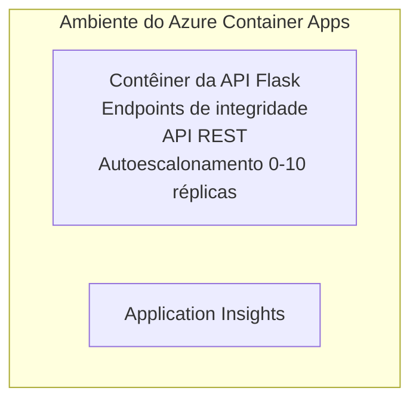

# Simple Flask API - Exemplo de Aplicativo em Container

**Caminho de Aprendizagem:** Iniciante ⭐ | **Tempo:** 25-35 minutos | **Custo:** $0-15/month

Uma API REST em Python com Flask completa e funcional implantada no Azure Container Apps usando o Azure Developer CLI (azd). Este exemplo demonstra implantação de container, escala automática e conceitos básicos de monitoramento.

## 🎯 O que você vai aprender

- Implantar uma aplicação Python conteinerizada no Azure
- Configurar escala automática com escala para zero
- Implementar sondas de integridade e verificações de prontidão
- Monitorar logs e métricas da aplicação
- Usar o Azure Developer CLI para implantação rápida

## 📦 O que está incluído

✅ **Aplicação Flask** - API REST completa com operações CRUD (`src/app.py`)  
✅ **Dockerfile** - Configuração de container pronta para produção  
✅ **Infraestrutura em Bicep** - Ambiente de Container Apps e implantação da API  
✅ **Configuração AZD** - Configuração para implantação com um comando  
✅ **Sondas de Integridade** - Verificações de liveness e readiness configuradas  
✅ **Escalabilidade automática** - 0-10 réplicas com base na carga HTTP  

## Arquitetura



## Pré-requisitos

### Obrigatório
- **Azure Developer CLI (azd)** - [Guia de instalação](https://learn.microsoft.com/azure/developer/azure-developer-cli/install-azd)
- **Assinatura do Azure** - [Conta gratuita](https://azure.microsoft.com/free/)
- **Docker Desktop** - [Instalar Docker](https://www.docker.com/products/docker-desktop/) (para testes locais)

### Verificar pré-requisitos

```bash
# Verifique a versão do azd (precisa ser 1.5.0 ou superior)
azd version

# Verifique o login no Azure
azd auth login

# Verifique o Docker (opcional, para testes locais)
docker --version
```

## ⏱️ Cronograma de Implantação

| Fase | Duração | O que acontece |
|-------|----------|--------------||
| Environment setup | 30 segundos | Criar ambiente azd |
| Build container | 2-3 minutos | Build Docker da aplicação Flask |
| Provision infrastructure | 3-5 minutos | Criar Container Apps, registro e monitoramento |
| Deploy application | 2-3 minutos | Enviar imagem e implantar no Container Apps |
| **Total** | **8-12 minutos** | Implantação completa pronta |

## Início Rápido

```bash
# Navegue até o exemplo
cd examples/container-app/simple-flask-api

# Inicialize o ambiente (escolha um nome único)
azd env new myflaskapi

# Implante tudo (infraestrutura + aplicação)
azd up
# Você será solicitado a:
# 1. Selecione a assinatura do Azure
# 2. Escolha a região (por exemplo, eastus2)
# 3. Aguarde 8-12 minutos para a implantação

# Obtenha o endpoint da sua API
azd env get-values

# Teste a API
curl $(azd env get-value API_ENDPOINT)/health
```

**Saída Esperada:**
```json
{
  "status": "healthy",
  "timestamp": "2025-11-19T10:30:00Z",
  "service": "simple-flask-api",
  "version": "1.0.0"
}
```

## ✅ Verificar Implantação

### Passo 1: Verificar status da implantação

```bash
# Ver serviços implantados
azd show

# A saída esperada mostra:
# - Serviço: api
# - Endpoint: https://ca-api-[env].xxx.azurecontainerapps.io
# - Status: Em execução
```

### Passo 2: Testar endpoints da API

```bash
# Obter endpoint da API
API_URL=$(azd env get-value API_ENDPOINT)

# Testar saúde
curl $API_URL/health

# Testar endpoint raiz
curl $API_URL/

# Criar um item
curl -X POST $API_URL/api/items \
  -H "Content-Type: application/json" \
  -d '{"name": "Test Item", "description": "My first item"}'

# Obter todos os itens
curl $API_URL/api/items
```

**Critérios de Sucesso:**
- ✅ O endpoint `/health` retorna HTTP 200
- ✅ O endpoint raiz mostra informações da API
- ✅ POST cria item e retorna HTTP 201
- ✅ GET retorna itens criados

### Passo 3: Visualizar logs

```bash
# Transmita logs em tempo real usando azd monitor
azd monitor --logs

# Ou use o Azure CLI:
az containerapp logs show --name api --resource-group $RG_NAME --follow

# Você deve ver:
# - Mensagens de inicialização do Gunicorn
# - Logs de requisições HTTP
# - Logs de informações da aplicação
```

## Estrutura do Projeto

```
simple-flask-api/
├── azure.yaml              # AZD configuration
├── infra/
│   ├── main.bicep         # Main infrastructure
│   ├── main.parameters.json
│   └── app/
│       ├── container-env.bicep
│       └── api.bicep
└── src/
    ├── app.py             # Flask application
    ├── requirements.txt
    └── Dockerfile
```

## Endpoints da API

| Endpoint | Método | Descrição |
|----------|--------|-------------|
| `/health` | GET | Verificação de integridade |
| `/api/items` | GET | Listar todos os itens |
| `/api/items` | POST | Criar novo item |
| `/api/items/{id}` | GET | Obter item específico |
| `/api/items/{id}` | PUT | Atualizar item |
| `/api/items/{id}` | DELETE | Excluir item |

## Configuração

### Variáveis de Ambiente

```bash
# Definir configuração personalizada
azd env set PORT 8000
azd env set LOG_LEVEL info
azd env set MAX_REPLICAS 20
```

### Configuração de Escalonamento

A API escala automaticamente com base no tráfego HTTP:
- **Mínimo de Réplicas**: 0 (escala para zero quando ociosa)
- **Máximo de Réplicas**: 10
- **Requisições simultâneas por réplica**: 50

## Desenvolvimento

### Executar Localmente

```bash
# Instalar dependências
cd src
pip install -r requirements.txt

# Executar o aplicativo
python app.py

# Testar localmente
curl http://localhost:8000/health
```

### Construir e testar o container

```bash
# Construir imagem Docker
docker build -t flask-api:local ./src

# Executar contêiner localmente
docker run -p 8000:8000 flask-api:local

# Testar contêiner
curl http://localhost:8000/health
```

## Implantação

### Implantação Completa

```bash
# Implantar a infraestrutura e a aplicação
azd up
```

### Implantação Apenas do Código

```bash
# Implantar apenas o código da aplicação (infraestrutura inalterada)
azd deploy api
```

### Atualizar Configuração

```bash
# Atualizar variáveis de ambiente
azd env set API_KEY "new-api-key"

# Reimplantar com nova configuração
azd deploy api
```

## Monitoramento

### Visualizar Logs

```bash
# Transmitir logs ao vivo usando azd monitor
azd monitor --logs

# Ou use o Azure CLI para Container Apps:
az containerapp logs show --name api --resource-group $RG_NAME --follow

# Ver as últimas 100 linhas
az containerapp logs show --name api --resource-group $RG_NAME --tail 100
```

### Monitorar Métricas

```bash
# Abrir o painel do Azure Monitor
azd monitor --overview

# Exibir métricas específicas
az monitor metrics list \
  --resource $(azd show --output json | jq -r '.services.api.resourceId') \
  --metric "Requests,ResponseTime"
```

## Testes

### Verificação de Integridade

```bash
curl $(azd show --output json | jq -r '.services.api.endpoint')/health
```

Resposta esperada:
```json
{
  "status": "healthy",
  "timestamp": "2025-11-19T10:30:00Z"
}
```

### Criar Item

```bash
curl -X POST $(azd show --output json | jq -r '.services.api.endpoint')/api/items \
  -H "Content-Type: application/json" \
  -d '{"name": "Test Item", "description": "A test item"}'
```

### Obter Todos os Itens

```bash
curl $(azd show --output json | jq -r '.services.api.endpoint')/api/items
```

## Otimização de Custos

Esta implantação usa escala para zero, portanto você paga apenas quando a API estiver processando solicitações:

- **Custo ocioso**: ~$0/month (escala para zero)
- **Custo ativo**: ~$0.000024/segundo por réplica
- **Custo mensal estimado** (uso leve): $5-15

### Reduzir Custos Ainda Mais

```bash
# Reduzir o número máximo de réplicas para desenvolvimento
azd env set MAX_REPLICAS 3

# Use um tempo limite de inatividade menor
azd env set SCALE_TO_ZERO_TIMEOUT 300  # 5 minutos
```

## Solução de Problemas

### O Container não inicia

```bash
# Verificar os logs do contêiner usando a CLI do Azure
az containerapp logs show --name api --resource-group $RG_NAME --tail 100

# Verificar se a imagem Docker é construída localmente
docker build -t test ./src
```

### API não acessível

```bash
# Verificar se o Ingress é externo
az containerapp show --name api --resource-group rg-simple-flask-api \
  --query properties.configuration.ingress.external
```

### Tempos de resposta altos

```bash
# Verificar o uso de CPU/memória
az monitor metrics list \
  --resource $(azd show --output json | jq -r '.services.api.resourceId') \
  --metric "CPUPercentage,MemoryPercentage"

# Aumentar recursos se necessário
az containerapp update --name api --resource-group rg-simple-flask-api \
  --cpu 1.0 --memory 2Gi
```

## Limpeza

```bash
# Excluir todos os recursos
azd down --force --purge
```

## Próximos Passos

### Expanda Este Exemplo

1. **Adicionar Banco de Dados** - Integrar Azure Cosmos DB ou SQL Database
   ```bash
   # Adicionar módulo do Cosmos DB em infra/main.bicep
   # Atualizar app.py com a conexão ao banco de dados
   ```

2. **Adicionar Autenticação** - Implementar Microsoft Entra ID ou chaves de API
   ```python
   # Adicionar middleware de autenticação ao app.py
   from functools import wraps
   ```

3. **Configurar CI/CD** - Workflow do GitHub Actions
   ```yaml
   # Create .github/workflows/deploy.yml
   name: Deploy to Azure
   on: [push]
   ```

4. **Adicionar Managed Identity** - Proteger acesso aos serviços do Azure
   ```bicep
   # Update infra/app/api.bicep
   identity: { type: 'SystemAssigned' }
   ```

### Exemplos Relacionados

- **[Database App](../../../../../examples/database-app)** - Exemplo completo com SQL Database
- **[Microservices](../../../../../examples/container-app/microservices)** - Arquitetura com múltiplos serviços
- **[Container Apps Master Guide](../README.md)** - Todos os padrões de container

### Recursos de Aprendizagem

- 📚 [AZD For Beginners Course](../../../README.md) - Página principal do curso
- 📚 [Container Apps Patterns](../README.md) - Mais padrões de implantação
- 📚 [AZD Templates Gallery](https://azure.github.io/awesome-azd/) - Modelos da comunidade

## Recursos Adicionais

### Documentação
- **[Flask Documentation](https://flask.palletsprojects.com/)** - Guia do framework Flask
- **[Azure Container Apps](https://learn.microsoft.com/azure/container-apps/)** - Documentação oficial do Azure
- **[Azure Developer CLI](https://learn.microsoft.com/azure/developer/azure-developer-cli/)** - Referência de comandos azd

### Tutoriais
- **[Container Apps Quickstart](https://learn.microsoft.com/azure/container-apps/quickstart-portal)** - Implante seu primeiro app
- **[Python on Azure](https://learn.microsoft.com/azure/developer/python/)** - Guia de desenvolvimento em Python
- **[Bicep Language](https://learn.microsoft.com/azure/azure-resource-manager/bicep/)** - Infraestrutura como código

### Ferramentas
- **[Azure Portal](https://portal.azure.com)** - Gerenciar recursos visualmente
- **[VS Code Azure Extension](https://marketplace.visualstudio.com/items?itemName=ms-azuretools.vscode-azurecontainerapps)** - Integração com IDE

---

**🎉 Parabéns!** Você implantou uma API Flask pronta para produção no Azure Container Apps com escala automática e monitoramento.

**Dúvidas?** [Abra uma issue](https://github.com/microsoft/AZD-for-beginners/issues) ou consulte o [FAQ](../../../resources/faq.md)

---

<!-- CO-OP TRANSLATOR DISCLAIMER START -->
**Aviso Legal**:
Este documento foi traduzido usando o serviço de tradução por IA [Co-op Translator](https://github.com/Azure/co-op-translator). Embora nos esforcemos pela precisão, por favor, esteja ciente de que traduções automatizadas podem conter erros ou imprecisões. O documento original em seu idioma nativo deve ser considerado a fonte autorizada. Para informações críticas, recomenda-se tradução profissional humana. Não nos responsabilizamos por quaisquer mal-entendidos ou interpretações incorretas decorrentes do uso desta tradução.
<!-- CO-OP TRANSLATOR DISCLAIMER END -->