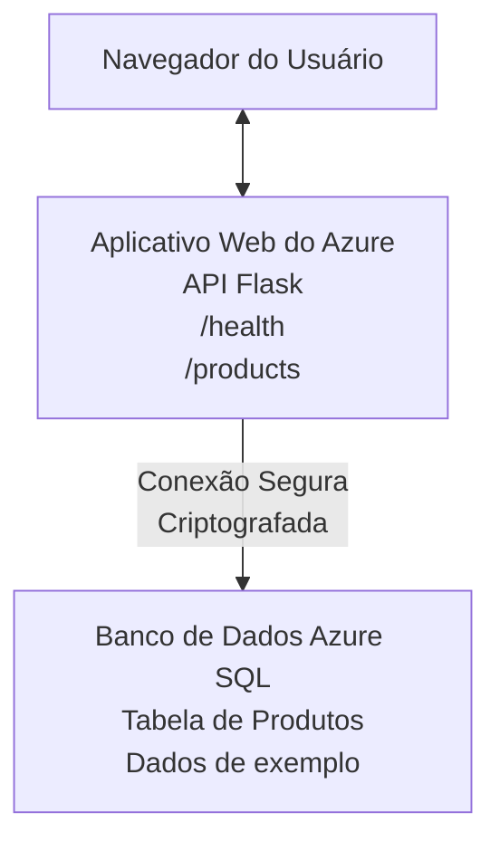

# Deploying a Microsoft SQL Database and Web App with AZD

⏱️ **Tempo Estimado**: 20-30 minutos | 💰 **Custo Estimado**: ~$15-25/mês | ⭐ **Complexidade**: Intermediário

Este **exemplo completo e funcional** demonstra como usar o [Azure Developer CLI (azd)](https://learn.microsoft.com/azure/developer/azure-developer-cli/) para implantar uma aplicação web Python Flask com um Microsoft SQL Database no Azure. Todo o código está incluído e testado—sem dependências externas necessárias.

## O que Você Vai Aprender

Ao concluir este exemplo, você irá:
- Implantar uma aplicação em múltiplas camadas (web app + banco de dados) usando infraestrutura como código
- Configurar conexões seguras ao banco de dados sem codificar segredos
- Monitorar a saúde da aplicação com Application Insights
- Gerenciar recursos do Azure de forma eficiente com o AZD CLI
- Seguir as melhores práticas do Azure para segurança, otimização de custos e observabilidade

## Visão Geral do Cenário
- **Web App**: API REST Python Flask com conectividade ao banco de dados
- **Database**: Azure SQL Database com dados de exemplo
- **Infraestrutura**: Provisionada usando Bicep (templates modulares e reutilizáveis)
- **Implantação**: Totalmente automatizada com comandos `azd`
- **Monitoramento**: Application Insights para logs e telemetria

## Pré-requisitos

### Ferramentas Necessárias

Antes de começar, verifique se você tem estas ferramentas instaladas:

1. **[Azure CLI](https://learn.microsoft.com/cli/azure/install-azure-cli)** (versão 2.50.0 ou superior)
   ```sh
   az --version
   # Saída esperada: azure-cli 2.50.0 ou superior
   ```

2. **[Azure Developer CLI (azd)](https://learn.microsoft.com/azure/developer/azure-developer-cli/install-azd)** (versão 1.0.0 ou superior)
   ```sh
   azd version
   # Saída esperada: azd versão 1.0.0 ou superior
   ```

3. **[Python 3.8+](https://www.python.org/downloads/)** (para desenvolvimento local)
   ```sh
   python --version
   # Saída esperada: Python 3.8 ou superior
   ```

4. **[Docker](https://www.docker.com/get-started)** (opcional, para desenvolvimento local em contêiner)
   ```sh
   docker --version
   # Saída esperada: Docker versão 20.10 ou superior
   ```

### Requisitos do Azure

- Uma **assinatura do Azure** ativa ([crie uma conta gratuita](https://azure.microsoft.com/free/))
- Permissões para criar recursos na sua assinatura
- Papel de **Owner** ou **Contributor** na assinatura ou no grupo de recursos

### Pré-requisitos de Conhecimento

Este é um exemplo de nível **intermediário**. Você deve estar familiarizado com:
- Operações básicas de linha de comando
- Conceitos fundamentais de nuvem (recursos, grupos de recursos)
- Noções básicas de aplicações web e bancos de dados

**Novo no AZD?** Comece pelo [Getting Started guide](../../docs/chapter-01-foundation/azd-basics.md) primeiro.

## Arquitetura

Este exemplo implanta uma arquitetura de duas camadas com uma aplicação web e um banco de dados SQL:



**Implantação de Recursos:**
- **Resource Group**: Contêiner para todos os recursos
- **App Service Plan**: Hospedagem baseada em Linux (camada B1 para eficiência de custo)
- **Web App**: Runtime Python 3.11 com aplicação Flask
- **SQL Server**: Servidor de banco de dados gerenciado com TLS 1.2 mínimo
- **SQL Database**: Camada Basic (2GB, adequada para desenvolvimento/testes)
- **Application Insights**: Monitoramento e logging
- **Log Analytics Workspace**: Armazenamento centralizado de logs

**Analogia**: Pense nisso como um restaurante (web app) com um freezer de armazenamento (database). Clientes fazem pedidos do menu (endpoints da API), e a cozinha (aplicação Flask) recupera ingredientes (dados) do freezer. O gerente do restaurante (Application Insights) acompanha tudo o que acontece.

## Estrutura de Pastas

Todos os arquivos estão incluídos neste exemplo—sem dependências externas necessárias:

```
examples/database-app/
│
├── README.md                    # This file
├── azure.yaml                   # AZD configuration file
├── .env.sample                  # Sample environment variables
├── .gitignore                   # Git ignore patterns
│
├── infra/                       # Infrastructure as Code (Bicep)
│   ├── main.bicep              # Main orchestration template
│   ├── abbreviations.json      # Azure naming conventions
│   └── resources/              # Modular resource templates
│       ├── sql-server.bicep    # SQL Server configuration
│       ├── sql-database.bicep  # Database configuration
│       ├── app-service-plan.bicep  # Hosting plan
│       ├── app-insights.bicep  # Monitoring setup
│       └── web-app.bicep       # Web application
│
└── src/
    └── web/                    # Application source code
        ├── app.py              # Flask REST API
        ├── requirements.txt    # Python dependencies
        └── Dockerfile          # Container definition
```

**O que Cada Arquivo Faz:**
- **azure.yaml**: Indica ao AZD o que implantar e onde
- **infra/main.bicep**: Orquestra todos os recursos do Azure
- **infra/resources/*.bicep**: Definições individuais de recursos (modulares para reutilização)
- **src/web/app.py**: Aplicação Flask com lógica de banco de dados
- **requirements.txt**: Dependências de pacotes Python
- **Dockerfile**: Instruções de containerização para implantação

## Início Rápido (Passo a Passo)

### Passo 1: Clone e Navegue

```sh
git clone https://github.com/microsoft/AZD-for-beginners.git
cd AZD-for-beginners/examples/database-app
```

**✓ Verificação de Sucesso**: Verifique se você vê `azure.yaml` e a pasta `infra/`:
```sh
ls
# Esperado: README.md, azure.yaml, infra/, src/
```

### Passo 2: Autenticar no Azure

```sh
azd auth login
```

Isto abre seu navegador para autenticação no Azure. Faça login com suas credenciais do Azure.

**✓ Verificação de Sucesso**: Você deverá ver:
```
Logged in to Azure.
```

### Passo 3: Inicializar o Ambiente

```sh
azd init
```

**O que acontece**: O AZD cria uma configuração local para sua implantação.

**Prompts que você verá**:
- **Nome do ambiente**: Insira um nome curto (ex.: `dev`, `myapp`)
- **Assinatura do Azure**: Selecione sua assinatura na lista
- **Localização do Azure**: Escolha uma região (ex.: `eastus`, `westeurope`)

**✓ Verificação de Sucesso**: Você deverá ver:
```
SUCCESS: New project initialized!
```

### Passo 4: Provisionar Recursos no Azure

```sh
azd provision
```

**O que acontece**: O AZD implanta toda a infraestrutura (leva 5-8 minutos):
1. Cria o resource group
2. Cria o SQL Server e o Database
3. Cria o App Service Plan
4. Cria o Web App
5. Cria o Application Insights
6. Configura rede e segurança

**Você será solicitado a informar**:
- **SQL admin username**: Insira um nome de usuário (ex.: `sqladmin`)
- **SQL admin password**: Insira uma senha forte (salve esta!)

**✓ Verificação de Sucesso**: Você deverá ver:
```
SUCCESS: Your application was provisioned in Azure in X minutes Y seconds.
You can view the resources created under the resource group rg-<env-name> in Azure Portal:
https://portal.azure.com/#@/resource/subscriptions/.../resourceGroups/rg-<env-name>
```

**⏱️ Tempo**: 5-8 minutos

### Passo 5: Implantar a Aplicação

```sh
azd deploy
```

**O que acontece**: O AZD compila e implanta sua aplicação Flask:
1. Empacota a aplicação Python
2. Constrói o contêiner Docker
3. Faz push para o Azure Web App
4. Inicializa o banco de dados com dados de exemplo
5. Inicia a aplicação

**✓ Verificação de Sucesso**: Você deverá ver:
```
SUCCESS: Your application was deployed to Azure in X minutes Y seconds.
You can view the resources created under the resource group rg-<env-name> in Azure Portal:
https://portal.azure.com/#@/resource/subscriptions/.../resourceGroups/rg-<env-name>
```

**⏱️ Tempo**: 3-5 minutos

### Passo 6: Navegar pela Aplicação

```sh
azd browse
```

Isto abre sua web app implantada no navegador em `https://app-<unique-id>.azurewebsites.net`

**✓ Verificação de Sucesso**: Você deverá ver saída JSON:
```json
{
  "message": "Welcome to the Database App API",
  "endpoints": {
    "/": "This help message",
    "/health": "Health check endpoint",
    "/products": "List all products",
    "/products/<id>": "Get product by ID"
  }
}
```

### Passo 7: Testar os Endpoints da API

**Health Check** (verificar conexão com o banco de dados):
```sh
curl https://app-<your-id>.azurewebsites.net/health
```

**Resposta Esperada**:
```json
{
  "status": "healthy",
  "database": "connected"
}
```

**Listar Produtos** (dados de exemplo):
```sh
curl https://app-<your-id>.azurewebsites.net/products
```

**Resposta Esperada**:
```json
[
  {
    "id": 1,
    "name": "Laptop",
    "description": "High-performance laptop",
    "price": 1299.99,
    "created_at": "2025-11-19T10:30:00"
  },
  ...
]
```

**Obter Produto Único**:
```sh
curl https://app-<your-id>.azurewebsites.net/products/1
```

**✓ Verificação de Sucesso**: Todos os endpoints retornam dados JSON sem erros.

---

**🎉 Parabéns!** Você implantou com sucesso uma aplicação web com um banco de dados no Azure usando AZD.

## Mergulho na Configuração

### Variáveis de Ambiente

Segredos são gerenciados com segurança via configuração do Azure App Service—**nunca codificados no código-fonte**.

**Configurado Automaticamente pelo AZD**:
- `SQL_CONNECTION_STRING`: Conexão com o banco de dados com credenciais criptografadas
- `APPLICATIONINSIGHTS_CONNECTION_STRING`: Endpoint de telemetria de monitoramento
- `SCM_DO_BUILD_DURING_DEPLOYMENT`: Habilita instalação automática de dependências durante a implantação

**Onde os Segredos São Armazenados**:
1. Durante `azd provision`, você fornece credenciais SQL via prompts seguros
2. O AZD armazena isso no arquivo local `.azure/<env-name>/.env` (ignorado pelo git)
3. O AZD injeta essas variáveis na configuração do Azure App Service (criptografadas em repouso)
4. A aplicação as lê via `os.getenv()` em tempo de execução

### Desenvolvimento Local

Para testes locais, crie um arquivo `.env` a partir do exemplo:

```sh
cp .env.sample .env
# Edite .env com a conexão do seu banco de dados local
```

**Fluxo de Trabalho para Desenvolvimento Local**:
```sh
# Instalar dependências
cd src/web
pip install -r requirements.txt

# Definir variáveis de ambiente
export SQL_CONNECTION_STRING="your-local-connection-string"

# Executar a aplicação
python app.py
```

**Testar localmente**:
```sh
curl http://localhost:8000/health
# Esperado: {"status": "healthy", "database": "connected"}
```

### Infraestrutura como Código

Todos os recursos do Azure estão definidos em **templates Bicep** (pasta `infra/`):

- **Design Modular**: Cada tipo de recurso tem seu próprio arquivo para reutilização
- **Parametrizado**: Personalize SKUs, regiões, convenções de nomenclatura
- **Melhores Práticas**: Segue padrões de nomenclatura do Azure e padrões de segurança
- **Controle de Versão**: Mudanças na infraestrutura são rastreadas no Git

**Exemplo de Customização**:
Para alterar a camada do banco de dados, edite `infra/resources/sql-database.bicep`:
```bicep
sku: {
  name: 'Standard'  // Changed from 'Basic'
  tier: 'Standard'
  capacity: 10
}
```

## Melhores Práticas de Segurança

Este exemplo segue as melhores práticas de segurança do Azure:

### 1. **Nada de Segredos no Código-Fonte**
- ✅ Credenciais armazenadas na configuração do Azure App Service (criptografadas)
- ✅ Arquivos `.env` excluídos do Git via `.gitignore`
- ✅ Segredos passados via parâmetros seguros durante o provisionamento

### 2. **Conexões Criptografadas**
- ✅ TLS 1.2 mínimo para o SQL Server
- ✅ HTTPS obrigatório para o Web App
- ✅ Conexões com o banco de dados usam canais criptografados

### 3. **Segurança de Rede**
- ✅ Firewall do SQL Server configurado para permitir apenas serviços do Azure
- ✅ Acesso público à rede restrito (pode ser refinado com Private Endpoints)
- ✅ FTPS desabilitado no Web App

### 4. **Autenticação & Autorização**
- ⚠️ **Atual**: Autenticação SQL (usuário/senha)
- ✅ **Recomendação para Produção**: Usar Managed Identity do Azure para autenticação sem senha

**Para Atualizar para Managed Identity** (para produção):
1. Habilite managed identity no Web App
2. Conceda permissões SQL à identidade
3. Atualize a string de conexão para usar managed identity
4. Remova a autenticação baseada em senha

### 5. **Auditoria & Conformidade**
- ✅ Application Insights registra todas as requisições e erros
- ✅ Auditoria do SQL Database habilitada (pode ser configurada para conformidade)
- ✅ Todos os recursos etiquetados para governança

**Checklist de Segurança Antes da Produção**:
- [ ] Habilitar Azure Defender para SQL
- [ ] Configurar Private Endpoints para o SQL Database
- [ ] Habilitar Web Application Firewall (WAF)
- [ ] Implementar Azure Key Vault para rotação de segredos
- [ ] Configurar autenticação Microsoft Entra ID
- [ ] Habilitar logging de diagnóstico para todos os recursos

## Otimização de Custos

**Custos Mensais Estimados** (em novembro de 2025):

| Resource | SKU/Tier | Estimated Cost |
|----------|----------|----------------|
| App Service Plan | B1 (Basic) | ~$13/month |
| SQL Database | Basic (2GB) | ~$5/month |
| Application Insights | Pay-as-you-go | ~$2/month (low traffic) |
| **Total** | | **~$20/month** |

**💡 Dicas para Economizar**:

1. **Use Camada Gratuita para Aprendizado**:
   - App Service: camada F1 (gratuita, horas limitadas)
   - SQL Database: use Azure SQL Database serverless
   - Application Insights: 5GB/mês ingestão gratuita

2. **Parar Recursos Quando Não Estiverem em Uso**:
   ```sh
   # Pare o aplicativo web (o banco de dados ainda gera custos)
   az webapp stop --name <app-name> --resource-group <rg-name>
   
   # Reinicie quando necessário
   az webapp start --name <app-name> --resource-group <rg-name>
   ```

3. **Deletar Tudo Após os Testes**:
   ```sh
   azd down
   ```
   Isto remove TODOS os recursos e interrompe cobranças.

4. **SKUs de Desenvolvimento vs. Produção**:
   - **Desenvolvimento**: camada Basic (usada neste exemplo)
   - **Produção**: camadas Standard/Premium com redundância

**Monitoramento de Custos**:
- Visualize custos em [Azure Cost Management](https://portal.azure.com/#view/Microsoft_Azure_CostManagement)
- Configure alertas de custo para evitar surpresas
- Etiquete todos os recursos com `azd-env-name` para rastreamento

**Alternativa de Camada Gratuita**:
Para fins de aprendizado, você pode modificar `infra/resources/app-service-plan.bicep`:
```bicep
sku: {
  name: 'F1'  // Free tier
  tier: 'Free'
}
```
**Note**: A camada gratuita tem limitações (60 min/dia CPU, sem always-on).

## Monitoramento & Observabilidade

### Integração com Application Insights

Este exemplo inclui **Application Insights** para monitoramento abrangente:

**O que é Monitorado**:
- ✅ Requisições HTTP (latência, códigos de status, endpoints)
- ✅ Erros e exceções da aplicação
- ✅ Logging customizado da aplicação Flask
- ✅ Saúde da conexão com o banco de dados
- ✅ Métricas de performance (CPU, memória)

**Acessar Application Insights**:
1. Abra o [Azure Portal](https://portal.azure.com)
2. Navegue até seu resource group (`rg-<env-name>`)
3. Clique no recurso Application Insights (`appi-<unique-id>`)

**Consultas Úteis** (Application Insights → Logs):

**Ver Todas as Requisições**:
```kusto
requests
| where timestamp > ago(1h)
| order by timestamp desc
| project timestamp, name, url, resultCode, duration
```

**Encontrar Erros**:
```kusto
exceptions
| where timestamp > ago(24h)
| order by timestamp desc
| project timestamp, type, outerMessage, operation_Name
```

**Verificar Endpoint de Health**:
```kusto
requests
| where name contains "health"
| summarize count() by resultCode, bin(timestamp, 1h)
```

### Auditoria do SQL Database

**A auditoria do SQL Database está habilitada** para rastrear:
- Padrões de acesso ao banco de dados
- Tentativas de login falhas
- Mudanças no esquema
- Acesso a dados (para conformidade)

**Acessar Logs de Auditoria**:
1. Azure Portal → SQL Database → Auditing
2. Visualize logs no Log Analytics workspace

### Monitoramento em Tempo Real

**Visualizar Métricas ao Vivo**:
1. Application Insights → Live Metrics
2. Veja requisições, falhas e performance em tempo real

**Configurar Alertas**:
Crie alertas para eventos críticos:
- Erros HTTP 500 > 5 em 5 minutos
- Falhas de conexão com o banco de dados
- Tempo de resposta alto (>2 segundos)

**Exemplo de Criação de Alerta**:
```sh
az monitor metrics alert create \
  --name "High-Response-Time" \
  --resource-group <rg-name> \
  --scopes <app-insights-resource-id> \
  --condition "avg requests/duration > 2000" \
  --description "Alert when response time exceeds 2 seconds"
```

## Troubleshooting
### Problemas Comuns e Soluções

#### 1. `azd provision` falha com "Location not available"

**Sintoma**:
```
Error: The subscription is not registered for the resource type 'components' in the location 'centralus'.
```

**Solução**:
Escolha uma região Azure diferente ou registre o provedor de recursos:
```sh
az provider register --namespace Microsoft.Insights
```

#### 2. Falha de Conexão com o SQL Durante a Implantação

**Sintoma**:
```
pyodbc.OperationalError: ('08001', '[08001] [Microsoft][ODBC Driver 18 for SQL Server]TCP Provider...')
```

**Solução**:
- Verifique se o firewall do SQL Server permite serviços do Azure (configurado automaticamente)
- Verifique se a senha do administrador do SQL foi inserida corretamente durante `azd provision`
- Certifique-se de que o SQL Server está totalmente provisionado (pode levar 2-3 minutos)

**Verificar Conexão**:
```sh
# No Portal do Azure, vá para Banco de Dados SQL → Editor de Consultas
# Tente se conectar com suas credenciais
```

#### 3. Web App Exibe "Application Error"

**Sintoma**:
O navegador mostra uma página de erro genérica.

**Solução**:
Verifique os logs da aplicação:
```sh
# Ver logs recentes
az webapp log tail --name <app-name> --resource-group <rg-name>
```

**Causas comuns**:
- Variáveis de ambiente ausentes (verifique App Service → Configuração)
- Falha na instalação de pacotes Python (verifique os logs de implantação)
- Erro na inicialização do banco de dados (verifique a conectividade com o SQL)

#### 4. `azd deploy` Falha com "Build Error"

**Sintoma**:
```
Error: Failed to build project
```

**Solução**:
- Garanta que `requirements.txt` não contenha erros de sintaxe
- Verifique se o Python 3.11 está especificado em `infra/resources/web-app.bicep`
- Verifique se o Dockerfile tem a imagem base correta

**Depurar localmente**:
```sh
cd src/web
docker build -t test-app .
docker run -p 8000:8000 test-app
```

#### 5. "Unauthorized" ao executar comandos AZD

**Sintoma**:
```
ERROR: (Unauthorized) The client '<id>' with object id '<id>' does not have authorization
```

**Solução**:
Reautentique-se com o Azure:
```sh
# Obrigatório para fluxos de trabalho do AZD
azd auth login

# Opcional se você também estiver usando comandos do Azure CLI diretamente
az login
```

Verifique se você tem as permissões corretas (função Contributor) na assinatura.

#### 6. Custos Elevados do Banco de Dados

**Sintoma**:
Fatura inesperada do Azure.

**Solução**:
- Verifique se você esqueceu de executar `azd down` após os testes
- Verifique se o SQL Database está usando a camada Basic (não Premium)
- Revise os custos no Azure Cost Management
- Configure alertas de custo

### Obtendo Ajuda

**Exibir Todas as Variáveis de Ambiente do AZD**:
```sh
azd env get-values
```

**Verificar Status da Implantação**:
```sh
az webapp show --name <app-name> --resource-group <rg-name> --query state
```

**Acessar Logs da Aplicação**:
```sh
az webapp log download --name <app-name> --resource-group <rg-name> --log-file app-logs.zip
```

**Precisa de Mais Ajuda?**
- [Guia de Solução de Problemas do AZD](../../docs/chapter-07-troubleshooting/common-issues.md)
- [Solução de Problemas do Azure App Service](https://learn.microsoft.com/azure/app-service/troubleshoot-diagnostic-logs)
- [Solução de Problemas do Azure SQL](https://learn.microsoft.com/azure/azure-sql/database/troubleshoot-common-errors-issues)

## Exercícios Práticos

### Exercício 1: Verifique Sua Implantação (Iniciante)

**Objetivo**: Confirmar que todos os recursos estão implantados e que a aplicação está funcionando.

**Passos**:
1. Liste todos os recursos no seu grupo de recursos:
   ```sh
   az resource list --resource-group rg-<env-name> --output table
   ```
   **Esperado**: 6-7 recursos (Web App, SQL Server, SQL Database, App Service Plan, Application Insights, Log Analytics)

2. Teste todos os endpoints da API:
   ```sh
   curl https://app-<your-id>.azurewebsites.net/
   curl https://app-<your-id>.azurewebsites.net/health
   curl https://app-<your-id>.azurewebsites.net/products
   curl https://app-<your-id>.azurewebsites.net/products/1
   ```
   **Esperado**: Todos retornam JSON válido sem erros

3. Verifique o Application Insights:
   - Navegue até o Application Insights no Azure Portal
   - Vá para "Live Metrics"
   - Atualize seu navegador no aplicativo web
   **Esperado**: Ver solicitações aparecendo em tempo real

**Critérios de Sucesso**: Todos os 6-7 recursos existem, todos os endpoints retornam dados, o Live Metrics mostra atividade.

---

### Exercício 2: Adicionar um Novo Endpoint de API (Intermediário)

**Objetivo**: Estender a aplicação Flask com um novo endpoint.

**Código Inicial**: Endpoints atuais em `src/web/app.py`

**Passos**:
1. Edite `src/web/app.py` e adicione um novo endpoint após a função `get_product()`:
   ```python
   @app.route('/products/search/<keyword>')
   def search_products(keyword):
       """Search products by name or description."""
       try:
           conn = get_db_connection()
           cursor = conn.cursor()
           cursor.execute(
               "SELECT id, name, description, price, created_at FROM products WHERE name LIKE ? OR description LIKE ?",
               (f'%{keyword}%', f'%{keyword}%')
           )
           
           products = []
           for row in cursor.fetchall():
               products.append({
                   'id': row[0],
                   'name': row[1],
                   'description': row[2],
                   'price': float(row[3]) if row[3] else None,
                   'created_at': row[4].isoformat() if row[4] else None
               })
           
           cursor.close()
           conn.close()
           
           logger.info(f"Search for '{keyword}' returned {len(products)} results")
           return jsonify(products), 200
           
       except Exception as e:
           logger.error(f"Error searching products: {str(e)}")
           return jsonify({'error': str(e)}), 500
   ```

2. Implemente a aplicação atualizada:
   ```sh
   azd deploy
   ```

3. Teste o novo endpoint:
   ```sh
   curl https://app-<your-id>.azurewebsites.net/products/search/laptop
   ```
   **Esperado**: Retorna produtos que correspondem a "laptop"

**Critérios de Sucesso**: O novo endpoint funciona, retorna resultados filtrados e aparece nos logs do Application Insights.

---

### Exercício 3: Adicionar Monitoramento e Alertas (Avançado)

**Objetivo**: Configurar monitoramento proativo com alertas.

**Passos**:
1. Crie um alerta para erros HTTP 500:
   ```sh
   # Obter o ID do recurso do Application Insights
   AI_ID=$(az monitor app-insights component show \
     --app appi-<your-id> \
     --resource-group rg-<env-name> \
     --query id -o tsv)
   
   # Criar alerta
   az monitor metrics alert create \
     --name "High-Error-Rate" \
     --resource-group rg-<env-name> \
     --scopes $AI_ID \
     --condition "count requests/failed > 5" \
     --window-size 5m \
     --evaluation-frequency 1m \
     --description "Alert when >5 failed requests in 5 minutes"
   ```

2. Dispare o alerta causando erros:
   ```sh
   # Solicitar um produto inexistente
   for i in {1..10}; do curl https://app-<your-id>.azurewebsites.net/products/999; done
   ```

3. Verifique se o alerta foi acionado:
   - Azure Portal → Alerts → Alert Rules
   - Verifique seu e-mail (se configurado)

**Critérios de Sucesso**: A regra de alerta é criada, dispara em erros e as notificações são recebidas.

---

### Exercício 4: Alterações no Esquema do Banco de Dados (Avançado)

**Objetivo**: Adicionar uma nova tabela e modificar a aplicação para utilizá-la.

**Passos**:
1. Conecte-se ao SQL Database via Query Editor do Azure Portal

2. Crie uma nova tabela `categories`:
   ```sql
   CREATE TABLE categories (
       id INT PRIMARY KEY IDENTITY(1,1),
       name NVARCHAR(50) NOT NULL,
       description NVARCHAR(200)
   );
   
   INSERT INTO categories (name, description) VALUES
   ('Electronics', 'Electronic devices and accessories'),
   ('Office Supplies', 'Office equipment and supplies');
   
   -- Add category to products table
   ALTER TABLE products ADD category_id INT;
   UPDATE products SET category_id = 1; -- Set all to Electronics
   ```

3. Atualize `src/web/app.py` para incluir informações de categoria nas respostas

4. Implemente e teste

**Critérios de Sucesso**: A nova tabela existe, os produtos mostram informações de categoria e a aplicação continua funcionando.

---

### Exercício 5: Implementar Cache (Especialista)

**Objetivo**: Adicionar o Azure Redis Cache para melhorar o desempenho.

**Passos**:
1. Adicione o Redis Cache em `infra/main.bicep`
2. Atualize `src/web/app.py` para armazenar em cache consultas de produtos
3. Meça a melhoria de desempenho com o Application Insights
4. Compare os tempos de resposta antes e depois do cache

**Critérios de Sucesso**: O Redis é implantado, o cache funciona e os tempos de resposta melhoram em >50%.

**Dica**: Comece com a [documentação do Azure Cache for Redis](https://learn.microsoft.com/azure/azure-cache-for-redis/).

---

## Limpeza

Para evitar cobranças contínuas, exclua todos os recursos quando terminar:

```sh
azd down
```

**Prompt de confirmação**:
```
? Total resources to delete: 7, are you sure you want to continue? (y/N)
```

Digite `y` para confirmar.

**✓ Verificação de Sucesso**: 
- Todos os recursos são excluídos do Azure Portal
- Sem cobranças contínuas
- A pasta local `.azure/<env-name>` pode ser excluída

**Alternativa** (manter a infraestrutura, excluir os dados):
```sh
# Excluir apenas o grupo de recursos (manter a configuração do AZD)
az group delete --name rg-<env-name> --yes
```
## Saiba Mais

### Documentação Relacionada
- [Documentação do Azure Developer CLI](https://learn.microsoft.com/azure/developer/azure-developer-cli/)
- [Documentação do Azure SQL Database](https://learn.microsoft.com/azure/azure-sql/database/)
- [Documentação do Azure App Service](https://learn.microsoft.com/azure/app-service/)
- [Documentação do Application Insights](https://learn.microsoft.com/azure/azure-monitor/app/app-insights-overview)
- [Referência da Linguagem Bicep](https://learn.microsoft.com/azure/azure-resource-manager/bicep/)

### Próximos Passos Neste Curso
- **[Exemplo de Container Apps](../../../../examples/container-app)**: Implante microsserviços com Azure Container Apps
- **[Guia de Integração de IA](../../../../docs/ai-foundry)**: Adicione capacidades de IA ao seu aplicativo
- **[Melhores Práticas de Implantação](../../docs/chapter-04-infrastructure/deployment-guide.md)**: Padrões de implantação em produção

### Tópicos Avançados
- **Managed Identity**: Remova senhas e use autenticação Microsoft Entra ID
- **Private Endpoints**: Proteja conexões com o banco de dados dentro de uma rede virtual
- **Integração CI/CD**: Automatize implantações com GitHub Actions ou Azure DevOps
- **Multi-Environment**: Configure ambientes de desenvolvimento, staging e produção
- **Migrações de Banco de Dados**: Use Alembic ou Entity Framework para versionamento de esquema

### Comparação com Outras Abordagens

**AZD vs. ARM Templates**:
- ✅ AZD: Abstração de nível mais alto, comandos mais simples
- ⚠️ ARM: Mais verboso, controle granular

**AZD vs. Terraform**:
- ✅ AZD: Nativo do Azure, integrado aos serviços do Azure
- ⚠️ Terraform: Suporte multi-cloud, ecossistema maior

**AZD vs. Azure Portal**:
- ✅ AZD: Repetível, controlado por versão, automatizável
- ⚠️ Portal: Cliques manuais, difícil de reproduzir

**Pense no AZD como**: Docker Compose para Azure — configuração simplificada para implantações complexas.

---

## Perguntas Frequentes

**Q: Posso usar uma linguagem de programação diferente?**  
A: Sim! Substitua `src/web/` por Node.js, C#, Go ou qualquer linguagem. Atualize `azure.yaml` e o Bicep conforme necessário.

**Q: Como adiciono mais bancos de dados?**  
A: Adicione outro módulo de SQL Database em `infra/main.bicep` ou use PostgreSQL/MySQL dos serviços de banco de dados do Azure.

**Q: Posso usar isto em produção?**  
A: Este é um ponto de partida. Para produção, adicione: managed identity, private endpoints, redundância, estratégia de backup, WAF e monitoramento avançado.

**Q: E se eu quiser usar containers em vez de implantação por código?**  
A: Confira o [Exemplo de Container Apps](../../../../examples/container-app) que usa containers Docker em todo o projeto.

**Q: Como me conecto ao banco de dados a partir da minha máquina local?**  
A: Adicione seu IP ao firewall do SQL Server:
```sh
az sql server firewall-rule create \
  --resource-group rg-<env-name> \
  --server sql-<unique-id> \
  --name AllowMyIP \
  --start-ip-address <your-ip> \
  --end-ip-address <your-ip>
```

**Q: Posso usar um banco de dados existente em vez de criar um novo?**  
A: Sim, modifique `infra/main.bicep` para referenciar um SQL Server existente e atualize os parâmetros da string de conexão.

---

> **Nota:** Este exemplo demonstra as melhores práticas para implantar um aplicativo web com um banco de dados usando AZD. Ele inclui código funcional, documentação abrangente e exercícios práticos para reforçar o aprendizado. Para implantações em produção, revise os requisitos de segurança, escalabilidade, conformidade e custos específicos da sua organização.

**📚 Navegação do Curso:**
- ← Anterior: [Exemplo de Container Apps](../../../../examples/container-app)
- → Próximo: [Guia de Integração de IA](../../../../docs/ai-foundry)
- 🏠 [Início do Curso](../../README.md)

---

<!-- CO-OP TRANSLATOR DISCLAIMER START -->
**Aviso Legal**:
Este documento foi traduzido usando o serviço de tradução por IA [Co-op Translator](https://github.com/Azure/co-op-translator). Embora nos esforcemos pela precisão, por favor, esteja ciente de que traduções automatizadas podem conter erros ou imprecisões. O documento original em seu idioma nativo deve ser considerado a fonte autorizada. Para informações críticas, recomenda-se tradução profissional humana. Não nos responsabilizamos por quaisquer mal-entendidos ou interpretações incorretas decorrentes do uso desta tradução.
<!-- CO-OP TRANSLATOR DISCLAIMER END -->