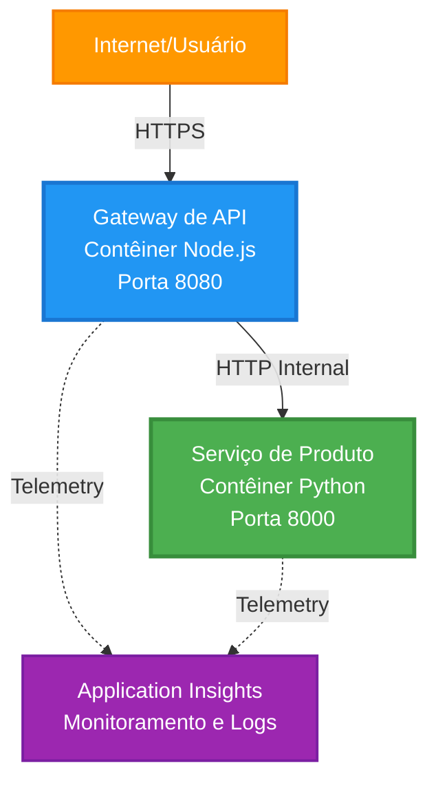
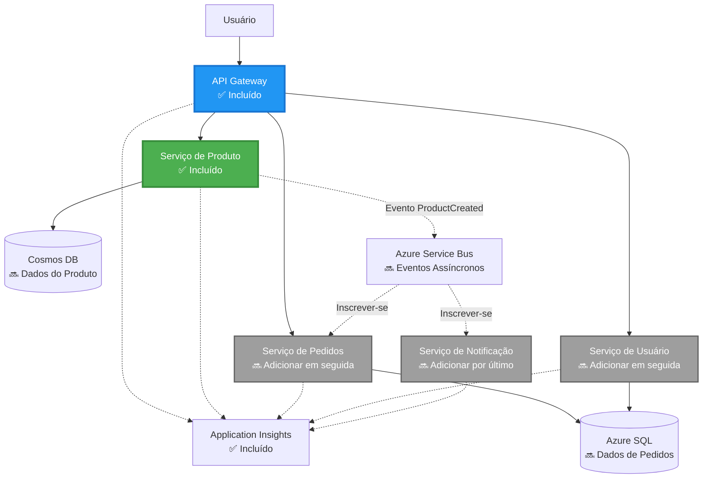
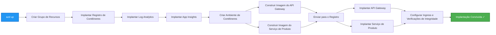
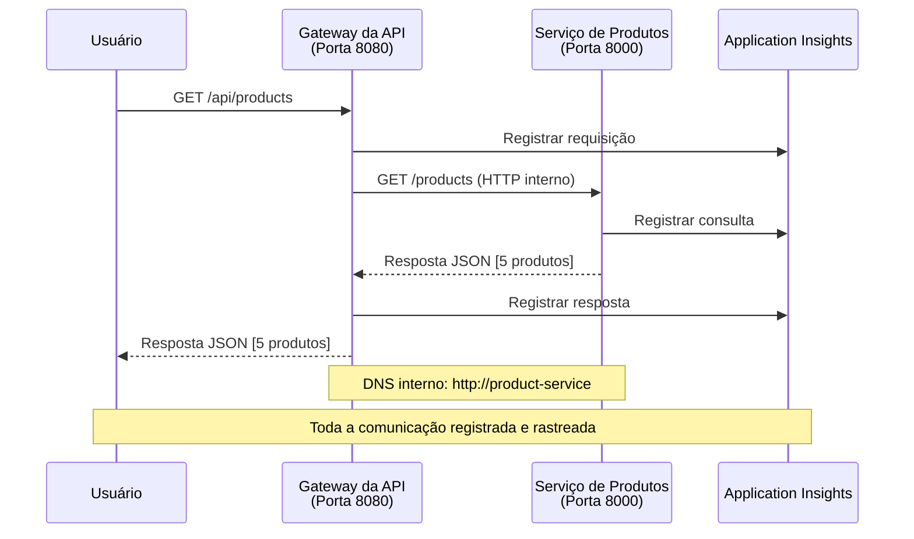

# Microservices Architecture - Container App Example

⏱️ **Estimated Time**: 25-35 minutes | 💰 **Estimated Cost**: ~$50-100/month | ⭐ **Complexity**: Advanced

**📚 Learning Path:**
- ← Previous: [Simple Flask API](../../../../examples/container-app/simple-flask-api) - Single container basics
- 🎯 **You Are Here**: Microservices Architecture (2-service foundation)
- → Next: [AI Integration](../../../../docs/ai-foundry) - Add intelligence to your services
- 🏠 [Course Home](../../README.md)

---

A **arquitetura de microsserviços simplificada, mas funcional** implantada no Azure Container Apps usando AZD CLI. Este exemplo demonstra comunicação entre serviços, orquestração de containers e monitoramento com uma configuração prática de 2 serviços.

> **📚 Abordagem de Aprendizado**: Este exemplo começa com uma arquitetura mínima de 2 serviços (API Gateway + Serviço de Backend) que você pode realmente implantar e aprender. Depois de dominar essa base, fornecemos orientação para expandir para um ecossistema completo de microsserviços.

## What You'll Learn

Ao completar este exemplo, você irá:
- Implantar múltiplos containers no Azure Container Apps
- Implementar comunicação entre serviços com rede interna
- Configurar escalonamento baseado em ambiente e verificações de integridade
- Monitorar aplicações distribuídas com Application Insights
- Entender padrões de implantação de microsserviços e práticas recomendadas
- Aprender a expansão progressiva de arquiteturas simples para complexas

## Architecture

### Phase 1: What We're Building (Included in This Example)


**Detalhes do Componente:**

| Component | Purpose | Access | Resources |
|-----------|---------|--------|-----------|
| **API Gateway** | Encaminha requisições externas para serviços de backend | Público (HTTPS) | 1 vCPU, 2GB RAM, 2-20 réplicas |
| **Product Service** | Gerencia catálogo de produtos com dados em memória | Somente interno | 0.5 vCPU, 1GB RAM, 1-10 réplicas |
| **Application Insights** | Registro centralizado e rastreamento distribuído | Azure Portal | 1-2 GB/mês de ingestão de dados |

**Por que Começar Simples?**
- ✅ Implantar e entender rapidamente (25-35 minutos)
- ✅ Aprender padrões essenciais de microsserviços sem complexidade
- ✅ Código funcional que você pode modificar e experimentar
- ✅ Custo menor para aprendizado (~$50-100/mês vs $300-1400/mês)
- ✅ Ganhar confiança antes de adicionar bancos de dados e filas de mensagens

**Analogia**: Pense nisso como aprender a dirigir. Você começa com um estacionamento vazio (2 serviços), domina o básico e depois progride para o tráfego da cidade (5+ serviços com bancos de dados).

### Phase 2: Future Expansion (Reference Architecture)

Uma vez que você dominar a arquitetura de 2 serviços, você pode expandir para:


Veja a seção "Guia de Expansão" no final para instruções passo a passo.

## Features Included

✅ **Descoberta de Serviço**: Descoberta automática baseada em DNS entre containers  
✅ **Balanceamento de Carga**: Balanceamento de carga incorporado entre réplicas  
✅ **Autoescalonamento**: Escalonamento independente por serviço baseado em requisições HTTP  
✅ **Monitoramento de Saúde**: Probes de liveness e readiness para ambos os serviços  
✅ **Registro Distribuído**: Registro centralizado com Application Insights  
✅ **Rede Interna**: Comunicação segura entre serviços  
✅ **Orquestração de Containers**: Implantação e escalonamento automáticos  
✅ **Atualizações sem Tempo de Inatividade**: Atualizações contínuas com gerenciamento de revisões  

## Prerequisites

### Required Tools

Antes de começar, verifique se você tem estas ferramentas instaladas:

1. **[Azure Developer CLI (azd)](https://learn.microsoft.com/azure/developer/azure-developer-cli/install-azd)** (versão 1.0.0 ou superior)
   ```bash
   azd version
   # Saída esperada: azd versão 1.0.0 ou superior
   ```

2. **[Azure CLI](https://learn.microsoft.com/cli/azure/install-azure-cli)** (versão 2.50.0 ou superior)
   ```bash
   az --version
   # Saída esperada: azure-cli 2.50.0 ou superior
   ```

3. **[Docker](https://www.docker.com/get-started)** (para desenvolvimento/testes locais - opcional)
   ```bash
   docker --version
   # Saída esperada: versão do Docker 20.10 ou superior
   ```

### Verify Your Setup

Execute estes comandos para confirmar que você está pronto:

```bash
# Verifique o Azure Developer CLI
azd version
# ✅ Esperado: versão do azd 1.0.0 ou superior

# Verifique o Azure CLI
az --version
# ✅ Esperado: versão do azure-cli 2.50.0 ou superior

# Verifique o Docker (opcional)
docker --version
# ✅ Esperado: versão do Docker 20.10 ou superior
```

**Critério de Sucesso**: Todos os comandos retornam números de versão iguais ou superiores aos mínimos.

### Azure Requirements

- Uma **assinatura ativa do Azure** ([crie uma conta gratuita](https://azure.microsoft.com/free/))
- Permissões para criar recursos em sua assinatura
- Papel de **Contributor** na assinatura ou no grupo de recursos

### Knowledge Prerequisites

Este é um exemplo de **nível avançado**. Você deve ter:
- Concluído o [Simple Flask API example](../../../../examples/container-app/simple-flask-api) 
- Entendimento básico de arquitetura de microsserviços
- Familiaridade com APIs REST e HTTP
- Compreensão de conceitos de containers

**Novo em Container Apps?** Comece pelo [Simple Flask API example](../../../../examples/container-app/simple-flask-api) primeiro para aprender o básico.

## Quick Start (Step-by-Step)

### Step 1: Clone and Navigate

```bash
git clone https://github.com/microsoft/AZD-for-beginners.git
cd AZD-for-beginners/examples/microservices
```

**✓ Success Check**: Verifique se você vê `azure.yaml`:
```bash
ls
# Esperado: README.md, azure.yaml, infra/, src/
```

### Step 2: Authenticate with Azure

```bash
azd auth login
```

Isso abre seu navegador para autenticação no Azure. Faça login com suas credenciais do Azure.

**✓ Success Check**: Você deve ver:
```
Logged in to Azure.
```

### Step 3: Initialize the Environment

```bash
azd init
```

**Solicitações que você verá**:
- **Environment name**: Digite um nome curto (por exemplo, `microservices-dev`)
- **Azure subscription**: Selecione sua assinatura
- **Azure location**: Escolha uma região (por exemplo, `eastus`, `westeurope`)

**✓ Success Check**: Você deve ver:
```
SUCCESS: New project initialized!
```

### Step 4: Deploy Infrastructure and Services

```bash
azd up
```

**O que acontece** (leva 8-12 minutos):


**✓ Success Check**: Você deve ver:
```
SUCCESS: Your application was deployed to Azure in X minutes Y seconds.
Endpoint: https://api-gateway-<unique-id>.azurecontainerapps.io
```

**⏱️ Tempo**: 8-12 minutos

### Step 5: Test the Deployment

```bash
# Obter o endpoint do gateway
GATEWAY_URL=$(azd env get-values | grep API_GATEWAY_URL | cut -d '=' -f2 | tr -d '"')

# Testar a saúde do API Gateway
curl $GATEWAY_URL/health
```

**✅ Saída esperada:**
```json
{
  "status": "healthy",
  "service": "api-gateway",
  "timestamp": "2025-11-19T10:30:00Z"
}
```

**Testar o serviço de produtos através do gateway**:
```bash
# Listar produtos
curl $GATEWAY_URL/api/products
```

**✅ Saída esperada:**
```json
[
  {"id":1,"name":"Laptop","price":999.99,"stock":50},
  {"id":2,"name":"Mouse","price":29.99,"stock":200},
  {"id":3,"name":"Keyboard","price":79.99,"stock":150}
]
```

**✓ Verificação de Sucesso**: Ambos os endpoints retornam dados JSON sem erros.

---

**🎉 Parabéns!** Você implantou uma arquitetura de microsserviços no Azure!

## Project Structure

Todos os arquivos de implementação estão incluídos—este é um exemplo completo e funcional:

```
microservices/
│
├── README.md                         # This file
├── azure.yaml                        # AZD configuration
├── .gitignore                        # Git ignore patterns
│
├── infra/                           # Infrastructure as Code (Bicep)
│   ├── main.bicep                   # Main orchestration
│   ├── abbreviations.json           # Naming conventions
│   ├── core/                        # Shared infrastructure
│   │   ├── container-apps-environment.bicep  # Container environment + registry
│   │   └── monitor.bicep            # Application Insights + Log Analytics
│   └── app/                         # Service definitions
│       ├── api-gateway.bicep        # API Gateway container app
│       └── product-service.bicep    # Product Service container app
│
└── src/                             # Application source code
    ├── api-gateway/                 # Node.js API Gateway
    │   ├── app.js                   # Express server with routing
    │   ├── package.json             # Node dependencies
    │   └── Dockerfile               # Container definition
    └── product-service/             # Python Product Service
        ├── main.py                  # Flask API with product data
        ├── requirements.txt         # Python dependencies
        └── Dockerfile               # Container definition
```

**O que Cada Componente Faz:**

**Infrastructure (infra/)**:
- `main.bicep`: Orquestra todos os recursos do Azure e suas dependências
- `core/container-apps-environment.bicep`: Cria o ambiente Container Apps e o Azure Container Registry
- `core/monitor.bicep`: Configura o Application Insights para registro distribuído
- `app/*.bicep`: Definições individuais de container apps com escalonamento e verificações de integridade

**API Gateway (src/api-gateway/)**:
- Serviço voltado ao público que encaminha requisições para serviços de backend
- Implementa logging, tratamento de erros e encaminhamento de requisições
- Demonstra comunicação HTTP entre serviços

**Product Service (src/product-service/)**:
- Serviço interno com catálogo de produtos (em memória para simplicidade)
- API REST com verificações de integridade
- Exemplo de padrão de microsserviço de backend

## Services Overview

### API Gateway (Node.js/Express)

**Port**: 8080  
**Access**: Público (ingresso externo)  
**Purpose**: Encaminha requisições recebidas para os serviços de backend  

**Endpoints**:
- `GET /` - Informações do serviço
- `GET /health` - Endpoint de verificação de integridade
- `GET /api/products` - Encaminha para o serviço de produtos (listar todos)
- `GET /api/products/:id` - Encaminha para o serviço de produtos (obter por ID)

**Principais Recursos**:
- Encaminhamento de requisições com axios
- Registro centralizado
- Tratamento de erros e gerenciamento de timeouts
- Descoberta de serviços via variáveis de ambiente
- Integração com Application Insights

**Destaque de Código** (`src/api-gateway/app.js`):
```javascript
// Comunicação interna entre serviços
app.get('/api/products', async (req, res) => {
  const response = await axios.get(`${PRODUCT_SERVICE_URL}/products`, {
    timeout: 5000
  });
  res.json(response.data);
});
```

### Product Service (Python/Flask)

**Port**: 8000  
**Access**: Somente interno (sem ingresso externo)  
**Purpose**: Gerencia catálogo de produtos com dados em memória  

**Endpoints**:
- `GET /` - Informações do serviço
- `GET /health` - Endpoint de verificação de integridade
- `GET /products` - Listar todos os produtos
- `GET /products/<id>` - Obter produto por ID

**Principais Recursos**:
- API RESTful com Flask
- Armazenamento de produtos em memória (simples, sem necessidade de banco de dados)
- Monitoramento de integridade com probes
- Logging estruturado
- Integração com Application Insights

**Modelo de Dados**:
```python
{
  "id": 1,
  "name": "Laptop",
  "description": "High-performance laptop",
  "price": 999.99,
  "stock": 50
}
```

**Por que Somente Interno?**
O serviço de produtos não é exposto publicamente. Todas as requisições devem passar pelo API Gateway, que fornece:
- Segurança: Ponto de acesso controlado
- Flexibilidade: Pode mudar o backend sem afetar os clientes
- Monitoramento: Registro centralizado de requisições

## Understanding Service Communication

### How Services Talk to Each Other


Neste exemplo, o API Gateway se comunica com o Product Service usando **chamadas HTTP internas**:

```javascript
// Gateway de API (src/api-gateway/app.js)
const PRODUCT_SERVICE_URL = process.env.PRODUCT_SERVICE_URL;

// Fazer requisição HTTP interna
const response = await axios.get(`${PRODUCT_SERVICE_URL}/products`);
```

**Pontos Principais**:

1. **Descoberta Baseada em DNS**: O Container Apps fornece automaticamente DNS para serviços internos
   - Product Service FQDN: `product-service.internal.<environment>.azurecontainerapps.io`
   - Simplificado como: `http://product-service` (o Container Apps resolve isso)

2. **Sem Exposição Pública**: O Product Service tem `external: false` no Bicep
   - Acessível apenas dentro do ambiente Container Apps
   - Não pode ser alcançado pela internet

3. **Variáveis de Ambiente**: URLs dos serviços são injetadas no momento da implantação
   - O Bicep passa o FQDN interno para o gateway
   - Sem URLs codificadas no código da aplicação

**Analogia**: Pense nisso como salas de escritório. O API Gateway é a recepção (voltada ao público) e o Product Service é uma sala interna. Visitantes devem passar pela recepção para alcançar qualquer sala.

## Deployment Options

### Full Deployment (Recommended)

```bash
# Implantar a infraestrutura e os dois serviços.
azd up
```

Isto implanta:
1. Ambiente Container Apps
2. Application Insights
3. Container Registry
4. Container do API Gateway
5. Container do Product Service

**Tempo**: 8-12 minutos

### Deploy Individual Service

```bash
# Implantar apenas um serviço (após o azd up inicial)
azd deploy api-gateway

# Ou implantar o serviço de produto
azd deploy product-service
```

**Caso de Uso**: Quando você atualizou o código em um serviço e quer reimplantar apenas esse serviço.

### Update Configuration

```bash
# Alterar parâmetros de dimensionamento
azd env set GATEWAY_MAX_REPLICAS 30

# Reimplantar com nova configuração
azd up
```

## Configuration

### Scaling Configuration

Ambos os serviços estão configurados com autoscaling baseado em HTTP nos arquivos Bicep:

**API Gateway**:
- Réplicas mínimas: 2 (sempre pelo menos 2 para disponibilidade)
- Réplicas máximas: 20
- Gatilho de escala: 50 requisições concorrentes por réplica

**Product Service**:
- Réplicas mínimas: 1 (pode escalar para zero se necessário)
- Réplicas máximas: 10
- Gatilho de escala: 100 requisições concorrentes por réplica

**Personalizar Escalonamento** (em `infra/app/*.bicep`):
```bicep
scale: {
  minReplicas: 1
  maxReplicas: 10
  rules: [
    {
      name: 'http-scale-rule'
      http: {
        metadata: {
          concurrentRequests: '100'  // Adjust this
        }
      }
    }
  ]
}
```

### Resource Allocation

**API Gateway**:
- CPU: 1.0 vCPU
- Memória: 2 GiB
- Motivo: Lida com todo o tráfego externo

**Product Service**:
- CPU: 0.5 vCPU
- Memória: 1 GiB
- Motivo: Operações leves em memória

### Health Checks

Ambos os serviços incluem probes de liveness e readiness:

```bicep
probes: [
  {
    type: 'Liveness'
    httpGet: {
      path: '/health'
      port: 8080
    }
    initialDelaySeconds: 10
    periodSeconds: 30
  }
  {
    type: 'Readiness'
    httpGet: {
      path: '/health'
      port: 8080
    }
    initialDelaySeconds: 5
    periodSeconds: 10
  }
]
```

**O que Isso Significa**:
- **Liveness**: Se a verificação falhar, o Container Apps reinicia o container
- **Readiness**: Se não estiver pronto, o Container Apps para de rotear tráfego para essa réplica

## Monitoring & Observability

### View Service Logs

```bash
# Visualizar logs usando azd monitor
azd monitor --logs

# Ou use o Azure CLI para Container Apps específicos:
# Transmitir logs do API Gateway
az containerapp logs show --name api-gateway --resource-group $RG_NAME --follow

# Visualizar logs recentes do serviço de produto
az containerapp logs show --name product-service --resource-group $RG_NAME --tail 100
```

**Saída Esperada**:
```
[api-gateway] API Gateway listening on port 8080
[api-gateway] Product Service URL: http://product-service
[api-gateway] GET /api/products 200 - 45ms
[product-service] Retrieved 5 products
```

### Application Insights Queries

Acesse o Application Insights no Azure Portal, e então execute estas consultas:

**Encontrar Requisições Lentas**:
```kusto
requests
| where timestamp > ago(1h)
| where duration > 1000  // Requests taking >1 second
| summarize count() by name, cloud_RoleName
| order by count_ desc
```

**Rastrear Chamadas entre Serviços**:
```kusto
dependencies
| where timestamp > ago(1h)
| where type == "Http"
| project timestamp, name, target, duration, success
| order by timestamp desc
```

**Taxa de Erro por Serviço**:
```kusto
exceptions
| where timestamp > ago(24h)
| summarize errorCount = count() by cloud_RoleName, type
| order by errorCount desc
```

**Volume de Requisições ao Longo do Tempo**:
```kusto
requests
| where timestamp > ago(1h)
| summarize requestCount = count() by bin(timestamp, 5m), cloud_RoleName
| render timechart
```

### Access Monitoring Dashboard

```bash
# Obter detalhes do Application Insights
azd env get-values | grep APPLICATIONINSIGHTS

# Abrir o monitoramento no Portal do Azure
az monitor app-insights component show \
  --app $(azd env get-values | grep APPLICATIONINSIGHTS_CONNECTION_STRING | cut -d '=' -f2) \
  --resource-group $(azd env get-values | grep AZURE_RESOURCE_GROUP | cut -d '=' -f2) \
  --query "appId" -o tsv
```

### Live Metrics

1. Navegue até o Application Insights no Azure Portal
2. Clique em "Live Metrics"
3. Veja requisições, falhas e desempenho em tempo real
4. Teste executando: `curl $(azd env get-values | grep API_GATEWAY_URL | cut -d '=' -f2 | tr -d '"')/api/products`

## Practical Exercises

### Exercise 1: Add a New Product Endpoint ⭐ (Easy)

**Goal**: Adicionar um endpoint POST para criar novos produtos

**Starting Point**: `src/product-service/main.py`

**Steps**:

1. Adicione este endpoint após a função `get_product` em `main.py`:

```python
@app.route('/products', methods=['POST'])
def create_product():
    """Create a new product"""
    data = request.get_json()
    
    # Validar campos obrigatórios
    if not data or 'name' not in data or 'price' not in data:
        return jsonify({'error': 'Missing required fields: name, price'}), 400
    
    new_id = max(p['id'] for p in products) + 1
    new_product = {
        'id': new_id,
        'name': data['name'],
        'description': data.get('description', ''),
        'price': float(data['price']),
        'stock': int(data.get('stock', 0))
    }
    products.append(new_product)
    logger.info(f"Created product {new_id}")
    return jsonify(new_product), 201
```

2. Adicione a rota POST ao API Gateway (`src/api-gateway/app.js`):

```javascript
// Adicione isto após a rota GET /api/products
app.post('/api/products', async (req, res) => {
  try {
    console.log(`Forwarding POST request to ${PRODUCT_SERVICE_URL}/products`);
    const response = await axios.post(`${PRODUCT_SERVICE_URL}/products`, req.body, {
      timeout: 5000
    });
    res.status(201).json(response.data);
  } catch (error) {
    console.error('Error calling product service:', error.message);
    res.status(503).json({
      error: 'Product service unavailable',
      message: error.message
    });
  }
});
```

3. Reimplantar ambos os serviços:

```bash
azd deploy product-service
azd deploy api-gateway
```

4. Teste o novo endpoint:

```bash
GATEWAY_URL=$(azd env get-values | grep API_GATEWAY_URL | cut -d '=' -f2 | tr -d '"')

# Criar um novo produto
curl -X POST $GATEWAY_URL/api/products \
  -H "Content-Type: application/json" \
  -d '{"name":"USB Cable","price":9.99,"stock":500}'
```

**✅ Saída esperada:**
```json
{"id":6,"name":"USB Cable","description":"","price":9.99,"stock":500}
```

5. Verifique se ele aparece na lista:

```bash
curl $GATEWAY_URL/api/products
# Deve agora mostrar 6 produtos, incluindo o novo cabo USB
```

**Critérios de Sucesso**:
- ✅ Requisição POST retorna HTTP 201
- ✅ Novo produto aparece na lista GET /api/products
- ✅ Produto tem ID auto-incrementado

**Tempo**: 10-15 minutos

---

### Exercício 2: Modificar Regras de Escalonamento Automático ⭐⭐ (Médio)

**Objetivo**: Alterar o Serviço de Produtos para escalar de forma mais agressiva

**Ponto de Partida**: `infra/app/product-service.bicep`

**Etapas**:

1. Abra `infra/app/product-service.bicep` e localize o bloco scale (em torno da linha 95)

2. Altere de:
```bicep
scale: {
  minReplicas: 1
  maxReplicas: 10
  rules: [
    {
      name: 'http-scale-rule'
      http: {
        metadata: {
          concurrentRequests: '100'  // OLD
        }
      }
    }
  ]
}
```

Para:
```bicep
scale: {
  minReplicas: 2  // Always have 2 running
  maxReplicas: 20  // Allow more scaling
  rules: [
    {
      name: 'http-scale-rule'
      http: {
        metadata: {
          concurrentRequests: '20'  // Scale at lower threshold
        }
      }
    }
  ]
}
```

3. Reimplante a infraestrutura:

```bash
azd up
```

4. Verifique a nova configuração de escalonamento:

```bash
az containerapp show \
  --name $(azd env get-values | grep PRODUCT_SERVICE | head -1 | cut -d '/' -f5) \
  --resource-group $(azd env get-values | grep AZURE_RESOURCE_GROUP | cut -d '=' -f2 | tr -d '"') \
  --query "properties.template.scale" -o json
```

**✅ Saída esperada:**
```json
{
  "minReplicas": 2,
  "maxReplicas": 20,
  "rules": [...]
}
```

5. Teste o escalonamento automático com carga:

```bash
# Gerar requisições concorrentes
for i in {1..500}; do curl $GATEWAY_URL/api/products & done

# Acompanhe o dimensionamento usando o Azure CLI
az containerapp logs show --name product-service --resource-group $RG_NAME --follow
# Procure por: eventos de escalonamento do Container Apps
```

**Critérios de Sucesso**:
- ✅ O Serviço de Produtos sempre executa pelo menos 2 réplicas
- ✅ Sob carga, escala para mais de 2 réplicas
- ✅ Azure Portal mostra novas regras de escalonamento

**Tempo**: 15-20 minutos

---

### Exercício 3: Adicionar Consulta de Monitoramento Personalizada ⭐⭐ (Médio)

**Objetivo**: Criar uma consulta personalizada no Application Insights para acompanhar o desempenho da API de produtos

**Etapas**:

1. Navegue até o Application Insights no Azure Portal:
   - Vá para o Azure Portal
   - Encontre seu grupo de recursos (rg-microservices-*)
   - Clique no recurso Application Insights

2. Clique em "Logs" no menu à esquerda

3. Crie esta consulta:

```kusto
requests
| where timestamp > ago(1h)
| where name contains "products"
| summarize 
    RequestCount = count(),
    AvgDuration = avg(duration),
    P95Duration = percentile(duration, 95),
    SuccessRate = 100.0 * countif(success == true) / count()
  by bin(timestamp, 5m)
| render timechart
```

4. Clique em "Run" para executar a consulta

5. Salve a consulta:
   - Clique em "Save"
   - Nome: "Product API Performance"
   - Categoria: "Performance"

6. Gere tráfego de teste:

```bash
for i in {1..100}; do curl $GATEWAY_URL/api/products; sleep 1; done
```

7. Atualize a consulta para ver os dados

**✅ Saída esperada:**
- Gráfico mostrando contagem de requisições ao longo do tempo
- Duração média < 500ms
- Taxa de sucesso = 100%
- Intervalos de tempo de 5 minutos

**Critérios de Sucesso**:
- ✅ Consulta mostra 100+ requisições
- ✅ Taxa de sucesso é 100%
- ✅ Duração média < 500ms
- ✅ Gráfico mostra intervalos de 5 minutos

**Resultado de Aprendizado**: Entender como monitorar o desempenho do serviço com consultas personalizadas

**Tempo**: 10-15 minutos

---

### Exercício 4: Implementar Lógica de Retentativa ⭐⭐⭐ (Avançado)

**Objetivo**: Adicionar lógica de retentativa no API Gateway quando o Serviço de Produtos estiver temporariamente indisponível

**Ponto de Partida**: `src/api-gateway/app.js`

**Etapas**:

1. Instale a biblioteca de retentativa:

```bash
cd src/api-gateway
npm install axios-retry --save
cd ../..
```

2. Atualize `src/api-gateway/app.js` (adicione após a importação do axios):

```javascript
const axiosRetry = require('axios-retry');

// Configurar lógica de tentativas
axiosRetry(axios, {
  retries: 3,
  retryDelay: (retryCount) => {
    return retryCount * 1000; // 1s, 2s, 3s
  },
  retryCondition: (error) => {
    // Retentar em erros de rede ou respostas 5xx
    return axiosRetry.isNetworkOrIdempotentRequestError(error) ||
           (error.response && error.response.status >= 500);
  }
});

console.log('Retry logic configured: 3 retries with exponential backoff');
```

3. Reimplante o API Gateway:

```bash
azd deploy api-gateway
```

4. Teste o comportamento de retentativa simulando falha do serviço:

```bash
# Escale o serviço de produto para 0 (para simular falha)
az containerapp update \
  --name $(azd env get-values | grep PRODUCT_SERVICE | head -1 | cut -d '/' -f5) \
  --resource-group $(azd env get-values | grep AZURE_RESOURCE_GROUP | cut -d '=' -f2 | tr -d '"') \
  --min-replicas 0 \
  --max-replicas 0

# Tente acessar os produtos (irá tentar novamente 3 vezes)
time curl -v $GATEWAY_URL/api/products
# Observe: A resposta leva ~6 segundos (1s + 2s + 3s nas tentativas)

# Restaure o serviço de produto
az containerapp update \
  --name $(azd env get-values | grep PRODUCT_SERVICE | head -1 | cut -d '/' -f5) \
  --resource-group $(azd env get-values | grep AZURE_RESOURCE_GROUP | cut -d '=' -f2 | tr -d '"') \
  --min-replicas 1 \
  --max-replicas 10
```

5. Visualize os logs de retentativa:

```bash
az containerapp logs show --name api-gateway --resource-group $RG_NAME --tail 50
# Procure por: mensagens de nova tentativa
```

**✅ Comportamento esperado:**
- ✅ As requisições são retentadas 3 vezes antes de falhar
- ✅ Cada retentativa espera mais (1s, 2s, 3s)
- ✅ Requisições bem-sucedidas após o serviço reiniciar
- ✅ Logs mostram tentativas de retentativa

**Critérios de Sucesso**:
- ✅ Requisições são retentadas 3 vezes antes de falhar
- ✅ Cada retentativa espera mais (exponential backoff)
- ✅ Requisições bem-sucedidas após o serviço reiniciar
- ✅ Logs mostram tentativas de retentativa

**Resultado de Aprendizado**: Entender padrões de resiliência em microserviços (circuit breakers, retentativas, timeouts)

**Tempo**: 20-25 minutos

---

## Verificação de Conhecimento

Após completar este exemplo, verifique sua compreensão:

### 1. Comunicação entre Serviços ✓

Teste seu conhecimento:
- [ ] Você pode explicar como o API Gateway descobre o Serviço de Produtos? (Descoberta de serviço baseada em DNS)
- [ ] O que acontece se o Serviço de Produtos estiver indisponível? (Gateway retorna erro 503)
- [ ] Como você adicionaria um terceiro serviço? (Crie um novo arquivo Bicep, adicione ao main.bicep, crie a pasta src)

**Verificação Prática:**
```bash
# Simular falha do serviço
az containerapp update --name <product-service-name> --min-replicas 0 --max-replicas 0
curl $GATEWAY_URL/api/products
# ✅ Esperado: 503 Serviço Indisponível

# Restaurar serviço
az containerapp update --name <product-service-name> --min-replicas 1 --max-replicas 10
```

### 2. Monitoramento e Observabilidade ✓

Teste seu conhecimento:
- [ ] Onde você vê logs distribuídos? (Application Insights no Azure Portal)
- [ ] Como você rastreia requisições lentas? (Consulta Kusto: `requests | where duration > 1000`)
- [ ] Você pode identificar qual serviço causou um erro? (Verifique o campo `cloud_RoleName` nos logs)

**Verificação Prática:**
```bash
# Gerar uma simulação de requisição lenta
curl "$GATEWAY_URL/api/products?delay=2000"

# Consultar o Application Insights por requisições lentas
# Navegar até o Azure Portal → Application Insights → Logs
# Executar: requests | where duration > 1000 | project timestamp, name, duration, cloud_RoleName
```

### 3. Escalonamento e Desempenho ✓

Teste seu conhecimento:
- [ ] O que aciona o autoescalamento? (Regras de requisições HTTP concorrentes: 50 para o gateway, 100 para o produto)
- [ ] Quantas réplicas estão em execução agora? (Verifique com `az containerapp revision list`)
- [ ] Como você escalaria o Serviço de Produtos para 5 réplicas? (Atualize minReplicas no Bicep)

**Verificação Prática:**
```bash
# Gerar carga para testar o dimensionamento automático
for i in {1..1000}; do curl $GATEWAY_URL/api/products & done

# Acompanhe o aumento das réplicas usando o Azure CLI
az containerapp logs show --name api-gateway --resource-group $RG_NAME --follow
# ✅ Esperado: Ver eventos de dimensionamento nos logs
```

**Critérios de Sucesso**: Você pode responder todas as perguntas e verificar com comandos práticos.

---

## Análise de Custos

### Custos Mensais Estimados (Para este exemplo de 2 serviços)

| Recurso | Configuração | Custo Estimado |
|----------|--------------|----------------|
| API Gateway | 2-20 replicas, 1 vCPU, 2GB RAM | $30-150 |
| Serviço de Produtos | 1-10 replicas, 0.5 vCPU, 1GB RAM | $15-75 |
| Container Registry | Basic tier | $5 |
| Application Insights | 1-2 GB/month | $5-10 |
| Log Analytics | 1 GB/month | $3 |
| **Total** | | **$58-243/mês** |

### Desdobramento de Custos por Uso

**Tráfego leve** (teste/aprendizado): ~$60/mês
- API Gateway: 2 réplicas × 24/7 = $30
- Serviço de Produtos: 1 réplica × 24/7 = $15
- Monitoramento + Registro = $13

**Tráfego moderado** (pequena produção): ~$120/mês
- API Gateway: 5 réplicas avg = $75
- Serviço de Produtos: 3 réplicas avg = $45
- Monitoramento + Registro = $13

**Tráfego alto** (períodos de pico): ~$240/mês
- API Gateway: 15 réplicas avg = $225
- Serviço de Produtos: 8 réplicas avg = $120
- Monitoramento + Registro = $13

### Dicas de Otimização de Custos

1. **Escalar para zero durante o desenvolvimento**:
   ```bicep
   scale: {
     minReplicas: 0  // Save $30-40/month when not in use
     maxReplicas: 10
   }
   ```

2. **Use o plano Consumption para o Cosmos DB** (quando você adicioná-lo):
   - Pague apenas pelo que você usa
   - Sem cobrança mínima

3. **Defina Sampling no Application Insights**:
   ```javascript
   appInsights.defaultClient.config.samplingPercentage = 50; // Amostrar 50% das solicitações
   ```

4. **Limpe quando não for necessário**:
   ```bash
   azd down --force --purge
   ```

### Opções de Camada Gratuita

Para aprendizado/teste, considere:
- ✅ Use Azure free credits ($200 for first 30 days with new accounts)
- ✅ Mantenha o mínimo de réplicas (economiza ~50% dos custos)
- ✅ Delete após testar (sem cobranças contínuas)
- ✅ Escale para zero entre sessões de aprendizado

**Exemplo**: Executar este exemplo por 2 horas/dia × 30 dias = ~ $5/mês em vez de $60/mês

---

## Referência Rápida de Solução de Problemas

### Problema: `azd up` falha com "Subscription not found"

**Solução**:
```bash
# Faça login novamente com assinatura explícita
az account set --subscription <your-subscription-id>
azd env set AZURE_SUBSCRIPTION_ID <your-subscription-id>
azd up
```

### Problema: API Gateway retorna 503 "Product service unavailable"

**Diagnóstico**:
```bash
# Verifique os logs do serviço de produto usando o Azure CLI
az containerapp logs show --name product-service --resource-group $RG_NAME --tail 50

# Verifique a saúde do serviço de produto
az containerapp show \
  --name $(azd env get-values | grep PRODUCT_SERVICE | head -1 | cut -d '/' -f5) \
  --resource-group $(azd env get-values | grep AZURE_RESOURCE_GROUP | cut -d '=' -f2 | tr -d '"') \
  --query "properties.runningStatus"
```

**Causas Comuns**:
1. O serviço de produtos não iniciou (verifique os logs por erros de Python)
2. Verificação de integridade falhando (verifique se o endpoint `/health` funciona)
3. Falha na construção da imagem do container (verifique o registry por imagem)

### Problema: Escalonamento automático não funcionando

**Diagnóstico**:
```bash
# Verificar a contagem atual de réplicas
az containerapp revision list \
  --name $(azd env get-values | grep API_GATEWAY | head -1 | cut -d '/' -f5) \
  --resource-group $(azd env get-values | grep AZURE_RESOURCE_GROUP | cut -d '=' -f2 | tr -d '"') \
  --query "[].properties.replicas"

# Gerar carga para testar
for i in {1..1000}; do curl $GATEWAY_URL/api/products & done

# Monitorar eventos de escalonamento usando a CLI do Azure
az containerapp logs show --name api-gateway --resource-group $RG_NAME --follow | grep -i scale
```

**Causas Comuns**:
1. Carga não alta o suficiente para acionar a regra de escalonamento (precisa de >50 requisições concorrentes)
2. Máximo de réplicas já atingido (verifique a configuração no Bicep)
3. Regra de escala mal configurada no Bicep (verifique o valor concurrentRequests)

### Problema: Application Insights não mostrando logs

**Diagnóstico**:
```bash
# Verifique se a string de conexão está definida
azd env get-values | grep APPLICATIONINSIGHTS

# Verifique se os serviços estão enviando telemetria
az monitor app-insights component show \
  --app $(azd env get-values | grep APPLICATIONINSIGHTS_NAME | cut -d '=' -f2 | tr -d '"') \
  --resource-group $(azd env get-values | grep AZURE_RESOURCE_GROUP | cut -d '=' -f2 | tr -d '"') \
  --query "properties.InstrumentationKey"
```

**Causas Comuns**:
1. Connection string não passada para o container (verifique variáveis de ambiente)
2. SDK do Application Insights não configurado (verifique imports no código)
3. Firewall bloqueando telemetria (raro, verifique regras de rede)

### Problema: Build do Docker falha localmente

**Diagnóstico**:
```bash
# Testar a compilação do API Gateway
cd src/api-gateway
docker build -t test-gateway .

# Testar a compilação do serviço de produto
cd ../product-service
docker build -t test-product .
```

**Causas Comuns**:
1. Dependências ausentes em package.json/requirements.txt
2. Erros de sintaxe no Dockerfile
3. Problemas de rede ao baixar dependências

**Ainda com problemas?** Veja [Guia de Problemas Comuns](../../docs/chapter-07-troubleshooting/common-issues.md) ou [Solução de Problemas do Azure Container Apps](https://learn.microsoft.com/azure/container-apps/troubleshooting)

---

## Limpeza

Para evitar cobranças contínuas, exclua todos os recursos:

```bash
azd down --force --purge
```

**Prompt de Confirmação**:
```
? Total resources to delete: 6, are you sure you want to continue? (y/N)
```

Digite `y` para confirmar.

**O que será excluído**:
- Container Apps Environment
- Ambos Container Apps (gateway & product service)
- Container Registry
- Application Insights
- Log Analytics Workspace
- Resource Group

**✓ Verificar Limpeza**:
```bash
az group list --query "[?starts_with(name,'rg-microservices')]" --output table
```

Deve retornar vazio.

---

## Guia de Expansão: De 2 para 5+ Serviços

Depois de dominar esta arquitetura de 2 serviços, veja como expandir:

### Fase 1: Adicionar Persistência de Banco de Dados (Próxima Etapa)

**Adicionar Cosmos DB para o Serviço de Produtos**:

1. Crie `infra/core/cosmos.bicep`:
   ```bicep
   resource cosmosAccount 'Microsoft.DocumentDB/databaseAccounts@2023-04-15' = {
     name: name
     location: location
     kind: 'GlobalDocumentDB'
     properties: {
       databaseAccountOfferType: 'Standard'
       consistencyPolicy: { defaultConsistencyLevel: 'Session' }
       locations: [{ locationName: location, failoverPriority: 0 }]
     }
   }
   ```

2. Atualize o Serviço de Produtos para usar o Azure Cosmos DB Python SDK em vez de dados em memória

3. Custo adicional estimado: ~ $25/mês (serverless)

### Fase 2: Adicionar Terceiro Serviço (Gestão de Pedidos)

**Criar Serviço de Pedidos**:

1. Nova pasta: `src/order-service/` (Python/Node.js/C#)
2. Novo Bicep: `infra/app/order-service.bicep`
3. Atualize o API Gateway para rotear `/api/orders`
4. Adicione Azure SQL Database para persistência de pedidos

**Arquitetura se torna**:
```
API Gateway → Product Service (Cosmos DB)
           → Order Service (Azure SQL)
```

### Fase 3: Adicionar Comunicação Assíncrona (Service Bus)

**Implementar Arquitetura Orientada a Eventos**:

1. Adicione Azure Service Bus: `infra/core/servicebus.bicep`
2. Serviço de Produtos publica eventos "ProductCreated"
3. Serviço de Pedidos se inscreve nos eventos de produto
4. Adicione Serviço de Notificações para processar eventos

**Padrão**: Request/Response (HTTP) + Orientado a Eventos (Service Bus)

### Fase 4: Adicionar Autenticação de Usuário

**Implementar Serviço de Usuário**:

1. Crie `src/user-service/` (Go/Node.js)
2. Adicione Azure AD B2C ou autenticação JWT personalizada
3. API Gateway valida tokens antes de rotear
4. Serviços verificam permissões do usuário

### Fase 5: Prontidão para Produção

**Adicione esses componentes**:
- ✅ Azure Front Door (balanceamento global de carga)
- ✅ Azure Key Vault (gerenciamento de segredos)
- ✅ Azure Monitor Workbooks (dashboards personalizados)
- ✅ Pipeline CI/CD (GitHub Actions)
- ✅ Implantações Blue-Green
- ✅ Identidade Gerenciada para todos os serviços

**Custo da Arquitetura de Produção Completa**: ~ $300-1,400/mês

---

## Saiba Mais

### Documentação Relacionada
- [Azure Container Apps Documentation](https://learn.microsoft.com/azure/container-apps/)
- [Microservices Architecture Guide](https://learn.microsoft.com/azure/architecture/guide/architecture-styles/microservices)
- [Application Insights for Distributed Tracing](https://learn.microsoft.com/azure/azure-monitor/app/distributed-tracing)
- [Azure Developer CLI Documentation](https://learn.microsoft.com/azure/developer/azure-developer-cli/)

### Próximos Passos Neste Curso
- ← Anterior: [Simple Flask API](../../../../examples/container-app/simple-flask-api) - Exemplo iniciante de um único container
- → Próximo: [Guia de Integração de IA](../../../../docs/ai-foundry) - Adicione capacidades de IA
- 🏠 [Início do Curso](../../README.md)

### Comparação: Quando Usar Cada Um

| Recurso | Container Único | Microserviços (Este) | Kubernetes (AKS) |
|---------|-----------------|---------------------|------------------|
| **Caso de Uso** | Aplicativos simples | Aplicativos complexos | Aplicativos corporativos |
| **Escalabilidade** | Serviço único | Escalonamento por serviço | Flexibilidade máxima |
| **Complexidade** | Baixa | Média | Alta |
| **Tamanho da Equipe** | 1-3 desenvolvedores | 3-10 desenvolvedores | 10+ desenvolvedores |
| **Custo** | ~ $15-50/mês | ~ $60-250/mês | ~ $150-500/mês |
| **Tempo de Implantação** | 5-10 minutos | 8-12 minutos | 15-30 minutos |
| **Melhor para** | MVPs, protótipos | Aplicativos de produção | Multicloud, redes avançadas |

**Recomendação**: Comece com Container Apps (este exemplo), migre para o AKS somente se precisar de recursos específicos do Kubernetes.

---

## Perguntas Frequentes

**P: Por que apenas 2 serviços em vez de 5+?**  
R: Progressão educacional. Domine os fundamentos (comunicação entre serviços, monitoramento, escalonamento) com um exemplo simples antes de adicionar complexidade. Os padrões que você aprende aqui se aplicam a arquiteturas com 100 serviços.

**P: Posso adicionar mais serviços por conta própria?**  
R: Absolutamente! Siga o guia de expansão acima. Cada novo serviço segue o mesmo padrão: crie a pasta src, crie o arquivo Bicep, atualize o azure.yaml, faça o deploy.

**P: Isto é pronto para produção?**  
R: É uma base sólida. Para produção, adicione: identidade gerenciada, Key Vault, bancos de dados persistentes, pipeline de CI/CD, alertas de monitoramento e estratégia de backup.

**P: Por que não usar Dapr ou outro malha de serviço?**  
R: Mantenha simples para aprendizado. Depois que você entender a rede nativa do Container Apps, pode adicionar o Dapr para cenários avançados (gerenciamento de estado, pub/sub, bindings).

**P: Como faço para depurar localmente?**  
R: Execute os serviços localmente com Docker:
```bash
cd src/api-gateway
docker build -t local-gateway .
docker run -p 8080:8080 -e PRODUCT_SERVICE_URL=http://localhost:8000 local-gateway
```

**P: Posso usar linguagens de programação diferentes?**  
R: Sim! Este exemplo mostra Node.js (gateway) + Python (serviço de produto). Você pode misturar qualquer linguagem que rode em containers: C#, Go, Java, Ruby, PHP, etc.

**P: E se eu não tiver créditos do Azure?**  
R: Use o nível gratuito do Azure (novas contas recebem $200 em créditos nos primeiros 30 dias) ou faça implantações por curtos períodos de teste e exclua imediatamente. Este exemplo custa ~$2/dia.

**P: Como isto é diferente do Azure Kubernetes Service (AKS)?**  
R: Container Apps é mais simples (não é necessário conhecimento de Kubernetes) mas menos flexível. O AKS dá controle total do Kubernetes, mas requer mais especialização. Comece com Container Apps, migre para o AKS se necessário.

**P: Posso usar isso com serviços do Azure existentes?**  
R: Sim! Você pode conectar a bancos de dados existentes, contas de armazenamento, Service Bus, etc. Atualize os arquivos Bicep para referenciar recursos existentes em vez de criar novos.

---

> **🎓 Resumo do Caminho de Aprendizagem**: Você aprendeu a implantar uma arquitetura multi-serviço com escalonamento automático, rede interna, monitoramento centralizado e padrões prontos para produção. Essa base prepara você para sistemas distribuídos complexos e arquiteturas de microsserviços empresariais.

**📚 Navegação do Curso:**
- ← Anterior: [API Flask Simples](../../../../examples/container-app/simple-flask-api)
- → Próximo: [Exemplo de Integração de Banco de Dados](../../../../database-app)
- 🏠 [Início do Curso](../../README.md)
- 📖 [Melhores Práticas de Container Apps](../../docs/chapter-04-infrastructure/deployment-guide.md)

---

**✨ Parabéns!** Você concluiu o exemplo de microsserviços. Agora você entende como construir, implantar e monitorar aplicações distribuídas no Azure Container Apps. Pronto para adicionar recursos de IA? Confira o [Guia de Integração de IA](../../../../docs/ai-foundry)!

---

<!-- CO-OP TRANSLATOR DISCLAIMER START -->
Isenção de responsabilidade:
Este documento foi traduzido usando o serviço de tradução por IA Co-op Translator (https://github.com/Azure/co-op-translator). Embora nos esforcemos para garantir a precisão, esteja ciente de que traduções automáticas podem conter erros ou imprecisões. O documento original em seu idioma deve ser considerado a fonte oficial. Para informações críticas, recomenda-se tradução profissional realizada por um tradutor humano. Não nos responsabilizamos por quaisquer mal-entendidos ou interpretações equivocadas decorrentes do uso desta tradução.
<!-- CO-OP TRANSLATOR DISCLAIMER END -->