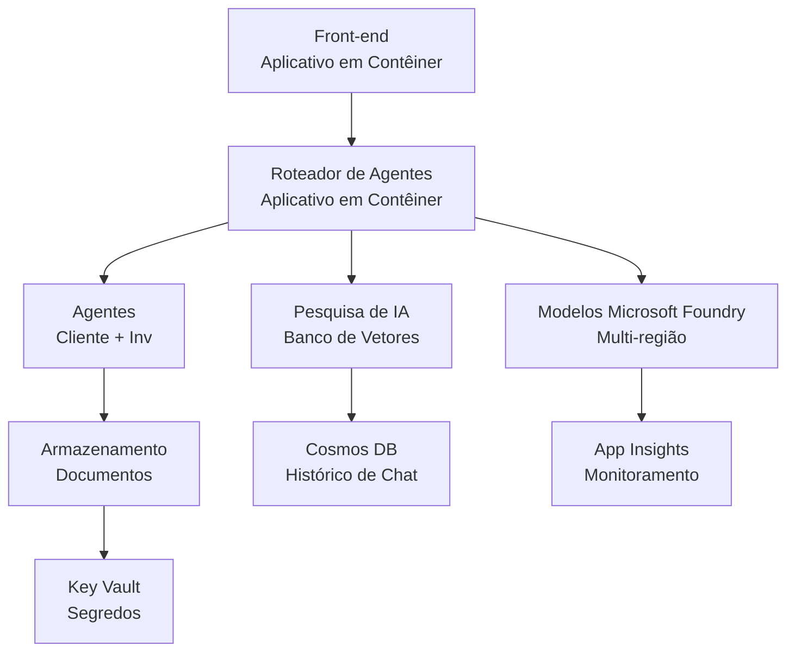

# Retail Multi-Agent Solution - Infrastructure Template

**Chapter 5: Production Deployment Package**
- **📚 Course Home**: [AZD For Beginners](../../README.md)
- **📖 Related Chapter**: [Chapter 5: Multi-Agent AI Solutions](../../README.md#-chapter-5-multi-agent-ai-solutions-advanced)
- **📝 Scenario Guide**: [Complete Architecture](../retail-scenario.md)
- **🎯 Quick Deploy**: [One-Click Deployment](#-quick-deployment)

> **⚠️ INFRASTRUCTURE TEMPLATE ONLY**  
> Este modelo ARM implanta **recursos do Azure** para um sistema multi-agente.  
>  
> **O que é implantado (15-25 minutos):**
> - ✅ Microsoft Foundry Models (gpt-4.1, gpt-4.1-mini, embeddings em 3 regiões)
> - ✅ Serviço Azure AI Search (vazio, pronto para criação de índices)
> - ✅ Container Apps (imagens placeholder, pronto para seu código)
> - ✅ Storage, Cosmos DB, Key Vault, Application Insights
>  
> **O que NÃO está incluído (requer desenvolvimento):**
> - ❌ Código de implementação dos agentes (Customer Agent, Inventory Agent)
> - ❌ Lógica de roteamento e endpoints de API
> - ❌ UI de chat no frontend
> - ❌ Esquemas de índice de busca e pipelines de dados
> - ❌ **Esforço estimado de desenvolvimento: 80-120 horas**
>  
> **Use este template se:**
> - ✅ Você quer provisionar infraestrutura Azure para um projeto multi-agente
> - ✅ Você planeja desenvolver a implementação dos agentes separadamente
> - ✅ Você precisa de uma base de infraestrutura pronta para produção
>  
> **Não use se:**
> - ❌ Você espera um demo multi-agente funcionando imediatamente
> - ❌ Você procura exemplos completos de código de aplicação

## Overview

Este diretório contém um modelo completo do Azure Resource Manager (ARM) para implantar a **base de infraestrutura** de um sistema de suporte ao cliente multi-agente. O template provisiona todos os serviços Azure necessários, devidamente configurados e interconectados, prontos para o desenvolvimento da sua aplicação.

**Após a implantação, você terá:** Infraestrutura Azure pronta para produção  
**Para completar o sistema, você precisa:** Código dos agentes, UI frontend e configuração de dados (veja [Architecture Guide](../retail-scenario.md))

## 🎯 What Gets Deployed

### Core Infrastructure (Status After Deployment)

✅ **Microsoft Foundry Models Services** (Pronto para chamadas de API)
  - Região primária: implantação gpt-4.1 (capacidade 20K TPM)
  - Região secundária: implantação gpt-4.1-mini (capacidade 10K TPM)
  - Região terciária: modelo de embeddings de texto (capacidade 30K TPM)
  - Região de avaliação: modelo grader gpt-4.1 (capacidade 15K TPM)
  - **Status:** Totalmente funcional - pode fazer chamadas de API imediatamente

✅ **Azure AI Search** (Vazio - pronto para configuração)
  - Capacidades de busca vetorial habilitadas
  - Nível Standard com 1 partition, 1 replica
  - **Status:** Serviço em execução, mas requer criação de índice
  - **Ação necessária:** Crie o índice de busca com seu esquema

✅ **Azure Storage Account** (Vazia - pronta para uploads)
  - Contêineres Blob: `documents`, `uploads`
  - Configuração segura (somente HTTPS, sem acesso público)
  - **Status:** Pronta para receber arquivos
  - **Ação necessária:** Faça upload dos seus dados de produto e documentos

⚠️ **Container Apps Environment** (Imagens placeholder implantadas)
  - App de roteador de agentes (imagem nginx padrão)
  - App frontend (imagem nginx padrão)
  - Auto-scaling configurado (0-10 instâncias)
  - **Status:** Containers placeholder em execução
  - **Ação necessária:** Construa e implante suas aplicações de agente

✅ **Azure Cosmos DB** (Vazio - pronto para dados)
  - Banco de dados e container pré-configurados
  - Otimizado para operações de baixa latência
  - TTL habilitado para limpeza automática
  - **Status:** Pronto para armazenar histórico de chats

✅ **Azure Key Vault** (Opcional - pronto para segredos)
  - Soft delete habilitado
  - RBAC configurado para managed identities
  - **Status:** Pronto para armazenar chaves de API e strings de conexão

✅ **Application Insights** (Opcional - monitoramento ativo)
  - Conectado ao Log Analytics workspace
  - Métricas customizadas e alertas configurados
  - **Status:** Pronto para receber telemetria das suas apps

✅ **Document Intelligence** (Pronto para chamadas de API)
  - Nível S0 para cargas de trabalho de produção
  - **Status:** Pronto para processar documentos enviados

✅ **Bing Search API** (Pronto para chamadas de API)
  - Nível S1 para buscas em tempo real
  - **Status:** Pronto para consultas de busca na web

### Deployment Modes

| Mode | OpenAI Capacity | Container Instances | Search Tier | Storage Redundancy | Best For |
|------|-----------------|---------------------|-------------|-------------------|----------|
| **Minimal** | 10K-20K TPM | 0-2 replicas | Basic | LRS (Local) | Dev/test, aprendizado, proof-of-concept |
| **Standard** | 30K-60K TPM | 2-5 replicas | Standard | ZRS (Zone) | Produção, tráfego moderado (<10K usuários) |
| **Premium** | 80K-150K TPM | 5-10 replicas, zone-redundant | Premium | GRS (Geo) | Empresa, alto tráfego (>10K usuários), SLA 99.99% |

**Impacto de Custo:**
- **Minimal → Standard:** ~4x aumento de custo ($100-370/mo → $420-1,450/mo)
- **Standard → Premium:** ~3x aumento de custo ($420-1,450/mo → $1,150-3,500/mo)
- **Escolha baseado em:** Carga esperada, requisitos de SLA, restrições orçamentárias

**Planejamento de Capacidade:**
- **TPM (Tokens Per Minute):** Total através de todas as implantações de modelo
- **Container Instances:** Faixa de auto-scaling (réplicas min-max)
- **Search Tier:** Afeta performance de consulta e limites de tamanho de índice

## 📋 Prerequisites

### Required Tools
1. **Azure CLI** (versão 2.50.0 ou superior)
   ```bash
   az --version  # Verificar versão
   az login      # Autenticar
   ```

2. **Assinatura Azure ativa** com acesso Owner ou Contributor
   ```bash
   az account show  # Verificar assinatura
   ```

### Required Azure Quotas

Antes da implantação, verifique cotas suficientes nas regiões alvo:

```bash
# Verifique a disponibilidade dos modelos Microsoft Foundry na sua região
az cognitiveservices account list-skus \
  --kind OpenAI \
  --location eastus2

# Verifique a cota da OpenAI (exemplo para gpt-4.1)
az cognitiveservices usage list \
  --location eastus2 \
  --query "[?name.value=='OpenAI.Standard.gpt-4.1']"

# Verifique a cota de Container Apps
az provider show \
  --namespace Microsoft.App \
  --query "resourceTypes[?resourceType=='managedEnvironments'].locations"
```

**Cotas mínimas requeridas:**
- **Microsoft Foundry Models:** 3-4 implantações de modelo entre regiões
  - gpt-4.1: 20K TPM (Tokens Por Minuto)
  - gpt-4.1-mini: 10K TPM
  - text-embedding-ada-002: 30K TPM
  - **Observação:** gpt-4.1 pode ter lista de espera em algumas regiões - verifique [model availability](https://learn.microsoft.com/azure/ai-services/openai/concepts/models)
- **Container Apps:** Managed environment + 2-10 instâncias de container
- **AI Search:** Nível Standard (Basic insuficiente para busca vetorial)
- **Cosmos DB:** Throughput provisionado padrão

**Se a cota for insuficiente:**
1. Acesse Azure Portal → Quotas → Request increase
2. Ou use Azure CLI:
   ```bash
   az support tickets create \
     --ticket-name "OpenAI-Quota-Increase" \
     --severity "minimal" \
     --description "Request quota increase for Microsoft Foundry Models gpt-4.1 in eastus2"
   ```
3. Considere regiões alternativas com disponibilidade

## 🚀 Quick Deployment

### Option 1: Using Azure CLI

```bash
# Clone ou faça o download dos arquivos de modelo
git clone <repository-url>
cd examples/retail-multiagent-arm-template

# Torne o script de implantação executável
chmod +x deploy.sh

# Implante com as configurações padrão
./deploy.sh -g myResourceGroup

# Implante em produção com recursos premium
./deploy.sh -g myProdRG -e prod -m premium -l eastus2
```

### Option 2: Using Azure Portal

[](https://portal.azure.com/#create/Microsoft.Template/uri/https%3A%2F%2Fraw.githubusercontent.com%2Fmicrosoft%2Fazd-for-beginners%2Fmain%2Fexamples%2Fretail-multiagent-arm-template%2Fazuredeploy.json)

### Option 3: Using Azure CLI directly

```bash
# Criar grupo de recursos
az group create --name myResourceGroup --location eastus2

# Implantar modelo
az deployment group create \
  --resource-group myResourceGroup \
  --template-file azuredeploy.json \
  --parameters azuredeploy.parameters.json
```

## ⏱️ Deployment Timeline

### What to Expect

| Phase | Duration | What Happens |
|-------|----------|--------------||
| **Template Validation** | 30-60 seconds | Azure valida a sintaxe do template ARM e os parâmetros |
| **Resource Group Setup** | 10-20 seconds | Cria o resource group (se necessário) |
| **OpenAI Provisioning** | 5-8 minutes | Cria 3-4 contas OpenAI e implanta modelos |
| **Container Apps** | 3-5 minutes | Cria o ambiente e implanta containers placeholder |
| **Search & Storage** | 2-4 minutes | Provisiona o serviço AI Search e contas de storage |
| **Cosmos DB** | 2-3 minutes | Cria o banco de dados e configura containers |
| **Monitoring Setup** | 2-3 minutes | Configura Application Insights e Log Analytics |
| **RBAC Configuration** | 1-2 minutes | Configura managed identities e permissões |
| **Total Deployment** | **15-25 minutes** | Infraestrutura completa pronta |

**Após a Implantação:**
- ✅ **Infraestrutura Pronta:** Todos os serviços Azure provisionados e em execução
- ⏱️ **Desenvolvimento da Aplicação:** 80-120 horas (sua responsabilidade)
- ⏱️ **Configuração de Índice:** 15-30 minutos (requer seu esquema)
- ⏱️ **Upload de Dados:** Varia conforme o tamanho do dataset
- ⏱️ **Testes & Validação:** 2-4 horas

---

## ✅ Verify Deployment Success

### Step 1: Check Resource Provisioning (2 minutes)

```bash
# Verifique se todos os recursos foram implantados com sucesso
az resource list \
  --resource-group myResourceGroup \
  --query "[?provisioningState!='Succeeded'].{Name:name, Status:provisioningState, Type:type}" \
  --output table
```

**Esperado:** Tabela vazia (todos os recursos mostram status "Succeeded")

### Step 2: Verify Microsoft Foundry Models Deployments (3 minutes)

```bash
# Listar todas as contas da OpenAI
az cognitiveservices account list \
  --resource-group myResourceGroup \
  --query "[?kind=='OpenAI'].{Name:name, Location:location, Status:properties.provisioningState}" \
  --output table

# Verificar implantações de modelos para a região principal
OPENAI_NAME=$(az cognitiveservices account list \
  --resource-group myResourceGroup \
  --query "[?kind=='OpenAI'] | [0].name" -o tsv)

az cognitiveservices account deployment list \
  --name $OPENAI_NAME \
  --resource-group myResourceGroup \
  --output table
```

**Esperado:** 
- 3-4 contas OpenAI (região primária, secundária, terciária, de avaliação)
- 1-2 implantações de modelo por conta (gpt-4.1, gpt-4.1-mini, text-embedding-ada-002)

### Step 3: Test Infrastructure Endpoints (5 minutes)

```bash
# Obter URLs do Container App
az containerapp list \
  --resource-group myResourceGroup \
  --query "[].{Name:name, URL:properties.configuration.ingress.fqdn, Status:properties.runningStatus}" \
  --output table

# Testar endpoint do roteador (uma imagem de espaço reservado responderá)
ROUTER_URL=$(az containerapp show \
  --name retail-router \
  --resource-group myResourceGroup \
  --query "properties.configuration.ingress.fqdn" -o tsv)

echo "Testing: https://$ROUTER_URL"
curl -I https://$ROUTER_URL || echo "Container running (placeholder image - expected)"
```

**Esperado:** 
- Container Apps mostram status "Running"
- nginx placeholder responde com HTTP 200 ou 404 (ainda sem código da aplicação)

### Step 4: Verify Microsoft Foundry Models API Access (3 minutes)

```bash
# Obter o endpoint e a chave da OpenAI
OPENAI_ENDPOINT=$(az cognitiveservices account show \
  --name $OPENAI_NAME \
  --resource-group myResourceGroup \
  --query "properties.endpoint" -o tsv)

OPENAI_KEY=$(az cognitiveservices account keys list \
  --name $OPENAI_NAME \
  --resource-group myResourceGroup \
  --query "key1" -o tsv)

# Testar a implantação do gpt-4.1
curl "${OPENAI_ENDPOINT}openai/deployments/gpt-4.1/chat/completions?api-version=2024-08-01-preview" \
  -H "Content-Type: application/json" \
  -H "api-key: $OPENAI_KEY" \
  -d '{
    "messages": [{"role": "user", "content": "Say hello"}],
    "max_tokens": 10
  }'
```

**Esperado:** Resposta JSON com chat completion (confirma que OpenAI está funcional)

### What's Working vs. What's Not

**✅ Funcionando Após a Implantação:**
- Modelos Microsoft Foundry Models implantados e aceitando chamadas de API
- Serviço AI Search em execução (vazio, sem índices ainda)
- Container Apps em execução (imagens nginx placeholder)
- Contas de storage acessíveis e prontas para uploads
- Cosmos DB pronto para operações de dados
- Application Insights coletando telemetria da infraestrutura
- Key Vault pronto para armazenamento de segredos

**❌ Ainda Não Funcionando (Requer Desenvolvimento):**
- Endpoints dos agentes (nenhum código de aplicação implantado)
- Funcionalidade de chat (requer frontend + backend implementados)
- Consultas de busca (nenhum índice de busca criado ainda)
- Pipeline de processamento de documentos (nenhum dado enviado)
- Telemetria customizada (requer instrumentação da aplicação)

**Próximos Passos:** Veja [Post-Deployment Configuration](#-post-deployment-next-steps) para desenvolver e implantar sua aplicação

---

## ⚙️ Configuration Options

### Template Parameters

| Parameter | Type | Default | Description |
|-----------|------|---------|-------------|
| `projectName` | string | "retail" | Prefixo para todos os nomes de recurso |
| `location` | string | Resource group location | Região primária de implantação |
| `secondaryLocation` | string | "westus2" | Região secundária para implantação multi-região |
| `tertiaryLocation` | string | "francecentral" | Região para o modelo de embeddings |
| `environmentName` | string | "dev" | Designação do ambiente (dev/staging/prod) |
| `deploymentMode` | string | "standard" | Configuração de implantação (minimal/standard/premium) |
| `enableMultiRegion` | bool | true | Habilitar implantação multi-região |
| `enableMonitoring` | bool | true | Habilitar Application Insights e logging |
| `enableSecurity` | bool | true | Habilitar Key Vault e segurança aprimorada |

### Customizing Parameters

Edite `azuredeploy.parameters.json`:

```json
{
  "$schema": "https://schema.management.azure.com/schemas/2019-04-01/deploymentParameters.json#",
  "contentVersion": "1.0.0.0",
  "parameters": {
    "projectName": {
      "value": "mycompany"
    },
    "environmentName": {
      "value": "prod"
    },
    "deploymentMode": {
      "value": "premium"
    },
    "location": {
      "value": "eastus2"
    }
  }
}
```

## 🏗️ Architecture Overview


## 📖 Deployment Script Usage

O script `deploy.sh` fornece uma experiência de implantação interativa:

```bash
# Mostrar ajuda
./deploy.sh --help

# Implantação básica
./deploy.sh -g myResourceGroup

# Implantação avançada com configurações personalizadas
./deploy.sh \
  -g myProductionRG \
  -p companyname \
  -e prod \
  -m premium \
  -l eastus2

# Implantação de desenvolvimento sem múltiplas regiões
./deploy.sh \
  -g myDevRG \
  -e dev \
  -m minimal \
  --no-multi-region \
  --no-security
```

### Script Features

- ✅ **Validação de pré-requisitos** (Azure CLI, status de login, arquivos do template)
- ✅ **Gerenciamento do resource group** (cria se não existir)
- ✅ **Validação do template** antes da implantação
- ✅ **Monitoramento de progresso** com saída colorida
- ✅ **Outputs da implantação** exibidos
- ✅ **Orientação pós-implantação**

## 📊 Monitoring Deployment

### Check Deployment Status

```bash
# Listar implantações
az deployment group list --resource-group myResourceGroup --output table

# Obter detalhes da implantação
az deployment group show \
  --resource-group myResourceGroup \
  --name retail-deployment-YYYYMMDD-HHMMSS

# Acompanhar progresso da implantação
az deployment group create \
  --resource-group myResourceGroup \
  --template-file azuredeploy.json \
  --parameters azuredeploy.parameters.json \
  --verbose
```

### Deployment Outputs

Após a implantação bem-sucedida, os seguintes outputs estarão disponíveis:

- **Frontend URL**: Endpoint público para a interface web
- **Router URL**: Endpoint de API para o roteador de agentes
- **OpenAI Endpoints**: Endpoints primário e secundário do serviço OpenAI
- **Search Service**: Endpoint do serviço Azure AI Search
- **Storage Account**: Nome da conta de storage para documentos
- **Key Vault**: Nome do Key Vault (se habilitado)
- **Application Insights**: Nome do serviço de monitoramento (se habilitado)

## 🔧 Post-Deployment: Next Steps
> **📝 Importante:** A infraestrutura está implantada, mas você precisa desenvolver e implantar o código da aplicação.

### Phase 1: Develop Agent Applications (Your Responsibility)

The ARM template creates **empty Container Apps** with placeholder nginx images. You must:

**Required Development:**
1. **Agent Implementation** (30-40 hours)
   - Customer service agent with gpt-4.1 integration
   - Inventory agent with gpt-4.1-mini integration
   - Agent routing logic

2. **Frontend Development** (20-30 hours)
   - Chat interface UI (React/Vue/Angular)
   - File upload functionality
   - Response rendering and formatting

3. **Backend Services** (12-16 hours)
   - FastAPI or Express router
   - Authentication middleware
   - Telemetry integration

**See:** [Architecture Guide](../retail-scenario.md) for detailed implementation patterns and code examples

### Phase 2: Configure AI Search Index (15-30 minutes)

Create a search index matching your data model:

```bash
# Obter detalhes do serviço de pesquisa
SEARCH_NAME=$(az search service list \
  --resource-group myResourceGroup \
  --query "[0].name" -o tsv)

SEARCH_KEY=$(az search admin-key show \
  --service-name $SEARCH_NAME \
  --resource-group myResourceGroup \
  --query "primaryKey" -o tsv)

# Criar índice com seu esquema (exemplo)
curl -X POST "https://${SEARCH_NAME}.search.windows.net/indexes?api-version=2023-11-01" \
  -H "Content-Type: application/json" \
  -H "api-key: ${SEARCH_KEY}" \
  -d '{
    "name": "products",
    "fields": [
      {"name": "id", "type": "Edm.String", "key": true},
      {"name": "title", "type": "Edm.String", "searchable": true},
      {"name": "content", "type": "Edm.String", "searchable": true},
      {"name": "category", "type": "Edm.String", "filterable": true},
      {"name": "content_vector", "type": "Collection(Edm.Single)", 
       "searchable": true, "dimensions": 1536, "vectorSearchProfile": "default"}
    ],
    "vectorSearch": {
      "algorithms": [{"name": "default", "kind": "hnsw"}],
      "profiles": [{"name": "default", "algorithm": "default"}]
    }
  }'
```

**Resources:**
- [AI Search Index Schema Design](https://learn.microsoft.com/azure/search/search-what-is-an-index)
- [Vector Search Configuration](https://learn.microsoft.com/azure/search/vector-search-how-to-create-index)

### Phase 3: Upload Your Data (Time varies)

Once you have product data and documents:

```bash
# Obter detalhes da conta de armazenamento
STORAGE_NAME=$(az storage account list \
  --resource-group myResourceGroup \
  --query "[0].name" -o tsv)

STORAGE_KEY=$(az storage account keys list \
  --account-name $STORAGE_NAME \
  --resource-group myResourceGroup \
  --query "[0].value" -o tsv)

# Envie seus documentos
az storage blob upload-batch \
  --destination documents \
  --source /path/to/your/product/docs \
  --account-name $STORAGE_NAME \
  --account-key $STORAGE_KEY

# Exemplo: Enviar um único arquivo
az storage blob upload \
  --container-name documents \
  --name "product-manual.pdf" \
  --file /path/to/product-manual.pdf \
  --account-name $STORAGE_NAME \
  --account-key $STORAGE_KEY
```

### Phase 4: Build and Deploy Your Applications (8-12 hours)

Once you've developed your agent code:

```bash
# 1. Crie o Azure Container Registry (se necessário)
az acr create \
  --name myregistry \
  --resource-group myResourceGroup \
  --sku Basic

# 2. Construa e envie a imagem do roteador do agente
docker build -t myregistry.azurecr.io/agent-router:v1 /path/to/your/router/code
az acr login --name myregistry
docker push myregistry.azurecr.io/agent-router:v1

# 3. Construa e envie a imagem do frontend
docker build -t myregistry.azurecr.io/frontend:v1 /path/to/your/frontend/code
docker push myregistry.azurecr.io/frontend:v1

# 4. Atualize os Container Apps com suas imagens
az containerapp update \
  --name retail-router \
  --resource-group myResourceGroup \
  --image myregistry.azurecr.io/agent-router:v1

az containerapp update \
  --name retail-frontend \
  --resource-group myResourceGroup \
  --image myregistry.azurecr.io/frontend:v1

# 5. Configure variáveis de ambiente
az containerapp update \
  --name retail-router \
  --resource-group myResourceGroup \
  --set-env-vars \
    OPENAI_ENDPOINT=secretref:openai-endpoint \
    OPENAI_KEY=secretref:openai-key \
    SEARCH_ENDPOINT=secretref:search-endpoint \
    SEARCH_KEY=secretref:search-key
```

### Phase 5: Test Your Application (2-4 hours)

```bash
# Obtenha a URL da sua aplicação
ROUTER_URL=$(az containerapp show \
  --name retail-router \
  --resource-group myResourceGroup \
  --query "properties.configuration.ingress.fqdn" -o tsv)

# Teste o endpoint do agente (após seu código ser implantado)
curl -X POST "https://${ROUTER_URL}/chat" \
  -H "Content-Type: application/json" \
  -d '{
    "message": "Hello, I need help with my order",
    "agent": "customer"
  }'

# Verifique os logs da aplicação
az containerapp logs show \
  --name retail-router \
  --resource-group myResourceGroup \
  --follow
```

### Implementation Resources

**Architecture & Design:**
- 📖 [Complete Architecture Guide](../retail-scenario.md) - Detailed implementation patterns
- 📖 [Multi-Agent Design Patterns](https://learn.microsoft.com/azure/architecture/ai-ml/guide/multi-agent-systems)

**Code Examples:**
- 🔗 [Microsoft Foundry Models Chat Sample](https://github.com/Azure-Samples/azure-search-openai-demo) - padrão RAG
- 🔗 [Semantic Kernel](https://github.com/microsoft/semantic-kernel) - framework de agentes (C#)
- 🔗 [LangChain Azure](https://github.com/langchain-ai/langchain) - orquestração de agentes (Python)
- 🔗 [AutoGen](https://github.com/microsoft/autogen) - conversas multi-agente

**Estimated Total Effort:**
- Infrastructure deployment: 15-25 minutes (✅ Complete)
- Application development: 80-120 hours (🔨 Your work)
- Testing and optimization: 15-25 hours (🔨 Your work)

## 🛠️ Troubleshooting

### Common Issues

#### 1. Microsoft Foundry Models Quota Exceeded

```bash
# Verificar o uso atual da cota
az cognitiveservices usage list --location eastus2

# Solicitar aumento da cota
az support tickets create \
  --ticket-name "OpenAI-Quota-Increase" \
  --severity "minimal" \
  --description "Request quota increase for Microsoft Foundry Models in region X"
```

#### 2. Container Apps Deployment Failed

```bash
# Verificar logs do aplicativo de contêiner
az containerapp logs show \
  --name retail-router \
  --resource-group myResourceGroup \
  --follow

# Reiniciar o aplicativo de contêiner
az containerapp revision restart \
  --name retail-router \
  --resource-group myResourceGroup
```

#### 3. Search Service Initialization

```bash
# Verificar status do serviço de busca
az search service show \
  --name <search-service-name> \
  --resource-group myResourceGroup

# Testar conectividade do serviço de busca
curl -X GET "https://<search-service-name>.search.windows.net/indexes?api-version=2023-11-01" \
  -H "api-key: <search-admin-key>"
```

### Deployment Validation

```bash
# Validar se todos os recursos foram criados
az resource list \
  --resource-group myResourceGroup \
  --output table

# Verificar a saúde dos recursos
az resource list \
  --resource-group myResourceGroup \
  --query "[?provisioningState!='Succeeded'].{Name:name, Status:provisioningState, Type:type}" \
  --output table
```

## 🔐 Security Considerations

### Key Management
- All secrets are stored in Azure Key Vault (when enabled)
- Container apps use managed identity for authentication
- Storage accounts have secure defaults (HTTPS only, no public blob access)

### Network Security
- Container apps use internal networking where possible
- Search service configured with private endpoints option
- Cosmos DB configured with minimal necessary permissions

### RBAC Configuration
```bash
# Atribuir as funções necessárias à identidade gerenciada
az role assignment create \
  --assignee <container-app-managed-identity> \
  --role "Cognitive Services OpenAI User" \
  --scope <openai-resource-id>
```

## 💰 Cost Optimization

### Cost Estimates (Monthly, USD)

| Mode | OpenAI | Container Apps | Search | Storage | Total Est. |
|------|--------|----------------|--------|---------|------------|
| Minimal | $50-200 | $20-50 | $25-100 | $5-20 | $100-370 |
| Standard | $200-800 | $100-300 | $100-300 | $20-50 | $420-1450 |
| Premium | $500-2000 | $300-800 | $300-600 | $50-100 | $1150-3500 |

### Cost Monitoring

```bash
# Configurar alertas de orçamento
az consumption budget create \
  --account-name <subscription-id> \
  --budget-name "retail-budget" \
  --amount 500 \
  --time-grain Monthly \
  --start-date 2024-01-01 \
  --end-date 2024-12-31
```

## 🔄 Updates and Maintenance

### Template Updates
- Version control the ARM template files
- Test changes in development environment first
- Use incremental deployment mode for updates

### Resource Updates
```bash
# Atualizar com novos parâmetros
az deployment group create \
  --resource-group myResourceGroup \
  --template-file azuredeploy.json \
  --parameters azuredeploy.parameters.json \
  --mode Incremental
```

### Backup and Recovery
- Cosmos DB automatic backup enabled
- Key Vault soft delete enabled
- Container app revisions maintained for rollback

## 📞 Support

- **Template Issues**: [GitHub Issues](https://github.com/microsoft/azd-for-beginners/issues)
- **Azure Support**: [Azure Support Portal](https://portal.azure.com/#blade/Microsoft_Azure_Support/HelpAndSupportBlade)
- **Community**: [Azure AI Discord](https://discord.gg/microsoft-azure)

---

**⚡ Ready to deploy your multi-agent solution?**

Start with: `./deploy.sh -g myResourceGroup`

---

<!-- CO-OP TRANSLATOR DISCLAIMER START -->
**Isenção de responsabilidade**:
Este documento foi traduzido utilizando o serviço de tradução por IA [Co-op Translator](https://github.com/Azure/co-op-translator). Embora nos esforcemos pela precisão, esteja ciente de que traduções automatizadas podem conter erros ou imprecisões. O documento original em seu idioma nativo deve ser considerado a fonte autoritativa. Para informações críticas, recomenda-se tradução humana profissional. Não nos responsabilizamos por quaisquer mal-entendidos ou interpretações equivocadas decorrentes do uso desta tradução.
<!-- CO-OP TRANSLATOR DISCLAIMER END -->