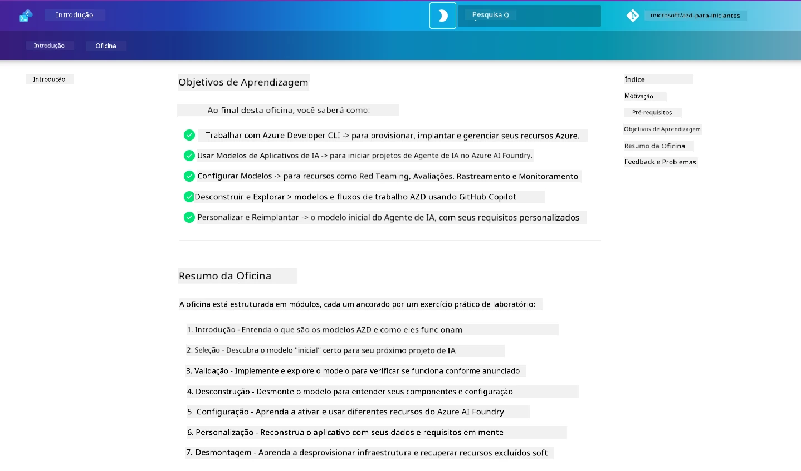

<div align="center">
  <div style="background: linear-gradient(135deg, #0078d4, #106ebe); border-radius: 10px; padding: 20px; margin: 20px 0; box-shadow: 0 4px 15px rgba(0, 120, 212, 0.3); border: 2px solid #005a9e;">
    <h2 style="color: white; margin: 0; font-size: 24px; text-shadow: 1px 1px 2px rgba(0,0,0,0.3);">
      🎯 Oficina AZD para Desenvolvedores de IA
    </h2>
    <p style="color: white; margin: 10px 0 0 0; font-size: 16px; text-shadow: 1px 1px 2px rgba(0,0,0,0.3);">
      <strong>Uma oficina prática para construir aplicações de IA com o Azure Developer CLI.</strong><br>
      Conclua 7 módulos para dominar os modelos AZD e fluxos de trabalho de implantação de IA.
    </p>
    <div style="margin-top: 15px;">
      <span style="background: rgba(255,255,255,0.2); padding: 5px 10px; border-radius: 15px; color: white; font-size: 14px;">
        📅 Última atualização: março de 2026
      </span>
    </div>
  </div>
</div>

# Oficina AZD para Desenvolvedores de IA

Bem-vindo à oficina prática para aprender o Azure Developer CLI (AZD) com foco na implantação de aplicações de IA. Esta oficina ajuda você a obter uma compreensão prática dos modelos AZD em 3 etapas:

1. **Descoberta** - encontre o modelo que é certo para você.
1. **Implantação** - implantar e validar se funciona
1. **Personalização** - modificar e iterar para torná-lo seu!

Ao longo desta oficina, você também será apresentado às ferramentas e fluxos de trabalho essenciais para desenvolvedores, para ajudar a agilizar sua jornada de desenvolvimento de ponta a ponta.

<br/>

## Guia baseado no navegador

As lições do workshop estão em Markdown. Você pode navegá-las diretamente no GitHub - ou abrir uma visualização baseada no navegador como mostrado na captura de tela abaixo.



Para usar esta opção - faça um fork do repositório para seu perfil, e inicie o GitHub Codespaces. Assim que o terminal do VS Code estiver ativo, digite este comando:

This browser preview works in GitHub Codespaces, dev containers, or a local clone with Python and MkDocs installed.

```bash title="" linenums="0"
mkdocs serve > /dev/null 2>&1 &
```

In a few seconds, you will see a pop-up dialog. Select the option to `Open in browser`. The web-based guide will now open in a new browser tab. Some benefits of this preview:

1. **Pesquisa integrada** - encontre palavras-chave ou lições rapidamente.
1. **Ícone de copiar** - passe o cursor sobre blocos de código para ver esta opção
1. **Alternador de tema** - alterne entre temas escuro e claro
1. **Obter ajuda** - clique no ícone do Discord no rodapé para participar!

<br/>

## Visão geral da oficina

**Duração:** 3-4 horas  
**Nível:** Iniciante a Intermediário  
**Pré-requisitos:** Familiaridade com Azure, conceitos de IA, VS Code & ferramentas de linha de comando.

Esta é uma oficina prática onde você aprende fazendo. Depois de concluir os exercícios, recomendamos revisar o currículo AZD para Iniciantes para continuar sua jornada de aprendizagem em melhores práticas de Segurança e Produtividade.

| Tempo| Módulo  | Objetivo |
|:---|:---|:---|
| 15 min | [Introdução](docs/instructions/0-Introduction.md) | Apresente o contexto e entenda os objetivos |
| 30 min | [Selecionar Modelo de IA](docs/instructions/1-Select-AI-Template.md) | Explore as opções e escolha um modelo inicial | 
| 30 min | [Validar Modelo de IA](docs/instructions/2-Validate-AI-Template.md) | Implantar a solução padrão no Azure |
| 30 min | [Desconstruir Modelo de IA](docs/instructions/3-Deconstruct-AI-Template.md) | Explore a estrutura e a configuração |
| 30 min | [Configurar Modelo de IA](docs/instructions/4-Configure-AI-Template.md) | Ative e experimente os recursos disponíveis |
| 30 min | [Personalizar Modelo de IA](docs/instructions/5-Customize-AI-Template.md) | Adapte o modelo às suas necessidades |
| 30 min | [Desmontar Infraestrutura](docs/instructions/6-Teardown-Infrastructure.md) | Limpar e liberar recursos |
| 15 min | [Conclusão & Próximos Passos](docs/instructions/7-Wrap-up.md) | Recursos de aprendizagem, desafio da oficina |

<br/>

## O que você aprenderá

Considere o Modelo AZD como um ambiente de aprendizado prático para explorar várias funcionalidades e ferramentas para desenvolvimento de ponta a ponta na Microsoft Foundry. Ao final desta oficina, você deverá ter uma percepção intuitiva sobre várias ferramentas e conceitos nesse contexto.

| Conceito  | Objetivo |
|:---|:---|
| **Azure Developer CLI** | Entender os comandos e fluxos de trabalho da ferramenta|
| **AZD Templates**| Entender a estrutura do projeto e a configuração|
| **Azure AI Agent**| Provisionar e implantar projeto Microsoft Foundry |
| **Azure AI Search**| Habilitar engenharia de contexto com agentes |
| **Observability**| Explorar rastreamento, monitoramento e avaliações |
| **Red Teaming**| Explorar testes adversariais e mitigação |

<br/>

## Estrutura da oficina

A oficina é estruturada para levá-lo em uma jornada desde a descoberta do modelo, até a implantação, desconstrução e personalização - usando o template oficial [Getting Started with AI Agents](https://github.com/Azure-Samples/get-started-with-ai-agents) como base.

### [Módulo 1: Selecionar Modelo de IA](docs/instructions/1-Select-AI-Template.md) (30 min)

- O que são Modelos de IA?
- Onde posso encontrar Modelos de IA?
- Como posso começar a construir Agentes de IA?
- **Lab**: Início rápido no Codespaces ou em um contêiner de desenvolvimento

### [Módulo 2: Validar Modelo de IA](docs/instructions/2-Validate-AI-Template.md) (30 min)

- Qual é a Arquitetura do Modelo de IA?
- Qual é o fluxo de trabalho de desenvolvimento AZD?
- Como posso obter ajuda com desenvolvimento AZD?
- **Lab**: Implantar e Validar o template de Agentes de IA

### [Módulo 3: Desconstruir Modelo de IA](docs/instructions/3-Deconstruct-AI-Template.md) (30 min)

- Explore seu ambiente em `.azure/` 
- Explore sua configuração de recursos em `infra/` 
- Explore sua configuração AZD em `azure.yaml`s
- **Lab**: Modificar Variáveis de Ambiente e Reimplantar

### [Módulo 4: Configurar Modelo de IA](docs/instructions/4-Configure-AI-Template.md) (30 min)
- Explore: Geração Aumentada por Recuperação (RAG)
- Explore: Avaliação de Agentes e Red Teaming
- Explore: Rastreamento & Monitoramento
- **Lab**: Explore o Agente de IA + Observabilidade 

### [Módulo 5: Personalizar Modelo de IA](docs/instructions/5-Customize-AI-Template.md) (30 min)
- Defina: PRD com Requisitos do Cenário
- Configure: Variáveis de Ambiente para AZD
- Implemente: Hooks de ciclo de vida para tarefas adicionais
- **Lab**: Personalize o modelo para meu cenário

### [Módulo 6: Desmontar Infraestrutura](docs/instructions/6-Teardown-Infrastructure.md) (30 min)
- Recapitulação: O que são os Modelos AZD?
- Recapitulação: Por que usar o Azure Developer CLI?
- Próximos Passos: Experimente um template diferente!
- **Lab**: Desprovisionar infraestrutura e limpar

<br/>

## Desafio da oficina

Quer se desafiar a fazer mais? Aqui estão algumas sugestões de projetos - ou compartilhe suas ideias conosco!!

| Projeto | Descrição |
|:---|:---|
|1. **Desconstruir um Modelo Complexo de IA** | Use o fluxo de trabalho e as ferramentas que descrevemos e veja se você consegue implantar, validar e personalizar um modelo de solução de IA diferente. _O que você aprendeu?_|
|2. **Personalizar com seu cenário**  | Tente escrever um PRD (Product Requirements Document) para um cenário diferente. Então use o GitHub Copilot no seu repositório de modelo no Agent Model - e peça para ele gerar um fluxo de trabalho de personalização para você. _O que você aprendeu? Como você poderia melhorar essas sugestões?_|
| | |

## Tem feedback?

1. Abra uma issue neste repositório - marque-a com `Workshop` para conveniência.
1. Participe do Discord do Microsoft Foundry - conecte-se com seus pares!


| | | 
|:---|:---|
| **📚 Página do Curso**| [AZD para Iniciantes](../README.md)|
| **📖 Documentação** | [Comece com templates de IA](https://learn.microsoft.com/en-us/azure/ai-foundry/how-to/develop/ai-template-get-started)|
| **🛠️Modelos de IA** | [Microsoft Foundry Templates](https://ai.azure.com/templates) |
|**🚀 Próximos Passos** | [Iniciar Oficina](#visão-geral-da-oficina) |
| | |

<br/>

---

**Navegação:** [Curso Principal](../README.md) | [Introdução](docs/instructions/0-Introduction.md) | [Módulo 1: Selecionar Modelo de IA](docs/instructions/1-Select-AI-Template.md)

**Pronto para começar a construir aplicações de IA com AZD?**

[Iniciar Oficina: Introdução →](docs/instructions/0-Introduction.md)

---

<!-- CO-OP TRANSLATOR DISCLAIMER START -->
**Isenção de responsabilidade**:
Este documento foi traduzido usando o serviço de tradução por IA [Co-op Translator](https://github.com/Azure/co-op-translator). Embora nos esforcemos pela precisão, esteja ciente de que traduções automáticas podem conter erros ou imprecisões. O documento original em seu idioma nativo deve ser considerado a fonte autoritativa. Para informações críticas, recomenda-se tradução profissional por um tradutor humano. Não nos responsabilizamos por quaisquer mal-entendidos ou interpretações equivocadas decorrentes do uso desta tradução.
<!-- CO-OP TRANSLATOR DISCLAIMER END -->