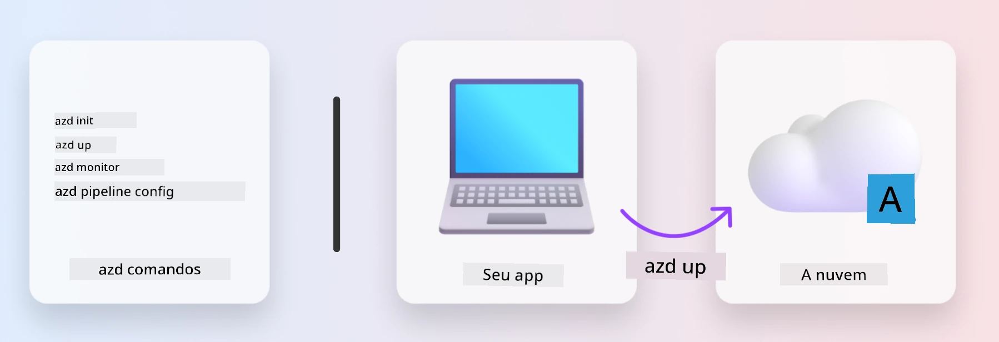
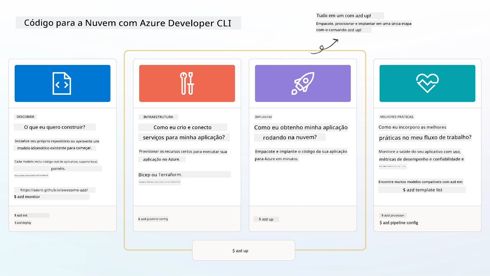

# 1. Selecionar um Modelo

!!! tip "AO FINAL DESTE MÓDULO VOCÊ SERÁ CAPAZ DE"

    - [ ] Descrever o que são os modelos AZD
    - [ ] Descobrir e usar modelos AZD para IA
    - [ ] Começar com o modelo AI Agents
    - [ ] **Laboratório 1:** AZD Quickstart no Codespaces ou em um contêiner de desenvolvimento

---

## 1. Uma Analogia do Construtor

Construir uma aplicação de IA moderna e pronta para empresas _do zero_ pode ser assustador. É um pouco como construir sua nova casa sozinho, tijolo por tijolo. Sim, é possível! Mas não é a maneira mais eficaz de alcançar o resultado desejado! 

Em vez disso, frequentemente começamos com uma _planta de projeto_ existente, e trabalhamos com um arquiteto para personalizá‑la de acordo com nossos requisitos pessoais. E essa é exatamente a abordagem a ser adotada ao construir aplicações inteligentes. Primeiro, encontre uma boa arquitetura de projeto que se adeque ao seu espaço de problema. Em seguida, trabalhe com um arquiteto de soluções para customizar e desenvolver a solução para o seu cenário específico.

Mas onde podemos encontrar essas plantas de projeto? E como encontramos um arquiteto disposto a nos ensinar a personalizar e implantar essas plantas por conta própria? Neste workshop, respondemos a essas perguntas apresentando três tecnologias:

1. [Azure Developer CLI](https://aka.ms/azd) - uma ferramenta de código aberto que acelera o caminho do desenvolvedor do desenvolvimento local (build) à implantação na nuvem (ship).
1. [Microsoft Foundry Templates](https://ai.azure.com/templates) - repositórios padronizados e de código aberto contendo código de exemplo, infraestrutura e arquivos de configuração para implantar uma arquitetura de solução de IA.
1. [GitHub Copilot Agent Mode](https://code.visualstudio.com/docs/copilot/chat/chat-agent-mode) - um agente de codificação fundamentado no conhecimento do Azure, que pode nos guiar na navegação pelo código e na realização de alterações — usando linguagem natural.

Com essas ferramentas em mãos, agora podemos _descobrir_ o template certo, _implantar_ para validar que funciona e _personalizá‑lo_ para adequá‑lo aos nossos cenários específicos. Vamos nos aprofundar e aprender como isso funciona.


---

## 2. Azure Developer CLI

The [Azure Developer CLI](https://learn.microsoft.com/en-us/azure/developer/azure-developer-cli/) (or `azd`) is an open-source commandline tool that can speed up your code-to-cloud journey with a set of developer-friendly commands that work consistently across your IDE (development) and CI/CD (devops) environments.

Com o `azd`, sua jornada de implantação pode ser tão simples quanto:

- `azd init` - Inicializa um novo projeto de IA a partir de um template AZD existente.
- `azd up` - Provisiona a infraestrutura e implanta sua aplicação em um único passo.
- `azd monitor` - Obtenha monitoramento e diagnóstico em tempo real para sua aplicação implantada.
- `azd pipeline config` - Configure pipelines de CI/CD para automatizar a implantação no Azure.

**🎯 | EXERCÍCIO**: <br/> Explore a ferramenta de linha de comando `azd` no seu ambiente de workshop atual agora. Isso pode ser GitHub Codespaces, um contêiner de desenvolvimento, ou um clone local com os pré-requisitos instalados. Comece digitando este comando para ver o que a ferramenta pode fazer:

```bash title="" linenums="0"
azd help
```



---

## 3. O Modelo AZD

Para que o `azd` consiga isso, ele precisa saber a infraestrutura a provisionar, as configurações a aplicar e a aplicação a implantar. É aí que entram os [AZD templates](https://learn.microsoft.com/en-us/azure/developer/azure-developer-cli/azd-templates?tabs=csharp). 

Os modelos AZD são repositórios de código aberto que combinam código de exemplo com arquivos de infraestrutura e configuração necessários para implantar a arquitetura da solução.
Ao usar uma abordagem _Infrastructure-as-Code_ (IaC), eles permitem que as definições de recursos do template e as configurações sejam controladas por versão (assim como o código-fonte da aplicação) — criando fluxos de trabalho reutilizáveis e consistentes entre os usuários desse projeto.

Ao criar ou reutilizar um template AZD para o _seu_ cenário, considere estas perguntas:

1. O que você está construindo? → Existe um template que tenha código inicial para esse cenário?
1. Como sua solução é arquitetada? → Existe um template que possua os recursos necessários?
1. Como sua solução é implantada? → Pense em `azd deploy` com hooks de pré/pós-processamento!
1. Como você pode otimizá‑la ainda mais? → Pense em monitoramento embutido e pipelines de automação!

**🎯 | EXERCÍCIO**: <br/> 
Visite a galeria [Awesome AZD](https://azure.github.io/awesome-azd/) e use os filtros para explorar os mais de 250 templates atualmente disponíveis. Veja se você consegue encontrar um que se alinhe aos requisitos do _seu_ cenário.



---

## 4. Modelos de Aplicações de IA

Para aplicações alimentadas por IA, a Microsoft fornece templates especializados com **Microsoft Foundry** e **Foundry Agents**. Esses templates aceleram seu caminho para construir aplicações inteligentes e prontas para produção.

### Microsoft Foundry & Foundry Agents Templates

Selecione um template abaixo para implantar. Cada template está disponível em [Awesome AZD](https://azure.github.io/awesome-azd/) e pode ser inicializado com um único comando.

| Template | Description | Deploy Command |
|----------|-------------|----------------|
| **[Chat de IA com RAG](https://azure.github.io/awesome-azd/?tags=ai&tags=rag)** | Aplicativo de chat com Geração Aumentada por Recuperação usando Microsoft Foundry | `azd init -t azure-samples/azure-search-openai-demo` |
| **[Foundry Agent Service Starter](https://azure.github.io/awesome-azd/?tags=ai&tags=agents)** | Crie agentes de IA com Foundry Agents para execução autônoma de tarefas | `azd init -t azure-samples/foundry-agent-service-starter` |
| **[Orquestração Multi-Agente](https://azure.github.io/awesome-azd/?tags=ai&tags=agents)** | Coordene múltiplos Foundry Agents para fluxos de trabalho complexos | `azd init -t azure-samples/multi-agent-orchestration` |
| **[Inteligência de Documentos de IA](https://azure.github.io/awesome-azd/?tags=ai&tags=document)** | Extraia e analise documentos com modelos Microsoft Foundry | `azd init -t azure-samples/ai-document-processing` |
| **[Bot de IA Conversacional](https://azure.github.io/awesome-azd/?tags=ai&tags=bot)** | Crie chatbots inteligentes com integração Microsoft Foundry | `azd init -t azure-samples/ai-chat-protocol` |
| **[Geração de Imagens por IA](https://azure.github.io/awesome-azd/?tags=ai&tags=dalle)** | Gere imagens usando DALL-E via Microsoft Foundry | `azd init -t azure-samples/ai-image-generation` |
| **[Agente Semantic Kernel](https://azure.github.io/awesome-azd/?tags=ai&tags=semantic-kernel)** | Agentes de IA usando Semantic Kernel com Foundry Agents | `azd init -t azure-samples/semantic-kernel-agent` |
| **[AutoGen Multi-Agente](https://azure.github.io/awesome-azd/?tags=ai&tags=autogen)** | Sistemas multi-agente usando o framework AutoGen | `azd init -t azure-samples/autogen-multi-agent` |

### Início Rápido

1. **Navegue pelos templates**: Visite [https://azure.github.io/awesome-azd/](https://azure.github.io/awesome-azd/) e filtre por `AI`, `Agents`, ou `Microsoft Foundry`
2. **Selecione seu template**: Escolha um que corresponda ao seu caso de uso
3. **Inicialize**: Execute o comando `azd init` para o template escolhido
4. **Implante**: Execute `azd up` para provisionar e implantar

**🎯 | EXERCÍCIO**: <br/>
Selecione um dos templates acima com base no seu cenário:

- **Construindo um chatbot?** → Comece com **Chat de IA com RAG** ou **Bot de IA Conversacional**
- **Necessita de agentes autônomos?** → Experimente **Foundry Agent Service Starter** ou **Orquestração Multi-Agente**
- **Processando documentos?** → Use **Inteligência de Documentos de IA**
- **Quer assistência de codificação por IA?** → Explore **Agente Semantic Kernel** ou **AutoGen Multi-Agente**

```bash title="Example: Deploy the AI Chat with RAG template" linenums="0"
azd init -t azure-samples/azure-search-openai-demo
azd up
```

!!! info "Explore Mais Modelos"
    The [Awesome AZD Gallery](https://azure.github.io/awesome-azd/) contains 250+ templates. Use the filters to find templates matching your specific requirements for language, framework, and Azure services.

---

<!-- CO-OP TRANSLATOR DISCLAIMER START -->
**Isenção de responsabilidade**:
Este documento foi traduzido usando o serviço de tradução por IA [Co-op Translator](https://github.com/Azure/co-op-translator). Embora nos esforcemos pela precisão, esteja ciente de que traduções automáticas podem conter erros ou imprecisões. O documento original em seu idioma nativo deve ser considerado a fonte autoritativa. Para informações críticas, recomenda-se tradução humana profissional. Não nos responsabilizamos por quaisquer mal-entendidos ou interpretações equivocadas decorrentes do uso desta tradução.
<!-- CO-OP TRANSLATOR DISCLAIMER END -->