# 2. Validar um Template

!!! tip "AO FINAL DESTE MÓDULO VOCÊ SERÁ CAPAZ DE"

    - [ ] Analisar a Arquitetura de Solução de IA
    - [ ] Entender o Fluxo de Trabalho de Implantação do AZD
    - [ ] Usar o GitHub Copilot para obter ajuda sobre o uso do AZD
    - [ ] **Lab 2:** Implantar e Validar o template de Agentes de IA

---

## 1. Introdução

O [Azure Developer CLI](https://learn.microsoft.com/en-us/azure/developer/azure-developer-cli/) ou `azd` é uma ferramenta de linha de comando de código aberto que simplifica o fluxo de trabalho do desenvolvedor ao criar e implantar aplicativos no Azure.

[Templates AZD](https://learn.microsoft.com/azure/developer/azure-developer-cli/azd-templates) são repositórios padronizados que incluem código de aplicação de exemplo, ativos de _infraestrutura como código_ e arquivos de configuração do `azd` para uma arquitetura de solução coesa. Provisionar a infraestrutura torna-se tão simples quanto um comando `azd provision` - enquanto usar `azd up` permite provisionar a infraestrutura **e** implantar seu aplicativo de uma só vez!

Como resultado, iniciar o processo de desenvolvimento do seu aplicativo pode ser tão simples quanto encontrar o _template inicial do AZD_ que mais se aproxima das suas necessidades de aplicação e infraestrutura - e então personalizar o repositório para atender aos requisitos do seu cenário.

Antes de começarmos, vamos garantir que você tenha o Azure Developer CLI instalado.

1. Abra um terminal do VS Code e digite este comando:

      ```bash title="" linenums="0"
      azd version
      ```

1. Você deve ver algo como isto!

      ```bash title="" linenums="0"
      azd version 1.19.0 (commit b3d68cea969b2bfbaa7b7fa289424428edb93e97)
      ```

**Agora você está pronto para selecionar e implantar um template com azd**

---

## 2. Seleção de Template

A plataforma Azure AI Foundry vem com um [conjunto de templates AZD recomendados](https://learn.microsoft.com/en-us/azure/ai-foundry/how-to/develop/ai-template-get-started) que cobrem cenários populares de solução, como _automação de fluxo de trabalho com múltiplos agentes_ e _processamento de conteúdo multimodal_. Você também pode descobrir esses templates visitando o portal Azure AI Foundry.

1. Visite [https://ai.azure.com/templates](https://ai.azure.com/templates)
1. Faça login no portal Azure AI Foundry quando solicitado - você verá algo como isto.

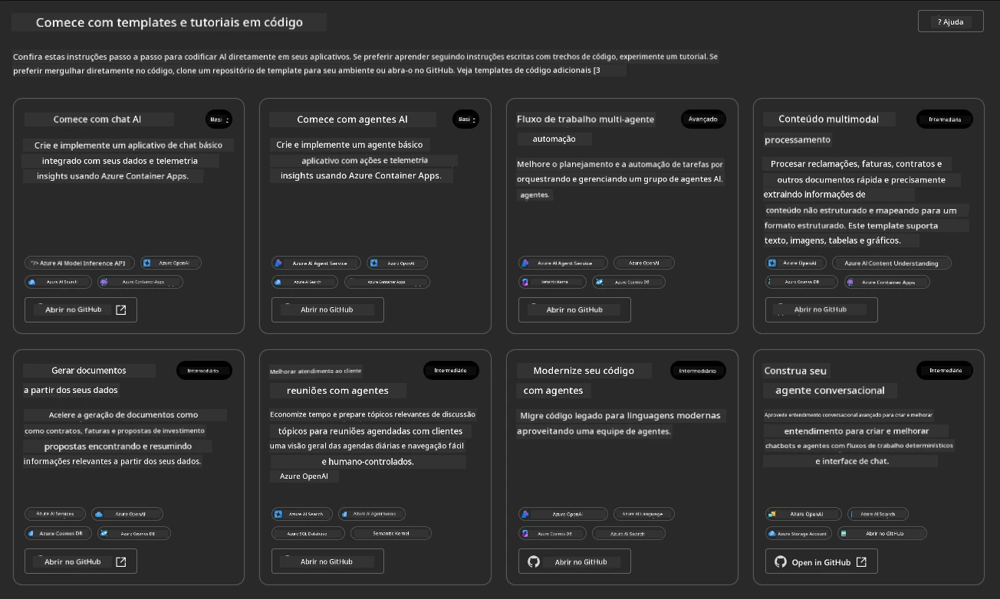

As opções **Básicas** são seus templates iniciais:

1. [ ] [Get Started with AI Chat](https://github.com/Azure-Samples/get-started-with-ai-chat), que implanta um aplicativo de chat básico _com seus dados_ no Azure Container Apps. Use isso para explorar um cenário básico de chatbot de IA.
1. [X] [Get Started with AI Agents](https://github.com/Azure-Samples/get-started-with-ai-agents), que também implanta um Agente de IA padrão (com o Azure AI Agent Service). Use isso para se familiarizar com soluções de IA baseadas em agentes que envolvem ferramentas e modelos.

Visite o segundo link em uma nova aba do navegador (ou clique em `Open in GitHub` no cartão relacionado). Você deve ver o repositório para este template AZD. Reserve um minuto para explorar o README. A arquitetura do aplicativo é assim:


---

## 3. Ativação do Template

Vamos tentar implantar este template e garantir que ele seja válido. Seguiremos as diretrizes da seção [Getting Started](https://github.com/Azure-Samples/get-started-with-ai-agents?tab=readme-ov-file#getting-started).

1. Clique [neste link](https://github.com/codespaces/new/Azure-Samples/get-started-with-ai-agents) - confirme a ação padrão para `Create codespace`
1. Isso abrirá uma nova aba no navegador - aguarde a sessão do GitHub Codespaces carregar completamente
1. Abra o terminal do VS Code no Codespaces - digite o seguinte comando:

   ```bash title="" linenums="0"
   azd up
   ```

Complete os passos do fluxo de trabalho que isso irá acionar:

1. Você será solicitado a fazer login no Azure - siga as instruções para autenticar
1. Insira um nome de ambiente único para você - por exemplo, eu usei `nitya-mshack-azd`
1. Isso criará uma pasta `.azure/` - você verá uma subpasta com o nome do ambiente
1. Você será solicitado a selecionar um nome de assinatura - selecione o padrão
1. Você será solicitado a escolher uma localização - use `East US 2`

Agora, aguarde o provisionamento ser concluído. **Isso leva de 10 a 15 minutos**

1. Quando terminar, seu console mostrará uma mensagem de SUCESSO como esta:
      ```bash title="" linenums="0"
      SUCCESS: Your up workflow to provision and deploy to Azure completed in 10 minutes 17 seconds.
      ```

1. Seu Portal Azure agora terá um grupo de recursos provisionado com o nome do ambiente:

      

1. **Agora você está pronto para validar a infraestrutura e o aplicativo implantados**.

---

## 4. Validação do Template

1. Visite a página [Grupos de Recursos](https://portal.azure.com/#browse/resourcegroups) no Portal Azure - faça login quando solicitado
1. Clique no RG com o nome do seu ambiente - você verá a página acima

      - clique no recurso Azure Container Apps
      - clique na URL do Aplicativo na seção _Essentials_ (canto superior direito)

1. Você deve ver uma interface de usuário de front-end do aplicativo hospedado como esta:

   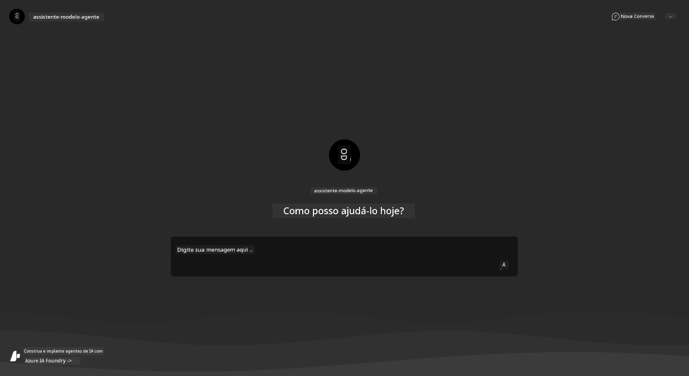

1. Tente fazer algumas [perguntas de exemplo](https://github.com/Azure-Samples/get-started-with-ai-agents/blob/main/docs/sample_questions.md)

      1. Pergunte: ```Qual é a capital da França?``` 
      1. Pergunte: ```Qual é a melhor barraca abaixo de $200 para duas pessoas e quais são suas características?```

1. Você deve obter respostas semelhantes às mostradas abaixo. _Mas como isso funciona?_ 

      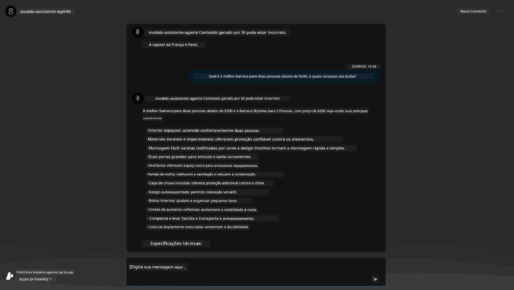

---

## 5. Validação do Agente

O Azure Container App implanta um endpoint que se conecta ao Agente de IA provisionado no projeto Azure AI Foundry para este template. Vamos dar uma olhada no que isso significa.

1. Retorne à página _Overview_ do Portal Azure para seu grupo de recursos

1. Clique no recurso `Azure AI Foundry` na lista

1. Você verá isto. Clique no botão `Go to Azure AI Foundry Portal`. 
   

1. Você verá a página do Projeto Foundry para seu aplicativo de IA
   

1. Clique em `Agents` - você verá o Agente padrão provisionado em seu projeto
   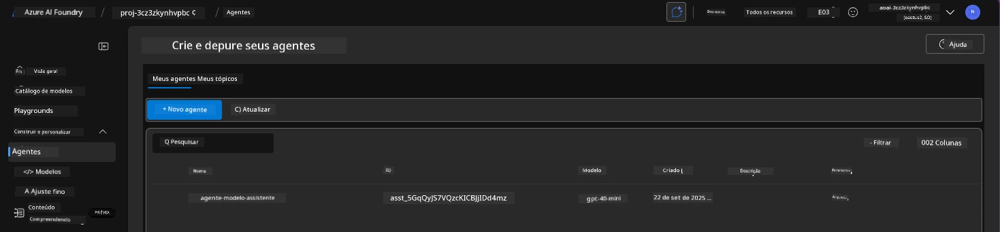

1. Selecione-o - e você verá os detalhes do Agente. Observe o seguinte:

      - O agente usa File Search por padrão (sempre)
      - O `Knowledge` do agente indica que ele tem 32 arquivos carregados (para busca em arquivos)
      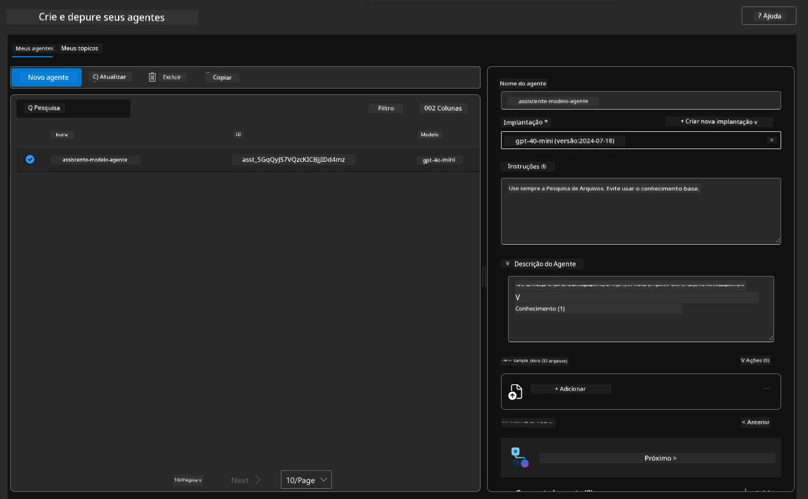

1. Procure pela opção `Data+indexes` no menu à esquerda e clique para ver os detalhes. 

      - Você verá os 32 arquivos de dados carregados para conhecimento.
      - Estes correspondem aos 12 arquivos de clientes e 20 arquivos de produtos em `src/files` 
      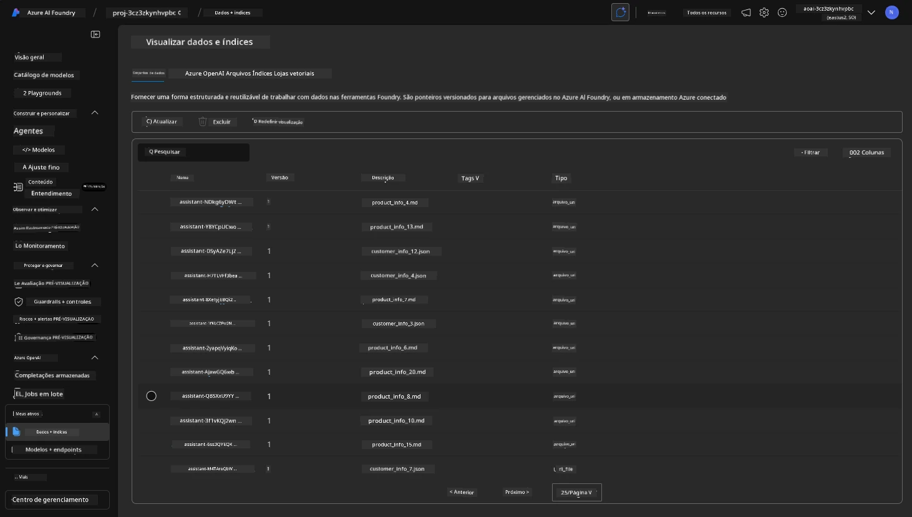

**Você validou a operação do Agente!** 

1. As respostas do agente são baseadas no conhecimento desses arquivos. 
1. Agora você pode fazer perguntas relacionadas a esses dados e obter respostas fundamentadas.
1. Exemplo: `customer_info_10.json` descreve as 3 compras feitas por "Amanda Perez"

Revisite a aba do navegador com o endpoint do Container App e pergunte: `Quais produtos Amanda Perez possui?`. Você verá algo como isto:


---

## 6. Playground do Agente

Vamos construir um pouco mais de intuição sobre as capacidades do Azure AI Foundry, testando o Agente no Playground de Agentes. 

1. Retorne à página `Agents` no Azure AI Foundry - selecione o agente padrão
1. Clique na opção `Try in Playground` - você verá uma interface de Playground como esta
1. Faça a mesma pergunta: `Quais produtos Amanda Perez possui?`

    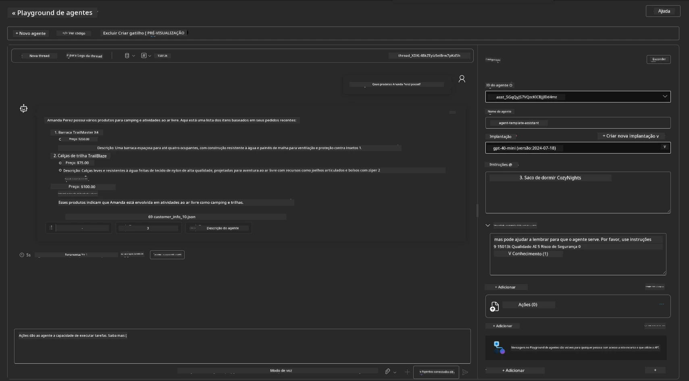

Você obtém a mesma (ou similar) resposta - mas também recebe informações adicionais que podem ser usadas para entender a qualidade, custo e desempenho do seu aplicativo baseado em agentes. Por exemplo:

1. Observe que a resposta cita os arquivos de dados usados para "fundamentar" a resposta
1. Passe o mouse sobre qualquer um desses rótulos de arquivo - os dados correspondem à sua consulta e à resposta exibida?

Você também verá uma linha de _estatísticas_ abaixo da resposta. 

1. Passe o mouse sobre qualquer métrica - por exemplo, Segurança. Você verá algo como isto
1. A avaliação corresponde à sua intuição sobre o nível de segurança da resposta?

      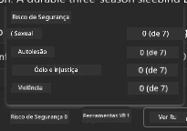

---

## 7. Observabilidade Integrada

Observabilidade trata de instrumentar seu aplicativo para gerar dados que podem ser usados para entender, depurar e otimizar suas operações. Para ter uma ideia disso:

1. Clique no botão `View Run Info` - você verá esta visão. Este é um exemplo de [rastreamento de Agente](https://learn.microsoft.com/en-us/azure/ai-foundry/how-to/develop/trace-agents-sdk#view-trace-results-in-the-azure-ai-foundry-agents-playground) em ação. _Você também pode obter esta visão clicando em Thread Logs no menu principal_.

   - Tenha uma ideia dos passos de execução e ferramentas envolvidas pelo agente
   - Entenda o total de Tokens usados (vs. tokens de saída) para a resposta
   - Entenda a latência e onde o tempo está sendo gasto na execução

      

1. Clique na aba `Metadata` para ver atributos adicionais da execução, que podem fornecer contexto útil para depurar problemas mais tarde.   

      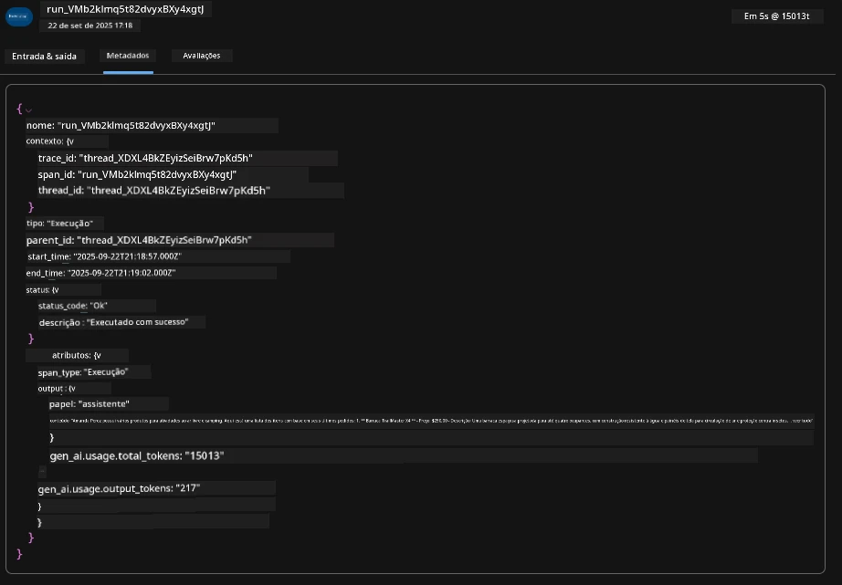

1. Clique na aba `Evaluations` para ver autoavaliações feitas na resposta do agente. Estas incluem avaliações de segurança (por exemplo, Autoagressão) e avaliações específicas do agente (por exemplo, Resolução de Intenção, Adesão à Tarefa).

      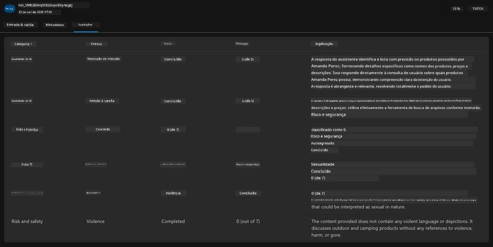

1. Por último, mas não menos importante, clique na aba `Monitoring` no menu lateral.

      - Selecione a aba `Resource usage` na página exibida - e veja as métricas.
      - Acompanhe o uso do aplicativo em termos de custos (tokens) e carga (solicitações).
      - Acompanhe a latência do aplicativo até o primeiro byte (processamento de entrada) e até o último byte (saída).

      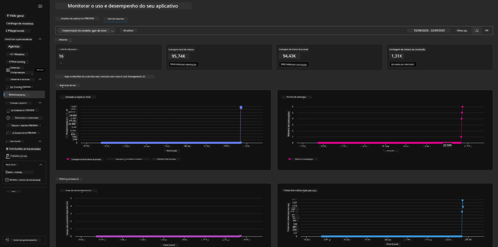

---

## 8. Variáveis de Ambiente

Até agora, percorremos a implantação no navegador - e validamos que nossa infraestrutura foi provisionada e o aplicativo está operacional. Mas para trabalhar com o aplicativo _baseado em código_, precisamos configurar nosso ambiente de desenvolvimento local com as variáveis relevantes necessárias para trabalhar com esses recursos. Usar `azd` torna isso fácil.

1. O Azure Developer CLI [usa variáveis de ambiente](https://learn.microsoft.com/en-us/azure/developer/azure-developer-cli/manage-environment-variables?tabs=bash) para armazenar e gerenciar configurações de configuração para as implantações de aplicativos.

1. As variáveis de ambiente são armazenadas em `.azure/<env-name>/.env` - isso as vincula ao ambiente `<env-name>` usado durante a implantação e ajuda a isolar ambientes entre diferentes alvos de implantação no mesmo repositório.

1. As variáveis de ambiente são carregadas automaticamente pelo comando `azd` sempre que ele executa um comando específico (por exemplo, `azd up`). Observe que o `azd` não lê automaticamente variáveis de ambiente _em nível de sistema operacional_ (por exemplo, configuradas no shell) - em vez disso, use `azd set env` e `azd get env` para transferir informações dentro de scripts.

Vamos testar alguns comandos:

1. Obtenha todas as variáveis de ambiente configuradas para `azd` neste ambiente:

      ```bash title="" linenums="0"
      azd env get-values
      ```
      
      Você verá algo como:

      ```bash title="" linenums="0"
      AZURE_AI_AGENT_DEPLOYMENT_NAME="gpt-4o-mini"
      AZURE_AI_AGENT_NAME="agent-template-assistant"
      AZURE_AI_EMBED_DEPLOYMENT_NAME="text-embedding-3-small"
      AZURE_AI_EMBED_DIMENSIONS=100
      ...
      ```

1. Obtenha um valor específico - por exemplo, quero saber se configuramos o valor `AZURE_AI_AGENT_MODEL_NAME`

      ```bash title="" linenums="0"
      azd env get-value AZURE_AI_AGENT_MODEL_NAME 
      ```
      
      Você verá algo como isto - não foi configurado por padrão!

      ```bash title="" linenums="0"
      ERROR: key 'AZURE_AI_AGENT_MODEL_NAME' not found in the environment values
      ```

1. Configure uma nova variável de ambiente para `azd`. Aqui, atualizamos o nome do modelo do agente. _Nota: quaisquer alterações feitas serão refletidas imediatamente no arquivo `.azure/<env-name>/.env`.

      ```bash title="" linenums="0"
      azd env set AZURE_AI_AGENT_MODEL_NAME gpt-4.1
      azd env set AZURE_AI_AGENT_MODEL_VERSION 2025-04-14
      azd env set AZURE_AI_AGENT_DEPLOYMENT_CAPACITY 150
      ```

      Agora, devemos encontrar o valor configurado:

      ```bash title="" linenums="0"
      azd env get-value AZURE_AI_AGENT_MODEL_NAME 
      ```

1. Observe que alguns recursos são persistentes (por exemplo, implantações de modelos) e exigirão mais do que apenas um `azd up` para forçar a reimplantação. Vamos tentar desmontar a implantação original e reimplantar com variáveis de ambiente alteradas.

1. **Atualizar** Se você já havia implantado infraestrutura usando um template azd - você pode _atualizar_ o estado das suas variáveis de ambiente locais com base no estado atual da sua implantação no Azure usando este comando:
      ```bash title="" linenums="0"
      azd env refresh
      ```

      Esta é uma maneira poderosa de _sincronizar_ variáveis de ambiente entre dois ou mais ambientes de desenvolvimento local (por exemplo, uma equipe com vários desenvolvedores) - permitindo que a infraestrutura implantada sirva como a fonte de verdade para o estado das variáveis de ambiente. Os membros da equipe simplesmente _atualizam_ as variáveis para voltar a ficar em sincronia.

---

## 9. Parabéns 🏆

Você acabou de completar um fluxo de trabalho de ponta a ponta onde:

- [X] Selecionou o Template AZD que deseja usar
- [X] Iniciou o Template com o GitHub Codespaces
- [X] Implantou o Template e validou que ele funciona

---

