# 2. Validar um Template

!!! tip "AO FINAL DESTE MÓDULO VOCÊ SERÁ CAPAZ DE"

    - [ ] Analisar a Arquitetura da Solução de IA
    - [ ] Compreender o Fluxo de Trabalho de Implantação do AZD
    - [ ] Usar o GitHub Copilot para obter ajuda no uso do AZD
    - [ ] **Laboratório 2:** Implantar & Validar o template AI Agents

---


## 1. Introdução

O [Azure Developer CLI](https://learn.microsoft.com/en-us/azure/developer/azure-developer-cli/) ou `azd` é uma ferramenta de linha de comando open-source que simplifica o fluxo de trabalho do desenvolvedor ao construir e implantar aplicações no Azure. 

[AZD Templates](https://learn.microsoft.com/azure/developer/azure-developer-cli/azd-templates) são repositórios padronizados que incluem código de exemplo da aplicação, ativos de _infrastructure-as-code_ e arquivos de configuração do `azd` para uma arquitetura de solução coesa. Provisionar a infraestrutura torna-se tão simples quanto um comando `azd provision` - enquanto usar `azd up` permite que você provisionar a infraestrutura **e** implante sua aplicação em uma única etapa!

Como resultado, iniciar seu processo de desenvolvimento de aplicação pode ser tão simples quanto encontrar o _AZD Starter template_ correto que mais se aproxime das necessidades da sua aplicação e infraestrutura - então personalizar o repositório para atender aos requisitos do seu cenário.

Antes de começarmos, vamos garantir que você tenha o Azure Developer CLI instalado.

1. Abra um terminal do VS Code e digite este comando:

      ```bash title="" linenums="0"
      azd version
      ```

1. Você deve ver algo como isto!

      ```bash title="" linenums="0"
      azd version 1.19.0 (commit b3d68cea969b2bfbaa7b7fa289424428edb93e97)
      ```

**Agora você está pronto para selecionar e implantar um template com azd**

---

## 2. Seleção do Template

A plataforma Microsoft Foundry vem com um [conjunto de templates AZD recomendados](https://learn.microsoft.com/en-us/azure/ai-foundry/how-to/develop/ai-template-get-started) que cobrem cenários de solução populares como _automação de fluxo de trabalho multiagente_ e _processamento de conteúdo multimodal_. Você também pode descobrir esses templates visitando o portal Microsoft Foundry.

1. Visite [https://ai.azure.com/templates](https://ai.azure.com/templates)
1. Faça login no portal Microsoft Foundry quando solicitado - você verá algo assim.

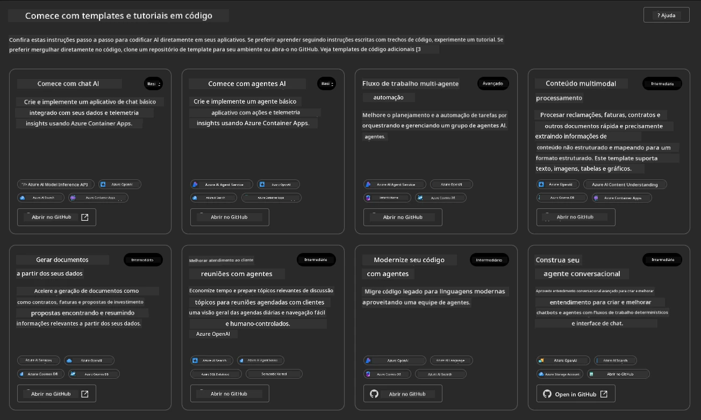


As opções **Basic** são seus templates iniciais:

1. [ ] [Get Started with AI Chat](https://github.com/Azure-Samples/get-started-with-ai-chat) que implanta uma aplicação de chat básica _com seus dados_ no Azure Container Apps. Use isto para explorar um cenário básico de chatbot de IA.
1. [X] [Get Started with AI Agents](https://github.com/Azure-Samples/get-started-with-ai-agents) que também implanta um AI Agent padrão (com os Foundry Agents). Use isto para se familiarizar com soluções agentivas de IA envolvendo ferramentas e modelos.

Visite o segundo link em uma nova aba do navegador (ou clique em `Open in GitHub` no cartão relacionado). Você deve ver o repositório para este AZD Template. Reserve um minuto para explorar o README. A arquitetura da aplicação é assim:

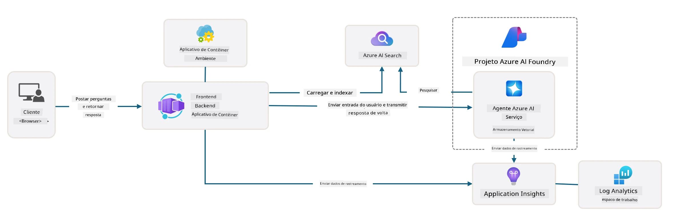

---

## 3. Ativação do Template

Vamos tentar implantar este template e garantir que ele seja válido. Seguiremos as diretrizes na seção [Getting Started](https://github.com/Azure-Samples/get-started-with-ai-agents?tab=readme-ov-file#getting-started).

1. Clique [neste link](https://github.com/codespaces/new/Azure-Samples/get-started-with-ai-agents) - confirme a ação padrão para `Create codespace`
1. Isso abre uma nova aba do navegador - aguarde a sessão do GitHub Codespaces concluir o carregamento
1. Abra o terminal do VS Code no Codespaces - digite o seguinte comando:

   ```bash title="" linenums="0"
   azd up
   ```

Complete as etapas do fluxo de trabalho que isso irá acionar:

1. Você será solicitado a fazer login no Azure - siga as instruções para autenticar
1. Insira um nome de ambiente único para você - por exemplo, eu usei `nitya-mshack-azd`
1. Isso criará uma pasta `.azure/` - você verá uma subpasta com o nome do ambiente
1. Você será solicitado a selecionar um nome de assinatura - selecione o padrão
1. Você será solicitado por uma localização - use `East US 2`

Agora, aguarde a conclusão do provisionamento. **Isso leva de 10 a 15 minutos**

1. Quando concluir, seu console mostrará uma mensagem de SUCCESS como esta:
      ```bash title="" linenums="0"
      SUCCESS: Your up workflow to provision and deploy to Azure completed in 10 minutes 17 seconds.
      ```
1. Seu Azure Portal agora terá um grupo de recursos provisionado com esse nome de ambiente:

      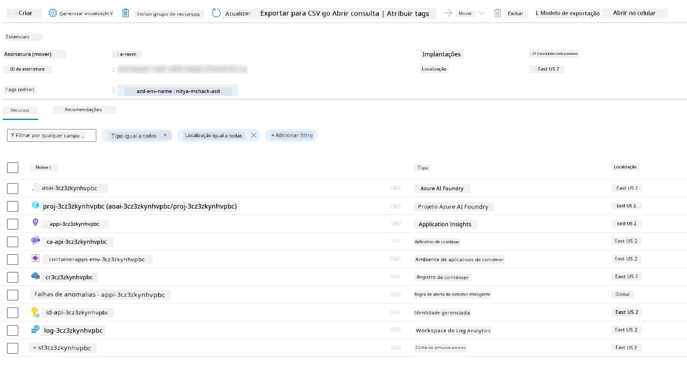

1. **Agora você está pronto para validar a infraestrutura e a aplicação implantadas**.

---

## 4. Validação do Template

1. Visite a página de [Resource Groups](https://portal.azure.com/#browse/resourcegroups) do Azure Portal - faça login quando solicitado
1. Clique no RG do nome do seu ambiente - você verá a página acima

      - clique no recurso Azure Container Apps
      - clique na Application Url na seção _Essentials_ (canto superior direito)

1. Você deverá ver uma interface frontal da aplicação hospedada assim:

   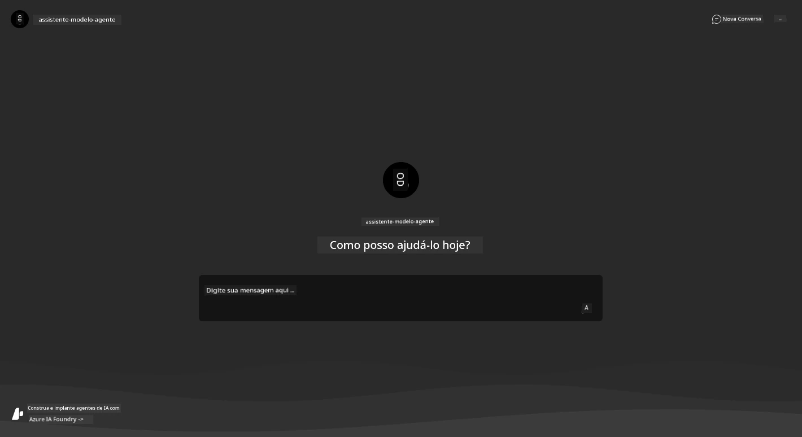

1. Tente fazer algumas [perguntas de exemplo](https://github.com/Azure-Samples/get-started-with-ai-agents/blob/main/docs/sample_questions.md)

      1. Pergunte: ```Qual é a capital da França?``` 
      1. Pergunte: ```Qual é a melhor barraca abaixo de $200 para duas pessoas, e quais recursos ela inclui?```

1. Você deverá obter respostas semelhantes ao que é mostrado abaixo. _Mas como isso funciona?_ 

      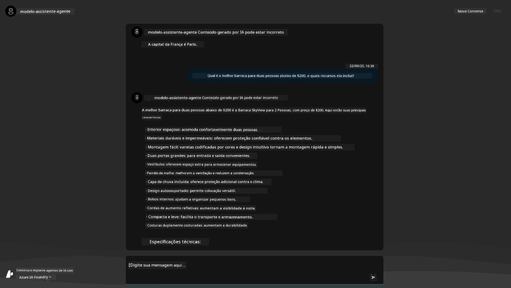

---

## 5. Validação do Agente

O Azure Container App implanta um endpoint que se conecta ao AI Agent provisionado no projeto Microsoft Foundry para este template. Vamos dar uma olhada no que isso significa.

1. Retorne à página _Overview_ do Azure Portal para seu grupo de recursos

1. Clique no recurso `Microsoft Foundry` nessa lista

1. Você deverá ver isto. Clique no botão `Go to Microsoft Foundry Portal`. 
   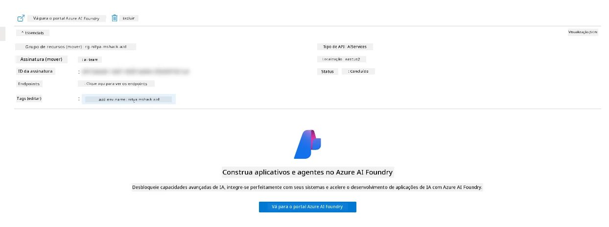

1. Você deverá ver a página do Projeto Foundry para sua aplicação de IA
   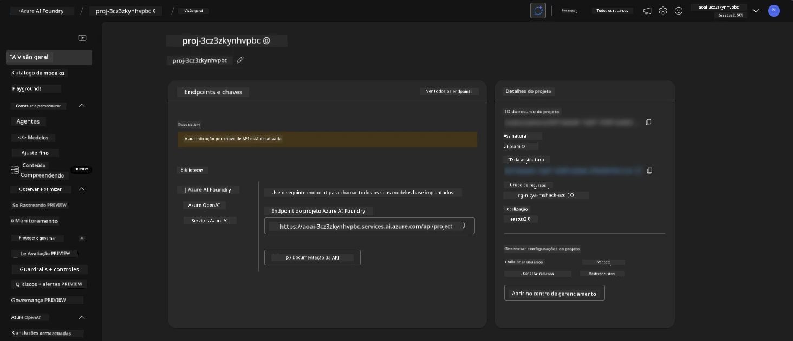

1. Clique em `Agents` - você verá o Agent padrão provisionado em seu projeto
   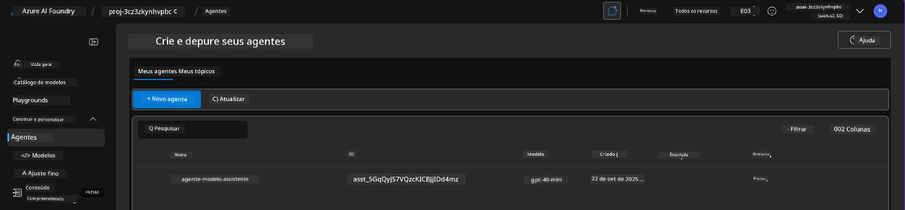

1. Selecione-o - e você verá os detalhes do Agent. Observe o seguinte:

      - O agent usa File Search por padrão (sempre)
      - o `Knowledge` do agent indica que ele tem 32 arquivos carregados (para file search)
      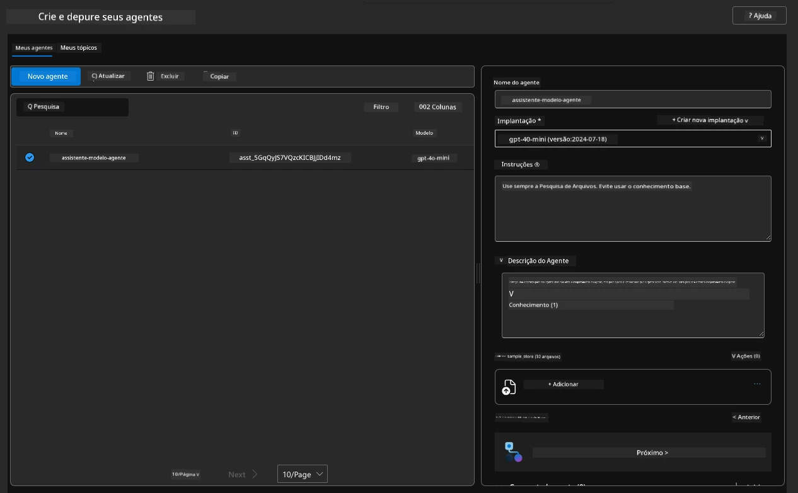

1. Procure a opção `Data+indexes` no menu à esquerda e clique para ver detalhes. 

      - Você deverá ver os 32 arquivos de dados carregados para conhecimento.
      - Estes corresponderão aos 12 arquivos de clientes e 20 arquivos de produtos em `src/files` 
      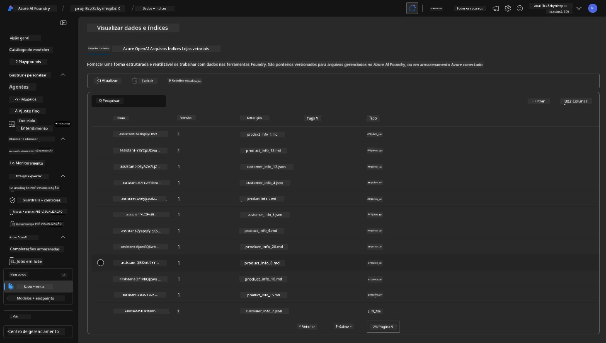

**Você validou a operação do Agente!** 

1. As respostas do agente estão fundamentadas no conhecimento desses arquivos. 
1. Agora você pode fazer perguntas relacionadas a esses dados, e obter respostas fundamentadas.
1. Exemplo: `customer_info_10.json` descreve as 3 compras feitas por "Amanda Perez"

Retorne à aba do navegador com o endpoint do Container App e pergunte: `Quais produtos Amanda Perez possui?`. Você deverá ver algo assim:

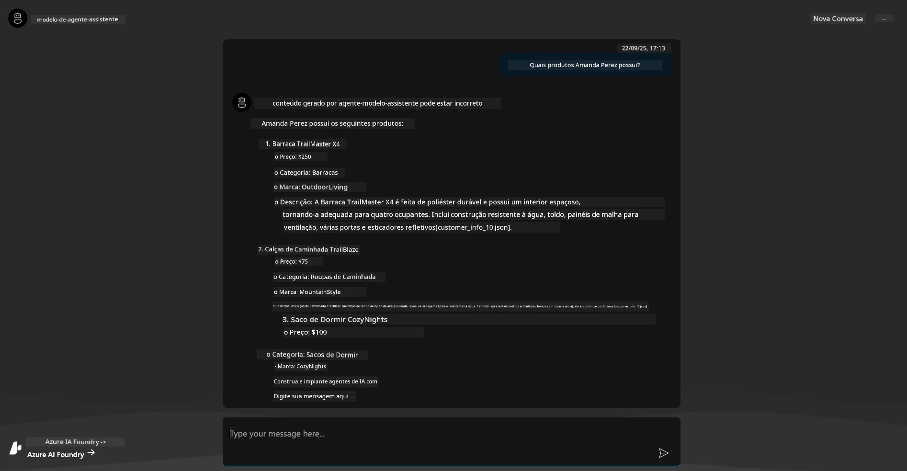

---

## 6. Playground do Agente

Vamos construir um pouco mais de intuição para as capacidades do Microsoft Foundry, experimentando o Agent no Agents Playground. 

1. Retorne à página `Agents` no Microsoft Foundry - selecione o agent padrão
1. Clique na opção `Try in Playground` - você deverá ver uma UI do Playground assim
1. Pergunte a mesma questão: `Quais produtos Amanda Perez possui?`

    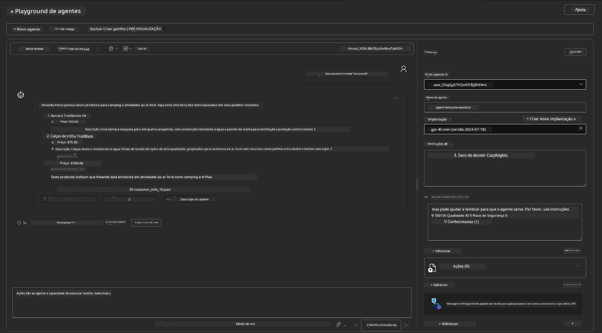

Você obtém a mesma (ou similar) resposta - mas você também recebe informações adicionais que podem ser usadas para entender a qualidade, custo e desempenho do seu app agentivo. Por exemplo:

1. Observe que a resposta cita os arquivos de dados usados para "fundamentar" a resposta
1. Passe o cursor sobre qualquer um desses rótulos de arquivo - os dados correspondem à sua consulta e à resposta exibida?

Você também verá uma linha de _estatísticas_ abaixo da resposta. 

1. Passe o cursor sobre qualquer métrica - por exemplo, Safety. Você verá algo assim
1. A classificação avaliada corresponde à sua intuição sobre o nível de segurança da resposta?

      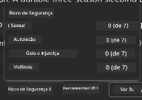

---

## 7. Observabilidade embutida

Observabilidade é sobre instrumentar sua aplicação para gerar dados que possam ser usados para entender, depurar e otimizar suas operações. Para ter uma noção disso:

1. Clique no botão `View Run Info` - você deverá ver esta visão. Este é um exemplo de [Agent tracing](https://learn.microsoft.com/en-us/azure/ai-foundry/how-to/develop/trace-agents-sdk#view-trace-results-in-the-azure-ai-foundry-agents-playground) em ação. _Você também pode obter esta visão clicando em Thread Logs no menu de nível superior_.

   - Tenha uma noção dos passos da execução e das ferramentas acionadas pelo agent
   - Entenda a contagem total de Tokens (vs. uso de tokens de saída) para a resposta
   - Entenda a latência e onde o tempo está sendo gasto na execução

      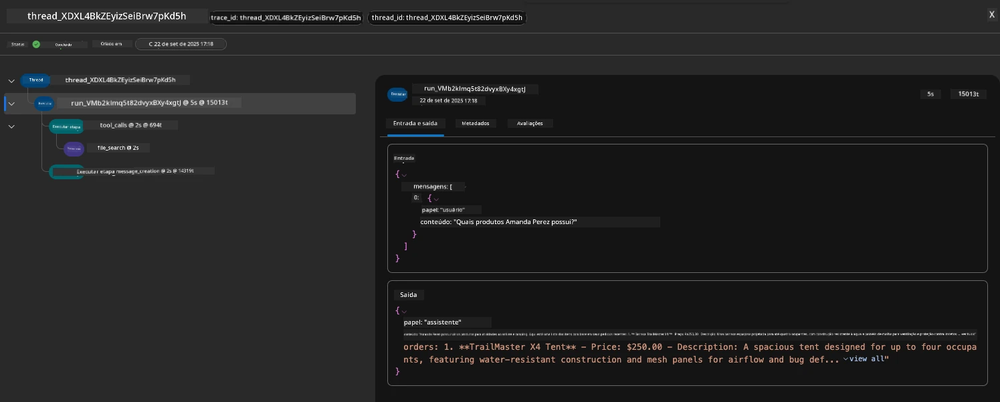

1. Clique na aba `Metadata` para ver atributos adicionais da execução, que podem fornecer contexto útil para depurar problemas mais tarde.   

      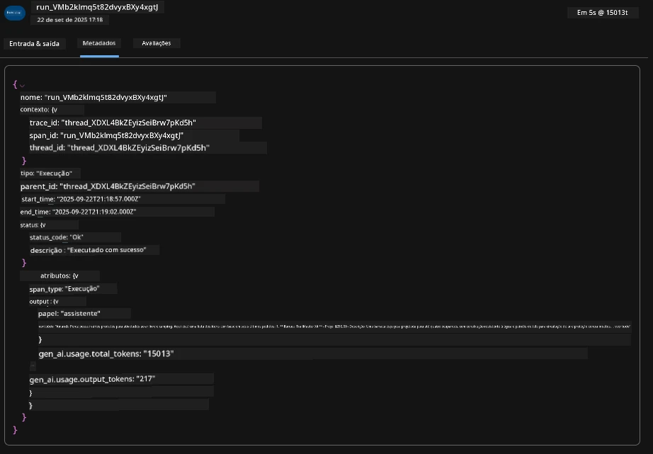


1. Clique na aba `Evaluations` para ver autoavaliações feitas sobre a resposta do agent. Estas incluem avaliações de segurança (por exemplo, Autolesão) e avaliações específicas do agent (por exemplo, resolução de intenção, aderência à tarefa).

      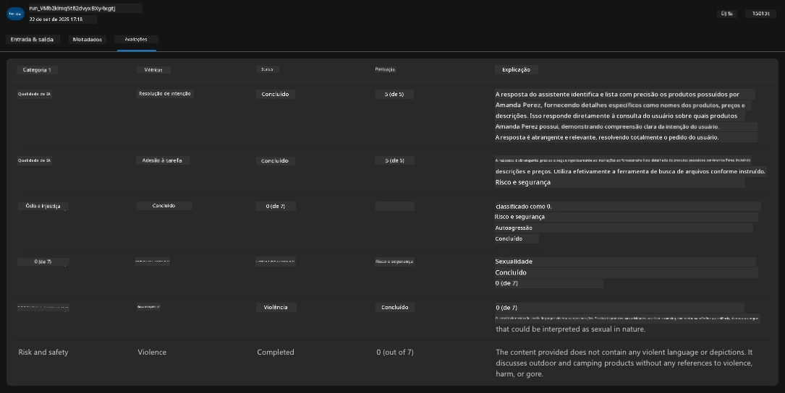

1. Por último, mas não menos importante, clique na aba `Monitoring` no menu lateral.

      - Selecione a aba `Resource usage` na página exibida - e visualize as métricas.
      - Acompanhe o uso da aplicação em termos de custos (tokens) e carga (requisições).
      - Acompanhe a latência da aplicação até o primeiro byte (processamento de entrada) e o último byte (saída).

      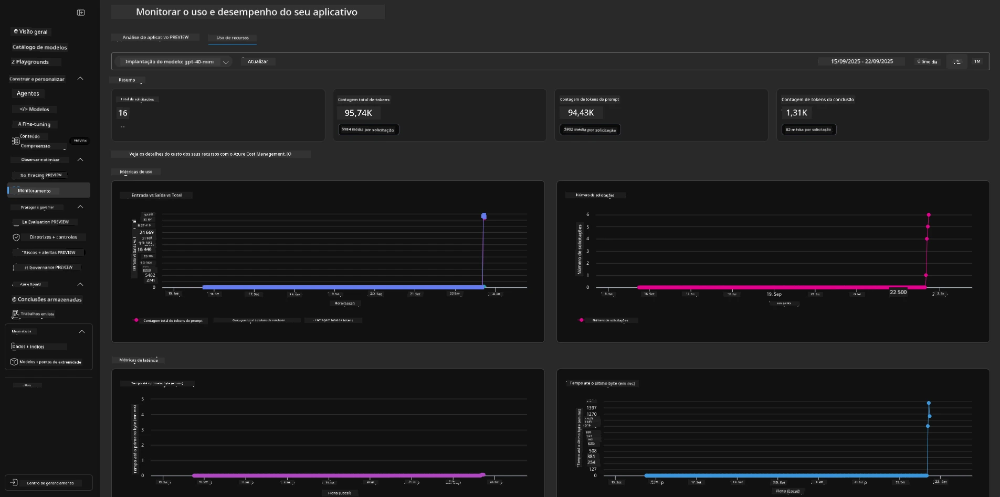

---

## 8. Variáveis de Ambiente

Até agora, percorremos a implantação no navegador - e validamos que nossa infraestrutura foi provisionada e a aplicação está operacional. Mas para trabalhar com a aplicação _com foco no código_, precisamos configurar nosso ambiente de desenvolvimento local com as variáveis relevantes necessárias para trabalhar com esses recursos. Usar o `azd` facilita isso.

1. O Azure Developer CLI [usa variáveis de ambiente](https://learn.microsoft.com/en-us/azure/developer/azure-developer-cli/manage-environment-variables?tabs=bash) para armazenar e gerenciar configurações para as implantações da aplicação.

1. As variáveis de ambiente são armazenadas em `.azure/<env-name>/.env` - isso as limita ao ambiente `env-name` usado durante a implantação e ajuda a isolar ambientes entre diferentes alvos de implantação no mesmo repositório.

1. As variáveis de ambiente são carregadas automaticamente pelo comando `azd` sempre que ele executa um comando específico (por exemplo, `azd up`). Observe que o `azd` não lê automaticamente variáveis de ambiente em nível de SO (por exemplo, definidas no shell) - em vez disso use `azd set env` e `azd get env` para transferir informações dentro de scripts.


Vamos experimentar alguns comandos:

1. Obtenha todas as variáveis de ambiente definidas para o `azd` neste ambiente:

      ```bash title="" linenums="0"
      azd env get-values
      ```
      
      Você verá algo como:

      ```bash title="" linenums="0"
      AZURE_AI_AGENT_DEPLOYMENT_NAME="gpt-4.1-mini"
      AZURE_AI_AGENT_NAME="agent-template-assistant"
      AZURE_AI_EMBED_DEPLOYMENT_NAME="text-embedding-3-small"
      AZURE_AI_EMBED_DIMENSIONS=100
      ...
      ```

1. Obtenha um valor específico - por exemplo, quero saber se definimos o valor `AZURE_AI_AGENT_MODEL_NAME`

      ```bash title="" linenums="0"
      azd env get-value AZURE_AI_AGENT_MODEL_NAME 
      ```
      
      Você verá algo como isto - não foi definido por padrão!

      ```bash title="" linenums="0"
      ERROR: key 'AZURE_AI_AGENT_MODEL_NAME' not found in the environment values
      ```

1. Defina uma nova variável de ambiente para o `azd`. Aqui, atualizamos o nome do modelo do agent. _Observação: quaisquer alterações feitas serão refletidas imediatamente no arquivo `.azure/<env-name>/.env`.

      ```bash title="" linenums="0"
      azd env set AZURE_AI_AGENT_MODEL_NAME gpt-4.1
      azd env set AZURE_AI_AGENT_MODEL_VERSION 2025-04-14
      azd env set AZURE_AI_AGENT_DEPLOYMENT_CAPACITY 150
      ```

      Agora, devemos encontrar o valor definido:

      ```bash title="" linenums="0"
      azd env get-value AZURE_AI_AGENT_MODEL_NAME 
      ```

1. Observe que alguns recursos são persistentes (por exemplo, implantações de modelos) e irão requerer mais do que apenas um `azd up` para forçar a reimplantação. Vamos tentar desmontar a implantação original e reimplantar com variáveis de ambiente alteradas.

1. **Atualizar** Se você já implantou infraestrutura anteriormente usando um template azd - você pode _atualizar_ o estado das suas variáveis de ambiente locais com base no estado atual da sua implantação no Azure usando este comando:

      ```bash title="" linenums="0"
      azd env refresh
      ```

      Esta é uma maneira poderosa de _sincronizar_ variáveis de ambiente entre dois ou mais ambientes de desenvolvimento locais (por exemplo, equipe com vários desenvolvedores) - permitindo que a infraestrutura implantada sirva como a fonte da verdade para o estado das variáveis de ambiente. Os membros da equipe simplesmente _atualizam_ as variáveis para voltarem a ficar sincronizados.

---

## 9. Parabéns 🏆

Você acabou de concluir um fluxo de trabalho de ponta a ponta onde você:

- [X] Selecionou o Modelo AZD que deseja usar
- [X] Iniciou o Modelo com o GitHub Codespaces 
- [X] Implantou o Modelo e validou que funciona

---

<!-- CO-OP TRANSLATOR DISCLAIMER START -->
**Aviso Legal**:
Este documento foi traduzido usando o serviço de tradução por IA [Co-op Translator](https://github.com/Azure/co-op-translator). Embora nos esforcemos para alcançar precisão, esteja ciente de que traduções automatizadas podem conter erros ou imprecisões. O documento original em seu idioma nativo deve ser considerado a fonte autorizada. Para informações críticas, recomenda-se tradução humana profissional. Não nos responsabilizamos por quaisquer mal-entendidos ou interpretações equivocadas decorrentes do uso desta tradução.
<!-- CO-OP TRANSLATOR DISCLAIMER END -->