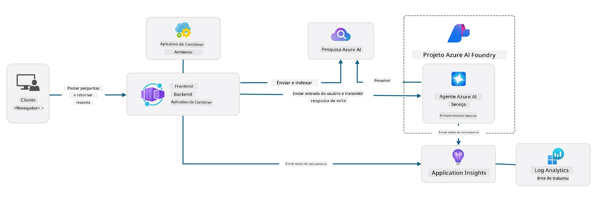

# 3. Desconstruir um Template

!!! tip "AO FINAL DESTE MÓDULO VOCÊ SERÁ CAPAZ DE"

    - [ ] Ativar o GitHub Copilot com servidores MCP para assistência do Azure
    - [ ] Entender a estrutura de pastas e componentes do template AZD
    - [ ] Explorar padrões de organização de infraestrutura como código (Bicep)
    - [ ] **Lab 3:** Usar o GitHub Copilot para explorar e entender a arquitetura do repositório 

---


Com templates AZD e a Azure Developer CLI (`azd`) podemos iniciar rapidamente nossa jornada de desenvolvimento de IA com repositórios padronizados que fornecem código de exemplo, infraestrutura e arquivos de configuração - na forma de um projeto _starter_ pronto para implantação.

**Mas agora, precisamos entender a estrutura do projeto e a base de código - e ser capazes de personalizar o template AZD - sem nenhuma experiência prévia ou entendimento do AZD!**

---

## 1. Ativar o GitHub Copilot

### 1.1 Instalar o GitHub Copilot Chat

É hora de explorar [GitHub Copilot com o Modo Agente](https://code.visualstudio.com/docs/copilot/chat/chat-agent-mode). Agora, podemos usar linguagem natural para descrever nossa tarefa em alto nível e obter assistência na execução. Para este laboratório, usaremos o [plano gratuito do Copilot](https://github.com/github-copilot/signup) que possui um limite mensal para conclusões e interações de chat.

A extensão pode ser instalada no marketplace, mas já deve estar disponível no seu ambiente Codespaces. _Clique em `Open Chat` no menu suspenso do ícone do Copilot - e digite um prompt como `What can you do?`_ - você pode ser solicitado a fazer login. **O GitHub Copilot Chat está pronto**.

### 1.2. Instalar os servidores MCP

Para que o modo Agente seja eficaz, ele precisa ter acesso às ferramentas certas para ajudá-lo a recuperar conhecimento ou executar ações. É aqui que os servidores MCP podem ajudar. Vamos configurar os seguintes servidores:

1. [Servidor MCP do Azure](../../../../../workshop/docs/instructions)
1. [Servidor MCP do Microsoft Docs](../../../../../workshop/docs/instructions)

Para ativá-los:

1. Crie um arquivo chamado `.vscode/mcp.json` se ele não existir
1. Copie o seguinte para esse arquivo - e inicie os servidores!
   ```json title=".vscode/mcp.json"
   {
      "servers": {
         "Azure MCP Server": {
            "command": "npx",
            "args": [
            "-y",
            "@azure/mcp@latest",
            "server",
            "start"
            ]
         },
         "microsoft.docs.mcp": {
            "type": "http",
            "url": "https://learn.microsoft.com/api/mcp"
         }
      }
   }
   ```

??? warning "Você pode receber um erro indicando que o `npx` não está instalado (clique para expandir a correção)"

      Para corrigir, abra o arquivo `.devcontainer/devcontainer.json` e adicione esta linha na seção features. Em seguida, reconstrua o contêiner. Você deverá agora ter o `npx` instalado.

      ```title="" linenums="0"
         "features": {
            "ghcr.io/devcontainers/features/node:1": {},
            ...
         },
      ```

---

### 1.3. Testar o GitHub Copilot Chat

**Primeiro use `az login` para autenticar no Azure a partir da linha de comando do VS Code.**

Você agora deverá ser capaz de consultar o status da sua assinatura do Azure e fazer perguntas sobre recursos implantados ou configuração. Experimente estes prompts:

1. `List my Azure resource groups`
1. `#foundry list my current deployments`

Você também pode fazer perguntas sobre a documentação do Azure e obter respostas fundamentadas no servidor MCP do Microsoft Docs. Experimente estes prompts:

1. `#microsoft_docs_search What is Azure Developer CLI?`
1. `#microsoft_docs_search Show me a Python tutorial to chat with deployed model`

Ou você pode pedir trechos de código para completar uma tarefa. Tente este prompt.

1. `Give me a Python code example that uses AAD for an interactive chat client`

No modo `Ask`, isso fornecerá código que você pode copiar e colar e testar. No modo `Agent`, isso pode ir um passo além e criar os recursos relevantes para você - incluindo scripts de configuração e documentação - para ajudá-lo a executar essa tarefa.

**Você agora está pronto para começar a explorar o repositório de template**

---

## 2. Desconstruir a Arquitetura

??? prompt "PERGUNTE: Explique a arquitetura da aplicação em docs/images/architecture.png em 1 parágrafo"

      Esta aplicação é um aplicativo de chat com IA construído no Azure que demonstra uma arquitetura moderna baseada em agentes. A solução é centrada em um Azure Container App que hospeda o código principal da aplicação, que processa a entrada do usuário e gera respostas inteligentes por meio de um agente de IA. 
      
      A arquitetura aproveita o Microsoft Foundry Project como base para capacidades de IA, conectando-se aos Serviços de IA do Azure que fornecem os modelos de linguagem subjacentes (como GPT-4o-mini) e funcionalidades de agente. As interações dos usuários fluem por um frontend baseado em React para um backend FastAPI que se comunica com o serviço do agente de IA para gerar respostas contextuais. 
      
      O sistema incorpora capacidades de recuperação de conhecimento por meio de busca em arquivos ou do serviço Azure AI Search, permitindo que o agente acesse e cite informações de documentos enviados. Para excelência operacional, a arquitetura inclui monitoramento abrangente através do Application Insights e do Log Analytics Workspace para rastreamento, logging e otimização de desempenho. 
      
      O Azure Storage fornece armazenamento de blobs para dados da aplicação e uploads de arquivos, enquanto a Managed Identity garante acesso seguro entre recursos do Azure sem armazenar credenciais. Toda a solução é projetada para escalabilidade e manutenção, com a aplicação conteinerizada escalando automaticamente conforme a demanda e oferecendo segurança, monitoramento e capacidades de CI/CD integradas através do ecossistema de serviços gerenciados da Azure.



---

## 3. Estrutura do Repositório

!!! prompt "PERGUNTE: Explique a estrutura de pastas do template. Comece com um diagrama hierárquico visual."

??? info "RESPOSTA: Diagrama Hierárquico Visual"

      ```bash title="" 
      get-started-with-ai-agents/
      ├── 📋 Configuration & Setup
      │   ├── azure.yaml                    # Configuração do Azure Developer CLI
      │   ├── docker-compose.yaml           # Contêineres para desenvolvimento local
      │   ├── pyproject.toml                # Configuração do projeto Python
      │   ├── requirements-dev.txt          # Dependências de desenvolvimento
      │   └── .devcontainer/                # Configuração do devcontainer do VS Code
      │
      ├── 🏗️ Infrastructure (infra/)
      │   ├── main.bicep                    # Template principal de infraestrutura
      │   ├── api.bicep                     # Recursos específicos da API
      │   ├── main.parameters.json          # Parâmetros de infraestrutura
      │   └── core/                         # Componentes modulares de infraestrutura
      │       ├── ai/                       # Configurações de serviços de IA
      │       ├── host/                     # Infraestrutura de hospedagem
      │       ├── monitor/                  # Monitoramento e logging
      │       ├── search/                   # Configuração do Azure AI Search
      │       ├── security/                 # Segurança e identidade
      │       └── storage/                  # Configurações de conta de armazenamento
      │
      ├── 💻 Application Source (src/)
      │   ├── api/                          # API de backend
      │   │   ├── main.py                   # Entrada da aplicação FastAPI
      │   │   ├── routes.py                 # Definições de rotas da API
      │   │   ├── search_index_manager.py   # Funcionalidade de busca
      │   │   ├── data/                     # Manipulação de dados da API
      │   │   ├── static/                   # Recursos web estáticos
      │   │   └── templates/                # Templates HTML
      │   ├── frontend/                     # Frontend React/TypeScript
      │   │   ├── package.json              # Dependências do Node.js
      │   │   ├── vite.config.ts            # Configuração de build do Vite
      │   │   └── src/                      # Código fonte do frontend
      │   ├── data/                         # Arquivos de dados de exemplo
      │   │   └── embeddings.csv            # Embeddings pré-computados
      │   ├── files/                        # Arquivos da base de conhecimento
      │   │   ├── customer_info_*.json      # Exemplos de dados de clientes
      │   │   └── product_info_*.md         # Documentação de produto
      │   ├── Dockerfile                    # Configuração do contêiner
      │   └── requirements.txt              # Dependências Python
      │
      ├── 🔧 Automation & Scripts (scripts/)
      │   ├── postdeploy.sh/.ps1           # Configuração pós-implantação
      │   ├── setup_credential.sh/.ps1     # Configuração de credenciais
      │   ├── validate_env_vars.sh/.ps1    # Validação de ambiente
      │   └── resolve_model_quota.sh/.ps1  # Gerenciamento de cota de modelos
      │
      ├── 🧪 Testing & Evaluation
      │   ├── tests/                        # Testes unitários e de integração
      │   │   └── test_search_index_manager.py
      │   ├── evals/                        # Framework de avaliação de agentes
      │   │   ├── evaluate.py               # Executor de avaliação
      │   │   ├── eval-queries.json         # Consultas de teste
      │   │   └── eval-action-data-path.json
      │   ├── sandbox/                      # Playground de desenvolvimento
      │   │   ├── 1-quickstart.py           # Exemplos de introdução
      │   │   └── aad-interactive-chat.py   # Exemplos de autenticação
      │   └── airedteaming/                 # Avaliação de segurança de IA
      │       └── ai_redteaming.py          # Testes de red team
      │
      ├── 📚 Documentation (docs/)
      │   ├── deployment.md                 # Guia de implantação
      │   ├── local_development.md          # Instruções de configuração local
      │   ├── troubleshooting.md            # Problemas comuns e correções
      │   ├── azure_account_setup.md        # Pré-requisitos do Azure
      │   └── images/                       # Recursos de documentação
      │
      └── 📄 Project Metadata
         ├── README.md                     # Visão geral do projeto
         ├── CODE_OF_CONDUCT.md           # Diretrizes da comunidade
         ├── CONTRIBUTING.md              # Guia de contribuição
         ├── LICENSE                      # Termos da licença
         └── next-steps.md                # Orientações pós-implantação
      ```

### 3.1. Arquitetura Principal do Aplicativo

Este template segue um padrão de **aplicação web full-stack** com:

- **Backend**: Python FastAPI com integração ao Azure AI
- **Frontend**: TypeScript/React com sistema de build Vite
- **Infraestrutura**: Templates Azure Bicep para recursos em nuvem
- **Containerização**: Docker para implantação consistente

### 3.2 Infra como Código (Bicep)

A camada de infraestrutura utiliza templates **Azure Bicep** organizados de forma modular:

   - **`main.bicep`**: Orquestra todos os recursos do Azure
   - **`core/` modules**: Componentes reutilizáveis para diferentes serviços
      - Serviços de IA (Azure OpenAI, AI Search)
      - Hospedagem de contêineres (Azure Container Apps)
      - Monitoramento (Application Insights, Log Analytics)
      - Segurança (Key Vault, Managed Identity)

### 3.3 Código-Fonte da Aplicação (`src/`)

**Backend API (`src/api/`)**:

- API REST baseada em FastAPI
- Integração com Foundry Agents
- Gerenciamento de índice de busca para recuperação de conhecimento
- Capacidades de upload e processamento de arquivos

**Frontend (`src/frontend/`)**:

- SPA moderna em React/TypeScript
- Vite para desenvolvimento rápido e builds otimizados
- Interface de chat para interações com o agente

**Base de Conhecimento (`src/files/`)**:

- Dados de exemplo de clientes e produtos
- Demonstra recuperação de conhecimento baseada em arquivos
- Exemplos em formatos JSON e Markdown


### 3.4 DevOps & Automação

**Scripts (`scripts/`)**:

- Scripts PowerShell e Bash multiplataforma
- Validação e configuração de ambiente
- Configuração pós-implantação
- Gerenciamento de cota de modelos

**Integração com Azure Developer CLI**:

- Configuração `azure.yaml` para fluxos `azd`
- Provisionamento e implantação automatizados
- Gerenciamento de variáveis de ambiente

### 3.5 Testes & Garantia de Qualidade

**Framework de Avaliação (`evals/`)**:

- Avaliação de desempenho de agentes
- Testes de qualidade de consulta-resposta
- Pipeline de avaliação automatizada

**Segurança de IA (`airedteaming/`)**:

- Testes de red team para segurança de IA
- Varredura de vulnerabilidades de segurança
- Práticas de IA responsável

---

## 4. Parabéns 🏆

Você usou com sucesso o GitHub Copilot Chat com servidores MCP para explorar o repositório.

- [X] Ativou o GitHub Copilot para Azure
- [X] Entendeu a Arquitetura da Aplicação
- [X] Explorou a estrutura do template AZD

Isto lhe dá uma noção dos ativos de _infrastructure as code_ deste template. A seguir, veremos o arquivo de configuração do AZD.

---

<!-- CO-OP TRANSLATOR DISCLAIMER START -->
Isenção de responsabilidade:
Este documento foi traduzido usando o serviço de tradução por IA Co-op Translator (https://github.com/Azure/co-op-translator). Embora nos empenhemos pela precisão, esteja ciente de que traduções automatizadas podem conter erros ou imprecisões. O documento original em seu idioma nativo deve ser considerado a fonte autorizada. Para informações críticas, recomenda-se tradução humana profissional. Não nos responsabilizamos por quaisquer mal-entendidos ou interpretações equivocadas decorrentes do uso desta tradução.
<!-- CO-OP TRANSLATOR DISCLAIMER END -->