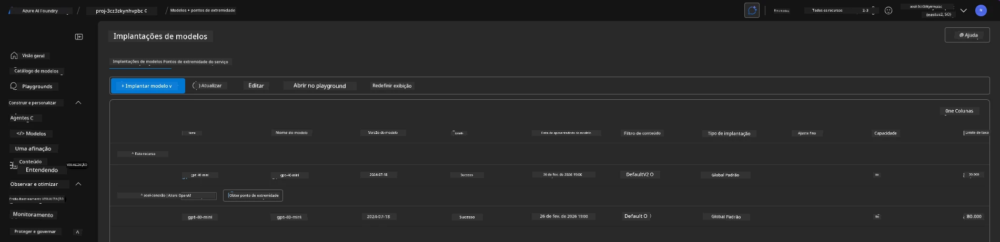
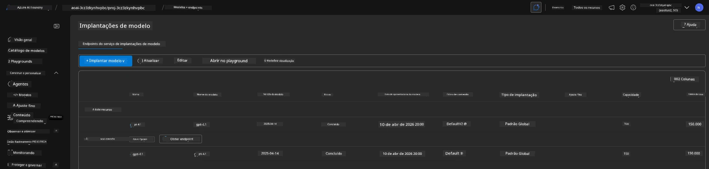

# 6. Encerrar a Infraestrutura

!!! tip "AO FINAL DESTE MÓDULO VOCÊ PODERÁ"

    - [ ] Entender a importância da limpeza de recursos e do gerenciamento de custos
    - [ ] Usar `azd down` para desprovisionar a infraestrutura com segurança
    - [ ] Recuperar serviços cognitivos excluídos (soft-deleted), se necessário
    - [ ] **Lab 6:** Limpar recursos do Azure e verificar a remoção

---

## Exercícios Bônus

Antes de encerrarmos o projeto, reserve alguns minutos para fazer uma exploração aberta.

!!! info "Experimente estes prompts de exploração"

    **Experimente o GitHub Copilot:**
    
    1. Pergunte: `Que outros templates AZD eu poderia experimentar para cenários multi-agente?`
    2. Pergunte: `Como posso personalizar as instruções do agente para um caso de uso em saúde?`
    3. Pergunte: `Quais variáveis de ambiente controlam a otimização de custos?`
    
    **Explore o Portal do Azure:**
    
    1. Revise as métricas do Application Insights da sua implantação
    2. Verifique a análise de custos dos recursos provisionados
    3. Explore novamente o playground de agentes do portal Microsoft Foundry

---

## Desprovisionar Infraestrutura

1. Encerrar a infraestrutura é tão fácil quanto:
      
      ```bash title="" linenums="0"
      azd down --purge
      ```
1. A flag `--purge` garante que ela também purgue recursos do Cognitive Service que foram soft-deleted, liberando assim a cota mantida por esses recursos. Uma vez concluído, você verá algo como isto:
      
      ```bash title="" linenums="0"
      ? Total resources to delete: 11, are you sure you want to continue? Yes
      Deleting your resources can take some time.
      (✓) Done: Deleted resource group rg-nitya-mshack-azd
      (✓) Done: Purging Cognitive Account: aoai-3cz3zkynhvpbc

      SUCCESS: Your application was removed from Azure in 11 minutes 4 seconds.
      ```

1. (Opcional) Se você executar `azd up` novamente agora, notará que o modelo gpt-4.1 será implantado já que a variável de ambiente foi alterada (e salva) na pasta local `.azure`. 

      Aqui estão as implantações do modelo **antes**:

      

      E aqui está **depois**:
      

---

<!-- CO-OP TRANSLATOR DISCLAIMER START -->
Isenção de responsabilidade:
Este documento foi traduzido usando o serviço de tradução automática por IA Co-op Translator (https://github.com/Azure/co-op-translator). Embora nos esforcemos para garantir a precisão, esteja ciente de que traduções automatizadas podem conter erros ou imprecisões. O documento original, em seu idioma nativo, deve ser considerado a fonte autoritativa. Para informações críticas, recomenda-se tradução profissional humana. Não nos responsabilizamos por quaisquer mal-entendidos ou interpretações equivocadas decorrentes do uso desta tradução.
<!-- CO-OP TRANSLATOR DISCLAIMER END -->