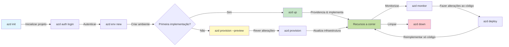
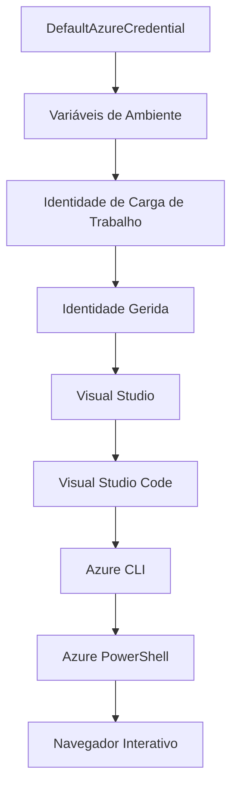

# AZD Basics - Compreender o Azure Developer CLI

# AZD Basics - Conceitos e Fundamentos Essenciais

**Navegação do Capítulo:**
- **📚 Página Inicial do Curso**: [AZD Para Iniciantes](../../README.md)
- **📖 Capítulo Atual**: Capítulo 1 - Fundamentos & Início Rápido
- **⬅️ Anterior**: [Visão Geral do Curso](../../README.md#-chapter-1-foundation--quick-start)
- **➡️ Próximo**: [Instalação & Configuração](installation.md)
- **🚀 Próximo Capítulo**: [Capítulo 2: Desenvolvimento AI-First](../chapter-02-ai-development/microsoft-foundry-integration.md)

## Introdução

Esta lição apresenta-lhe o Azure Developer CLI (azd), uma poderosa ferramenta de linha de comandos que acelera a sua jornada desde o desenvolvimento local até à implementação no Azure. Vai aprender os conceitos fundamentais, as funcionalidades principais e compreender como o azd simplifica a implementação de aplicações nativas na cloud.

## Objetivos de Aprendizagem

No final desta lição, irá:
- Compreender o que é o Azure Developer CLI e o seu propósito principal
- Aprender os conceitos centrais de modelos, ambientes e serviços
- Explorar funcionalidades chave incluindo desenvolvimento orientado a modelos e Infraestrutura como Código
- Compreender a estrutura e o fluxo de trabalho do projeto azd
- Estar preparado para instalar e configurar o azd no seu ambiente de desenvolvimento

## Resultados de Aprendizagem

Após concluir esta lição, será capaz de:
- Explicar o papel do azd nos fluxos de trabalho modernos de desenvolvimento na cloud
- Identificar os componentes da estrutura de um projeto azd
- Descrever como os modelos, ambientes e serviços funcionam em conjunto
- Compreender os benefícios da Infraestrutura como Código com azd
- Reconhecer diferentes comandos azd e os seus propósitos

## O que é o Azure Developer CLI (azd)?

Azure Developer CLI (azd) é uma ferramenta de linha de comandos desenhada para acelerar a sua jornada desde o desenvolvimento local até à implementação no Azure. Simplifica o processo de construção, implementação e gestão de aplicações nativas na cloud no Azure.

### O que pode implementar com o azd?

O azd suporta uma ampla gama de cargas de trabalho — e a lista continua a crescer. Hoje, pode usar azd para implementar:

| Tipo de Carga de Trabalho | Exemplos | Mesmo Fluxo de Trabalho? |
|---------------------------|----------|--------------------------|
| **Aplicações tradicionais** | Apps web, APIs REST, sites estáticos | ✅ `azd up` |
| **Serviços e microsserviços** | Container Apps, Function Apps, backends multi-serviço | ✅ `azd up` |
| **Aplicações com IA** | Apps de chat com Modelos Microsoft Foundry, soluções RAG com AI Search | ✅ `azd up` |
| **Agentes inteligentes** | Agentes hospedados na Foundry, orquestrações multi-agente | ✅ `azd up` |

A principal ideia é que **o ciclo de vida do azd mantém-se o mesmo independentemente do que estiver a implementar**. Inicializa um projeto, providencia infraestrutura, implementa o seu código, monitora a sua aplicação e limpa — seja um site simples ou um agente de IA sofisticado.

Esta continuidade é intencional. O azd trata as capacidades de IA como outro tipo de serviço que a sua aplicação pode usar, e não como algo fundamentalmente diferente. Um endpoint de chat suportado por Modelos Microsoft Foundry é, do ponto de vista do azd, apenas mais um serviço a configurar e implementar.

### 🎯 Porquê usar o AZD? Uma comparação no mundo real

Vamos comparar a implementação de uma aplicação web simples com base de dados:

#### ❌ SEM AZD: Implementação manual no Azure (mais de 30 minutos)

```bash
# Passo 1: Criar grupo de recursos
az group create --name myapp-rg --location eastus

# Passo 2: Criar Plano de Serviço de Aplicações
az appservice plan create --name myapp-plan \
  --resource-group myapp-rg \
  --sku B1 --is-linux

# Passo 3: Criar Aplicação Web
az webapp create --name myapp-web-unique123 \
  --resource-group myapp-rg \
  --plan myapp-plan \
  --runtime "NODE:18-lts"

# Passo 4: Criar conta do Cosmos DB (10-15 minutos)
az cosmosdb create --name myapp-cosmos-unique123 \
  --resource-group myapp-rg \
  --kind MongoDB

# Passo 5: Criar base de dados
az cosmosdb mongodb database create \
  --account-name myapp-cosmos-unique123 \
  --resource-group myapp-rg \
  --name tododb

# Passo 6: Criar coleção
az cosmosdb mongodb collection create \
  --account-name myapp-cosmos-unique123 \
  --resource-group myapp-rg \
  --database-name tododb \
  --name todos

# Passo 7: Obter cadeia de ligação
CONN_STR=$(az cosmosdb keys list \
  --name myapp-cosmos-unique123 \
  --resource-group myapp-rg \
  --type connection-strings \
  --query "connectionStrings[0].connectionString" -o tsv)

# Passo 8: Configurar definições da aplicação
az webapp config appsettings set \
  --name myapp-web-unique123 \
  --resource-group myapp-rg \
  --settings MONGODB_URI="$CONN_STR"

# Passo 9: Ativar registo de eventos
az webapp log config --name myapp-web-unique123 \
  --resource-group myapp-rg \
  --application-logging filesystem \
  --detailed-error-messages true

# Passo 10: Configurar Application Insights
az monitor app-insights component create \
  --app myapp-insights \
  --location eastus \
  --resource-group myapp-rg

# Passo 11: Ligar App Insights à Aplicação Web
INSTRUMENTATION_KEY=$(az monitor app-insights component show \
  --app myapp-insights \
  --resource-group myapp-rg \
  --query "instrumentationKey" -o tsv)

az webapp config appsettings set \
  --name myapp-web-unique123 \
  --resource-group myapp-rg \
  --settings APPINSIGHTS_INSTRUMENTATIONKEY="$INSTRUMENTATION_KEY"

# Passo 12: Construir aplicação localmente
npm install
npm run build

# Passo 13: Criar pacote de implantação
zip -r app.zip . -x "*.git*" "node_modules/*"

# Passo 14: Desdobrar aplicação
az webapp deployment source config-zip \
  --resource-group myapp-rg \
  --name myapp-web-unique123 \
  --src app.zip

# Passo 15: Esperar e rezar para que funcione 🙏
# (Sem validação automática, teste manual necessário)
```

**Problemas:**
- ❌ Mais de 15 comandos para lembrar e executar pela ordem
- ❌ 30-45 minutos de trabalho manual
- ❌ Fácil de cometer erros (erros tipográficos, parâmetros errados)
- ❌ Strings de conexão expostas no histórico do terminal
- ❌ Sem rollback automático se ocorrer falha
- ❌ Difícil de replicar para outros membros da equipa
- ❌ Diferente a cada vez (não é reproduzível)

#### ✅ COM AZD: Implementação automática (5 comandos, 10-15 minutos)

```bash
# Passo 1: Inicializar a partir do modelo
azd init --template todo-nodejs-mongo

# Passo 2: Autenticar
azd auth login

# Passo 3: Criar ambiente
azd env new dev

# Passo 4: Pré-visualizar alterações (opcional mas recomendado)
azd provision --preview

# Passo 5: Implantar tudo
azd up

# ✨ Concluído! Tudo está implantado, configurado e monitorizado
```

**Benefícios:**
- ✅ **5 comandos** vs. mais de 15 passos manuais
- ✅ **10-15 minutos** no total (maioritariamente à espera do Azure)
- ✅ **Menos erros manuais** - fluxo de trabalho consistente e orientado a modelos
- ✅ **Gestão segura de segredos** - muitos modelos usam armazenamento de segredos gerido pelo Azure
- ✅ **Implementações repetíveis** - mesmo fluxo de trabalho todas as vezes
- ✅ **Totalmente reproduzível** - mesmo resultado sempre
- ✅ **Pronto para equipa** - qualquer pessoa pode implementar com os mesmos comandos
- ✅ **Infraestrutura como Código** - modelos Bicep com controlo de versões
- ✅ **Monitoração integrada** - Application Insights configurado automaticamente

### 📊 Redução de Tempo & Erros

| Métrica | Implementação Manual | Implementação AZD | Melhoria |
|:--------|:--------------------|:-----------------|:---------|
| **Comandos** | +15 | 5 | 67% menos |
| **Tempo** | 30-45 min | 10-15 min | 60% mais rápido |
| **Taxa de Erro** | ~40% | <5% | Redução de 88% |
| **Consistência** | Baixa (manual) | 100% (automatizado) | Perfeita |
| **Integração da Equipa** | 2-4 horas | 30 minutos | 75% mais rápido |
| **Tempo de Rollback** | +30 min (manual) | 2 min (automatizado) | 93% mais rápido |

## Conceitos Essenciais

### Modelos
Os modelos são a base do azd. Eles contêm:
- **Código da aplicação** - O seu código fonte e dependências
- **Definições de infraestrutura** - Recursos Azure definidos em Bicep ou Terraform
- **Ficheiros de configuração** - Definições e variáveis de ambiente
- **Scripts de implementação** - Fluxos de trabalho automáticos de implementação

### Ambientes
Ambientes representam diferentes destinos de implementação:
- **Desenvolvimento** - Para testes e desenvolvimento
- **Staging** - Ambiente pré-produção
- **Produção** - Ambiente de produção ao vivo

Cada ambiente mantém o seu próprio:
- Grupo de recursos Azure
- Configurações
- Estado da implementação

### Serviços
Os serviços são os blocos construtivos da sua aplicação:
- **Frontend** - Aplicações web, SPAs
- **Backend** - APIs, microsserviços
- **Base de dados** - Soluções de armazenamento de dados
- **Armazenamento** - Armazenamento de ficheiros e blobs

## Funcionalidades Principais

### 1. Desenvolvimento Orientado a Modelos
```bash
# Navegar pelos modelos disponíveis
azd template list

# Inicializar a partir de um modelo
azd init --template <template-name>
```

### 2. Infraestrutura como Código
- **Bicep** - Linguagem especializada do Azure
- **Terraform** - Ferramenta multi-cloud para infraestrutura
- **Modelos ARM** - Modelos do Azure Resource Manager

### 3. Fluxos de Trabalho Integrados
```bash
# Fluxo de trabalho de implantação completo
azd up            # Provisionar + Implantar, isto é automático para a configuração inicial

# 🧪 NOVO: Visualizar alterações na infraestrutura antes da implantação (SEGURO)
azd provision --preview    # Simular a implantação da infraestrutura sem fazer alterações

azd provision     # Criar recursos Azure, se atualizar a infraestrutura use isto
azd deploy        # Implantar código da aplicação ou reimplantar código da aplicação após atualização
azd down          # Limpar recursos
```

#### 🛡️ Planeamento Seguro de Infraestrutura com Preview
O comando `azd provision --preview` é revolucionário para implementações seguras:
- **Análise de simulação** - Mostra o que será criado, modificado ou removido
- **Risco zero** - Nenhuma alteração real é feita no seu ambiente Azure
- **Colaboração em equipa** - Partilhe os resultados da pré-visualização antes da implementação
- **Estimativa de custos** - Perceba os custos dos recursos antes de comprometer

```bash
# Exemplo de fluxo de trabalho de pré-visualização
azd provision --preview           # Veja o que irá mudar
# Reveja o resultado, discuta com a equipa
azd provision                     # Aplique as alterações com confiança
```

### 📊 Visual: Fluxo de Trabalho de Desenvolvimento AZD



**Explicação do Fluxo de Trabalho:**
1. **Init** - Começar com modelo ou projeto novo
2. **Auth** - Autenticar com Azure
3. **Environment** - Criar ambiente isolado para implementação
4. **Preview** - 🆕 Sempre pré-visualizar alterações na infraestrutura primeiro (boa prática segura)
5. **Provision** - Criar/atualizar recursos Azure
6. **Deploy** - Enviar o código da aplicação
7. **Monitor** - Observar desempenho da aplicação
8. **Iterate** - Fazer alterações e reimplementar código
9. **Cleanup** - Remover recursos quando terminar

### 4. Gestão de Ambientes
```bash
# Criar e gerir ambientes
azd env new <environment-name>
azd env select <environment-name>
azd env list
```

### 5. Extensões e Comandos AI

O azd usa um sistema de extensões para adicionar funcionalidades além do CLI principal. Isto é especialmente útil para cargas de trabalho AI:

```bash
# Listar extensões disponíveis
azd extension list

# Instalar a extensão de agentes Foundry
azd extension install azure.ai.agents

# Inicializar um projeto de agente IA a partir de um manifesto
azd ai agent init -m agent-manifest.yaml

# Testar um agente implementado (mostra latência e tempo até ao primeiro byte)
azd ai agent invoke

# Iniciar o servidor MCP para desenvolvimento assistido por IA (Alpha)
azd mcp start
```

**O ciclo de vida do agente, de ponta a ponta.** Uma vez instalado o `azure.ai.agents`, um único fluxo de trabalho leva-o da ideia até um agente em execução e monitorizado. Não precisa de todos eles no primeiro dia — apenas saiba que existem:

| Fase | Comando | O que faz |
|------|---------|-----------|
| **Scaffold** | `azd ai agent init -m <manifest>` | Gera um projeto de agente a partir de um manifesto |
| **Test** | `azd ai agent invoke` | Chama o agente e vê o tempo de resposta |
| **Measure** | `azd ai agent eval generate` | Cria um conjunto de avaliação para o agente |
| **Improve** | `azd ai agent optimize` | Optimiza instruções do agente com base nos seus dados |
| **Inspect** | `azd ai agent endpoint show` | Mostra a configuração do endpoint em tempo real |
| **Clean up** | `azd ai agent delete` | Elimina um agente hospedado e todas as suas versões |

> As extensões são detalhadas em [Capítulo 2: Desenvolvimento AI-First](../chapter-02-ai-development/agents.md) e na referência [Comandos AZD AI CLI](../chapter-08-production/production-ai-practices.md#azd-ai-cli-commands-and-extensions).

## 📁 Estrutura do Projeto

Uma estrutura típica de um projeto azd:
```
my-app/
├── .azd/                    # azd configuration
│   └── config.json
├── .azure/                  # Azure deployment artifacts
├── .devcontainer/          # Development container config
├── .github/workflows/      # GitHub Actions
├── .vscode/               # VS Code settings
├── infra/                 # Infrastructure code
│   ├── main.bicep        # Main infrastructure template
│   ├── main.parameters.json
│   └── modules/          # Reusable modules
├── src/                  # Application source code
│   ├── api/             # Backend services
│   └── web/             # Frontend application
├── azure.yaml           # azd project configuration
└── README.md
```

## 🔧 Ficheiros de Configuração

### azure.yaml
O ficheiro principal de configuração do projeto:
```yaml
name: my-awesome-app
metadata:
  template: my-template@1.0.0

services:
  web:
    project: ./src/web
    language: js
    host: appservice
  api:
    project: ./src/api
    language: js
    host: appservice

hooks:
  preprovision:
    shell: pwsh
    run: echo "Preparing to provision..."
```

### .azure/config.json
Configuração específica do ambiente:
```json
{
  "version": 1,
  "defaultEnvironment": "dev",
  "environments": {
    "dev": {
      "subscriptionId": "your-subscription-id",
      "location": "eastus"
    }
  }
}
```

## 🎪 Fluxos de Trabalho Comuns com Exercícios Práticos

> **💡 Dica de Aprendizagem:** Siga estes exercícios por ordem para desenvolver progressivamente as suas competências AZD.

### 🎯 Exercício 1: Inicializar o Seu Primeiro Projeto

**Objetivo:** Criar um projeto AZD e explorar a sua estrutura

**Passos:**
```bash
# Use um modelo comprovado
azd init --template todo-nodejs-mongo

# Explore os ficheiros gerados
ls -la  # Veja todos os ficheiros incluindo os ocultos

# Ficheiros chave criados:
# - azure.yaml (configuração principal)
# - infra/ (código de infraestrutura)
# - src/ (código da aplicação)
```

**✅ Sucesso:** Tem os diretórios azure.yaml, infra/ e src/

---

### 🎯 Exercício 2: Implementar no Azure

**Objetivo:** Completar implementação fim a fim

**Passos:**
```bash
# 1. Autenticar
az login && azd auth login

# 2. Criar ambiente
azd env new dev
azd env set AZURE_LOCATION eastus

# 3. Pré-visualizar alterações (RECOMENDADO)
azd provision --preview

# 4. Implementar tudo
azd up

# 5. Verificar a implementação
azd show    # Ver a URL da sua aplicação
```

**Tempo Previsto:** 10-15 minutos  
**✅ Sucesso:** URL da aplicação abre no navegador

---

### 🎯 Exercício 3: Ambientes Múltiplos

**Objetivo:** Implementar em dev e staging

**Passos:**
```bash
# Já existe dev, criar staging
azd env new staging
azd env set AZURE_LOCATION westus2
azd up

# Alternar entre eles
azd env list
azd env select dev
```

**✅ Sucesso:** Dois grupos de recursos separados no Portal Azure

---

### 🛡️ Limpeza Completa: `azd down --force --purge`

Quando precisar de reiniciar completamente:

```bash
azd down --force --purge
```

**O que faz:**
- `--force`: Sem prompts de confirmação
- `--purge`: Apaga todo o estado local e recursos Azure

**Usar quando:**
- Implementação falhou a meio
- Alterar projetos
- Precisar de um novo começo

---

## 🎪 Referência do Fluxo de Trabalho Original

### Iniciar um Projeto Novo
```bash
# Método 1: Usar template existente
azd init --template todo-nodejs-mongo

# Método 2: Começar do zero
azd init

# Método 3: Usar diretório atual
azd init .
```

### Ciclo de Desenvolvimento
```bash
# Configurar o ambiente de desenvolvimento
azd auth login
azd env new dev
azd env select dev

# Fazer o deploy de tudo
azd up

# Fazer alterações e voltar a fazer o deploy
azd deploy

# Limpar quando terminar
azd down --force --purge # o comando no Azure Developer CLI é um **reset completo** para o seu ambiente—especialmente útil quando está a resolver erros em deploys falhados, a limpar recursos órfãos ou a preparar uma nova implantação.
```

## Compreender `azd down --force --purge`
O comando `azd down --force --purge` é uma forma poderosa de desmantelar completamente o seu ambiente azd e todos os recursos associados. Eis um resumo do que cada flag faz:
```
--force
```
- Ignora prompts de confirmação.
- Útil para automação ou scripts onde a interação manual não é viável.
- Garante que a desmontagem segue sem interrupções, mesmo que o CLI detecte inconsistências.

```
--purge
```
Apaga **toda a metadata associada**, incluindo:
Estado do ambiente  
Pasta local `.azure`  
Informação em cache da implementação  
Evita que o azd "lembre" implementações anteriores, o que pode causar problemas como grupos de recursos incompatíveis ou referências antigas no registo.

### Porquê usar os dois juntos?
Quando encontra um bloqueio com `azd up` devido a estado residual ou implementações parciais, esta combinação assegura um **recomeço limpo**.

É especialmente útil após eliminações manuais de recursos no portal Azure ou quando muda de modelos, ambientes ou convenções de nomenclatura de grupos de recursos.

### Gestão de Múltiplos Ambientes
```bash
# Criar ambiente de preparação
azd env new staging
azd env select staging
azd up

# Voltar para desenvolvimento
azd env select dev

# Comparar ambientes
azd env list
```

## 🔐 Autenticação e Credenciais

Compreender a autenticação é crucial para implementações azd bem-sucedidas. O Azure usa múltiplos métodos de autenticação, e o azd aproveita a mesma cadeia de credenciais usada por outras ferramentas Azure.

### Autenticação Azure CLI (`az login`)

Antes de usar azd, precisa de autenticar-se no Azure. O método mais comum é usando Azure CLI:

```bash
# Início de sessão interativo (abre o navegador)
az login

# Início de sessão com inquilino específico
az login --tenant <tenant-id>

# Início de sessão com principal de serviço
az login --service-principal -u <app-id> -p <password> --tenant <tenant-id>

# Verificar estado atual do início de sessão
az account show

# Listar subscrições disponíveis
az account list --output table

# Definir subscrição predefinida
az account set --subscription <subscription-id>
```

### Fluxo de Autenticação
1. **Login Interativo**: Abre o seu navegador padrão para autenticação
2. **Fluxo de Código de Dispositivo**: Para ambientes sem acesso a browser
3. **Principal de Serviço**: Para cenários de automação e CI/CD
4. **Identidade Gerida**: Para aplicações hospedadas no Azure

### Cadeia DefaultAzureCredential

`DefaultAzureCredential` é um tipo de credencial que proporciona uma experiência de autenticação simplificada ao tentar automaticamente múltiplas fontes de credenciais numa ordem específica:

#### Ordem da Cadeia de Credenciais


#### 1. Variáveis de Ambiente
```bash
# Definir variáveis de ambiente para o principal de serviço
export AZURE_CLIENT_ID="<app-id>"
export AZURE_CLIENT_SECRET="<password>"
export AZURE_TENANT_ID="<tenant-id>"
```

#### 2. Identidade de Carga de Trabalho (Kubernetes/GitHub Actions)
Usado automaticamente em:
- Azure Kubernetes Service (AKS) com Identidade de Carga de Trabalho
- GitHub Actions com federação OIDC
- Outros cenários de identidade federada

#### 3. Identidade Gerida
Para recursos Azure como:
- Máquinas Virtuais
- App Service
- Azure Functions
- Instâncias de Contentores

```bash
# Verificar se está a executar numa recurso Azure com identidade gerida
az account show --query "user.type" --output tsv
# Retorna: "servicePrincipal" se estiver a usar identidade gerida
```

#### 4. Integração com Ferramentas de Desenvolvimento
- **Visual Studio**: Usa automaticamente a conta autenticada
- **VS Code**: Usa credenciais da extensão Azure Account
- **Azure CLI**: Usa credenciais do `az login` (mais comum para desenvolvimento local)

### Configuração de Autenticação AZD

```bash
# Método 1: Usar Azure CLI (Recomendado para desenvolvimento)
az login
azd auth login  # Utiliza as credenciais existentes do Azure CLI

# Método 2: Autenticação direta azd
azd auth login --use-device-code  # Para ambientes sem interface gráfica

# Método 3: Verificar o estado da autenticação
azd auth login --check-status

# Método 4: Terminar sessão e autenticar novamente
azd auth logout
azd auth login
```

### Melhores Práticas de Autenticação

#### Para Desenvolvimento Local
```bash
# 1. Inicie sessão com o Azure CLI
az login

# 2. Verifique a subscrição correta
az account show
az account set --subscription "Your Subscription Name"

# 3. Use o azd com credenciais existentes
azd auth login
```

#### Para Pipelines CI/CD
```yaml
# GitHub Actions example
- name: Azure Login
  uses: azure/login@v1
  with:
    creds: ${{ secrets.AZURE_CREDENTIALS }}

- name: Deploy with azd
  run: |
    azd auth login --client-id ${{ secrets.AZURE_CLIENT_ID }} \
                    --client-secret ${{ secrets.AZURE_CLIENT_SECRET }} \
                    --tenant-id ${{ secrets.AZURE_TENANT_ID }}
    azd up --no-prompt
```

#### Para Ambientes de Produção
- Use **Identidade Gerida** quando estiver a executar em recursos Azure
- Use **Principal de Serviço** para cenários de automação
- Evite armazenar credenciais no código ou ficheiros de configuração
- Use **Azure Key Vault** para configuração sensível

### Problemas Comuns de Autenticação e Soluções

#### Problema: "Nenhuma subscrição encontrada"
```bash
# Solução: Definir subscrição padrão
az account list --output table
az account set --subscription "<subscription-id>"
azd env set AZURE_SUBSCRIPTION_ID "<subscription-id>"
```

#### Problema: "Permissões insuficientes"
```bash
# Solução: Verificar e atribuir os papéis necessários
az role assignment list --assignee $(az account show --query user.name --output tsv)

# Papéis comuns necessários:
# - Colaborador (para gestão de recursos)
# - Administrador de Acesso de Utilizadores (para atribuições de papéis)
```

#### Problema: "Token expirado"
```bash
# Solução: Reautenticar
az logout
az login
azd auth logout
azd auth login
```

### Autenticação em Diferentes Cenários

#### Desenvolvimento Local
```bash
# Conta de desenvolvimento pessoal
az login
azd auth login
```

#### Desenvolvimento em Equipa
```bash
# Utilize inquilino específico para a organização
az login --tenant contoso.onmicrosoft.com
azd auth login
```

#### Cenários Multi-inquilino
```bash
# Alternar entre inquilinos
az login --tenant tenant1.onmicrosoft.com
# Desplegar para o inquilino 1
azd up

az login --tenant tenant2.onmicrosoft.com  
# Desplegar para o inquilino 2
azd up
```

### Considerações de Segurança

1. **Armazenamento de Credenciais**: Nunca armazene credenciais no código fonte
2. **Limitação de Escopo**: Utilize o princípio do menor privilégio para principais de serviço
3. **Rotação de Tokens**: Rode regularmente os segredos dos principais de serviço
4. **Registo de Auditoria**: Monitorize atividades de autenticação e deployment
5. **Segurança de Rede**: Utilize endpoints privados sempre que possível

### Resolução de Problemas de Autenticação

```bash
# Depurar problemas de autenticação
azd auth login --check-status
az account show
az account get-access-token

# Comandos de diagnóstico comuns
whoami                          # Contexto do utilizador atual
az ad signed-in-user show      # Detalhes do utilizador Microsoft Entra ID
az group list                  # Testar acesso ao recurso
```

## Entender `azd down --force --purge`

### Descoberta
```bash
azd template list              # Navegar por modelos
azd template show <template>   # Detalhes do modelo
azd init --help               # Opções de inicialização
```

### Gestão de Projeto
```bash
azd show                     # Visão geral do projeto
azd env list                # Ambientes disponíveis e predefinição selecionada
azd config show            # Definições de configuração
```

### Monitorização
```bash
azd monitor                  # Abrir monitorização do portal Azure
azd monitor --logs           # Ver registos da aplicação
azd monitor --live           # Ver métricas em direto
azd pipeline config          # Configurar CI/CD
```

## Melhores Práticas

### 1. Use Nomes Significativos
```bash
# Bom
azd env new production-east
azd init --template web-app-secure

# Evitar
azd env new env1
azd init --template template1
```

### 2. Aproveite os Modelos
- Comece com modelos existentes
- Personalize conforme as suas necessidades
- Crie modelos reutilizáveis para a sua organização

### 3. Isolamento de Ambiente
- Use ambientes separados para dev/staging/prod
- Nunca faça deployment diretamente para produção a partir da máquina local
- Use pipelines CI/CD para deployments de produção

### 4. Gestão de Configuração
- Utilize variáveis de ambiente para dados sensíveis
- Mantenha configuração sob controlo de versões
- Documente configurações específicas de ambiente

## Progressão de Aprendizagem

### Iniciante (Semana 1-2)
1. Instalar azd e autenticar
2. Fazer deploy de um modelo simples
3. Compreender a estrutura do projeto
4. Aprender comandos básicos (up, down, deploy)

### Intermédio (Semana 3-4)
1. Personalizar modelos
2. Gerir múltiplos ambientes
3. Compreender o código de infraestrutura
4. Configurar pipelines CI/CD

### Avançado (Semana 5+)
1. Criar modelos personalizados
2. Padrões avançados de infraestrutura
3. Deployments multi-região
4. Configurações de nível empresarial

## Próximos Passos

**📖 Continue o Capítulo 1:**
- [Instalação & Configuração](installation.md) - Instale e configure o azd
- [O Seu Primeiro Projeto](first-project.md) - Complete o tutorial prático
- [Guia de Configuração](configuration.md) - Opções avançadas de configuração

**🎯 Pronto para o Próximo Capítulo?**
- [Capítulo 2: Desenvolvimento AI-First](../chapter-02-ai-development/microsoft-foundry-integration.md) - Comece a criar aplicações AI

## Recursos Adicionais

- [Visão Geral Azure Developer CLI](https://learn.microsoft.com/en-us/azure/developer/azure-developer-cli/)
- [Galeria de Modelos](https://azure.github.io/awesome-azd/)
- [Exemplos da Comunidade](https://github.com/Azure-Samples)

---

## 🙋 Perguntas Frequentes

### Perguntas Gerais

**Q: Qual a diferença entre AZD e Azure CLI?**

A: Azure CLI (`az`) serve para gerir recursos individuais no Azure. AZD (`azd`) serve para gerir aplicações completas:

```bash
# Azure CLI - Gestão de recursos a baixo nível
az webapp create --name myapp --resource-group rg
az sql server create --name myserver --resource-group rg
# ...muitos mais comandos necessários

# AZD - Gestão ao nível da aplicação
azd up  # Desdobra toda a aplicação com todos os recursos
```

**Pense assim:**
- `az` = Operar com peças individuais de Lego
- `azd` = Trabalhar com conjuntos completos de Lego

---

**Q: Preciso de saber Bicep ou Terraform para usar AZD?**

A: Não! Comece com modelos:
```bash
# Utilize o modelo existente - não é necessário conhecimento de IaC
azd init --template todo-nodejs-mongo
azd up
```

Pode aprender Bicep mais tarde para personalizar a infraestrutura. Os modelos fornecem exemplos práticos para aprender.

---

**Q: Quanto custa executar modelos AZD?**

A: O custo varia consoante o modelo. A maioria dos modelos de desenvolvimento custa entre 50-150$/mês:

```bash
# Pré-visualizar custos antes de implantar
azd provision --preview

# Limpar sempre quando não estiver a usar
azd down --force --purge  # Remove todos os recursos
```

**Dica profissional:** Utilize tiers gratuitos sempre que disponíveis:
- App Service: tier F1 (Gratuito)
- Microsoft Foundry Models: Azure OpenAI 50,000 tokens/mês grátis
- Cosmos DB: tier gratuito 1000 RU/s

---

**Q: Posso usar AZD com recursos Azure existentes?**

A: Sim, mas é mais fácil começar do zero. AZD funciona melhor quando gere o ciclo de vida completo. Para recursos existentes:

```bash
# Opção 1: Importar recursos existentes (avançado)
azd init
# Depois modifique infra/ para referenciar recursos existentes

# Opção 2: Começar do zero (recomendado)
azd init --template matching-your-stack
azd up  # Cria um novo ambiente
```

---

**Q: Como partilho o meu projeto com colegas?**

A: Faça commit do projeto AZD para Git (mas NÃO da pasta .azure):

```bash
# Já está no .gitignore por padrão
.azure/        # Contém segredos e dados do ambiente
*.env          # Variáveis de ambiente

# Membros da equipa depois:
git clone <your-repo>
azd auth login
azd env new <their-name>-dev
azd up
```

Todos têm infraestrutura idêntica a partir dos mesmos modelos.

---

### Perguntas de Resolução de Problemas

**Q: O comando "azd up" falhou a meio. O que faço?**

A: Verifique o erro, corrija e tente novamente:

```bash
# Ver registos detalhados
azd show

# Correções comuns:

# 1. Se a quota for excedida:
azd env set AZURE_LOCATION "westus2"  # Tente uma região diferente

# 2. Se houver conflito de nome de recurso:
azd down --force --purge  # Começar do zero
azd up  # Tentar novamente

# 3. Se a autenticação expirou:
az login
azd auth login
azd up
```

**Problema mais comum:** Subscrição Azure errada selecionada
```bash
az account list --output table
az account set --subscription "<correct-subscription>"
```

---

**Q: Como faço deploy só das alterações de código sem reprovisionar?**

A: Use `azd deploy` em vez de `azd up`:

```bash
azd up          # Primeira vez: provisão + implantação (lento)

# Faça alterações no código...

azd deploy      # Vezes subsequentes: apenas implantação (rápido)
```

Comparação de velocidade:
- `azd up`: 10-15 minutos (provisiona infraestrutura)
- `azd deploy`: 2-5 minutos (só código)

---

**Q: Posso personalizar os modelos de infraestrutura?**

A: Sim! Edite os ficheiros Bicep em `infra/`:

```bash
# Após azd init
cd infra/
code main.bicep  # Editar no VS Code

# Pré-visualizar alterações
azd provision --preview

# Aplicar alterações
azd provision
```

**Dica:** Comece pequeno - altere SKUs primeiro:
```bicep
// infra/main.bicep
sku: {
  name: 'B1'  // Change to 'P1V2' for production
}
```

---

**Q: Como apago tudo o que o AZD criou?**

A: Um comando remove todos os recursos:

```bash
azd down --force --purge

# Isto elimina:
# - Todos os recursos Azure
# - Grupo de recursos
# - Estado do ambiente local
# - Dados de implementação em cache
```

**Execute sempre quando:**
- Terminar de testar um modelo
- Mudar para outro projeto
- Querer começar do zero

**Economia de custos:** Apagar recursos não usados = $0 de cobrança

---

**Q: E se apagar recursos acidentalmente no Portal Azure?**

A: O estado do AZD pode desincronizar. Abordagem de limpeza:

```bash
# 1. Remover estado local
azd down --force --purge

# 2. Começar do zero
azd up

# Alternativa: Deixar o AZD detectar e corrigir
azd provision  # Irá criar recursos em falta
```

---

### Perguntas Avançadas

**Q: Posso usar AZD em pipelines CI/CD?**

A: Sim! Exemplo GitHub Actions:

```yaml
# .github/workflows/deploy.yml
name: Deploy with AZD

on:
  push:
    branches: [main]

jobs:
  deploy:
    runs-on: ubuntu-latest
    steps:
      - uses: actions/checkout@v2
      
      - name: Install azd
        run: curl -fsSL https://aka.ms/install-azd.sh | bash
      
      - name: Azure Login
        run: |
          azd auth login \
            --client-id ${{ secrets.AZURE_CLIENT_ID }} \
            --client-secret ${{ secrets.AZURE_CLIENT_SECRET }} \
            --tenant-id ${{ secrets.AZURE_TENANT_ID }}
      
      - name: Deploy
        run: azd up --no-prompt
```

---

**Q: Como gerencio segredos e dados sensíveis?**

A: O AZD integra-se automaticamente com Azure Key Vault:

```bash
# Os segredos são armazenados no Key Vault, não no código
azd env set DATABASE_PASSWORD "$(openssl rand -base64 32)"

# O AZD automaticamente:
# 1. Cria o Key Vault
# 2. Armazena o segredo
# 3. Concede acesso à aplicação através da Identidade Gerida
# 4. Injeta em tempo de execução
```

**Nunca faça commit de:**
- Pasta `.azure/` (contém dados do ambiente)
- Ficheiros `.env` (segredos locais)
- Strings de ligação

---

**Q: Posso fazer deploy para múltiplas regiões?**

A: Sim, crie um ambiente por região:

```bash
# Ambiente EUA Este
azd env new prod-eastus
azd env set AZURE_LOCATION eastus
azd up

# Ambiente Europa Ocidental
azd env new prod-westeurope
azd env set AZURE_LOCATION westeurope
azd up

# Cada ambiente é independente
azd env list
```

Para apps multi-região reais, personalize os modelos Bicep para deploy simultâneo em várias regiões.

---

**Q: Onde posso obter ajuda se estiver bloqueado?**

1. **Documentação AZD:** https://learn.microsoft.com/azure/developer/azure-developer-cli/
2. **GitHub Issues:** https://github.com/Azure/azure-dev/issues
3. **Discord:** [Azure Discord](https://discord.gg/microsoft-azure) - canal #azure-developer-cli
4. **Stack Overflow:** Tag `azure-developer-cli`
5. **Este Curso:** [Guia de Resolução de Problemas](../chapter-07-troubleshooting/common-issues.md)

**Dica profissional:** Antes de perguntar, execute:
```bash
azd show       # Mostra o estado atual
azd version    # Mostra a sua versão
```
Inclua esta informação na sua pergunta para ajuda mais rápida.

---

## 🎓 E Agora?

Já compreende os fundamentos do AZD. Escolha o seu caminho:

### 🎯 Para Iniciantes:
1. **Seguinte:** [Instalação & Configuração](installation.md) - Instale o AZD na sua máquina
2. **Depois:** [O Seu Primeiro Projeto](first-project.md) - Faça deploy da sua primeira aplicação
3. **Pratique:** Complete os 3 exercícios desta lição

### 🚀 Para Desenvolvedores AI:
1. **Passe para:** [Capítulo 2: Desenvolvimento AI-First](../chapter-02-ai-development/microsoft-foundry-integration.md)
2. **Implemente:** Comece com `azd init --template get-started-with-ai-chat`
3. **Aprenda:** Construa enquanto implementa

### 🏗️ Para Desenvolvedores Experientes:
1. **Revise:** [Guia de Configuração](configuration.md) - Definições avançadas
2. **Explore:** [Infraestrutura como Código](../chapter-04-infrastructure/provisioning.md) - Imersão em Bicep
3. **Construa:** Crie modelos personalizados para o seu stack

---

**Navegação do Capítulo:**
- **📚 Início do Curso:** [AZD Para Iniciantes](../../README.md)
- **📖 Capítulo Atual:** Capítulo 1 - Fundação & Início Rápido  
- **⬅️ Anterior:** [Visão Geral do Curso](../../README.md#-chapter-1-foundation--quick-start)
- **➡️ Seguinte:** [Instalação & Configuração](installation.md)
- **🚀 Próximo Capítulo:** [Capítulo 2: Desenvolvimento AI-First](../chapter-02-ai-development/microsoft-foundry-integration.md)

---

<!-- CO-OP TRANSLATOR DISCLAIMER START -->
**Aviso Legal**:
Este documento foi traduzido utilizando o serviço de tradução automática [Co-op Translator](https://github.com/Azure/co-op-translator). Embora nos esforcemos pela precisão, esteja ciente de que traduções automáticas podem conter erros ou imprecisões. O documento original na sua língua nativa deve ser considerado a fonte autorizada. Para informações críticas, recomenda-se tradução profissional humana. Não nos responsabilizamos por quaisquer mal-entendidos ou interpretações incorretas resultantes da utilização desta tradução.
<!-- CO-OP TRANSLATOR DISCLAIMER END -->