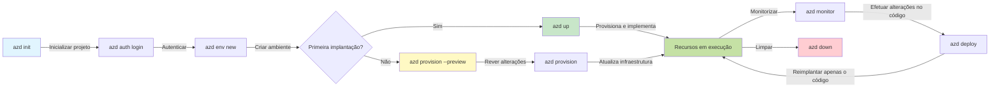
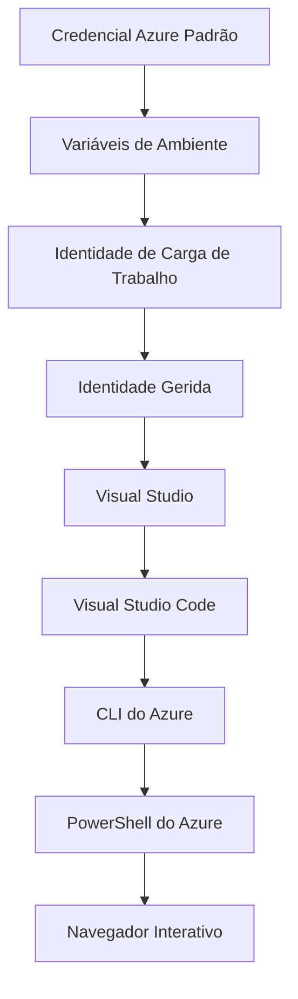

# AZD Básico - Compreender o Azure Developer CLI

# AZD Básico - Conceitos Centrais e Fundamentos

**Chapter Navigation:**
- **📚 Course Home**: [AZD Para Iniciantes](../../README.md)
- **📖 Current Chapter**: Capítulo 1 - Fundamentos e Início Rápido
- **⬅️ Previous**: [Visão Geral do Curso](../../README.md#-chapter-1-foundation--quick-start)
- **➡️ Next**: [Instalação e Configuração](installation.md)
- **🚀 Next Chapter**: [Capítulo 2: Desenvolvimento com IA em Primeiro Lugar](../chapter-02-ai-development/microsoft-foundry-integration.md)

## Introduction

Esta lição apresenta o Azure Developer CLI (azd), uma poderosa ferramenta de linha de comandos que acelera a sua jornada desde o desenvolvimento local até à implantação no Azure. Vai aprender os conceitos fundamentais, as funcionalidades principais e perceber como o azd simplifica a implantação de aplicações cloud-native.

## Learning Goals

Ao final desta lição, você irá:
- Compreender o que é o Azure Developer CLI e qual o seu objetivo principal
- Aprender os conceitos centrais de modelos, ambientes e serviços
- Explorar funcionalidades chave incluindo desenvolvimento orientado por modelos e Infraestrutura como Código
- Compreender a estrutura de um projeto azd e o seu fluxo de trabalho
- Estar preparado para instalar e configurar o azd para o seu ambiente de desenvolvimento

## Learning Outcomes

Após completar esta lição, você será capaz de:
- Explicar o papel do azd em fluxos de trabalho modernos de desenvolvimento cloud
- Identificar os componentes da estrutura de um projeto azd
- Descrever como modelos, ambientes e serviços funcionam em conjunto
- Compreender os benefícios da Infraestrutura como Código com o azd
- Reconhecer diferentes comandos do azd e os seus propósitos

## What is Azure Developer CLI (azd)?

Azure Developer CLI (azd) é uma ferramenta de linha de comandos concebida para acelerar a sua jornada desde o desenvolvimento local até à implantação no Azure. Simplifica o processo de construção, implantação e gestão de aplicações cloud-native no Azure.

### 🎯 Why Use AZD? A Real-World Comparison

Vamos comparar a implantação de uma aplicação web simples com base de dados:

#### ❌ WITHOUT AZD: Manual Azure Deployment (30+ minutes)

```bash
# Passo 1: Criar grupo de recursos
az group create --name myapp-rg --location eastus

# Passo 2: Criar plano do App Service
az appservice plan create --name myapp-plan \
  --resource-group myapp-rg \
  --sku B1 --is-linux

# Passo 3: Criar aplicação Web
az webapp create --name myapp-web-unique123 \
  --resource-group myapp-rg \
  --plan myapp-plan \
  --runtime "NODE:18-lts"

# Passo 4: Criar conta do Cosmos DB (10-15 minutos)
az cosmosdb create --name myapp-cosmos-unique123 \
  --resource-group myapp-rg \
  --kind MongoDB

# Passo 5: Criar base de dados
az cosmosdb mongodb database create \
  --account-name myapp-cosmos-unique123 \
  --resource-group myapp-rg \
  --name tododb

# Passo 6: Criar coleção
az cosmosdb mongodb collection create \
  --account-name myapp-cosmos-unique123 \
  --resource-group myapp-rg \
  --database-name tododb \
  --name todos

# Passo 7: Obter cadeia de ligação
CONN_STR=$(az cosmosdb keys list \
  --name myapp-cosmos-unique123 \
  --resource-group myapp-rg \
  --type connection-strings \
  --query "connectionStrings[0].connectionString" -o tsv)

# Passo 8: Configurar definições da aplicação
az webapp config appsettings set \
  --name myapp-web-unique123 \
  --resource-group myapp-rg \
  --settings MONGODB_URI="$CONN_STR"

# Passo 9: Ativar registos
az webapp log config --name myapp-web-unique123 \
  --resource-group myapp-rg \
  --application-logging filesystem \
  --detailed-error-messages true

# Passo 10: Configurar o Application Insights
az monitor app-insights component create \
  --app myapp-insights \
  --location eastus \
  --resource-group myapp-rg

# Passo 11: Ligar o App Insights à aplicação Web
INSTRUMENTATION_KEY=$(az monitor app-insights component show \
  --app myapp-insights \
  --resource-group myapp-rg \
  --query "instrumentationKey" -o tsv)

az webapp config appsettings set \
  --name myapp-web-unique123 \
  --resource-group myapp-rg \
  --settings APPINSIGHTS_INSTRUMENTATIONKEY="$INSTRUMENTATION_KEY"

# Passo 12: Compilar a aplicação localmente
npm install
npm run build

# Passo 13: Criar pacote de implantação
zip -r app.zip . -x "*.git*" "node_modules/*"

# Passo 14: Implantar a aplicação
az webapp deployment source config-zip \
  --resource-group myapp-rg \
  --name myapp-web-unique123 \
  --src app.zip

# Passo 15: Esperar e rezar para que funcione 🙏
# (Sem validação automatizada, é necessário teste manual)
```

**Problems:**
- ❌ 15+ comandos para recordar e executar por ordem
- ❌ 30-45 minutos de trabalho manual
- ❌ Fácil cometer erros (typos, parâmetros errados)
- ❌ Strings de ligação expostas no histórico do terminal
- ❌ Sem rollback automatizado se algo falhar
- ❌ Difícil de replicar para membros da equipa
- ❌ Diferente todas as vezes (não reprodutível)

#### ✅ WITH AZD: Automated Deployment (5 commands, 10-15 minutes)

```bash
# Passo 1: Inicializar a partir do modelo
azd init --template todo-nodejs-mongo

# Passo 2: Autenticar
azd auth login

# Passo 3: Criar ambiente
azd env new dev

# Passo 4: Pré-visualizar alterações (opcional, mas recomendado)
azd provision --preview

# Passo 5: Implantar tudo
azd up

# ✨ Concluído! Tudo está implantado, configurado e monitorizado
```

**Benefits:**
- ✅ **5 comandos** vs. 15+ passos manuais
- ✅ **10-15 minutos** tempo total (principalmente à espera do Azure)
- ✅ **Zero erros** - automatizado e testado
- ✅ **Segredos geridos de forma segura** via Key Vault
- ✅ **Rollback automático** em caso de falhas
- ✅ **Totalmente reprodutível** - mesmo resultado todas as vezes
- ✅ **Pronto para equipas** - qualquer pessoa pode implantar com os mesmos comandos
- ✅ **Infraestrutura como Código** - templates Bicep versionados
- ✅ **Monitorização integrada** - Application Insights configurado automaticamente

### 📊 Time & Error Reduction

| Metric | Manual Deployment | AZD Deployment | Improvement |
|:-------|:------------------|:---------------|:------------|
| **Comandos** | 15+ | 5 | 67% menos |
| **Tempo** | 30-45 min | 10-15 min | 60% mais rápido |
| **Taxa de Erro** | ~40% | <5% | Redução de 88% |
| **Consistência** | Baixa (manual) | 100% (automatizado) | Perfeita |
| **Integração da Equipa** | 2-4 hours | 30 minutes | 75% mais rápida |
| **Tempo de Reversão** | 30+ min (manual) | 2 min (automated) | 93% mais rápido |

## Core Concepts

### Templates
Os modelos são a base do azd. Eles contêm:
- **Application code** - O seu código-fonte e dependências
- **Infrastructure definitions** - Recursos do Azure definidos em Bicep ou Terraform
- **Configuration files** - Definições e variáveis de ambiente
- **Deployment scripts** - Fluxos de trabalho de implantação automatizados

### Environments
Os ambientes representam diferentes destinos de implantação:
- **Development** - Para testes e desenvolvimento
- **Staging** - Ambiente de pré-produção
- **Production** - Ambiente de produção

Cada ambiente mantém o seu próprio:
- Grupo de recursos do Azure
- Definições de configuração
- Estado da implantação

### Services
Os serviços são os blocos construtivos da sua aplicação:
- **Frontend** - Aplicações web, SPAs
- **Backend** - APIs, microsserviços
- **Database** - Soluções de armazenamento de dados
- **Storage** - Armazenamento de ficheiros e blobs

## Key Features

### 1. Template-Driven Development
```bash
# Navegar pelos modelos disponíveis
azd template list

# Inicializar a partir de um modelo
azd init --template <template-name>
```

### 2. Infrastructure as Code
- **Bicep** - Linguagem específica de domínio do Azure
- **Terraform** - Ferramenta de infraestrutura multi-cloud
- **ARM Templates** - Templates do Azure Resource Manager

### 3. Integrated Workflows
```bash
# Fluxo de implantação completo
azd up            # Provisionar + Implantar: isto é sem intervenção para a configuração inicial

# 🧪 NOVO: Pré-visualizar alterações na infraestrutura antes da implantação (SEGURO)
azd provision --preview    # Simular a implantação da infraestrutura sem efetuar alterações

azd provision     # Criar recursos do Azure: se atualizar a infraestrutura, use isto
azd deploy        # Implantar ou reimplantar o código da aplicação após a atualização
azd down          # Limpar recursos
```

#### 🛡️ Safe Infrastructure Planning with Preview
O comando `azd provision --preview` é um divisor de águas para implantações seguras:
- **Dry-run analysis** - Mostra o que será criado, modificado ou eliminado
- **Zero risk** - Não são feitas alterações reais ao seu ambiente Azure
- **Team collaboration** - Partilhe os resultados da pré-visualização antes da implantação
- **Cost estimation** - Compreenda os custos dos recursos antes de assumir compromissos

```bash
# Exemplo de fluxo de trabalho de pré-visualização
azd provision --preview           # Veja o que vai mudar
# Revise o resultado, discuta com a equipa
azd provision                     # Aplique as alterações com confiança
```

### 📊 Visual: AZD Development Workflow


**Workflow Explanation:**
1. **Init** - Comece com um modelo ou novo projeto
2. **Auth** - Autentique-se no Azure
3. **Environment** - Crie um ambiente de implantação isolado
4. **Preview** - 🆕 Faça sempre a pré-visualização das alterações de infraestrutura primeiro (prática segura)
5. **Provision** - Crie/atualize recursos no Azure
6. **Deploy** - Publique o código da sua aplicação
7. **Monitor** - Observe o desempenho da aplicação
8. **Iterate** - Faça alterações e volte a implantar o código
9. **Cleanup** - Remova recursos quando terminar

### 4. Environment Management
```bash
# Criar e gerir ambientes
azd env new <environment-name>
azd env select <environment-name>
azd env list
```

## 📁 Project Structure

Uma estrutura típica de projeto azd:
```
my-app/
├── .azd/                    # azd configuration
│   └── config.json
├── .azure/                  # Azure deployment artifacts
├── .devcontainer/          # Development container config
├── .github/workflows/      # GitHub Actions
├── .vscode/               # VS Code settings
├── infra/                 # Infrastructure code
│   ├── main.bicep        # Main infrastructure template
│   ├── main.parameters.json
│   └── modules/          # Reusable modules
├── src/                  # Application source code
│   ├── api/             # Backend services
│   └── web/             # Frontend application
├── azure.yaml           # azd project configuration
└── README.md
```

## 🔧 Configuration Files

### azure.yaml
O ficheiro de configuração principal do projeto:
```yaml
name: my-awesome-app
metadata:
  template: my-template@1.0.0

services:
  web:
    project: ./src/web
    language: js
    host: appservice
  api:
    project: ./src/api
    language: js
    host: appservice

hooks:
  preprovision:
    shell: pwsh
    run: echo "Preparing to provision..."
```

### .azure/config.json
Configuração específica do ambiente:
```json
{
  "version": 1,
  "defaultEnvironment": "dev",
  "environments": {
    "dev": {
      "subscriptionId": "your-subscription-id",
      "location": "eastus"
    }
  }
}
```

## 🎪 Common Workflows with Hands-On Exercises

> **💡 Dica de Aprendizagem:** Siga estes exercícios por ordem para desenvolver progressivamente as suas competências em AZD.

### 🎯 Exercise 1: Initialize Your First Project

**Goal:** Create an AZD project and explore its structure

**Steps:**
```bash
# Use um modelo comprovado
azd init --template todo-nodejs-mongo

# Explore os ficheiros gerados
ls -la  # Veja todos os ficheiros, incluindo os ocultos

# Ficheiros-chave criados:
# - azure.yaml (configuração principal)
# - infra/ (código de infraestrutura)
# - src/ (código da aplicação)
```

**✅ Sucesso:** Tem azure.yaml e os diretórios infra/ e src/

---

### 🎯 Exercise 2: Deploy to Azure

**Goal:** Complete end-to-end deployment

**Steps:**
```bash
# 1. Autenticar
az login && azd auth login

# 2. Criar ambiente
azd env new dev
azd env set AZURE_LOCATION eastus

# 3. Pré-visualizar alterações (RECOMENDADO)
azd provision --preview

# 4. Implantar tudo
azd up

# 5. Verificar implantação
azd show    # Ver o URL da sua aplicação
```

**Expected Time:** 10-15 minutos  
**✅ Sucesso:** A URL da aplicação abre no navegador

---

### 🎯 Exercise 3: Multiple Environments

**Goal:** Deploy to dev and staging

**Steps:**
```bash
# Já existe dev, criar staging
azd env new staging
azd env set AZURE_LOCATION westus2
azd up

# Alternar entre ambas
azd env list
azd env select dev
```

**✅ Sucesso:** Dois grupos de recursos separados no Portal do Azure

---

### 🛡️ Ambiente Limpo: `azd down --force --purge`

Quando precisar de reiniciar completamente:

```bash
azd down --force --purge
```

**O que faz:**
- `--force`: Sem pedidos de confirmação
- `--purge`: Elimina todo o estado local e os recursos do Azure

**Usar quando:**
- A implantação falhou a meio
- A trocar de projetos
- Necessitar de um novo começo

---

## 🎪 Original Workflow Reference

### Starting a New Project
```bash
# Método 1: Usar um modelo existente
azd init --template todo-nodejs-mongo

# Método 2: Começar do zero
azd init

# Método 3: Usar o directório actual
azd init .
```

### Development Cycle
```bash
# Configurar o ambiente de desenvolvimento
azd auth login
azd env new dev
azd env select dev

# Implantar tudo
azd up

# Fazer alterações e reimplantar
azd deploy

# Limpar quando terminar
azd down --force --purge # O comando na Azure Developer CLI é uma **redefinição completa** do seu ambiente — especialmente útil quando está a resolver implantações falhadas, a limpar recursos órfãos ou a preparar uma nova implantação.
```

## Compreender `azd down --force --purge`
O comando `azd down --force --purge` é uma forma poderosa de desmontar completamente o seu ambiente azd e todos os recursos associados. Aqui está um detalhamento do que cada flag faz:
```
--force
```
- Evita pedidos de confirmação.
- Útil para automatização ou scripting onde a introdução manual não é viável.
- Garante que a desmontagem prossiga sem interrupção, mesmo que a CLI detecte inconsistências.

```
--purge
```
Elimina **toda a metadata associada**, incluindo:
Estado do ambiente
Pasta local `.azure`
Informação de implantação em cache
Impede que o azd "lembre" implantações anteriores, o que pode causar problemas como grupos de recursos incompatíveis ou referências de registo obsoletas.


### Why use both?
Quando ficar bloqueado com `azd up` devido a estado persistente ou implantações parciais, esta combinação assegura uma **limpeza total**.

É especialmente útil após eliminações manuais de recursos no portal do Azure ou ao mudar de modelos, ambientes ou convenções de nomeação de grupos de recursos.


### Managing Multiple Environments
```bash
# Criar ambiente de homologação
azd env new staging
azd env select staging
azd up

# Voltar para o ambiente de desenvolvimento
azd env select dev

# Comparar ambientes
azd env list
```

## 🔐 Authentication and Credentials

Compreender a autenticação é crucial para implantações azd bem-sucedidas. O Azure utiliza múltiplos métodos de autenticação, e o azd aproveita a mesma cadeia de credenciais usada por outras ferramentas Azure.

### Azure CLI Authentication (`az login`)

Antes de usar o azd, precisa de se autenticar no Azure. O método mais comum é usar a Azure CLI:

```bash
# Início de sessão interativo (abre o navegador)
az login

# Iniciar sessão com um locatário específico
az login --tenant <tenant-id>

# Iniciar sessão com um principal de serviço
az login --service-principal -u <app-id> -p <password> --tenant <tenant-id>

# Verificar o estado de sessão atual
az account show

# Listar subscrições disponíveis
az account list --output table

# Definir subscrição predefinida
az account set --subscription <subscription-id>
```

### Authentication Flow
1. **Login Interativo**: Abre o seu navegador predefinido para autenticação
2. **Device Code Flow**: Para ambientes sem acesso a navegador
3. **Service Principal**: Para cenários de automatização e CI/CD
4. **Managed Identity**: Para aplicações hospedadas no Azure

### DefaultAzureCredential Chain

`DefaultAzureCredential` é um tipo de credencial que fornece uma experiência de autenticação simplificada, tentando automaticamente múltiplas fontes de credenciais numa ordem específica:

#### Credential Chain Order

#### 1. Environment Variables
```bash
# Definir variáveis de ambiente para a entidade de serviço
export AZURE_CLIENT_ID="<app-id>"
export AZURE_CLIENT_SECRET="<password>"
export AZURE_TENANT_ID="<tenant-id>"
```

#### 2. Workload Identity (Kubernetes/GitHub Actions)
Usado automaticamente em:
- Azure Kubernetes Service (AKS) com Workload Identity
- GitHub Actions com federação OIDC
- Outros cenários de identidade federada

#### 3. Managed Identity
Para recursos Azure como:
- Máquinas Virtuais
- App Service
- Azure Functions
- Container Instances

```bash
# Verificar se está a correr num recurso do Azure com identidade gerida
az account show --query "user.type" --output tsv
# Retorna: "servicePrincipal" se estiver a usar identidade gerida
```

#### 4. Developer Tools Integration
- **Visual Studio**: Usa automaticamente a conta iniciada
- **VS Code**: Usa credenciais da extensão Azure Account
- **Azure CLI**: Usa as credenciais de `az login` (mais comum para desenvolvimento local)

### AZD Authentication Setup

```bash
# Método 1: Utilizar o Azure CLI (Recomendado para desenvolvimento)
az login
azd auth login  # Utiliza credenciais existentes do Azure CLI

# Método 2: Autenticação direta com azd
azd auth login --use-device-code  # Para ambientes sem interface gráfica

# Método 3: Verificar o estado da autenticação
azd auth login --check-status

# Método 4: Terminar sessão e voltar a autenticar
azd auth logout
azd auth login
```

### Authentication Best Practices

#### For Local Development
```bash
# 1. Iniciar sessão com o Azure CLI
az login

# 2. Verificar a subscrição correta
az account show
az account set --subscription "Your Subscription Name"

# 3. Usar o azd com credenciais existentes
azd auth login
```

#### For CI/CD Pipelines
```yaml
# GitHub Actions example
- name: Azure Login
  uses: azure/login@v1
  with:
    creds: ${{ secrets.AZURE_CREDENTIALS }}

- name: Deploy with azd
  run: |
    azd auth login --client-id ${{ secrets.AZURE_CLIENT_ID }} \
                    --client-secret ${{ secrets.AZURE_CLIENT_SECRET }} \
                    --tenant-id ${{ secrets.AZURE_TENANT_ID }}
    azd up --no-prompt
```

#### For Production Environments
- Use **Managed Identity** when running on Azure resources
- Use **Service Principal** for automation scenarios
- Avoid storing credentials in code or configuration files
- Use **Azure Key Vault** for sensitive configuration

### Common Authentication Issues and Solutions

#### Issue: "No subscription found"
```bash
# Solução: Definir a subscrição predefinida
az account list --output table
az account set --subscription "<subscription-id>"
azd env set AZURE_SUBSCRIPTION_ID "<subscription-id>"
```

#### Issue: "Insufficient permissions"
```bash
# Solução: Verificar e atribuir os papéis necessários
az role assignment list --assignee $(az account show --query user.name --output tsv)

# Papéis necessários comuns:
# - Colaborador (para gestão de recursos)
# - Administrador de Acesso de Utilizadores (para atribuições de papéis)
```

#### Issue: "Token expired"
```bash
# Solução: Reautenticar
az logout
az login
azd auth logout
azd auth login
```

### Authentication in Different Scenarios

#### Local Development
```bash
# Conta de desenvolvimento pessoal
az login
azd auth login
```

#### Team Development
```bash
# Use um tenant específico para a organização
az login --tenant contoso.onmicrosoft.com
azd auth login
```

#### Multi-tenant Scenarios
```bash
# Alternar entre inquilinos
az login --tenant tenant1.onmicrosoft.com
# Implantar no inquilino 1
azd up

az login --tenant tenant2.onmicrosoft.com  
# Implantar no inquilino 2
azd up
```

### Security Considerations

1. **Credential Storage**: Nunca armazene credenciais no código-fonte
2. **Scope Limitation**: Use o princípio do menor privilégio para service principals
3. **Token Rotation**: Rode regularmente os segredos dos service principals
4. **Audit Trail**: Monitorize atividades de autenticação e implantação
5. **Network Security**: Use endpoints privados quando possível

### Troubleshooting Authentication

```bash
# Depurar problemas de autenticação
azd auth login --check-status
az account show
az account get-access-token

# Comandos de diagnóstico comuns
whoami                          # Contexto do utilizador atual
az ad signed-in-user show      # Detalhes do utilizador do Azure AD
az group list                  # Testar o acesso a recursos
```

## Compreender `azd down --force --purge`

### Discovery
```bash
azd template list              # Explorar modelos
azd template show <template>   # Detalhes do modelo
azd init --help               # Opções de inicialização
```

### Project Management
```bash
azd show                     # Visão geral do projeto
azd env show                 # Ambiente atual
azd config list             # Definições de configuração
```

### Monitoring
```bash
azd monitor                  # Abrir a monitorização no portal do Azure
azd monitor --logs           # Ver registos da aplicação
azd monitor --live           # Ver métricas em tempo real
azd pipeline config          # Configurar CI/CD
```

## Best Practices

### 1. Use Meaningful Names
```bash
# Bom
azd env new production-east
azd init --template web-app-secure

# Evitar
azd env new env1
azd init --template template1
```

### 2. Leverage Templates
- Comece com modelos existentes
- Customize para as suas necessidades
- Crie modelos reutilizáveis para a sua organização

### 3. Environment Isolation
- Use ambientes separados para dev/staging/prod
- Nunca implante diretamente para produção a partir da máquina local
- Use pipelines CI/CD para implantações de produção

### 4. Configuration Management
- Use variáveis de ambiente para dados sensíveis
- Mantenha a configuração em controlo de versão
- Documente definições específicas de ambiente

## Learning Progression

### Beginner (Week 1-2)
1. Instalar o azd e autenticar-se
2. Implantar um modelo simples
3. Compreender a estrutura do projeto
4. Aprender comandos básicos (up, down, deploy)

### Intermediate (Week 3-4)
1. Customizar modelos
2. Gerir múltiplos ambientes
3. Compreender código de infraestrutura
4. Configurar pipelines CI/CD

### Advanced (Week 5+)
1. Criar modelos personalizados
2. Padrões avançados de infraestrutura
3. Implantações multi-região
4. Configurações de nível empresarial

## Next Steps

**📖 Continuar a Aprendizagem do Capítulo 1:**
- [Instalação e Configuração](installation.md) - Instale e configure o azd
- [O Seu Primeiro Projeto](first-project.md) - Tutorial prático completo
- [Guia de Configuração](configuration.md) - Opções avançadas de configuração

**🎯 Pronto para o Próximo Capítulo?**
- [Capítulo 2: Desenvolvimento com Foco em IA](../chapter-02-ai-development/microsoft-foundry-integration.md) - Comece a construir aplicações de IA

## Recursos Adicionais

- [Visão geral do Azure Developer CLI](https://learn.microsoft.com/en-us/azure/developer/azure-developer-cli/)
- [Galeria de Modelos](https://azure.github.io/awesome-azd/)
- [Exemplos da Comunidade](https://github.com/Azure-Samples)

---

## 🙋 Perguntas Frequentes

### Perguntas Gerais

**Q: Qual é a diferença entre o AZD e o Azure CLI?**

A: Azure CLI (`az`) é para gerir recursos individuais do Azure. AZD (`azd`) é para gerir aplicações inteiras:

```bash
# Azure CLI - Gestão de recursos de baixo nível
az webapp create --name myapp --resource-group rg
az sql server create --name myserver --resource-group rg
# ...são necessários muitos mais comandos

# AZD - Gestão ao nível da aplicação
azd up  # Implanta a aplicação inteira com todos os recursos
```

**Pense desta forma:**
- `az` = Operar em peças individuais de Lego
- `azd` = Trabalhar com conjuntos completos de Lego

---

**Q: Preciso de conhecer Bicep ou Terraform para usar o AZD?**

A: Não! Comece com modelos:
```bash
# Use o modelo existente - não é necessário conhecimento de IaC
azd init --template todo-nodejs-mongo
azd up
```

Pode aprender Bicep mais tarde para personalizar a infraestrutura. Os modelos fornecem exemplos funcionais para aprender.

---

**Q: Quanto custa executar modelos AZD?**

A: Os custos variam consoante o modelo. A maioria dos modelos de desenvolvimento custa $50-150/mês:

```bash
# Pré-visualizar os custos antes de implantar
azd provision --preview

# Limpar sempre quando não estiver a utilizar
azd down --force --purge  # Remover todos os recursos
```

**Dica profissional:** Use níveis gratuitos quando disponíveis:
- App Service: Camada F1 (Gratuita)
- Azure OpenAI: 50,000 tokens/mês grátis
- Cosmos DB: 1000 RU/s na camada gratuita

---

**Q: Posso usar o AZD com recursos Azure existentes?**

A: Sim, mas é mais fácil começar do zero. O AZD funciona melhor quando gere todo o ciclo de vida. Para recursos existentes:

```bash
# Opção 1: Importar recursos existentes (avançado)
azd init
# Depois, modifique infra/ para referenciar recursos existentes

# Opção 2: Começar do zero (recomendado)
azd init --template matching-your-stack
azd up  # Cria um novo ambiente
```

---

**Q: Como partilho o meu projeto com colegas?**

A: Faça commit do projeto AZD para o Git (mas NÃO a pasta .azure):

```bash
# Já está no .gitignore por omissão
.azure/        # Contém segredos e dados de ambiente
*.env          # Variáveis de ambiente

# Membros da equipa, em seguida:
git clone <your-repo>
azd auth login
azd env new <their-name>-dev
azd up
```

Todos obtêm infraestrutura idêntica a partir dos mesmos modelos.

---

### Perguntas de Resolução de Problemas

**Q: O comando `azd up` falhou a meio. O que faço?**

A: Verifique o erro, corrija-o e tente novamente:

```bash
# Ver registos detalhados
azd show

# Correções comuns:

# 1. Se a quota for excedida:
azd env set AZURE_LOCATION "westus2"  # Tente uma região diferente

# 2. Se houver conflito no nome do recurso:
azd down --force --purge  # Começar do zero
azd up  # Tentar novamente

# 3. Se a autenticação tiver expirado:
az login
azd auth login
azd up
```

**Problema mais comum:** Subscrição do Azure selecionada incorretamente
```bash
az account list --output table
az account set --subscription "<correct-subscription>"
```

---

**Q: Como faço o deploy apenas das alterações de código sem reprovisionar?**

A: Use `azd deploy` em vez de `azd up`:

```bash
azd up          # Primeira vez: provisionar + implantar (lento)

# Faça alterações no código...

azd deploy      # Nas vezes subsequentes: apenas implantar (rápido)
```

Comparação de velocidade:
- `azd up`: 10-15 minutos (provisiona a infraestrutura)
- `azd deploy`: 2-5 minutos (apenas código)

---

**Q: Posso personalizar os modelos de infraestrutura?**

A: Sim! Edite os ficheiros Bicep em `infra/`:

```bash
# Após azd init
cd infra/
code main.bicep  # Editar no VS Code

# Pré-visualizar alterações
azd provision --preview

# Aplicar alterações
azd provision
```

**Dica:** Comece pequeno - altere primeiro os SKUs:
```bicep
// infra/main.bicep
sku: {
  name: 'B1'  // Change to 'P1V2' for production
}
```

---

**Q: Como elimino tudo o que o AZD criou?**

A: Um comando remove todos os recursos:

```bash
azd down --force --purge

# Isto elimina:
# - Todos os recursos do Azure
# - Grupo de recursos
# - Estado do ambiente local
# - Dados de implantação em cache
```

**Execute sempre isto quando:**
- Terminou de testar um modelo
- A mudar para um projeto diferente
- Quer começar do zero

**Poupar custos:** Eliminar recursos não utilizados = $0 de encargos

---

**Q: E se eu eliminar acidentalmente recursos no Azure Portal?**

A: O estado do AZD pode ficar fora de sincronização. Abordagem de reinício total:

```bash
# 1. Remover o estado local
azd down --force --purge

# 2. Começar do zero
azd up

# Alternativa: Deixar o AZD detetar e corrigir
azd provision  # Irá criar recursos em falta
```

---

### Perguntas Avançadas

**Q: Posso usar o AZD em pipelines CI/CD?**

A: Sim! Exemplo de GitHub Actions:

```yaml
# .github/workflows/deploy.yml
name: Deploy with AZD

on:
  push:
    branches: [main]

jobs:
  deploy:
    runs-on: ubuntu-latest
    steps:
      - uses: actions/checkout@v2
      
      - name: Install azd
        run: curl -fsSL https://aka.ms/install-azd.sh | bash
      
      - name: Azure Login
        run: |
          azd auth login \
            --client-id ${{ secrets.AZURE_CLIENT_ID }} \
            --client-secret ${{ secrets.AZURE_CLIENT_SECRET }} \
            --tenant-id ${{ secrets.AZURE_TENANT_ID }}
      
      - name: Deploy
        run: azd up --no-prompt
```

---

**Q: Como gerenciar segredos e dados sensíveis?**

A: O AZD integra-se automaticamente com o Azure Key Vault:

```bash
# Os segredos são armazenados no Key Vault, não no código
azd env set DATABASE_PASSWORD "$(openssl rand -base64 32)"

# AZD automaticamente:
# 1. Cria um Key Vault
# 2. Armazena o segredo
# 3. Concede à aplicação acesso via Identidade Gerida
# 4. Injeta em tempo de execução
```

**Nunca faça commit:**
- Pasta `.azure/` (contém dados do ambiente)
- Ficheiros `.env` (segredos locais)
- Connection strings

---

**Q: Posso implementar para múltiplas regiões?**

A: Sim, crie um ambiente por região:

```bash
# Ambiente Leste dos EUA
azd env new prod-eastus
azd env set AZURE_LOCATION eastus
azd up

# Ambiente Europa Ocidental
azd env new prod-westeurope
azd env set AZURE_LOCATION westeurope
azd up

# Cada ambiente é independente
azd env list
```

Para aplicações verdadeiramente multi-região, personalize os modelos Bicep para implantar em múltiplas regiões simultaneamente.

---

**Q: Onde posso obter ajuda se ficar bloqueado?**

1. **Documentação do AZD:** https://learn.microsoft.com/azure/developer/azure-developer-cli/
2. **Issues no GitHub:** https://github.com/Azure/azure-dev/issues
3. **Discord:** [Azure Discord](https://discord.gg/microsoft-azure) - canal #azure-developer-cli
4. **Stack Overflow:** Etiqueta `azure-developer-cli`
5. **Este Curso:** [Guia de Resolução de Problemas](../chapter-07-troubleshooting/common-issues.md)

**Dica profissional:** Antes de perguntar, execute:
```bash
azd show       # Mostra o estado atual
azd version    # Mostra a sua versão
```
Inclua estas informações na sua pergunta para obter ajuda mais rápida.

---

## 🎓 O que vem a seguir?

Agora compreende os fundamentos do AZD. Escolha o seu caminho:

### 🎯 Para Iniciantes:
1. **Seguinte:** [Instalação e Configuração](installation.md) - Instale o AZD na sua máquina
2. **Depois:** [O Seu Primeiro Projeto](first-project.md) - Implemente a sua primeira aplicação
3. **Praticar:** Complete os 3 exercícios desta lição

### 🚀 Para Desenvolvedores de IA:
1. **Ir para:** [Capítulo 2: Desenvolvimento com Foco em IA](../chapter-02-ai-development/microsoft-foundry-integration.md)
2. **Implantar:** Comece com `azd init --template get-started-with-ai-chat`
3. **Aprenda:** Construa enquanto implanta

### 🏗️ Para Desenvolvedores Experientes:
1. **Rever:** [Guia de Configuração](configuration.md) - Definições avançadas
2. **Explorar:** [Infraestrutura como Código](../chapter-04-infrastructure/provisioning.md) - Exploração aprofundada do Bicep
3. **Construir:** Crie modelos personalizados para a sua pilha

---

**Navegação do Capítulo:**
- **📚 Página Inicial do Curso**: [AZD Para Iniciantes](../../README.md)
- **📖 Capítulo Atual**: Capítulo 1 - Fundamentos e Início Rápido  
- **⬅️ Anterior**: [Visão Geral do Curso](../../README.md#-chapter-1-foundation--quick-start)
- **➡️ Seguinte**: [Instalação e Configuração](installation.md)
- **🚀 Próximo Capítulo**: [Capítulo 2: Desenvolvimento com Foco em IA](../chapter-02-ai-development/microsoft-foundry-integration.md)

---

<!-- CO-OP TRANSLATOR DISCLAIMER START -->
**Isenção de responsabilidade**:
Este documento foi traduzido utilizando o serviço de tradução por IA [Co-op Translator](https://github.com/Azure/co-op-translator). Embora nos esforcemos para garantir a precisão, esteja ciente de que traduções automatizadas podem conter erros ou imprecisões. O documento original na sua língua nativa deve ser considerado a versão autorizada. Para informação crítica, recomenda-se a tradução humana profissional. Não nos responsabilizamos por quaisquer mal-entendidos ou interpretações incorretas decorrentes da utilização desta tradução.
<!-- CO-OP TRANSLATOR DISCLAIMER END -->