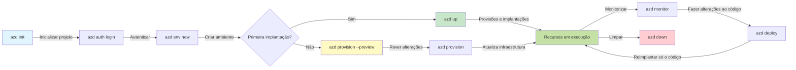
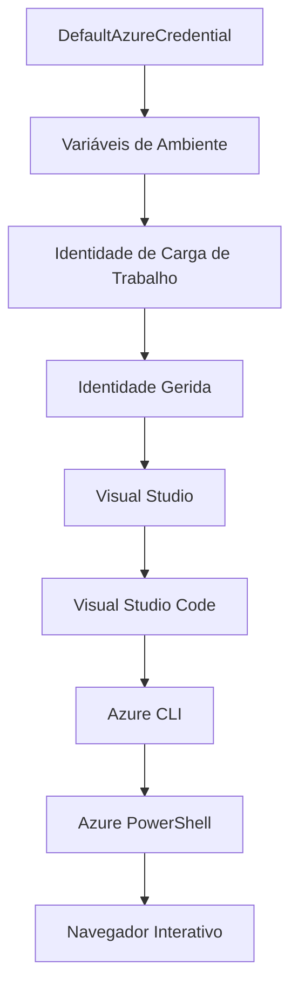

# Noções Básicas do AZD - Compreendendo o Azure Developer CLI

# Noções Básicas do AZD - Conceitos e Fundamentos Essenciais

**Navegação do Capítulo:**
- **📚 Início do Curso**: [AZD Para Iniciantes](../../README.md)
- **📖 Capítulo Atual**: Capítulo 1 - Fundação & Arranque Rápido
- **⬅️ Anterior**: [Visão Geral do Curso](../../README.md#-chapter-1-foundation--quick-start)
- **➡️ Seguinte**: [Instalação & Configuração](installation.md)
- **🚀 Próximo Capítulo**: [Capítulo 2: Desenvolvimento AI-First](../chapter-02-ai-development/microsoft-foundry-integration.md)

## Introdução

Esta lição apresenta-lhe o Azure Developer CLI (azd), uma poderosa ferramenta de linha de comando que acelera a sua jornada desde o desenvolvimento local até à implantação no Azure. Você vai aprender os conceitos fundamentais, as funcionalidades principais e compreender como o azd simplifica a implantação de aplicações nativas na cloud.

## Objetivos de Aprendizagem

No final desta lição, você irá:
- Compreender o que é o Azure Developer CLI e o seu propósito principal
- Aprender os conceitos básicos de templates, ambientes e serviços
- Explorar as funcionalidades chave incluindo desenvolvimento orientado a templates e Infraestrutura como Código
- Compreender a estrutura do projeto azd e o fluxo de trabalho
- Estar preparado para instalar e configurar o azd no seu ambiente de desenvolvimento

## Resultados de Aprendizagem

Depois de concluir esta lição, será capaz de:
- Explicar o papel do azd em fluxos de trabalho modernos de desenvolvimento em cloud
- Identificar os componentes da estrutura de um projeto azd
- Descrever como templates, ambientes e serviços funcionam em conjunto
- Entender os benefícios da Infraestrutura como Código com azd
- Reconhecer diferentes comandos azd e os seus propósitos

## O que é o Azure Developer CLI (azd)?

Azure Developer CLI (azd) é uma ferramenta de linha de comando concebida para acelerar a sua jornada desde o desenvolvimento local até à implantação no Azure. Simplifica o processo de construir, implantar e gerir aplicações nativas da cloud no Azure.

### O Que Pode Implantar com o azd?

O azd suporta uma vasta gama de cargas de trabalho — e a lista continua a crescer. Atualmente, pode usar o azd para implantar:

| Tipo de Carga de Trabalho | Exemplos | Mesmo Fluxo de Trabalho? |
|---------------------------|----------|--------------------------|
| **Aplicações tradicionais** | Aplicações web, APIs REST, sites estáticos | ✅ `azd up` |
| **Serviços e microsserviços** | Container Apps, Function Apps, backends multi-serviço | ✅ `azd up` |
| **Aplicações com IA** | Aplicações de chat com Microsoft Foundry Models, soluções RAG com AI Search | ✅ `azd up` |
| **Agentes inteligentes** | Agentes alojados no Foundry, orquestrações multi-agente | ✅ `azd up` |

O ponto-chave é que **o ciclo de vida do azd mantém-se igual independentemente do que estiver a implantar**. Você inicializa um projeto, provisona a infraestrutura, implanta o seu código, monitora a aplicação e limpa — seja um simples website ou um agente de IA sofisticado.

Esta continuidade é propositada. O azd trata as capacidades de IA como mais um tipo de serviço que a sua aplicação pode usar, e não como algo fundamentalmente diferente. Um endpoint de chat suportado por Microsoft Foundry Models é, para o azd, apenas mais um serviço para configurar e implantar.

### 🎯 Por Que Usar o AZD? Uma Comparação do Mundo Real

Vamos comparar a implantação de uma aplicação web simples com base de dados:

#### ❌ SEM AZD: Implantação Manual no Azure (mais de 30 minutos)

```bash
# Passo 1: Criar grupo de recursos
az group create --name myapp-rg --location eastus

# Passo 2: Criar Plano de Serviço de Aplicação
az appservice plan create --name myapp-plan \
  --resource-group myapp-rg \
  --sku B1 --is-linux

# Passo 3: Criar Aplicação Web
az webapp create --name myapp-web-unique123 \
  --resource-group myapp-rg \
  --plan myapp-plan \
  --runtime "NODE:18-lts"

# Passo 4: Criar conta Cosmos DB (10-15 minutos)
az cosmosdb create --name myapp-cosmos-unique123 \
  --resource-group myapp-rg \
  --kind MongoDB

# Passo 5: Criar base de dados
az cosmosdb mongodb database create \
  --account-name myapp-cosmos-unique123 \
  --resource-group myapp-rg \
  --name tododb

# Passo 6: Criar coleção
az cosmosdb mongodb collection create \
  --account-name myapp-cosmos-unique123 \
  --resource-group myapp-rg \
  --database-name tododb \
  --name todos

# Passo 7: Obter cadeia de ligação
CONN_STR=$(az cosmosdb keys list \
  --name myapp-cosmos-unique123 \
  --resource-group myapp-rg \
  --type connection-strings \
  --query "connectionStrings[0].connectionString" -o tsv)

# Passo 8: Configurar definições da aplicação
az webapp config appsettings set \
  --name myapp-web-unique123 \
  --resource-group myapp-rg \
  --settings MONGODB_URI="$CONN_STR"

# Passo 9: Ativar logging
az webapp log config --name myapp-web-unique123 \
  --resource-group myapp-rg \
  --application-logging filesystem \
  --detailed-error-messages true

# Passo 10: Configurar Application Insights
az monitor app-insights component create \
  --app myapp-insights \
  --location eastus \
  --resource-group myapp-rg

# Passo 11: Ligar App Insights à Aplicação Web
INSTRUMENTATION_KEY=$(az monitor app-insights component show \
  --app myapp-insights \
  --resource-group myapp-rg \
  --query "instrumentationKey" -o tsv)

az webapp config appsettings set \
  --name myapp-web-unique123 \
  --resource-group myapp-rg \
  --settings APPINSIGHTS_INSTRUMENTATIONKEY="$INSTRUMENTATION_KEY"

# Passo 12: Construir aplicação localmente
npm install
npm run build

# Passo 13: Criar pacote de implantação
zip -r app.zip . -x "*.git*" "node_modules/*"

# Passo 14: Implantar aplicação
az webapp deployment source config-zip \
  --resource-group myapp-rg \
  --name myapp-web-unique123 \
  --src app.zip

# Passo 15: Esperar e rezar para que funcione 🙏
# (Sem validação automática, requer testes manuais)
```

**Problemas:**
- ❌ Mais de 15 comandos para memorizar e executar por ordem
- ❌ 30-45 minutos de trabalho manual
- ❌ Facilmente propenso a erros (erros de digitação, parâmetros errados)
- ❌ Strings de conexão expostas no histórico do terminal
- ❌ Sem rollback automatizado se algo falhar
- ❌ Difícil de replicar para outros membros da equipa
- ❌ Diferente de cada vez (não reproduzível)

#### ✅ COM AZD: Implantação Automatizada (5 comandos, 10-15 minutos)

```bash
# Passo 1: Inicializar a partir do modelo
azd init --template todo-nodejs-mongo

# Passo 2: Autenticar
azd auth login

# Passo 3: Criar ambiente
azd env new dev

# Passo 4: Pré-visualizar alterações (opcional mas recomendado)
azd provision --preview

# Passo 5: Implantar tudo
azd up

# ✨ Concluído! Tudo está implantado, configurado e monitorizado
```

**Benefícios:**
- ✅ **5 comandos** vs. mais de 15 passos manuais
- ✅ **10-15 minutos** no total (maioritariamente a esperar pelo Azure)
- ✅ **Menos erros manuais** – fluxo consistente e orientado a templates
- ✅ **Gestão segura de segredos** – muitos templates usam armazenamento de segredos gerido pelo Azure
- ✅ **Implantações repetíveis** – mesmo fluxo todas as vezes
- ✅ **Totalmente reproduzível** – mesmo resultado todas as vezes
- ✅ **Pronto para equipas** – qualquer pessoa pode implantar com os mesmos comandos
- ✅ **Infraestrutura como Código** – templates Bicep versionados
- ✅ **Monitorização incorporada** – Application Insights configurado automaticamente

### 📊 Redução de Tempo & Erros

| Métrica | Implantação Manual | Implantação AZD | Melhoria |
|:--------|:------------------|:----------------|:---------|
| **Comandos** | 15+ | 5 | 67% menos |
| **Tempo** | 30-45 min | 10-15 min | 60% mais rápido |
| **Taxa de Erro** | ~40% | <5% | Redução de 88% |
| **Consistência** | Baixa (manual) | 100% (automatizado) | Perfeita |
| **Integração da Equipa** | 2-4 horas | 30 minutos | 75% mais rápido |
| **Tempo de Rollback** | +30 min (manual) | 2 min (automatizado) | 93% mais rápido |

## Conceitos Essenciais

### Templates
Os templates são a base do azd. Contêm:
- **Código da aplicação** – O seu código-fonte e dependências
- **Definições de infraestrutura** – Recursos Azure definidos em Bicep ou Terraform
- **Ficheiros de configuração** – Definições e variáveis de ambiente
- **Scripts de implantação** – Fluxos de trabalho de implantação automatizados

### Ambientes
Ambientes representam diferentes alvos de implantação:
- **Desenvolvimento** – Para testes e desenvolvimento
- **Staging** – Ambiente pré-produção
- **Produção** – Ambiente de produção live

Cada ambiente mantém o seu próprio:
- Grupo de recursos Azure
- Configurações
- Estado de implantação

### Serviços
Serviços são os blocos de construção da sua aplicação:
- **Frontend** – Aplicações web, SPAs
- **Backend** – APIs, microsserviços
- **Base de dados** – Soluções de armazenamento de dados
- **Armazenamento** – Armazenamento de ficheiros e blobs

## Funcionalidades Chave

### 1. Desenvolvimento Orientado por Templates
```bash
# Navegar pelos modelos disponíveis
azd template list

# Inicializar a partir de um modelo
azd init --template <template-name>
```

### 2. Infraestrutura como Código
- **Bicep** – linguagem específica do domínio da Azure
- **Terraform** – ferramenta de infraestrutura multi-cloud
- **Templates ARM** – templates do Azure Resource Manager

### 3. Fluxos de Trabalho Integrados
```bash
# Fluxo completo de implantação
azd up            # Provisionar + Implantar isto é automático para a configuração inicial

# 🧪 NOVO: Visualizar alterações na infraestrutura antes da implantação (SEGURO)
azd provision --preview    # Simular a implantação da infraestrutura sem fazer alterações

azd provision     # Criar recursos Azure se atualizar a infraestrutura usar isto
azd deploy        # Implantar código da aplicação ou reimplantar código da aplicação após atualização
azd down          # Limpar recursos
```

#### 🛡️ Planeamento Seguro de Infraestrutura com Pré-visualização
O comando `azd provision --preview` é uma revolução para implantações seguras:
- **Análise de simulação** – Mostra o que será criado, modificado ou eliminado
- **Risco zero** – Nenhuma alteração real é feita ao ambiente Azure
- **Colaboração em equipa** – Partilhe os resultados da pré-visualização antes da implantação
- **Estimativa de custos** – Entenda os custos dos recursos antes do compromisso

```bash
# Exemplo de fluxo de trabalho de pré-visualização
azd provision --preview           # Veja o que vai mudar
# Reveja o resultado, discuta com a equipa
azd provision                     # Aplique as alterações com confiança
```

### 📊 Visual: Fluxo de Trabalho de Desenvolvimento AZD


**Explicação do Fluxo de Trabalho:**
1. **Init** – Começar com um template ou projeto novo
2. **Auth** – Autenticar com Azure
3. **Ambiente** – Criar ambiente isolado para implantação
4. **Preview** – 🆕 Sempre pré-visualizar alterações na infraestrutura primeiro (boa prática)
5. **Provision** – Criar/atualizar recursos Azure
6. **Deploy** – Enviar o código da sua aplicação
7. **Monitor** – Observar o desempenho da aplicação
8. **Iterar** – Fazer alterações e reimplantar código
9. **Cleanup** – Remover recursos quando terminar

### 4. Gestão de Ambientes
```bash
# Criar e gerir ambientes
azd env new <environment-name>
azd env select <environment-name>
azd env list
```

### 5. Extensões e Comandos AI

O azd usa um sistema de extensões para adicionar capacidades para além do CLI base. Isto é especialmente útil para workloads de IA:

```bash
# Listar extensões disponíveis
azd extension list

# Instalar a extensão de agentes Foundry
azd extension install azure.ai.agents

# Inicializar um projeto de agente de IA a partir de um manifesto
azd ai agent init -m agent-manifest.yaml

# Iniciar o servidor MCP para desenvolvimento assistido por IA (Alfa)
azd mcp start
```

> As extensões são abordadas em detalhe em [Capítulo 2: Desenvolvimento AI-First](../chapter-02-ai-development/agents.md) e a referência de [Comandos AZD AI CLI](../chapter-08-production/production-ai-practices.md#azd-ai-cli-commands-and-extensions).

## 📁 Estrutura do Projeto

Uma estrutura típica de projeto azd:
```
my-app/
├── .azd/                    # azd configuration
│   └── config.json
├── .azure/                  # Azure deployment artifacts
├── .devcontainer/          # Development container config
├── .github/workflows/      # GitHub Actions
├── .vscode/               # VS Code settings
├── infra/                 # Infrastructure code
│   ├── main.bicep        # Main infrastructure template
│   ├── main.parameters.json
│   └── modules/          # Reusable modules
├── src/                  # Application source code
│   ├── api/             # Backend services
│   └── web/             # Frontend application
├── azure.yaml           # azd project configuration
└── README.md
```

## 🔧 Ficheiros de Configuração

### azure.yaml
O ficheiro principal de configuração do projeto:
```yaml
name: my-awesome-app
metadata:
  template: my-template@1.0.0

services:
  web:
    project: ./src/web
    language: js
    host: appservice
  api:
    project: ./src/api
    language: js
    host: appservice

hooks:
  preprovision:
    shell: pwsh
    run: echo "Preparing to provision..."
```

### .azure/config.json
Configuração específica do ambiente:
```json
{
  "version": 1,
  "defaultEnvironment": "dev",
  "environments": {
    "dev": {
      "subscriptionId": "your-subscription-id",
      "location": "eastus"
    }
  }
}
```

## 🎪 Fluxos de Trabalho Comuns com Exercícios Práticos

> **💡 Dica de Aprendizagem:** Siga estes exercícios por ordem para desenvolver progressivamente as suas competências em AZD.

### 🎯 Exercício 1: Inicializar o Seu Primeiro Projeto

**Objetivo:** Criar um projeto AZD e explorar a sua estrutura

**Passos:**
```bash
# Utilize um modelo comprovado
azd init --template todo-nodejs-mongo

# Explore os ficheiros gerados
ls -la  # Veja todos os ficheiros, incluindo os ocultos

# Ficheiros principais criados:
# - azure.yaml (configuração principal)
# - infra/ (código de infraestrutura)
# - src/ (código da aplicação)
```

**✅ Sucesso:** Tem os diretórios azure.yaml, infra/ e src/

---

### 🎯 Exercício 2: Implantar no Azure

**Objetivo:** Completar a implantação end-to-end

**Passos:**
```bash
# 1. Autenticar
az login && azd auth login

# 2. Criar ambiente
azd env new dev
azd env set AZURE_LOCATION eastus

# 3. Visualizar alterações (RECOMENDADO)
azd provision --preview

# 4. Fazer o deploy de tudo
azd up

# 5. Verificar o deploy
azd show    # Ver o URL da sua app
```

**Tempo Estimado:** 10-15 minutos  
**✅ Sucesso:** URL da aplicação abre no navegador

---

### 🎯 Exercício 3: Múltiplos Ambientes

**Objetivo:** Implantar em dev e staging

**Passos:**
```bash
# Já tem dev, criar staging
azd env new staging
azd env set AZURE_LOCATION westus2
azd up

# Alternar entre eles
azd env list
azd env select dev
```

**✅ Sucesso:** Dois grupos de recursos separados no Portal Azure

---

### 🛡️ Reset Completo: `azd down --force --purge`

Quando precisa de reiniciar completamente:

```bash
azd down --force --purge
```

**O que faz:**
- `--force`: Sem perguntas de confirmação
- `--purge`: Elimina todo o estado local e recursos Azure

**Usar quando:**
- Implantação falhou a meio
- Mudança de projetos
- Necessidade de recomeçar do zero

---

## 🎪 Referência do Fluxo de Trabalho Original

### Começar um Projeto Novo
```bash
# Método 1: Usar um modelo existente
azd init --template todo-nodejs-mongo

# Método 2: Começar do zero
azd init

# Método 3: Usar o diretório atual
azd init .
```

### Ciclo de Desenvolvimento
```bash
# Configurar o ambiente de desenvolvimento
azd auth login
azd env new dev
azd env select dev

# Implantar tudo
azd up

# Fazer alterações e reimplantar
azd deploy

# Limpar quando terminar
azd down --force --purge # o comando no Azure Developer CLI é um **reset completo** para o seu ambiente—especialmente útil quando está a resolver problemas de implantações falhadas, a limpar recursos órfãos ou a preparar uma nova implantação.
```

## Compreender `azd down --force --purge`
O comando `azd down --force --purge` é uma forma poderosa de desmantelar completamente o seu ambiente azd e todos os recursos associados. Aqui está uma explicação do que cada opção faz:
```
--force
```
- Ignora pedidos de confirmação.
- Útil para automação ou scripts onde input manual não é viável.
- Garante que o encerramento prossegue sem interrupções, mesmo se o CLI detetar inconsistências.

```
--purge
```
Elimina **todos os metadados associados**, incluindo:
Estado do ambiente  
Pasta local `.azure`  
Informações em cache da implantação  
Impede que o azd "lembre" implantações anteriores, o que pode causar problemas como grupos de recursos desalinhados ou referências a registos desatualizadas.

### Por que usar ambos?
Quando se depara com bloqueios no `azd up` devido a estados persistentes ou implantações parciais, esta combinação assegura uma **limpeza total**.

É especialmente útil após eliminações manuais de recursos no portal Azure ou quando se muda de templates, ambientes ou convenções de nomes de grupos de recursos.

### Gestão de Múltiplos Ambientes
```bash
# Criar ambiente de staging
azd env new staging
azd env select staging
azd up

# Voltar para dev
azd env select dev

# Comparar ambientes
azd env list
```

## 🔐 Autenticação e Credenciais

Compreender a autenticação é crucial para implantações bem-sucedidas com azd. A Azure usa múltiplos métodos de autenticação, e azd aproveita a mesma cadeia de credenciais utilizada por outras ferramentas Azure.

### Autenticação Azure CLI (`az login`)

Antes de usar o azd, precisa autenticar-se com o Azure. O método mais comum é usar o Azure CLI:

```bash
# Login interativo (abre o navegador)
az login

# Login com inquilino específico
az login --tenant <tenant-id>

# Login com principal de serviço
az login --service-principal -u <app-id> -p <password> --tenant <tenant-id>

# Verificar estado de login atual
az account show

# Listar subscrições disponíveis
az account list --output table

# Definir subscrição padrão
az account set --subscription <subscription-id>
```

### Fluxo de Autenticação
1. **Login Interativo**: Abre o browser padrão para autenticação
2. **Fluxo de Código de Dispositivo**: Para ambientes sem acesso a browser
3. **Service Principal**: Para automação e cenários CI/CD
4. **Identidade Gerida**: Para aplicações alojadas no Azure

### Cadeia DefaultAzureCredential

`DefaultAzureCredential` é um tipo de credencial que oferece uma experiência simplificada de autenticação, tentando automaticamente múltiplas fontes de credenciais numa ordem específica:

#### Ordem da Cadeia de Credenciais

#### 1. Variáveis de Ambiente
```bash
# Definir variáveis de ambiente para o principal do serviço
export AZURE_CLIENT_ID="<app-id>"
export AZURE_CLIENT_SECRET="<password>"
export AZURE_TENANT_ID="<tenant-id>"
```

#### 2. Identidade de Workload (Kubernetes/GitHub Actions)
Usado automaticamente em:
- Azure Kubernetes Service (AKS) com Identidade de Workload
- GitHub Actions com federação OIDC
- Outros cenários de identidade federada

#### 3. Identidade Gerida
Para recursos Azure como:
- Máquinas Virtuais
- App Service
- Azure Functions
- Container Instances

```bash
# Verificar se está a correr num recurso Azure com identidade gerida
az account show --query "user.type" --output tsv
# Retorna: "servicePrincipal" se estiver a usar identidade gerida
```

#### 4. Integração com Ferramentas de Desenvolvimento
- **Visual Studio**: Usa automaticamente a conta iniciada
- **VS Code**: Usa credenciais da extensão Azure Account
- **Azure CLI**: Usa credenciais de `az login` (mais comum no desenvolvimento local)

### Configuração de Autenticação no AZD

```bash
# Método 1: Usar Azure CLI (Recomendado para desenvolvimento)
az login
azd auth login  # Usa credenciais existentes do Azure CLI

# Método 2: Autenticação direta azd
azd auth login --use-device-code  # Para ambientes sem interface gráfica

# Método 3: Verificar estado da autenticação
azd auth login --check-status

# Método 4: Terminar sessão e autenticar novamente
azd auth logout
azd auth login
```

### Melhores Práticas de Autenticação

#### Para Desenvolvimento Local
```bash
# 1. Inicie sessão com Azure CLI
az login

# 2. Verifique a subscrição correta
az account show
az account set --subscription "Your Subscription Name"

# 3. Utilize azd com as credenciais existentes
azd auth login
```

#### Para Pipelines CI/CD
```yaml
# GitHub Actions example
- name: Azure Login
  uses: azure/login@v1
  with:
    creds: ${{ secrets.AZURE_CREDENTIALS }}

- name: Deploy with azd
  run: |
    azd auth login --client-id ${{ secrets.AZURE_CLIENT_ID }} \
                    --client-secret ${{ secrets.AZURE_CLIENT_SECRET }} \
                    --tenant-id ${{ secrets.AZURE_TENANT_ID }}
    azd up --no-prompt
```

#### Para Ambientes de Produção
- Use **Identidade Gerida** quando executar em recursos Azure
- Use **Service Principal** para cenários de automação
- Evite armazenar credenciais em código ou ficheiros de configuração
- Use **Azure Key Vault** para configuração sensível

### Problemas Comuns de Autenticação e Soluções

#### Problema: "Nenhuma subscrição encontrada"
```bash
# Solução: Definir assinatura predefinida
az account list --output table
az account set --subscription "<subscription-id>"
azd env set AZURE_SUBSCRIPTION_ID "<subscription-id>"
```

#### Problema: "Permissões insuficientes"
```bash
# Solução: Verificar e atribuir funções necessárias
az role assignment list --assignee $(az account show --query user.name --output tsv)

# Funções comuns necessárias:
# - Colaborador (para gestão de recursos)
# - Administrador de Acesso de Utilizadores (para atribuições de funções)
```

#### Problema: "Token expirado"
```bash
# Solução: Reautenticar
az logout
az login
azd auth logout
azd auth login
```

### Autenticação em Diferentes Cenários

#### Desenvolvimento Local
```bash
# Conta de desenvolvimento pessoal
az login
azd auth login
```

#### Desenvolvimento em Equipa
```bash
# Use um inquilino específico para a organização
az login --tenant contoso.onmicrosoft.com
azd auth login
```

#### Cenários Multi-inquilino
```bash
# Alternar entre inquilinos
az login --tenant tenant1.onmicrosoft.com
# Implementar para o inquilino 1
azd up

az login --tenant tenant2.onmicrosoft.com  
# Implementar para o inquilino 2
azd up
```

### Considerações de Segurança
1. **Armazenamento de Credenciais**: Nunca armazene credenciais no código-fonte  
2. **Limitação de Âmbito**: Use o princípio do mínimo privilégio para service principals  
3. **Rotação de Token**: Rode regularmente os segredos do service principal  
4. **Rastreamento de Auditoria**: Monitorize atividades de autenticação e implantação  
5. **Segurança de Rede**: Utilize endpoints privados sempre que possível  

### Resolução de Problemas de Autenticação

```bash
# Depurar problemas de autenticação
azd auth login --check-status
az account show
az account get-access-token

# Comandos comuns de diagnóstico
whoami                          # Contexto do utilizador atual
az ad signed-in-user show      # Detalhes do utilizador do Azure AD
az group list                  # Testar acesso a recursos
```
  
## Compreender `azd down --force --purge`  

### Descoberta  
```bash
azd template list              # Navegar por modelos
azd template show <template>   # Detalhes do modelo
azd init --help               # Opções de inicialização
```
  
### Gestão de Projetos  
```bash
azd show                     # Visão geral do projeto
azd env list                # Ambientes disponíveis e predefinição selecionada
azd config show            # Definições de configuração
```
  
### Monitorização  
```bash
azd monitor                  # Abrir monitorização do portal Azure
azd monitor --logs           # Ver registos da aplicação
azd monitor --live           # Ver métricas em tempo real
azd pipeline config          # Configurar CI/CD
```
  
## Melhores Práticas  

### 1. Use Nomes Significativos  
```bash
# Bom
azd env new production-east
azd init --template web-app-secure

# Evitar
azd env new env1
azd init --template template1
```
  
### 2. Aproveitar Templates  
- Comece com templates existentes  
- Personalize conforme as suas necessidades  
- Crie templates reutilizáveis para a sua organização  

### 3. Isolamento de Ambiente  
- Use ambientes separados para dev/staging/prod  
- Nunca faça deploy diretamente para produção a partir da máquina local  
- Utilize pipelines CI/CD para deploys de produção  

### 4. Gestão de Configuração  
- Use variáveis de ambiente para dados sensíveis  
- Guarde a configuração no controlo de versões  
- Documente definições específicas do ambiente  

## Progressão de Aprendizagem  

### Iniciante (Semanas 1-2)  
1. Instalar azd e autenticar  
2. Fazer deploy de um template simples  
3. Compreender a estrutura do projeto  
4. Aprender comandos básicos (up, down, deploy)  

### Intermédio (Semanas 3-4)  
1. Personalizar templates  
2. Gerir múltiplos ambientes  
3. Compreender código de infraestrutura  
4. Configurar pipelines CI/CD  

### Avançado (Semana 5+)  
1. Criar templates personalizados  
2. Padrões avançados de infraestrutura  
3. Deploys multi-região  
4. Configurações ao nível empresarial  

## Próximos Passos  

**📖 Continuar a Aprender o Capítulo 1:**  
- [Instalação e Configuração](installation.md) - Faça a instalação e configure o azd  
- [O Seu Primeiro Projeto](first-project.md) - Complete o tutorial prático  
- [Guia de Configuração](configuration.md) - Opções avançadas de configuração  

**🎯 Pronto para o Próximo Capítulo?**  
- [Capítulo 2: Desenvolvimento AI-First](../chapter-02-ai-development/microsoft-foundry-integration.md) - Comece a construir aplicações AI  

## Recursos Adicionais  

- [Visão Geral do Azure Developer CLI](https://learn.microsoft.com/en-us/azure/developer/azure-developer-cli/)  
- [Galeria de Templates](https://azure.github.io/awesome-azd/)  
- [Exemplos da Comunidade](https://github.com/Azure-Samples)  

---

## 🙋 Perguntas Frequentes  

### Perguntas Gerais  

**Q: Qual a diferença entre AZD e Azure CLI?**  

A: Azure CLI (`az`) é para gerir recursos individuais do Azure. AZD (`azd`) é para gerir aplicações completas:  

```bash
# Azure CLI - Gestão de recursos a baixo nível
az webapp create --name myapp --resource-group rg
az sql server create --name myserver --resource-group rg
# ...muitos mais comandos necessários

# AZD - Gestão a nível de aplicação
azd up  # Desdobra aplicação inteira com todos os recursos
```
  
**Pense desta forma:**  
- `az` = Operar tijolos Lego individuais  
- `azd` = Trabalhar com conjuntos completos de Lego  

---

**Q: Preciso saber Bicep ou Terraform para usar AZD?**  

A: Não! Comece com templates:  
```bash
# Use o modelo existente - não é necessário conhecimento de IaC
azd init --template todo-nodejs-mongo
azd up
```
  
Pode aprender Bicep mais tarde para personalizar a infraestrutura. Templates fornecem exemplos práticos para aprender.  

---

**Q: Quanto custa usar templates AZD?**  

A: Os custos variam consoante o template. A maioria dos templates de desenvolvimento custa entre 50 a 150 dólares/mês:  

```bash
# Pré-visualizar custos antes de implantar
azd provision --preview

# Limpar sempre quando não estiver a usar
azd down --force --purge  # Remove todos os recursos
```
  
**Dica profissional:** Use níveis gratuitos onde disponíveis:  
- App Service: nível F1 (Gratuito)  
- Modelos Microsoft Foundry: Azure OpenAI 50.000 tokens/mês gratuitos  
- Cosmos DB: nível gratuito de 1000 RU/s  

---

**Q: Posso usar AZD com recursos Azure já existentes?**  

A: Sim, mas é mais fácil começar do zero. AZD funciona melhor quando gere o ciclo completo. Para recursos existentes:  

```bash
# Opção 1: Importar recursos existentes (avançado)
azd init
# Depois modifique infra/ para referenciar recursos existentes

# Opção 2: Começar do zero (recomendado)
azd init --template matching-your-stack
azd up  # Cria um novo ambiente
```
  
---

**Q: Como partilho o meu projeto com colegas?**  

A: Faça commit do projeto AZD para o Git (mas NÃO da pasta .azure):  

```bash
# Já está no .gitignore por padrão
.azure/        # Contém segredos e dados do ambiente
*.env          # Variáveis de ambiente

# Membros da equipa então:
git clone <your-repo>
azd auth login
azd env new <their-name>-dev
azd up
```
  
Todos obtêm a mesma infraestrutura a partir dos mesmos templates.  

---

### Perguntas de Resolução de Problemas  

**Q: "azd up" falhou a meio. O que faço?**  

A: Verifique o erro, corrija e tente novamente:  

```bash
# Ver registos detalhados
azd show

# Correções comuns:

# 1. Se a quota foi excedida:
azd env set AZURE_LOCATION "westus2"  # Tente uma região diferente

# 2. Se houver conflito no nome do recurso:
azd down --force --purge  # Limpar tudo
azd up  # Tente novamente

# 3. Se a autenticação expirou:
az login
azd auth login
azd up
```
  
**Problema mais comum:** Subscrição Azure errada selecionada  
```bash
az account list --output table
az account set --subscription "<correct-subscription>"
```
  
---

**Q: Como faço deploy só das alterações de código sem reprovisionar?**  

A: Use `azd deploy` em vez de `azd up`:  

```bash
azd up          # Primeira vez: provisionar + implantar (lento)

# Fazer alterações no código...

azd deploy      # Próximas vezes: apenas implantar (rápido)
```
  
Comparação de velocidade:  
- `azd up`: 10-15 minutos (provisiona infraestrutura)  
- `azd deploy`: 2-5 minutos (só código)  

---

**Q: Posso personalizar os templates de infraestrutura?**  

A: Sim! Edite os ficheiros Bicep em `infra/`:  

```bash
# Após azd init
cd infra/
code main.bicep  # Editar no VS Code

# Pré-visualizar alterações
azd provision --preview

# Aplicar alterações
azd provision
```
  
**Dica:** Comece pequeno - altere SKUs primeiro:  
```bicep
// infra/main.bicep
sku: {
  name: 'B1'  // Change to 'P1V2' for production
}
```
  
---

**Q: Como elimino tudo o que o AZD criou?**  

A: Um comando remove todos os recursos:  

```bash
azd down --force --purge

# Isto elimina:
# - Todos os recursos Azure
# - Grupo de recursos
# - Estado do ambiente local
# - Dados em cache da implementação
```
  
**Use sempre quando:**  
- Terminar de testar um template  
- Mudar para outro projeto  
- Querer começar do zero  

**Economia:** Apagar recursos não usados = cobranças $0  

---

**Q: E se apagar recursos acidentalmente no Portal Azure?**  

A: O estado do AZD pode desincronizar. Abordagem limpa:  

```bash
# 1. Remover o estado local
azd down --force --purge

# 2. Começar de novo
azd up

# Alternativa: Deixar o AZD detetar e corrigir
azd provision  # Irá criar os recursos em falta
```
  
---

### Perguntas Avançadas  

**Q: Posso usar AZD em pipelines CI/CD?**  

A: Sim! Exemplo GitHub Actions:  

```yaml
# .github/workflows/deploy.yml
name: Deploy with AZD

on:
  push:
    branches: [main]

jobs:
  deploy:
    runs-on: ubuntu-latest
    steps:
      - uses: actions/checkout@v2
      
      - name: Install azd
        run: curl -fsSL https://aka.ms/install-azd.sh | bash
      
      - name: Azure Login
        run: |
          azd auth login \
            --client-id ${{ secrets.AZURE_CLIENT_ID }} \
            --client-secret ${{ secrets.AZURE_CLIENT_SECRET }} \
            --tenant-id ${{ secrets.AZURE_TENANT_ID }}
      
      - name: Deploy
        run: azd up --no-prompt
```
  
---

**Q: Como gerenciar segredos e dados sensíveis?**  

A: AZD integra-se automaticamente com o Azure Key Vault:  

```bash
# Os segredos são armazenados no Key Vault, não no código
azd env set DATABASE_PASSWORD "$(openssl rand -base64 32)"

# O AZD automaticamente:
# 1. Cria o Key Vault
# 2. Armazena o segredo
# 3. Concede acesso à aplicação através da Identidade Gerida
# 4. Injeta em tempo de execução
```
  
**Nunca faça commit de:**  
- Pasta `.azure/` (contém dados do ambiente)  
- Ficheiros `.env` (segredos locais)  
- Strings de ligação  

---

**Q: Posso fazer deploy para múltiplas regiões?**  

A: Sim, crie um ambiente por região:  

```bash
# Ambiente Leste dos EUA
azd env new prod-eastus
azd env set AZURE_LOCATION eastus
azd up

# Ambiente Oeste da Europa
azd env new prod-westeurope
azd env set AZURE_LOCATION westeurope
azd up

# Cada ambiente é independente
azd env list
```
  
Para apps verdadeiramente multi-região, personalize os templates Bicep para implantar em várias regiões simultaneamente.  

---

**Q: Onde posso obter ajuda se ficar bloqueado?**  

1. **Documentação AZD:** https://learn.microsoft.com/azure/developer/azure-developer-cli/  
2. **Issues no GitHub:** https://github.com/Azure/azure-dev/issues  
3. **Discord:** [Azure Discord](https://discord.gg/microsoft-azure) - canal #azure-developer-cli  
4. **Stack Overflow:** Tag `azure-developer-cli`  
5. **Este Curso:** [Guia de Resolução de Problemas](../chapter-07-troubleshooting/common-issues.md)  

**Dica profissional:** Antes de perguntar, corra:  
```bash
azd show       # Mostra o estado atual
azd version    # Mostra a sua versão
```
Inclua esta informação na sua pergunta para uma ajuda mais rápida.  

---

## 🎓 O Que Vem a Seguir?  

Agora compreende os fundamentos AZD. Escolha o seu caminho:  

### 🎯 Para Iniciantes:  
1. **A seguir:** [Instalação e Configuração](installation.md) - Instale o AZD na sua máquina  
2. **Depois:** [O Seu Primeiro Projeto](first-project.md) - Faça deploy da sua primeira app  
3. **Prática:** Complete os 3 exercícios desta lição  

### 🚀 Para Desenvolvedores AI:  
1. **Pule para:** [Capítulo 2: Desenvolvimento AI-First](../chapter-02-ai-development/microsoft-foundry-integration.md)  
2. **Faça deploy:** Comece com `azd init --template get-started-with-ai-chat`  
3. **Aprenda:** Construa enquanto implanta  

### 🏗️ Para Desenvolvedores Experientes:  
1. **Revise:** [Guia de Configuração](configuration.md) - Definições avançadas  
2. **Explore:** [Infraestrutura como Código](../chapter-04-infrastructure/provisioning.md) - Mergulho profundo em Bicep  
3. **Construa:** Crie templates personalizados para a sua stack  

---

**Navegação do Capítulo:**  
- **📚 Início do Curso**: [AZD Para Iniciantes](../../README.md)  
- **📖 Capítulo Atual**: Capítulo 1 - Fundamentos e Início Rápido  
- **⬅️ Anterior**: [Visão Geral do Curso](../../README.md#-chapter-1-foundation--quick-start)  
- **➡️ Seguinte**: [Instalação e Configuração](installation.md)  
- **🚀 Capítulo Seguinte**: [Capítulo 2: Desenvolvimento AI-First](../chapter-02-ai-development/microsoft-foundry-integration.md)

---

<!-- CO-OP TRANSLATOR DISCLAIMER START -->
**Aviso Legal**:  
Este documento foi traduzido utilizando o serviço de tradução por IA [Co-op Translator](https://github.com/Azure/co-op-translator). Embora nos esforcemos por garantir a precisão, por favor tenha em conta que traduções automáticas podem conter erros ou imprecisões. O documento original na sua língua nativa deve ser considerado a fonte autoritativa. Para informações críticas, recomenda-se a tradução profissional por humanos. Não nos responsabilizamos por quaisquer mal-entendidos ou interpretações incorretas decorrentes do uso desta tradução.
<!-- CO-OP TRANSLATOR DISCLAIMER END -->