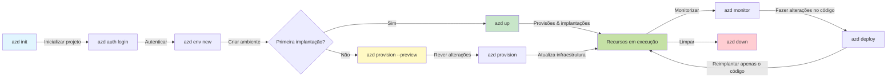
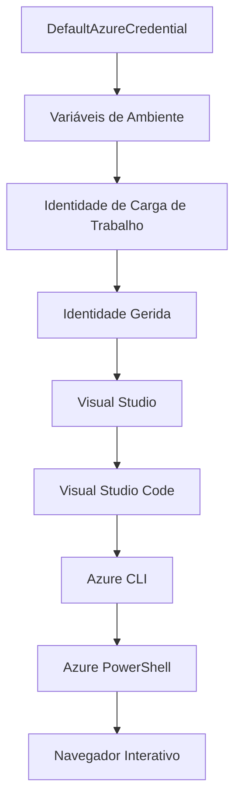

# AZD Basics - Compreender o Azure Developer CLI

# AZD Basics - Conceitos e Fundamentos Principais

**Navegação pelo Capítulo:**
- **📚 Início do Curso**: [AZD Para Iniciantes](../../README.md)
- **📖 Capítulo Atual**: Capítulo 1 - Fundamentos e Início Rápido
- **⬅️ Anterior**: [Visão Geral do Curso](../../README.md#-chapter-1-foundation--quick-start)
- **➡️ Seguinte**: [Instalação e Configuração](installation.md)
- **🚀 Próximo Capítulo**: [Capítulo 2: Desenvolvimento AI-First](../chapter-02-ai-development/microsoft-foundry-integration.md)

## Introdução

Esta lição apresenta o Azure Developer CLI (azd), uma poderosa ferramenta de linha de comandos que acelera a sua jornada do desenvolvimento local até a implementação no Azure. Vai aprender os conceitos fundamentais, as funcionalidades principais, e perceber como o azd simplifica a implementação de aplicações nativas da cloud.

## Objetivos de Aprendizagem

No final desta lição, vai:
- Compreender o que é o Azure Developer CLI e a sua finalidade principal
- Conhecer os conceitos fundamentais de modelos, ambientes e serviços
- Explorar funcionalidades chave incluindo desenvolvimento orientado por modelos e Infraestrutura como Código
- Entender a estrutura do projeto azd e o fluxo de trabalho
- Estar preparado para instalar e configurar o azd no seu ambiente de desenvolvimento

## Resultados de Aprendizagem

Após concluir esta lição, será capaz de:
- Explicar o papel do azd em fluxos de trabalho modernos de desenvolvimento cloud
- Identificar os componentes da estrutura de um projeto azd
- Descrever como os modelos, ambientes e serviços funcionam em conjunto
- Compreender os benefícios da Infraestrutura como Código com azd
- Reconhecer os diferentes comandos azd e as suas finalidades

## O que é o Azure Developer CLI (azd)?

O Azure Developer CLI (azd) é uma ferramenta de linha de comandos concebida para acelerar a sua jornada do desenvolvimento local até à implementação no Azure. Simplifica o processo de construção, implementação e gestão de aplicações nativas da cloud no Azure.

### O que Pode Implementar com o azd?

O azd suporta uma vasta gama de cargas de trabalho — e a lista continua a crescer. Atualmente, pode usar o azd para implementar:

| Tipo de Carga de Trabalho | Exemplos | Mesmo Fluxo? |
|---------------------------|----------|--------------|
| **Aplicações tradicionais** | Aplicações web, APIs REST, sites estáticos | ✅ `azd up` |
| **Serviços e microsserviços** | Container Apps, Function Apps, backends multi-serviço | ✅ `azd up` |
| **Aplicações potenciadas por IA** | Aplicações de chat com Modelos Microsoft Foundry, soluções RAG com AI Search | ✅ `azd up` |
| **Agentes inteligentes** | Agentes alojados no Foundry, orquestrações multi-agentes | ✅ `azd up` |

A principal conclusão é que **o ciclo de vida do azd mantém-se igual independentemente do que está a implementar**. Inicializa um projeto, provisiona infraestrutura, implementa o código, monitoriza a aplicação e limpa — seja um website simples ou um agente AI sofisticado.

Esta continuidade é propositada. O azd trata as capacidades de IA como outro tipo de serviço que a sua aplicação pode usar, não como algo fundamentalmente diferente. Um endpoint de chat suportado por Modelos Microsoft Foundry é, do ponto de vista do azd, apenas mais um serviço para configurar e implementar.

### 🎯 Porque Usar o AZD? Uma Comparação Real

Vamos comparar a implementação de uma aplicação web simples com base de dados:

#### ❌ SEM AZD: Implementação Manual no Azure (30+ minutos)

```bash
# Passo 1: Criar grupo de recursos
az group create --name myapp-rg --location eastus

# Passo 2: Criar Plano de Serviço de Aplicações
az appservice plan create --name myapp-plan \
  --resource-group myapp-rg \
  --sku B1 --is-linux

# Passo 3: Criar Aplicação Web
az webapp create --name myapp-web-unique123 \
  --resource-group myapp-rg \
  --plan myapp-plan \
  --runtime "NODE:18-lts"

# Passo 4: Criar conta Cosmos DB (10-15 minutos)
az cosmosdb create --name myapp-cosmos-unique123 \
  --resource-group myapp-rg \
  --kind MongoDB

# Passo 5: Criar base de dados
az cosmosdb mongodb database create \
  --account-name myapp-cosmos-unique123 \
  --resource-group myapp-rg \
  --name tododb

# Passo 6: Criar coleção
az cosmosdb mongodb collection create \
  --account-name myapp-cosmos-unique123 \
  --resource-group myapp-rg \
  --database-name tododb \
  --name todos

# Passo 7: Obter cadeia de ligação
CONN_STR=$(az cosmosdb keys list \
  --name myapp-cosmos-unique123 \
  --resource-group myapp-rg \
  --type connection-strings \
  --query "connectionStrings[0].connectionString" -o tsv)

# Passo 8: Configurar definições da aplicação
az webapp config appsettings set \
  --name myapp-web-unique123 \
  --resource-group myapp-rg \
  --settings MONGODB_URI="$CONN_STR"

# Passo 9: Ativar registo de logs
az webapp log config --name myapp-web-unique123 \
  --resource-group myapp-rg \
  --application-logging filesystem \
  --detailed-error-messages true

# Passo 10: Configurar Application Insights
az monitor app-insights component create \
  --app myapp-insights \
  --location eastus \
  --resource-group myapp-rg

# Passo 11: Ligar App Insights à Aplicação Web
INSTRUMENTATION_KEY=$(az monitor app-insights component show \
  --app myapp-insights \
  --resource-group myapp-rg \
  --query "instrumentationKey" -o tsv)

az webapp config appsettings set \
  --name myapp-web-unique123 \
  --resource-group myapp-rg \
  --settings APPINSIGHTS_INSTRUMENTATIONKEY="$INSTRUMENTATION_KEY"

# Passo 12: Construir aplicação localmente
npm install
npm run build

# Passo 13: Criar pacote de implementação
zip -r app.zip . -x "*.git*" "node_modules/*"

# Passo 14: Implementar aplicação
az webapp deployment source config-zip \
  --resource-group myapp-rg \
  --name myapp-web-unique123 \
  --src app.zip

# Passo 15: Esperar e rezar para que funcione 🙏
# (Sem validação automática, requer teste manual)
```

**Problemas:**
- ❌ Mais de 15 comandos para lembrar e executar por ordem
- ❌ 30-45 minutos de trabalho manual
- ❌ Fácil de cometer erros (typos, parâmetros errados)
- ❌ Strings de conexão visíveis no histórico do terminal
- ❌ Sem rollback automático se algo falhar
- ❌ Difícil replicar para membros da equipa
- ❌ Diferente todas as vezes (não reproduzível)

#### ✅ COM AZD: Implementação Automatizada (5 comandos, 10-15 minutos)

```bash
# Passo 1: Inicializar a partir do modelo
azd init --template todo-nodejs-mongo

# Passo 2: Autenticar
azd auth login

# Passo 3: Criar ambiente
azd env new dev

# Passo 4: Pré-visualizar alterações (opcional mas recomendado)
azd provision --preview

# Passo 5: Implementar tudo
azd up

# ✨ Feito! Tudo está implementado, configurado e monitorizado
```

**Benefícios:**
- ✅ **5 comandos** vs. mais de 15 passos manuais
- ✅ **10-15 minutos** tempo total (maioritariamente à espera do Azure)
- ✅ **Zero erros** - automatizado e testado
- ✅ **Segurança dos segredos** via Key Vault
- ✅ **Rollback automático** em falhas
- ✅ **Totalmente reproduzível** - mesmo resultado sempre
- ✅ **Pronto para a equipa** - qualquer pessoa pode implementar com os mesmos comandos
- ✅ **Infraestrutura como Código** - modelos Bicep versionados
- ✅ **Monitorização integrada** - Application Insights configurado automaticamente

### 📊 Redução de Tempo e Erros

| Métrica | Implementação Manual | Implementação AZD | Melhoria |
|:--------|:--------------------|:-----------------|:---------|
| **Comandos** | +15 | 5 | 67% menos |
| **Tempo** | 30-45 min | 10-15 min | 60% mais rápido |
| **Taxa de Erros** | ~40% | <5% | 88% redução |
| **Consistência** | Baixa (manual) | 100% (automatizado) | Perfeita |
| **Integração da Equipa** | 2-4 horas | 30 minutos | 75% mais rápido |
| **Tempo de Rollback** | 30+ min (manual) | 2 min (automatizado) | 93% mais rápido |

## Conceitos Principais

### Modelos
Os modelos são a base do azd. Contêm:
- **Código da aplicação** - O seu código-fonte e dependências
- **Definições de infraestrutura** - Recursos Azure definidos em Bicep ou Terraform
- **Ficheiros de configuração** - Configurações e variáveis de ambiente
- **Scripts de implementação** - Fluxos de trabalho de implementação automatizados

### Ambientes
Ambientes representam diferentes destinos de implementação:
- **Desenvolvimento** - Para testes e desenvolvimento
- **Preparação (Staging)** - Ambiente pré-produção
- **Produção** - Ambiente em produção ao vivo

Cada ambiente mantém o seu próprio:
- Grupo de recursos Azure
- Configurações específicas
- Estado de implementação

### Serviços
Os serviços são os blocos de construção da sua aplicação:
- **Frontend** - Aplicações web, SPAs
- **Backend** - APIs, microsserviços
- **Base de dados** - Soluções de armazenamento de dados
- **Armazenamento** - Armazenamento de ficheiros e blobs

## Funcionalidades Chave

### 1. Desenvolvimento Orientado por Modelos
```bash
# Navegar pelos modelos disponíveis
azd template list

# Inicializar a partir de um modelo
azd init --template <template-name>
```

### 2. Infraestrutura como Código
- **Bicep** - Linguagem específica da Azure
- **Terraform** - Ferramenta multi-cloud para infraestrutura
- **Modelos ARM** - Modelos Azure Resource Manager

### 3. Fluxos de Trabalho Integrados
```bash
# Fluxo de trabalho completo de implementação
azd up            # Provisionar + Implementar, este é automático para configuração inicial

# 🧪 NOVO: Pré-visualizar alterações na infraestrutura antes da implementação (SEGURO)
azd provision --preview    # Simular a implementação da infraestrutura sem fazer alterações

azd provision     # Criar recursos Azure, usar se atualizar a infraestrutura
azd deploy        # Implementar código da aplicação ou reimplementar código da aplicação após atualização
azd down          # Limpar recursos
```

#### 🛡️ Planeamento Seguro da Infraestrutura com Preview
O comando `azd provision --preview` é uma revolução para implementações seguras:
- **Análise de simulação** - Mostra o que será criado, modificado ou eliminado
- **Risco zero** - Nenhuma alteração real feita no seu ambiente Azure
- **Colaboração em equipa** - Partilhe resultados de preview antes da implementação
- **Estimativa de custos** - Perceba os custos dos recursos antes do compromisso

```bash
# Fluxo de trabalho de pré-visualização de exemplo
azd provision --preview           # Veja o que vai mudar
# Revise o resultado, discuta com a equipa
azd provision                     # Aplique as alterações com confiança
```

### 📊 Visual: Fluxo de Trabalho de Desenvolvimento AZD


**Explicação do Fluxo de Trabalho:**
1. **Init** - Comece com um modelo ou projeto novo
2. **Auth** - Autentique com Azure
3. **Environment** - Crie ambiente de implementação isolado
4. **Preview** - 🆕 Sempre veja a pré-visualização das alterações de infraestrutura primeiro (prática segura)
5. **Provision** - Crie/atualize recursos Azure
6. **Deploy** - Carregue o código da aplicação
7. **Monitor** - Observe o desempenho da aplicação
8. **Iterate** - Faça alterações e reimplemente o código
9. **Cleanup** - Remova recursos quando terminado

### 4. Gestão de Ambientes
```bash
# Criar e gerir ambientes
azd env new <environment-name>
azd env select <environment-name>
azd env list
```

### 5. Extensões e Comandos de IA

O azd usa um sistema de extensões para adicionar funcionalidades para além da CLI principal. Isto é especialmente útil para cargas de trabalho de IA:

```bash
# Listar extensões disponíveis
azd extension list

# Instalar a extensão de agentes Foundry
azd extension install azure.ai.agents

# Inicializar um projeto de agente de IA a partir de um manifesto
azd ai agent init -m agent-manifest.yaml

# Iniciar o servidor MCP para desenvolvimento assistido por IA (Alpha)
azd mcp start
```

> As extensões são abordadas em detalhe no [Capítulo 2: Desenvolvimento AI-First](../chapter-02-ai-development/agents.md) e na referência [Comandos AZD AI CLI](../chapter-08-production/production-ai-practices.md#azd-ai-cli-commands-and-extensions).

## 📁 Estrutura do Projeto

Uma estrutura típica de projeto azd:
```
my-app/
├── .azd/                    # azd configuration
│   └── config.json
├── .azure/                  # Azure deployment artifacts
├── .devcontainer/          # Development container config
├── .github/workflows/      # GitHub Actions
├── .vscode/               # VS Code settings
├── infra/                 # Infrastructure code
│   ├── main.bicep        # Main infrastructure template
│   ├── main.parameters.json
│   └── modules/          # Reusable modules
├── src/                  # Application source code
│   ├── api/             # Backend services
│   └── web/             # Frontend application
├── azure.yaml           # azd project configuration
└── README.md
```

## 🔧 Ficheiros de Configuração

### azure.yaml
O ficheiro principal de configuração do projeto:
```yaml
name: my-awesome-app
metadata:
  template: my-template@1.0.0

services:
  web:
    project: ./src/web
    language: js
    host: appservice
  api:
    project: ./src/api
    language: js
    host: appservice

hooks:
  preprovision:
    shell: pwsh
    run: echo "Preparing to provision..."
```

### .azure/config.json
Configuração específica de ambiente:
```json
{
  "version": 1,
  "defaultEnvironment": "dev",
  "environments": {
    "dev": {
      "subscriptionId": "your-subscription-id",
      "location": "eastus"
    }
  }
}
```

## 🎪 Fluxos de Trabalho Comuns com Exercícios Práticos

> **💡 Dica de aprendizagem:** Siga estes exercícios por ordem para desenvolver progressivamente as suas competências em AZD.

### 🎯 Exercício 1: Inicie o Seu Primeiro Projeto

**Objetivo:** Criar um projeto AZD e explorar a sua estrutura

**Passos:**
```bash
# Use um template comprovado
azd init --template todo-nodejs-mongo

# Explore os ficheiros gerados
ls -la  # Veja todos os ficheiros, incluindo os ocultos

# Ficheiros principais criados:
# - azure.yaml (configuração principal)
# - infra/ (código da infraestrutura)
# - src/ (código da aplicação)
```

**✅ Sucesso:** Já tem as pastas azure.yaml, infra/ e src/

---

### 🎯 Exercício 2: Implementar no Azure

**Objetivo:** Completar uma implementação completa

**Passos:**
```bash
# 1. Autenticar
az login && azd auth login

# 2. Criar ambiente
azd env new dev
azd env set AZURE_LOCATION eastus

# 3. Visualizar alterações (RECOMENDADO)
azd provision --preview

# 4. Implantar tudo
azd up

# 5. Verificar implantação
azd show    # Ver o URL da sua app
```

**Tempo Esperado:** 10-15 minutos  
**✅ Sucesso:** URL da aplicação abre no browser

---

### 🎯 Exercício 3: Múltiplos Ambientes

**Objetivo:** Fazer deploy em dev e staging

**Passos:**
```bash
# Já tem dev, criar staging
azd env new staging
azd env set AZURE_LOCATION westus2
azd up

# Alternar entre eles
azd env list
azd env select dev
```

**✅ Sucesso:** Dois grupos de recursos separados no Portal Azure

---

### 🛡️ Começar do Zero: `azd down --force --purge`

Quando precisa de reiniciar completamente:

```bash
azd down --force --purge
```

**O que faz:**
- `--force`: Sem pedidos de confirmação
- `--purge`: Apaga todo o estado local e recursos Azure

**Use quando:**
- Implementação falhou a meio
- A mudar de projeto
- Precisa de começar de novo

---

## 🎪 Referência do Fluxo de Trabalho Original

### Iniciar um Novo Projeto
```bash
# Método 1: Usar um modelo existente
azd init --template todo-nodejs-mongo

# Método 2: Começar do zero
azd init

# Método 3: Usar o diretório atual
azd init .
```

### Ciclo de Desenvolvimento
```bash
# Configurar o ambiente de desenvolvimento
azd auth login
azd env new dev
azd env select dev

# Implementar tudo
azd up

# Fazer alterações e reimplementar
azd deploy

# Limpar quando terminar
azd down --force --purge # comando na Azure Developer CLI é um **reset completo** para o seu ambiente—especialmente útil quando está a resolver falhas em implementações, a limpar recursos órfãos ou a preparar-se para uma nova implementação.
```

## Compreender `azd down --force --purge`
O comando `azd down --force --purge` é uma forma poderosa de desmontar completamente o seu ambiente azd e todos os recursos associados. Aqui está uma explicação de cada sinalizador:
```
--force
```
- Ignora pedidos de confirmação.
- Útil para automação ou scripts onde a entrada manual não é viável.
- Garante que a desmontagem prossegue sem interrupções, mesmo se a CLI detetar inconsistências.

```
--purge
```
Apaga **todas as metainformações associadas**, incluindo:
Estado do ambiente  
Pasta local `.azure`  
Informações de implementação em cache  
Impede que o azd "lembre" implementações anteriores, o que pode causar problemas como grupos de recursos incompatíveis ou referências antigas de registos.

### Porque usar ambos?
Quando está bloqueado com `azd up` devido a estado persistente ou implementações parciais, esta combinação garante uma **folha limpa**.

É especialmente útil após exclusões manuais de recursos no portal Azure ou ao mudar de modelos, ambientes ou convenções de nomeação de grupos de recursos.

### Gestão de Múltiplos Ambientes
```bash
# Criar ambiente de preparação
azd env new staging
azd env select staging
azd up

# Voltar para desenvolvimento
azd env select dev

# Comparar ambientes
azd env list
```

## 🔐 Autenticação e Credenciais

Compreender a autenticação é crucial para implementações bem-sucedidas com azd. O Azure usa múltiplos métodos de autenticação, e o azd usa a mesma cadeia de credenciais utilizada por outras ferramentas Azure.

### Autenticação com Azure CLI (`az login`)

Antes de usar o azd, precisa de se autenticar no Azure. O método mais comum é usar o Azure CLI:

```bash
# Login interativo (abre o navegador)
az login

# Iniciar sessão com inquilino específico
az login --tenant <tenant-id>

# Iniciar sessão com principal de serviço
az login --service-principal -u <app-id> -p <password> --tenant <tenant-id>

# Verificar o estado atual da sessão
az account show

# Listar subscrições disponíveis
az account list --output table

# Definir subscrição predefinida
az account set --subscription <subscription-id>
```

### Fluxo de Autenticação
1. **Login interactivo**: Abre o seu navegador padrão para autenticação
2. **Fluxo de Código de Dispositivo**: Para ambientes sem acesso ao browser
3. **Service Principal**: Para cenários de automação e CI/CD
4. **Identidade Gerida**: Para aplicações alojadas no Azure

### Cadeia DefaultAzureCredential

`DefaultAzureCredential` é um tipo de credencial que fornece uma experiência de autenticação simplificada ao tentar múltiplas fontes de credenciais numa ordem específica:

#### Ordem da Cadeia de Credenciais

#### 1. Variáveis de Ambiente
```bash
# Definir variáveis de ambiente para o principal do serviço
export AZURE_CLIENT_ID="<app-id>"
export AZURE_CLIENT_SECRET="<password>"
export AZURE_TENANT_ID="<tenant-id>"
```

#### 2. Workload Identity (Kubernetes/GitHub Actions)
Usado automaticamente em:
- Azure Kubernetes Service (AKS) com Workload Identity
- GitHub Actions com federação OIDC
- Outros cenários de identidade federada

#### 3. Identidade Gerida
Para recursos Azure como:
- Máquinas Virtuais
- App Service
- Azure Functions
- Container Instances

```bash
# Verificar se está a correr num recurso Azure com identidade gerida
az account show --query "user.type" --output tsv
# Retorna: "servicePrincipal" se estiver a usar identidade gerida
```

#### 4. Integração com Ferramentas de Desenvolvimento
- **Visual Studio**: Usa automaticamente a conta autenticada
- **VS Code**: Usa credenciais da extensão Azure Account
- **Azure CLI**: Usa as credenciais do `az login` (mais comum no desenvolvimento local)

### Configuração de Autenticação no AZD

```bash
# Método 1: Use o Azure CLI (Recomendado para desenvolvimento)
az login
azd auth login  # Utiliza credenciais existentes do Azure CLI

# Método 2: Autenticação direta azd
azd auth login --use-device-code  # Para ambientes sem interface gráfica

# Método 3: Verificar estado da autenticação
azd auth login --check-status

# Método 4: Terminar sessão e voltar a autenticar-se
azd auth logout
azd auth login
```

### Melhores Práticas de Autenticação

#### Para Desenvolvimento Local
```bash
# 1. Iniciar sessão com o Azure CLI
az login

# 2. Verificar a subscrição correta
az account show
az account set --subscription "Your Subscription Name"

# 3. Utilizar azd com credenciais existentes
azd auth login
```

#### Para Pipelines CI/CD
```yaml
# GitHub Actions example
- name: Azure Login
  uses: azure/login@v1
  with:
    creds: ${{ secrets.AZURE_CREDENTIALS }}

- name: Deploy with azd
  run: |
    azd auth login --client-id ${{ secrets.AZURE_CLIENT_ID }} \
                    --client-secret ${{ secrets.AZURE_CLIENT_SECRET }} \
                    --tenant-id ${{ secrets.AZURE_TENANT_ID }}
    azd up --no-prompt
```

#### Para Ambientes de Produção
- Usar **Identidade Gerida** ao executar em recursos Azure
- Usar **Service Principal** para cenários de automação
- Evitar guardar credenciais no código ou ficheiros de configuração
- Usar **Azure Key Vault** para configuração sensível

### Problemas Comuns de Autenticação e Soluções

#### Problema: "No subscription found"
```bash
# Solução: Definir subscrição predefinida
az account list --output table
az account set --subscription "<subscription-id>"
azd env set AZURE_SUBSCRIPTION_ID "<subscription-id>"
```

#### Problema: "Insufficient permissions"
```bash
# Solução: Verificar e atribuir as funções necessárias
az role assignment list --assignee $(az account show --query user.name --output tsv)

# Funções comuns necessárias:
# - Colaborador (para gestão de recursos)
# - Administrador de Acesso de Utilizadores (para atribuições de funções)
```

#### Problema: "Token expired"
```bash
# Solução: Reautenticar
az logout
az login
azd auth logout
azd auth login
```

### Autenticação em Diferentes Cenários

#### Desenvolvimento Local
```bash
# Conta de desenvolvimento pessoal
az login
azd auth login
```

#### Desenvolvimento em Equipa
```bash
# Utilize um inquilino específico para a organização
az login --tenant contoso.onmicrosoft.com
azd auth login
```

#### Cenários Multi-inquilino
```bash
# Mudar entre inquilinos
az login --tenant tenant1.onmicrosoft.com
# Implantar no inquilino 1
azd up

az login --tenant tenant2.onmicrosoft.com  
# Implantar no inquilino 2
azd up
```

### Considerações de Segurança
1. **Armazenamento de Credenciais**: Nunca armazene credenciais no código-fonte  
2. **Limitação de Escopo**: Use o princípio do menor privilégio para service principals  
3. **Rotação de Token**: Rodeie regularmente os segredos do service principal  
4. **Rastro de Auditoria**: Monitorize atividades de autenticação e deployment  
5. **Segurança de Rede**: Use endpoints privados sempre que possível  

### Resolução de Problemas de Autenticação

```bash
# Depurar problemas de autenticação
azd auth login --check-status
az account show
az account get-access-token

# Comandos comuns de diagnóstico
whoami                          # Contexto do utilizador atual
az ad signed-in-user show      # Detalhes do utilizador do Azure AD
az group list                  # Testar acesso ao recurso
```

## Entendendo `azd down --force --purge`

### Descoberta  
```bash
azd template list              # Navegar pelos modelos
azd template show <template>   # Detalhes do modelo
azd init --help               # Opções de inicialização
```

### Gestão de Projeto  
```bash
azd show                     # Visão geral do projeto
azd env show                 # Ambiente atual
azd config list             # Definições de configuração
```

### Monitorização  
```bash
azd monitor                  # Abrir monitorização do portal Azure
azd monitor --logs           # Ver registos da aplicação
azd monitor --live           # Ver métricas em tempo real
azd pipeline config          # Configurar CI/CD
```

## Boas Práticas

### 1. Use Nomes Significativos  
```bash
# Bom
azd env new production-east
azd init --template web-app-secure

# Evitar
azd env new env1
azd init --template template1
```

### 2. Aproveite os Templates  
- Comece com templates existentes  
- Personalize para as suas necessidades  
- Crie templates reutilizáveis para a sua organização  

### 3. Isolamento de Ambiente  
- Use ambientes separados para dev/staging/prod  
- Nunca faça deployment direto para produção a partir da máquina local  
- Use pipelines CI/CD para deployments em produção  

### 4. Gestão de Configuração  
- Use variáveis de ambiente para dados sensíveis  
- Mantenha a configuração no controlo de versões  
- Documente as configurações específicas para cada ambiente  

## Progressão de Aprendizagem

### Iniciante (Semana 1-2)  
1. Instalar azd e autenticar-se  
2. Fazer deployment de um template simples  
3. Compreender a estrutura do projeto  
4. Aprender comandos básicos (up, down, deploy)  

### Intermédio (Semana 3-4)  
1. Personalizar templates  
2. Gerir múltiplos ambientes  
3. Entender a infraestrutura como código  
4. Configurar pipelines CI/CD  

### Avançado (Semana 5+)  
1. Criar templates personalizados  
2. Padrões avançados de infraestrutura  
3. Deployments multi-região  
4. Configurações de nível empresarial  

## Próximos Passos

**📖 Continue a Aprender no Capítulo 1:**  
- [Instalação & Configuração](installation.md) - Instale e configure o azd  
- [O Seu Primeiro Projeto](first-project.md) - Curso prático completo  
- [Guia de Configuração](configuration.md) - Opções avançadas de configuração  

**🎯 Pronto para o Próximo Capítulo?**  
- [Capítulo 2: Desenvolvimento AI-First](../chapter-02-ai-development/microsoft-foundry-integration.md) - Comece a construir aplicações de IA  

## Recursos Adicionais

- [Visão Geral do Azure Developer CLI](https://learn.microsoft.com/en-us/azure/developer/azure-developer-cli/)  
- [Galeria de Templates](https://azure.github.io/awesome-azd/)  
- [Exemplos da Comunidade](https://github.com/Azure-Samples)  

---

## 🙋 Perguntas Frequentes

### Perguntas Gerais

**P: Qual é a diferença entre AZD e Azure CLI?**

R: O Azure CLI (`az`) serve para gerir recursos individuais do Azure. O AZD (`azd`) é para gerir aplicações inteiras:

```bash
# Azure CLI - Gestão de recursos a baixo nível
az webapp create --name myapp --resource-group rg
az sql server create --name myserver --resource-group rg
# ...muitos mais comandos necessários

# AZD - Gestão a nível de aplicação
azd up  # Implementa a aplicação inteira com todos os recursos
```
  
**Pense assim:**  
- `az` = Operar em peças individuais de Lego  
- `azd` = Trabalhar com conjuntos completos de Lego  

---

**P: Preciso de saber Bicep ou Terraform para usar AZD?**

R: Não! Comece por templates:  
```bash
# Use modelo existente - não é necessário conhecimento em IaC
azd init --template todo-nodejs-mongo
azd up
```
  
Pode aprender Bicep mais tarde para personalizar a infraestrutura. Os templates fornecem exemplos funcionais para aprender.  

---

**P: Quanto custa executar templates AZD?**

R: Os custos variam conforme o template. A maioria dos templates de desenvolvimento custa entre 50$-150$/mês:  

```bash
# Pré-visualizar custos antes de implementar
azd provision --preview

# Sempre limpar quando não estiver a usar
azd down --force --purge  # Remove todos os recursos
```
  
**Dica profissional:** Use níveis gratuitos quando disponíveis:  
- App Service: nível F1 (Gratuito)  
- Modelos Microsoft Foundry: Azure OpenAI com 50,000 tokens/mês grátis  
- Cosmos DB: nível gratuito de 1000 RU/s  

---

**P: Posso usar AZD com recursos Azure existentes?**

R: Sim, mas é mais fácil começar do zero. O AZD funciona melhor quando gere o ciclo completo. Para recursos existentes:

```bash
# Opção 1: Importar recursos existentes (avançado)
azd init
# Depois modifique infra/ para referenciar recursos existentes

# Opção 2: Começar do zero (recomendado)
azd init --template matching-your-stack
azd up  # Cria um novo ambiente
```
  
---

**P: Como partilho o meu projeto com colegas?**

R: Faça commit do projeto AZD para Git (mas NÃO da pasta .azure):

```bash
# Já está no .gitignore por defeito
.azure/        # Contém segredos e dados de ambiente
*.env          # Variáveis de ambiente

# Membros da equipa depois:
git clone <your-repo>
azd auth login
azd env new <their-name>-dev
azd up
```
  
Todos obtêm a mesma infraestrutura a partir dos mesmos templates.  

---

### Perguntas de Resolução de Problemas

**P: "azd up" falhou a meio. O que faço?**

R: Verifique o erro, corrija e tente novamente:

```bash
# Ver registos detalhados
azd show

# Correções comuns:

# 1. Se a quota for excedida:
azd env set AZURE_LOCATION "westus2"  # Tente uma região diferente

# 2. Se houver conflito no nome do recurso:
azd down --force --purge  # Começar do zero
azd up  # Tentar novamente

# 3. Se a autenticação tiver expirado:
az login
azd auth login
azd up
```
  
**Problema mais comum:** Assinatura Azure errada selecionada  
```bash
az account list --output table
az account set --subscription "<correct-subscription>"
```
  
---

**P: Como fazer deployment apenas das alterações de código sem reprovisionar?**

R: Use `azd deploy` em vez de `azd up`:

```bash
azd up          # Primeira vez: provisão + implantação (lento)

# Faça alterações no código...

azd deploy      # Vezes seguintes: apenas implantação (rápido)
```
  
Comparação de velocidade:  
- `azd up`: 10-15 minutos (provisiona infraestrutura)  
- `azd deploy`: 2-5 minutos (apenas código)  

---

**P: Posso personalizar os templates de infraestrutura?**

R: Sim! Edite os ficheiros Bicep na pasta `infra/`:

```bash
# Após azd init
cd infra/
code main.bicep  # Editar no VS Code

# Pré-visualizar alterações
azd provision --preview

# Aplicar alterações
azd provision
```
  
**Dica:** Comece pequeno - altere os SKUs primeiro:  
```bicep
// infra/main.bicep
sku: {
  name: 'B1'  // Change to 'P1V2' for production
}
```
  
---

**P: Como apago tudo o que o AZD criou?**

R: Um comando remove todos os recursos:

```bash
azd down --force --purge

# Isto elimina:
# - Todos os recursos Azure
# - Grupo de recursos
# - Estado do ambiente local
# - Dados de implantação em cache
```
  
**Execute este comando sempre que:**  
- Terminar de testar um template  
- Mudar para outro projeto  
- Quiser começar do zero  

**Poupa custos:** Apagar recursos não usados = zero encargos  

---

**P: E se eu apagar recursos por engano no Portal Azure?**

R: O estado do AZD pode dessincronizar. Abordagem de limpeza total:

```bash
# 1. Remover estado local
azd down --force --purge

# 2. Começar de novo
azd up

# Alternativa: Deixar o AZD detetar e corrigir
azd provision  # Irá criar recursos em falta
```
  
---

### Perguntas Avançadas

**P: Posso usar AZD em pipelines CI/CD?**

R: Sim! Exemplo com GitHub Actions:

```yaml
# .github/workflows/deploy.yml
name: Deploy with AZD

on:
  push:
    branches: [main]

jobs:
  deploy:
    runs-on: ubuntu-latest
    steps:
      - uses: actions/checkout@v2
      
      - name: Install azd
        run: curl -fsSL https://aka.ms/install-azd.sh | bash
      
      - name: Azure Login
        run: |
          azd auth login \
            --client-id ${{ secrets.AZURE_CLIENT_ID }} \
            --client-secret ${{ secrets.AZURE_CLIENT_SECRET }} \
            --tenant-id ${{ secrets.AZURE_TENANT_ID }}
      
      - name: Deploy
        run: azd up --no-prompt
```
  
---

**P: Como gerir segredos e dados sensíveis?**

R: O AZD integra automaticamente com Azure Key Vault:

```bash
# Os segredos são armazenados no Key Vault, não no código
azd env set DATABASE_PASSWORD "$(openssl rand -base64 32)"

# O AZD automaticamente:
# 1. Cria o Key Vault
# 2. Armazena o segredo
# 3. Concede acesso à aplicação via Identidade Gerida
# 4. Injeta em tempo de execução
```
  
**Nunca faça commit:**  
- Pasta `.azure/` (contém dados de ambiente)  
- Ficheiros `.env` (segredos locais)  
- Strings de ligação  

---

**P: Posso fazer deployment em múltiplas regiões?**

R: Sim, crie um ambiente por região:

```bash
# Ambiente Este dos EUA
azd env new prod-eastus
azd env set AZURE_LOCATION eastus
azd up

# Ambiente Oeste da Europa
azd env new prod-westeurope
azd env set AZURE_LOCATION westeurope
azd up

# Cada ambiente é independente
azd env list
```
  
Para aplicações multi-região reais, personalize os templates Bicep para deployment em várias regiões simultaneamente.  

---

**P: Onde conseguir ajuda se ficar bloqueado?**

1. **Documentação AZD:** https://learn.microsoft.com/azure/developer/azure-developer-cli/  
2. **GitHub Issues:** https://github.com/Azure/azure-dev/issues  
3. **Discord:** [Azure Discord](https://discord.gg/microsoft-azure) - canal #azure-developer-cli  
4. **Stack Overflow:** Marca `azure-developer-cli`  
5. **Este Curso:** [Guia de Resolução de Problemas](../chapter-07-troubleshooting/common-issues.md)  

**Dica profissional:** Antes de perguntar, execute:  
```bash
azd show       # Mostra o estado atual
azd version    # Mostra a sua versão
```
Incluir estas informações na sua questão para obter ajuda mais rápida.  

---

## 🎓 E Agora?

Agora já compreende os fundamentos do AZD. Escolha o seu caminho:

### 🎯 Para Iniciantes:  
1. **Seguinte:** [Instalação & Configuração](installation.md) - Instale AZD no seu computador  
2. **Depois:** [O Seu Primeiro Projeto](first-project.md) - Faça deploy da sua primeira app  
3. **Pratique:** Complete os 3 exercícios desta lição  

### 🚀 Para Desenvolvedores AI:  
1. **Avance para:** [Capítulo 2: Desenvolvimento AI-First](../chapter-02-ai-development/microsoft-foundry-integration.md)  
2. **Faça deploy:** Comece com `azd init --template get-started-with-ai-chat`  
3. **Aprenda:** Construa enquanto faz deploy  

### 🏗️ Para Desenvolvedores Experientes:  
1. **Revise:** [Guia de Configuração](configuration.md) - Configurações avançadas  
2. **Explore:** [Infraestrutura como Código](../chapter-04-infrastructure/provisioning.md) - Mergulho profundo em Bicep  
3. **Construa:** Crie templates personalizados para a sua stack  

---

**Navegação do Capítulo:**  
- **📚 Início do Curso**: [AZD Para Iniciantes](../../README.md)  
- **📖 Capítulo Atual**: Capítulo 1 - Fundamentos & Início Rápido  
- **⬅️ Anterior**: [Visão Geral do Curso](../../README.md#-chapter-1-foundation--quick-start)  
- **➡️ Seguinte**: [Instalação & Configuração](installation.md)  
- **🚀 Próximo Capítulo**: [Capítulo 2: Desenvolvimento AI-First](../chapter-02-ai-development/microsoft-foundry-integration.md)

---

<!-- CO-OP TRANSLATOR DISCLAIMER START -->
**Aviso**:  
Este documento foi traduzido utilizando o serviço de tradução automática [Co-op Translator](https://github.com/Azure/co-op-translator). Embora nos esforcemos pela precisão, por favor esteja ciente de que traduções automáticas podem conter erros ou imprecisões. O documento original na sua língua nativa deve ser considerado a fonte autorizada. Para informações críticas, recomenda-se tradução profissional realizada por humanos. Não nos responsabilizamos por quaisquer mal-entendidos ou interpretações erradas resultantes da utilização desta tradução.
<!-- CO-OP TRANSLATOR DISCLAIMER END -->