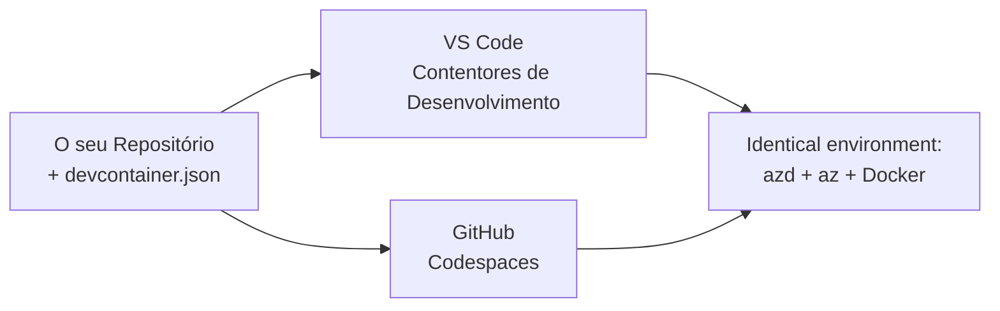

# Contentores de Desenvolvimento & GitHub Codespaces para azd

**Navegação pelo Capítulo:**
- **📚 Início do Curso**: [AZD Para Iniciantes](../../README.md)
- **📖 Capítulo Atual**: Capítulo 1 - Fundamentos & Início Rápido
- **⬅️ Anterior**: [Traga a Sua Própria App](bring-your-own-app.md)
- **🚀 Próximo Capítulo**: [Capítulo 2: Desenvolvimento AI-First](../chapter-02-ai-development/README.md)

> Validado contra `azd 1.27.1` em Julho de 2026.

## Introdução

Instalar o azd, o runtime da linguagem correta, Docker e a CLI do Azure em cada máquina é uma tarefa trabalhosa — e é a razão número um pela qual um tutorial que "funciona na minha máquina" falha para outra pessoa. Um **contentor de desenvolvimento** resolve isto ao descrever toda a sua cadeia de ferramentas num ficheiro. Qualquer pessoa que abra o projeto no VS Code ou no GitHub Codespaces obtém exatamente o mesmo ambiente, com o azd já instalado. Esta lição mostra-lhe como adicionar um.

## Objetivos de Aprendizagem

Ao final desta lição, você irá:
- Compreender o que é um contentor de desenvolvimento e porque ajuda com o azd
- Adicionar um `.devcontainer/devcontainer.json` minimalista a um projeto
- Incluir azd, a CLI do Azure e Docker via *features* do Contentor de Desenvolvimento
- Abrir o projeto no GitHub Codespaces ou no VS Code

## Resultados da Aprendizagem

Depois de completar esta lição, você será capaz de:
- Criar um `devcontainer.json` para um projeto azd
- Adicionar azd e ferramentas do Azure sem instalações manuais
- Executar `azd up` dentro de um contentor ou Codespace

---

## O Que é um Contentor de Desenvolvimento?

Um contentor de desenvolvimento é um ambiente de desenvolvimento baseado em Docker definido por um ficheiro `.devcontainer/devcontainer.json` no seu repositório. Quando abre o projeto:

- **VS Code** (com a extensão Dev Containers) constrói o contentor e liga-se a ele.
- **GitHub Codespaces** constrói o mesmo contentor na cloud e dá-lhe um editor baseado no navegador.

De qualquer forma, cada colaborador obtém ferramentas idênticas—sem ter que perguntar "instalaste o azd?" para resolver problemas.



---

## Passo 1: Criar o Ficheiro devcontainer

Crie `.devcontainer/devcontainer.json` na raiz do seu projeto:

```json
{
  "name": "azd-project",
  "image": "mcr.microsoft.com/devcontainers/base:bookworm",
  "features": {
    "ghcr.io/devcontainers/features/azure-cli:1": {},
    "ghcr.io/azure/azure-dev/azd:latest": {},
    "ghcr.io/devcontainers/features/docker-in-docker:2": {},
    "ghcr.io/devcontainers/features/node:1": {}
  },
  "customizations": {
    "vscode": {
      "extensions": [
        "ms-azuretools.azure-dev",
        "ms-azuretools.vscode-bicep"
      ]
    }
  },
  "forwardPorts": [3000],
  "postCreateCommand": "azd version"
}
```

O que cada parte faz:

| Chave | Propósito |
|-----|---------|
| `image` | O SO base para o contentor |
| `features` | Instaladores pré-construídos — aqui: CLI do Azure, **azd**, Docker e Node.js |
| `customizations.vscode.extensions` | Instala automaticamente as extensões azd e Bicep para VS Code |
| `forwardPorts` | Expõe a porta da sua app para o seu navegador |
| `postCreateCommand` | Executa uma vez após o contentor ser construído (aqui, um teste de sanidade) |

> A *feature* `ghcr.io/azure/azure-dev/azd:latest` é a forma oficial de obter azd num contentor. Fixe uma versão específica (por exemplo `azd:1.27.1`) se precisar de reprodutibilidade.

---

## Passo 2: Combine a Feature com a Linguagem da Sua App

Troque a *feature* `node` pela que a sua app utiliza:

```jsonc
// Python project
"ghcr.io/devcontainers/features/python:1": {},

// .NET project
"ghcr.io/devcontainers/features/dotnet:2": {},

// Java project
"ghcr.io/devcontainers/features/java:1": {},

// Go project
"ghcr.io/devcontainers/features/go:1": {}
```

Mantenha `docker-in-docker` se o seu `host` for `containerapp`, `aks`, ou qualquer coisa que construa imagens de contentor — o azd precisa do Docker para construir e enviar imagens.

---

## Passo 3: Abra-o

**No VS Code:**
1. Instale a extensão **Dev Containers**.
2. Abra a pasta do projeto.
3. Clique em **Reabrir no Contentor** quando solicitado (ou execute *Dev Containers: Reopen in Container*).

**No GitHub Codespaces:**
1. Faça push do repositório para o GitHub.
2. Clique em **Code → Codespaces → Create codespace on main**.
3. Aguarde o contentor construir — azd estará pronto no terminal.

---

## Passo 4: Deploy de Dentro do Contentor

O contentor tem azd pré-instalado, por isso o fluxo normal funciona sem problemas:

```bash
azd auth login --use-device-code   # código do dispositivo é útil dentro dos Codespaces
azd up
```

> **Porque `--use-device-code`?** Numa contentor remoto ou Codespace não há navegador local para redirecionar, por isso o login por código de dispositivo é o método fiável. Vai colar um código numa aba do navegador para concluir o login.

---

## Armadilhas Comuns

| Armadilha | Correção |
|---------|----------|
| `azd up` não consegue construir uma imagem | Adicione a *feature* `docker-in-docker` |
| Login no browser bloqueia em Codespaces | Use `azd auth login --use-device-code` |
| Ferramentas diferentes entre colegas | Fixe versões das *features* (ex. `azd:1.27.1`) |
| App não acessível no navegador | Adicione a porta a `forwardPorts` |

---

## Resumo

- Um contentor de desenvolvimento torna a sua cadeia de ferramentas azd reprodutível para todos.
- Adicione azd, a CLI do Azure e Docker através de *features* de Contentor de Desenvolvimento.
- Combine a *feature* da linguagem com a sua app e mantenha `docker-in-docker` para hosts de contentor.
- Use login por código de dispositivo quando a executar dentro de Codespaces.

---

## 🔗 Navegação

| Direção | Recurso |
|-------|--------|
| **Anterior** | [Traga a Sua Própria App](bring-your-own-app.md) |
| **Início do Capítulo** | [Capítulo 1: Fundamentos & Início Rápido](README.md) |
| **Próximo Capítulo** | [Capítulo 2: Desenvolvimento AI-First](../chapter-02-ai-development/README.md) |

## 📖 Recursos Relacionados

- [Instalação & Configuração](installation.md)
- [Folha de Consulta de Comandos](../../resources/cheat-sheet.md)
- [Especificação Oficial de Contentores de Desenvolvimento](https://containers.dev/)
- [*Feature* de Contentor de Desenvolvimento azd](https://github.com/Azure/azure-dev/tree/main/ext/devcontainer)

---

<!-- CO-OP TRANSLATOR DISCLAIMER START -->
**Aviso Legal**:
Este documento foi traduzido utilizando o serviço de tradução automática [Co-op Translator](https://github.com/Azure/co-op-translator). Embora nos esforcemos pela precisão, esteja ciente de que traduções automáticas podem conter erros ou imprecisões. O documento original na sua língua nativa deve ser considerado a fonte autorizada. Para informações críticas, recomenda-se tradução profissional humana. Não nos responsabilizamos por quaisquer mal-entendidos ou interpretações incorretas resultantes da utilização desta tradução.
<!-- CO-OP TRANSLATOR DISCLAIMER END -->