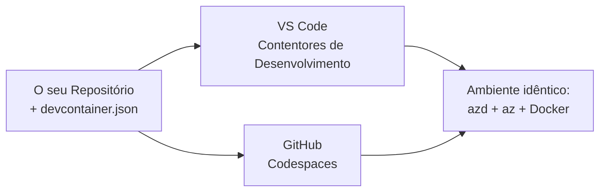

# Dev Containers & GitHub Codespaces para azd

**Chapter Navigation:**
- **📚 Course Home**: [AZD para Iniciantes](../../README.md)
- **📖 Current Chapter**: Capítulo 1 - Fundamentos & Início Rápido
- **⬅️ Previous**: [Traga a Sua Própria Aplicação](bring-your-own-app.md)
- **🚀 Next Chapter**: [Capítulo 2: Desenvolvimento com Foco em IA](../chapter-02-ai-development/README.md)

> Validado com `azd 1.25.6` em junho de 2026.

## Introduction

Instalar o azd, o runtime da linguagem apropriado, o Docker e o Azure CLI em cada máquina é um incómodo — e é a principal razão pela qual um tutorial que "funciona na minha máquina" falha para outra pessoa. Um **dev container** resolve isto descrevendo toda a sua cadeia de ferramentas num ficheiro. Qualquer pessoa que abra o projeto no VS Code ou no GitHub Codespaces obtém exactamente o mesmo ambiente, com o azd já instalado. Esta lição mostra-lhe como adicionar um.

## Learning Goals

No final desta lição, você irá:
- Compreender o que é um dev container e por que ajuda com o azd
- Adicionar um mínimo `.devcontainer/devcontainer.json` a um projeto
- Incluir o azd, o Azure CLI e o Docker através de *funcionalidades* do Dev Container
- Abrir o projeto no GitHub Codespaces ou no VS Code

## Learning Outcomes

Após completar esta lição, você será capaz de:
- Criar um `devcontainer.json` para um projeto azd
- Adicionar o azd e as ferramentas Azure sem instalações manuais
- Executar `azd up` a partir de dentro de um contentor ou Codespace

---

## What Is a Dev Container?

Um dev container é um ambiente de desenvolvimento baseado em Docker definido por um ficheiro `.devcontainer/devcontainer.json` no seu repositório. Quando abre o projeto:

- **VS Code** (com a extensão Dev Containers) constrói o contentor e liga-se a ele.
- **GitHub Codespaces** constrói o mesmo contentor na cloud e dá-lhe um editor baseado no navegador.

De qualquer das maneiras, todos os contribuidores obtêm ferramentas idênticas — sem o problema "instalaste o azd?".



---

## Step 1: Create the devcontainer File

Crie `.devcontainer/devcontainer.json` na raiz do seu projeto:

```json
{
  "name": "azd-project",
  "image": "mcr.microsoft.com/devcontainers/base:bookworm",
  "features": {
    "ghcr.io/devcontainers/features/azure-cli:1": {},
    "ghcr.io/azure/azure-dev/azd:latest": {},
    "ghcr.io/devcontainers/features/docker-in-docker:2": {},
    "ghcr.io/devcontainers/features/node:1": {}
  },
  "customizations": {
    "vscode": {
      "extensions": [
        "ms-azuretools.azure-dev",
        "ms-azuretools.vscode-bicep"
      ]
    }
  },
  "forwardPorts": [3000],
  "postCreateCommand": "azd version"
}
```

What each part does:

| Key | Purpose |
|-----|---------|
| `image` | O sistema operativo base para o contentor |
| `features` | Instaladores pré-construídos — aqui: Azure CLI, **azd**, Docker e Node.js |
| `customizations.vscode.extensions` | Instala automaticamente as extensões azd e Bicep para o VS Code |
| `forwardPorts` | Expõe a porta da sua app ao seu navegador |
| `postCreateCommand` | Executa uma vez após o contentor ser construído (aqui, uma verificação de sanidade) |

> A funcionalidade `ghcr.io/azure/azure-dev/azd:latest` é a forma oficial de obter o azd num contentor. Fixe uma versão específica (por exemplo `azd:1.25.6`) se precisar de reprodutibilidade.

---

## Step 2: Match the Feature to Your App's Language

Substitua a funcionalidade `node` pela que a sua app utilizar:

```jsonc
// Python project
"ghcr.io/devcontainers/features/python:1": {},

// .NET project
"ghcr.io/devcontainers/features/dotnet:2": {},

// Java project
"ghcr.io/devcontainers/features/java:1": {},

// Go project
"ghcr.io/devcontainers/features/go:1": {}
```

Mantenha `docker-in-docker` se o seu `host` for `containerapp`, `aks`, ou qualquer coisa que construa uma imagem de contentor — o azd precisa do Docker para construir e enviar imagens.

---

## Step 3: Open It

**In VS Code:**
1. Instale a extensão **Dev Containers**.
2. Abra a pasta do projeto.
3. Clique em **Reopen in Container** quando solicitado (ou execute *Dev Containers: Reopen in Container*).

**In GitHub Codespaces:**
1. Faça push do repositório para o GitHub.
2. Clique em **Code → Codespaces → Create codespace on main**.
3. Aguarde que o contentor seja construído — o azd estará pronto no terminal.

---

## Step 4: Deploy From Inside the Container

O contentor tem o azd pré-instalado, por isso o fluxo de trabalho normal funciona normalmente:

```bash
azd auth login --use-device-code   # o código do dispositivo é útil dentro do Codespaces
azd up
```

> **Por que `--use-device-code`?** Num contentor remoto ou Codespace não existe um navegador local para redireccionar, por isso o login por device-code é a via fiável. Irá colar um código numa aba do navegador para completar a autenticação.

---

## Common Pitfalls

| Pitfall | Fix |
|---------|-----|
| `azd up` can't build an image | Adicione a funcionalidade `docker-in-docker` |
| Browser login hangs in Codespaces | Use `azd auth login --use-device-code` |
| Tools differ between teammates | Fixe versões das funcionalidades (ex.: `azd:1.25.6`) |
| App not reachable in browser | Adicione a porta a `forwardPorts` |

---

## Summary

- Um dev container torna a sua cadeia de ferramentas azd reproduzível para todos.
- Adicione azd, o Azure CLI e o Docker através de *funcionalidades* do Dev Container.
- Ajuste a funcionalidade da linguagem à sua app e mantenha `docker-in-docker` para hosts de contentores.
- Use o login por device-code quando estiver a executar dentro de Codespaces.

---

## 🔗 Navigation

| Direction | Resource |
|-----------|----------|
| **Previous** | [Traga a Sua Própria Aplicação](bring-your-own-app.md) |
| **Chapter Home** | [Capítulo 1: Fundamentos & Início Rápido](README.md) |
| **Next Chapter** | [Capítulo 2: Desenvolvimento com Foco em IA](../chapter-02-ai-development/README.md) |

## 📖 Related Resources

- [Instalação & Configuração](installation.md)
- [Ficha de referência de comandos](../../resources/cheat-sheet.md)
- [Especificação oficial dos Dev Containers](https://containers.dev/)
- [Funcionalidade Dev Container do azd](https://github.com/Azure/azure-dev/tree/main/ext/devcontainer)

---

<!-- CO-OP TRANSLATOR DISCLAIMER START -->
**Aviso Legal**:
Este documento foi traduzido utilizando o serviço de tradução automática [Co-op Translator](https://github.com/Azure/co-op-translator). Embora nos esforcemos pela precisão, esteja ciente de que traduções automáticas podem conter erros ou imprecisões. O documento original na sua língua nativa deve ser considerado a fonte autorizada. Para informações críticas, recomenda-se tradução profissional humana. Não nos responsabilizamos por quaisquer mal-entendidos ou interpretações incorretas resultantes da utilização desta tradução.
<!-- CO-OP TRANSLATOR DISCLAIMER END -->