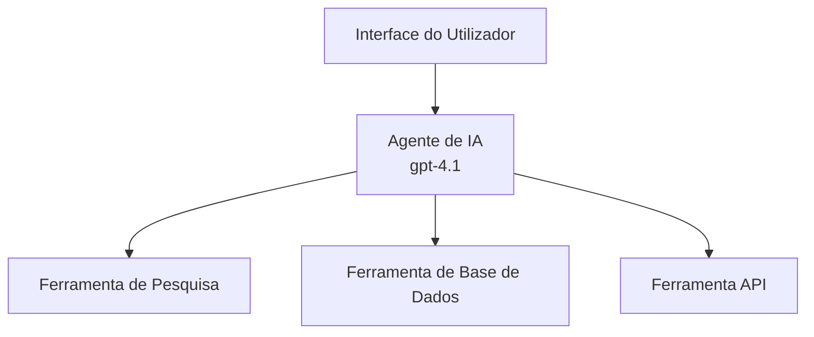
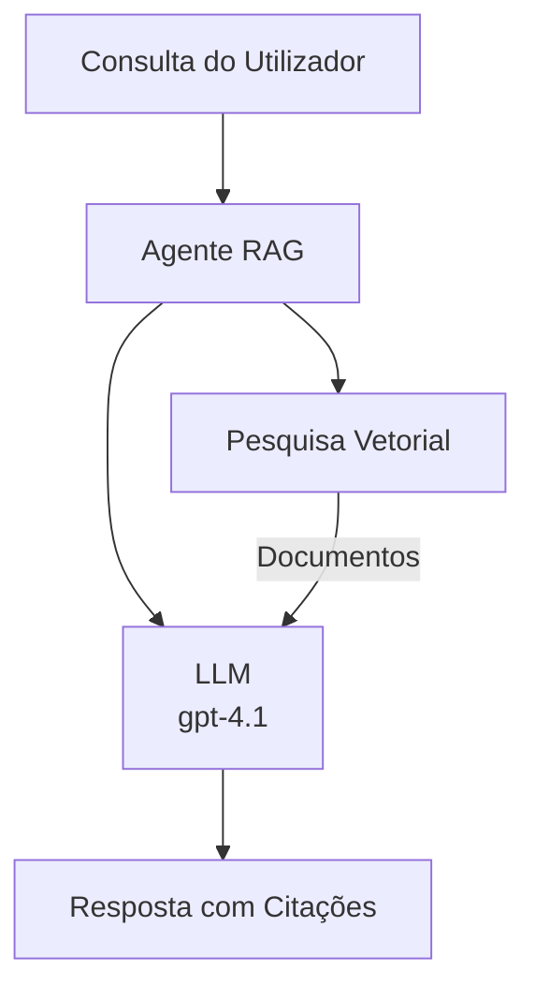
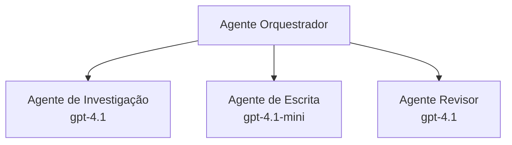

# Agentes de IA com Azure Developer CLI

**Navegação do Capítulo:**
- **📚 Início do Curso**: [AZD Para Iniciantes](../../README.md)
- **📖 Capítulo Atual**: Capítulo 2 - Desenvolvimento AI-First
- **⬅️ Anterior**: [Integração Microsoft Foundry](microsoft-foundry-integration.md)
- **➡️ Seguinte**: [Deploy de Modelo de IA](ai-model-deployment.md)
- **🚀 Avançado**: [Soluções Multi-Agente](../../examples/retail-scenario.md)

---

## Introdução

Agentes de IA são programas autónomos que podem perceber o ambiente, tomar decisões e executar ações para alcançar objetivos específicos. Ao contrário de chatbots simples que respondem a comandos, os agentes podem:

- **Usar ferramentas** - Chamar APIs, pesquisar bases de dados, executar código
- **Planear e raciocinar** - Dividir tarefas complexas em passos
- **Aprender com o contexto** - Manter memória e adaptar comportamento
- **Colaborar** - Trabalhar com outros agentes (sistemas multi-agente)

Este guia mostra como implementar agentes de IA no Azure usando o Azure Developer CLI (azd).

> **Nota de validação (2026-03-25):** Este guia foi revisto com `azd` `1.23.12` e `azure.ai.agents` `0.1.18-preview`. A experiência `azd ai` ainda está em pré-visualização, por isso verifique a ajuda de extensão se os seus flags instalados forem diferentes.

## Objetivos de Aprendizagem

Ao concluir este guia, irá:
- Compreender o que são agentes de IA e como diferem dos chatbots
- Implementar templates de agentes de IA pré-construídos usando AZD
- Configurar Foundry Agents para agentes personalizados
- Implementar padrões básicos de agentes (uso de ferramentas, RAG, multi-agente)
- Monitorizar e depurar agentes implementados

## Resultados de Aprendizagem

Após a conclusão, será capaz de:
- Implementar aplicações de agentes de IA no Azure com um único comando
- Configurar ferramentas e capacidades do agente
- Implementar geração aumentada por recuperação (RAG) com agentes
- Projetar arquiteturas multi-agente para fluxos de trabalho complexos
- Resolver problemas comuns de implementação de agentes

---

## 🤖 O Que Torna um Agente Diferente de um Chatbot?

| Característica | Chatbot | Agente de IA |
|---------|---------|----------|
| **Comportamento** | Responde a comandos | Toma ações autónomas |
| **Ferramentas** | Nenhuma | Pode chamar APIs, pesquisar, executar código |
| **Memória** | Apenas por sessão | Memória persistente entre sessões |
| **Planeamento** | Resposta única | Raciocínio em vários passos |
| **Colaboração** | Entidade única | Pode trabalhar com outros agentes |

### Analogia Simples

- **Chatbot** = Uma pessoa prestável a responder perguntas numa mesa de informação
- **Agente de IA** = Um assistente pessoal que pode fazer chamadas, marcar compromissos e completar tarefas por si

---

## 🚀 Início Rápido: Implemente o Seu Primeiro Agente

### Opção 1: Template Foundry Agents (Recomendado)

```bash
# Inicializar o modelo de agentes de IA
azd init --template get-started-with-ai-agents

# Implementar no Azure
azd up
```

**O que é implementado:**
- ✅ Foundry Agents
- ✅ Microsoft Foundry Models (gpt-4.1)
- ✅ Azure AI Search (para RAG)
- ✅ Azure Container Apps (interface web)
- ✅ Application Insights (monitorização)

**Tempo:** ~15-20 minutos  
**Custo:** ~$100-150/mês (desenvolvimento)

### Opção 2: Agente OpenAI com Prompty

```bash
# Inicializar o modelo de agente baseado no Prompty
azd init --template agent-openai-python-prompty

# Implantar no Azure
azd up
```

**O que é implementado:**
- ✅ Azure Functions (execução serverless do agente)
- ✅ Microsoft Foundry Models
- ✅ Ficheiros de configuração Prompty
- ✅ Implementação de agente de exemplo

**Tempo:** ~10-15 minutos  
**Custo:** ~$50-100/mês (desenvolvimento)

### Opção 3: Agente Chat RAG

```bash
# Inicializar modelo de chat RAG
azd init --template azure-search-openai-demo

# Implementar no Azure
azd up
```

**O que é implementado:**
- ✅ Microsoft Foundry Models
- ✅ Azure AI Search com dados de exemplo
- ✅ Pipeline de processamento de documentos
- ✅ Interface de chat com citações

**Tempo:** ~15-25 minutos  
**Custo:** ~$80-150/mês (desenvolvimento)

### Opção 4: AZD AI Agent Init (pré-visualização baseada em Manifesto ou Template)

Se tiver um ficheiro manifesto de agente, pode usar o comando `azd ai` para gerar diretamente um projeto Foundry Agent Service. Lançamentos recentes de pré-visualização também adicionaram suporte à inicialização por templates, portanto o fluxo do prompt pode variar ligeiramente dependendo da versão instalada da extensão.

```bash
# Instalar a extensão de agentes de IA
azd extension install azure.ai.agents

# Opcional: verificar a versão de pré-visualização instalada
azd extension show azure.ai.agents

# Inicializar a partir de um manifesto de agente
azd ai agent init -m agent-manifest.yaml

# Implantar no Azure
azd up
```

**Quando usar `azd ai agent init` vs `azd init --template`:**

| Abordagem | Mais Indicado Para | Como Funciona |
|----------|----------|------|
| `azd init --template` | Começar a partir de uma app de exemplo funcional | Clona um repositório completo com código + infraestrutura |
| `azd ai agent init -m` | Construir a partir do seu próprio manifesto de agente | Gera estrutura do projeto a partir da definição do seu agente |

> **Dica:** Use `azd init --template` para aprendizagem (Opções 1-3 acima). Use `azd ai agent init` para construir agentes de produção com os seus próprios manifestos. Veja [Comandos e extensões AZD AI](../chapter-08-production/production-ai-practices.md#azd-ai-cli-commands-and-extensions) para referência completa.

---

## 🏗️ Padrões de Arquitetura de Agentes

### Padrão 1: Agente Único com Ferramentas

O padrão mais simples - um agente que pode usar múltiplas ferramentas.


**Melhor para:**
- Bots de suporte ao cliente
- Assistentes de investigação
- Agentes de análise de dados

**Template AZD:** `azure-search-openai-demo`

### Padrão 2: Agente RAG (Geração Aumentada pela Recuperação)

Um agente que recupera documentos relevantes antes de gerar respostas.


**Melhor para:**
- Bases de conhecimento empresariais
- Sistemas de Q&A documental
- Investigação de conformidade e legal

**Template AZD:** `azure-search-openai-demo`

### Padrão 3: Sistema Multi-Agente

Vários agentes especializados a trabalhar juntos em tarefas complexas.


**Melhor para:**
- Geração complexa de conteúdos
- Workflows em vários passos
- Tarefas que requerem diferentes especializações

**Saiba Mais:** [Padrões de Coordenação Multi-Agente](../chapter-06-pre-deployment/coordination-patterns.md)

---

## ⚙️ Configurar Ferramentas para Agentes

Os agentes ficam poderosos ao poderem usar ferramentas. Aqui está como configurar ferramentas comuns:

### Configuração de Ferramentas em Foundry Agents

```python
# agent_config.py
from azure.ai.projects import AIProjectClient
from azure.ai.projects.models import FunctionTool, CodeInterpreterTool

# Definir ferramentas personalizadas
search_tool = FunctionTool(
    name="search_knowledge_base",
    description="Search the company knowledge base for relevant documents",
    parameters={
        "type": "object",
        "properties": {
            "query": {
                "type": "string",
                "description": "The search query"
            }
        },
        "required": ["query"]
    }
)

# Criar agente com ferramentas
agent = project_client.agents.create_agent(
    model="gpt-4.1",
    name="Support Agent",
    instructions="You are a helpful support agent. Use the search tool to find relevant information.",
    tools=[search_tool, CodeInterpreterTool()]
)
```

### Configuração do Ambiente

```bash
# Definir variáveis de ambiente específicas do agente
azd env set AZURE_OPENAI_MODEL "gpt-4.1"
azd env set AGENT_INSTRUCTIONS "You are a helpful assistant..."
azd env set ENABLE_CODE_INTERPRETER "true"
azd env set ENABLE_FILE_SEARCH "true"

# Implantar com configuração atualizada
azd deploy
```

---

## 📊 Monitorização de Agentes

### Integração com Application Insights

Todos os templates AZD de agente incluem Application Insights para monitorização:

```bash
# Abrir painel de monitorização
azd monitor --overview

# Ver logs em tempo real
azd monitor --logs

# Ver métricas em tempo real
azd monitor --live
```

### Métricas Principais para Acompanhar

| Métrica | Descrição | Objetivo |
|--------|-------------|--------|
| Latência de Resposta | Tempo para gerar resposta | < 5 segundos |
| Uso de Tokens | Tokens por pedido | Monitorizar custo |
| Taxa de Sucesso em Chamadas a Ferramentas | % de execuções de ferramentas bem sucedidas | > 95% |
| Taxa de Erro | Pedidos ao agente falhados | < 1% |
| Satisfação do Utilizador | Pontuações de feedback | > 4.0/5.0 |

### Registos Personalizados para Agentes

```python
import os
from azure.monitor.opentelemetry import configure_azure_monitor
from opentelemetry import trace

# Configure o Azure Monitor com OpenTelemetry
configure_azure_monitor(
    connection_string=os.environ["APPLICATIONINSIGHTS_CONNECTION_STRING"]
)

tracer = trace.get_tracer(__name__)

def log_agent_interaction(user_query, agent_response, tools_used, latency_ms):
    with tracer.start_as_current_span("agent_interaction") as span:
        span.set_attributes({
            "user_query": user_query,
            "response_length": len(agent_response),
            "tools_used": tools_used,
            "latency_ms": latency_ms
        })
```

> **Nota:** Instale os pacotes necessários: `pip install azure-monitor-opentelemetry opentelemetry`

---

## 💰 Considerações de Custo

### Custos Mensais Estimados por Padrão

| Padrão | Ambiente de Desenvolvimento | Produção |
|---------|-----------------|------------|
| Agente Único | $50-100 | $200-500 |
| Agente RAG | $80-150 | $300-800 |
| Multi-Agente (2-3 agentes) | $150-300 | $500-1,500 |
| Multi-Agente Empresarial | $300-500 | $1,500-5,000+ |

### Dicas de Otimização de Custos

1. **Use gpt-4.1-mini para tarefas simples**  
   ```bash
   azd env set AZURE_OPENAI_MODEL "gpt-4.1-mini"
   ```

2. **Implemente cache para consultas repetidas**  
   ```python
   from functools import lru_cache
   
   @lru_cache(maxsize=1000)
   def get_cached_response(query_hash):
       return agent.run(query_hash)
   ```

3. **Defina limites de tokens por execução**  
   ```python
   # Definir max_completion_tokens ao executar o agente, não durante a criação
   run = project_client.agents.create_run(
       thread_id=thread.id,
       agent_id=agent.id,
       max_completion_tokens=1000  # Limitar o comprimento da resposta
   )
   ```

4. **Escale para zero quando não estiver em uso**  
   ```bash
   # As Container Apps escalam automaticamente até zero
   azd env set MIN_REPLICAS "0"
   ```

---

## 🔧 Resolução de Problemas com Agentes

### Problemas Comuns e Soluções

<details>
<summary><strong>❌ Agente não responde a chamadas de ferramentas</strong></summary>

```bash
# Verificar se as ferramentas estão devidamente registadas
azd show

# Verificar implementação OpenAI
az cognitiveservices account deployment list \
  --name $AZURE_OPENAI_NAME \
  --resource-group $RG_NAME

# Verificar registos do agente
azd monitor --logs
```

**Causas comuns:**
- Assinatura da função da ferramenta incompatível
- Permissões necessárias em falta
- Endpoint da API inacessível
</details>

<details>
<summary><strong>❌ Alta latência nas respostas do agente</strong></summary>

```bash
# Verificar o Application Insights para gargalos
azd monitor --live

# Considerar a utilização de um modelo mais rápido
azd env set AZURE_OPENAI_MODEL "gpt-4.1-mini"
azd deploy
```

**Dicas de otimização:**
- Use respostas em streaming
- Implemente cache de respostas
- Reduza o tamanho da janela de contexto
</details>

<details>
<summary><strong>❌ Agente retorna informação incorreta ou alucinada</strong></summary>

```python
# Melhorar com prompts de sistema melhores
instructions = """
You are a helpful assistant. IMPORTANT:
- Only answer based on provided context
- If you don't know, say "I don't know"
- Always cite your sources
- Never make up information
"""

# Adicionar recuperação para fundamentação
agent = project_client.agents.create_agent(
    model="gpt-4.1",
    instructions=instructions,
    tools=[FileSearchTool()]  # Fundamentar respostas em documentos
)
```
</details>

<details>
<summary><strong>❌ Erros de limite de tokens excedido</strong></summary>

```python
# Implementar gestão da janela de contexto
def truncate_context(messages, max_tokens=8000, model="gpt-4.1"):
    """Keep only recent messages within token limit."""
    import tiktoken
    encoding = tiktoken.encoding_for_model(model)
    total_tokens = 0
    truncated = []
    
    for msg in reversed(messages):
        msg_tokens = len(encoding.encode(msg.content))
        if total_tokens + msg_tokens > max_tokens:
            break
        truncated.insert(0, msg)
        total_tokens += msg_tokens
    
    return truncated
```
</details>

---

## 🎓 Exercícios Práticos

### Exercício 1: Implementar um Agente Básico (20 minutos)

**Objetivo:** Implementar o seu primeiro agente de IA usando AZD

```bash
# Passo 1: Inicializar template
azd init --template get-started-with-ai-agents

# Passo 2: Iniciar sessão no Azure
azd auth login
# Se trabalhar entre inquilinos, adicione --tenant-id <tenant-id>

# Passo 3: Implantar
azd up

# Passo 4: Testar o agente
# Saída esperada após a implantação:
#   Implantação concluída!
#   Endpoint: https://<app-name>.<region>.azurecontainerapps.io
# Abra o URL mostrado na saída e tente fazer uma pergunta

# Passo 5: Ver monitorização
azd monitor --overview

# Passo 6: Limpar
azd down --force --purge
```

**Critérios de Sucesso:**
- [ ] Agente responde a perguntas
- [ ] Pode aceder ao painel de monitorização via `azd monitor`
- [ ] Recursos limpos com sucesso

### Exercício 2: Adicionar uma Ferramenta Personalizada (30 minutos)

**Objetivo:** Estender o agente com uma ferramenta personalizada

1. Implemente o template do agente:  
   ```bash
   azd init --template get-started-with-ai-agents
   azd up
   ```
2. Crie uma nova função de ferramenta no código do agente:  
   ```python
   def get_weather(location: str) -> str:
       """Get current weather for a location."""
       # Chamada API para o serviço meteorológico
       return f"Weather in {location}: Sunny, 72°F"
   ```
3. Registe a ferramenta com o agente:  
   ```python
   from azure.ai.projects.models import FunctionTool

   weather_tool = FunctionTool(
       name="get_weather",
       description="Get current weather for a location",
       parameters={
           "type": "object",
           "properties": {
               "location": {"type": "string", "description": "City name"}
           },
           "required": ["location"]
       }
   )

   agent = project_client.agents.create_agent(
       model="gpt-4.1",
       name="Weather Agent",
       tools=[weather_tool]
   )
   ```
4. Reimplemente e teste:  
   ```bash
   azd deploy
   # Perguntar: "Qual é o tempo em Seattle?"
   # Esperado: O agente chama get_weather("Seattle") e retorna a informação do tempo
   ```

**Critérios de Sucesso:**
- [ ] Agente reconhece consultas relacionadas com o tempo
- [ ] Ferramenta é chamada corretamente
- [ ] Resposta inclui informação meteorológica

### Exercício 3: Construir um Agente RAG (45 minutos)

**Objetivo:** Criar um agente que responde a perguntas com base nos seus documentos

```bash
# Passo 1: Implementar o template RAG
azd init --template azure-search-openai-demo
azd up

# Passo 2: Carregar os seus documentos
# Coloque ficheiros PDF/TXT na diretoria data/, depois execute:
python scripts/prepdocs.py

# Passo 3: Testar com perguntas específicas do domínio
# Abra o URL da aplicação web a partir da saída do azd up
# Faça perguntas sobre os seus documentos carregados
# As respostas devem incluir referências de citação como [doc.pdf]
```

**Critérios de Sucesso:**
- [ ] Agente responde a partir dos documentos carregados
- [ ] Respostas incluem citações
- [ ] Sem alucinações em perguntas fora do âmbito

---

## 📚 Próximos Passos

Agora que compreende os agentes de IA, explore estes tópicos avançados:

| Tópico | Descrição | Link |
|-------|-------------|------|
| **Sistemas Multi-Agente** | Construir sistemas com múltiplos agentes a colaborar | [Exemplo Multi-Agente Retail](../../examples/retail-scenario.md) |
| **Padrões de Coordenação** | Aprender padrões de orquestração e comunicação | [Padrões de Coordenação](../chapter-06-pre-deployment/coordination-patterns.md) |
| **Deploy de Produção** | Implementação empresarial pronta para produção | [Práticas AI de Produção](../chapter-08-production/production-ai-practices.md) |
| **Avaliação de Agentes** | Testar e avaliar desempenho de agentes | [Resolução de Problemas AI](../chapter-07-troubleshooting/ai-troubleshooting.md) |
| **Laboratório Workshop AI** | Prático: Prepare sua solução AI para AZD | [Laboratório Workshop AI](ai-workshop-lab.md) |

---

## 📖 Recursos Adicionais

### Documentação Oficial
- [Azure AI Agent Service](https://learn.microsoft.com/azure/ai-services/agents/)
- [Azure AI Foundry Agent Service Quickstart](https://learn.microsoft.com/azure/ai-services/agents/quickstart)
- [Semantic Kernel Agent Framework](https://learn.microsoft.com/semantic-kernel/)

### Templates AZD para Agentes
- [Começar com Agentes de IA](https://github.com/Azure-Samples/get-started-with-ai-agents)
- [Agent OpenAI Python Prompty](https://github.com/Azure-Samples/agent-openai-python-prompty)
- [Azure Search OpenAI Demo](https://github.com/Azure-Samples/azure-search-openai-demo)

### Recursos da Comunidade
- [Awesome AZD - Templates de Agentes](https://azure.github.io/awesome-azd/?tags=ai-agents)
- [Azure AI Discord](https://discord.gg/microsoft-azure)
- [Microsoft Foundry Discord](https://discord.gg/nTYy5BXMWG)

### Skills de Agentes para o Seu Editor
- [**Microsoft Azure Agent Skills**](https://skills.sh/microsoft/github-copilot-for-azure) - Instale skills reutilizáveis para desenvolvimento de agentes de IA para Azure no GitHub Copilot, Cursor ou qualquer agente suportado. Inclui skills para [Azure AI](https://skills.sh/microsoft/github-copilot-for-azure/azure-ai), [Microsoft Foundry](https://skills.sh/microsoft/github-copilot-for-azure/microsoft-foundry), [deploy](https://skills.sh/microsoft/github-copilot-for-azure/azure-deploy), e [diagnóstico](https://skills.sh/microsoft/github-copilot-for-azure/azure-diagnostics):  
  ```bash
  npx skills add microsoft/github-copilot-for-azure
  ```

---

**Navegação**
- **Lição Anterior**: [Integração Microsoft Foundry](microsoft-foundry-integration.md)
- **Lição Seguinte**: [Deploy de Modelo de IA](ai-model-deployment.md)

---

<!-- CO-OP TRANSLATOR DISCLAIMER START -->
**Aviso Legal**:  
Este documento foi traduzido utilizando o serviço de tradução por IA [Co-op Translator](https://github.com/Azure/co-op-translator). Embora nos esforcemos para garantir a precisão, esteja ciente de que traduções automáticas podem conter erros ou imprecisões. O documento original, no seu idioma nativo, deverá ser considerado a fonte oficial. Para informações críticas, recomenda-se a tradução profissional por um humano. Não nos responsabilizamos por quaisquer mal-entendidos ou interpretações erradas decorrentes do uso desta tradução.
<!-- CO-OP TRANSLATOR DISCLAIMER END -->