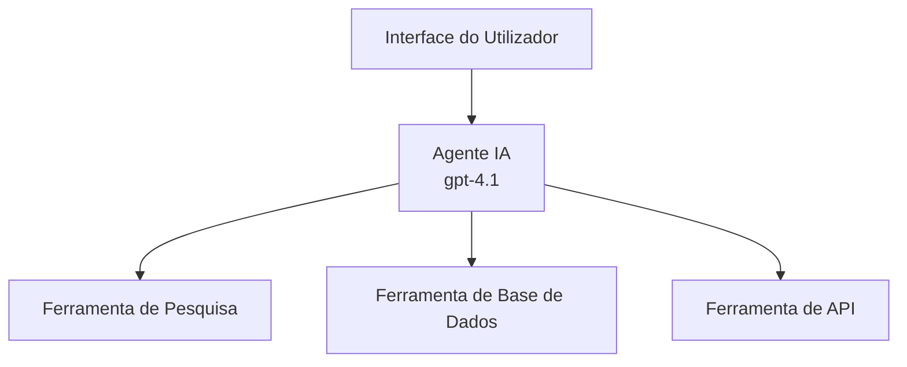
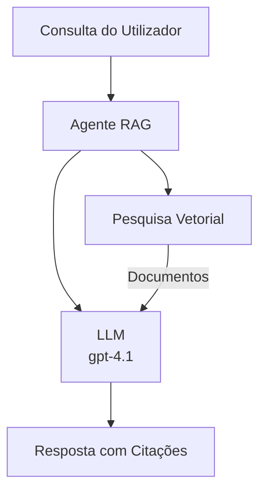

# Agentes de IA com Azure Developer CLI

**Navegação do Capítulo:**
- **📚 Início do Curso**: [AZD Para Iniciantes](../../README.md)
- **📖 Capítulo Atual**: Capítulo 2 - Desenvolvimento AI-First
- **⬅️ Anterior**: [Integração Microsoft Foundry](microsoft-foundry-integration.md)
- **➡️ Seguinte**: [Desdobramento de Modelo de IA](ai-model-deployment.md)
- **🚀 Avançado**: [Soluções Multi-Agente](../../examples/retail-scenario.md)

---

## Introdução

Agentes de IA são programas autónomos que podem perceber o seu ambiente, tomar decisões e agir para alcançar objetivos específicos. Ao contrário de chatbots simples que respondem a prompts, os agentes podem:

- **Usar ferramentas** - Chamar APIs, pesquisar bases de dados, executar código
- **Planear e raciocinar** - Dividir tarefas complexas em etapas
- **Aprender com o contexto** - Manter memória e adaptar comportamento
- **Colaborar** - Trabalhar com outros agentes (sistemas multi-agente)

Este guia mostra-lhe como desdobrar agentes de IA no Azure usando Azure Developer CLI (azd).

> **Nota de validação (2026-03-25):** Este guia foi revisto contra `azd` `1.23.12` e `azure.ai.agents` `0.1.18-preview`. A experiência `azd ai` ainda está em fase de pré-visualização, por isso verifique a ajuda da extensão se os seus flags instalados forem diferentes.

## Objetivos de Aprendizagem

Ao completar este guia, você irá:
- Compreender o que são agentes de IA e como diferem de chatbots
- Desdobrar modelos pré-construídos de agentes de IA usando AZD
- Configurar Agentes Foundry para agentes personalizados
- Implementar padrões básicos de agentes (uso de ferramentas, RAG, multi-agente)
- Monitorizar e depurar agentes desdobrados

## Resultados de Aprendizagem

Ao concluir, será capaz de:
- Desdobrar aplicações de agentes de IA no Azure com um único comando
- Configurar ferramentas e capacidades de agentes
- Implementar geração aumentada por recuperação (RAG) com agentes
- Conceber arquiteturas multi-agente para fluxos de trabalho complexos
- Resolver problemas comuns de desdobramento de agentes

---

## 🤖 O Que Torna um Agente Diferente de um Chatbot?

| Característica | Chatbot | Agente de IA |
|---------|---------|----------|
| **Comportamento** | Responde a prompts | Toma ações autónomas |
| **Ferramentas** | Nenhuma | Pode chamar APIs, pesquisar, executar código |
| **Memória** | Apenas baseada na sessão | Memória persistente entre sessões |
| **Planeamento** | Resposta única | Raciocínio em múltiplas etapas |
| **Colaboração** | Entidade única | Pode trabalhar com outros agentes |

### Analogia Simples

- **Chatbot** = Uma pessoa prestável a responder perguntas num balcão de informação
- **Agente de IA** = Um assistente pessoal que pode fazer chamadas, marcar compromissos e completar tarefas para si

---

## 🚀 Início Rápido: Desdobre o Seu Primeiro Agente

### Opção 1: Modelo Foundry Agents (Recomendado)

```bash
# Inicializar o modelo de agentes de IA
azd init --template get-started-with-ai-agents

# Implementar no Azure
azd up
```

**O que é desdobrado:**
- ✅ Agentes Foundry
- ✅ Modelos Microsoft Foundry (gpt-4.1)
- ✅ Azure AI Search (para RAG)
- ✅ Azure Container Apps (interface web)
- ✅ Application Insights (monitorização)

**Tempo:** ~15-20 minutos  
**Custo:** ~$100-150/mês (desenvolvimento)

### Opção 2: Agente OpenAI com Prompty

```bash
# Inicializar o modelo de agente baseado em Prompty
azd init --template agent-openai-python-prompty

# Implantar no Azure
azd up
```

**O que é desdobrado:**
- ✅ Azure Functions (execução serverless do agente)
- ✅ Modelos Microsoft Foundry
- ✅ Ficheiros de configuração Prompty
- ✅ Implementação de agente de exemplo

**Tempo:** ~10-15 minutos  
**Custo:** ~$50-100/mês (desenvolvimento)

### Opção 3: Agente de Chat RAG

```bash
# Inicializar modelo de chat RAG
azd init --template azure-search-openai-demo

# Implementar na Azure
azd up
```

**O que é desdobrado:**
- ✅ Modelos Microsoft Foundry
- ✅ Azure AI Search com dados de exemplo
- ✅ Pipeline de processamento de documentos
- ✅ Interface de chat com citações

**Tempo:** ~15-25 minutos  
**Custo:** ~$80-150/mês (desenvolvimento)

### Opção 4: AZD AI Agent Init (Pré-visualização baseada em Manifesto ou Modelo)

Se tiver um ficheiro manifesto do agente, pode usar o comando `azd ai` para criar diretamente um projeto Foundry Agent Service. As versões recentes em pré-visualização adicionaram também suporte para inicialização baseada em modelos, pelo que o fluxo do prompt pode variar ligeiramente conforme a versão da extensão instalada.

```bash
# Instalar a extensão de agentes de IA
azd extension install azure.ai.agents

# Opcional: verificar a versão de pré-visualização instalada
azd extension show azure.ai.agents

# Iniciar a partir de um manifesto de agente
azd ai agent init -m agent-manifest.yaml

# Implantar no Azure
azd up

# Testar o agente implantado (mostra latência + tempo até ao primeiro byte)
azd ai agent invoke
```

**Quando usar `azd ai agent init` vs `azd init --template`:**

| Abordagem | Melhor Para | Como Funciona |
|----------|----------|------|
| `azd init --template` | Começar a partir de uma app de exemplo funcional | Clona um repositório completo de modelo com código + infra |
| `azd ai agent init -m` | Construir a partir do seu próprio manifesto de agente | Cria a estrutura do projeto a partir da definição do agente |

> **Dica:** Use `azd init --template` para aprender (Opções 1-3 acima). Use `azd ai agent init` para criar agentes de produção com os seus próprios manifestos.

Após `azd up`, a mesma extensão acompanha-o pelo resto do ciclo de vida do agente: `azd ai agent invoke` para testar, `azd ai agent eval generate` e `azd ai agent optimize` para medir e melhorar qualidade, e `azd ai agent delete` para limpar. Veja [Comandos AZD AI CLI](../chapter-08-production/production-ai-practices.md#azd-ai-cli-commands-and-extensions) para a referência completa.

---

## 🏗️ Padrões de Arquitectura de Agentes

### Padrão 1: Agente Único com Ferramentas

O padrão mais simples de agente - um agente que pode usar múltiplas ferramentas.



**Melhor para:**
- Bots de suporte ao cliente
- Assistentes de investigação
- Agentes de análise de dados

**Modelo AZD:** `azure-search-openai-demo`

### Padrão 2: Agente RAG (Geração Aumentada por Recuperação)

Um agente que recupera documentos relevantes antes de gerar respostas.



**Melhor para:**
- Bases de conhecimento empresariais
- Sistemas de perguntas e respostas por documento
- Investigação legal e de conformidade

**Modelo AZD:** `azure-search-openai-demo`

### Padrão 3: Sistema Multi-Agente

Vários agentes especializados a trabalhar juntos em tarefas complexas.


**Melhor para:**
- Geração de conteúdo complexa
- Fluxos de trabalho em várias etapas
- Tarefas que requerem diferentes especialidades

**Saiba Mais:** [Padrões de Coordenação Multi-Agente](../chapter-06-pre-deployment/coordination-patterns.md)

---

## ⚙️ Configuração de Ferramentas do Agente

Agentes tornam-se poderosos quando podem usar ferramentas. Eis como configurar ferramentas comuns:

### Configuração de Ferramentas nos Agentes Foundry

```python
# agent_config.py
from azure.ai.projects import AIProjectClient
from azure.ai.projects.models import FunctionTool, CodeInterpreterTool

# Definir ferramentas personalizadas
search_tool = FunctionTool(
    name="search_knowledge_base",
    description="Search the company knowledge base for relevant documents",
    parameters={
        "type": "object",
        "properties": {
            "query": {
                "type": "string",
                "description": "The search query"
            }
        },
        "required": ["query"]
    }
)

# Criar agente com ferramentas
agent = project_client.agents.create_agent(
    model="gpt-4.1",
    name="Support Agent",
    instructions="You are a helpful support agent. Use the search tool to find relevant information.",
    tools=[search_tool, CodeInterpreterTool()]
)
```

### Configuração de Ambiente

```bash
# Definir variáveis de ambiente específicas do agente
azd env set AZURE_OPENAI_MODEL "gpt-4.1"
azd env set AGENT_INSTRUCTIONS "You are a helpful assistant..."
azd env set ENABLE_CODE_INTERPRETER "true"
azd env set ENABLE_FILE_SEARCH "true"

# Fazer o deploy com a configuração atualizada
azd deploy
```

---

## 📊 Monitorização de Agentes

### Integração Application Insights

Todos os modelos AZD para agentes incluem Application Insights para monitorização:

```bash
# Abrir painel de monitorização
azd monitor --overview

# Ver registos em tempo real
azd monitor --logs

# Ver métricas em tempo real
azd monitor --live
```

### Métricas-Chave para Acompanhar

| Métrica | Descrição | Alvo |
|--------|-------------|--------|
| Latência de Resposta | Tempo para gerar resposta | < 5 segundos |
| Uso de Tokens | Tokens por pedido | Monitorizar custo |
| Taxa de Sucesso de Chamadas a Ferramentas | % de execuções de ferramentas bem sucedidas | > 95% |
| Taxa de Erro | Pedidos do agente falhados | < 1% |
| Satisfação do Utilizador | Pontuações de feedback | > 4.0/5.0 |

### Logging Personalizado para Agentes

```python
import os
from azure.monitor.opentelemetry import configure_azure_monitor
from opentelemetry import trace

# Configurar o Azure Monitor com OpenTelemetry
configure_azure_monitor(
    connection_string=os.environ["APPLICATIONINSIGHTS_CONNECTION_STRING"]
)

tracer = trace.get_tracer(__name__)

def log_agent_interaction(user_query, agent_response, tools_used, latency_ms):
    with tracer.start_as_current_span("agent_interaction") as span:
        span.set_attributes({
            "user_query": user_query,
            "response_length": len(agent_response),
            "tools_used": tools_used,
            "latency_ms": latency_ms
        })
```

> **Nota:** Instale os pacotes necessários: `pip install azure-monitor-opentelemetry opentelemetry`

---

## 💰 Considerações de Custo

### Custos Mensais Estimados por Padrão

| Padrão | Ambiente de Dev | Produção |
|---------|-----------------|------------|
| Agente Único | $50-100 | $200-500 |
| Agente RAG | $80-150 | $300-800 |
| Multi-Agente (2-3 agentes) | $150-300 | $500-1,500 |
| Multi-Agente Empresarial | $300-500 | $1,500-5,000+ |

### Dicas para Otimização de Custos

1. **Use gpt-4.1-mini para tarefas simples**  
   ```bash
   azd env set AZURE_OPENAI_MODEL "gpt-4.1-mini"
   ```
  
2. **Implemente cache para consultas repetidas**  
   ```python
   from functools import lru_cache
   
   @lru_cache(maxsize=1000)
   def get_cached_response(query_hash):
       return agent.run(query_hash)
   ```
  
3. **Defina limites de tokens por execução**  
   ```python
   # Definir max_completion_tokens ao executar o agente, não durante a criação
   run = project_client.agents.create_run(
       thread_id=thread.id,
       agent_id=agent.id,
       max_completion_tokens=1000  # Limitar o comprimento da resposta
   )
   ```
  
4. **Escalone para zero quando não estiver em uso**  
   ```bash
   # As Container Apps escalam automaticamente até zero
   azd env set MIN_REPLICAS "0"
   ```
  
---

## 🔧 Resolução de Problemas com Agentes

### Problemas Comuns e Soluções

<details>
<summary><strong>❌ Agente não responde a chamadas de ferramentas</strong></summary>

```bash
# Verificar se as ferramentas estão devidamente registadas
azd show

# Verificar a implementação OpenAI
az cognitiveservices account deployment list \
  --name $AZURE_OPENAI_NAME \
  --resource-group $RG_NAME

# Verificar os logs do agente
azd monitor --logs
```
  
**Causas comuns:**  
- Assinatura da função da ferramenta incompatível  
- Permissões necessárias em falta  
- Endpoint da API inacessível  
</details>

<details>
<summary><strong>❌ Latência alta nas respostas do agente</strong></summary>

```bash
# Verifique o Application Insights para identificar gargalos
azd monitor --live

# Considere usar um modelo mais rápido
azd env set AZURE_OPENAI_MODEL "gpt-4.1-mini"
azd deploy
```
  
**Dicas de otimização:**  
- Use respostas em streaming  
- Implemente cache de respostas  
- Reduza o tamanho da janela de contexto  
</details>

<details>
<summary><strong>❌ Agente retorna informações incorretas ou alucina</strong></summary>

```python
# Melhorar com prompts de sistema melhores
instructions = """
You are a helpful assistant. IMPORTANT:
- Only answer based on provided context
- If you don't know, say "I don't know"
- Always cite your sources
- Never make up information
"""

# Adicionar recuperação para fundamentação
agent = project_client.agents.create_agent(
    model="gpt-4.1",
    instructions=instructions,
    tools=[FileSearchTool()]  # Fundamentar respostas em documentos
)
```
</details>

<details>
<summary><strong>❌ Erros de limite de tokens excedidos</strong></summary>

```python
# Implementar gestão da janela de contexto
def truncate_context(messages, max_tokens=8000, model="gpt-4.1"):
    """Keep only recent messages within token limit."""
    import tiktoken
    encoding = tiktoken.encoding_for_model(model)
    total_tokens = 0
    truncated = []
    
    for msg in reversed(messages):
        msg_tokens = len(encoding.encode(msg.content))
        if total_tokens + msg_tokens > max_tokens:
            break
        truncated.insert(0, msg)
        total_tokens += msg_tokens
    
    return truncated
```
</details>

---

## 🎓 Exercícios Práticos

### Exercício 1: Desdobre um Agente Básico (20 minutos)

**Objetivo:** Desdobrar o seu primeiro agente de IA usando AZD

```bash
# Passo 1: Inicializar o modelo
azd init --template get-started-with-ai-agents

# Passo 2: Iniciar sessão na Azure
azd auth login
# Se trabalhar em vários inquilinos, adicione --tenant-id <tenant-id>

# Passo 3: Implementar
azd up

# Passo 4: Testar o agente
# Saída esperada após a implementação:
#   Implementação concluída!
#   Ponto final: https://<nome-da-aplicação>.<região>.azurecontainerapps.io
# Abra a URL mostrada na saída e tente fazer uma pergunta

# Passo 5: Ver monitorização
azd monitor --overview

# Passo 6: Limpar
azd down --force --purge
```
  
**Critérios de Sucesso:**  
- [ ] Agente responde a perguntas  
- [ ] Pode aceder ao painel de monitorização via `azd monitor`  
- [ ] Recursos limpos com sucesso  

### Exercício 2: Adicione uma Ferramenta Personalizada (30 minutos)

**Objetivo:** Expandir um agente com uma ferramenta personalizada

1. Desdobre o modelo de agente:  
   ```bash
   azd init --template get-started-with-ai-agents
   azd up
   ```
  
2. Crie uma nova função de ferramenta no código do agente:  
   ```python
   def get_weather(location: str) -> str:
       """Get current weather for a location."""
       # Chamada API para serviço meteorológico
       return f"Weather in {location}: Sunny, 72°F"
   ```
  
3. Registe a ferramenta com o agente:  
   ```python
   from azure.ai.projects.models import FunctionTool

   weather_tool = FunctionTool(
       name="get_weather",
       description="Get current weather for a location",
       parameters={
           "type": "object",
           "properties": {
               "location": {"type": "string", "description": "City name"}
           },
           "required": ["location"]
       }
   )

   agent = project_client.agents.create_agent(
       model="gpt-4.1",
       name="Weather Agent",
       tools=[weather_tool]
   )
   ```
  
4. Redesdobre e teste:  
   ```bash
   azd deploy
   # Perguntar: "Qual é o tempo em Seattle?"
   # Esperado: O agente chama get_weather("Seattle") e devolve informações meteorológicas
   ```
  
**Critérios de Sucesso:**  
- [ ] Agente reconhece consultas relacionadas com meteorologia  
- [ ] Ferramenta é chamada corretamente  
- [ ] Resposta inclui informação meteorológica  

### Exercício 3: Construa um Agente RAG (45 minutos)

**Objetivo:** Criar um agente que responda a perguntas com base nos seus documentos

```bash
# Passo 1: Implementar o modelo RAG
azd init --template azure-search-openai-demo
azd up

# Passo 2: Carregar os seus documentos
# Coloque ficheiros PDF/TXT na pasta data/, depois execute:
python scripts/prepdocs.py

# Passo 3: Testar com perguntas específicas do domínio
# Abra a URL da aplicação web a partir da saída do azd up
# Faça perguntas sobre os seus documentos carregados
# As respostas devem incluir referências de citação como [doc.pdf]
```
  
**Critérios de Sucesso:**  
- [ ] Agente responde usando documentos carregados  
- [ ] Respostas incluem citações  
- [ ] Sem alucinação em perguntas fora do âmbito  

---

## 📚 Próximos Passos

Agora que compreende os agentes de IA, explore estes tópicos avançados:

| Tópico | Descrição | Link |
|-------|-------------|------|
| **Sistemas Multi-Agente** | Construir sistemas com múltiplos agentes a colaborar | [Exemplo Multi-Agente no Retalho](../../examples/retail-scenario.md) |
| **Padrões de Coordenação** | Aprender padrões de orquestração e comunicação | [Padrões de Coordenação](../chapter-06-pre-deployment/coordination-patterns.md) |
| **Desdobramento de Produção** | Desdobramento pronto para enterprise | [Práticas AI em Produção](../chapter-08-production/production-ai-practices.md) |
| **Avaliação de Agentes** | Testar e avaliar desempenho dos agentes | [Resolução de Problemas AI](../chapter-07-troubleshooting/ai-troubleshooting.md) |
| **Laboratório Workshop AI** | Prático: Prepare a sua solução AI para AZD | [Laboratório Workshop AI](ai-workshop-lab.md) |

---

## 📖 Recursos Adicionais

### Documentação Oficial
- [Serviço de Agentes Microsoft Foundry](https://learn.microsoft.com/azure/ai-services/agents/)
- [Início Rápido Serviço de Agentes Microsoft Foundry](https://learn.microsoft.com/azure/ai-services/agents/quickstart)
- [Framework de Agentes Semantic Kernel](https://learn.microsoft.com/semantic-kernel/)

### Modelos AZD para Agentes
- [Introdução a Agentes de IA](https://github.com/Azure-Samples/get-started-with-ai-agents)
- [Agente OpenAI Python Prompty](https://github.com/Azure-Samples/agent-openai-python-prompty)
- [Demonstração Azure Search OpenAI](https://github.com/Azure-Samples/azure-search-openai-demo)

### Recursos da Comunidade
- [Awesome AZD - Modelos de Agentes](https://azure.github.io/awesome-azd/?tags=ai-agents)
- [Azure AI Discord](https://discord.gg/microsoft-azure)
- [Microsoft Foundry Discord](https://discord.gg/nTYy5BXMWG)

### Skills de Agente para o Seu Editor
- [**Skills de Agentes Microsoft Azure**](https://skills.sh/microsoft/github-copilot-for-azure) - Instale skills reutilizáveis de agentes de IA para desenvolvimento Azure no GitHub Copilot, Cursor, ou qualquer agente suportado. Inclui skills para [Azure AI](https://skills.sh/microsoft/github-copilot-for-azure/azure-ai), [Microsoft Foundry](https://skills.sh/microsoft/github-copilot-for-azure/microsoft-foundry), [desdobramento](https://skills.sh/microsoft/github-copilot-for-azure/azure-deploy), e [diagnóstico](https://skills.sh/microsoft/github-copilot-for-azure/azure-diagnostics):  
  ```bash
  npx skills add microsoft/github-copilot-for-azure
  ```

---

**Navegação**  
- **Lição Anterior**: [Integração Microsoft Foundry](microsoft-foundry-integration.md)  
- **Lição Seguinte**: [Desdobramento de Modelo de IA](ai-model-deployment.md)

---

<!-- CO-OP TRANSLATOR DISCLAIMER START -->
**Aviso Legal**:
Este documento foi traduzido utilizando o serviço de tradução automática [Co-op Translator](https://github.com/Azure/co-op-translator). Embora nos esforcemos pela precisão, esteja ciente de que traduções automáticas podem conter erros ou imprecisões. O documento original na sua língua nativa deve ser considerado a fonte autorizada. Para informações críticas, recomenda-se tradução profissional humana. Não nos responsabilizamos por quaisquer mal-entendidos ou interpretações incorretas resultantes da utilização desta tradução.
<!-- CO-OP TRANSLATOR DISCLAIMER END -->