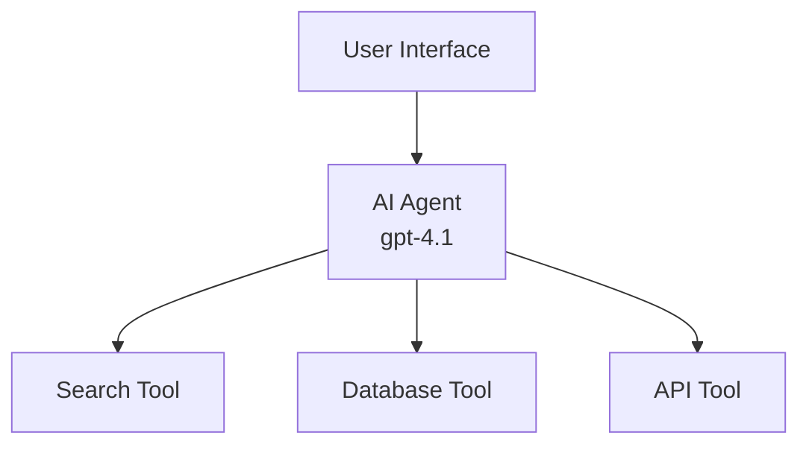
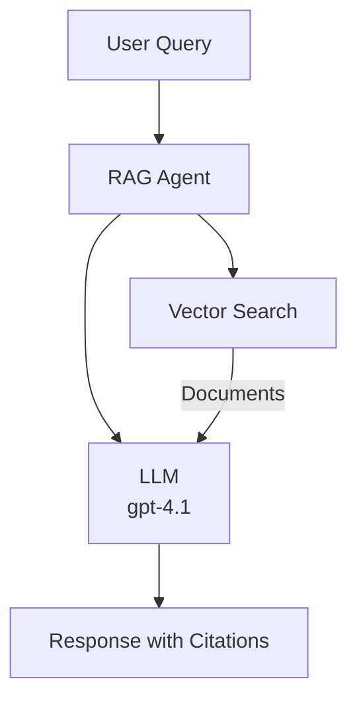
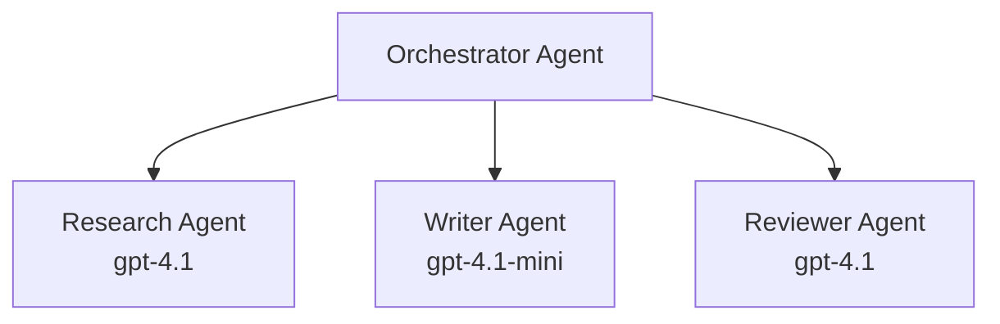

# Agentes de IA com Azure Developer CLI

**Navegação do Capítulo:**
- **📚 Início do Curso**: [AZD Para Iniciantes](../../README.md)
- **📖 Capítulo Atual**: Capítulo 2 - Desenvolvimento AI-First
- **⬅️ Anterior**: [Integração Microsoft Foundry](microsoft-foundry-integration.md)
- **➡️ Próximo**: [Deploy de Modelos de IA](ai-model-deployment.md)
- **🚀 Avançado**: [Soluções Multi-Agentes](../../examples/retail-scenario.md)

---

## Introdução

Agentes de IA são programas autónomos que podem perceber o seu ambiente, tomar decisões e agir para atingir objetivos específicos. Ao contrário de chatbots simples que respondem a comandos, os agentes podem:

- **Usar ferramentas** - Chamar APIs, pesquisar bases de dados, executar código
- **Planear e raciocinar** - Dividir tarefas complexas em passos
- **Aprender com o contexto** - Manter memória e adaptar comportamento
- **Colaborar** - Trabalhar com outros agentes (sistemas multi-agente)

Este guia mostra como implantar agentes de IA no Azure usando Azure Developer CLI (azd).

Usar contexto da conversação não é treinar modelo: memória persistente, controlo de acesso e retenção devem ser implementados/configurados pela aplicação.

> **Atualização Foundry GA (2026-11-09):** Instale o bundle geralmente disponível `microsoft.foundry` 1.0 com `azd >= 1.37.0`. Avaliações são instaladas separadamente; funcionalidades opcionais em pré-visualização e o fragmento de SDK clássico abaixo não são promovidos para GA no anúncio do bundle. Esta orientação é baseada no [anúncio GA](https://devblogs.microsoft.com/azure-sdk/microsoft-foundry-azure-developer-cli-ga/) e documentação, não numa implantação Azure ao vivo.

## Objetivos de Aprendizagem

Ao completar este guia, irá:
- Compreender o que são agentes de IA e como diferem dos chatbots
- Implantar templates pré-construídos de agentes de IA usando AZD
- Configurar Foundry Agents para agentes personalizados
- Implementar padrões básicos de agentes (uso de ferramentas, RAG, multi-agente)
- Monitorizar e depurar agentes implantados

## Resultados de Aprendizagem

Após a conclusão, será capaz de:
- Implantar aplicações de agentes de IA no Azure com um único comando
- Configurar ferramentas e capacidades dos agentes
- Implementar geração aumentada por recuperação (RAG) com agentes
- Desenhar arquiteturas multi-agente para fluxos de trabalho complexos
- Resolver problemas comuns de implantação de agentes

---

## 🤖 O Que Torna um Agente Diferente de um Chatbot?

| Caraterística | Chatbot | Agente de IA |
|---------|---------|----------|
| **Comportamento** | Responde a comandos | Age autonomamente |
| **Ferramentas** | Pode usar recuperação ou ferramentas | Normalmente usa ferramentas num ciclo dirigido a objetivos |
| **Memória** | Depende da aplicação | Memória persistente apenas se explicitamente implementada |
| **Planeamento** | Resposta única | Raciocínio em múltiplos passos |
| **Colaboração** | Entidade única | Pode trabalhar com outros agentes |

### Analogia Simples

- **Chatbot** = Uma pessoa prestável a responder perguntas numa mesa de informações
- **Agente de IA** = Um assistente pessoal que pode fazer chamadas, marcar compromissos e completar tarefas para si

---

## 🚀 Início Rápido: Desenhe o Seu Primeiro Agente

Escolha uma opção numa **nova diretoria de trabalho vazia**. O `.` final inicializa aí; sem um destino explícito, o AZD atual pode criar uma subdiretoria com nome do template e não muda o diretório do seu shell. Mantenha templates/ambientes separados em diretórios separados.

As faixas de tempo/custo abaixo são ilustrativas, não cotações validadas. Verifique os pré-requisitos atuais de cada exemplo, preços, quota de modelos e serviços opcionais antes da implantação.

### Opção 1: Template Foundry Agents (Recomendado)

```bash
# Initialize the AI agents template
azd init --template get-started-with-ai-agents .

# Deploy to Azure
azd up
```

**O que é implantado:** A infraestrutura atual do exemplo e opções selecionadas determinam modelo, ferramentas, hosting e recursos de monitorização. Reveja o README e o `infra/` antes da provisão; não presuma que cada template de agente inclui Search ou interface web.

**Tempo:** ~15-20 minutos
**Custo:** ~$100-150/mês (desenvolvimento)

### Opção 2: Agentes de Escrita Criativa com Prompty

```bash
# Initialize the Prompty-based agent template
azd init --template https://github.com/Azure-Samples/contoso-creative-writer .

# Deploy to Azure
azd up
```

**O que é implantado:** Exemplo multi-agente FastAPI/Prompty usando Azure OpenAI, Bing Grounding, e Azure AI Search. O antigo depósito `agent-openai-python-prompty` redireciona para aqui; não é um template minimalista de agentes meteorológicos Azure Functions. Siga o README atual para hosting, quota de modelo e pré-requisitos de Bing Grounding.

**Tempo:** ~10-15 minutos
**Custo:** ~$50-100/mês (desenvolvimento)

### Opção 3: Agente de Chat RAG

```bash
# Initialize RAG chat template
azd init --template azure-search-openai-demo .

# Deploy to Azure
azd up
```

**O que é implantado:**
- ✅ Modelos Microsoft Foundry
- ✅ Azure AI Search com dados de exemplo
- ✅ Pipeline de processamento de documentos
- ✅ Interface de chat com citações

**Tempo:** ~15-25 minutos
**Custo:** ~$80-150/mês (desenvolvimento)

### Opção 4: Agente Hospedado com o Bundle GA Foundry

Use o [tutorial completo do agente hospedado](microsoft-foundry-integration.md#hosted-agent-walkthrough-ga) para o exemplo básico Python Agent Framework Responses API. Este caminho de deploy necessita Python 3.13+, uv atual, permissões Foundry e quota regional de modelos. Autentique chamadas SDK locais separadamente quando usar credenciais Azure CLI.

```bash
azd auth login
azd ext install microsoft.foundry
```

Na diretoria vazia, inicialize o exemplo:

```text
azd ai agent init --template https://github.com/microsoft-foundry/foundry-samples/blob/main/samples/python/hosted-agents/agent-framework/responses/01-basic/azure.yaml --deploy-mode code --src .
```

Escolha projeto novo ou existente, reveja `azure.yaml`, e execute `azd provision`. Use `azd ai agent run` para abrir Agent Inspector e, noutro terminal nessa diretoria, `azd ai agent invoke --local "Explain how this agent is hosted."`. Após verificação local, use `azd deploy` e `azd ai agent invoke "Explain how this agent is hosted."` para comparar a resposta implantada. Foundry constrói remotamente o código fonte enviado; não é necessária build local de container.

**Quando usar `azd ai agent init` vs `azd init --template`:**

| Abordagem | Melhor para | Como Funciona |
|----------|----------|------|
| `azd init --template` | Começar a partir de app exemplo funcional | Clona repositório de template completo com código + infra |
| `azd ai agent init --template` | Adotar projeto agente Foundry atual | Usa documento do projeto `azure.yaml` e suas definições |

> **Dica:** Opções 1-3 começam de templates de aplicação completos; Opção 4 ensina workflow de agente hospedado GA. Nenhum comando de inicialização migra manifestos legados de agentes automaticamente. Para adicionar definição direta de agente a projeto existente, veja [orientações de inicialização e migração](../chapter-08-production/production-ai-practices.md#initializing-agent-projects-with-azd-ai-agent-init).

Instale `azure.ai.evaluations` separadamente para gerar e rever dados/rúbricas de teste, configurar avaliação e executar com `azd ai eval`. Otimização pode reutilizar uma avaliação compatível; reveja candidatos antes de implantar explicitamente um. Siga o [workflow de avaliação](../chapter-08-production/production-ai-practices.md#evaluation-migration-and-quality-checks) e [migração de otimização](../chapter-08-production/production-ai-practices.md#optimization-configuration-migration) antes de reutilizar exemplos antigos. Para limpeza, recursos de projeto Foundry reutilizado mantêm-se após `azd down`; grupo de recursos de projeto recém-criado é eliminado. Veja as [orientações de limpeza do tutorial](microsoft-foundry-integration.md#7-clean-up-deliberately).

---

## 🏗️ Padrões de Arquitetura de Agentes

### Padrão 1: Agente Único com Ferramentas

O padrão de agente mais simples - um agente que pode usar múltiplas ferramentas.


```mermaid
graph TD
    UI[User Interface] --> Agent[AI Agent<br/>gpt-4.1]
    Agent --> Search[Search Tool]
    Agent --> Database[Database Tool]
    Agent --> API[API Tool]
```

**Melhor para:**
- Bots de suporte ao cliente
- Assistentes de pesquisa
- Agentes de análise de dados

**Exemplo de aplicação relacionado:** `azure-search-openai-demo` demonstra RAG, não um ciclo agente-ferramenta genérico arbitrário.

### Padrão 2: Agente RAG (Geração Aumentada por Recuperação)

Um agente que recupera documentos relevantes antes de gerar respostas.


```mermaid
graph TD
    Query[User Query] --> RAG[RAG Agent]
    RAG --> Vector[Vector Search]
    RAG --> LLM[LLM<br/>gpt-4.1]
    Vector -- Documents --> LLM
    LLM --> Response[Response with Citations]
```

**Melhor para:**
- Bases de conhecimento empresariais
- Sistemas de Q&A de documentos
- Pesquisa legal e de conformidade

**Template AZD:** `azure-search-openai-demo`

### Padrão 3: Sistema Multi-Agente

Múltiplos agentes especializados a trabalhar juntos em tarefas complexas.


```mermaid
graph TD
    Orchestrator[Orchestrator Agent] --> Research[Research Agent<br/>gpt-4.1]
    Orchestrator --> Writer[Writer Agent<br/>gpt-4.1-mini]
    Orchestrator --> Reviewer[Reviewer Agent<br/>gpt-4.1]
```

**Melhor para:**
- Geração complexa de conteúdos
- Fluxos de trabalho em múltiplos passos
- Tarefas que requerem diversas especializações

**Saber mais:** [Padrões de Coordenação Multi-Agente](../chapter-06-pre-deployment/coordination-patterns.md)

---

## ⚙️ Configurar Ferramentas do Agente

Agentes tornam-se poderosos quando podem usar ferramentas. Eis como configurar ferramentas comuns:

### Configuração de Ferramentas em Foundry Agents

Este **fragmento clássico do SDK de Serviços de Agentes** destina-se a `azure-ai-projects==1.0.0` e `azure-ai-agents==1.1.0` com `azure-identity`. Não é a versão mais recente API versioned-agent/Responses usada por alguns templates Foundry atuais, nem a extensão `azure.ai.agents` AZD (um pacote diferente). Não misture estas gerações de API. Defina `PROJECT_ENDPOINT` para um endpoint de projeto Foundry clássico e `MODEL_DEPLOYMENT_NAME` para uma implantação de modelo suportada existente; autentique localmente com `az login` e conceda as permissões de projeto necessárias.

```python
# agent_config.py
import os
from azure.ai.projects import AIProjectClient
from azure.ai.agents.models import FunctionTool
from azure.identity import DefaultAzureCredential

def search_knowledge_base(query: str) -> str:
    """Search the demonstration knowledge base.

    :param query: Search text.
    :return: Matching demonstration information.
    """
    # Local fixture only, not a production search implementation.
    return "Demo policy: returns are accepted within 30 days."

project_client = AIProjectClient(
    endpoint=os.environ["PROJECT_ENDPOINT"],
    credential=DefaultAzureCredential(),
)
search_tool = FunctionTool(functions={search_knowledge_base})
project_client.agents.enable_auto_function_calls(search_tool)
agent = project_client.agents.create_agent(
    model=os.environ["MODEL_DEPLOYMENT_NAME"],
    name="Support Agent",
    instructions="Use search_knowledge_base for policy questions. Label results as demo data.",
    tools=search_tool.definitions,
)
```

Registar um esquema de função não executa Python no serviço. Neste SDK, `enable_auto_function_calls` mais `agents.runs.create_and_process(...)` executam callbacks registados no processo do cliente. Veja o [exemplo SDK lançado](https://github.com/Azure/azure-sdk-for-python/blob/azure-ai-agents_1.1.0/sdk/ai/azure-ai-agents/samples/agents_tools/sample_agents_auto_function_call.py). Feche o cliente e elimine agentes/fios de demonstração quando terminar.

### Configuração do Ambiente

Os nomes seguintes são **inputs personalizáveis ilustrativos**, não parâmetros AZD embutidos. Primeiro cada valor deve ser ligado via `infra/main.parameters.json`, infraestrutura e código da aplicação. Só `azd env set` não altera ferramentas ou instruções do agente.

```bash
# Set up agent-specific environment variables
azd env set AZURE_OPENAI_MODEL "gpt-4.1"
azd env set AGENT_INSTRUCTIONS "You are a helpful assistant..."
azd env set ENABLE_CODE_INTERPRETER "true"
azd env set ENABLE_FILE_SEARCH "true"

# Apply wired infrastructure and application changes
azd up
```

---

## 📊 Monitorização de Agentes

### Integração com Application Insights

Se o template selecionado provisiona Application Insights e configura instrumentação:

```bash
# Open monitoring dashboard
azd monitor --overview

# Open the Application Insights logs view (not a streaming log tail)
azd monitor --logs

# View live metrics
azd monitor --live
```

### Métricas-chave a Monitorizar

| Métrica | Descrição | Meta |
|--------|-------------|--------|
| Latência de Resposta | Tempo para gerar resposta | < 5 segundos |
| Uso de Tokens | Tokens por pedido | Monitorizar para custo |
| Taxa de Sucesso na Chamada de Ferramentas | % de execuções de ferramentas bem sucedidas | > 95% |
| Taxa de Erros | Pedidos de agente falhados | < 1% |
| Satisfação do Utilizador | Pontuações de feedback | > 4.0/5.0 |

### Logging Personalizado para Agentes

```python
import os
from azure.monitor.opentelemetry import configure_azure_monitor
from opentelemetry import trace

# Configure Azure Monitor with OpenTelemetry
configure_azure_monitor(
    connection_string=os.environ["APPLICATIONINSIGHTS_CONNECTION_STRING"]
)

tracer = trace.get_tracer(__name__)

def log_agent_interaction(user_query, agent_response, tools_used, latency_ms):
    with tracer.start_as_current_span("agent_interaction") as span:
        span.set_attributes({
            "query_length": len(user_query),  # Do not log raw prompts or personal data
            "response_length": len(agent_response),
            "tools_used": tools_used,
            "latency_ms": latency_ms
        })
```

> **Nota:** Instale o pacote requerido: `pip install azure-monitor-opentelemetry`. Traz as dependências OpenTelemetry; o namespace de importação não é requisito para instalar pacote chamado `opentelemetry`.

---

## 💰 Considerações de Custo

### Custos Mensais Estimados por Padrão

Estas são faixas ilustrativas para planeamento, não cotações ou limites de gastos. Região, tokens do modelo, SKUs de Search/cálculo, sessões de ferramenta, armazenamento e tráfego podem excedê-las. Verifique orientação de custos do exemplo e preços Azure antes de `azd up`.

| Padrão | Ambiente Dev | Produção |
|---------|-----------------|------------|
| Agente Único | $50-100 | $200-500 |
| Agente RAG | $80-150 | $300-800 |
| Multi-Agente (2-3 agentes) | $150-300 | $500-1,500 |
| Multi-Agente Empresarial | $300-500 | $1,500-5,000+ |

### Dicas para Otimização de Custos

1. **Use gpt-4.1-mini para tarefas simples** (só se o seu template usar este input)
   ```bash
   azd env set AZURE_OPENAI_MODEL "gpt-4.1-mini"
   ```

2. **Implemente cache com escopo para consultas repetidas seguras.** Inclua autorização inquilino/utilizador, implantação de modelo, instruções, e versão de recuperação na chave de cache; defina validade. Não partilhe respostas privadas de conversação através de cache só-para-consulta em todo o processo. O objeto agente SDK não tem método genérico `agent.run()`.

3. **Defina limites de tokens por execução**
   ```python
   # Set max_completion_tokens when running the agent, not during creation
   run = project_client.agents.runs.create_and_process(
       thread_id=thread.id,
       agent_id=agent.id,
       max_completion_tokens=1000  # Budget across the run; may finish as incomplete
   )
   ```

4. **Escale Container Apps elegíveis para zero quando não estiverem em uso**
   ```bash
   # Custom-template input: must map to template.scale.minReplicas
   azd env set MIN_REPLICAS "0"
   ```
   Aplique a alteração infra com `azd provision` ou `azd up`. Escalar para zero precisa de gatilho adequado e não interrompe cobranças de Search, armazenamento ou modelo/ferramenta.

---

## 🔧 Resolução de Problemas dos Agentes

### Problemas Comuns e Soluções

<details>
<summary><strong>❌ Agente não responde a chamadas de ferramentas</strong></summary>

```bash
# Inspect the application deployment (not the agent's registered tools)
azd show

# Verify OpenAI deployment
az cognitiveservices account deployment list \
  --name $AZURE_OPENAI_NAME \
  --resource-group $RG_NAME

# Check agent logs
azd monitor --logs
```

**Causas comuns:**
- Assinatura da função da ferramenta incompatível
- Permissões requeridas em falta
- Endpoint API inacessível
</details>

<details>
<summary><strong>❌ Latência elevada nas respostas do agente</strong></summary>

```bash
# Check Application Insights for bottlenecks
azd monitor --live

# Consider using a faster model
azd env set AZURE_OPENAI_MODEL "gpt-4.1-mini"
azd up
```

**Dicas de otimização:**
- Use respostas em streaming
- Implemente cache de respostas
- Reduza tamanho da janela de contexto
</details>

<details>
<summary><strong>❌ Agente devolve informação incorreta ou alucinação</strong></summary>

```python
# Improve with better system prompts
instructions = """
You are a helpful assistant. IMPORTANT:
- Only answer based on provided context
- If you don't know, say "I don't know"
- Always cite your sources
- Never make up information
"""

# Use these instructions in the agent definition.
# For classic file search, first upload/index documents in a vector store,
# then use FileSearchTool(vector_store_ids=[...]) and pass both its
# .definitions and .resources when creating the agent.
```
Instruções e recuperação reduzem risco; nenhuma garante respostas factuais. Avalie perguntas fundamentadas e fora do escopo contra respostas conhecidas.
</details>

<details>
<summary><strong>❌ Erros por limite de tokens excedido</strong></summary>

```python
# Implement context window management
def truncate_context(messages, max_tokens=8000, model="gpt-4.1"):
    """Approximate content-only budget for objects with .content strings."""
    import tiktoken
    encoding = tiktoken.encoding_for_model(model)
    total_tokens = 0
    truncated = []
    
    for msg in reversed(messages):
        msg_tokens = len(encoding.encode(msg.content))
        if total_tokens + msg_tokens > max_tokens:
            break
        truncated.insert(0, msg)
        total_tokens += msg_tokens
    
    return truncated
```
Este ajudante exclui esquemas de role/ferramenta, instruções de sistema, tokens de imagens e overhead de protocolo. Reserve espaço para esses e para a conclusão; não divida pares chamada-ferramenta/resultado nem descarte instruções de sistema requeridas. Instale `tiktoken` separadamente. Não é validador geral de janelas de contexto.
</details>

---

## 🎓 Exercícios Práticos

### Exercício 1: Implante um Agente Básico (20 minutos)

**Objetivo:** Implante o seu primeiro agente IA usando AZD

```bash
# Step 1: Initialize template
azd init --template get-started-with-ai-agents .

# Step 2: Login to Azure
azd auth login
# If you work across tenants, add --tenant-id <tenant-id>

# Step 3: Deploy
azd up

# Step 4: Test the agent
# Expected output after deployment:
#   Deployment Complete!
#   Endpoint: https://<app-name>.<region>.azurecontainerapps.io
# Open the URL shown in the output and try asking a question

# Step 5: View monitoring
azd monitor --overview

# Step 6: Review the listed resources and confirm cleanup
azd down
```

**Critérios de Sucesso:**
- [ ] Agente responde a perguntas
- [ ] Pode aceder ao painel de monitorização via `azd monitor`
- [ ] Recursos limpos com sucesso

### Exercício 2: Adicionar uma Ferramenta Personalizada (30 minutos)

**Objetivo:** Estender um agente com uma ferramenta personalizada

**Ponto de partida:** Use o cliente clássico do SDK a partir de [Configuração da Ferramenta](#tool-configuration-in-foundry-agents), não um template arbitrário com uma geração diferente do SDK.

1. Adicione esta fixture determinística a `agent_config.py`:
   ```python
   def get_weather(location: str) -> str:
       """Return demonstration weather, not live conditions.

       :param location: City name.
       :return: A clearly labelled fixture.
       """
       print(f"TOOL_CALLED: {location}")
       return f"Demo weather in {location}: Sunny, 72°F (fixture, not live)"
   ```
2. Substitua o bloco de registo e criação da ferramenta de pesquisa por:
   ```python
   weather_tool = FunctionTool(functions={get_weather})
   project_client.agents.enable_auto_function_calls(weather_tool)
   agent = project_client.agents.create_agent(
       model=os.environ["MODEL_DEPLOYMENT_NAME"],
       name="Weather Agent",
       instructions="Call get_weather for weather questions; explain that it returns demo data.",
       tools=weather_tool.definitions,
   )
   thread = project_client.agents.threads.create()
   try:
       project_client.agents.messages.create(
           thread_id=thread.id, role="user", content="Use get_weather for Seattle."
       )
       run = project_client.agents.runs.create_and_process(
           thread_id=thread.id, agent_id=agent.id
       )
       if run.status != "completed":
           raise RuntimeError(f"Run status: {run.status}; error: {run.last_error}")
       for message in project_client.agents.messages.list(thread_id=thread.id):
           for text in message.text_messages:
               print(text.text.value)
   finally:
       project_client.agents.threads.delete(thread.id)
       project_client.agents.delete_agent(agent.id)
       project_client.close()
   ```
3. Execute localmente (isto chama o projeto existente no Azure e acarreta custos de modelo):
   ```bash
   python agent_config.py
   # Expected: TOOL_CALLED: Seattle, then a completed answer labelled demo data.
   ```

**Critérios de Sucesso:**
- [ ] Agente reconhece consultas relacionadas com o tempo
- [ ] Ferramenta é chamada corretamente
- [ ] Resposta inclui informações meteorológicas

### Exercício 3: Construir um Agente RAG (45 minutos)

**Objetivo:** Criar um agente que responde a perguntas a partir dos seus documentos

```bash
# Step 1: Deploy RAG template
azd init --template azure-search-openai-demo .
azd up

# Step 2: Upload your documents
# For the sample's local ingestion path, place supported files in data/.
# Run from the sample root after following its Python environment setup:
./scripts/prepdocs.sh
# Windows PowerShell equivalent: .\\scripts\\prepdocs.ps1

# Step 3: Test with domain-specific questions
# Open the web app URL from the azd up output
# Ask questions about your uploaded documents
# Responses should include citation references like [doc.pdf]
```

**Critérios de Sucesso:**
- [ ] Agente responde a partir dos documentos carregados
- [ ] Respostas incluem citações
- [ ] Perguntas fora do âmbito são tratadas sem afirmações não suportadas (não é garantia para todas as questões futuras)

Se `USE_CLOUD_INGESTION=true`, use antes o fluxo de carga/ingestão em nuvem do exemplo; o wrapper local intencionalmente ignora a ingestão. Após o teste, execute `azd down` no ambiente RAG e reveja os recursos a eliminar.

---

## 📚 Próximos Passos

Agora que entende agentes de IA, explore estes tópicos avançados:

| Tópico | Descrição | Link |
|-------|-------------|------|
| **Sistemas Multi-Agentes** | Construir sistemas com múltiplos agentes colaboradores | [Exemplo Multi-Agente de Retalho](../../examples/retail-scenario.md) |
| **Padrões de Coordenação** | Aprender padrões de orquestração e comunicação | [Padrões de Coordenação](../chapter-06-pre-deployment/coordination-patterns.md) |
| **Desenvolvimento para Produção** | Deploy de agente pronto para produção empresarial | [Práticas de IA para Produção](../chapter-08-production/production-ai-practices.md) |
| **Avaliação de Agentes** | Testar e avaliar desempenho do agente | [Resolução de Problemas em IA](../chapter-07-troubleshooting/ai-troubleshooting.md) |
| **Laboratório do Workshop de IA** | Prático: Prepare a sua solução de IA para AZD | [Laboratório do Workshop de IA](ai-workshop-lab.md) |

---

## 📖 Recursos Adicionais

### Documentação Oficial
- [Microsoft Foundry Agent Service](https://learn.microsoft.com/azure/ai-services/agents/)
- [Microsoft Foundry Agent Service Quickstart](https://learn.microsoft.com/azure/ai-services/agents/quickstart)
- [Framework de Agentes Semantic Kernel](https://learn.microsoft.com/semantic-kernel/)

### Templates AZD para Agentes
- [Começar com Agentes de IA](https://github.com/Azure-Samples/get-started-with-ai-agents)
- [Agentes de Escrita Criativa com Prompty](https://github.com/Azure-Samples/contoso-creative-writer)
- [Demo de Azure Search OpenAI](https://github.com/Azure-Samples/azure-search-openai-demo)

### Recursos da Comunidade
- [Awesome AZD - Templates de Agentes](https://azure.github.io/awesome-azd/?tags=ai-agents)
- [Azure AI Discord](https://discord.gg/microsoft-azure)
- [Microsoft Foundry Discord](https://discord.gg/nTYy5BXMWG)

### Skills de Agente para o Seu Editor
- [**Skills de Agentes Microsoft Azure**](https://skills.sh/microsoft/github-copilot-for-azure) - Instale skills reutilizáveis de agente de IA para desenvolvimento Azure no GitHub Copilot, Cursor, ou qualquer agente suportado. Inclui skills para [Azure AI](https://skills.sh/microsoft/github-copilot-for-azure/azure-ai), [Microsoft Foundry](https://skills.sh/microsoft/github-copilot-for-azure/microsoft-foundry), [deploy](https://skills.sh/microsoft/github-copilot-for-azure/azure-deploy), e [diagnósticos](https://skills.sh/microsoft/github-copilot-for-azure/azure-diagnostics):
  ```bash
  npx skills add microsoft/github-copilot-for-azure
  ```

---

**Navegação**
- **Lição Anterior**: [Integração Microsoft Foundry](microsoft-foundry-integration.md)
- **Próxima Lição**: [Deploy de Modelo de IA](ai-model-deployment.md)

---

<!-- CO-OP TRANSLATOR DISCLAIMER START -->
**Aviso Legal**:
Este documento foi traduzido utilizando o serviço de tradução automática [Co-op Translator](https://github.com/Azure/co-op-translator). Embora nos esforcemos pela precisão, esteja ciente de que traduções automáticas podem conter erros ou imprecisões. O documento original na sua língua nativa deve ser considerado a fonte autorizada. Para informações críticas, recomenda-se tradução profissional humana. Não nos responsabilizamos por quaisquer mal-entendidos ou interpretações incorretas resultantes da utilização desta tradução.
<!-- CO-OP TRANSLATOR DISCLAIMER END -->