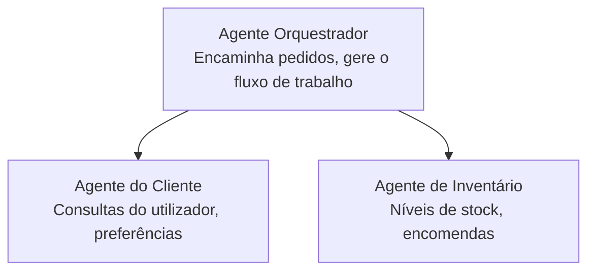

# Capítulo 5: Soluções de IA Multi-Agente

**📚 Curso**: [AZD Para Iniciantes](../../README.md) | **⏱️ Duração**: 2-3 horas | **⭐ Complexidade**: Avançado

---

## Visão Geral

Este capítulo aborda padrões avançados de arquitetura multi-agente, orquestração de agentes e implementações de IA prontas para produção em cenários complexos.

> Validado com `azd 1.25.6` em junho de 2026.

## Objetivos de Aprendizagem

Ao concluir este capítulo, irá:
- Compreender padrões de arquitetura multi-agente
- Implementar sistemas coordenados de agentes de IA
- Implementar comunicação entre agentes
- Construir soluções multi-agente prontas para produção

---

## 📚 Lições

| # | Lição | Descrição | Duração |
|---|--------|-------------|---------|
| 1 | [Noções Básicas de Multi-Agente](multi-agent-basics.md) | Prática: implementar uma aplicação multi-agente funcional com `azd up` | 45 min |
| 2 | [Padrões de Coordenação](../chapter-06-pre-deployment/coordination-patterns.md) | Estratégias de orquestração de agentes (continua no Capítulo 6) | 30 min |
| 3 | [Implementação com Template ARM](../../examples/retail-multiagent-arm-template/README.md) | Exemplo de implementação com um clique | 30 min |

> **Comece pela Lição 1.** É a única lição totalmente prática e implementável neste capítulo. A Lição 2 está no Capítulo 6 (é compartilhada com o planeamento pré-implementação), e a [Solução Multi-Agente para Retalho](../../examples/retail-scenario.md) é um guia de arquitetura — uma referência de design, não um template de um único comando.

---

## 🚀 Início Rápido

```bash
# Opção 1: Implantar a partir de um modelo
azd init --template agent-openai-python-prompty
azd up

# Opção 2: Implantar a partir de um manifesto de agente (requer a extensão azure.ai.agents)
azd extension install azure.ai.agents
azd ai agent init -m agent-manifest.yaml
azd up
```

> **Qual abordagem?** Utilize `azd init --template` para começar a partir de um exemplo funcional. Use `azd ai agent init` quando tiver o seu próprio manifesto de agente. Veja a [referência do AZD AI CLI](../chapter-08-production/production-ai-practices.md#azd-ai-cli-commands-and-extensions) para detalhes completos.

---

## 🤖 Arquitetura Multi-Agente



---

## 🎯 Solução em Destaque: Multi-Agente para Retalho

A [Solução Multi-Agente para Retalho](../../examples/retail-scenario.md) demonstra:

- **Agente do Cliente**: Gere interações e preferências do utilizador
- **Agente de Inventário**: Gere stock e processamento de encomendas
- **Orquestrador**: Coordena entre os agentes
- **Memória Partilhada**: Gestão de contexto entre agentes

### Serviços Utilizados

| Serviço | Finalidade |
|---------|------------|
| Microsoft Foundry Models | Compreensão de linguagem |
| Azure AI Search | Catálogo de produtos |
| Cosmos DB | Estado e memória do agente |
| Container Apps | Hospedagem de agentes |
| Application Insights | Monitorização |

---

## 🔗 Navegação

| Direção | Capítulo |
|---------|----------|
| **Anterior** | [Capítulo 4: Infraestrutura](../chapter-04-infrastructure/README.md) |
| **Seguinte** | [Capítulo 6: Pré-Implementação](../chapter-06-pre-deployment/README.md) |

---

## 📖 Recursos Relacionados

- [Guia de Agentes de IA](../chapter-02-ai-development/agents.md)
- [Práticas de IA em Produção](../chapter-08-production/production-ai-practices.md)
- [Resolução de Problemas em IA](../chapter-07-troubleshooting/ai-troubleshooting.md)

---

<!-- CO-OP TRANSLATOR DISCLAIMER START -->
**Aviso Legal**:
Este documento foi traduzido utilizando o serviço de tradução automática [Co-op Translator](https://github.com/Azure/co-op-translator). Embora nos esforcemos pela precisão, esteja ciente de que traduções automáticas podem conter erros ou imprecisões. O documento original na sua língua nativa deve ser considerado a fonte autorizada. Para informações críticas, recomenda-se tradução profissional humana. Não nos responsabilizamos por quaisquer mal-entendidos ou interpretações incorretas resultantes da utilização desta tradução.
<!-- CO-OP TRANSLATOR DISCLAIMER END -->