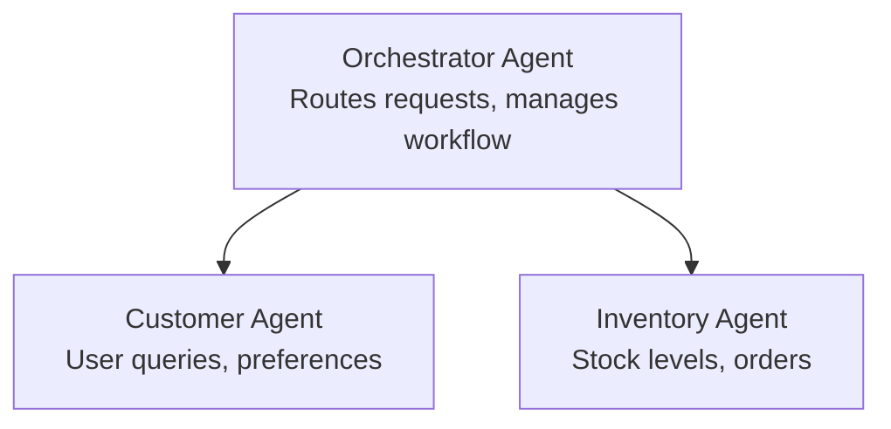

# Capítulo 5: Soluções de IA Multi-Agente

**📚 Curso**: [AZD Para Principiantes](../../README.md) | **⏱️ Duração**: 2-3 horas | **⭐ Complexidade**: Avançado

---

## Visão Geral

Este capítulo aborda padrões avançados de arquitetura multi-agente, orquestração de agentes e implementações de IA prontas para produção para cenários complexos.

> Orientação de comandos revisada com base na referência `azd 1.37.2` divulgada. Não foram executadas implementações em nuvem.

## Objetivos de Aprendizagem

Ao completar este capítulo, irá:
- Compreender padrões de arquitetura multi-agente
- Implementar sistemas coordenados de agentes de IA
- Implementar comunicação entre agentes
- Construir soluções multi-agente prontas para produção

---

## 📚 Aulas

| # | Aula | Descrição | Tempo |
|---|--------|-------------|------|
| 1 | [Noções Básicas de Multi-Agentes](multi-agent-basics.md) | Prático: implemente uma aplicação multi-agente funcional com `azd up` | 45 min |
| 2 | [Padrões de Coordenação](../chapter-06-pre-deployment/coordination-patterns.md) | Estratégias de orquestração de agentes (continua no Capítulo 6) | 30 min |
| 3 | [Implementação com ARM Template](../../examples/retail-multiagent-arm-template/README.md) | Exemplo de implementação com um clique | 30 min |

> **Comece pela Aula 1.** É a única aula completamente prática e implementável neste capítulo. A Aula 2 está no Capítulo 6 (compartilhada com planeamento pré-implementação), e a [Solução Multi-Agente para Retalho](../../examples/retail-scenario.md) é um modelo de arquitetura—uma referência de design, não um template de um único comando.

---

## 🚀 Início Rápido

```bash
# Option 1: Deploy the multi-agent template used in Lesson 1
azd init --template Azure-Samples/contoso-creative-writer .
azd up

# Option 2: Initialize a Foundry agent interactively (requires azure.ai.agents)
azd extension install azure.ai.agents
azd ai agent init
azd up
```

> **Qual abordagem?** Use `azd init --template` para começar com um exemplo funcional. Use `azd ai agent init` interativamente, ou `azd ai agent init --template <path-to-azure.yaml>` para adotar um projeto de agente atual. Consulte a [referência AZD AI CLI](../chapter-08-production/production-ai-practices.md#azd-ai-cli-commands-and-extensions) para requisitos de versão e migração de avaliação.

Execute estas alternativas em pastas vazias separadas. A extensão de agentes `1.0.0-beta.23` requer `azd >= 1.37.0`; o seu fluxo interativo não gera o pipeline personalizado de Service Bus na aula de coordenação.

---

## 🤖 Arquitetura Multi-Agente


```mermaid
graph TD
    Orchestrator[Orchestrator Agent<br/>Routes requests, manages workflow] --> Customer[Customer Agent<br/>User queries, preferences]
    Orchestrator --> Inventory[Inventory Agent<br/>Stock levels, orders]
```

---

## 🎯 Solução em Destaque: Multi-Agente para Retalho

A [Solução Multi-Agente para Retalho](../../examples/retail-scenario.md) demonstra:

- **Agente do Cliente**: Gere interações e preferências dos utilizadores
- **Agente de Inventário**: Gere stock e processamento de encomendas
- **Orquestrador**: Coordena entre agentes
- **Memória Partilhada**: Gestão de contexto entre agentes

### Serviços Usados

| Serviço | Propósito |
|---------|---------|
| Modelos Microsoft Foundry | Compreensão de linguagem |
| Azure AI Search | Catálogo de produtos |
| Cosmos DB | Estado e memória do agente |
| Container Apps | Hospedagem de agentes |
| Application Insights | Monitorização |

---

## 🔗 Navegação

| Direção | Capítulo |
|-----------|---------|
| **Anterior** | [Capítulo 4: Infraestrutura](../chapter-04-infrastructure/README.md) |
| **Seguinte** | [Capítulo 6: Pré-Implementação](../chapter-06-pre-deployment/README.md) |

---

## 📖 Recursos Relacionados

- [Guia de Agentes de IA](../chapter-02-ai-development/agents.md)
- [Práticas de IA para Produção](../chapter-08-production/production-ai-practices.md)
- [Resolução de Problemas de IA](../chapter-07-troubleshooting/ai-troubleshooting.md)

---

<!-- CO-OP TRANSLATOR DISCLAIMER START -->
**Aviso Legal**:
Este documento foi traduzido utilizando o serviço de tradução automática [Co-op Translator](https://github.com/Azure/co-op-translator). Embora nos esforcemos pela precisão, esteja ciente de que traduções automáticas podem conter erros ou imprecisões. O documento original na sua língua nativa deve ser considerado a fonte autorizada. Para informações críticas, recomenda-se tradução profissional humana. Não nos responsabilizamos por quaisquer mal-entendidos ou interpretações incorretas resultantes da utilização desta tradução.
<!-- CO-OP TRANSLATOR DISCLAIMER END -->