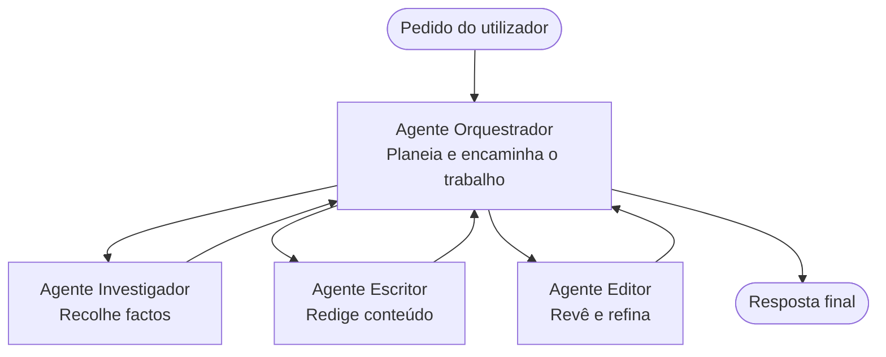

# Fundamentos Multi-Agente - Implemente o Seu Primeiro Sistema de IA Coordenado

**Chapter Navigation:**
- **📚 Course Home**: [AZD For Beginners](../../README.md)
- **📖 Current Chapter**: Chapter 5 - Multi-Agent AI Solutions
- **⬅️ Previous**: [Chapter 4: Infrastructure](../chapter-04-infrastructure/README.md)
- **➡️ Next**: [Coordination Patterns](../chapter-06-pre-deployment/coordination-patterns.md)

> Validado com `azd 1.25.6` em junho de 2026.

## Introdução

Nos capítulos anteriores implantou uma única aplicação — e no Capítulo 2 implantou um único agente de IA. Esta lição dá o passo seguinte: implantar um **sistema multi-agente**, onde vários agentes especializados trabalham em conjunto para resolver um problema que um único agente não conseguiria tratar bem por si só.

A boa notícia para principiantes: **não precisa de comandos novos.** Uma solução multi-agente continua a ser um projeto azd. Irá `azd init`, `azd up`, testar e `azd down` — exatamente o fluxo de trabalho que já conhece. O que muda é a *estrutura* da aplicação no seu interior.

## Objetivos de Aprendizagem

No final desta lição, irá:
- Compreender o que significa "multi-agente" e quando vale a pena a complexidade adicional
- Reconhecer os papéis comuns num sistema multi-agente (orquestrador + especialistas)
- Implantar um modelo multi-agente real e funcional com `azd up`
- Compreender os recursos Azure que suportam uma app multi-agente
- Saber como verificar, personalizar e desmontar a solução com segurança

## Resultados de Aprendizagem

Após completar esta lição, será capaz de:
- Explicar a diferença entre um único agente e um sistema multi-agente
- Escolher entre um único agente com ferramentas e um verdadeiro desenho multi-agente
- Implantar e testar um modelo multi-agente de ponta a ponta com azd
- Identificar onde cada agente corre e como comunicam entre si
- Limpar todos os recursos para evitar encargos contínuos

---

## O que é um Sistema Multi-Agente?

Um agente de IA único é um modelo com um conjunto de instruções e (opcionalmente) algumas ferramentas. Isso funciona bem para tarefas focadas. Mas à medida que uma tarefa cresce — pesquisar, depois escrever, depois editar, depois verificar factos — enfiar tudo num único prompt torna o agente mais lento, menos fiável e mais difícil de depurar.

Um **sistema multi-agente** divide o trabalho em especialistas que cada um faz bem uma tarefa, coordenados por um orquestrador:



### Os dois papéis que verá sempre

| Função | Tarefa | Exemplo |
|------|-----|---------|
| **Orquestrador** | Decide *o que acontece a seguir* e encaminha trabalho entre agentes | "Primeiro pesquisar, depois escrever, depois editar" |
| **Especialista** | Faz um trabalho focado e devolve um resultado | Um "investigador" que apenas recolhe factos |

### Realmente precisa de vários agentes?

Comece simples. Opte pelo multi-agente **apenas** quando uma destas condições for verdadeira:

- ✅ A tarefa tem **etapas distintas** que beneficiam de instruções diferentes (pesquisa vs. escrita vs. revisão)
- ✅ Quer que especialistas corram **em paralelo** para poupar tempo
- ✅ Etapas diferentes precisam de **ferramentas ou fontes de dados diferentes**
- ✅ Precisa que cada etapa seja **testável e depurável independentemente**

Se a sua tarefa é uma única pergunta e resposta ou uma chamada simples a uma ferramenta, um **agente único com ferramentas** (Capítulo 2) é mais simples, mais barato e mais fácil de operar.

> **Dica para principiantes:** "Mais agentes" não é sinónimo de "melhor". Cada agente adiciona latência, custo e uma nova coisa para monitorizar. Adicione agentes apenas quando o problema se dividir claramente em partes.

---

## Duas Formas de Construir Multi-Agente no Azure

| Abordagem | O que é | Melhor para |
|----------|-----------|----------|
| **Agente único + ferramentas** | Um agente Foundry que chama funções/ferramentas | Workflows simples, começar rapidamente |
| **Vários agentes coordenados** | Vários agentes com um orquestrador | Etapas distintas, trabalho em paralelo, especialização |

Esta lição foca na segunda abordagem usando um **modelo pronto**, para que possa ver um sistema multi-agente real a correr antes de construir o seu próprio.

---

## Prático: Implantar uma App Multi-Agente Funcional

Vamos implantar o **Contoso Creative Writer**, um exemplo oficial da Azure que usa múltiplos agentes (investigador, escritor, editor) coordenados para produzir um artigo. É uma excelente primeira app multi-agente porque os papéis são fáceis de entender.

### Passo 1: Inicializar o modelo

```bash
# Criar uma pasta de trabalho
mkdir creative-writer && cd creative-writer

# Inicializar a partir do modelo oficial multiagente
azd init --template contoso-creative-writer
```

> Explore mais modelos multi-agente a qualquer momento na [Awesome AZD AI gallery](https://azure.github.io/awesome-azd/?tags=ai). Outras opções amigas de principiantes incluem `get-started-with-ai-agents` e `azure-ai-travel-agents`.

### Passo 2: Autenticar

```bash
# Necessário para fluxos de trabalho azd
azd auth login
```

### Passo 3: Criar um ambiente

```bash
azd env new dev
```

### Passo 4: Pré-visualizar, depois implantar

```bash
# Veja o que será criado antes de gastar qualquer coisa (recomendado)
azd provision --preview

# Provisionar a infraestrutura e implantar todos os agentes num único passo
azd up
```

`azd up` irá pedir uma subscrição e uma região, depois provisionará os recursos Azure e implantará a aplicação. Implantações de IA podem demorar mais do que uma simples app web — se estiver a implantar modelos maiores, pode estender o timeout de implantação:

```bash
azd deploy --timeout 1800
```

> **Aviso sobre custos e capacidade:** Apps multi-agente implantam modelos de IA que consomem quota e implicam custo. Se o `azd up` falhar devido a quota de modelos, veja [AI Troubleshooting](../chapter-07-troubleshooting/ai-troubleshooting.md) para correções de região e quota, e o Capítulo 6 [Capacity Planning](../chapter-06-pre-deployment/capacity-planning.md).

---

## Compreender o que Implantou

Uma app multi-agente típica como esta provisiona um conjunto de recursos Azure que mapeiam diretamente para as responsabilidades no diagrama acima:

| Recurso | Porquê |
|----------|----------------|
| **Microsoft Foundry / Models** | Hospeda os modelos de linguagem que cada agente utiliza |
| **Azure AI Search** | Dá ao agente investigador dados fundamentados para pesquisar |
| **Container Apps** (ou App Service) | Hospeda o orquestrador e o código dos agentes |
| **Cosmos DB** (em alguns exemplos) | Armazena estado/memória partilhada transmitida entre agentes |
| **Application Insights** | Regista pedidos através dos agentes para que possa depurar o fluxo |

### Como os agentes comunicam entre si

Na maioria dos exemplos azd multi-agente, o **orquestrador corre no código da sua aplicação** (por exemplo, usando um framework como Semantic Kernel ou o Microsoft Agent Framework). O orquestrador chama cada agente especialista por sua vez, transmite os resultados e compõe a resposta final. Os agentes partilham contexto através de:

- **Chamadas de função/ferramenta** — o orquestrador invoca um especialista e obtém um resultado de volta
- **Memória partilhada** — uma base de dados (frequentemente Cosmos DB) guarda estado que ambos os agentes podem ler
- **Mensagens/eventos** — para acoplamento mais frouxo, os agentes comunicam via fila ou Service Bus

> **Porque isto importa para a depuração:** como cada passo é separado, o Application Insights mostra-lhe *qual* agente foi lento ou falhou. Essa é uma razão importante para dividir o trabalho por agentes.

---

## Verificar a Implantação

Confirme que o sistema está realmente a funcionar antes de avançar:

```bash
# Mostrar os endpoints implantados
azd show

# Abrir o painel de monitorização da aplicação
azd monitor

# Acompanhar os logs se algo parecer fora do normal
azd monitor --logs
```

Depois, abra a URL da app com `azd show` e experimente um pedido que percorra todos os agentes (para o Creative Writer, peça para escrever um artigo curto sobre um tema). Na pesquisa de transacções do Application Insights, deverá ver o pedido a desdobrar-se pelos passos de investigador, escritor e editor.

**Critérios de sucesso:**
- ✅ `azd show` lista um endpoint acessível
- ✅ Um pedido produz um resultado que claramente passou por múltiplas etapas
- ✅ O Application Insights mostra traces para mais de um passo de agente

---

## Personalizar: Adicionar ou Ajustar um Agente

Porque cada agente é apenas instruções mais ferramentas, personalizar é acessível:

1. **Encontre as definições dos agentes** no modelo (frequentemente uma pasta `prompts/`, `agents/`, ou um conjunto de ficheiros `*.prompty`).
2. **Ajuste as instruções de um agente** — por exemplo, diga ao agente editor para aplicar um tom específico ou um limite de palavras.
3. **Reimplante apenas o código** (a infraestrutura permanece inalterada):

   ```bash
   azd deploy
   ```

Para ir mais além e construir agentes a partir do seu *próprio* manifesto, utilize a extensão de agentes e o seu ciclo de vida completo:

```bash
azd extension install azure.ai.agents
azd ai agent init -m agent-manifest.yaml
azd up
azd ai agent invoke      # teste, com tempo de resposta
```

Veja [Chapter 2: Agents](../chapter-02-ai-development/agents.md) e a [AZD AI CLI reference](../chapter-08-production/production-ai-practices.md#azd-ai-cli-commands-and-extensions) para o ciclo de vida completo do agente (`invoke`, `eval generate`, `optimize`, `delete`).

---

## Limpar

Apps multi-agente executam múltiplos serviços faturáveis. Remova tudo quando terminar:

```bash
azd down --force --purge
```

O sinalizador `--purge` também remove recursos de IA eliminados temporariamente (soft-deleted) (como contas Foundry/Azure AI Services) para que não impeçam uma nova implantação futura ou continuem a gerar custos.

---

## Uma Nota sobre Sistemas Multi-Agente em Produção

A [Retail Multi-Agent Solution](../../examples/retail-scenario.md) neste repositório é um **plano de arquitetura**, não um modelo de um só comando — documenta como um sistema de retalho em produção *seria* construído (e explicita que uma construção completa é um esforço substancial). Use-o como referência de design *depois* de ter implantado um exemplo funcional aqui. Para preocupações de produção (resiliência, custo, monitorização, governação), continue para o [Chapter 8: Production AI Practices](../chapter-08-production/production-ai-practices.md).

---

## Resumo

- Um sistema multi-agente divide o trabalho por especialistas coordenados por um orquestrador.
- Use-o apenas quando a tarefa tiver etapas distintas, paralelismo ou diferentes ferramentas por etapa — caso contrário, prefira um agente único.
- O fluxo azd mantém-se inalterado: `azd init` → `azd up` → testar → `azd down`.
- Um modelo real como o `contoso-creative-writer` permite ver e personalizar hoje uma app multi-agente funcional.
- O rastreio do Application Insights entre agentes é um dos maiores benefícios práticos do desenho multi-agente.

---

## 🔗 Navegação

| Direção | Lição |
|-----------|--------|
| **Anterior** | [Chapter 4: Infrastructure](../chapter-04-infrastructure/README.md) |
| **Seguinte** | [Coordination Patterns](../chapter-06-pre-deployment/coordination-patterns.md) |

## 📖 Recursos Relacionados

- [AI Agents Guide](../chapter-02-ai-development/agents.md)
- [Coordination Patterns](../chapter-06-pre-deployment/coordination-patterns.md)
- [Production AI Practices](../chapter-08-production/production-ai-practices.md)
- [AI Troubleshooting](../chapter-07-troubleshooting/ai-troubleshooting.md)

---

<!-- CO-OP TRANSLATOR DISCLAIMER START -->
**Aviso Legal**:
Este documento foi traduzido utilizando o serviço de tradução automática [Co-op Translator](https://github.com/Azure/co-op-translator). Embora nos esforcemos pela precisão, esteja ciente de que traduções automáticas podem conter erros ou imprecisões. O documento original na sua língua nativa deve ser considerado a fonte autorizada. Para informações críticas, recomenda-se tradução profissional humana. Não nos responsabilizamos por quaisquer mal-entendidos ou interpretações incorretas resultantes da utilização desta tradução.
<!-- CO-OP TRANSLATOR DISCLAIMER END -->