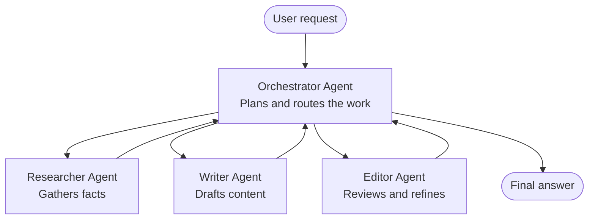

# Noções Básicas de Multi-Agente - Desdobre o Seu Primeiro Sistema de IA Coordenado

**Navegação do Capítulo:**
- **📚 Início do Curso**: [AZD Para Iniciantes](../../README.md)
- **📖 Capítulo Atual**: Capítulo 5 - Soluções de IA Multi-Agente
- **⬅️ Anterior**: [Capítulo 4: Infraestrutura](../chapter-04-infrastructure/README.md)
- **➡️ Seguinte**: [Padrões de Coordenação](../chapter-06-pre-deployment/coordination-patterns.md)

> Instruções de comando revistas de acordo com a referência lançada `azd 1.37.2`. Implantações na cloud não foram executadas.

## Introdução

Nos capítulos anteriores, implantou uma aplicação única—e no Capítulo 2 implantou um agente de IA único. Esta lição dá o próximo passo: implantar um **sistema multi-agente**, onde vários agentes especializados trabalham juntos para resolver um problema que nenhum agente isolado conseguiria resolver bem por si só.

A boa notícia para iniciantes: **não precisa de comandos novos.** Uma solução multi-agente continua a ser um projeto azd. Vai `azd init`, `azd up`, testar e `azd down`—exatamente o fluxo de trabalho que já conhece. O que muda é a *forma* da aplicação por dentro.

## Objetivos de Aprendizagem

No final desta lição, irá:
- Compreender o que significa "multi-agente" e quando vale a pena a complexidade adicional
- Reconhecer os papéis comuns num sistema multi-agente (orquestrador + especialistas)
- Implantar um modelo multi-agente real e funcional com `azd up`
- Compreender os recursos Azure que suportam uma aplicação multi-agente
- Saber como verificar, personalizar e desmontar a solução com segurança

## Resultados de Aprendizagem

Após completar esta lição, será capaz de:
- Explicar a diferença entre um agente único e um sistema multi-agente
- Escolher entre um agente único com ferramentas e um verdadeiro design multi-agente
- Implantar e testar um modelo multi-agente de ponta a ponta com azd
- Identificar onde cada agente corre e como comunicam entre si
- Limpar todos os recursos para evitar cobranças contínuas

---

## O Que é um Sistema Multi-Agente?

Um agente de IA único é um modelo com um conjunto de instruções e (opcionalmente) algumas ferramentas. Isso funciona bem para tarefas focadas. Mas à medida que uma tarefa cresce—pesquisa, depois escrita, depois edição, depois verificação de factos—embutir tudo numa única prompt torna o agente mais lento, menos fiável e mais difícil de depurar.

Um **sistema multi-agente** divide o trabalho em especialistas que cada um faz uma tarefa bem, coordenados por um orquestrador:


```mermaid
graph TD
    User([User request]) --> Orchestrator[Orchestrator Agent<br/>Plans and routes the work]
    Orchestrator --> Researcher[Researcher Agent<br/>Gathers facts]
    Orchestrator --> Writer[Writer Agent<br/>Drafts content]
    Orchestrator --> Editor[Editor Agent<br/>Reviews and refines]
    Researcher --> Orchestrator
    Writer --> Orchestrator
    Editor --> Orchestrator
    Orchestrator --> Result([Final answer])
```

### Os dois papéis que verá sempre

| Papel | Trabalho | Exemplo |
|------|-----|---------|
| **Orquestrador** | Decide *o que acontece a seguir* e encaminha o trabalho entre agentes | "Primeiro pesquisa, depois escreve, depois edita" |
| **Especialista** | Faz uma tarefa focada e devolve um resultado | Um "pesquisador" que só recolhe factos |

### Precisa mesmo de múltiplos agentes?

Comece simples. Recorra a multi-agente **apenas** quando uma destas condições for verdadeira:

- ✅ A tarefa tem **etapas distintas** que beneficiam de instruções diferentes (pesquisa vs. escrita vs. revisão)
- ✅ Quer especialistas a funcionar **em paralelo** para ganhar tempo
- ✅ Passos diferentes precisam de **ferramentas ou fontes de dados diferentes**
- ✅ Precisa que cada passo seja **testável e depurável de forma independente**

Se a sua tarefa for uma simples pergunta e resposta ou uma chamada a ferramenta simples, um **agente único com ferramentas** (Capítulo 2) é mais simples, barato e fácil de operar.

> **Dica para iniciantes:** "Mais agentes" não é "melhor." Cada agente adiciona latência, custo e uma nova coisa para monitorizar. Adicione agentes só quando o problema se dividir claramente em partes.

---

## Duas Formas de Construir Multi-Agente na Azure

| Abordagem | O que é | Melhor para |
|----------|-----------|----------|
| **Agente único + ferramentas** | Um agente Foundry que chama funções/ferramentas | Fluxos simples, começar |
| **Múltiplos agentes coordenados** | Vários agentes com um orquestrador | Etapas distintas, trabalho paralelo, especialização |

Esta lição foca-se na segunda abordagem usando um **modelo pronto a usar**, para que possa ver um sistema multi-agente real a correr antes de construir o seu próprio.

---

## Prática: Desdobre Uma Aplicação Multi-Agente Funcional

Vamos desdobrar **Contoso Creative Writer**, um exemplo oficial da Azure que coordena agentes de pesquisa, produto, escrita e edição para produzir um artigo. Antes de continuar, verifique os [pré-requisitos e custos do exemplo](https://github.com/Azure-Samples/contoso-creative-writer#azure-account-requirements): precisa de quota de modelos, Azure AI Search, acesso ao Bing Grounding, Python, Docker e hooks compatíveis com Bash. A disponibilidade de modelos e regiões depende da sua subscrição; a implantação não é garantida ao escolher uma região específica.

### Passo 1: Inicializar o modelo

```bash
# Create a working folder
mkdir creative-writer && cd creative-writer

# Initialize from the official multi-agent template
azd init --template Azure-Samples/contoso-creative-writer .
```

> Navegue por mais modelos multi-agente a qualquer momento na [galeria Awesome AZD AI](https://azure.github.io/awesome-azd/?tags=ai). Outras opções amigáveis para iniciantes incluem `get-started-with-ai-agents` e `azure-ai-travel-agents`.

### Passo 2: Autenticar

```bash
# Required for azd workflows
azd auth login

# Also required by this sample's Azure CLI hooks
az login
```

### Passo 3: Conferir o ambiente

```bash
# init normally creates/selects an environment; confirm it before proceeding
azd env list
# Only if you need an additional environment:
# azd env new dev
```

### Passo 4: Pré-visualizar, depois implantar

```bash
# See what will be created before spending anything (recommended)
azd provision --preview

# Provision infrastructure and deploy all agents in one step
azd up
```

`azd up` vai pedir as definições em falta de subscrição e região, depois provisionar recursos e implantar a aplicação. A pré-visualização não reserva quota nem garante sucesso; hooks do modelo podem ainda correr durante a pré-visualização do provisionamento, por isso verifique-os primeiro. Para estender o tempo que azd espera por cada **implantação de serviço** (não o provisionamento do modelo):

```bash
azd deploy --timeout 1800
```

Um timeout para azd de esperar; não cancela a implantação na Azure. Verifique o estado do recurso antes de tentar novamente.

> **Aviso sobre custo e capacidade:** Aplicações multi-agente implantam modelos de IA que consomem quota e geram custo. Se `azd up` falhar na quota de modelos, veja [Resolução de Problemas de IA](../chapter-07-troubleshooting/ai-troubleshooting.md) para correções de região e quota, e o Capítulo 6 [Planeamento de Capacidade](../chapter-06-pre-deployment/capacity-planning.md).

---

## Compreender o Que Implantou

Uma aplicação multi-agente típica como esta provisiona um conjunto de recursos Azure que correspondem diretamente às responsabilidades do diagrama acima:

| Recurso | Razão da Existência |
|----------|----------------|
| **Microsoft Foundry / Modelos** | Hospeda os modelos de linguagem que cada agente usa |
| **Azure AI Search** | Proporciona ao agente pesquisador dados fundamentados para pesquisa |
| **Container Apps** (ou App Service) | Hospeda o código do orquestrador e dos agentes |
| **Cosmos DB** (em alguns exemplos) | Armazena estado/memória partilhada passada entre agentes |
| **Application Insights** | Traça pedidos *através* dos agentes para que possa depurar o fluxo |

### Como os agentes falam entre si

Na maioria dos exemplos azd multi-agente, o **orquestrador corre no seu código de aplicação** (por exemplo, usando uma framework como Semantic Kernel ou o Microsoft Agent Framework). O orquestrador chama cada agente especialista por sua vez, passa os resultados e monta a resposta final. Os agentes partilham contexto através de:

- **Chamadas de função/ferramenta** — o orquestrador invoca um especialista e obtém um resultado de volta
- **Memória partilhada** — uma base de dados (geralmente Cosmos DB) mantém estado que ambos os agentes podem ler
- **Mensagens/eventos** — para um acoplamento mais frouxo, os agentes comunicam via uma fila ou Service Bus

> **Porque isto é importante para depuração:** porque cada passo é separado, o Application Insights mostra-lhe *qual* agente foi lento ou falhou. Essa é uma das principais razões para dividir o trabalho entre agentes desde o início.

---

## Verificar a Implantação

Confirme que o sistema está realmente a funcionar antes de avançar:

```bash
# Show the deployed endpoints
azd show

# Open the app's monitoring dashboard
azd monitor

# Open Application Insights Logs (not a terminal log stream)
azd monitor --logs
```

Depois abra a URL da aplicação a partir do `azd show` e peça um artigo curto. Use a vista de depuração do exemplo para inspecionar o fluxo de trabalho do agente. A pesquisa de transações do Application Insights só pode mostrar os passos individuais se o exemplo instrumentar e correlacionar; o azd não adiciona automaticamente spans dos agentes.

**Critérios de sucesso:**
- ✅ `azd show` lista um endpoint acessível
- ✅ Um pedido produz um resultado que claramente passou por várias etapas
- ✅ A vista de depuração mostra múltiplos passos dos agentes; se o tracing estiver ativado, verifique a telemetria correspondente após ingestão

---

## Personalizar: Adicionar ou Ajustar um Agente

Porque cada agente é apenas instruções mais ferramentas, a personalização é acessível:

1. **Encontre as definições do agente** no modelo (muitas vezes um conjunto de ficheiros `prompts/`, `agents/`, ou `*.prompty`).
2. **Ajuste as instruções de um agente** — por exemplo, diga ao agente editor para impor um tom ou contagem de palavras específica.
3. **Reimplante apenas o código** (a infraestrutura mantém-se igual):

   ```bash
   azd deploy
   ```

Para ir mais longe com o seu próprio projeto de agente Foundry, use a inicialização interativa da extensão de agentes:

```bash
azd extension install azure.ai.agents
azd ai agent init
azd up
azd ai agent invoke      # test, with response timing
```

Veja [Capítulo 2: Agentes](../chapter-02-ai-development/agents.md) e a [referência AZD AI CLI](../chapter-08-production/production-ai-practices.md#azd-ai-cli-commands-and-extensions) para todo o ciclo de vida: agente `invoke`, o fluxo de trabalho separado de avaliações da extensão `azd ai eval`, agente `optimize` e agente `delete`.

---

## Limpar

Aplicações multi-agente executam múltiplos serviços faturáveis. Desmonte tudo quando terminar:

```bash
# Review the resources and confirm deletion interactively
azd down
```

A eliminação é destrutiva. Para um laboratório descartável, `azd down --force --purge` ignora a eliminação e as confirmações suportadas de limpeza por soft-delete; limpar é irreversível onde suportado e pode ser bloqueado pela proteção contra limpeza. A eliminação suave é uma preocupação de recuperação/reuso de nome, não uma prova de cobranças contínuas. Verifique recursos retidos e faturação após a limpeza.

---

## Uma Nota Sobre Sistemas Multi-Agente em Produção

A [Solução Multi-Agente de Retalho](../../examples/retail-scenario.md) neste repositório é um **plano arquitetónico**, não um modelo de um só comando—documenta como um sistema de produção para retalho *seria* construído (e é explícito que uma construção completa é um esforço substancial). Use-o como referência de design *depois* de ter implantado um exemplo funcional aqui. Para preocupações de produção (resiliência, custo, monitorização, governação), continue para o [Capítulo 8: Práticas de IA em Produção](../chapter-08-production/production-ai-practices.md).

---

## Resumo

- Um sistema multi-agente divide o trabalho entre especialistas coordenados por um orquestrador.
- Use-o apenas quando a tarefa tem etapas distintas, paralelismo ou ferramentas diferentes por passo—caso contrário prefira um agente único.
- O fluxo de trabalho azd mantém-se inalterado: `azd init` → `azd up` → testar → `azd down`.
- Um modelo real como `contoso-creative-writer` permite ver e personalizar uma aplicação multi-agente funcional hoje.
- O tracing do Application Insights através dos agentes é um dos maiores benefícios práticos do design multi-agente.

---

## 🔗 Navegação

| Direção | Lição |
|-----------|--------|
| **Anterior** | [Capítulo 4: Infraestrutura](../chapter-04-infrastructure/README.md) |
| **Seguinte** | [Padrões de Coordenação](../chapter-06-pre-deployment/coordination-patterns.md) |

## 📖 Recursos Relacionados

- [Guia de Agentes de IA](../chapter-02-ai-development/agents.md)
- [Padrões de Coordenação](../chapter-06-pre-deployment/coordination-patterns.md)
- [Práticas de IA em Produção](../chapter-08-production/production-ai-practices.md)
- [Resolução de Problemas de IA](../chapter-07-troubleshooting/ai-troubleshooting.md)

---

<!-- CO-OP TRANSLATOR DISCLAIMER START -->
**Aviso Legal**:
Este documento foi traduzido utilizando o serviço de tradução automática [Co-op Translator](https://github.com/Azure/co-op-translator). Embora nos esforcemos pela precisão, esteja ciente de que traduções automáticas podem conter erros ou imprecisões. O documento original na sua língua nativa deve ser considerado a fonte autorizada. Para informações críticas, recomenda-se tradução profissional humana. Não nos responsabilizamos por quaisquer mal-entendidos ou interpretações incorretas resultantes da utilização desta tradução.
<!-- CO-OP TRANSLATOR DISCLAIMER END -->