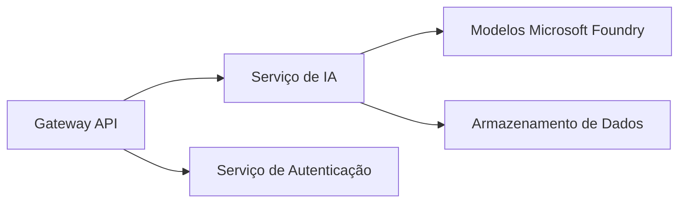
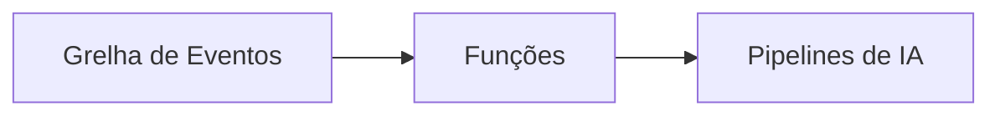

# Capítulo 8: Padrões de Produção & Empresa

**📚 Curso**: [AZD Para Iniciantes](../../README.md) | **⏱️ Duração**: 2-3 horas | **⭐ Complexidade**: Avançado

---

## Visão Geral

Este capítulo abrange padrões de implementação prontos para empresa, reforço de segurança, monitorização e otimização de custos para cargas de trabalho de IA em produção.

> Validado com `azd 1.27.1` em julho de 2026.

## Objetivos de Aprendizagem

Ao completar este capítulo, irá:
- Implementar aplicações resilientes multi-região
- Implementar padrões de segurança empresariais
- Configurar monitorização abrangente
- Otimizar custos em grande escala
- Configurar pipelines CI/CD com AZD

---

## 📚 Lições

| # | Aula | Descrição | Duração |
|---|--------|-------------|------|
| 1 | [Práticas de IA em Produção](production-ai-practices.md) | Padrões de implementação empresariais | 90 min |

---

## 🚀 Lista de Verificação para Produção

- [ ] Implementação multi-região para resiliência
- [ ] Identidade gerida para autenticação (sem chaves)
- [ ] Application Insights para monitorização
- [ ] Orçamentos e alertas de custo configurados
- [ ] Análise de segurança ativada
- [ ] Integração de pipeline CI/CD
- [ ] Plano de recuperação de desastres

---

## 🏗️ Padrões de Arquitectura

### Padrão 1: IA de Microserviços



### Padrão 2: IA Orientada a Eventos



---

## 🔐 Melhores Práticas de Segurança

```bicep
// Use managed identity
identity: {
  type: 'SystemAssigned'
}

// Private endpoints for AI services
properties: {
  publicNetworkAccess: 'Disabled'
  networkAcls: {
    defaultAction: 'Deny'
  }
}
```

---

## 💰 Otimização de Custos

| Estratégia | Poupança |
|----------|---------|
| Escalar para zero (Container Apps) | 60-80% |
| Usar níveis de consumo para desenvolvimento | 50-70% |
| Escalonamento programado | 30-50% |
| Capacidade reservada | 20-40% |

```bash
# Definir alertas de orçamento
az consumption budget create \
  --budget-name "AI-Budget" \
  --amount 500 \
  --category Cost \
  --time-grain Monthly
```

---

## 📊 Configuração de Monitorização

```bash
# Transmitir registos
azd monitor --logs

# Verificar o Application Insights
azd monitor --overview

# Ver métricas
az monitor metrics list --resource <resource-id>
```

---

## 🔗 Navegação

| Direção | Capítulo |
|-----------|---------|
| **Anterior** | [Capítulo 7: Resolução de Problemas](../chapter-07-troubleshooting/README.md) |
| **Curso Completo** | [Página Inicial do Curso](../../README.md) |

---

## 📖 Recursos Relacionados

- [Guia de Agentes de IA](../chapter-02-ai-development/agents.md)
- [Application Insights](../chapter-06-pre-deployment/application-insights.md)
- [Soluções Multi-Agente](../chapter-05-multi-agent/README.md)
- [Exemplo de Microserviços](../../examples/microservices/README.md)

---

<!-- CO-OP TRANSLATOR DISCLAIMER START -->
**Aviso Legal**:
Este documento foi traduzido utilizando o serviço de tradução automática [Co-op Translator](https://github.com/Azure/co-op-translator). Embora nos esforcemos pela precisão, esteja ciente de que traduções automáticas podem conter erros ou imprecisões. O documento original na sua língua nativa deve ser considerado a fonte autorizada. Para informações críticas, recomenda-se tradução profissional humana. Não nos responsabilizamos por quaisquer mal-entendidos ou interpretações incorretas resultantes da utilização desta tradução.
<!-- CO-OP TRANSLATOR DISCLAIMER END -->