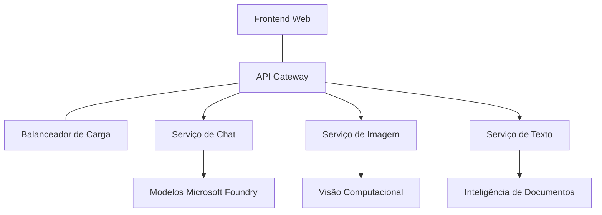

# Práticas Recomendadas para Cargas de Trabalho AI em Produção com AZD

**Navegação do Capítulo:**
- **📚 Início do Curso**: [AZD Para Iniciantes](../../README.md)
- **📖 Capítulo Atual**: Capítulo 8 - Padrões de Produção & Empresariais
- **⬅️ Capítulo Anterior**: [Capítulo 7: Solução de Problemas](../chapter-07-troubleshooting/debugging.md)
- **⬅️ Também Relacionado**: [Laboratório do Workshop de IA](ai-workshop-lab.md)
- **🎯 Curso Completo**: [AZD Para Iniciantes](../../README.md)

## Visão Geral

Este guia fornece práticas recomendadas abrangentes para implementar cargas de trabalho AI prontas para produção usando o Azure Developer CLI (AZD). Baseado no feedback da comunidade do Discord Microsoft Foundry e em implementações reais de clientes, essas práticas abordam os desafios mais comuns em sistemas AI de produção.

## Principais Desafios Abordados

Com base nos resultados da nossa sondagem comunitária, estes são os principais desafios enfrentados pelos desenvolvedores:

- **45%** têm dificuldades com implementações AI multissserviço
- **38%** enfrentam problemas com gestão de credenciais e segredos  
- **35%** acham difícil a prontidão para produção e o dimensionamento
- **32%** precisam de melhores estratégias de otimização de custos
- **29%** requerem monitorização e solução de problemas aprimoradas

## Padrões de Arquitetura para AI em Produção

### Padrão 1: Arquitetura AI de Microserviços

**Quando usar**: Aplicações AI complexas com múltiplas capacidades


**Implementação AZD**:

```yaml
# azure.yaml
name: enterprise-ai-platform
services:
  web:
    project: ./web
    host: staticwebapp
  api-gateway:
    project: ./api-gateway
    host: containerapp
  chat-service:
    project: ./services/chat
    host: containerapp
  vision-service:
    project: ./services/vision
    host: containerapp
  text-service:
    project: ./services/text
    host: containerapp
```

### Padrão 2: Processamento AI Orientado a Eventos

**Quando usar**: Processamento em batch, análise de documentos, fluxos de trabalho assíncronos

```bicep
// Event Hub for AI processing pipeline
resource eventHub 'Microsoft.EventHub/namespaces@2023-01-01-preview' = {
  name: eventHubNamespaceName
  location: location
  sku: {
    name: 'Standard'
    tier: 'Standard'
    capacity: 1
  }
}

// Service Bus for reliable message processing
resource serviceBus 'Microsoft.ServiceBus/namespaces@2022-10-01-preview' = {
  name: serviceBusNamespaceName
  location: location
  sku: {
    name: 'Premium'
    tier: 'Premium'
    capacity: 1
  }
}

// Function App for processing
resource functionApp 'Microsoft.Web/sites@2023-01-01' = {
  name: functionAppName
  location: location
  kind: 'functionapp,linux'
  properties: {
    siteConfig: {
      appSettings: [
        {
          name: 'FUNCTIONS_EXTENSION_VERSION'
          value: '~4'
        }
        {
          name: 'AZURE_OPENAI_ENDPOINT'
          value: '@Microsoft.KeyVault(VaultName=${keyVault.name};SecretName=openai-endpoint)'
        }
      ]
    }
  }
}
```

## Pensando Sobre a Saúde do Agente AI

Quando uma aplicação web tradicional falha, os sintomas são familiares: uma página não carrega, uma API retorna um erro, ou uma implementação falha. Aplicações alimentadas por AI podem falhar dessas mesmas formas — mas também podem comportar-se de maneiras mais subtis que não produzem mensagens de erro óbvias.

Esta seção ajuda a construir um modelo mental para monitorar cargas de trabalho AI para que saiba onde procurar quando as coisas não parecem certas.

### Como a Saúde do Agente Difere da Saúde de Aplicações Tradicionais

Uma aplicação tradicional funciona ou não funciona. Um agente AI pode parecer funcionar, mas produzir resultados pobres. Pense na saúde do agente em dois níveis:

| Camada | O Que Observar | Onde Procurar |
|--------|----------------|---------------|
| **Saúde da infraestrutura** | O serviço está a correr? Os recursos estão provisionados? Os endpoints são acessíveis? | `azd monitor`, saúde de recursos no Azure Portal, logs de contentores/aplicações |
| **Saúde do comportamento** | O agente responde corretamente? As respostas são atempadas? O modelo está a ser chamado corretamente? | Rastreios do Application Insights, métricas de latência nas chamadas ao modelo, logs de qualidade da resposta |

A saúde da infraestrutura é familiar — é igual para qualquer app azd. A saúde do comportamento é a camada nova que cargas de trabalho AI introduzem.

### Onde Procurar Quando Aplicações AI Não Se Comportam Como Esperado

Se a sua aplicação AI não está a produzir os resultados que espera, aqui está uma lista conceptual para investigação:

1. **Comece pelo básico.** A aplicação está a correr? Consegue alcançar as suas dependências? Verifique `azd monitor` e a saúde dos recursos tal como faria para qualquer app.
2. **Verifique a conexão com o modelo.** A sua aplicação está a chamar o modelo AI com sucesso? Chamadas falhadas ou que expiram são a causa mais comum de problemas em apps AI e aparecerão nos logs da aplicação.
3. **Veja o que o modelo recebeu.** As respostas AI dependem da entrada (o prompt e qualquer contexto recuperado). Se o resultado estiver errado, normalmente a entrada está incorreta. Verifique se a sua aplicação está a enviar os dados corretos ao modelo.
4. **Revise a latência da resposta.** Chamadas a modelos AI são mais lentas que chamadas API típicas. Se a sua app parecer lenta, verifique se o tempo de resposta do modelo aumentou — isso pode indicar limitação, limites de capacidade ou congestionamento a nível regional.
5. **Atente nos sinais de custo.** Picos inesperados no uso de tokens ou chamadas API podem indicar um ciclo, um prompt mal configurado ou tentativas excessivas.

Não precisa dominar imediatamente as ferramentas de observabilidade. O mais importante é entender que aplicações AI têm uma camada extra de comportamento para monitorizar, e o monitoramento integrado azd (`azd monitor`) oferece um ponto de partida para investigar ambas as camadas.

---

## Práticas Recomendadas de Segurança

### 1. Modelo de Segurança Zero-Trust

**Estratégia de Implementação**:
- Nenhuma comunicação serviço-a-serviço sem autenticação
- Todas as chamadas API usam identidades geridas
- Isolamento de rede com endpoints privados
- Controlo de acesso com privilégios mínimos

```bicep
// Managed Identity for each service
resource chatServiceIdentity 'Microsoft.ManagedIdentity/userAssignedIdentities@2023-01-31' = {
  name: 'chat-service-identity'
  location: location
}

// Role assignments with minimal permissions
resource openAIUserRole 'Microsoft.Authorization/roleAssignments@2022-04-01' = {
  scope: openAIAccount
  name: guid(openAIAccount.id, chatServiceIdentity.id, openAIUserRoleDefinitionId)
  properties: {
    roleDefinitionId: subscriptionResourceId('Microsoft.Authorization/roleDefinitions', '5e0bd9bd-7b93-4f28-af87-19fc36ad61bd')
    principalId: chatServiceIdentity.properties.principalId
    principalType: 'ServicePrincipal'
  }
}
```

### 2. Gestão Segura de Segredos

**Padrão de Integração do Key Vault**:

```bicep
// Key Vault with proper access policies
resource keyVault 'Microsoft.KeyVault/vaults@2023-02-01' = {
  name: keyVaultName
  location: location
  properties: {
    tenantId: tenant().tenantId
    sku: {
      family: 'A'
      name: 'premium'  // Use premium for production
    }
    enableRbacAuthorization: true  // Use RBAC instead of access policies
    enablePurgeProtection: true    // Prevent accidental deletion
    enableSoftDelete: true
    softDeleteRetentionInDays: 90
  }
}

// Store all AI service credentials
resource openAIKeySecret 'Microsoft.KeyVault/vaults/secrets@2023-02-01' = {
  parent: keyVault
  name: 'openai-api-key'
  properties: {
    value: openAIAccount.listKeys().key1
    attributes: {
      enabled: true
    }
  }
}
```

### 3. Segurança de Rede

**Configuração de Endpoint Privado**:

```bicep
// Virtual Network for AI services
resource virtualNetwork 'Microsoft.Network/virtualNetworks@2023-04-01' = {
  name: vnetName
  location: location
  properties: {
    addressSpace: {
      addressPrefixes: ['10.0.0.0/16']
    }
    subnets: [
      {
        name: 'ai-services-subnet'
        properties: {
          addressPrefix: '10.0.1.0/24'
          privateEndpointNetworkPolicies: 'Disabled'
        }
      }
      {
        name: 'app-services-subnet'
        properties: {
          addressPrefix: '10.0.2.0/24'
          delegations: [
            {
              name: 'Microsoft.Web/serverFarms'
              properties: {
                serviceName: 'Microsoft.Web/serverFarms'
              }
            }
          ]
        }
      }
    ]
  }
}

// Private endpoints for all AI services
resource openAIPrivateEndpoint 'Microsoft.Network/privateEndpoints@2023-04-01' = {
  name: '${openAIAccountName}-pe'
  location: location
  properties: {
    subnet: {
      id: virtualNetwork.properties.subnets[0].id
    }
    privateLinkServiceConnections: [
      {
        name: 'openai-connection'
        properties: {
          privateLinkServiceId: openAIAccount.id
          groupIds: ['account']
        }
      }
    ]
  }
}
```

## Desempenho e Dimensionamento

### 1. Estratégias de Autoescala

**Autoescala para Container Apps**:

```bicep
resource containerApp 'Microsoft.App/containerApps@2023-05-01' = {
  name: containerAppName
  location: location
  properties: {
    configuration: {
      ingress: {
        external: true
        targetPort: 8000
        transport: 'http'
      }
    }
    template: {
      scale: {
        minReplicas: 2  // Always have 2 instances minimum
        maxReplicas: 50 // Scale up to 50 for high load
        rules: [
          {
            name: 'http-scaling'
            http: {
              metadata: {
                concurrentRequests: '20'  // Scale when >20 concurrent requests
              }
            }
          }
          {
            name: 'cpu-scaling'
            custom: {
              type: 'cpu'
              metadata: {
                type: 'Utilization'
                value: '70'  // Scale when CPU >70%
              }
            }
          }
        ]
      }
    }
  }
}
```

### 2. Estratégias de Cache

**Cache Redis para Respostas AI**:

```bicep
// Redis Premium for production workloads
resource redisCache 'Microsoft.Cache/redis@2023-04-01' = {
  name: redisCacheName
  location: location
  properties: {
    sku: {
      name: 'Premium'
      family: 'P'
      capacity: 1
    }
    enableNonSslPort: false
    minimumTlsVersion: '1.2'
    redisConfiguration: {
      'maxmemory-policy': 'allkeys-lru'
    }
    // Enable clustering for high availability
    redisVersion: '6.0'
    shardCount: 2
  }
}

// Cache configuration in application
var cacheConnectionString = '${redisCache.properties.hostName}:6380,password=${redisCache.listKeys().primaryKey},ssl=True,abortConnect=False'
```

### 3. Balanceamento de Carga e Gestão de Tráfego

**Application Gateway com WAF**:

```bicep
// Application Gateway with Web Application Firewall
resource applicationGateway 'Microsoft.Network/applicationGateways@2023-04-01' = {
  name: appGatewayName
  location: location
  properties: {
    sku: {
      name: 'WAF_v2'
      tier: 'WAF_v2'
      capacity: 2
    }
    webApplicationFirewallConfiguration: {
      enabled: true
      firewallMode: 'Prevention'
      ruleSetType: 'OWASP'
      ruleSetVersion: '3.2'
    }
    // Backend pools for AI services
    backendAddressPools: [
      {
        name: 'ai-services-pool'
        properties: {
          backendAddresses: [
            {
              fqdn: '${containerApp.properties.configuration.ingress.fqdn}'
            }
          ]
        }
      }
    ]
  }
}
```

## 💰 Otimização de Custos

### 1. Dimensionamento Adequado de Recursos

**Configurações Específicas para Ambiente**:

```bash
# Ambiente de desenvolvimento
azd env new development
azd env set AZURE_OPENAI_SKU "S0"
azd env set AZURE_OPENAI_CAPACITY 10
azd env set AZURE_SEARCH_SKU "basic"
azd env set CONTAINER_CPU 0.5
azd env set CONTAINER_MEMORY 1.0

# Ambiente de produção
azd env new production
azd env set AZURE_OPENAI_SKU "S0"
azd env set AZURE_OPENAI_CAPACITY 100
azd env set AZURE_SEARCH_SKU "standard"
azd env set CONTAINER_CPU 2.0
azd env set CONTAINER_MEMORY 4.0
```

### 2. Monitorização de Custos e Orçamentos

```bicep
// Cost management and budgets
resource budget 'Microsoft.Consumption/budgets@2023-05-01' = {
  name: 'ai-workload-budget'
  properties: {
    timePeriod: {
      startDate: '2024-01-01'
      endDate: '2024-12-31'
    }
    timeGrain: 'Monthly'
    amount: 2000  // $2000 monthly budget
    category: 'Cost'
    notifications: {
      warning: {
        enabled: true
        operator: 'GreaterThan'
        threshold: 80
        contactEmails: [
          'finance@company.com'
          'engineering@company.com'
        ]
        contactRoles: [
          'Owner'
          'Contributor'
        ]
      }
      critical: {
        enabled: true
        operator: 'GreaterThan'
        threshold: 95
        contactEmails: [
          'cto@company.com'
        ]
      }
    }
  }
}
```

### 3. Optimização do Uso de Tokens

**Gestão de Custos OpenAI**:

```typescript
// Otimização de tokens ao nível da aplicação
class TokenOptimizer {
  private readonly maxTokens = 4000;
  private readonly reserveTokens = 500;
  
  optimizePrompt(userInput: string, context: string): string {
    const availableTokens = this.maxTokens - this.reserveTokens;
    const estimatedTokens = this.estimateTokens(userInput + context);
    
    if (estimatedTokens > availableTokens) {
      // Truncar contexto, não a entrada do utilizador
      context = this.truncateContext(context, availableTokens - this.estimateTokens(userInput));
    }
    
    return `${context}\n\nUser: ${userInput}`;
  }
  
  private estimateTokens(text: string): number {
    // Estimativa aproximada: 1 token ≈ 4 caracteres
    return Math.ceil(text.length / 4);
  }
}
```

## Monitorização e Observabilidade

### 1. Application Insights Abrangente

```bicep
// Application Insights with advanced features
resource applicationInsights 'Microsoft.Insights/components@2020-02-02' = {
  name: applicationInsightsName
  location: location
  kind: 'web'
  properties: {
    Application_Type: 'web'
    WorkspaceResourceId: logAnalyticsWorkspace.id
    SamplingPercentage: 100  // Full sampling for AI apps
    DisableIpMasking: false  // Enable for security
  }
}

// Custom metrics for AI operations
resource aiMetricAlerts 'Microsoft.Insights/metricAlerts@2018-03-01' = {
  name: 'ai-high-error-rate'
  location: 'global'
  properties: {
    description: 'Alert when AI service error rate is high'
    severity: 2
    enabled: true
    scopes: [
      applicationInsights.id
    ]
    evaluationFrequency: 'PT1M'
    windowSize: 'PT5M'
    criteria: {
      'odata.type': 'Microsoft.Azure.Monitor.SingleResourceMultipleMetricCriteria'
      allOf: [
        {
          name: 'high-error-rate'
          metricName: 'requests/failed'
          operator: 'GreaterThan'
          threshold: 10
          timeAggregation: 'Count'
        }
      ]
    }
  }
}
```

### 2. Monitorização Específica para AI

**Dashboards Personalizados para Métricas AI**:

```json
// Dashboard configuration for AI workloads
{
  "dashboard": {
    "name": "AI Application Monitoring",
    "tiles": [
      {
        "name": "OpenAI Request Volume",
        "query": "requests | where name contains 'openai' | summarize count() by bin(timestamp, 5m)"
      },
      {
        "name": "AI Response Latency",
        "query": "requests | where name contains 'openai' | summarize avg(duration) by bin(timestamp, 5m)"
      },
      {
        "name": "Token Usage",
        "query": "customMetrics | where name == 'openai_tokens_used' | summarize sum(value) by bin(timestamp, 1h)"
      },
      {
        "name": "Cost per Hour",
        "query": "customMetrics | where name == 'openai_cost' | summarize sum(value) by bin(timestamp, 1h)"
      }
    ]
  }
}
```

### 3. Verificações de Saúde e Monitorização de Disponibilidade

```bicep
// Application Insights availability tests
resource availabilityTest 'Microsoft.Insights/webtests@2022-06-15' = {
  name: 'ai-app-availability-test'
  location: location
  tags: {
    'hidden-link:${applicationInsights.id}': 'Resource'
  }
  properties: {
    SyntheticMonitorId: 'ai-app-availability-test'
    Name: 'AI Application Availability Test'
    Description: 'Tests AI application endpoints'
    Enabled: true
    Frequency: 300  // 5 minutes
    Timeout: 120    // 2 minutes
    Kind: 'ping'
    Locations: [
      {
        Id: 'us-east-2-azr'
      }
      {
        Id: 'us-west-2-azr'
      }
    ]
    Configuration: {
      WebTest: '''
        <WebTest Name="AI Health Check" 
                 Id="8d2de8d2-a2b0-4c2e-9a0d-8f9c9a0b8c8d" 
                 Enabled="True" 
                 CssProjectStructure="" 
                 CssIteration="" 
                 Timeout="120" 
                 WorkItemIds="" 
                 xmlns="http://microsoft.com/schemas/VisualStudio/TeamTest/2010" 
                 Description="" 
                 CredentialUserName="" 
                 CredentialPassword="" 
                 PreAuthenticate="True" 
                 Proxy="default" 
                 StopOnError="False" 
                 RecordedResultFile="" 
                 ResultsLocale="">
          <Items>
            <Request Method="GET" 
                     Guid="a5f10126-e4cd-570d-961c-cea43999a200" 
                     Version="1.1" 
                     Url="${webApp.properties.defaultHostName}/health" 
                     ThinkTime="0" 
                     Timeout="120" 
                     ParseDependentRequests="True" 
                     FollowRedirects="True" 
                     RecordResult="True" 
                     Cache="False" 
                     ResponseTimeGoal="0" 
                     Encoding="utf-8" 
                     ExpectedHttpStatusCode="200" 
                     ExpectedResponseUrl="" 
                     ReportingName="" 
                     IgnoreHttpStatusCode="False" />
          </Items>
        </WebTest>
      '''
    }
  }
}
```

## Recuperação de Desastres e Alta Disponibilidade

### 1. Implementação Multi-Região

```yaml
# azure.yaml - Multi-region configuration
name: ai-app-multiregion
services:
  api-primary:
    project: ./api
    host: containerapp
    env:
      - AZURE_REGION=eastus
  api-secondary:
    project: ./api
    host: containerapp
    env:
      - AZURE_REGION=westus2
```

```bicep
// Traffic Manager for global load balancing
resource trafficManager 'Microsoft.Network/trafficManagerProfiles@2022-04-01' = {
  name: trafficManagerProfileName
  location: 'global'
  properties: {
    profileStatus: 'Enabled'
    trafficRoutingMethod: 'Priority'
    dnsConfig: {
      relativeName: trafficManagerProfileName
      ttl: 30
    }
    monitorConfig: {
      protocol: 'HTTPS'
      port: 443
      path: '/health'
      intervalInSeconds: 30
      toleratedNumberOfFailures: 3
      timeoutInSeconds: 10
    }
    endpoints: [
      {
        name: 'primary-endpoint'
        type: 'Microsoft.Network/trafficManagerProfiles/azureEndpoints'
        properties: {
          targetResourceId: primaryAppService.id
          endpointStatus: 'Enabled'
          priority: 1
        }
      }
      {
        name: 'secondary-endpoint'
        type: 'Microsoft.Network/trafficManagerProfiles/azureEndpoints'
        properties: {
          targetResourceId: secondaryAppService.id
          endpointStatus: 'Enabled'
          priority: 2
        }
      }
    ]
  }
}
```

### 2. Backup e Recuperação de Dados

```bicep
// Backup configuration for critical data
resource backupVault 'Microsoft.DataProtection/backupVaults@2023-05-01' = {
  name: backupVaultName
  location: location
  identity: {
    type: 'SystemAssigned'
  }
  properties: {
    storageSettings: [
      {
        datastoreType: 'VaultStore'
        type: 'LocallyRedundant'
      }
    ]
  }
}

// Backup policy for AI models and data
resource backupPolicy 'Microsoft.DataProtection/backupVaults/backupPolicies@2023-05-01' = {
  parent: backupVault
  name: 'ai-data-backup-policy'
  properties: {
    policyRules: [
      {
        backupParameters: {
          backupType: 'Full'
          objectType: 'AzureBackupParams'
        }
        trigger: {
          schedule: {
            repeatingTimeIntervals: [
              'R/2024-01-01T02:00:00+00:00/P1D'  // Daily at 2 AM
            ]
          }
          objectType: 'ScheduleBasedTriggerContext'
        }
        dataStore: {
          datastoreType: 'VaultStore'
          objectType: 'DataStoreInfoBase'
        }
        name: 'BackupDaily'
        objectType: 'AzureBackupRule'
      }
    ]
  }
}
```

## Integração DevOps e CI/CD

### 1. Workflow com GitHub Actions

```yaml
# .github/workflows/deploy-ai-app.yml
name: Deploy AI Application

on:
  push:
    branches: [main]
  pull_request:
    branches: [main]

jobs:
  test:
    runs-on: ubuntu-latest
    steps:
      - uses: actions/checkout@v4
      
      - name: Setup Python
        uses: actions/setup-python@v4
        with:
          python-version: '3.11'
          
      - name: Install dependencies
        run: |
          pip install -r requirements.txt
          pip install pytest
          
      - name: Run tests
        run: pytest tests/
        
      - name: AI Safety Tests
        run: |
          python scripts/test_ai_safety.py
          python scripts/validate_prompts.py

  deploy-staging:
    needs: test
    if: github.event_name == 'pull_request'
    runs-on: ubuntu-latest
    steps:
      - uses: actions/checkout@v4
      
      - name: Setup AZD
        uses: Azure/setup-azd@v2
        
      - name: Login to Azure
        uses: azure/login@v1
        with:
          creds: ${{ secrets.AZURE_CREDENTIALS }}
          
      - name: Deploy to Staging
        run: |
          azd env select staging
          azd deploy

  deploy-production:
    needs: test
    if: github.ref == 'refs/heads/main'
    runs-on: ubuntu-latest
    steps:
      - uses: actions/checkout@v4
      
      - name: Setup AZD
        uses: Azure/setup-azd@v2
        
      - name: Login to Azure
        uses: azure/login@v1
        with:
          creds: ${{ secrets.AZURE_CREDENTIALS }}
          
      - name: Deploy to Production
        run: |
          azd env select production
          azd deploy
          
      - name: Run Production Health Checks
        run: |
          python scripts/health_check.py --env production
```

### 2. Validação de Infraestrutura

```bash
# scripts/validate_infrastructure.sh
#!/bin/bash

echo "Validating AI infrastructure deployment..."

# Verificar se todos os serviços necessários estão a correr
services=("openai" "search" "storage" "keyvault")
for service in "${services[@]}"; do
    echo "Checking $service..."
    if ! az resource list --resource-type "Microsoft.CognitiveServices/accounts" --query "[?contains(name, '$service')]" -o tsv; then
        echo "ERROR: $service not found"
        exit 1
    fi
done

# Validar as implementações dos modelos OpenAI
echo "Validating OpenAI model deployments..."
models=$(az cognitiveservices account deployment list --name $AZURE_OPENAI_NAME --resource-group $AZURE_RESOURCE_GROUP --query "[].name" -o tsv)
if [[ ! $models == *"gpt-4.1-mini"* ]]; then
  echo "ERROR: Required model gpt-4.1-mini not deployed"
    exit 1
fi

# Testar a conectividade do serviço de IA
echo "Testing AI service connectivity..."
python scripts/test_connectivity.py

echo "Infrastructure validation completed successfully!"
```

## Checklist de Prontidão para Produção

### Segurança ✅
- [ ] Todos os serviços usam identidades geridas
- [ ] Segredos armazenados no Key Vault
- [ ] Endpoints privados configurados
- [ ] Grupos de segurança de rede implementados
- [ ] RBAC com privilégios mínimos
- [ ] WAF ativado em endpoints públicos

### Desempenho ✅
- [ ] Autoescala configurada
- [ ] Cache implementado
- [ ] Balanceamento de carga configurado
- [ ] CDN para conteúdo estático
- [ ] Pooling de conexões de base de dados
- [ ] Otimização do uso de tokens

### Monitorização ✅
- [ ] Application Insights configurado
- [ ] Métricas personalizadas definidas
- [ ] Regras de alerta configuradas
- [ ] Dashboard criado
- [ ] Verificações de saúde implementadas
- [ ] Políticas de retenção de logs

### Confiabilidade ✅
- [ ] Implementação multi-região
- [ ] Plano de backup e recuperação
- [ ] Circuit breakers implementados
- [ ] Políticas de retry configuradas
- [ ] Degradação graciosa
- [ ] Endpoints para checagem de saúde

### Gestão de Custos ✅
- [ ] Alertas de orçamento configurados
- [ ] Dimensionamento correto dos recursos
- [ ] Descontos para desenvolvimento/teste aplicados
- [ ] Instâncias reservadas compradas
- [ ] Dashboard de monitorização de custos
- [ ] Revisões regulares de custos

### Conformidade ✅
- [ ] Requisitos de residência dos dados cumpridos
- [ ] Logging de auditoria ativado
- [ ] Políticas de conformidade aplicadas
- [ ] Referenciais de segurança implementados
- [ ] Avaliações regulares de segurança
- [ ] Plano de resposta a incidentes

## Benchmarks de Desempenho

### Métricas Típicas em Produção

| Métrica | Objetivo | Monitorização |
|---------|----------|--------------|
| **Tempo de Resposta** | < 2 segundos | Application Insights |
| **Disponibilidade** | 99,9% | Monitorização de uptime |
| **Taxa de Erros** | < 0,1% | Logs da aplicação |
| **Uso de Tokens** | < $500/mês | Gestão de custos |
| **Utilizadores Concorrentes** | 1000+ | Testes de carga |
| **Tempo de Recuperação** | < 1 hora | Testes de recuperação de desastres |

### Testes de Carga

```bash
# Script de teste de carga para aplicações de IA
python scripts/load_test.py \
  --endpoint https://your-ai-app.azurewebsites.net \
  --concurrent-users 100 \
  --duration 300 \
  --ramp-up 60
```

## 🤝 Práticas Recomendadas pela Comunidade

Baseado no feedback da comunidade do Discord Microsoft Foundry:

### Principais Recomendações da Comunidade:

1. **Comece Pequeno e Escale Gradualmente**: Comece com SKUs básicos e aumente conforme o uso real
2. **Monitore Tudo**: Configure monitorização abrangente desde o primeiro dia
3. **Automatize a Segurança**: Use infraestrutura como código para segurança consistente
4. **Teste Exaustivamente**: Inclua testes específicos para AI no seu pipeline
5. **Planeie para os Custos**: Monitorize o uso de tokens e defina alertas de orçamento desde cedo

### Erros Comuns a Evitar:

- ❌ Codificar chaves API diretamente no código
- ❌ Não configurar monitorização adequada
- ❌ Ignorar a otimização de custos
- ❌ Não testar cenários de falha
- ❌ Implementar sem verificações de saúde

## Comandos e Extensões CLI AI AZD

O AZD inclui um conjunto crescente de comandos e extensões específicas para AI que simplificam os fluxos de trabalho AI em produção. Estas ferramentas fazem a ponte entre o desenvolvimento local e a implementação em produção para cargas de trabalho AI.

### Extensões AZD para AI

O AZD utiliza um sistema de extensões para adicionar capacidades AI específicas. Instale e gere extensões com:

```bash
# Listar todas as extensões disponíveis (incluindo IA)
azd extension list

# Inspecionar detalhes das extensões instaladas
azd extension show azure.ai.agents

# Instalar a extensão Foundry agents
azd extension install azure.ai.agents

# Instalar a extensão de ajuste fino
azd extension install azure.ai.finetune

# Instalar a extensão de modelos personalizados
azd extension install azure.ai.models

# Atualizar todas as extensões instaladas
azd extension upgrade --all
```

**Extensões AI disponíveis:**

| Extensão | Propósito | Estado |
|----------|-----------|--------|
| `azure.ai.agents` | Gestão do Serviço de Agentes Foundry | Pré-visualização |
| `azure.ai.finetune` | Fine-tuning de modelos Foundry | Pré-visualização |
| `azure.ai.models` | Modelos personalizados Foundry | Pré-visualização |
| `azure.coding-agent` | Configuração do agente de codificação | Disponível |

### Inicializar Projetos de Agente com `azd ai agent init`

O comando `azd ai agent init` gera um projeto de agente AI pronto para produção integrado com o Serviço de Agentes Microsoft Foundry:

```bash
# Inicializar um novo projeto de agente a partir de um manifesto de agente
azd ai agent init -m <manifest-path-or-uri>

# Inicializar e direcionar um projeto Foundry específico
azd ai agent init -m agent-manifest.yaml --project-id <foundry-project-id>

# Inicializar com um diretório de origem personalizado
azd ai agent init -m agent-manifest.yaml --src ./agents/my-agent

# Direcionar Container Apps como anfitrião
azd ai agent init -m agent-manifest.yaml --host containerapp
```

**Flags principais:**

| Flag | Descrição |
|-------|-----------|
| `-m, --manifest` | Caminho ou URI para um manifesto de agente a adicionar ao seu projeto |
| `-p, --project-id` | ID de Projeto Microsoft Foundry existente para o seu ambiente azd |
| `-s, --src` | Diretório para descarregar a definição do agente (padrão `src/<agent-id>`) |
| `--host` | Substitui o host padrão (exemplo: `containerapp`) |
| `-e, --environment` | O ambiente azd a utilizar |

**Dica para Produção**: Use `--project-id` para ligar diretamente a um projeto Foundry existente, mantendo o código do agente e os recursos cloud ligados desde o início.

### Protocolo de Contexto de Modelo (MCP) com `azd mcp`

O AZD inclui suporte integrado ao servidor MCP (Alpha), que permite que agentes AI e ferramentas interajam com os seus recursos Azure através de um protocolo padronizado:

```bash
# Inicie o servidor MCP para o seu projeto
azd mcp start

# Revise as regras atuais de consentimento do Copilot para execução de ferramentas
azd copilot consent list
```

O servidor MCP expõe o contexto do seu projeto azd — ambientes, serviços e recursos Azure — a ferramentas de desenvolvimento assistido por AI. Isto permite:

- **Implementação assistida por AI**: Permite que agentes de codificação consultem o estado do projeto e desencadeiem implementações
- **Descoberta de recursos**: Ferramentas AI podem descobrir quais recursos Azure o seu projeto usa
- **Gestão de ambientes**: Agentes podem alternar entre ambientes de desenvolvimento/staging/produção

### Geração de Infraestrutura com `azd infra generate`

Para cargas de trabalho AI em produção, pode gerar e personalizar Infraestrutura como Código em vez de confiar no provisionamento automático:

```bash
# Gerar ficheiros Bicep/Terraform a partir da definição do seu projeto
azd infra generate
```

Isto escreve o IaC em disco para poder:
- Rever e auditar a infraestrutura antes da implementação
- Adicionar políticas de segurança personalizadas (regras de rede, endpoints privados)
- Integrar-se com processos existentes de revisão IaC
- Controlar versões das alterações de infraestrutura separadamente do código da aplicação

### Hooks do Ciclo de Vida de Produção

Os hooks do AZD permitem injetar lógica personalizada em cada estágio do ciclo de vida da implementação — fundamental para fluxos AI em produção:

```yaml
# azure.yaml - Production hooks example
name: ai-production-app
hooks:
  preprovision:
    shell: sh
    run: scripts/validate-quotas.sh    # Check AI model quota before provisioning
  postprovision:
    shell: sh
    run: scripts/configure-networking.sh  # Set up private endpoints
  predeploy:
    shell: sh
    run: scripts/run-ai-safety-tests.sh  # Run prompt safety checks
  postdeploy:
    shell: sh
    run: scripts/smoke-test.sh           # Verify agent responses post-deploy
services:
  agent-api:
    project: ./src/agent
    host: containerapp
    hooks:
      predeploy:
        shell: sh
        run: scripts/validate-model-access.sh  # Per-service hook
```

```bash
# Executar um hook específico manualmente durante o desenvolvimento
azd hooks run predeploy
```

**Hooks recomendados para cargas de trabalho AI em produção:**

| Hook | Caso de Uso |
|-------|-------------|
| `preprovision` | Validar quotas de subscrição para capacidade de modelo AI |
| `postprovision` | Configurar endpoints privados, implementar pesos do modelo |
| `predeploy` | Executar testes de segurança AI, validar templates de prompt |
| `postdeploy` | Teste rápido das respostas do agente, verificar conectividade do modelo |

### Configuração de Pipeline CI/CD

Use `azd pipeline config` para ligar o seu projeto ao GitHub Actions ou Azure Pipelines com autenticação segura Azure:

```bash
# Configurar pipeline CI/CD (interativo)
azd pipeline config

# Configurar com um fornecedor específico
azd pipeline config --provider github
```

Este comando:
- Cria uma entidade de serviço com acesso de privilégio mínimo
- Configura credenciais federadas (sem segredos armazenados)
- Gera ou atualiza o ficheiro de definição do pipeline
- Define variáveis de ambiente necessárias no seu sistema CI/CD

**Fluxo de trabalho em produção com configuração de pipeline:**

```bash
# 1. Configurar o ambiente de produção
azd env new production
azd env set AZURE_OPENAI_CAPACITY 100

# 2. Configurar a pipeline
azd pipeline config --provider github

# 3. A pipeline executa azd deploy a cada push para o main
```

### Adicionando Componentes com `azd add`

Adicione incrementalmente serviços Azure a um projeto existente:

```bash
# Adicionar um novo componente de serviço de forma interactiva
azd add
```

Isto é particularmente útil para expandir aplicações AI em produção — por exemplo, adicionar um serviço de pesquisa vetorial, um novo endpoint de agente, ou um componente de monitorização a uma implementação existente.

## Recursos Adicionais
- **Azure Well-Architected Framework**: [Orientação para cargas de trabalho de IA](https://learn.microsoft.com/azure/well-architected/ai/)
- **Documentação Microsoft Foundry**: [Documentos oficiais](https://learn.microsoft.com/azure/ai-studio/)
- **Modelos da Comunidade**: [Exemplos Azure](https://github.com/Azure-Samples)
- **Comunidade Discord**: [canal #Azure](https://discord.gg/microsoft-azure)
- **Competências de Agente para Azure**: [microsoft/github-copilot-for-azure em skills.sh](https://skills.sh/microsoft/github-copilot-for-azure) - 37 competências de agente abertas para Azure AI, Foundry, implantação, otimização de custos e diagnóstico. Instale no seu editor:
  ```bash
  npx skills add microsoft/github-copilot-for-azure
  ```

---

**Navegação do Capítulo:**
- **📚 Início do Curso**: [AZD Para Iniciantes](../../README.md)
- **📖 Capítulo Atual**: Capítulo 8 - Padrões de Produção e Empresariais
- **⬅️ Capítulo Anterior**: [Capítulo 7: Resolução de Problemas](../chapter-07-troubleshooting/debugging.md)
- **⬅️ Também Relacionado**: [Laboratório AI Workshop](ai-workshop-lab.md)
- **� Curso Completo**: [AZD Para Iniciantes](../../README.md)

**Lembre-se**: Cargas de trabalho de IA em produção requerem planeamento cuidadoso, monitorização e otimização contínua. Comece com estes padrões e adapte-os às suas necessidades específicas.

---

<!-- CO-OP TRANSLATOR DISCLAIMER START -->
**Aviso Legal**:
Este documento foi traduzido utilizando o serviço de tradução automática [Co-op Translator](https://github.com/Azure/co-op-translator). Embora nos empenhemos na precisão, por favor esteja ciente de que traduções automáticas podem conter erros ou imprecisões. O documento original na sua língua nativa deve ser considerado a fonte autorizada. Para informação crítica, recomenda-se tradução humana profissional. Não nos responsabilizamos por quaisquer mal-entendidos ou interpretações incorretas resultantes da utilização desta tradução.
<!-- CO-OP TRANSLATOR DISCLAIMER END -->